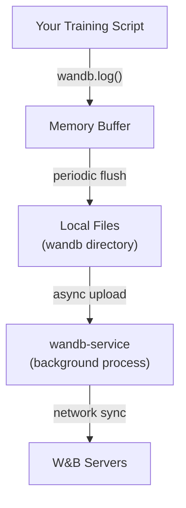

This guide explains how the W&B SDK handles logging internally, including its event-driven architecture, performance characteristics, and best practices for CPU/GPU synchronization.

## Overview

The W&B SDK uses an event-driven architecture with performance in mind that minimizes impact on your training loops. Here's what you need to know:

- **Non-blocking operations**: W&B operates in a separate process with non-blocking function calls
- **Asynchronous data handling**: The SDK buffers logging data and sends it asynchronously to avoid blocking your training
- **Minimal overhead**: Under normal usage (logging less than once per second), W&B adds minimal overhead to your training

## Event-driven architecture

### How W&B handles logging

When you call `wandb.log()`, here's what happens under the hood:

1. **Data Buffering**: Your metrics are first written to an in-memory buffer
2. **File Streaming**: Data is periodically flushed from the buffer to local files in the `wandb` directory
3. **Background Syncing**: A separate process (wandb-service) handles uploading data to the W&B servers
4. **Non-blocking Returns**: The `log()` call returns immediately without waiting for uploads

```python
# This call returns immediately - doesn't wait for server upload
wandb.log({"loss": 0.5, "accuracy": 0.92})
```

### Architecture diagram



## CPU and GPU synchronization

### The challenge

When training on GPU devices, you often want to log metrics without forcing CPU-GPU synchronization. Forcing the CPU to wait for GPU computations can slow down training.

### How W&B solves this

W&B's architecture avoids most synchronization issues:

```python
# Good: This doesn't block on GPU computation
loss = model(x)  # GPU operation
wandb.log({"loss": loss})  # Returns immediately

# The actual value is only read when needed
```

If you're logging high-frequency GPU data, consider these patterns:

### Pattern 1: Batch logging

Instead of logging every step, accumulate metrics and log periodically:

```python
losses = []
for batch_idx, (x, y) in enumerate(dataloader):
    x, y = x.to(device), y.to(device)
    y_pred = model(x)
    loss = criterion(y_pred, y)
    
    # Accumulate without forcing synchronization
    losses.append(loss)
    
    # Log every N batches
    if batch_idx % log_interval == 0:
        # This forces synchronization only every N batches
        wandb.log({
            "loss": torch.stack(losses).mean().item(),
            "batch": batch_idx
        })
        losses = []
    
    optimizer.zero_grad()
    loss.backward()
    optimizer.step()
```

### Pattern 2: Deferred logging

For truly asynchronous logging, defer metric computation:

```python
# Store references without forcing computation
gpu_metrics = []

for batch_idx, (x, y) in enumerate(dataloader):
    x, y = x.to(device), y.to(device)
    y_pred = model(x)
    loss = criterion(y_pred, y)
    
    # Store the tensor reference (no sync)
    gpu_metrics.append({
        "batch": batch_idx,
        "loss": loss.detach()  # Detach from computation graph
    })
    
    optimizer.zero_grad()
    loss.backward()
    optimizer.step()

# After epoch, log all metrics at once
for metric in gpu_metrics:
    wandb.log({
        "loss": metric["loss"].item(),  # CPU sync happens here
        "batch": metric["batch"]
    })
```

## Performance guidelines

### What you should know

1. **Logging Frequency**: W&B handles logging rates up to a few times per second efficiently. For higher frequencies, batch your metrics.

2. **Data Size**: Each log call should contain at most a few megabytes of data. Sample or summarize large tensors.

3. **Network Failures**: W&B handles network issues with exponential back-off and retry logic. Network issues won't interrupt your training.

### What not to worry about

1. **Network Latency**: Uploads happen in a background process and won't block training
2. **Disk I/O**: W&B uses efficient buffering to reduce disk operations  
3. **Server Availability**: Local logging continues even if servers are unavailable
4. **Memory Usage**: W&B automatically manages buffer sizes to prevent memory issues

### What to watch for

1. **Excessive Logging Frequency**:
   ```python
   # Bad: Logging too frequently
   for i in range(1000):
       wandb.log({"metric": i})  # Don't do this in a tight loop
   
   # Good: Batch your logging
   metrics = []
   for i in range(1000):
       metrics.append(i)
   wandb.log({"metrics": metrics})
   ```

2. **Large Data Volumes**:
   ```python
   # Bad: Logging large tensors directly
   wandb.log({"huge_tensor": model.state_dict()})  # Don't log entire models
   
   # Good: Log summaries or samples
   wandb.log({"weight_norm": compute_weight_norm(model)})
   ```

3. **Forced Synchronization**:
   ```python
   # Bad: Forces GPU-CPU sync every iteration
   for batch in dataloader:
       loss = model(batch)
       wandb.log({"loss": loss.item()})  # .item() forces sync
   
   # Good: Log less frequently
   if step % 100 == 0:
       wandb.log({"loss": loss.item()})
   ```

## Best practices

### 1. Log strategically

```python
# Log important metrics every N steps
if step % args.log_interval == 0:
    wandb.log({
        "train/loss": loss.item(),
        "train/accuracy": accuracy,
        "train/learning_rate": scheduler.get_last_lr()[0],
        "train/epoch": epoch,
    })
```

### 2. Use histograms for distributions

Instead of logging individual values, use histograms:

```python
# Instead of logging each gradient
wandb.log({"gradients": wandb.Histogram(gradients)})
```

### 3. Profile your logging

If you're concerned about performance, profile your logging:

```python
import time

# Measure logging overhead
start = time.time()
wandb.log({"metric": value})
log_time = time.time() - start

if log_time > 0.001:  # If logging takes more than 1ms
    print(f"Warning: Logging took {log_time:.3f}s")
```

### 4. Use tables for structured data

For complex data, use W&B Tables which optimize for performance:

```python
# Log predictions efficiently
if epoch % val_interval == 0:
    table = wandb.Table(columns=["image", "prediction", "truth"])
    for img, pred, truth in val_samples:
        table.add_data(wandb.Image(img), pred, truth)
    wandb.log({"predictions": table})
```

## Summary

The W&B SDK has minimal impact on your training performance:

- **Event-driven architecture** ensures non-blocking operations
- **Background syncing** handles network communication without blocking training  
- **Smart buffering** manages memory and disk I/O efficiently
- **Graceful degradation** continues local logging even during network issues

For optimal performance:
- Log at reasonable frequencies (< few times per second)
- Batch high-frequency metrics
- Avoid forcing GPU-CPU synchronization when not needed
- Use W&B's specialized data types (Histogram, Table, Image) for complex data

The SDK handles the complexity of distributed logging so you can focus on your experiments without worrying about logging infrastructure.
