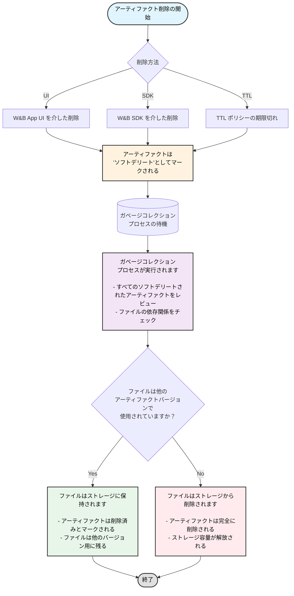

W&B App UI を使って対話的に、または W&B SDK を使ってプログラムでアーティファクトを削除します。アーティファクトを削除すると、W&B はそのアーティファクトを *ソフトデリート* としてマークします。つまり、アーティファクトは削除対象としてマークされますが、ファイルはストレージからすぐに削除されません。
アーティファクトの内容は、定期的に実行されるガベージコレクションプロセスが、削除対象としてマークされたすべてのアーティファクトをレビューするまで、ソフトデリート、つまり削除保留状態のままになります。ガベージコレクションプロセスは、そのアーティファクトとその関連ファイルが、以前または以降のアーティファクトのバージョンによって使用されていない場合、関連するファイルをストレージから削除します。
## アーティファクトのガベージコレクションワークフロー
次の図は、アーティファクトのガベージコレクションプロセス全体を示しています。

このページのセクションでは、特定のアーティファクトバージョンを削除する方法、アーティファクトコレクションを削除する方法、エイリアスのあるアーティファクトとないアーティファクトを削除する方法などを説明します。TTL ポリシーを使用すると、W&B からアーティファクトが削除されるタイミングをスケジュールできます。詳細については、[アーティファクト TTL ポリシーによるデータ保持の管理]() を参照してください。
{}
TTL ポリシーで削除がスケジュールされているアーティファクト、W&B SDK で削除されたアーティファクト、または W&B App UI で削除されたアーティファクトは、まずソフトデリートされます。ソフトデリートされたアーティファクトは、ハードデリートされる前にガベージコレクションを受けます。
{}
{}
エンティティ、project、またはアーティファクトコレクションを削除すると、このページで説明されているアーティファクトの削除プロセスもトリガーされます。run を削除する際、関連するアーティファクトの削除を選択した場合、それらのアーティファクトは同じソフトデリートおよびガベージコレクションワークフローに従います。
{}
### アーティファクトバージョンを削除する
アーティファクトバージョンを削除するには：
1.  アーティファクトの名前を選択します。これによりアーティファクトビューが展開され、そのアーティファクトに関連付けられているすべてのアーティファクトバージョンが一覧表示されます。
2.  アーティファクトのリストから、削除したいアーティファクトバージョンを選択します。
3.  workspace の右側にあるケバブドロップダウンを選択します。
4.  「削除」を選択します。
アーティファクトバージョンは、[delete()]() メソッドを介してプログラムで削除することもできます。以下の例を参照してください。
### エイリアスを持つ複数のアーティファクトバージョンを削除する
次のコード例は、エイリアスが関連付けられているアーティファクトを削除する方法を示しています。アーティファクトを作成したエンティティ、project 名、および run ID を指定します。
```python
import wandb

run = api.run("entity/project/run_id")

for artifact in run.logged_artifacts():
    artifact.delete()
```
アーティファクトに1つ以上のエイリアスがある場合にエイリアスを削除するには、`delete_aliases` パラメータをブール値 `True` に設定します。
```python
import wandb

run = api.run("entity/project/run_id")

for artifact in run.logged_artifacts():
    # 1つ以上のエイリアスを持つ
    # アーティファクトを削除するには、delete_aliases=True を設定します。
    artifact.delete(delete_aliases=True)
```
### 特定のエイリアスを持つ複数のアーティファクトバージョンを削除する
続くコードは、特定のエイリアスを持つ複数のアーティファクトバージョンを削除する方法を示しています。アーティファクトを作成したエンティティ、project 名、および run ID を指定します。削除ロジックを独自のものに置き換えてください。
```python
import wandb

runs = api.run("entity/project_name/run_id")

# エイリアス 'v3' および 'v4' を持つアーティファクトを削除
for artifact_version in runs.logged_artifacts():
    # 独自の削除ロジックに置き換えてください。
    if artifact_version.name[-2:] == "v3" or artifact_version.name[-2:] == "v4":
        artifact.delete(delete_aliases=True)
```
### 保護されたエイリアスと削除権限
保護されたエイリアスを持つアーティファクトには、特別な削除制限があります。[保護されたエイリアス]() は、Model Registry のエイリアスであり、レジストリアドミンが不正な削除を防ぐために設定できます。
{}
**保護されたエイリアスに関する重要な考慮事項:**
- 保護されたエイリアスを持つアーティファクトは、レジストリアドミン以外のユーザーは削除できません。
- レジストリ内では、レジストリアドミンは保護されたアーティファクトバージョンをリンク解除したり、保護されたエイリアスを含むコレクション/レジストリを削除したりできます。
- ソースアーティファクトの場合：ソースアーティファクトが保護されたエイリアスを持つレジストリにリンクされている場合、いかなるユーザーも削除できません。
- レジストリアドミンは、ソースアーティファクトから保護されたエイリアスを削除し、その後それらを削除できます。
{}
### エイリアスを持たないアーティファクトのすべてのバージョンを削除する
次のコードスニペットは、エイリアスを持たないアーティファクトのすべてのバージョンを削除する方法を示しています。`wandb.Api` の `project` および `entity` キーに、それぞれ project 名とエンティティ名を指定します。`< >` をアーティファクトの名前に置き換えてください。
```python
import wandb

# wandb.Api メソッドを使用する際は、
# エンティティと project 名を指定してください。
api = wandb.Api(overrides={"project": "project", "entity": "entity"})

artifact_type, artifact_name = "<>"  # provide type and name
for v in api.artifact_versions(artifact_type, artifact_name):
    # 「latest」などのエイリアスを持たないバージョンをクリーンアップします。
    # 注：ここに任意の削除ロジックを記述できます。
    if len(v.aliases) == 0:
        v.delete()
```
### アーティファクトコレクションを削除する
アーティファクトコレクションを削除するには：
1.  削除したいアーティファクトコレクションに移動し、マウスカーソルを合わせます。
2.  アーティファクトコレクション名の横にあるケバブドロップダウンを選択します。
3.  「削除」を選択します。
[delete()]() メソッドを使用して、アーティファクトコレクションをプログラムで削除することもできます。`wandb.Api` の `project` および `entity` キーに、それぞれ project 名とエンティティ名を指定します。
```python
import wandb

# wandb.Api メソッドを使用する際は、
# エンティティと project 名を指定してください。
api = wandb.Api(overrides={"project": "project", "entity": "entity"})
collection = api.artifact_collection(
    "<artifact_type>", "entity/project/artifact_collection_name"
)
collection.delete()
```
## W&B のホスティング方法に基づくガベージコレクションの有効化方法
W&B の共有クラウドを使用している場合、ガベージコレクションはデフォルトで有効になっています。W&B のホスティング方法によっては、ガベージコレクションを有効にするために追加の手順が必要となる場合があります。これには以下が含まれます。
*   `GORILLA_ARTIFACT_GC_ENABLED` 環境変数を true に設定します: `GORILLA_ARTIFACT_GC_ENABLED=true`
*   [AWS](https://docs.aws.amazon.com/AmazonS3/latest/userguide/manage-versioning-examples.html)、[GCP](https://cloud.google.com/storage/docs/object-versioning)、または [Minio](https://min.io/docs/minio/linux/administration/object-management/object-versioning.html#enable-bucket-versioning) などの他のストレージプロバイダーを使用している場合は、バケットのバージョン管理を有効にします。Azure を使用している場合は、[ソフトデリートを有効にします](https://learn.microsoft.com/azure/storage/blobs/soft-delete-blob-overview)。
    {}
    Azure のソフトデリートは、他のストレージプロバイダーにおけるバケットのバージョン管理に相当します。
    {}
次の表は、デプロイタイプに基づいてガベージコレクションを有効にするための要件を満たす方法を説明しています。
`X` は要件を満たす必要があることを示します。
|                                                | 環境変数                | バージョン管理を有効にする |
| :--------------------------------------------- | :---------------------- | :----------------------- |
| 共有クラウド                                   |                         |                          |
| [セキュアストレージコネクタ]() を使用した共有クラウド |                         | X                        |
| 専用クラウド                                   |                         |                          |
| [セキュアストレージコネクタ]() を使用した専用クラウド |                         | X                        |
| 顧客管理クラウド                               | X                       | X                        |
| 顧客管理オンプレミス                           | X                       | X                        |
{}note
セキュアストレージコネクタは現在、Google Cloud Platform および Amazon Web Services のみで利用可能です。
{}