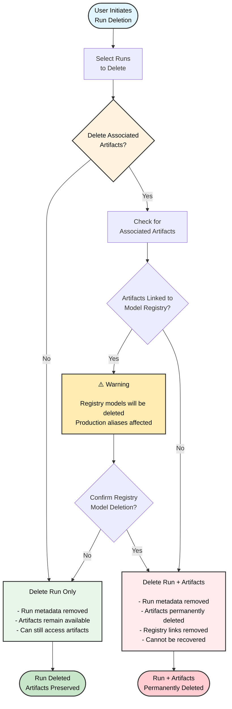

A *run* は、W&B が記録する 1 回分の計算単位です。W&B の Run は、あなたのプロジェクト全体を構成する原子的な要素だと考えることができます。つまり、各 run は特定の計算の記録であり、たとえば モデルのトレーニングと結果のログ、ハイパーパラメーター探索 などが該当します。

run の開始によくあるパターンは次のとおりですが、これらに限りません:

* モデルをトレーニングする
* ハイパーパラメーターを変更して新しい実験を行う
* 別のモデルで新しい 機械学習 の実験を行う
* [W&B Artifact をログする]()
* [W&B Artifact をダウンロードする]()

W&B は、作成した run を [*Projects*]() に保存します。W&B App の、その run のプロジェクトの Workspace で run とそのプロパティを確認できます。[`wandb.Api.Run`]() オブジェクトを使って、プログラムから run のプロパティに アクセス することもできます。

`wandb.Run.log()` でログしたものは、その run に記録されます。

{{ %alert% }}
以下のコードスニペットを試す場合は、`entity` 変数にあなたの W&B entity を設定してください。entity はあなたの W&B のユーザー名またはチーム名です。W&B App の Workspace の URL で確認できます。たとえば Workspace の URL が `https://wandb.ai/nico/awesome-project` の場合、entity は `nico` です。
{{ /%alert% }}

```python
import wandb

entity = "nico"  # あなたの W&B entity に置き換えてください
project = "awesome-project"

with wandb.init(entity=entity, project=project) as run:
    run.log({"accuracy": 0.9, "loss": 0.1})
```

1 行目で W&B Python SDK をインポートします。2 行目で entity `nico` 配下のプロジェクト `awesome-project` に run を初期化します。3 行目でその run にモデルの accuracy と loss をログします。

ターミナルでは、W&B は次のように表示します:

```bash
wandb: Syncing run earnest-sunset-1
wandb: ⭐️ View project at https://wandb.ai/nico/awesome-project
wandb: 🚀 View run at https://wandb.ai/nico/awesome-project/runs/1jx1ud12
wandb:                                                                                
wandb: 
wandb: Run history:
wandb: accuracy ▁
wandb:     loss ▁
wandb: 
wandb: Run summary:
wandb: accuracy 0.9
wandb:     loss 0.5
wandb: 
wandb: 🚀 View run earnest-sunset-1 at: https://wandb.ai/nico/awesome-project/runs/1jx1ud12
wandb: ⭐️ View project at: https://wandb.ai/nico/awesome-project
wandb: Synced 6 W&B file(s), 0 media file(s), 0 artifact file(s) and 0 other file(s)
wandb: Find logs at: ./wandb/run-20241105_111006-1jx1ud12/logs
```

ターミナルに表示される URL を開くと、W&B App のその run の Workspace に移動します。Workspace に生成される パネル は、この例では単一のポイントに対応します。



ある 1 時点のメトリクスだけをログしても有用性は高くありません。識別モデルのトレーニングでは、一定間隔でメトリクスをログする方が現実的です。たとえば次のコードスニペットを考えてみましょう:

```python
import wandb
import random

config = {
    "epochs": 10,
    "learning_rate": 0.01,
}

with wandb.init(project="awesome-project", config=config) as run:
    print(f"lr: {config['learning_rate']}")
      
    # トレーニング run をシミュレート
    for epoch in range(config['epochs']):
      offset = random.random() / 5
      acc = 1 - 2**-epoch - random.random() / (epoch + 1) - offset
      loss = 2**-epoch + random.random() / (epoch + 1) + offset
      print(f"epoch={epoch}, accuracy={acc}, loss={loss}")
      run.log({"accuracy": acc, "loss": loss})
```

次のような出力になります:

```bash
wandb: Syncing run jolly-haze-4
wandb: ⭐️ View project at https://wandb.ai/nico/awesome-project
wandb: 🚀 View run at https://wandb.ai/nico/awesome-project/runs/pdo5110r
lr: 0.01
epoch=0, accuracy=-0.10070974957523078, loss=1.985328507123956
epoch=1, accuracy=0.2884687745057535, loss=0.7374362314407752
epoch=2, accuracy=0.7347387967382066, loss=0.4402409835486663
epoch=3, accuracy=0.7667969248039795, loss=0.26176963846423457
epoch=4, accuracy=0.7446848791003173, loss=0.24808611724405083
epoch=5, accuracy=0.8035095836268268, loss=0.16169791827329466
epoch=6, accuracy=0.861349032371624, loss=0.03432578493587426
epoch=7, accuracy=0.8794926436276016, loss=0.10331872172219471
epoch=8, accuracy=0.9424839917077272, loss=0.07767793473500445
epoch=9, accuracy=0.9584880427028566, loss=0.10531971149250456
wandb: 🚀 View run jolly-haze-4 at: https://wandb.ai/nico/awesome-project/runs/pdo5110r
wandb: Find logs at: wandb/run-20241105_111816-pdo5110r/logs
```

トレーニング スクリプトは `wandb.Run.log()` を 10 回呼び出します。呼び出すたびに、そのエポックの accuracy と loss がログされます。先ほどの出力に表示された URL を開くと、W&B App のその run の Workspace に移動します。

W&B は、このシミュレーションのトレーニングループを `jolly-haze-4` という 1 つの run にまとめて記録します。これは、スクリプトが `wandb.init()` メソッドを 1 回だけ呼び出しているためです。



別の例として、[sweep]() の最中は、W&B が指定したハイパーパラメーター空間を探索します。sweep が生成する各ハイパーパラメーターの組み合わせは、固有の run として実行されます。

## Initialize a W&B Run

[`wandb.init()`]() で W&B Run を初期化します。以下のコードスニペットは、W&B Python SDK をインポートして run を初期化する方法を示します。

山かっこ（`< >`）で囲まれた値は、自分の値に置き換えてください:

```python
import wandb

with wandb.init(entity="<entity>", project="<project>") as run:
    # ここにあなたのコード
```

run を初期化すると、W&B は `wandb.init(project="<project>"` で指定したプロジェクトに run をログします。指定したプロジェクトが存在しない場合、W&B は新しいプロジェクトを作成します。既に存在する場合は、そのプロジェクトに run を保存します。

{}
プロジェクト名を指定しない場合、W&B は run を `Uncategorized` というプロジェクトに保存します。
{}

W&B の各 run には、[*run ID* と呼ばれる固有の識別子]()があります。[自分で一意の ID を指定する]()ことも、[W&B にランダム生成させる]()こともできます。

各 run には、人間が読める非一意の [run name]() もあります。自分で名前を付けることも、W&B にランダム生成させることもできます。run は初期化後にリネームできます。

例として、次のコードスニペットを見てみましょう:

```python title="basic.py"
import wandb

run = wandb.init(entity="wandbee", project="awesome-project")
```
このコードスニペットは次の出力を生成します:

```bash
🚀 View run exalted-darkness-6 at: 
https://wandb.ai/nico/awesome-project/runs/pgbn9y21
Find logs at: wandb/run-20241106_090747-pgbn9y21/logs
```

上のコードは id パラメーターを指定していないため、W&B が一意の run ID を作成します。ここで、`nico` は run をログした entity、`awesome-project` は run をログしたプロジェクト名、`exalted-darkness-6` は run の名前、`pgbn9y21` は run ID です。

{}
run の最後で `run.finish()` を呼び出して、run を終了済みとしてマークしてください。これにより、run が適切にプロジェクトへ記録され、バックグラウンドで動作し続けないようにできます。

```python title="notebook.ipynb"
import wandb

run = wandb.init(entity="<entity>", project="<project>")
# トレーニングのコードやログ処理など
run.finish()
```
{}

[run をグループ化]() して実験単位で扱う場合、run をグループに入れたり出したり、別グループへ移動したりできます。

各 run には現在の状態を表す state があります。可能な状態の一覧は [Run の状態]() を参照してください。

## Run states
以下の表は、run が取りうる状態を示します:

| State | 説明 |
| ----- | ----- |
| `Crashed` | マシンがクラッシュするなどして内部プロセスのハートビートが停止しました。 | 
| `Failed` | 非ゼロの終了ステータスで終了しました。 | 
| `Finished`| run が終了し、データが完全に同期されたか、`wandb.Run.finish()` が呼ばれました。 |
| `Killed` | 終了前に強制停止されました。 |
| `Running` | 実行中で、最近ハートビートを送信しました。  |

## Unique run identifiers

Run ID は run の一意な識別子です。デフォルトでは、新しい run を初期化するときに [W&B がランダムな一意の run ID を生成]()します。初期化時に [独自の run ID を指定する]()こともできます。

### Autogenerated run IDs

run を初期化するときに run ID を指定しない場合、W&B がランダムな run ID を生成します。run の一意 ID は W&B App で確認できます。

1. [W&B App](https://wandb.ai/home) に移動します。
2. run を初期化した際に指定した W&B のプロジェクトに移動します。
3. プロジェクトの Workspace で **Runs** タブを選択します。
4. **Overview** タブを選択します。

**Run path** フィールドに一意の run ID が表示されます。run path はチーム名、プロジェクト名、run ID で構成され、最後の部分が一意 ID です。

たとえば、次の画像では一意の run ID は `9mxi1arc` です:



### Custom run IDs
[`wandb.init()`]() メソッドに `id` パラメーターを渡して、独自の run ID を指定できます。

```python 
import wandb

run = wandb.init(entity="<project>", project="<project>", id="<run-id>")
```

run の一意 ID を使って、W&B App のその run の Overview ページに直接移動できます。次のセルは特定の run の URL パスを示します:

```text title="特定の run の W&B App URL"
https://wandb.ai/<entity>/<project>/<run-id>
```

山かっこ（`< >`）の値は、entity、project、run ID の実際の値のプレースホルダーです。

## Name your run 
run 名は、人間が読める非一意の識別子です。

デフォルトでは、新しい run を初期化すると W&B がランダムな run 名を生成します。run 名は、プロジェクトの Workspace 内や [run の Overview ページ]() の上部に表示されます。

{}
プロジェクトの Workspace で run を素早く見分ける手段として run 名を活用してください。
{}

[`wandb.init()`]() メソッドに `name` パラメーターを渡して、run に名前を付けられます。

```python 
import wandb

with wandb.init(entity="<project>", project="<project>", name="<run-name>") as run:
    # ここにあなたのコード
```

### Rename a run

run の初期化後は、Workspace または **Runs** ページからリネームできます。

1. 対象の W&B プロジェクトに移動します。
1. プロジェクトのサイドバーで **Workspace** または **Runs** タブを選びます。
1. リネームしたい run を検索またはスクロールで見つけます。

    run 名にカーソルを合わせて縦三点のメニューをクリックし、スコープを選びます:
    - **Rename run for project**: プロジェクト全体で run 名を変更します。
    - **Rename run for workspace**: この Workspace 内でのみ run 名を変更します。
1. 新しい名前を入力します。空欄のまま送信すると、新しいランダム名が生成されます。
1. 送信すると新しい run 名が表示されます。Workspace でカスタム名が付けられた run には情報アイコンが表示されます。詳細はホバーで確認できます。

[report]() の run set からリネームすることもできます:

1. レポート内で鉛筆アイコンをクリックしてレポートエディタを開きます。
1. run set でリネームしたい run を探します。レポート名にホバーし、縦三点をクリックして次のいずれかを選びます:

  - **Rename run for project**: プロジェクト全体で run をリネームします。空欄にすると新しいランダム名を生成します。
  - **Rename run for panel grid**: レポート内でのみ run をリネームし、他のコンテキストの既存名は保持します。ランダム名の再生成はサポートされていません。

  フォームを送信します。
1. **Publish report** をクリックします。

## Add a note to a run
特定の run に追加したノートは、run ページの **Overview** タブやプロジェクトページの run テーブルに表示されます。

1. 対象の W&B プロジェクトに移動します
2. プロジェクトのサイドバーから **Workspace** タブを選びます
3. run セレクターからノートを追加したい run を選びます
4. **Overview** タブを選びます
5. **Description** フィールドの鉛筆アイコンを選び、ノートを追加します

## Stop a run
W&B App から、またはプログラムから run を停止できます。


  {}
1. run を初期化したターミナルまたはエディタに戻ります。
2. `Ctrl+D` を押して run を停止します。

たとえば、上記の手順に従うとターミナルは次のようになります: 

```bash
KeyboardInterrupt
wandb: 🚀 View run legendary-meadow-2 at: https://wandb.ai/nico/history-blaster-4/runs/o8sdbztv
wandb: Synced 5 W&B file(s), 0 media file(s), 0 artifact file(s) and 1 other file(s)
wandb: Find logs at: ./wandb/run-20241106_095857-o8sdbztv/logs
```

run がアクティブでなくなったことを W&B App で確認します:

1. run をログしていたプロジェクトに移動します。
2. run 名を選択します。 
  {}
  停止した run の名前は、ターミナルやエディタの出力に表示されます。たとえば上の例では run 名は `legendary-meadow-2` です。
  {}
3. プロジェクトのサイドバーで **Overview** タブを選びます。

**State** フィールドの隣で、run の状態が `running` から `Killed` に変わります。

  
  {}
  {}

1. run をログしているプロジェクトに移動します。
2. run セレクターで停止したい run を選びます。
3. プロジェクトのサイドバーで **Overview** タブを選びます。
4. **State** フィールドの横にある上部のボタンを選びます。


**State** フィールドの隣で、run の状態が `running` から `Killed` に変わります。

  
  {}


可能な run の状態一覧は [State fields]() を参照してください。

## View logged runs

特定の run の情報（run の状態、その run にログされた Artifacts、run 中に記録されたログファイルなど）を表示できます。 



特定の run を表示するには:

1. [W&B App](https://wandb.ai/home) に移動します。
2. run を初期化した際に指定した W&B のプロジェクトに移動します。
3. プロジェクトのサイドバーで **Workspace** タブを選びます。
4. run セレクターで表示したい run をクリックするか、run 名の一部を入力して一致する run を絞り込みます。

特定の run の URL パスは、次の形式です:

```text
https://wandb.ai/<team-name>/<project-name>/runs/<run-id>
```

山かっこ（`< >`）の値は、チーム名、プロジェクト名、run ID の実際の値のプレースホルダーです。

### Customize how runs are displayed
このセクションでは、プロジェクトの Workspace と Runs テーブルでの run の表示方法をカスタマイズする方法を説明します。

{}
Workspace は設定に関わらず、最大 1000 件の run までしか表示できません。
{}

#### Add or remove columns

Runs テーブルや Workspace に表示する列をカスタマイズするには:
1. プロジェクトのサイドバーで **Runs** タブまたは **Workspace** タブを選びます。
1. run の一覧の上にある **Columns** をクリックします。
1. 非表示の列名をクリックすると表示され、表示中の列名をクリックすると非表示になります。
    列名はあいまい検索・完全一致・正規表現で検索できます。ドラッグして列の順序を変更できます。
1. **Done** をクリックして列ブラウザーを閉じます。

#### Sort runs by column

表示中の任意の列で run の一覧をソートするには:

1. 列名にカーソルを合わせ、アクションメニュー `...` をクリックします。
1. **Sort ascending** または **Sort descending** を選びます。

#### Pin columns

ピン留めした列は左側に表示されます。ピン留めしていない列は **Runs** タブの右側に表示され、**Workspace** タブには表示されません。

列をピン留めするには:
1. プロジェクトのサイドバーで **Runs** タブに移動します。
1. **Pin column** をクリックします。

ピン留めを解除するには:
1. プロジェクトのサイドバーで **Workspace** または **Runs** タブに移動します。
1. 列名にカーソルを合わせ、アクションメニュー `...` をクリックします。
1. **Unpin column** をクリックします。

#### Customize run name truncation

デフォルトでは、読みやすさのために長い run 名は中央が省略表示されます。省略位置をカスタマイズするには:

1. run の一覧上部のアクションメニュー `...` をクリックします。
1. **Run name cropping** で、末尾・中央・先頭のどこを省略するかを選びます。

### Overview tab
**Overview** タブでは、プロジェクト内の特定の run に関する次の情報を確認できます:

* **Author**: run を作成した W&B entity。
* **Command**: run を初期化したコマンド。
* **Description**: run に付けた説明。run 作成時に説明を指定しなかった場合は空です。W&B App UI または Python SDK から説明を追加できます。
* **Tracked Hours**: 一時停止や待ち時間を除き、run が実際に計算やデータのログに費やした時間。このメトリクスで、run にかかった実計算時間を把握できます。
* **Runtime**: run の開始から終了までの総時間（ウォールクロック）。リソース待ちや一時停止時間も含みます。run の経過時間の全体像を提供します。
* **Git repository**: run に関連付けられた Git リポジトリー。このフィールドを表示するには [Git を有効化]() する必要があります。
* **Host name**: W&B が run を計算した場所。ローカルで初期化した場合はあなたのマシン名が表示されます。
* **Name**: run の名前。
* **OS**: run を初期化したオペレーティングシステム。
* **Python executable**: run を開始したコマンド。
* **Python version**: run を作成した Python のバージョン。
* **Run path**: `entity/project/run-ID` 形式の一意の run 識別子。
* **Start time**: run を初期化した時刻。
* **State**: [run の状態]()。
* **System hardware**: W&B が run の計算に使用したハードウェア。
* **Tags**: 文字列のリスト。関連する run を整理したり、`baseline` や `production` のような一時的なラベルを付与するのに便利です。
* **W&B CLI version**: run コマンドを実行したマシンにインストールされている W&B CLI のバージョン。
* **Git state**: run を初期化したリポジトリーまたは作業ディレクトリーの最新の Git コミット SHA。run 作成時に Git を有効化していない、または Git 情報が取得できない場合は空です。

W&B は Overview セクションの下に、次の情報を表示します:

* **Artifact Outputs**: その run が生成した Artifact の出力。
* **Config**: [`wandb.Run.config`]() で保存された設定パラメータの一覧。
* **Summary**: [`wandb.Run.log()`]() で保存されたサマリーパラメータの一覧。デフォルトでは最後にログされた値が設定されます。



プロジェクト Overview の例は[こちら](https://wandb.ai/stacey/deep-drive/overview)。

### Workspace tab
Workspace タブでは、自動生成およびカスタムのプロットやシステムメトリクスなどの可視化を、閲覧・検索・グループ化・配置できます。 



プロジェクト Workspace の例は[こちら](https://wandb.ai/stacey/deep-drive/workspace?nw=nwuserstacey)

### Runs tab

Runs タブでは、run をフィルタ・グループ化・ソートできます。



上のタブでは、Runs タブで実行できる一般的な操作をいくつか紹介します。


   {}
Runs タブには、プロジェクト内の run の詳細が表示されます。デフォルトで多数の列が表示されます。

- すべての表示列を見るには、水平方向にスクロールします。
- 列の順序を変更するには、列を左右にドラッグします。
- 列をピン留めするには、列名にホバーして表示されるアクションメニュー `...` をクリックし、**Pin column** を選びます。ピン留めした列は **Name** 列の後、ページ左側付近に表示されます。ピン留めを解除するには **Unpin column** を選びます。
- 列を非表示にするには、列名にホバーして表示されるアクションメニュー `...` をクリックし、**Hide column** を選びます。現在非表示の列をすべて見るには **Columns** をクリックします。
- 複数の列をまとめて表示/非表示/ピン留め/ピン解除するには **Columns** をクリックします。
  - 非表示の列名をクリックすると表示します。
  - 表示中の列名をクリックすると非表示にします。
  - 表示中の列のピンアイコンをクリックするとピン留めします。

Runs タブのカスタマイズは、[Workspace タブ]() の **Runs** セレクターにも反映されます。

   {}

   {}
Table の任意の列の値で全行をソートできます。 

1. 列タイトルにマウスオーバーします。ケバブメニュー（三点リーダー）が表示されます。
2. そのケバブメニュー（三点）をクリックします。
3. **Sort Asc** または **Sort Desc** を選び、昇順/降順でソートします。 



上の画像は、`val_acc` という Table 列のソートオプションの表示例です。   
   {}
   {}
ダッシュボード上部の **Filter** ボタンで、式によって全行をフィルタできます。 



**Add filter** を選んで 1 つ以上のフィルターを追加します。3 つのドロップダウンが表示され、左から順に 列名・演算子・値 を指定します。

|                   | Column name | Binary relation    | Value       |
| -----------       | ----------- | ----------- | ----------- |
| Accepted values   | String       |  &equals;, &ne;, &le;, &ge;, IN, NOT IN,  | Integer, float, string, timestamp, null |

式エディタは、列名のオートコンプリートと論理述語の構造に基づき、各項目の候補を表示します。複数の論理述語は "and" または "or"（場合によっては括弧）で接続できます。


上の画像は `val_loss` 列に基づくフィルターを示しています。検証損失が 1 以下の run を表示しています。   
   {}
   {}
ダッシュボード上部の **Group by** ボタンで、特定の列の値ごとに全行をグループ化できます。 



デフォルトでは、他の数値列はヒストグラムになり、その列の値の分布をグループ別に表示します。グループ化は、データ内の高次のパターンを理解するのに役立ちます。 

{}
**Group by** 機能は、[run の run group]() とは別物です。run group で run をグループ化することも可能です。run を別の run group に移動するには、[Assign a group or job type to a run]() を参照してください。
{}

   {}


### Logs tab
**Logs** タブには、標準出力（`stdout`）や標準エラー（`stderr`）など、コマンドラインに出力された内容が表示されます。 

右上の **Download** ボタンを選ぶと、ログファイルをダウンロードできます。



Logs タブの例は[こちら](https://app.wandb.ai/stacey/deep-drive/runs/pr0os44x/logs)。

### Files tab
**Files** タブでは、特定の run に関連するファイル（モデルのチェックポイント、検証セットの例など）を確認できます



Files タブの例は[こちら](https://app.wandb.ai/stacey/deep-drive/runs/pr0os44x/files/media/images)。

### Artifacts tab
**Artifacts** タブには、指定した run の入出力 [Artifacts]() が一覧表示されます。



[Artifacts グラフの例を見る]()。

## Delete runs

W&B App から、プロジェクトの run を 1 件以上削除できます。

1. 削除したい run を含むプロジェクトに移動します。
2. プロジェクトのサイドバーで **Runs** タブを選びます。
3. 削除したい run のチェックボックスを選びます。
4. テーブル上部の **Delete**（ゴミ箱アイコン）を選びます。
5. 表示されるモーダルで **Delete** を選びます。

{}
特定の ID を持つ run を一度削除すると、その ID は二度と使用できません。以前に削除した ID で run を開始しようとすると、エラーが表示され、初期化できません。
{}

{}
run が非常に多いプロジェクトでは、検索バーで正規表現によるフィルタを使うか、Filter ボタンでステータス・タグ・その他のプロパティに基づいて run を絞り込んでから削除できます。 
{}

### Run deletion workflow

以下の図は、関連する Artifacts や Model Registry のリンク処理を含む、run 削除プロセス全体を示します:



{}
run を削除する際に関連する Artifacts も削除することを選ぶと、それらの Artifacts は完全に削除され、後から run を復元しても元に戻せません。Model Registry にリンクされたモデルも含まれます。
{}

## Organize runs 

このセクションでは、group と job type を使って run を整理する方法を説明します。run に group（例: 実験名）を割り当て、job type（例: preprocessing、training、evaluation、debugging）を指定すると、ワークフローを効率化し、モデル比較を改善できます。

### Assign a group or job type to a run

W&B の各 run には **group** と **job type** を設定できます:

- **Group**: 実験の大分類。run の整理やフィルタに使用します。
- **Job type**: run の役割（`preprocessing`、`training`、`evaluation` など）。

次の[例の Workspace](https://wandb.ai/stacey/model_iterz?workspace=user-stacey) では、Fashion-MNIST データセットのデータ量を増やしながらベースラインモデルを学習しています。Workspace では、使用したデータ量を色で表しています:

- **黄色から濃い緑** は、ベースラインモデルに使ったデータ量の増加を示します。
- **水色から紫〜マゼンタ** は、追加のパラメータを持つより複雑な "double" モデルのデータ量を示します。

W&B のフィルタや検索バーを使って、次のような条件で run を比較できます:
- 同じデータセットでトレーニングしている。
- 同じテストセットで評価している。

フィルタを適用すると **Table** ビューは自動的に更新されます。これにより、どのクラスが特定のモデルにとってより難しいかなど、モデル間の性能差を見つけやすくなります。