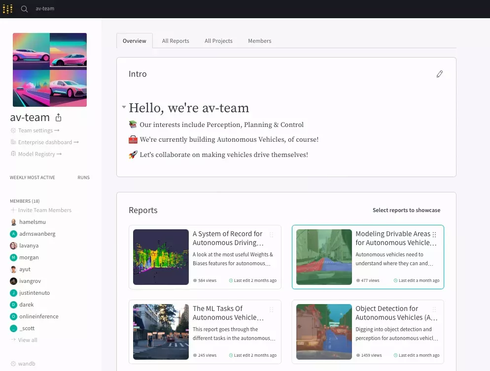

# Pages

## Home Page

Browse all your runs and projects. The home page pulls in projects from your personal account, as well as any projects you've contributed to in teams.

## Project Page

Compare models with different architectures and hyperparameters on the same set of metrics. Learn more [here](project-page.md).

## Run Page

Visualize the metrics and dataset examples from a single run. Learn more [here](run-page.md).

## Report Page

Compare results and describe your findings, then share links with colleagues. Learn more about Reports [here](../../../guides/reports/).

## Profile Page

Use your personal or team's profile page to showcase your work, find collaborators and easily navigate between projects.&#x20;

You can use your profile page to highlight your latest research by showcasing your best reports, projects and external links. Only projects and reports that visitors have access to will be displayed to them, showcasing does not change the permissions of the project or report.