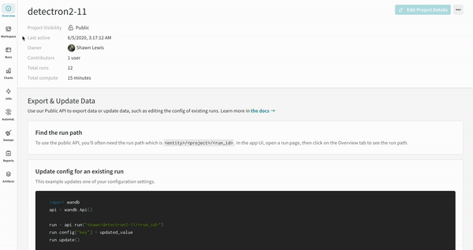
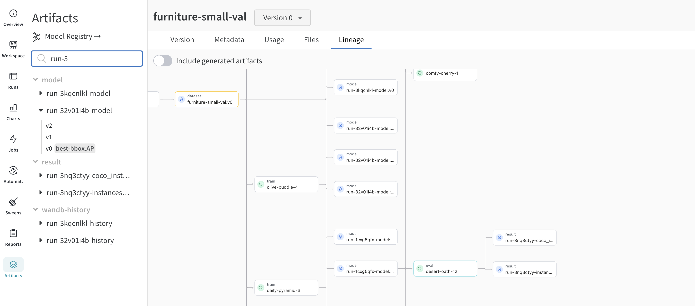
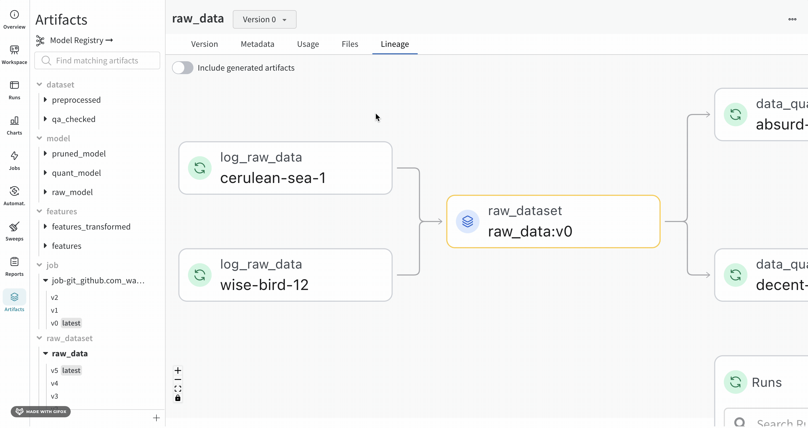
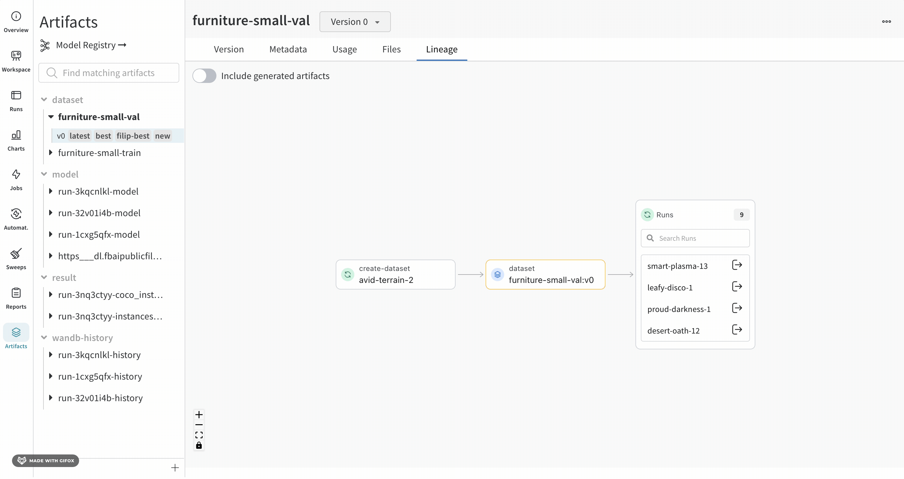
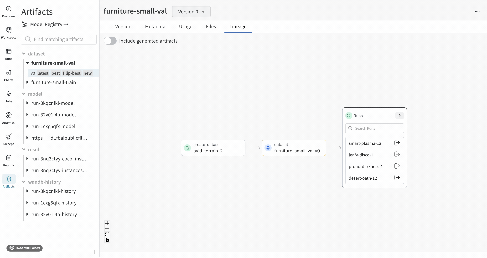

# Explore and traverse artifact graphs

<head>
    <title>Explore direct acyclic W&B Artifact graphs.</title>
</head>

W&Bは、特定の run がログした artifacts と、その run が使用した artifacts を自動で追跡します。これらの artifacts にはデータセット、モデル、評価結果、その他が含まれます。アーティファクトのリネージを探索することで、機械学習ライフサイクル全体にわたって生成されるさまざまな artifacts を追跡し、管理することができます。

## Lineage
アーティファクトのリネージを追跡することには、いくつかの重要な利点があります：

- 再現性: すべてのアーティファクトのリネージを追跡することで、チームは実験、モデル、および結果を再現することができ、デバッグ、実験、および機械学習モデルの検証にとって不可欠です。

- バージョン管理: アーティファクトのリネージは、アーティファクトのバージョン管理とその変更の追跡を含みます。これにより、必要に応じて以前のバージョンのデータまたはモデルにロールバックすることができます。

- 監査: アーティファクトとその変換の詳細な履歴があることで、組織は規制およびガバナンスの要件に準拠することができます。

- コラボレーションと知識共有: アーティファクトのリネージは、試みとその結果を明確に記録することで、チームメンバー間のより良いコラボレーションを促進します。これにより、努力の重複を避け、開発プロセスを加速します。

### Finding an artifact's lineage
**Artifacts** タブでアーティファクトを選択すると、そのアーティファクトのリネージを確認することができます。このグラフビューは、パイプラインの概要を示します。

アーティファクトグラフを表示するには：

1. W&BアプリのUIでプロジェクトに移動します
2. 左パネルのアーティファクトアイコンを選択します。
3. **Lineage** を選択します。



### Navigating the lineage graph

指定したアーティファクトまたはジョブタイプがその名前の前に表示され、アーティファクトは青いアイコン、run は緑のアイコンで表されます。矢印は、グラフ上の run またはアーティファクトの入力と出力の詳細を示します。



:::info
アーティファクトのタイプと名前は、左のサイドバーと **Lineage** タブの両方で確認できます。
:::



より詳細なビューを得るには、個々のアーティファクトまたは run をクリックして特定のオブジェクトに関する詳細情報を取得します。



### Artifact clusters

グラフのレベルに5つ以上の run またはアーティファクトがある場合、クラスターが作成されます。クラスターには、特定のバージョンの run またはアーティファクトを検索するための検索バーがあり、クラスター内のノードを個別に引き出してそのリネージを調査することができます。

ノードをクリックすると、ノードの概要を持つプレビューが開きます。矢印をクリックすると、個々の run またはアーティファクトが抽出され、抽出されたノードのリネージを調査することができます。



## Use the API to track lineage
[W&B API](../../ref/python/public-api/api.md) を使用してグラフをナビゲートすることもできます。

まず、`wandb.init`で run を作成し、次に新しいアーティファクトを作成するか、既存のアーティファクトを `wandb.Artifact` で取得します。次に、`.add_file` を使用してアーティファクトにファイルを追加します。最後に、そのアーティファクトを run に `log_artifact` でログします。完成したコードは以下のようになります：

```python
with wandb.init() as run:
    artifact = wandb.Artifact("artifact_name", "artifact_type")

    # ファイルとアセットをアーティファクトに追加するには
    # `.add`, `.add_file`, `.add_dir`, および `.add_reference` を使用します
    artifact.add_file("image1.png")
    run.log_artifact(artifact)
```

アーティファクトオブジェクトの[`logged_by`](../../ref/python/artifact.md#logged_by) および [`used_by`](../../ref/python/artifact.md#used_by) メソッドを使用して、アーティファクトからグラフを歩きます：

```python
# アーティファクトからグラフを上下に歩きます：
producer_run = artifact.logged_by()
consumer_runs = artifact.used_by()
```
## Next steps
- [Explore artifacts in more detail](../artifacts/artifacts-walkthrough.md)
- [Manage artifact storage](../artifacts/delete-artifacts.md)
- [Explore an artifacts project](https://wandb.ai/wandb-smle/artifact_workflow/artifacts/raw_dataset/raw_data/v0/lineage)