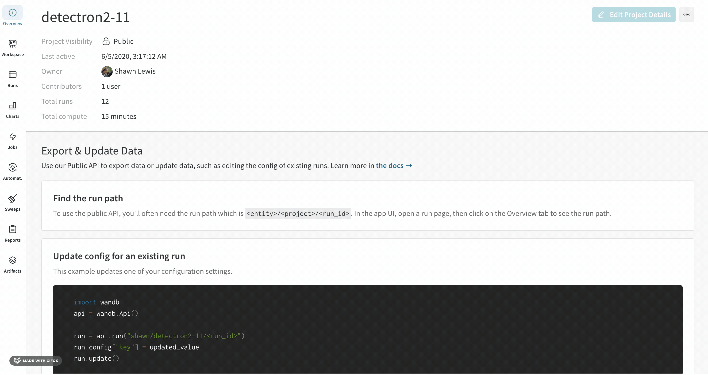
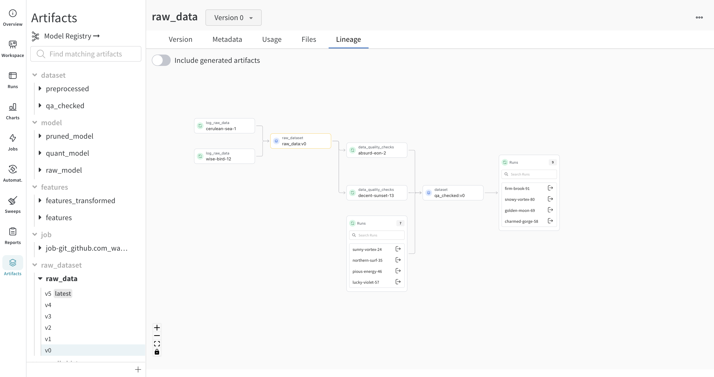

W&B는 특정 run에 로그된 아티팩트와 사용된 아티팩트를 자동으로 추적합니다. 이러한 아티팩트는 데이터셋, 모델, 평가 결과 등을 포함할 수 있습니다. 기계학습 수명주기 전반에 걸쳐 생성된 다양한 아티팩트를 추적하고 관리하기 위해 아티팩트의 계보를 탐색할 수 있습니다.

## Lineage
아티팩트의 계보를 추적하는 것에는 몇 가지 주요 이점이 있습니다:

- 재현성: 모든 아티팩트의 계보를 추적함으로써, 팀은 실험 및 모델, 결과를 재현할 수 있으며, 이는 디버깅, 실험 및 기계 학습 모델의 검증 기본이 됩니다.

- 버전 관리: 아티팩트 계보는 아티팩트의 버전을 관리하고 시간에 따라 변경 사항을 추적하는 것입니다. 이를 통해 필요한 경우 팀이 이전의 데이터 또는 모델의 버전으로 되돌릴 수 있습니다.

- 감사: 아티팩트와 그 변형에 대한 상세한 이력을 보유함으로써 조직은 규제 및 거버넌스 요구 사항을 준수할 수 있습니다.

- 협력 및 지식 공유: 아티팩트 계보는 시도의 명확한 기록을 제공함으로써 팀 멤버 간의 협력을 촉진하고, 성공한 것과 실패한 것을 명확히 하여 불필요한 노력을 예방하고 개발 과정을 가속화합니다.

### 아티팩트의 계보 찾기
**Artifacts** 탭에서 아티팩트를 선택하면, 아티팩트의 계보를 볼 수 있습니다. 이 그래프 뷰는 파이프라인의 일반적인 개요를 보여줍니다.

아티팩트 그래프를 보기 위해:

1. W&B 앱 UI에서 프로젝트로 이동합니다.
2. 왼쪽 패널에서 아티팩트 아이콘을 선택합니다.
3. **Lineage**를 선택합니다.



### 계보 그래프 네비게이션

제공된 아티팩트 또는 job 유형은 이름 앞에 나타나며, 아티팩트는 파란색 아이콘으로, run은 녹색 아이콘으로 표시됩니다. 화살표는 그래프 상에서 run 또는 아티팩트의 입력과 출력을 자세히 나타냅니다.



:::info
왼쪽 사이드바와 **Lineage** 탭 모두에서 아티팩트의 유형과 이름을 볼 수 있습니다.
:::


보다 자세한 정보를 보려면, 개별 아티팩트나 run을 클릭하여 특정 오브젝트에 대한 정보를 얻을 수 있습니다.


### 아티팩트 클러스터

그래프의 한 레벨에 run 또는 아티팩트가 다섯 개 이상 있을 때 클러스터가 생성됩니다. 클러스터에는 run 또는 아티팩트의 특정 버전을 찾기 위한 검색 창이 있으며, 클러스터 내 노드의 계보를 계속 조사할 수 있도록 클러스터에서 개별 노드를 끌어옵니다.

노드를 클릭하면 노드의 개요가 있는 미리보기가 열립니다. 화살표를 클릭하면 개별 run 또는 아티팩트가 추출되어 추출된 노드의 계보를 조사할 수 있습니다.


## API를 사용하여 계보 추적
[W&B API](../../ref/python/public-api/api.md)를 사용하여 그래프를 탐색할 수도 있습니다.

아티팩트를 생성하세요. 먼저, `wandb.init`으로 run을 만드세요. 그 다음, `wandb.Artifact`로 새로운 아티팩트를 생성하거나 기존 아티팩트를 검색하세요. 그 다음, `.add_file`로 아티팩트에 파일을 추가하세요. 마지막으로 `.log_artifact`로 아티팩트를 run에 로그하세요. 완성된 코드는 다음과 비슷합니다:

```python
with wandb.init() as run:
    artifact = wandb.Artifact("artifact_name", "artifact_type")

    # 아티팩트에 파일 및 자산 추가하기
    # `.add`, `.add_file`, `.add_dir`, 및 `.add_reference` 사용
    artifact.add_file("image1.png")
    run.log_artifact(artifact)
```

아티팩트 오브젝트의 [`logged_by`](../../ref/python/artifact.md#logged_by) 및 [`used_by`](../../ref/python/artifact.md#used_by) 메소드를 사용하여 아티팩트로부터 그래프를 탐색하세요:

```python
# 아티팩트로부터 그래프 위아래로 이동하기:
producer_run = artifact.logged_by()
consumer_runs = artifact.used_by()
```

## 다음 단계
- [아티팩트를 더 자세히 탐색하기](../artifacts/artifacts-walkthrough.md)
- [아티팩트 스토리지 관리하기](../artifacts/delete-artifacts.md)
- [아티팩트 프로젝트 탐색하기](https://wandb.ai/wandb-smle/artifact_workflow/artifacts/raw_dataset/raw_data/v0/lineage)