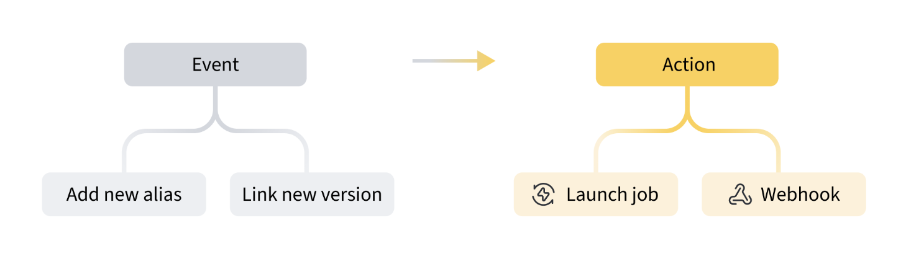

# Automations

 W&B offers tools to automate model deployment, downstream actions for versioning artifacts, and more.

## How it works

An automation needs an event and an action to work. An action triggers when a defined event occurs. For example, you could trigger a GitHub action workflow to run tests every time a new artifact links to your W&B Registry.

## Use cases
- **Automated model testing and deployment**: When a new model gets linked to a registry, it triggers an action like a GitHub Action workflow or a Amazon SageMaker endpoint to consume the model for testing and/or deployment.
- **Automated model retraining**: When there is a new version of the training dataset labeled as `production`, trigger a retraining launch job with the configuations from the current best performing model.
- **Automated performance report creation**: Create a report with performance information when uploading a new version of an evaluation or holdout dataset. 

## Get started
First, determine the scope of your automation. W&B offers two types of automation: registry automations and artifact automations. Which one you use depends on which changes you want to track. 

Then, you'll need to decide what type of action to configure. Webhooks can access external servers, while W&B Launch jobs allow you to launch runs with reusable and configurable templates.

More information on how to create automations [here](../artifacts/project-scoped-automations.md).

## Next steps
- [This](https://wandb.ai/wandb/wandb-model-cicd/reports/Model-CI-CD-with-W-B--Vmlldzo0OTcwNDQw) tutorial shows you how to set up an automation that triggers a GitHub Action for model evaluation and deployment
- [This](https://youtube.com/playlist?list=PLD80i8An1OEGECFPgY-HPCNjXgGu-qGO6&feature=shared) video series shows webhook basics and how to set them up in W&B.
- [This](https://www.youtube.com/watch?v=s5CMj_w3DaQ) demo details how to setup an automation to deploy a model to a SageMaker Endpoint.

