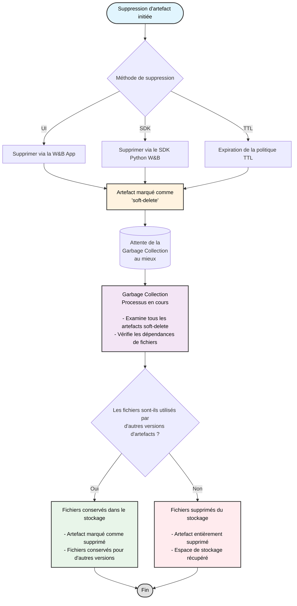

Supprimez des artefacts de manière interactive avec la W&amp;B App ou par programmation avec le SDK Python W&amp;B. Lorsque vous supprimez un artefact, W&amp;B marque cet artefact comme étant en *soft-delete*. En d&#39;autres termes, l&#39;artefact est marqué comme devant être supprimé, mais les fichiers ne sont pas immédiatement supprimés du stockage.

Le contenu de l&#39;artefact reste en état de *soft-delete*, c&#39;est-à-dire en attente de suppression, jusqu&#39;à ce qu&#39;un processus de garbage collection exécuté régulièrement examine tous les artefacts marqués pour suppression. Le processus de garbage collection supprime les fichiers associés du stockage si l&#39;artefact et ses fichiers associés ne sont utilisés par aucune version antérieure ou ultérieure de l&#39;artefact.

<Note>
  La garbage collection est effectuée au mieux. W&amp;B ne garantit pas le délai d&#39;apparition de l&#39;espace libéré dans votre stockage d’objets après la suppression d&#39;un artefact. Les déploiements volumineux ou les files d&#39;attente importantes peuvent prendre plus de temps que prévu. Pour savoir comment cela s&#39;articule avec les données d’exécution, les paramètres de rétention et les actions facultatives de l’opérateur, voir [Gérer le stockage du bucket et les coûts](/fr/platform/hosting/managing-bucket-storage).
</Note>

<div id="artifact-garbage-collection-workflow">
  ## Flux de travail de garbage collection des artefacts
</div>

Le schéma suivant illustre l’ensemble du processus de garbage collection des artefacts :



Vous pouvez planifier la suppression des artefacts de W&amp;B à l’aide de politiques TTL. Pour plus d&#39;informations, voir [Gérer la rétention des données avec la politique TTL des artefacts](./ttl).

<Note>
  Les artefacts supprimés par une politique TTL, le SDK Python de W&amp;B ou la W&amp;B App sont d’abord en soft-delete. Les artefacts en soft-delete sont ensuite soumis à la garbage collection avant d’être définitivement supprimés.
</Note>

<Note>
  La suppression d’une entité, d’un projet ou d’une collection d’artefacts déclenche le processus de suppression des artefacts décrit sur cette page. Lorsque vous supprimez une run et choisissez de supprimer les artefacts qui lui sont associés, ces artefacts suivent le même flux de travail de soft-delete et de garbage collection.
</Note>

<div id="delete-an-artifact-version">
  ## Supprimer une version d&#39;artefact
</div>

Supprimez une version d&#39;artefact de manière interactive dans la W&amp;B App ou par programmation avec le W&amp;B Python SDK.

<Tabs>
  <Tab title="W&B App" value="ui">
    Pour supprimer une version d&#39;artefact :

    1. Accédez au projet qui contient la version d&#39;artefact que vous souhaitez supprimer.
    2. Sélectionnez l&#39;onglet **Artifacts**.
    3. Dans la liste des types d&#39;artefact, sélectionnez le type d&#39;artefact qui contient la version que vous souhaitez supprimer.
    4. Cliquez sur le menu **d’actions (<Icon icon="ellipsis" iconType="solid" />)** à côté de la version d&#39;artefact que vous souhaitez supprimer.
    5. Dans le menu déroulant, choisissez **Supprimer la version**.
  </Tab>

  <Tab title="W&B Python SDK" value="sdk">
    Supprimez une version d&#39;artefact par programmation avec la méthode [wandb.Artifact.delete()](/fr/models/ref/python/experiments/artifact#delete). Indiquez le nom complet de l&#39;artefact. Le nom complet se compose de `<entity>/<project>/<artifact_name>:<version>`. Définissez le paramètre `delete_aliases` sur `True` pour supprimer l&#39;artefact même s&#39;il possède un ou plusieurs alias qui lui sont associés.

    ```python
    import wandb

    api = wandb.Api()

    # Obtenir l'artifact à partir de son chemin
    artifact = api.artifact("<entity>/<project>/<artifact_name>:<version>")

    # Supprimer la version de l'artifact ainsi que tous les alias
    artifact.delete(delete_aliases=True)
    ```
  </Tab>
</Tabs>

<div id="delete-multiple-artifact-versions">
  ## Supprimer plusieurs versions d&#39;artefact
</div>

L&#39;exemple de code suivant montre comment supprimer plusieurs versions d&#39;artefact. Indiquez l&#39;entité, le nom du projet et l&#39;ID du run ayant créé l&#39;artefact comme arguments de `wandb.Api.run()`. Cela renvoie un objet run que vous pouvez utiliser pour accéder à toutes les versions d&#39;artefact créées par ce run. Parcourez ensuite les versions d&#39;artefact et supprimez celles qui correspondent à vos critères.

<Tip>
  Définissez le paramètre `delete_aliases` sur `True` (`wandb.Artifact.delete(delete_aliases=True)`) pour supprimer une version d&#39;artefact ainsi que tous les alias qui lui sont associés.
</Tip>

Remplacez les espaces réservés `<entity>`, `<project>`, `<run_id>` et `<artifact_name>` par vos propres valeurs :

```python
import wandb

# Initialiser l'API W&B
api = wandb.Api()

# Obtenir le run par son chemin. Composé de <entity>/<project>/<run_id>
run = api.run("<entity>/<project>/<run_id>")

# Spécifier le nom de l'artifact dont les versions doivent être supprimées
artifact_name = "<artifact_name>"

# Rechercher et supprimer les versions d'artifact portant le nom spécifié
for artifact in run.logged_artifacts():
    print(f"Found artifact: {artifact.name}") # Exemple de nom : run_4dfbufgq_model:v0
    # Récupérer uniquement le nom de l'artifact sans la version grâce à split()
    if artifact.name.split(":")[0] == artifact_name:
        print(f"Suppression de la version d'artifact : {artifact.name}")
        artifact.delete(delete_aliases=True)
```

<div id="delete-multiple-artifact-versions-with-a-specific-alias">
  ## Supprimer plusieurs versions d’artefact avec un alias spécifique
</div>

Le code suivant montre comment supprimer plusieurs versions d’artefact ayant un alias spécifique.

Remplacez les espaces réservés `<entity>`, `<project>`, `<run_id>`, `<artifact_name>` et `<alias>` par vos propres valeurs :

```python
import wandb

# Initialiser l'API W&B
api = wandb.Api()

# Obtenir le run par son chemin. Composé de <entity>/<project>/<run_id>
run = api.run("<entity>/<project>/<run_id>")

# Spécifier le nom de l'artifact dont les versions doivent être supprimées
artifact_name = "<artifact_name>"

# Spécifier l'alias pour filtrer les versions d'artifact à supprimer
desired_alias = "<alias>"

# Supprimer les artifacts enregistrés dans le run avec les alias 'v3' et 'v4
for artifact in run.logged_artifacts():
    print(f"Found artifact: {artifact.name}")
    if (artifact.name.split(":")[0] == artifact_name) and (desired_alias in artifact.aliases):
            artifact.delete(delete_aliases=True)
```

<div id="delete-an-artifact-collection">
  ## Supprimer une collection d&#39;artefact
</div>

<Tabs>
  <Tab title="W&B App" value="ui">
    Pour supprimer une collection d&#39;artefact :

    1. Accédez à la collection d&#39;artefact que vous souhaitez supprimer.
    2. Sélectionnez le menu **d’actions (<Icon icon="ellipsis" iconType="solid" />)** à côté du nom de la collection d&#39;artefact.
    3. Dans le menu déroulant, sélectionnez **Delete**.
  </Tab>

  <Tab title="W&B Python SDK" value="sdk">
    Supprimez une collection d&#39;artefact par programmation à l&#39;aide de la méthode [wandb.Artifact.delete()](/fr/models/ref/python/experiments/artifact#delete).

    Indiquez le chemin complet de la collection d&#39;artefact dans `wandb.Api.artifact_collection(name="")`. Le chemin complet est au format `<entity>/<project>/<artifact_collection_name>`.

    ```python
    import wandb

    # Initialiser l'API W&B
    api = wandb.Api()

    # Obtenir la collection d'artifacts à partir de son chemin :
    # <entity>/<project>/<artifact_collection_name>
    collection = api.artifact_collection(
        type_name = "<artifact_type>",
        name = "<entity>/<project>/<artifact_collection_name>"
    )
    collection.delete()
    ```
  </Tab>
</Tabs>

<div id="protected-aliases-and-deletion-permissions">
  ## Alias protégés et autorisations de suppression
</div>

Les Artefacts avec des alias protégés sont soumis à des restrictions de suppression spécifiques. Les [alias protégés](/fr/models/registry/aliases#protected-aliases) sont des alias du W&amp;B Registry que les administrateurs du registre peuvent définir pour empêcher toute suppression non autorisée.

<Note>
  **Considérations importantes concernant les alias protégés :**

  * Les Artefacts avec des alias protégés ne peuvent pas être supprimés par des utilisateurs qui ne sont pas administrateurs du registre.
  * Au sein d’un registre, les administrateurs du registre peuvent dissocier des versions d’Artefacts protégées et supprimer des collections/registres contenant des alias protégés.
  * Pour les artefacts source : si un artefact source est lié à un registre avec un alias protégé, il ne peut être supprimé par aucun utilisateur
  * Les administrateurs du registre peuvent supprimer les alias protégés des artefacts source, puis les supprimer.
</Note>

<div id="enable-garbage-collection-based-on-how-wb-is-hosted">
  ## Activer le garbage collection selon le mode d’hébergement de W&amp;B
</div>

<Note>Le déclenchement du garbage collection n’est pas garanti. Voir [Gérer le stockage des buckets et les coûts](/fr/platform/hosting/managing-bucket-storage) pour plus de détails.</Note>

Le garbage collection est actif par défaut si vous utilisez le Cloud mutualisé de W&amp;B. Dans W&amp;B Dedicated et W&amp;B Autogéré, vous devrez peut-être effectuer les étapes supplémentaires suivantes pour activer le garbage collection.

1. **W&amp;B Autogéré** : définissez `GORILLA_ARTIFACT_GC_ENABLED=true`.
2. **Cloud dédié** : contactez l’assistance pour vérifier que le garbage collection est actif.
3. Activez la gestion des versions du bucket si vous utilisez [AWS](https://docs.aws.amazon.com/AmazonS3/latest/userguide/manage-versioning-examples.html), [Google Cloud](https://cloud.google.com/storage/docs/object-versioning) ou tout autre fournisseur de stockage comme [Minio](https://min.io/docs/minio/linux/administration/object-management/object-versioning.html#enable-bucket-versioning). Si vous utilisez Azure, [activez la suppression réversible](https://learn.microsoft.com/azure/storage/blobs/soft-delete-blob-overview), qui est l’équivalent de la gestion des versions du bucket.

Le tableau suivant indique comment remplir les conditions requises pour activer le garbage collection en fonction de votre type de déploiement.

Le `X` indique que vous devez remplir cette condition :

|                                                                                                           | Variable d’environnement | Activer la gestion des versions |
| --------------------------------------------------------------------------------------------------------- | ------------------------ | ------------------------------- |
| Cloud mutualisé de W&amp;B                                                                                |                          |                                 |
| Cloud mutualisé de W&amp;B avec [stockage BYOB](/fr/platform/hosting/data-security/secure-storage-connector) |                          | X                               |
| Cloud dédié                                                                                               |                          |                                 |
| Cloud dédié avec [stockage BYOB](/fr/platform/hosting/data-security/secure-storage-connector)                |                          | X                               |
| W&amp;B Autogéré                                                                                          | X                        | X                               |

<Note>
  remarque
  Le connecteur de stockage sécurisé est actuellement disponible uniquement pour Google Cloud Platform et Amazon Web Services.
</Note>