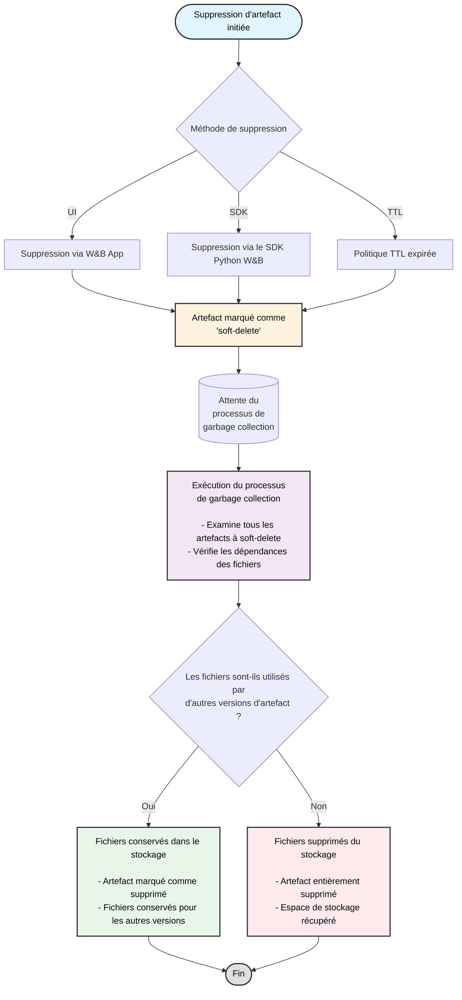

Supprimez des artefacts de manière interactive avec la W&amp;B App ou par programmation avec le SDK Python W&amp;B. Lorsque vous supprimez un artefact, W&amp;B le marque comme *soft-delete*. En d&#39;autres termes, l&#39;artefact est marqué pour suppression, mais les fichiers ne sont pas immédiatement supprimés du stockage.

Le contenu de l&#39;artefact reste à l&#39;état de *soft-delete*, ou en attente de suppression, jusqu&#39;à ce qu&#39;un processus régulier de garbage collection examine tous les artefacts marqués pour suppression. Le processus de garbage collection supprime les fichiers associés du stockage si l&#39;artefact et les fichiers qui lui sont associés ne sont utilisés par aucune version antérieure ou ultérieure de l&#39;artefact.

<div id="artifact-garbage-collection-workflow">
  ## Flux de travail du garbage collection des artefacts
</div>

Le schéma suivant illustre le processus complet de garbage collection des artefacts :



Vous pouvez planifier la suppression des artefacts de W&amp;B à l&#39;aide de politiques TTL. Pour plus d&#39;informations, voir [Gérer la conservation des données avec la politique TTL des artefacts](./ttl).

<Note>
  Les artefacts supprimés par une politique TTL, le SDK Python W&amp;B ou l&#39;application W&amp;B sont d&#39;abord en soft-delete. Ils sont ensuite collectés par le garbage collection avant d&#39;être supprimés définitivement.
</Note>

<Note>
  La suppression d&#39;une entité, d&#39;un projet ou d&#39;une collection d&#39;artefacts déclenche le processus de suppression des artefacts décrit sur cette page. Lorsque vous supprimez un run et choisissez de supprimer les artefacts qui lui sont associés, ces artefacts suivent le même flux de travail de soft-delete et de garbage collection.
</Note>

<div id="delete-an-artifact-version">
  ## Supprimer une version d&#39;artefact
</div>

Supprimez une version d&#39;artefact de manière interactive avec W&amp;B App ou par programmation avec le SDK Python W&amp;B.

<Tabs>
  <Tab title="W&B App" value="ui">
    Pour supprimer une version d&#39;artefact :

    1. Accédez au projet qui contient la version d&#39;artefact que vous souhaitez supprimer.
    2. Sélectionnez l&#39;onglet **Artifacts**.
    3. Dans la liste des types d&#39;artefacts, sélectionnez le type d&#39;artefact qui contient la version à supprimer.
    4. Cliquez sur les trois points horizontaux (`...`) à côté de la version d&#39;artefact que vous souhaitez supprimer.
    5. Dans le menu déroulant, choisissez **Delete Version**.
  </Tab>

  <Tab title="SDK Python W&B" value="sdk">
    Supprimez une version d&#39;artefact par programmation à l&#39;aide de la méthode [wandb.Artifact.delete()](/fr/models/ref/python/experiments/artifact#delete). Indiquez le nom complet de l&#39;artefact. Le nom complet est au format `<entity>/<project>/<artifact_name>:<version>`. Définissez le paramètre `delete_aliases` sur `True` pour supprimer l&#39;artefact même s&#39;il a un ou plusieurs alias qui lui sont associés.

    ```python
    import wandb

    api = wandb.Api()

    # Obtenir l'artefact par son chemin
    artifact = api.artifact("<entity>/<project>/<artifact_name>:<version>")

    # Supprimer la version d'artefact ainsi que tous ses alias
    artifact.delete(delete_aliases=True)
    ```
  </Tab>
</Tabs>

<div id="delete-multiple-artifact-versions">
  ## Supprimer plusieurs versions d’artefact
</div>

L’exemple de code suivant montre comment supprimer plusieurs versions d’artefact. Fournissez en arguments à `wandb.Api.run()` l’entité, le nom du projet et l’ID du run qui a créé l’artefact. Cette méthode renvoie un objet run que vous pouvez utiliser pour accéder à toutes les versions d’artefact créées par ce run. Parcourez ensuite les versions d’artefact et supprimez celles qui correspondent à vos critères.

<Tip>
  Définissez le paramètre `delete_aliases` sur `True` (`wandb.Artifact.delete(delete_aliases=True)`) pour supprimer une version d’artefact et tous les alias qui lui sont associés.
</Tip>

Remplacez les espaces réservés `<entity>`, `<project>`, `<run_id>` et `<artifact_name>` par vos propres valeurs :

```python
import wandb

# Initialiser l'API W&B
api = wandb.Api()

# Obtenir le run par son chemin. Composé de <entity>/<project>/<run_id>
run = api.run("<entity>/<project>/<run_id>")

# Spécifier le nom de l'artefact dont les versions doivent être supprimées
artifact_name = "<artifact_name>"

# Rechercher et supprimer les versions d'artefact portant le nom spécifié
for artifact in run.logged_artifacts():
    print(f"Found artifact: {artifact.name}") # Exemple de nom : run_4dfbufgq_model:v0
    # Récupérer uniquement le nom de l'artefact sans la version grâce à split()
    if artifact.name.split(":")[0] == artifact_name:
        print(f"Suppression de la version d'artefact : {artifact.name}")
        artifact.delete(delete_aliases=True)
```

<div id="delete-multiple-artifact-versions-with-a-specific-alias">
  ## Supprimer plusieurs versions d’artefact avec un alias spécifique
</div>

Le code suivant illustre comment supprimer plusieurs versions d’artefact associées à un alias spécifique.

Remplacez les espaces réservés `<entity>`, `<project>`, `<run_id>`, `<artifact_name>` et `<alias>` par vos propres valeurs :

```python
import wandb

# Initialiser l'API W&B
api = wandb.Api()

# Obtenir le run par son chemin. Composé de <entity>/<project>/<run_id>
run = api.run("<entity>/<project>/<run_id>")

# Spécifier le nom de l'artefact dont les versions doivent être supprimées
artifact_name = "<artifact_name>"

# Spécifier l'alias pour filtrer les versions d'artefact à supprimer
desired_alias = "<alias>"

# Supprimer les artefacts enregistrés dans le run avec les alias 'v3' et 'v4
for artifact in run.logged_artifacts():
    print(f"Found artifact: {artifact.name}")
    if (artifact.name.split(":")[0] == artifact_name) and (desired_alias in artifact.aliases):
            artifact.delete(delete_aliases=True)
```

<div id="delete-an-artifact-collection">
  ## Supprimer une collection d’artefacts
</div>

<Tabs>
  <Tab title="W&B App" value="ui">
    Pour supprimer une collection d’artefacts :

    1. Accédez à la collection d’artefacts que vous souhaitez supprimer.
    2. Sélectionnez les trois points horizontaux (`...`) à côté du nom de la collection d’artefacts.
    3. Dans le menu déroulant, sélectionnez **Supprimer**.
  </Tab>

  <Tab title="SDK Python W&B" value="sdk">
    Supprimez une collection d’artefacts par programmation à l’aide de la méthode [wandb.Artifact.delete()](/fr/models/ref/python/experiments/artifact#delete).

    Indiquez le chemin complet de la collection d’artefacts dans `wandb.Api.artifact_collection(name="")`. Le chemin complet est au format `<entity>/<project>/<artifact_collection_name>`.

    ```python
    import wandb

    # Initialiser l'API W&B
    api = wandb.Api()

    # Obtenir la collection d’artefacts à partir de son chemin. Format :
    # <entity>/<project>/<artifact_collection_name>
    collection = api.artifact_collection(
        type_name = "<artifact_type>",
        name = "<entity>/<project>/<artifact_collection_name>"
    )
    collection.delete()
    ```
  </Tab>
</Tabs>

<div id="protected-aliases-and-deletion-permissions">
  ## Alias protégés et permissions de suppression
</div>

Les artefacts associés à des alias protégés font l’objet de restrictions particulières en matière de suppression. Les [alias protégés](/fr/models/registry/aliases#protected-aliases) sont des alias du W&amp;B Registry que les administrateurs du registre peuvent définir pour empêcher toute suppression non autorisée.

<Note>
  **Considérations importantes concernant les alias protégés :**

  * Les artefacts associés à des alias protégés ne peuvent pas être supprimés par des non-administrateurs du registre.
  * Dans un registre, les administrateurs du registre peuvent dissocier des versions d’artefacts protégées et supprimer des collections/registres contenant des alias protégés.
  * Pour les artefacts source : si un artefact source est lié à un registre avec un alias protégé, il ne peut être supprimé par aucun utilisateur
  * Les administrateurs du registre peuvent retirer les alias protégés des artefacts source, puis les supprimer.
</Note>

<div id="enable-garbage-collection-based-on-how-wb-is-hosted">
  ## Activer la garbage collection selon le mode d’hébergement de W&amp;B
</div>

La garbage collection est activée par défaut si vous utilisez le cloud partagé de W&amp;B. Selon votre mode d’hébergement de W&amp;B, vous devrez peut-être prendre des mesures supplémentaires pour activer la garbage collection, notamment :

* Définissez la variable d’environnement `GORILLA_ARTIFACT_GC_ENABLED` sur true : `GORILLA_ARTIFACT_GC_ENABLED=true`
* Activez la gestion des versions du bucket si vous utilisez [AWS](https://docs.aws.amazon.com/AmazonS3/latest/userguide/manage-versioning-examples.html), [Google Cloud](https://cloud.google.com/storage/docs/object-versioning) ou tout autre fournisseur de stockage comme [Minio](https://min.io/docs/minio/linux/administration/object-management/object-versioning.html#enable-bucket-versioning). Si vous utilisez Azure, [activez la suppression réversible](https://learn.microsoft.com/azure/storage/blobs/soft-delete-blob-overview).
  <Note>
    La suppression réversible dans Azure est équivalente à la gestion des versions du bucket chez les autres fournisseurs de stockage.
  </Note>

Le tableau suivant décrit les exigences à remplir pour activer la garbage collection selon votre type de déploiement.

Le `X` indique que vous devez remplir l’exigence :

|                                                                                                                | Variable d’environnement | Activer la gestion des versions |
| -------------------------------------------------------------------------------------------------------------- | ------------------------ | ------------------------------- |
| Cloud partagé                                                                                                  |                          |                                 |
| Cloud partagé avec [connecteur de stockage sécurisé](/fr/platform/hosting/data-security/secure-storage-connector) |                          | X                               |
| Cloud dédié                                                                                                    |                          |                                 |
| Cloud dédié avec [connecteur de stockage sécurisé](/fr/platform/hosting/data-security/secure-storage-connector)   |                          | X                               |
| Cloud autogéré                                                                                                 | X                        | X                               |
| Autogéré sur site                                                                                              | X                        | X                               |

<Note>
  remarque
  Le connecteur de stockage sécurisé est actuellement disponible uniquement pour Google Cloud Platform et Amazon Web Services.
</Note>