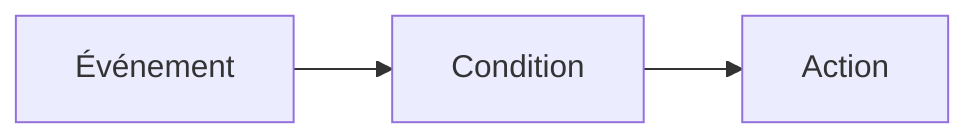

import AutomationsMentalModel from "/snippets/en/_includes/automations/mental-model.mdx";
import AutomationsActionsList from "/snippets/en/_includes/automations/actions-list.mdx";
import AutomationsBestPractices from "/snippets/en/_includes/automations/best-practices.mdx";
import AutomationsWhereToFind from "/snippets/en/_includes/automations/where-to-find-automations.mdx";

Il existe des automatisations à la fois pour les **Projects** et les **registries**. L’emplacement où vous créez une automatisation, les événements que vous pouvez utiliser et le fonctionnement de la portée varient. Pour connaître les types d’événements par portée, voir [événements et portée des automatisations](/fr/models/automations/automation-events).

<AutomationsMentalModel />

**Exemple :** Le run échoue (événement) et un filtre facultatif sur le nom du run (condition), puis notification Slack (action). Ou : alias `production` ajouté (événement), puis webhook (action).

  ## Où créer des automatisations

<AutomationsWhereToFind />

  ## Cas d’utilisation

* **Surveillance des runs et alertes** : notifier l’équipe lorsqu’un run échoue ou lorsqu’une métrique franchit un seuil (par exemple, la perte passe à NaN ou la précision baisse).
* **CI/CD du Registry** : lorsqu’une nouvelle version de modèle est liée ou qu’un alias (tel que `staging` ou `production`) est ajouté, déclencher un webhook pour exécuter des tests ou déployer.
* **Flux de travail des artefacts de projet** : lorsqu’une nouvelle version d’artefact est créée ou qu’un alias est ajouté dans un projet, exécuter un job en aval ou publier sur Slack.

Pour obtenir tous les détails sur les événements et les portées, voir [événements et portée des automatisations](/fr/models/automations/automation-events).

  ## Actions d’automatisation

Lorsqu’un événement déclenche une automatisation, celle-ci peut exécuter l’une des actions suivantes :

<AutomationsActionsList />

Pour plus de détails sur l’implémentation, voir [Créer une automatisation Slack](/fr/models/automations/create-automations/slack) et [Créer une automatisation webhook](/fr/models/automations/create-automations/webhook).

  ## Fonctionnement des automatisations

Pour [créer une automatisation](/fr/models/automations/create-automations), vous devez :

1. Si nécessaire, configurez des [secrets](/fr/platform/secrets) pour les chaînes sensibles dont l’automatisation a besoin, comme des jetons d’accès, des mots de passe ou des détails de configuration sensibles. Les secrets sont définis dans **Team Settings**. Ils sont le plus souvent utilisés dans les automatisations webhook pour transmettre en toute sécurité des identifiants ou des jetons au service externe du webhook, sans les exposer en clair ni les coder en dur dans la charge utile du webhook.
2. Configurez des intégrations webhook ou Slack au niveau de l’équipe afin d’autoriser W&amp;B à publier dans Slack ou à exécuter le webhook en votre nom. Une même action d’automatisation (webhook ou notification Slack) peut être utilisée par plusieurs automatisations. Ces actions sont définies dans **Team Settings**.
3. Dans le projet ou le registre, créez l’automatisation :
   1. Définissez l’[événement](/fr/models/automations/automation-events) à surveiller, par exemple l’ajout d’une nouvelle version d’artefact.
   2. Définissez l’action à effectuer lorsque l’événement se produit (publier dans un canal Slack ou exécuter un webhook). Pour un webhook, indiquez un secret à utiliser pour le jeton d’accès et/ou un secret à envoyer avec la charge utile, si nécessaire.

  ## Recommandations

<AutomationsBestPractices />

  ## Limites

Les [automatisations des métriques de run](/fr/models/automations/automation-events/#run-metrics-events) et les [automatisations de changement du z-score des métriques de run](/fr/models/automations/automation-events/#run-metrics-z-score-change-automations) sont actuellement prises en charge uniquement dans [W&amp;B Multi-tenant Cloud](/fr/platform/hosting/#wb-multi-tenant-cloud).

  ## Étapes suivantes

* [Tutoriel sur les automatisations](/fr/models/automations/tutorial) : vous guide dans la création d’une automatisation de projet pour alerter en cas d’échec de run, ainsi que d’une automatisation Registry pour exécuter un webhook lorsqu’un alias est ajouté. Le tutoriel utilise l’application W&amp;B.
* [Créer une automatisation](/fr/models/automations/create-automations).
* [Événements et portée des automatisations](/fr/models/automations/automation-events).
* [Créer un secret](/fr/platform/secrets).

{/* À rétablir après la puce Créer ci-dessus lorsque la régression du SDK Python `create_automation` est corrigée (interne WB-34263) :
  - [Gérer les automatisations avec l’API](/models/automations/api).
  */}

<Info>
  Vous cherchez des tutoriels complémentaires sur les automatisations ?

  * [Découvrez comment déclencher automatiquement une GitHub Action pour l&#39;évaluation et le déploiement de modèles](https://wandb.ai/wandb/wandb-model-cicd/reports/Model-CI-CD-with-W-B--Vmlldzo0OTcwNDQw).
  * [Regardez une vidéo montrant comment déployer automatiquement un modèle vers un endpoint SageMaker](https://www.youtube.com/watch?v=s5CMj_w3DaQ).
  * [Regardez une série de vidéos présentant les automatisations](https://youtube.com/playlist?list=PLD80i8An1OEGECFPgY-HPCNjXgGu-qGO6\&feature=shared).
</Info>