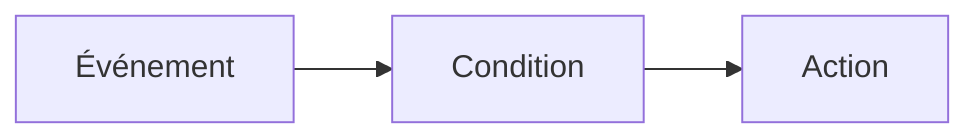

import AutomationsMentalModel from "/snippets/fr/_includes/automations/mental-model.mdx";
import AutomationsActionsList from "/snippets/fr/_includes/automations/actions-list.mdx";
import AutomationsBestPractices from "/snippets/fr/_includes/automations/best-practices.mdx";
import AutomationsWhereToFind from "/snippets/fr/_includes/automations/where-to-find-automations.mdx";

*Les automatisations* envoient des notifications Slack, déclenchent des webhooks ou envoient des prompts à ARIA en réponse à des événements spécifiques dans W&amp;B. Vous pouvez définir la portée d’une automatisation au niveau d’une organisation, d’une équipe, d’un projet, d’un registre ou d’une collection. Une automatisation surveille l’événement dans l’ensemble des ressources incluses dans sa portée, y compris les projets, registres et collections créés ultérieurement. La procédure de création d’une automatisation et les événements disponibles dépendent de sa portée. Pour connaître les types d’événements par portée, voir [événements et portée des automatisations](/fr/models/automations/automation-events).

<Note>
  Les automatisations à l’échelle d’une équipe ou d’une organisation, ainsi que le [hub Automatisations](#automations-hub), sont disponibles sur Cloud mutualisé de W&amp;B et sur W&amp;B Cloud dédié (Server v0.83.0 et versions ultérieures).
</Note>

<AutomationsMentalModel />

```mermaid
flowchart LR
  Event[Événement] --> Condition[Condition]
  Condition --> Action[Action]
```

**Exemple :** Le run échoue (événement) et un filtre facultatif sur le nom du run (condition), puis notification Slack (action). Ou : alias `production` ajouté (événement), puis webhook (action).

  ## Où créer des automatisations

<AutomationsWhereToFind />

  ## Hub Automatisations

Le hub **Automatisations** est une section globale de la navigation de gauche qui regroupe, dans une liste unique, toutes les automatisations auxquelles vous avez accès, toutes portées et projets confondus. Utilisez-le pour découvrir, examiner et gérer les automatisations sans devoir accéder à chaque projet ou registre.

Depuis le hub **Automatisations**, vous pouvez :

* Créer une automatisation et choisir sa portée, sans avoir à connaître au préalable le point d&#39;entrée correspondant.
* Afficher dans une seule liste toutes les automatisations auxquelles vous avez accès, puis les filtrer et les trier (par exemple, par portée, déclencheur ou action).
* Cliquer sur le nom d&#39;une automatisation pour afficher les détails complets de sa configuration.
* Afficher l&#39;[historique d&#39;exécution](/fr/models/automations/view-automation-history) d&#39;une automatisation pour vérifier si elle a réussi ou échoué.
* Utiliser le filtre rapide pour basculer entre les automatisations que vous avez créées et toutes les automatisations de votre organisation.
* Sélectionner plusieurs automatisations et les supprimer en une seule fois.

Le hub **Automatisations** complète l&#39;onglet **Automatisations** de chaque projet et registre ; ces onglets spécifiques à une portée restent disponibles pour un accès ciblé rapide.

  ## Cas d’utilisation

* **Surveillance des runs et alertes** : notifier l’équipe lorsqu’un run échoue ou lorsqu’une métrique franchit un seuil (par exemple, la perte passe à NaN ou la précision baisse).
* **CI/CD du registre** : lorsqu’une nouvelle version de modèle est liée ou qu’un alias (tel que `staging` ou `production`) est ajouté, déclencher un webhook pour exécuter des tests ou déployer.
* **Flux de travail des artefacts de projet** : lorsqu’une nouvelle version d’artefact est créée ou qu’un alias est ajouté dans un projet, exécuter un job en aval ou publier sur Slack.
* **Analyse automatisée** : lorsqu’un run échoue ou qu’une nouvelle version de modèle est liée, envoyer un prompt à [ARIA](/fr/aria/overview) pour diagnostiquer l’échec ou comparer la nouvelle version à celle en production.

Pour obtenir tous les détails sur les événements et les portées, voir [événements et portée des automatisations](/fr/models/automations/automation-events).

  ## Actions d’automatisation

Lorsqu’un événement déclenche une automatisation, celle-ci peut exécuter l’une des actions suivantes :

<AutomationsActionsList />

Pour plus de détails sur l’implémentation, voir [Créer une automatisation Slack](/fr/models/automations/create-automations/slack), [Créer une automatisation webhook](/fr/models/automations/create-automations/webhook) ou [Créer une automatisation ARIA](/fr/models/automations/create-automations/aria).

  ## Fonctionnement des automatisations

Pour [créer une automatisation](/fr/models/automations/create-automations), vous devez :

1. Si nécessaire, configurez des [secrets](/fr/platform/secrets) pour les chaînes sensibles dont l’automatisation a besoin, comme des jetons d’accès, des mots de passe ou des détails de configuration sensibles. Les secrets sont définis dans **Team Settings**. Ils sont le plus souvent utilisés dans les automatisations webhook pour transmettre en toute sécurité des identifiants ou des jetons au service externe du webhook, sans les exposer en clair ni les coder en dur dans la charge utile du webhook.
2. Configurez des intégrations webhook ou Slack au niveau de l’équipe afin d’autoriser W&amp;B à publier dans Slack ou à exécuter le webhook en votre nom. Une même action d’automatisation (webhook ou notification Slack) peut être utilisée par plusieurs automatisations. Ces actions sont définies dans **Team Settings**. Une action ARIA ne nécessite aucune intégration.
3. Dans le projet ou le registre, créez l’automatisation :
   1. Définissez l’[événement](/fr/models/automations/automation-events) à surveiller, par exemple l’ajout d’une nouvelle version d’artefact.
   2. Définissez l’action à effectuer lorsque l’événement se produit, par exemple publier dans un canal Slack, exécuter un webhook ou envoyer un prompt à ARIA. Pour un webhook, indiquez un secret à utiliser pour le jeton d’accès et/ou un secret à envoyer avec la charge utile, si nécessaire.

  ## Recommandations

<AutomationsBestPractices />

  ## Limitations

* Les [automatisations sur les métriques des runs](/fr/models/automations/automation-events/#run-metrics-change) et les [automatisations sur les variations du score z des métriques des runs](/fr/models/automations/automation-events/#run-metrics-z-score-change) sont prises en charge uniquement dans le [Cloud mutualisé de W&amp;B](/fr/platform/hosting/#wb-multi-tenant-cloud) et le [Cloud dédié](/fr/platform/hosting/hosting-options/dedicated-cloud).
* Aux portées **Équipe** et **Organisation**, W&amp;B App ne prend en charge que les événements liés aux artefacts et aux collections. Les événements basés sur les runs ne sont pas disponibles dans W&amp;B App à ces portées. Voir [événements et portée des automatisations](/fr/models/automations/automation-events).

  ## Étapes suivantes

* [Tutoriel sur les automatisations](/fr/models/automations/tutorial) : vous guide dans la création d’une automatisation de projet pour alerter en cas d’échec de run, ainsi que d’une automatisation Registry pour exécuter un webhook lorsqu’un alias est ajouté. Le tutoriel utilise l’application W&amp;B.
* [Créer une automatisation](/fr/models/automations/create-automations).
* [Événements et portée des automatisations](/fr/models/automations/automation-events).
* [Créer un secret](/fr/platform/secrets).

{/* À rétablir après la puce Créer ci-dessus lorsque la régression du SDK Python `create_automation` est corrigée (interne WB-34263) :
  - [Gérer les automatisations avec l’API](/models/automations/api).
  */}

<Info>
  Vous cherchez des tutoriels complémentaires sur les automatisations ?

  * [Découvrez comment déclencher automatiquement une GitHub Action pour l&#39;évaluation et le déploiement de modèles](https://wandb.ai/wandb/wandb-model-cicd/reports/Model-CI-CD-with-W-B--Vmlldzo0OTcwNDQw).
  * [Regardez une vidéo montrant comment déployer automatiquement un modèle vers un endpoint SageMaker](https://www.youtube.com/watch?v=s5CMj_w3DaQ).
  * [Regardez une série de vidéos présentant les automatisations](https://youtube.com/playlist?list=PLD80i8An1OEGECFPgY-HPCNjXgGu-qGO6\&feature=shared).
</Info>