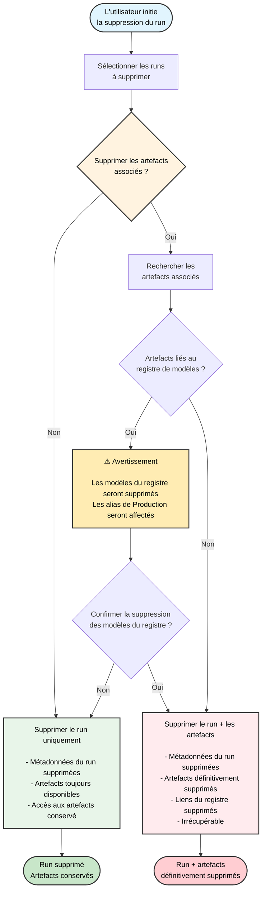

Supprimez un ou plusieurs runs d’un projet avec l’application W&amp;B.

1. Accédez au projet qui contient les runs que vous souhaitez supprimer.
2. Sélectionnez l’onglet **Runs**.
3. Cochez la case à côté des runs que vous souhaitez supprimer.
4. Cliquez sur le bouton **Delete** (icône de corbeille) au-dessus du tableau.
5. Dans le panneau qui s’affiche, cliquez sur **Delete**.

<Note>
  Un ID de run ne peut pas être réutilisé, même après la suppression du run. Si vous essayez de le réutiliser, le run échouera avec une erreur.
</Note>

<Note>
  Pour les projets contenant un grand nombre de runs, vous pouvez utiliser soit la barre de recherche pour filtrer les runs à supprimer à l’aide d’expressions régulières, soit le bouton de filtre pour filtrer les runs en fonction de leur statut, de leurs tags ou d’autres propriétés.
</Note>

  ### Organigramme de suppression des runs

Le schéma suivant illustre le processus complet de suppression des runs, y compris la gestion des artefacts associés et des liens vers le registre :

<Warning>
  Lorsque vous supprimez un run et choisissez de supprimer les artefacts associés, ceux-ci sont définitivement supprimés et ne peuvent pas être récupérés, même si le run est restauré ultérieurement. Cela inclut les artefacts liés au registre.
</Warning>
