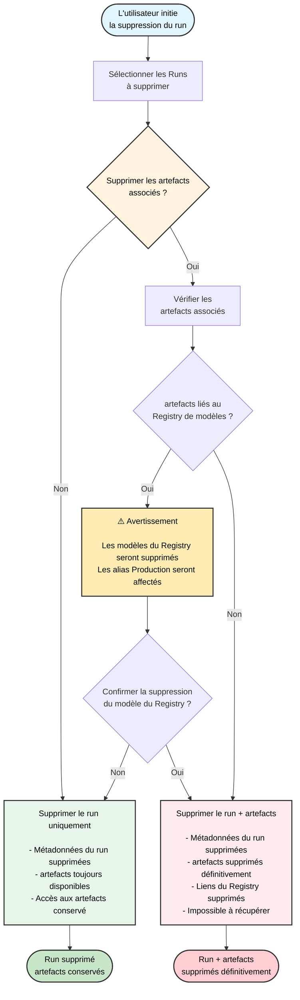

<div id="delete-runs">
  ## Supprimer des runs
</div>

Supprimez des runs d&#39;un projet depuis la W&amp;B App ou l&#39;API Python.

<Tabs>
  <Tab title="W&B App" value="ui">
    1. Accédez au projet qui contient les runs que vous souhaitez supprimer.
    2. Sélectionnez l&#39;onglet **Runs**.
    3. Cochez la case à côté des runs que vous souhaitez supprimer.
    4. Cliquez sur le bouton **Delete** (icône de corbeille) au-dessus du tableau.
    5. Dans le volet latéral qui s&#39;ouvre, choisissez **Delete**.

    Pour les projets contenant un grand nombre de runs, vous pouvez utiliser soit la barre de recherche pour filtrer les runs à supprimer à l&#39;aide d&#39;expressions régulières, soit le bouton de filtre pour filtrer les runs selon leur statut, leurs tags ou d&#39;autres propriétés.
  </Tab>

  <Tab title="Python" value="python">
    Vous pouvez supprimer des runs par programmation avec [`Run.delete()`](/fr/models/ref/python/public-api/run#method-run-delete). Définissez `delete_artifacts=True` si vous souhaitez également supprimer les artefacts associés au run.

    ```python
    import wandb

    api = wandb.Api()
    runs = api.runs("<entity>/<project>")
    for run in runs:
        if run.state == "finished":  # Remplacez par votre propre condition
            run.delete(delete_artifacts=False)
    ```

    Pour la signature complète de la méthode et son comportement, consultez la [référence `Run.delete`](/fr/models/ref/python/public-api/run#method-run-delete).

    Pour supprimer des fichiers individuels associés à un run, comme des médias enregistrés :

    1. Obtenez les références des fichiers concernés avec [`Run.files()`](/fr/models/ref/python/public-api/run#method-run-files).
    2. Utilisez [`File.delete()`](/fr/models/ref/python/public-api/file#method-file-delete) pour supprimer des fichiers individuels.
  </Tab>
</Tabs>

Un ID de run ne peut pas être réutilisé, même après la suppression du run. À la place, une erreur sera renvoyée.

<Warning>
  Lorsque vous supprimez un run et choisissez de supprimer les artefacts associés, les artefacts sont supprimés définitivement et ne peuvent pas être récupérés, même si le run est restauré ultérieurement. Cela inclut les artefacts liés au Registry.
</Warning>

<div id="run-deletion-flowchart">
  ## Organigramme de suppression des runs
</div>

Le diagramme suivant illustre l’ensemble du processus de suppression d’un run, y compris la gestion des artefacts associés et des liens du Registry :



<div id="when-deleted-run-data-is-removed-from-storage">
  ## Quand les données de run supprimées sont retirées du stockage
</div>

Sur [Cloud dédié de W&amp;B](/fr/platform/hosting/hosting-options/dedicated-cloud) et [W&amp;B Autogéré](/fr/platform/hosting/hosting-options/self-managed), la variable d’environnement `GORILLA_DATA_RETENTION_PERIOD` détermine pendant combien de temps les **données de run supprimées** sont conservées avant de pouvoir être supprimées définitivement du stockage d’objets. **Les artefacts ne sont pas supprimés par ce paramètre** ; ils suivent le processus de suppression et de garbage collection des artefacts décrit dans [Supprimer un artefact](/fr/models/artifacts/delete-artifacts).

Définir ou modifier `GORILLA_DATA_RETENTION_PERIOD` est irréversible pour les données au-delà de la période de rétention. Sauvegardez votre base de données et votre bucket avant d’activer la rétention ou d’en réduire la durée. Voir [Configurer les variables d’environnement](/fr/platform/hosting/env-vars) pour le tableau de référence et les avertissements.

Même après la suppression d’un run ou d’un fichier et le traitement de la rétention, **l’utilisation du bucket peut être mise à jour avec retard** pendant que les tâches en arrière-plan se terminent. W&amp;B ne garantit pas la libération immédiate de l’espace dans le stockage d’objets. Pour un aperçu complet des artefacts par rapport aux données de run, des délais attendus et des actions facultatives pour l’administrateur, voir [Gérer le stockage et les coûts du bucket](/fr/platform/hosting/managing-bucket-storage).

<Note>
  Si les suppressions n’apparaissent pas comme prévu dans la W&amp;B App lorsque vous utilisez l’API publique, mettez à niveau le SDK Python W&amp;B vers une version récente, puis réessayez.
</Note>