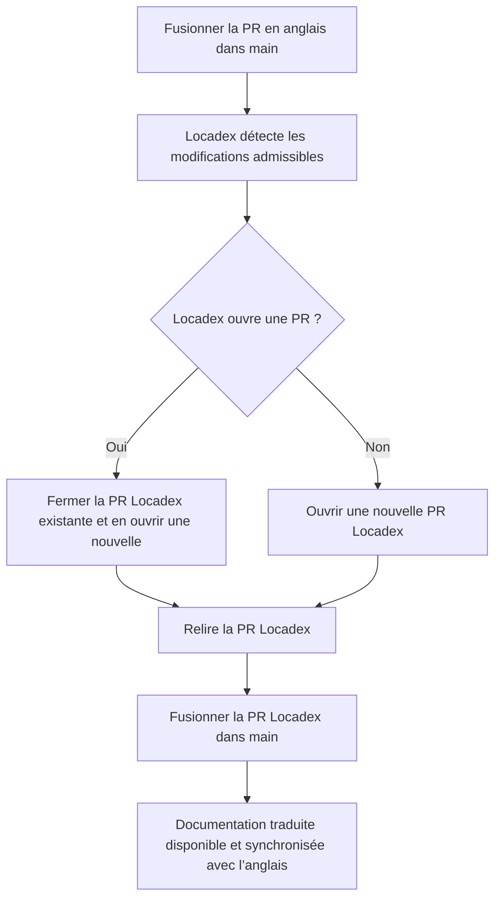

  # Traduction automatique de Locadex pour les rédacteurs techniques

Cette procédure opérationnelle s’adresse aux rédacteurs techniques anglophones de W&amp;B qui travaillent dans le dépôt `wandb/docs`. Elle suppose que l’intégration Locadex est activée sur `main` et utilisée pour les traductions en production.

Utilisez-la pour comprendre le processus de bout en bout, ce que Locadex modifie dans le dépôt, où intervenir dans la console Locadex ou dans GitHub, et comment corriger ou améliorer le contenu localisé.

  ## Aperçu et périmètre

  ### Ce que Locadex localise

General Translation [Locadex for Mintlify](https://generaltranslation.com/en-US/docs/locadex/mintlify) génère et met à jour des copies localisées du contenu source à partir de `gt.config.json`, à la racine du dépôt. Dans la configuration actuelle, cela inclut :

* **Pages MDX et Markdown** : les fichiers anglais du dépôt sont reproduits dans des répertoires de langue (par exemple `ko/`, `ja/`, `fr/`) à l’aide de la transformation de chemin définie dans `gt.config.json`. Locadex garde la trace des fichiers déjà traduits et ne traduit que les nouvelles modifications en anglais qui ont été fusionnées.
* **Snippets** : les chemins des snippets partagés sont localisés de la même manière (par exemple `snippets/foo.mdx` vers `snippets/ko/foo.mdx` selon la configuration).
* **Table des matières et navigation** : `docs.json` est inclus afin que la navigation localisée et les chemins des pages restent alignés sur Mintlify.
* **Spécifications OpenAPI** : les fichiers JSON OpenAPI configurés (par exemple dans `training/api-reference/` et `weave/reference/service-api/`) sont localisés conformément à `gt.config.json`.

Locadex applique également des options qui influent sur le comportement de Mintlify (par exemple la gestion des imports statiques et des ressources relatives, les redirections et le comportement des ancres d’en-tête). Considérez `gt.config.json` comme la référence faisant foi pour déterminer quels chemins JSON et MDX sont pris en compte.

  ### Ce que Locadex ne localise pas

* **Images matricielles et vectorielles** : Les fichiers image ne sont pas remplacés par des visuels propres à la langue. Les diagrammes et les captures d’écran restent inchangés, sauf si vous ajoutez vous-même des ressources localisées et mettez à jour les chemins.
* **Fichiers de texte exclus** : Les chemins répertoriés sous `files.mdx.exclude` dans `gt.config.json` ne sont pas traduits automatiquement. Cela inclut les fichiers standard du dépôt tels que `README.md`, `CONTRIBUTING.md`, `AGENTS.md` et autres fichiers similaires, ainsi que tout motif supplémentaire que l’équipe y ajoute.
* **L’anglais comme source de référence** : Les rédacteurs continuent de rédiger et d’intégrer les modifications en anglais. Les fichiers localisés sont le résultat de l’automatisation, auquel s’ajoutent les modifications manuelles que vous choisissez d’apporter.

  ## Flux de travail de traduction sur `main`

Une fois Locadex connecté au dépôt (application GitHub, projet et paramètres de branche selon [Locadex for Mintlify](https://generaltranslation.com/docs/locadex/mintlify)) :

1. Vous fusionnez dans `main` une pull request de documentation **en anglais uniquement**.
2. Locadex détecte les modifications éligibles (selon ses règles d’intégration) et lance ou met à jour un **cycle de traduction**.
3. Si une pull request Locadex est déjà ouverte sur `main`, Locadex **ferme cette PR** et en crée une nouvelle contenant toutes les modifications de la PR fermée, ainsi que les nouvelles modifications en anglais récemment fusionnées. Si aucune PR Locadex n’est ouverte, Locadex **ouvre une nouvelle PR** avec les mises à jour localisées. Reportez-vous à [#2430](https://github.com/wandb/docs/pull/2430) pour voir un exemple de PR Locadex.
4. L’équipe documentation **examine** la PR Locadex (selon le cas, au moyen de vérifications ponctuelles, d’une relecture assistée par LLM ou d’une relecture par un locuteur natif).

   Si vous trouvez des erreurs dans la PR Locadex, validez les corrections dans la branche de la PR. Cela aidera Locadex lors des prochains cycles de traduction.
5. Lorsque la PR Locadex est **fusionnée dans `main`**, Mintlify publie les sites localisés mis à jour en même temps que la version anglaise. La fusion de cette PR publie la documentation traduite mise à jour.

  ### Liste de contrôle du rédacteur après la fusion de votre PR en anglais

* [ ] Dans la liste des PR ouvertes, repérez la PR Locadex, qui peut être antérieure à la fusion de votre PR en anglais ou avoir été créée par cette fusion. Recherchez `locadex`.
* [ ] Si votre modification est urgente pour les sites localisés, faites relire puis fusionnez la PR Locadex pour publier la mise à jour immédiatement. Sinon, les traductions seront disponibles une fois la PR Locadex fusionnée.
* [ ] Si la terminologie doit être modifiée pour les **futurs** runs, mettez à jour **AI Context** dans la console Locadex (voir ci-dessous) et prévoyez un **Retranslate** si vous devez régénérer les pages existantes.

  ## Console Locadex versus dépôt wandb/docs

Utilisez le bon emplacement pour chaque type de modification.

| Task                                                                                                                                              | Where to do it                                   | Notes                                                                                                                                                                                                                                                          |
| ------------------------------------------------------------------------------------------------------------------------------------------------- | ------------------------------------------------ | -------------------------------------------------------------------------------------------------------------------------------------------------------------------------------------------------------------------------------------------------------------- |
| Ajouter ou modifier les **locales cibles** ou **les fichiers** traduits                                                                           | `gt.config.json` dans GitHub                     | Nécessite une PR standard vers `main`. Coordonnez-vous avec l’ingénierie ou les responsables de la plateforme documentaire avant de modifier les modèles d’inclusion ou d’exclusion.                                                                           |
| **Glossaire** (termes, définitions, traductions par locale, éléments à ne pas traduire)                                                           | Console Locadex, **Context**, **Glossaire**      | **Import** et **export** en masse via CSV. Voir [GT Glossary](https://generaltranslation.com/docs/platform/ai-context/glossary).                                                                                                                               |
| **Contexte local** (prompts spécifiques à chaque locale avec des indications sur l’espacement, le ton selon la langue et les règles de formatage) | Console Locadex, **Context**, **Locale Context** | Voir [Locale Context](https://generaltranslation.com/docs/platform/ai-context/locale-context).                                                                                                                                                                 |
| **Style Controls** (prompts à l’échelle du projet concernant l’audience, la description du projet et le ton global)                               | Console Locadex, **Context**, **Style Controls** | Voir [Style Controls](https://generaltranslation.com/docs/platform/ai-context/style-controls).                                                                                                                                                                 |
| **Retranslate** retraduction manuelle de fichiers individuels après des changements de contexte                                                   | Console Locadex                                  | Voir [Retranslate](https://generaltranslation.com/docs/platform/translations/retranslate). La modification de l’AI Context ne réécrit pas automatiquement tous les fichiers déjà localisés tant que vous n’avez pas relancé la traduction.                     |
| **Review** la sortie automatique                                                                                                                  | PR Locadex sur GitHub                            | Commentez, demandez des modifications, apportez des correctifs ou abandonnez le cycle de traduction en fermant la PR sans la fusionner, si vos autorisations vous le permettent.                                                                               |
| **Correctif ponctuel de texte** dans une page localisée                                                                                           | Modification directe dans GitHub                 | Modifiez le fichier dans le répertoire de la locale (par exemple `ko/...`). Ouvrez une PR standard vers `main`. Si nécessaire, effectuez des ajustements dans le tableau de bord Locadex pour éviter d’avoir à refaire des corrections manuelles par la suite. |

**Important :** le glossaire et les prompts de la documentation se trouvent dans la **console Locadex**, et non dans `gt.config.json`.

  ### Importation et exportation du glossaire et du contexte IA

1. Connectez-vous au [General Translation Dashboard](https://dash.generaltranslation.com/) (console Locadex).
2. Ouvrez le projet lié à `wandb/docs`.
3. Accédez à **Context** et choisissez **Glossaire**, **Locale Context** ou **Style Controls**, selon vos besoins.

**Glossaire CSV**

* Utilisez **Upload Context CSV** pour importer un grand nombre de termes en une seule fois. Les noms de colonne doivent correspondre à ce que la console attend (par exemple **Term**, **Definition** et des colonnes de locale telles que **ko**). Si le téléversement échoue, comparez les en-têtes avec l’aide intégrée au produit ou [GT Glossary](https://generaltranslation.com/docs/platform/ai-context/glossary).
* Exportez ou copiez les termes lorsque vous avez besoin d’une sauvegarde, d’une relecture, ou de les partager avec un prestataire ou un LLM pour une évaluation.

**Locale Context et Style Controls**

* Modifiez-les dans la console, puis enregistrez. Documentez les changements de règles importants dans le canal de votre équipe ou dans vos notes internes afin que les réviseurs sachent à quoi s’attendre lors du prochain cycle de traduction.

**Après avoir modifié le contexte IA**

* Exécutez **Retranslate** pour les fichiers ou langues concernés si vous avez besoin que les pages déjà localisées appliquent les nouvelles règles. Attendez-vous ensuite à une PR Locadex nouvelle ou mise à jour.

  ## Utiliser un LLM pour évaluer un cycle de traduction

Les LLM peuvent vous aider à faire le tri dans une PR Locadex volumineuse. Ils ne remplacent pas le jugement humain en matière de précision, de terminologie produit ou de nuance. Ces sections décrivent une approche possible.

  ### 1. Recueillez les éléments d’entrée

* **Diff** : Dirigez l’agent vers le diff de la PR Locadex sur GitHub.
* **Règles** : Collez ou résumez :
  * Les entrées de **Glossaire** et de **Contexte local** depuis la console Locadex. Pour toutes les langues, elles sont incluses dans une exportation CSV combinée. (exportez ou copiez les termes pertinents pour la langue cible).
  * Facultatif : les notes de prompt internes du fichier racine du dépôt `locadex_prompts.md` si votre équipe y conserve des grilles d’évaluation (casse de phrase, nommage des produits W&amp;B, etc.).
* **Référence anglaise** : Pour les fichiers échantillonnés, incluez le chemin source en anglais et le chemin localisé afin que le modèle puisse comparer la structure (titres, listes, blocs de code, liens).

  ### 2. Structure du prompt (exemple)

Demandez au modèle de :

* Signaler les violations de **do-not-translate** (noms de produit, libellés d&#39;interface utilisateur, `wandb`, identifiants de code).
* Vérifier la **cohérence du glossaire** par rapport à la liste que vous avez collée.
* Repérer le **Markdown ou MDX endommagé** (liens brisés, tableaux mal formés, balises de langue des blocs de code).
* Signaler la **surtraduction** (URL, code ou noms propres devant rester en anglais, mais traduits à tort).
* Privilégier des **signalements brefs et exploitables**, avec le chemin du fichier et une correction suggérée.

  ### 3. Comment utiliser le résultat

* Transformez les problèmes relevés en commentaires de revue sur GitHub dans la PR Locadex, ou en retouches complémentaires après la fusion.
* Si la même erreur apparaît dans de nombreux fichiers, corrigez **AI Context** (Glossaire ou Contexte local) et utilisez **Retranslate** plutôt que de modifier manuellement des dizaines de fichiers.

  ## Corrections manuelles et mises à jour du contenu localisé automatiquement

  ### Correction ponctuelle après fusion

Si une seule page ou un seul extrait est erroné, mais que le glossaire et les règles de langue sont corrects :

1. Créez une branche à partir de `main`.
2. Modifiez le fichier localisé (par exemple `ja/models/foo.mdx` ou `snippets/ko/bar.mdx`).
3. Ouvrez une PR vers `main` avec une synthèse claire (ce qui était erroné et pourquoi la correction manuelle est sûre).
4. Attendez-vous à ce que la prochaine exécution de Locadex ne retouche ce même fichier que si la source anglaise change. Si Locadex écrase votre correction manuelle, signalez-le aux responsables de la plateforme et envisagez de verrouiller ou d’exclure les schémas documentés pour votre projet.

  ### Correction systématique de la terminologie ou du style

Si la même erreur se répète dans de nombreux fichiers :

1. Mettez à jour le **Glossaire**, le **Contexte local** ou les **Style Controls** dans la console Locadex.
2. Utilisez **Retranslate** pour que Locadex régénère le contenu localisé concerné. Relisez attentivement la PR Locadex qui en résulte.

  ### Quand l’anglais change à nouveau

Les intégrations de modifications en anglais déclenchent la prochaine mise à jour de Locadex. Vos modifications de localisation manuelles peuvent nécessiter une harmonisation avec la nouvelle sortie automatique. Préférez corriger la source en anglais ou le contexte dans la console afin que l’automatisation reste stable.

  ## Vérification et tests

* Après la fusion d’une PR Locadex, vérifiez ponctuellement, pour chaque locale, les pages à fort trafic dans l’aperçu Mintlify ou en production.
* Exécutez `mint dev`, `mint validate`, `mint broken-links` localement lorsque votre flux de travail l’exige (voir `AGENTS.md` dans le dépôt).
* Vérifiez que l’OpenAPI et le JSON de navigation dans les chemins de locale correspondent toujours au comportement du produit pour les API critiques.

  ## Liens connexes

* [Locadex for Mintlify](https://generaltranslation.com/docs/locadex/mintlify)
* [Glossaire GT](https://generaltranslation.com/docs/platform/ai-context/glossary)
* [Contexte local](https://generaltranslation.com/docs/platform/ai-context/locale-context)
* [Style Controls](https://generaltranslation.com/docs/platform/ai-context/style-controls)
* [Retranslate](https://generaltranslation.com/docs/platform/translations/retranslate)

  ## Liste de vérification (référence rapide)

* [ ] PR en anglais fusionnée dans `main`.
* [ ] PR Locadex ouverte ou mise à jour. Examinez le diff.
* [ ] Facultatif : passe assistée par LLM à l’aide du glossaire et des règles de locale.
* [ ] Fusionnez la PR Locadex pour publier les mises à jour localisées.
* [ ] En cas d’erreurs répétées, mettez à jour le AI Context de la console, puis Retranslate.
* [ ] En cas d’erreurs dans un seul fichier, modifiez le chemin de la locale dans GitHub et créez une PR vers `main`.