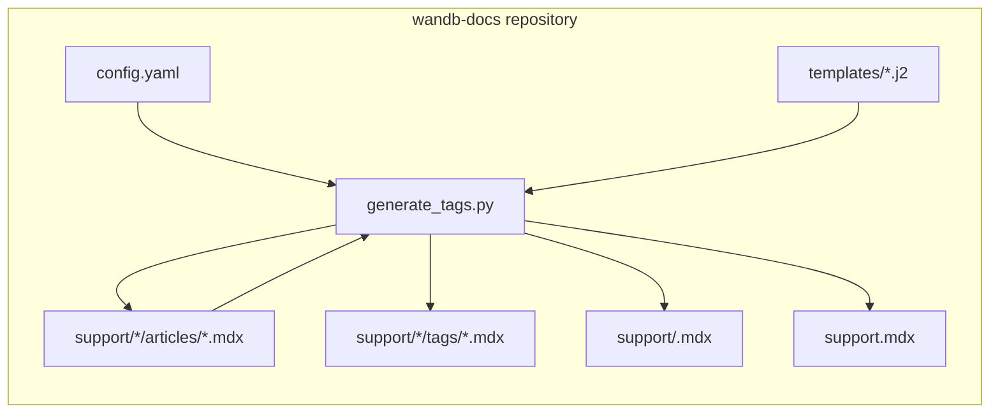
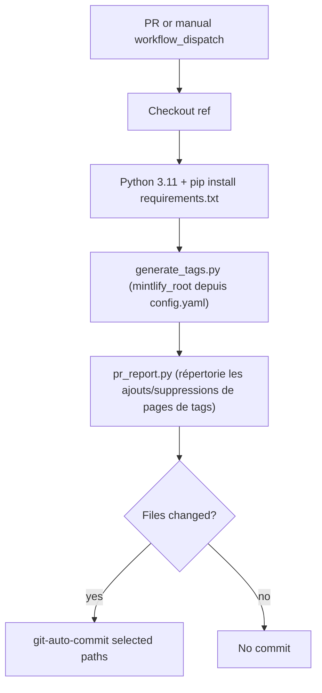
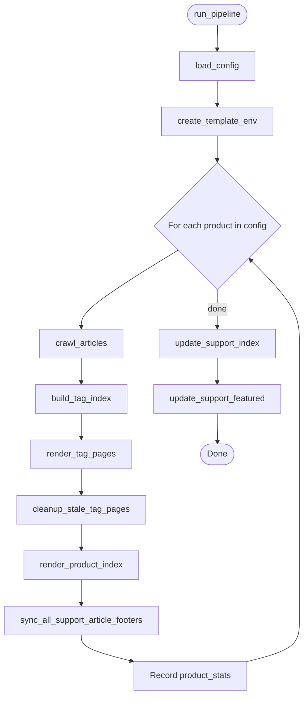
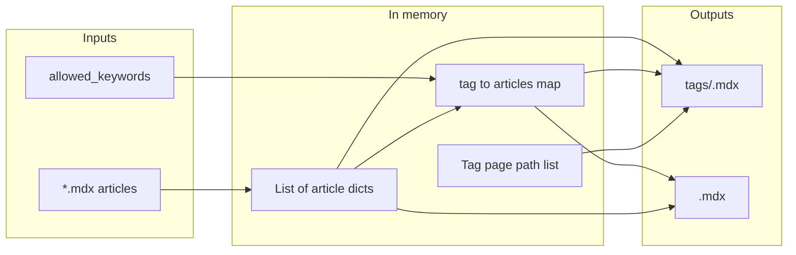

  # Architecture du générateur de navigation de la base de connaissances

Ce document décrit le système **Knowledgebase Nav** : ce qu’il génère, quels fichiers et quelles fonctions le font fonctionner, et comment l’automatisation orchestre l’ensemble. L’utilitaire se trouve dans `<utility-dir>/knowledgebase-nav/` (par exemple `scripts/knowledgebase-nav/` ou `utils/knowledgebase-nav/`) dans un dépôt de documentation Mintlify. Pour les étapes à l’intention des auteurs et la configuration en local, voir [README.md](./README.md).

  ## Objectif

Le générateur maintient la cohérence entre la navigation de l’assistance (base de connaissances) et le contenu des articles. Il traite les produits configurés (par exemple Models, Weave, Inférence), lit les articles MDX dans `support/<product>/articles/` et met à jour les pages MDX générées ainsi que les compteurs du fichier racine `support.mdx`. Le générateur ne lit ni n’écrit jamais `docs.json` ; des personnes modifient ce fichier manuellement en se basant sur le commentaire de PR du flux de travail.

  ## Contexte général

Le système réside entièrement dans le dépôt de documentation. Il n’effectue aucun appel à des API externes. Il lit et écrit des fichiers dans l’arborescence de travail sous la racine Mintlify (résolue à partir de `mintlify_root` dans `config.yaml`).

La flèche de retour vers **articles** indique que la phase 4 met à jour uniquement les liens `<Badge>` qui pointent vers des pages de tags sous `/support/<product>/tags/`, encadrés par des marqueurs de commentaire MDX. Les autres contenus (y compris `---`, les autres Badges et le texte en dehors de ces marqueurs) ne sont pas réécrits.

`docs.json` est volontairement absent de ce diagramme. Lorsque des pages de tags sont ajoutées ou supprimées, le commentaire de la PR du flux de travail (généré par `pr_report.py`) répertorie les ID de page qu’une personne doit ajouter manuellement à l’onglet `Support: <display_name>` correspondant dans `docs.json`, ou en supprimer.

  ## Flux de travail d’automatisation

Les pull requests déclenchent le flux de travail **Knowledgebase Nav** lorsque des fichiers sous le répertoire Mintlify `support/**` ou le répertoire utilitaire sont modifiés (y compris lors de nouveaux pushes vers une PR ouverte). Il installe les dépendances Python, exécute le générateur, publie un commentaire sur la PR avec les éventuelles instructions « mise à jour de docs.json requise », et commit les chemins correspondants lorsqu’il y a des différences. Les pull requests provenant de **forks** extraient le commit HEAD du fork et exécutent tout de même le générateur, mais l’étape d’auto-commit est ignorée, car le token par défaut ne peut pas pousser vers des forks.

Les motifs de chemin validés incluent `support.mdx`, `support/*/articles/*.mdx`, `support/*/tags/*.mdx` et `support/*.mdx` (index de produit). `docs.json` est volontairement exclu ; des personnes le mettent à jour manuellement.

  ## Orchestration du pipeline

`run_pipeline(repo_root, config_path)` est le point d’entrée unique utilisé par le CLI et les tests. Il charge `config.yaml`, crée un environnement Jinja2 unique pour tous les produits, puis traite chaque produit à tour de rôle. Une fois la boucle terminée, il met à jour `support.mdx` une seule fois. Il ne modifie pas `docs.json`.

  ## Flux de données par produit

Au sein d’un produit, les données passent des fichiers bruts à des structures en mémoire, puis sont reconverties en MDX et en structures agrégées pour les étapes suivantes.

`render_tag_pages` renvoie des chaînes d’ID de page triées (par exemple `support/models/tags/security`). `pr_report.py` utilise les mêmes ID lorsqu’il génère la section &quot;docs.json update required&quot; dans le commentaire de PR du flux de travail afin qu’une personne puisse mettre à jour l’onglet `Support: <display_name>` correspondant dans `docs.json`.

  ## Composants et fichiers

| Composant               | Chemin                                    | Rôle                                                                                                                                   |
| ----------------------- | ----------------------------------------- | -------------------------------------------------------------------------------------------------------------------------------------- |
| CLI et logique          | `generate_tags.py`                        | Toutes les phases, parsing, règles de slug, aperçus, réécritures MDX (ne touche pas à `docs.json`)                                     |
| Rapport de PR           | `pr_report.py`                            | Rapport Markdown issu de `git diff` ; liste les pages de tags ajoutées/supprimées afin qu’une personne puisse mettre à jour `docs.json` |
| Configuration           | `config.yaml`                             | `mintlify_root`, `badge_color` et registre des produits (`slug`, `display_name`, `allowed_keywords`)                                   |
| Modèle de liste de tags | `templates/support_tag.mdx.j2`            | Une carte par article sur une page de tags                                                                                              |
| Modèle du hub produit   | `templates/support_product_index.mdx.j2`  | Section mise en avant et cartes de navigation par catégorie                                                                            |
| Dépendances             | `requirements.txt`                        | PyYAML, Jinja2                                                                                                                         |
| Tests unitaires         | `tests/test_generate_tags.py`             | Système de fichiers simulé                                                                                                             |
| Tests d’intégration     | `tests/test_golden_output.py`             | Pipeline complet sur une copie temporaire du dépôt réel                                                                                |
| Marqueurs Pytest        | `tests/conftest.py`                       | Enregistre le marqueur `integration` pour la suite golden                                                                              |
| CI                      | `.github/workflows/knowledgebase-nav.yml` | Déclencheurs, script d’exécution, auto-commit                                                                                          |
| Documentation auteur    | `README.md`                               | Flux de travail pour les rédacteurs et les développeurs                                                                                |
| Notes d’architecture    | `Architecture.md`                         | Diagrammes et cartographie des modules pour les développeurs                                                                           |

  ## Zones fonctionnelles dans `generate_tags.py`

Les fonctions sont regroupées ci-dessous selon leur ordre d’apparition dans le fichier source. Les noms correspondent à l’API Python.

  ### Configuration

* **`load_config`** lit et valide `config.yaml` (clés requises pour chaque produit).

  ### Structure des articles et pieds de page

* **`parse_frontmatter`**, **`_extract_body`** séparent le front matter YAML du corps principal. `_extract_body` utilise `_BADGE_START_RE` pour repérer la délimitation et supprime, à des fins esthétiques, une ligne `---` finale.
* **`_split_frontmatter_raw`** découpe le MDX brut en bloc de front matter et en contenu restant pour la réécriture du pied de page.
* **`_normalize_keywords`** convertit le front matter `keywords` en liste de chaînes de caractères (liste YAML ; une chaîne unique devient un tag avec un avertissement ; les autres types déclenchent un avertissement et deviennent une liste vide).
* **`_keywords_list_for_footer`** renvoie les `keywords` normalisés pour générer le pied de page (délègue à **`_normalize_keywords`**).
* **`_tab_badge_pattern`**, **`build_tab_badges_mdx`**, **`build_keyword_footer_mdx`**, **`_replace_tab_badges_in_body`** implémentent une synchronisation ciblée des badges d’onglet. Les badges gérés sont repérés via `_BADGE_START_RE` / `_BADGE_END_RE` ; la fonction utilise une regex comme solution de repli pour les articles antérieurs à l’ajout de ces marqueurs. Les nouveaux pieds de page ajoutent une ligne vide, des marqueurs canoniques et des badges.
* **`sync_support_article_footer`**, **`sync_all_support_article_footers`** écrivent les fichiers d’article lorsque les badges d’onglet ne sont plus synchronisés avec `keywords`.

  ### Aperçus du contenu (extraits de carte)

* **`plain_text`** supprime le Markdown (y compris les règles horizontales), les liens, les URL, les balises HTML ou MDX et autres éléments similaires afin que les aperçus restent en texte brut (U+00A0 remplacé par une espace après le décodage des entités, guillemets typographiques convertis en ASCII, la liste d’autorisation conserve `_` et `=` pour les identifiants).
* **`extract_body_preview`** applique `plain_text`, tronque à `BODY_PREVIEW_MAX_LENGTH` et ajoute `BODY_PREVIEW_SUFFIX` si nécessaire.
* **`_card_text_from_frontmatter_field`** extrait une chaîne exploitable à partir d’une seule clé de front matter (`docengineDescription` ou `description`) : renvoie `None` lorsque le champ est absent, n’est pas une chaîne ou est vide après traitement. Le traitement supprime une paire externe de guillemets et remplace les sauts de ligne internes par un seul espace.
* **`resolve_body_preview`** détermine le texte d’aperçu de la carte à l’aide d’une hiérarchie à trois niveaux : `docengineDescription` d’abord, puis `description`, puis `extract_body_preview(body)`. Les surcharges du front matter ne passent ni par `plain_text` ni par la troncature.

  ### Slugs et parcours

* **`tag_slug`** associe un mot-clé affiché à un nom de fichier ou à un segment d’URL (en minuscules, avec des traits d’union).
* **`crawl_articles`** parcourt `support/<slug>/articles/*.mdx` et construit des dicts d’articles (`title`, `keywords`, `featured`, `body_preview`, `page_path`, `tag_links`, entre autres). Le champ `body_preview` est résolu par `resolve_body_preview` à partir de `docengineDescription`, `description` ou du corps de l’article.

  ### Agrégation des tags et contenu à la une

* **`get_featured_articles`** filtre et trie les Articles à la une pour l’index du produit.
* **`build_tag_index`** regroupe les articles par mot-clé, les trie par titre dans chaque tag et signale les mots-clés inconnus par rapport à `allowed_keywords`.

  ### Rendu

* **`tojson_unicode`**, **`create_template_env`** configurent Jinja2 pour MDX (les modèles utilisent le filtre `tojson_unicode` pour les valeurs du front matter YAML).
* **`render_tag_pages`** écrit `support/<product>/tags/<tag-slug>.mdx`.
* **`cleanup_stale_tag_pages`** supprime les fichiers `.mdx` du répertoire des tags qui n’ont pas été générés à l’instant, afin que le répertoire des tags reste exempt d’entrées obsolètes.
* **`render_product_index`** écrit `support/<product>.mdx`.

  ### Mises à jour à l’échelle du site

* **`update_support_index`** met à jour les lignes de décompte sur les cartes produit dans le fichier racine `support.mdx`. Localise les marqueurs via `_COUNTS_START_RE` / `_COUNTS_END_RE` ; utilise un motif simple de ligne de décompte comme solution de repli pour la migration.
* **`update_support_featured`** régénère la section des Articles à la une dans le fichier racine `support.mdx`, en localisant le bloc via `_FEATURED_START_RE` / `_FEATURED_END_RE`.

Le pipeline ne modifie pas `docs.json`. Les ajouts et suppressions de pages de tags sont signalés aux intervenants via `pr_report.py`, qui liste les ID des pages concernées dans le commentaire de PR du flux de travail.

  ### CLI

* **`main`** analyse l’option facultative `--config`, détermine la racine Mintlify à partir de `mintlify_root` dans `config.yaml` via **`resolve_mintlify_root`**, puis appelle **`run_pipeline`**.

  ## Constantes

* **`BODY_PREVIEW_MAX_LENGTH`** et **`BODY_PREVIEW_SUFFIX`** contrôlent la longueur de l’aperçu de la carte et l’ellipse.
* **`_make_markers(keyword)`** génère les quatre constantes ci-dessous pour chaque section gérée : des chaînes de début et de fin canoniques pour l’écriture, ainsi que des objets `re.Pattern` compilés pour la lecture.
* **`_BADGE_START`** / **`_BADGE_END`** — chaînes canoniques `{/* AUTO-GENERATED: tab badges */}` écrites dans les fichiers d’article. **`_BADGE_START_RE`** / **`_BADGE_END_RE`** — motifs utilisés pour repérer le bloc (insensible à la casse, deux-points facultatif, mot-clé placé n’importe où dans le commentaire).
* **`_COUNTS_START`** / **`_COUNTS_END`** — chaînes canoniques `{/* AUTO-GENERATED: counts */}` écrites dans `support.mdx`. **`_COUNTS_START_RE`** / **`_COUNTS_END_RE`** — motifs utilisés dans le motif structurel ancré sur la carte qui repère et remplace les lignes de décompte.
* **`_FEATURED_START`** / **`_FEATURED_END`** — chaînes canoniques `{/* AUTO-GENERATED: featured articles */}` écrites dans `support.mdx`. **`_FEATURED_START_RE`** / **`_FEATURED_END_RE`** — motifs utilisés pour repérer le bloc des articles à la une.

  ## Choix de conception

* **Script monolithique** : un seul fichier regroupe toute la logique afin que le flux de travail et les contributeurs disposent d’un point unique pour lire et modifier le comportement.
* **Mots-clés autorisés** : `config.yaml` répertorie les tags valides par produit ; les tags inconnus génèrent quand même des pages, mais produisent des avertissements afin qu’aucun contenu ne soit jamais ignoré en silence.
* **Gestion des badges d’onglet** : seuls les éléments `<Badge>` liés à `/support/<product>/tags/...` sont dérivés de `keywords`. Ils sont encapsulés dans des commentaires marqueurs localisés par `_BADGE_START_RE` / `_BADGE_END_RE`. La ligne `---` entre le corps et les badges est purement cosmétique ; `_extract_body` utilise `_BADGE_START_RE` comme délimitation et ne supprime un `---` final qu’à des fins de nettoyage.
* **Nettoyage des tags obsolètes** : les pages de tags qui ne correspondent plus à aucun mot-clé d’article sont supprimées après la génération. Cela évite les entrées orphelines dans le répertoire des tags ; le commentaire de PR du flux de travail demande ensuite à une personne de supprimer les entrées correspondantes de `docs.json`.
* **Édition basée sur des marqueurs** : toutes les sections générées automatiquement (badges d’onglet d’article, lignes de décompte dans `support.mdx` et Articles à la une) utilisent des marqueurs de commentaire MDX générés par `_make_markers`. La correspondance est insensible à la casse, avec un deux-points facultatif, et le mot-clé peut apparaître n’importe où dans le commentaire, afin que les auteurs puissent annoter librement les marqueurs sans casser le générateur. Chaque paire de marqueurs prévoit un chemin de migration qui encapsule le contenu brut lors de la première exécution.
* **`docs.json` est modifié manuellement** : le générateur ne lit ni n’écrit jamais `docs.json`. Les ajouts et suppressions de pages de tags sont remontés via `pr_report.py`, qui répertorie les ID de page regroupés par `Support: <display_name>` afin qu’une personne mette à jour manuellement l’onglet correspondant.
* **Tests Golden** : comparent les pages de tags générées, les pages d’index de produit, les fichiers d’articles (y compris les marqueurs de pied de page) et le `support.mdx` racine à l’arborescence versionnée afin que toute dérive de sortie apparaisse sous la forme d’un diff unifié. La suite Golden vérifie également que `docs.json` n’est jamais généré dans l’arborescence temporaire.

  ## Lectures complémentaires

* [README.md](./README.md) pour l’utilisation, la configuration du venv local et le dépannage.
* [AGENTS.md](../../AGENTS.md) à la racine du dépôt, pour les conventions de style de la documentation lors de la modification du contenu Mintlify.