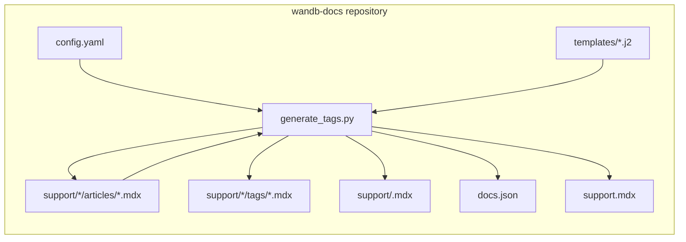
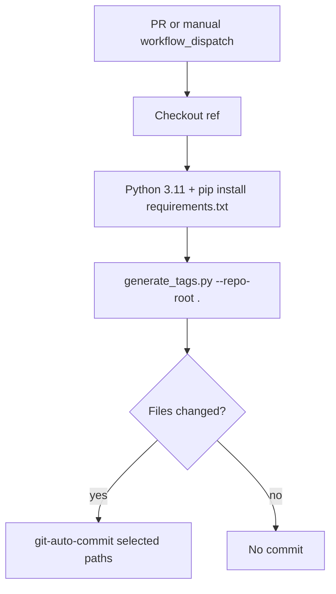
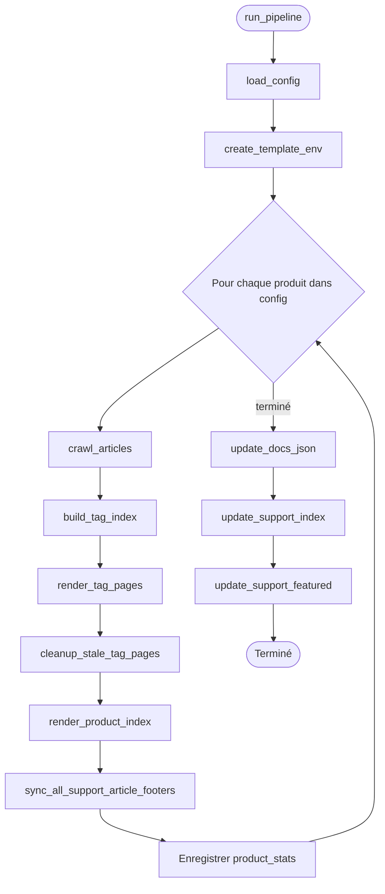
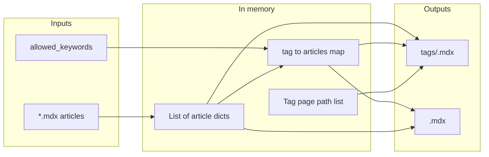

  # Architecture du générateur de navigation de la base de connaissances

Ce document décrit le système **Knowledgebase Nav** du dépôt `wandb-docs` : ce qu’il génère, les fichiers et fonctions qui le font fonctionner, et la manière dont l’automatisation relie l’ensemble. Pour connaître les étapes destinées aux auteurs et la configuration locale, consultez [README.md](./README.md).

  ## Objectif

Le générateur assure la cohérence entre la navigation du support (base de connaissances) et le contenu des articles. Il s’exécute sur les produits configurés (par exemple models, weave, inference), lit les articles MDX dans `support/<product>/articles/` et met à jour les pages MDX générées, les décomptes du fichier racine `support.mdx`, ainsi que les onglets de support en anglais dans `docs.json`.

  ## Contexte général

Le système se trouve entièrement dans `wandb-docs`. Il n’effectue aucun appel à des API externes. Il lit et écrit des fichiers dans l’arborescence de travail du dépôt.

La flèche de retour vers **articles** indique que la phase 4 met à jour uniquement les liens `<Badge>` qui pointent vers des pages de tags sous `/support/<product>/tags/`, encadrés par des marqueurs de commentaire MDX. Les autres contenus (y compris `---`, les autres Badges et le texte en dehors des marqueurs) ne sont pas réécrits.

  ## Workflow d’automatisation

Les pull requests déclenchent le workflow **Knowledgebase Nav** lorsque des fichiers sous `support/**` ou `scripts/knowledgebase-nav/**` sont modifiés (y compris lors de nouveaux pushes vers une PR ouverte). Il installe les dépendances Python, exécute le générateur et effectue un commit des chemins correspondants lorsqu’il y a des différences. Les pull requests provenant de **forks** récupèrent le commit HEAD du fork et exécutent tout de même le générateur, mais l’étape d’auto-commit est ignorée, car le jeton par défaut ne peut pas effectuer de push vers des forks.

Les motifs de chemin inclus dans le commit sont `support.mdx`, `support/*/articles/*.mdx`, `support/*/tags/*.mdx`, `support/*.mdx` (index de produits) et `docs.json`.

  ## Orchestration du pipeline

`run_pipeline(repo_root, config_path)` est le point d’entrée unique utilisé par la CLI et les tests. Il charge `config.yaml`, crée un environnement Jinja2 commun à tous les produits, puis parcourt chaque produit. Après la boucle, il met à jour `docs.json` une seule fois et `support.mdx` une seule fois.

  ## Flux de données par produit

Au sein d’un même produit, les données passent des fichiers bruts à des structures en mémoire, puis sont reconverties en MDX et en structures agrégées pour les étapes suivantes.

`render_tag_pages` renvoie des chaînes d’ID de page triées (par exemple `support/models/tags/security`) que `update_docs_json` intègre à l’onglet de navigation en anglais pour ce produit.

  ## Composants et fichiers

| Composant                         | Chemin                                    | Rôle                                                                         |
| --------------------------------- | ----------------------------------------- | ---------------------------------------------------------------------------- |
| CLI et logique                    | `generate_tags.py`                        | Toutes les phases, parsing, règles de slug, aperçus, réécritures JSON et MDX |
| Registre des produits et des tags | `config.yaml`                             | `slug`, `display_name`, `allowed_keywords` par produit                       |
| Modèle de liste des tags          | `templates/support_tag.mdx.j2`            | Une carte par article sur la page d’un tag                                   |
| Modèle du hub produit             | `templates/support_product_index.mdx.j2`  | Section mise en avant et cartes de navigation par catégorie                  |
| Dépendances                       | `requirements.txt`                        | PyYAML, Jinja2                                                               |
| Tests unitaires                   | `tests/test_generate_tags.py`             | Système de fichiers simulé et `docs.json`                                    |
| Tests d&#39;intégration           | `tests/test_golden_output.py`             | Pipeline complet sur une copie temporaire du dépôt réel                      |
| Marqueurs Pytest                  | `tests/conftest.py`                       | Enregistre le marqueur `integration` pour la suite de tests golden           |
| CI                                | `.github/workflows/knowledgebase-nav.yml` | Déclencheurs, script d’exécution, commit automatique                         |
| Documentation auteur              | `README.md`                               | Workflows pour les rédacteurs et les développeurs                            |
| Notes d&#39;architecture          | `Architecture.md`                         | Diagrammes et vue d’ensemble des modules pour les développeurs               |

  ## Sections fonctionnelles de `generate_tags.py`

Les fonctions sont regroupées ci-dessous dans l’ordre où elles apparaissent dans le fichier source. Les noms renvoient à l’API Python.

  ### Configuration

* **`load_config`** lit et valide `config.yaml` (clés obligatoires pour chaque produit).

  ### Structure de l’article et pieds de page

* **`parse_frontmatter`**, **`_extract_body`** séparent le front matter YAML du corps principal. `_extract_body` utilise `_BADGE_START` comme délimiteur et supprime, à titre cosmétique, une ligne `---` finale.
* **`_split_frontmatter_raw`** divise le MDX brut en bloc de front matter et en contenu restant pour la réécriture du pied de page.
* **`_normalize_keywords`** convertit le front matter `keywords` en liste de chaînes de caractères (liste YAML ; une seule chaîne devient un tag avec un avertissement ; les autres types déclenchent un avertissement et deviennent une liste vide).
* **`_keywords_list_for_footer`** renvoie les `keywords` normalisés pour générer le pied de page (délègue à **`_normalize_keywords`**).
* **`_tab_badge_pattern`**, **`build_tab_badges_mdx`**, **`build_keyword_footer_mdx`**, **`_replace_tab_badges_in_body`** implémentent une synchronisation ciblée des badges d’onglet. Les Badge gérés sont entourés par les commentaires marqueurs `_BADGE_START` / `_BADGE_END` ; la fonction fait correspondre les marqueurs lorsqu’ils sont présents et, sinon, utilise une regex pour les articles antérieurs à l’ajout des marqueurs. Les nouveaux pieds de page ajoutent une ligne vide, les marqueurs et les Badge.
* **`sync_support_article_footer`**, **`sync_all_support_article_footers`** écrivent les fichiers d’article lorsque les badges d’onglet ne sont plus synchronisés avec `keywords`.

  ### Aperçus du corps (extraits de carte)

* **`plain_text`** supprime le Markdown (y compris les lignes horizontales), les liens, les URL, les balises HTML ou MDX et autres éléments similaires afin que les aperçus restent en texte brut (U+00A0 remplacé par une espace après le décodage des entités, guillemets typographiques convertis en ASCII, la liste d’autorisation conserve `_` et `=` pour les identifiants).
* **`extract_body_preview`** applique `plain_text`, tronque à `BODY_PREVIEW_MAX_LENGTH` et ajoute `BODY_PREVIEW_SUFFIX` si nécessaire.

  ### Slugs et parcours

* **`tag_slug`** associe un mot-clé affiché à un nom de fichier ou à un segment d’URL (en minuscules, avec des traits d’union).
* **`crawl_articles`** parcourt `support/<slug>/articles/*.mdx` et construit des dictionnaires d’articles (`title`, `keywords`, `featured`, `body_preview`, `page_path`, `tag_links`, entre autres).

  ### Agrégation des tags et contenu mis en avant

* **`get_featured_articles`** filtre et trie les articles mis en avant pour l’index produit.
* **`build_tag_index`** regroupe les articles par mot-clé, les trie par titre au sein de chaque tag et signale les mots-clés inconnus qui ne figurent pas dans `allowed_keywords`.

  ### Génération

* **`tojson_unicode`**, **`create_template_env`** configurent Jinja2 pour MDX (les modèles utilisent le filtre `tojson_unicode` pour les valeurs du front matter YAML).
* **`render_tag_pages`** écrit `support/<product>/tags/<tag-slug>.mdx`.
* **`cleanup_stale_tag_pages`** supprime les fichiers `.mdx` du répertoire des tags qui viennent d’être générés, afin que le répertoire et `docs.json` ne contiennent pas d’entrées obsolètes.
* **`render_product_index`** écrit `support/<product>.mdx`.

  ### Mises à jour à l’échelle du site

* **`update_docs_json`** met à jour ou crée des onglets masqués `Support: <display_name>` sous `navigation.languages` lorsque `language` vaut `en`, en définissant `pages` sur l’index du produit ainsi que sur les chemins de tags triés.
* **`update_support_index`** met à jour les lignes de comptage sur les cartes produit dans le `support.mdx` racine. Privilégie les marqueurs `{/* auto-generated counts */}` ; utilise une regex comme solution de secours pour la migration.
* **`update_support_featured`** régénère la section des articles mis en avant entre les marqueurs `_FEATURED_START` / `_FEATURED_END` dans le `support.mdx` racine.

  ### CLI

* **`main`** analyse `--repo-root` et éventuellement `--config`, puis appelle **`run_pipeline`**.

  ## Constantes

* **`BODY_PREVIEW_MAX_LENGTH`** et **`BODY_PREVIEW_SUFFIX`** contrôlent la longueur de l’aperçu de la carte et l’ellipse.
* **`DOCS_JSON_NAV_LANGUAGE`** vaut `"en"` et limite les modifications de navigation à l’arborescence anglaise uniquement.
* **`_BADGE_START`** / **`_BADGE_END`** sont les marqueurs de commentaire MDX qui encadrent les badges d’onglet gérés sur chaque page d’article.
* **`_FEATURED_START`** / **`_FEATURED_END`** sont les marqueurs de commentaire MDX qui encadrent la section des articles mis en avant dans le fichier racine `support.mdx`.

  ## Choix de conception

* **Script monolithique** : un seul fichier regroupe toute la logique, afin que le flux de travail et les contributeurs disposent d’un point d’entrée unique pour lire et modifier le comportement.
* **Mots-clés autorisés** : `config.yaml` répertorie les tags valides par produit ; les tags inconnus génèrent tout de même des pages, mais produisent des avertissements afin que du contenu ne soit jamais omis silencieusement.
* **Gestion des Badge d’onglet** : seuls les éléments `<Badge>` liés à `/support/<product>/tags/...` sont dérivés de `keywords`. Ils sont entourés de commentaires marqueurs afin que le générateur n’ait pas besoin de faire des correspondances par regex après la migration. La ligne `---` entre le corps et les badges est purement cosmétique ; `_extract_body` utilise `_BADGE_START` comme délimitation et ne supprime un `---` final que pour le nettoyage.
* **Nettoyage des tags obsolètes** : les pages de tags qui ne correspondent plus à aucun mot-clé d’article sont supprimées après la génération, avant la mise à jour de `docs.json`. Cela permet de conserver un répertoire de tags et une navigation sans entrées orphelines.
* **Édition basée sur des marqueurs** : toutes les sections générées automatiquement (badges d’onglet des articles, lignes de comptage de `support.mdx` et articles mis en avant) utilisent des commentaires marqueurs MDX. Cela rend les zones gérées visibles pour les rédacteurs et permet au générateur de remplacer le contenu précisément, sans dépendre d’ancres regex fragiles. Chaque paire de marqueurs dispose d’un chemin de migration qui entoure le contenu non balisé lors de la première exécution.
* **Tests Golden** : comparent les pages de tags générées, les pages d’index de produit, les fichiers d’article (y compris les marqueurs de pied de page), les onglets de support dans `docs.json` et le `support.mdx` racine à l’arborescence versionnée, afin que toute dérive de sortie soit visible sous forme de diff unifié.

  ## Lectures complémentaires

* [README.md](./README.md) pour l’utilisation, la configuration d’un venv local et le dépannage.
* [AGENTS.md](../../AGENTS.md) à la racine du dépôt pour les conventions de style de la documentation lors de la modification de contenu Mintlify.