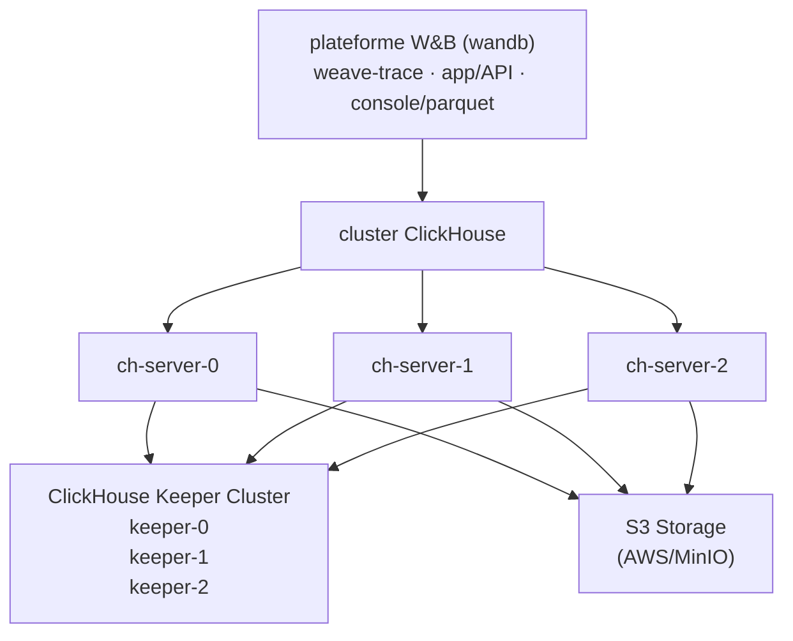

L’auto-hébergement de W&amp;B Weave vous permet de mieux contrôler son environnement et sa configuration. Cela peut vous aider à créer un environnement plus isolé et à répondre à des exigences supplémentaires en matière de sécurité et de conformité. Ce document vous guide dans le déploiement de tous les composants requis pour exécuter W&amp;B Weave dans un environnement autogéré à l’aide de l’Altinity ClickHouse Operator.

Les déploiements Weave autogérés s’appuient sur [ClickHouseDB](https://clickhouse.com/) pour gérer leur backend. Ce déploiement utilise :

* **Altinity ClickHouse Operator**: Gestion de ClickHouse de niveau entreprise pour Kubernetes
* **ClickHouse Keeper**: Service de coordination distribué (remplace ZooKeeper)
* **cluster ClickHouse**: Cluster de base de données haute disponibilité pour le stockage des traces
* **S3-Compatible Storage**: Stockage d’objets pour la persistance des données ClickHouse

<Tip>
  Pour une architecture de référence détaillée, voir [W&amp;B Self-Managed Reference Architecture](https://docs.wandb.ai/guides/hosting/self-managed/ref-arch/#models-and-weave).
</Tip>

<div id="important-setup-notes">
  ## Notes importantes sur la configuration
</div>

Les exemples de configuration de ce guide sont fournis à titre de référence uniquement. Comme l&#39;environnement Kubernetes de chaque organisation est unique, votre instance auto-hébergée vous obligera probablement à ajuster les éléments suivants :

* **Sécurité et conformité** : les contextes de sécurité, les valeurs `runAsUser`/`fsGroup` et les autres paramètres de sécurité, conformément aux politiques de sécurité de votre organisation et aux exigences de Kubernetes/OpenShift.
* **Dimensionnement des ressources** : les allocations de ressources indiquées sont des points de départ. **Consultez votre équipe W&amp;B Solutions Architect** pour dimensionner correctement votre déploiement en fonction du volume de traces attendu et des exigences de performances.
* **Spécificités de l&#39;infrastructure** : mettez à jour les classes de stockage, les sélecteurs de nœud et les autres paramètres propres à l&#39;infrastructure afin qu&#39;ils correspondent à votre environnement.

Les configurations de ce guide doivent être considérées comme des modèles, et non comme des solutions prescriptives.

<div id="architecture">
  ## Architecture
</div>



<div id="prerequisites">
  ## Prérequis
</div>

Les instances Weave autogérées nécessitent les ressources suivantes :

* **Cluster Kubernetes** : version 1.29+
* **Nœuds Kubernetes** : cluster multinœud (minimum 3 nœuds recommandés pour une haute disponibilité)
* **Classe de stockage** : une StorageClass fonctionnelle pour les volumes persistants (par ex. : `gp3`, `standard`, `nfs-csi`)
* **Bucket S3** : bucket S3 ou compatible S3 préconfiguré avec les autorisations d&#39;accès appropriées
* **Plateforme W&amp;B** : déjà installée et en fonctionnement (voir le [W&amp;B Self-Managed Deployment Guide](https://docs.wandb.ai/guides/hosting/hosting-options/self-managed/))
* **Licence W&amp;B** : licence compatible avec Weave fournie par l&#39;assistance W&amp;B

<Warning>
  Ne prenez pas de décisions de dimensionnement en vous basant uniquement sur cette liste de prérequis. Les besoins en ressources varient considérablement selon le volume de traces et les modes d&#39;utilisation. Voir la section détaillée [Exigences en ressources](#resource-requirements) pour des recommandations explicites sur le dimensionnement du cluster.
</Warning>

<div id="required-tools">
  ### Outils requis
</div>

Pour configurer votre instance, vous avez besoin des outils suivants :

* `kubectl` configuré avec un accès au cluster
* `helm` v3.0+
* Identifiants AWS (si vous utilisez S3) ou un accès à un stockage compatible S3

<div id="network-requirements">
  ### Exigences réseau
</div>

Votre cluster Kubernetes nécessite la configuration réseau suivante :

* Les pods de l’espace de noms `clickhouse` doivent pouvoir communiquer avec les pods de l’espace de noms `wandb`
* Les nœuds ClickHouse doivent pouvoir communiquer entre eux sur les ports 8123, 9000, 9009 et 2181

<div id="deploy-your-self-managed-weave-instance">
  ## Déployez votre instance autogérée de Weave
</div>

<div id="step-1-deploy-altinity-clickhouse-operator">
  ### Étape 1 : Déployer l’Altinity ClickHouse Operator
</div>

L’Altinity ClickHouse Operator gère les installations ClickHouse dans Kubernetes.

<div id="11-add-the-altinity-helm-repository">
  #### 1.1 Ajouter le dépôt Helm d’Altinity
</div>

```bash
helm repo add altinity https://helm.altinity.com
helm repo update
```


<div id="12-create-the-operator-configuration">
  #### 1.2 Créez la configuration de l’opérateur
</div>

Créez un fichier appelé `ch-operator.yaml` :

Les valeurs `containerSecurityContext` indiquées ici conviennent à la plupart des distributions Kubernetes. Pour **OpenShift**, vous devrez peut-être ajuster `runAsUser` et `fsGroup` pour qu’ils correspondent à la plage d’UID attribuée à votre projet.

<div id="13-install-the-operator">
  #### 1.3 Installez l’opérateur
</div>

```bash
helm upgrade --install ch-operator altinity/altinity-clickhouse-operator \
  --namespace clickhouse \
  --create-namespace \
  -f ch-operator.yaml
```


<div id="14-verify-the-operator-installation">
  #### 1.4 Vérifier l’installation de l’opérateur
</div>

<div id="step-2-prepare-s3-storage">
  ### Étape 2 : Préparer le stockage S3
</div>

ClickHouse nécessite un stockage S3 ou compatible avec S3 pour assurer la persistance des données.

<div id="21-create-an-s3-bucket">
  #### 2.1 Créer un bucket S3
</div>

Créez un bucket S3 dans votre compte AWS ou chez un fournisseur de stockage compatible S3 :

<div id="22-configure-s3-credentials">
  #### 2.2 Configurer les identifiants d’accès à S3
</div>

Vous avez deux options pour fournir des identifiants d’accès à S3 :

<div id="option-a-using-aws-iam-roles-irsa-recommended-for-aws">
  ##### Option A : utiliser des rôles IAM AWS (IRSA - recommandé pour AWS)
</div>

Si vos nœuds Kubernetes disposent d’un rôle IAM donnant accès à S3, ClickHouse peut utiliser les métadonnées de l’instance EC2 :

**Stratégie IAM requise** (jointe au rôle IAM de votre nœud) :

```json
{
  "Version": "2012-10-17",
  "Statement": [
    {
      "Effect": "Allow",
      "Action": ["s3:GetObject", "s3:PutObject", "s3:DeleteObject", "s3:ListBucket"],
      "Resource": ["arn:aws:s3:::my-wandb-clickhouse-bucket", "arn:aws:s3:::my-wandb-clickhouse-bucket/*"]
    }
  ]
}
```

<div id="option-b-using-access-keys">
  ##### Option B : Utiliser des clés d’accès
</div>

Si vous préférez utiliser des identifiants statiques, créez un secret Kubernetes :

```bash
kubectl create secret generic aws-creds \
  --namespace clickhouse \
  --from-literal aws_access_key=YOUR_ACCESS_KEY \
  --from-literal aws_secret_key=YOUR_SECRET_KEY
```

Ensuite, configurez ClickHouse pour utiliser le secret (voir la configuration ch-server.yaml ci-dessous).


<div id="step-3-deploy-clickhouse-keeper">
  ### Étape 3 : Déployer ClickHouse Keeper
</div>

[ClickHouse Keeper](https://clickhouse.com/docs/guides/sre/keeper/clickhouse-keeper) sert de système de coordination pour la réplication des données et l’exécution des requêtes DDL distribuées.

<div id="31-create-the-keeper-configuration">
  #### 3.1 Créez la configuration de Keeper
</div>

Créez un fichier appelé `ch-keeper.yaml` :

**Mises à jour importantes de la configuration** :

* **StorageClass** : Mettez à jour `storageClassName: gp3` afin qu’il corresponde à une StorageClass disponible sur votre cluster
* **Contexte de sécurité** : Ajustez les valeurs `runAsUser` et `fsGroup` pour respecter les politiques de sécurité de votre organisation
* **Anti-affinité** : Personnalisez ou supprimez la section `affinity` en fonction de la topologie de votre cluster et de vos exigences de haute disponibilité
* **Ressources** : Les valeurs de CPU et de mémoire sont données à titre d’exemple - consultez les architectes solutions W&amp;B pour dimensionner correctement
* **Nommage** : Si vous modifiez `metadata.name` ou `configuration.clusters[0].name`, vous **devez mettre à jour** les noms d’hôte Keeper dans ch-server.yaml (Étape 4) en conséquence

<div id="32-deploy-clickhouse-keeper">
  #### 3.2 Déployer ClickHouse Keeper
</div>

```bash
kubectl apply -f ch-keeper.yaml
```


<div id="33-verify-keeper-deployment">
  #### 3.3 Vérifier le déploiement de Keeper
</div>

<div id="step-4-deploy-clickhouse-cluster">
  ### Étape 4 : Déployer le cluster ClickHouse
</div>

Déployez maintenant le cluster de serveurs ClickHouse qui stockera les données de trace de Weave.

<div id="41-create-the-clickhouse-server-configuration">
  #### 4.1 Créer la configuration du serveur ClickHouse
</div>

Créez un fichier appelé `ch-server.yaml` :

**Mises à jour critiques de configuration requises** :

1. **StorageClass** : Mettez à jour `storageClassName: gp3` pour qu’il corresponde à la StorageClass de votre cluster
2. **Endpoint S3** : Remplacez `YOUR-BUCKET-NAME` et `YOUR-REGION` par vos valeurs réelles
3. **Taille du cache** : La valeur `<max_size>40Gi</max_size>` doit être **inférieure** à la taille du volume persistant (50Gi)
4. **Contexte de sécurité** : Ajustez `runAsUser`, `fsGroup` et les autres paramètres de sécurité pour qu’ils soient conformes aux politiques de votre organisation
5. **Allocation des ressources** : Les valeurs de CPU et de mémoire sont fournies à titre d’exemple uniquement - **consultez votre Solutions Architect W&amp;B** pour dimensionner correctement en fonction du volume de traces attendu
6. **Règles d’anti-affinité** : Personnalisez-les ou supprimez-les selon la topologie de votre cluster et vos besoins en haute disponibilité
7. **Noms d’hôte Keeper** : Les noms d’hôte des nœuds Keeper **doivent correspondre** à la convention de nommage de votre déploiement Keeper à l’étape 3 (voir « Comprendre le nommage de Keeper » ci-dessous)
8. **Nommage du cluster** : Le nom du cluster `weavecluster` peut être modifié, mais il doit correspondre à la valeur `WF_CLICKHOUSE_REPLICATED_CLUSTER` à l’étape 5
9. **Identifiants** :
   * Pour IRSA : Conservez `<use_environment_credentials>true</use_environment_credentials>` ou utilisez vos clés secrètes mappées sur des variables d’environnement.

<div id="42-update-s3-configuration">
  #### 4.2 Mettre à jour la configuration S3
</div>

Modifiez la section `storage_configuration.xml` de `ch-server.yaml` :

**Exemple avec AWS S3** :

```xml
<endpoint>https://my-wandb-clickhouse.s3.eu-central-1.amazonaws.com/s3_disk/{replica}</endpoint>
<region>eu-central-1</region>
```

**Exemple avec MinIO** :

```xml
<endpoint>https://minio.example.com:9000/my-bucket/s3_disk/{replica}</endpoint>
<region>us-east-1</region>
```

<Warning>
  **Ne supprimez pas `{replica}`.** Cela garantit que chaque réplique ClickHouse écrit dans son propre dossier du bucket.
</Warning>


<div id="43-configure-credentials-option-b-only">
  #### 4.3 Configurez les identifiants d’accès (option B uniquement)
</div>

Si vous utilisez **l’option B (clés d’accès)** de l’étape 2, assurez-vous que la section `env` de `ch-server.yaml` fait référence au secret :

```yaml
env:
  - name: AWS_ACCESS_KEY_ID
    valueFrom:
      secretKeyRef:
        name: aws-creds
        key: aws_access_key
  - name: AWS_SECRET_ACCESS_KEY
    valueFrom:
      secretKeyRef:
        name: aws-creds
        key: aws_secret_key
```

Si vous utilisez **l’option A (IRSA)**, supprimez toute la section `env`.


<div id="44-understanding-keeper-naming">
  #### 4.4 Comprendre le nommage de Keeper
</div>

Les noms d’hôte des nœuds Keeper dans la section `zookeeper.nodes` suivent un format précis en fonction de votre déploiement Keeper à l’étape 3 :

**Format du nom d’hôte** : `chk-{installation-name}-{cluster-name}-{cluster-index}-{replica-index}.{namespace}.svc.cluster.local`

Où :

* `chk` = préfixe ClickHouseKeeperInstallation (fixe)
* `{installation-name}` = le `metadata.name` de ch-keeper.yaml (par ex., `wandb`)
* `{cluster-name}` = le `configuration.clusters[0].name` de ch-keeper.yaml (par ex., `keeper`)
* `{cluster-index}` = index du cluster, généralement `0` pour un cluster unique
* `{replica-index}` = numéro de réplique : `0`, `1`, `2` pour 3 répliques
* `{namespace}` = espace de noms Kubernetes (par ex., `clickhouse`)

**Exemple avec les noms par défaut** :

```
chk-wandb-keeper-0-0.clickhouse.svc.cluster.local
chk-wandb-keeper-0-1.clickhouse.svc.cluster.local
chk-wandb-keeper-0-2.clickhouse.svc.cluster.local
```

**Si vous personnalisez le nom de l’installation Keeper** (par ex., `metadata.name: myweave`) :

```
chk-myweave-keeper-0-0.clickhouse.svc.cluster.local
chk-myweave-keeper-0-1.clickhouse.svc.cluster.local
chk-myweave-keeper-0-2.clickhouse.svc.cluster.local
```

**Si vous personnalisez le nom du cluster Keeper** (par exemple, `clusters[0].name: coordination`) :

```
chk-wandb-coordination-0-0.clickhouse.svc.cluster.local
chk-wandb-coordination-0-1.clickhouse.svc.cluster.local
chk-wandb-coordination-0-2.clickhouse.svc.cluster.local
```

**Pour vérifier vos noms d’hôte Keeper effectifs** :

<Note>
  Les noms d’hôte Keeper dans `ch-server.yaml` **doivent correspondre exactement** aux noms de service effectivement créés lors du déploiement de Keeper, faute de quoi les serveurs ClickHouse ne pourront pas se connecter au service de coordination.
</Note>

<div id="45-deploy-clickhouse-cluster">
  #### 4.5 Déployer le cluster ClickHouse
</div>

```bash
kubectl apply -f ch-server.yaml
```


<div id="46-verify-clickhouse-deployment">
  #### 4.6 Vérifier le déploiement de ClickHouse
</div>

<div id="step-5-enable-weave-in-wb-platform">
  ### Étape 5 : Activer Weave dans la plateforme W&amp;B
</div>

Configurez maintenant la plateforme W&amp;B afin d’utiliser le cluster ClickHouse pour les traces Weave.

<div id="51-gather-clickhouse-connection-information">
  #### 5.1 Rassemblez les informations de connexion à ClickHouse
</div>

Vous aurez besoin des éléments suivants :

* **Hôte** : `clickhouse-wandb.clickhouse.svc.cluster.local`
* **Port** : `8123`
* **Utilisateur** : `weave` (tel que configuré dans ch-server.yaml)
* **Mot de passe** : `weave123` (tel que configuré dans ch-server.yaml)
* **Base de données** : `weave` (sera créée automatiquement)
* **Nom du cluster** : `weavecluster` (tel que configuré dans ch-server.yaml)

Le nom d’hôte suit le modèle suivant : `clickhouse-{installation-name}.{namespace}.svc.cluster.local`

<div id="52-update-wb-custom-resource">
  #### 5.2 Mettre à jour la ressource personnalisée W&amp;B
</div>

Modifiez la ressource personnalisée (CR) de votre plateforme W&amp;B pour y ajouter la configuration Weave :

**Paramètres critiques** :

* `clickhouse.replicated: true` - **Requis** lors de l’utilisation de 3 réplicas
* `WF_CLICKHOUSE_REPLICATED: "true"` - **Requis** pour une configuration répliquée
* `WF_CLICKHOUSE_REPLICATED_CLUSTER: "weavecluster"` - **Doit correspondre** au nom du cluster dans ch-server.yaml

<Note>
  Les contextes de sécurité, les allocations de ressources et les autres configurations spécifiques à Kubernetes présentés ci-dessus sont fournis à titre d’exemple. Personnalisez-les en fonction des besoins de votre organisation et consultez votre équipe d’architectes solutions W&amp;B pour dimensionner correctement les ressources.
</Note>

<div id="53-apply-the-updated-configuration">
  #### 5.3 Appliquez la configuration mise à jour
</div>

```bash
kubectl apply -f wandb-cr.yaml
```


<div id="54-verify-weave-trace-deployment">
  #### 5.4 Vérifier le déploiement de Weave Trace
</div>

<div id="step-6-initialize-weave-database">
  ### Étape 6 : Initialiser la base de données Weave
</div>

Le service weave-trace créera automatiquement le schéma de la base de données requis lors du premier démarrage.

<div id="61-monitor-database-migration">
  #### 6.1 Surveiller la migration de la base de données
</div>

<div id="62-verify-database-creation">
  #### 6.2 Vérifier la création de la base de données
</div>

<div id="step-7-verify-weave-is-enabled">
  ### Étape 7 : Vérifier que Weave est activé
</div>

<div id="71-access-wb-console">
  #### 7.1 Accéder à la console W&amp;B
</div>

Accédez à l’URL de votre instance W&amp;B depuis un navigateur web.

<div id="72-check-weave-license-status">
  #### 7.2 Vérifier le statut de la licence Weave
</div>

Dans la console W&amp;B :

1. Accédez à **Top Right Menu** → **Organization Dashboard**
2. Vérifiez que **l’accès à Weave** est activé

<div id="73-test-weave-functionality">
  #### 7.3 Tester le bon fonctionnement de Weave
</div>

Créez un test Python simple pour vérifier que Weave fonctionne :

Après avoir exécuté ceci, vérifiez les traces dans l&#39;UI W&amp;B, sur la page Traces de votre organisation.

<div id="troubleshooting">
  ## Dépannage
</div>

<div id="clickhouse-keeper-issues">
  ### Problèmes liés à ClickHouse Keeper
</div>

**Problème** : les pods Keeper restent bloqués à l’état `Pending`

**Solution** : vérifiez les différentes causes possibles :

1. **Problèmes de PVC et de StorageClass** :

```bash
kubectl get pvc -n clickhouse
kubectl describe pvc -n clickhouse
```

Assurez-vous que votre StorageClass est correctement configurée et qu’elle dispose de capacité disponible.

2. **Anti-affinité et disponibilité des nœuds** :

Problèmes courants :

* L’anti-affinité nécessite 3 nœuds distincts, mais le cluster en compte moins
* Les nœuds n’ont pas suffisamment de CPU/mémoire pour satisfaire les requêtes des pods
* Les taints des nœuds empêchent la planification des pods

**Solutions** :

* Supprimez ou ajustez les règles d’anti-affinité si vous avez moins de 3 nœuds
* Utilisez `preferredDuringSchedulingIgnoredDuringExecution` au lieu de `requiredDuringSchedulingIgnoredDuringExecution` pour une anti-affinité moins stricte
* Réduisez les requêtes de ressources si les nœuds sont limités
* Ajoutez davantage de nœuds à votre cluster

***

**Problème** : les pods Keeper sont en `CrashLoopBackOff`

**Solution** : consultez les journaux et vérifiez la configuration :

```bash
kubectl logs -n clickhouse <keeper-pod-name>
```

Problèmes courants :

* Contexte de sécurité incorrect (vérifiez runAsUser, fsGroup)
* Problèmes d’autorisation sur les volumes
* Conflits de ports
* Erreurs de configuration dans ch-keeper.yaml

<div id="clickhouse-server-issues">
  ### Problèmes du serveur ClickHouse
</div>

**Problème** : ClickHouse ne parvient pas à se connecter à S3

**Solution** : Vérifiez les identifiants et les autorisations S3 :

***

**Problème** : ClickHouse ne parvient pas à se connecter à Keeper

**Solution** : Vérifiez les endpoints et le naming de Keeper :

Si la connexion échoue, les noms d’hôte Keeper dans ch-server.yaml ne correspondent probablement pas à votre déploiement Keeper effectif. Voir « Comprendre le nommage de Keeper » à l’étape 4 pour connaître la convention de nommage.

<div id="weave-trace-issues">
  ### Problèmes Weave Trace
</div>

**Problème** : le pod `weave-trace` ne parvient pas à démarrer

**Solution** : vérifiez la connectivité à ClickHouse :

***

**Problème** : Weave n’apparaît pas comme activé dans console

**Solution** : Vérifiez la configuration :

1. Vérifiez que la licence inclut Weave :

   ```bash
   kubectl get secret license-key -n wandb -o jsonpath='{.data.value}' | base64 -d | jq
   ```

2. Assurez-vous que `weave-trace.enabled: true` et `clickhouse.replicated: true` sont définis dans wandb-cr.yaml

3. Vérifiez les journaux de l’opérateur W&amp;B :
   ```bash
   kubectl logs -n wandb deployment/wandb-controller-manager
   ```

***

**Problème** : La migration de la base de données échoue

**Solution** : Vérifiez que le nom du cluster correspond :

La variable d’environnement `WF_CLICKHOUSE_REPLICATED_CLUSTER` **doit correspondre** au nom du cluster dans ch-server.yaml :

<div id="resource-requirements">
  ## Exigences de ressources
</div>

<Warning>
  Les allocations de ressources ci-dessous sont **donnés uniquement à titre indicatif comme points de départ**. Les besoins réels varient considérablement en fonction des éléments suivants :

  * Volume d’ingestion des traces (traces par seconde)
  * Schémas de requêtes et niveau de concurrence
  * Période de rétention des données
  * Nombre d’utilisateurs simultanés

  **Consultez toujours votre équipe d’architectes solutions W&amp;B** afin de déterminer le dimensionnement adapté à votre cas d’usage. Des ressources sous-dimensionnées peuvent entraîner des problèmes de performances, tandis qu’un surdimensionnement engendre des coûts d’infrastructure inutiles.
</Warning>

<div id="minimum-production-setup">
  ### Configuration minimale pour la production
</div>

| Composant         | Réplicas   | Requête / limite CPU | Requête / limite mémoire | Stockage    |
| ----------------- | ---------- | -------------------- | ------------------------ | ----------- |
| ClickHouse Keeper | 3          | 0.5 / 1              | 256Mi / 2Gi              | 10Gi chacun |
| ClickHouse Server | 3          | 1 / 4                | 1Gi / 16Gi               | 50Gi chacun |
| Weave Trace       | 1          | 1 / 4                | 4Gi / 8Gi                | -           |
| **Total**         | **7 pods** | **~4.5 / 15 CPU**    | **~7.8Gi / 58Gi**        | **180Gi**   |

*Convient pour : le développement, les tests ou les environnements de production à faible volume*

<div id="recommended-production-setup">
  ### Configuration de production recommandée
</div>

Pour les charges de travail de production avec un volume de traces élevé :

| Composant         | Réplicas     | Requête / limite CPU | Requête / limite mémoire | Stockage     |
| ----------------- | ------------ | -------------------- | ------------------------ | ------------ |
| ClickHouse Keeper | 3            | 1 / 2                | 1Gi / 4Gi                | 20Gi chacun  |
| ClickHouse Server | 3            | 1 / 16               | 8Gi / 64Gi               | 200Gi chacun |
| Weave Trace       | 2-3          | 1 / 4                | 4Gi / 8Gi                | -            |
| **Total**         | **8-9 pods** | **~6-9 / 52-64 CPU** | **~27-33Gi / 204-216Gi** | **660Gi**    |

*Convient pour : les environnements de production à fort volume*

Pour les déploiements à très haut volume, contactez votre équipe d’architectes solutions W&amp;B pour obtenir des recommandations de dimensionnement personnalisées en fonction de votre volume de traces et de vos exigences de performances.

<div id="advanced-configuration">
  ## Configuration avancée
</div>

Cette section présente les options de personnalisation des déploiements Weave autogérés, notamment l’augmentation de la capacité de ClickHouse par mise à l’échelle verticale ou mise à l’échelle horizontale, la mise à jour des versions de ClickHouse en modifiant les tags d’image dans les configurations keeper et server, ainsi que la surveillance de l’état de ClickHouse.

Nous vous recommandons de consulter l’équipe d’architectes solutions W&amp;B lorsque vous apportez des modifications avancées à votre instance, afin de vous assurer qu’elles répondent à vos exigences en matière de performances et de fiabilité.

<div id="scaling-clickhouse">
  ### Mise à l’échelle de ClickHouse
</div>

Pour augmenter la capacité de ClickHouse, vous pouvez :

1. **Mise à l’échelle verticale** : augmente les ressources par pod (approche la plus simple)

   ```yaml
   resources:
     requests:
       memory: 8Gi
       cpu: 1
     limits:
       memory: 64Gi
       cpu: 16
   ```

   **Recommandation** : surveillez l’utilisation réelle des ressources et ajustez la mise à l’échelle en conséquence. Pour les déploiements à très grand volume, contactez votre équipe W&amp;B Solutions Architect.

2. **Mise à l’échelle horizontale** : ajoute plus de réplicas (nécessite une planification rigoureuse)
   * L’augmentation du nombre de réplicas nécessite un rééquilibrage des données
   * Consultez la documentation de ClickHouse pour la gestion des shards
   * **Contactez un W&amp;B Solutions Architect** avant de mettre en place une mise à l’échelle horizontale en production

<div id="using-different-clickhouse-versions">
  ### Utiliser différentes versions de ClickHouse
</div>

Pour utiliser une autre version de ClickHouse, mettez à jour le tag de l’image dans les deux fichiers `ch-keeper.yaml` et `ch-server.yaml` :

Les versions de Keeper et du serveur doivent correspondre, ou la version de Keeper doit être &gt;= à la version du serveur pour garantir la compatibilité.

<div id="monitoring-clickhouse">
  ### Surveillance de ClickHouse
</div>

Accédez aux tables système de ClickHouse à des fins de surveillance :

<div id="backup-and-recovery">
  ### Sauvegarde et récupération
</div>

Les données ClickHouse sont stockées dans S3, ce qui offre des capacités de sauvegarde natives grâce à la gestion des versions de S3 et aux fonctionnalités de réplication de bucket. Pour les stratégies de sauvegarde propres à votre déploiement, consultez votre équipe W&amp;B Solutions Architect et référez-vous à la [documentation de sauvegarde ClickHouse](https://clickhouse.com/docs/en/operations/backup).

<div id="security-considerations">
  ## Considérations de sécurité
</div>

1. **Identifiants** : stockez les mots de passe ClickHouse dans des secrets Kubernetes, et non en texte brut
2. **Politiques réseau** : envisagez de mettre en place des NetworkPolicies pour restreindre l’accès à ClickHouse
3. **RBAC** : assurez-vous que les comptes de service disposent des autorisations minimales requises
4. **Bucket S3** : activez le chiffrement au repos et limitez l’accès au bucket aux rôles IAM nécessaires
5. **TLS** (Facultatif) : en production, activez TLS pour les connexions clientes à ClickHouse

<div id="upgrading">
  ## Mise à niveau
</div>

<div id="upgrading-clickhouse-operator">
  ### Mise à niveau de l’opérateur ClickHouse
</div>

```bash
helm upgrade ch-operator altinity/altinity-clickhouse-operator \
  --namespace clickhouse \
  -f ch-operator.yaml
```


<div id="upgrading-clickhouse-server">
  ### Mise à niveau du serveur ClickHouse
</div>

Mettez à jour la version de l’image dans `ch-server.yaml`, puis appliquez la modification :

<div id="upgrading-weave-trace">
  ### Mise à niveau de Weave Trace
</div>

Mettez à jour le tag d’image dans `wandb-cr.yaml`, puis appliquez :

<div id="additional-resources">
  ## Ressources supplémentaires
</div>

* [Documentation de l’opérateur Altinity ClickHouse](https://docs.altinity.com/altinitykubernetesoperator/)
* [Documentation de ClickHouse](https://clickhouse.com/docs)
* [Documentation de Weave de W&amp;B](https://docs.wandb.ai/weave)
* [Configuration du stockage S3 de ClickHouse](https://clickhouse.com/docs/en/engines/table-engines/mergetree-family/mergetree#s3-virtual-hosted-style)

<div id="support">
  ## Support
</div>

Pour les déploiements en Production ou en cas de problème :

* **Support W&amp;B** : `support@wandb.com`
* **Architectes solutions** : pour les déploiements à très gros volume, le dimensionnement personnalisé et la planification du déploiement
* **Incluez dans les demandes d&#39;assistance** :
  * Journaux de weave-trace, des pods ClickHouse et de l&#39;opérateur
  * Version de W&amp;B, version de ClickHouse, version de Kubernetes
  * Informations sur le cluster et volume de traces

<div id="faq">
  ## FAQ
</div>

**Q : Puis-je utiliser une seule réplique ClickHouse au lieu de 3 ?**

R : Oui, mais ce n’est pas recommandé en Production. Mettez à jour `replicasCount: 1` dans ch-server.yaml et définissez `clickhouse.replicated: false` dans wandb-cr.yaml.

**Q : Puis-je utiliser une autre base de données à la place de ClickHouse ?**

R : Non, Weave Trace nécessite ClickHouse pour ses capacités de stockage colonnaire haute performance.

**Q : De combien de stockage S3 aurai-je besoin ?**

R : Les besoins en stockage S3 dépendent de votre volume de traces, de la durée de rétention et de la compression des données. Surveillez votre utilisation réelle après le déploiement et ajustez en conséquence. Le format colonnaire de ClickHouse offre une excellente compression pour les données de trace.

**Q : Dois-je configurer le nom de `database` dans ClickHouse ?**

R : Non, la base de données `weave` sera créée automatiquement par le service weave-trace lors du démarrage initial.

**Q : Que faire si le nom de mon cluster n’est pas `weavecluster` ?**

R : Vous devez définir la variable d’environnement `WF_CLICKHOUSE_REPLICATED_CLUSTER` pour qu’elle corresponde au nom de votre cluster, sinon les migrations de base de données échoueront.

**Q : Dois-je utiliser exactement les contextes de sécurité indiqués dans les exemples ?**

R : Non. Les contextes de sécurité (runAsUser, fsGroup, etc.) fournis dans ce guide sont des exemples de référence. Vous devez les adapter pour respecter les politiques de sécurité de votre organisation, en particulier pour les clusters OpenShift, qui imposent des plages UID/GID spécifiques.

**Q : Comment savoir si mon cluster ClickHouse est correctement dimensionné ?**

R : Contactez votre équipe d’architectes solutions W&amp;B en indiquant votre volume de traces prévu et vos modèles d’utilisation. Elle vous fournira des recommandations de dimensionnement spécifiques. Surveillez l’utilisation des ressources de votre déploiement et ajustez si nécessaire.

**Q : Puis-je personnaliser les conventions de nommage utilisées dans les exemples ?**

R : Oui, mais vous devez rester cohérent dans tous les composants :

1. **Noms des ClickHouse Keeper** → Doivent correspondre aux noms d’hôte des nœuds Keeper dans la section `zookeeper.nodes` de ch-server.yaml
2. **Nom du cluster ClickHouse** (`weavecluster`) → Doit correspondre à `WF_CLICKHOUSE_REPLICATED_CLUSTER` dans wandb-cr.yaml
3. **Nom de l’installation ClickHouse** → Affecte le nom d’hôte du service utilisé par weave-trace

Voir la section « Understanding Keeper Naming » à l’étape 4 pour plus de détails sur le schéma de nommage et sur la façon de vérifier vos noms réels.

**Q : Que faire si mon cluster utilise des exigences d’anti-affinité différentes ?**

R : Les règles d’anti-affinité présentées sont des recommandations pour assurer une haute disponibilité. Ajustez-les ou supprimez-les en fonction de la taille de votre cluster, de sa topologie et de vos exigences de disponibilité. Pour les petits clusters ou les environnements de développement, vous n’aurez peut-être pas besoin de règles d’anti-affinité.