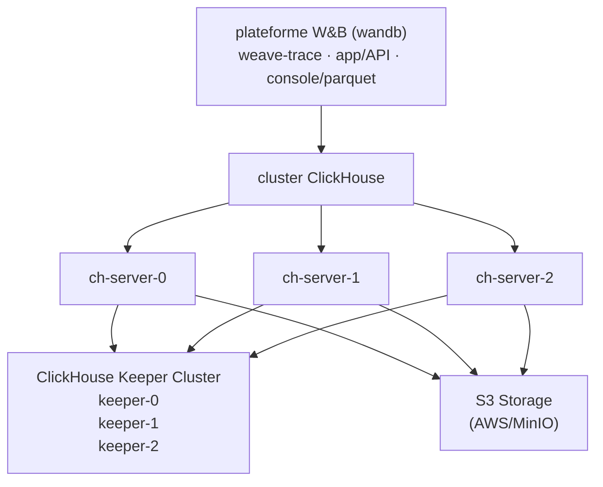

L’auto-hébergement de W&amp;B Weave vous offre un contrôle accru sur son environnement et sa configuration. Cela peut vous aider à créer un environnement plus isolé et à répondre à des exigences supplémentaires en matière de conformité de sécurité.

Ce document vous guide dans le déploiement des composants requis pour exécuter W&amp;B Weave dans un déploiement [W&amp;B Autogéré](/fr/platform/hosting/hosting-options/self-managed) à l’aide de l’Altinity ClickHouse Operator. À la fin, vous disposerez d’une instance Weave de niveau production exécutée sur votre propre cluster Kubernetes, avec une base de données ClickHouse répliquée et un stockage d’objets compatible S3. Ce guide s’adresse aux administrateurs Kubernetes et aux ingénieurs plateforme responsables du déploiement et de l’exploitation de W&amp;B au sein de leur organisation.

Les déploiements Weave autogérés s’appuient sur [ClickHouseDB](https://clickhouse.com/) pour gérer leur backend. Ce déploiement utilise :

* **Altinity ClickHouse Operator** : gestion de ClickHouse de niveau entreprise pour Kubernetes.
* **ClickHouse Keeper** : service de coordination distribué (remplace ZooKeeper).
* **ClickHouse Cluster** : cluster de base de données haute disponibilité pour le stockage des traces.
* **S3-compatible storage** : stockage d’objets pour la persistance des données ClickHouse.

<Tip>
  Pour une architecture de référence détaillée, voir [l’architecture de référence de W&amp;B Autogéré](https://docs.wandb.ai/guides/hosting/self-managed/ref-arch/#models-and-weave).
</Tip>

<div id="important-setup-notes">
  ## Notes importantes sur la configuration
</div>

Les exemples de configuration de ce guide sont fournis à titre de référence uniquement. Comme l’environnement Kubernetes de chaque organisation est unique, votre instance auto-hébergée vous oblige probablement à ajuster les éléments suivants :

* **Sécurité et conformité** : les contextes de sécurité, les valeurs `runAsUser` ou `fsGroup` et les autres paramètres de sécurité, conformément aux politiques de sécurité de votre organisation et aux exigences de Kubernetes ou d’OpenShift.
* **Dimensionnement des ressources** : les allocations de ressources indiquées sont des points de départ. **Consultez votre équipe Solutions Architect W&amp;B** pour dimensionner correctement votre déploiement en fonction du volume de traces attendu et des exigences de performances.
* **Spécificités de l’infrastructure** : mettez à jour les classes de stockage, les sélecteurs de nœud et les autres paramètres propres à l’infrastructure afin qu’ils correspondent à votre environnement.

Considérez ces configurations comme des modèles, et non comme des solutions prescriptives.

<div id="architecture">
  ## Architecture
</div>

Le diagramme suivant montre comment la plateforme W&amp;B, le cluster ClickHouse, le service de coordination ClickHouse Keeper et le stockage S3 s&#39;intègrent dans un déploiement Weave autogéré.



<div id="prerequisites">
  ## Prérequis
</div>

Avant de commencer, assurez-vous que votre environnement répond aux exigences suivantes. Les instances Weave autogérées nécessitent les ressources suivantes :

* **Cluster Kubernetes** : version 1.29 ou ultérieure.
* **Nœuds Kubernetes** : cluster multinœud (minimum 3 nœuds recommandés pour une haute disponibilité).
* **Classe de stockage** : une StorageClass fonctionnelle pour les volumes persistants (par exemple, `gp3`, `standard` ou `nfs-csi`).
* **Bucket S3** : bucket S3 ou S3-compatible préconfiguré avec les autorisations d&#39;accès appropriées.
* **plateforme W&amp;B** : déjà installée et en fonctionnement. Voir le [guide de déploiement W&amp;B Autogéré](https://docs.wandb.ai/guides/hosting/hosting-options/self-managed/).
* **Licence W&amp;B** : licence avec Weave activé obtenue auprès de l&#39;assistance W&amp;B.

<Warning>
  Ne prenez pas de décisions de dimensionnement en vous basant uniquement sur cette liste de prérequis. Les besoins en ressources varient selon le volume de traces et les modes d&#39;utilisation. Pour plus d&#39;informations, voir [Exigences en ressources](#resource-requirements).
</Warning>

<div id="required-tools">
  ### Outils requis
</div>

Pour configurer votre instance, vous avez besoin des outils suivants :

* `kubectl` configuré avec un accès au cluster.
* `helm` version 3.0 ou ultérieure.
* Identifiants AWS (si vous utilisez S3) ou un accès à un stockage compatible S3.

<div id="network-requirements">
  ### Exigences réseau
</div>

Votre cluster Kubernetes nécessite la configuration réseau suivante :

* Les pods de l’espace de noms `clickhouse` doivent pouvoir communiquer avec les pods de l’espace de noms `wandb`.
* Les nœuds ClickHouse doivent pouvoir communiquer entre eux sur les ports `8123`, `9000`, `9009` et `2181`.

<div id="deploy-your-self-managed-weave-instance">
  ## Déployez votre instance Weave autogérée
</div>

Les étapes suivantes vous guident tout au long du déploiement de l’opérateur, de la préparation du stockage, du déploiement de ClickHouse Keeper et du cluster ClickHouse, ainsi que de l’activation de Weave dans la plateforme W&amp;B. Effectuez-les dans l’ordre, car chacune s’appuie sur les ressources créées à l’étape précédente.

<div id="deploy-the-altinity-clickhouse-operator">
  ### Déployer l’Altinity ClickHouse Operator
</div>

L’Altinity ClickHouse Operator gère les installations ClickHouse dans Kubernetes. Installer l’opérateur en premier permet aux étapes suivantes de déclarer les ressources ClickHouse Keeper et de cluster ClickHouse, que l’opérateur prend ensuite en charge pour vous.

<div id="add-the-altinity-helm-repository">
  #### Ajouter le dépôt Helm d’Altinity
</div>

```bash
helm repo add altinity https://helm.altinity.com
helm repo update
```

<div id="create-the-operator-configuration">
  #### Créez la configuration de l’opérateur
</div>

Créez un fichier appelé `ch-operator.yaml`. Ce fichier définit le contexte de sécurité et les métadonnées du déploiement de l’opérateur :

```yaml
operator:
  image:
    repository: altinity/clickhouse-operator

  # Contexte de sécurité - ajustez selon les exigences de votre cluster
  containerSecurityContext:
    runAsGroup: 0
    runAsNonRoot: true
    runAsUser: 10001 # Mettez à jour selon les politiques de sécurité de votre OpenShift/Kubernetes
    allowPrivilegeEscalation: false
    capabilities:
      drop:
        - ALL
    privileged: false
    readOnlyRootFilesystem: false

metrics:
  enabled: false

# Remplacement du nom - personnalisez si nécessaire
nameOverride: "wandb"
```

Les valeurs `containerSecurityContext` indiquées ici conviennent à la plupart des distributions Kubernetes. Pour OpenShift, vous devrez peut-être ajuster `runAsUser` et `fsGroup` pour qu’ils correspondent à la plage d’UID attribuée à votre projet.

<div id="install-the-operator">
  #### Installez l’opérateur
</div>

```bash
helm upgrade --install ch-operator altinity/altinity-clickhouse-operator \
  --namespace clickhouse \
  --create-namespace \
  -f ch-operator.yaml
```

<div id="verify-the-operator-installation">
  #### Vérifier l’installation de l’opérateur
</div>

```bash
# Vérifier que le pod de l'opérateur est en cours d'exécution
kubectl get pods -n clickhouse

# Résultat attendu :
# NAME                                 READY   STATUS    RESTARTS   AGE
# ch-operator-wandb-xxxxx              1/1     Running   0          30s

# Vérifier la version de l'image de l'opérateur
kubectl get pods -n clickhouse -o jsonpath="{.items[*].spec.containers[*].image}" | \
  tr ' ' '\n' | grep -v 'metrics-exporter' | sort -u

# Résultat attendu :
# altinity/clickhouse-operator:0.25.4
```

Avec l’opérateur en cours d’exécution, vous pouvez maintenant provisionner le stockage persistant et les services de coordination dont le cluster ClickHouse dépend.

<div id="prepare-s3-storage">
  ### Préparer le stockage S3
</div>

ClickHouse nécessite un stockage S3 ou compatible S3 pour assurer la persistance des données. Dans cette étape, vous créez le bucket et configurez l’authentification de ClickHouse à celui-ci.

<div id="create-an-s3-bucket">
  #### Créer un bucket S3
</div>

Créez un bucket S3 dans votre compte AWS ou chez un fournisseur de stockage compatible S3. Remplacez `[BUCKET-NAME]` par le nom de votre bucket et `[REGION]` par votre région AWS :

```bash
# Exemple pour AWS
aws s3 mb s3://[BUCKET-NAME] --region [REGION]
```

<div id="configure-s3-credentials">
  #### Configurer les identifiants d’accès à S3
</div>

ClickHouse nécessite des identifiants pour lire dans le bucket et y écrire. Vous avez deux options pour fournir des identifiants d’accès à S3. W&amp;B recommande l’option A (IRSA) sur AWS, car elle évite de stocker des secrets à long terme dans le cluster.

<div id="option-a-use-aws-iam-roles-irsa-recommended-for-aws">
  ##### Option A : utiliser des rôles IAM AWS (IRSA, recommandé pour AWS)
</div>

Si vos nœuds Kubernetes disposent d’un rôle IAM donnant accès à S3, ClickHouse peut utiliser les métadonnées de l’instance EC2 :

```yaml
# Dans ch-server.yaml, définissez :
<use_environment_credentials>true</use_environment_credentials>
```

Stratégie IAM requise (jointe au rôle IAM de votre nœud) :

```json
{
  "Version": "2012-10-17",
  "Statement": [
    {
      "Effect": "Allow",
      "Action": [
        "s3:GetObject",
        "s3:PutObject",
        "s3:DeleteObject",
        "s3:ListBucket"
      ],
      "Resource": [
        "arn:aws:s3:::[BUCKET-NAME]",
        "arn:aws:s3:::[BUCKET-NAME]/*"
      ]
    }
  ]
}
```

<div id="option-b-use-access-keys">
  ##### Option B : Utiliser des clés d’accès
</div>

Si vous préférez utiliser des identifiants statiques, créez un secret Kubernetes :

Remplacez `[ACCESS-KEY]` par votre clé d’accès AWS et `[SECRET-KEY]` par votre clé secrète AWS :

```bash
kubectl create secret generic aws-creds \
  --namespace clickhouse \
  --from-literal aws_access_key=[ACCESS-KEY] \
  --from-literal aws_secret_key=[SECRET-KEY]
```

Ensuite, configurez ClickHouse pour utiliser le secret (voir la configuration ch-server.yaml à l’étape 4).

<div id="deploy-clickhouse-keeper">
  ### Déployer ClickHouse Keeper
</div>

[ClickHouse Keeper](https://clickhouse.com/docs/guides/sre/keeper/clickhouse-keeper) sert de système de coordination pour la réplication des données et l’exécution des requêtes DDL distribuées. Vous devez déployer Keeper avant le cluster ClickHouse, car les serveurs ClickHouse de l’étape 4 s’y connectent au démarrage.

<div id="create-the-keeper-configuration">
  #### Créez la configuration de Keeper
</div>

Créez un fichier appelé `ch-keeper.yaml`. Ce manifeste définit un cluster Keeper à trois réplicas avec anti-affinité, stockage persistant et les paramètres utilisés par l’opérateur Altinity pour provisionner les pods Keeper :

```yaml
apiVersion: "clickhouse-keeper.altinity.com/v1"
kind: "ClickHouseKeeperInstallation"
metadata:
  name: wandb
  namespace: clickhouse
  annotations: {}
spec:
  defaults:
    templates:
      podTemplate: default
      dataVolumeClaimTemplate: default

  templates:
    podTemplates:
      - name: keeper
        metadata:
          labels:
            app: clickhouse-keeper
        spec:
          # Pod security context - adjust according to your environment
          securityContext:
            fsGroup: 10001 # Update based on your cluster's security requirements
            fsGroupChangePolicy: Always
            runAsGroup: 0
            runAsNonRoot: true
            runAsUser: 10001 # For OpenShift, use your project's assigned UID range
            seccompProfile:
              type: RuntimeDefault

          # Anti-affinité pour répartir les keepers sur les nœuds (recommandé pour la haute disponibilité)
          # Personnalisez ou supprimez selon la taille de votre cluster et vos exigences de disponibilité
          affinity:
            podAntiAffinity:
              requiredDuringSchedulingIgnoredDuringExecution:
                - labelSelector:
                    matchExpressions:
                      - key: "app"
                        operator: In
                        values:
                          - clickhouse-keeper
                  topologyKey: "kubernetes.io/hostname"

          containers:
            - name: clickhouse-keeper
              imagePullPolicy: IfNotPresent
              image: "clickhouse/clickhouse-keeper:25.10"
              # Resource requests - example values, adjust based on workload
              resources:
                requests:
                  memory: "256Mi"
                  cpu: "0.5"
                limits:
                  memory: "2Gi"
                  cpu: "1"

              securityContext:
                allowPrivilegeEscalation: false
                capabilities:
                  drop:
                    - ALL
                privileged: false
                readOnlyRootFilesystem: false

    volumeClaimTemplates:
      - name: data
        metadata:
          labels:
            app: clickhouse-keeper
        spec:
          storageClassName: gp3 # Change to your StorageClass
          accessModes:
            - ReadWriteOnce
          resources:
            requests:
              storage: 10Gi

  configuration:
    clusters:
      - name: keeper # Keeper cluster name - used in service DNS naming
        layout:
          replicasCount: 3
        templates:
          podTemplate: keeper
          dataVolumeClaimTemplate: data

    settings:
      logger/level: "information"
      logger/console: "true"
      listen_host: "0.0.0.0"
      keeper_server/four_letter_word_white_list: "*"
      keeper_server/coordination_settings/raft_logs_level: "information"
      keeper_server/enable_ipv6: "false"
      keeper_server/coordination_settings/async_replication: "true"
```

Mises à jour importantes de la configuration :

* **StorageClass** : Mettez à jour `storageClassName: gp3` afin qu’il corresponde à une StorageClass disponible sur votre cluster.
* **Contexte de sécurité** : Ajustez les valeurs `runAsUser` et `fsGroup` pour respecter les politiques de sécurité de votre organisation.
* **Anti-affinité** : Personnalisez ou supprimez la section `affinity` en fonction de la topologie de votre cluster et de vos exigences de haute disponibilité.
* **Ressources** : Les valeurs de CPU et de mémoire sont données à titre d’exemple. Consultez les Solutions Architects W&amp;B pour dimensionner correctement.
* **Nommage** : Si vous modifiez `metadata.name` ou `configuration.clusters[0].name`, vous devez mettre à jour les noms d’hôte Keeper dans `ch-server.yaml` (Étape 4) en conséquence.

<div id="deploy-clickhouse-keeper-resources">
  #### Déployer les ressources ClickHouse Keeper
</div>

```bash
kubectl apply -f ch-keeper.yaml
```

<div id="verify-the-keeper-deployment">
  #### Vérifier le déploiement de Keeper
</div>

```bash
# Vérifier les pods Keeper
kubectl get pods -n clickhouse -l app=clickhouse-keeper

# Résultat attendu :
# NAME                     READY   STATUS    RESTARTS   AGE
# chk-wandb-keeper-0-0-0   1/1     Running   0          2m
# chk-wandb-keeper-0-1-0   1/1     Running   0          2m
# chk-wandb-keeper-0-2-0   1/1     Running   0          2m

# Vérifier les services Keeper
kubectl get svc -n clickhouse | grep keeper

# Les services Keeper doivent apparaître sur le port 2181
```

Une fois Keeper opérationnel, vous pouvez désormais déployer le cluster ClickHouse qui l’utilise pour la coordination.

<div id="deploy-the-clickhouse-cluster">
  ### Déployer le cluster ClickHouse
</div>

Déployez maintenant le cluster de serveurs ClickHouse qui stocke les données de trace de Weave. Il s’agit de l’étape la plus importante de ce guide, car le cluster se connecte à la fois au service Keeper de l’étape 3 et au bucket S3 de l’étape 2.

<div id="create-the-clickhouse-server-configuration">
  #### Créer la configuration du serveur ClickHouse
</div>

Créez un fichier appelé `ch-server.yaml`. Ce manifeste décrit le cluster ClickHouse, sa connexion à Keeper, le compte utilisateur Weave et la stratégie de stockage S3 utilisée pour les données de trace :

```yaml
apiVersion: "clickhouse.altinity.com/v1"
kind: "ClickHouseInstallation"
metadata:
  name: wandb
  namespace: clickhouse
  annotations: {}
spec:
  defaults:
    templates:
      podTemplate: default
      dataVolumeClaimTemplate: default

  templates:
    podTemplates:
      - name: clickhouse
        metadata:
          labels:
            app: clickhouse-server
        spec:
          # Pod security context - customize for your environment
          securityContext:
            fsGroup: 10001 # Adjust based on your security policies
            fsGroupChangePolicy: Always
            runAsGroup: 0
            runAsNonRoot: true
            runAsUser: 10001 # For OpenShift, use assigned UID range
            seccompProfile:
              type: RuntimeDefault

          # Anti-affinity rule - ensures servers run on different nodes (optional but recommended)
          # Adjust or remove based on your cluster size and requirements
          affinity:
            podAntiAffinity:
              requiredDuringSchedulingIgnoredDuringExecution:
                - labelSelector:
                    matchExpressions:
                      - key: "app"
                        operator: In
                        values:
                          - clickhouse-server
                  topologyKey: "kubernetes.io/hostname"

          containers:
            - name: clickhouse
              image: clickhouse/clickhouse-server:25.10
              # Example resource allocation - adjust based on workload
              resources:
                requests:
                  memory: 1Gi
                  cpu: 1
                limits:
                  memory: 16Gi
                  cpu: 4

              # AWS credentials (remove this section if using IRSA)
              env:
                - name: AWS_ACCESS_KEY_ID
                  valueFrom:
                    secretKeyRef:
                      name: aws-creds
                      key: aws_access_key
                - name: AWS_SECRET_ACCESS_KEY
                  valueFrom:
                    secretKeyRef:
                      name: aws-creds
                      key: aws_secret_key

              securityContext:
                allowPrivilegeEscalation: false
                capabilities:
                  drop:
                    - ALL
                privileged: false
                readOnlyRootFilesystem: false

    volumeClaimTemplates:
      - name: data
        metadata:
          labels:
            app: clickhouse-server
        spec:
          accessModes:
            - ReadWriteOnce
          resources:
            requests:
              storage: 50Gi
          storageClassName: gp3 # Change to your StorageClass

  configuration:
    # Keeper (ZooKeeper) configuration
    # IMPORTANT: These hostnames MUST match your Keeper deployment from Step 3
    zookeeper:
      nodes:
        - host: chk-wandb-keeper-0-0.clickhouse.svc.cluster.local
          port: 2181
        - host: chk-wandb-keeper-0-1.clickhouse.svc.cluster.local
          port: 2181
        - host: chk-wandb-keeper-0-2.clickhouse.svc.cluster.local
          port: 2181
      # Optional: Uncomment to adjust timeouts if needed
      # session_timeout_ms: 30000
      # operation_timeout_ms: 10000

    # Users configuration: https://clickhouse.com/docs/operations/configuration-files#user-settings
    # For production, use a SHA-256 hashed password instead of plain text:
    # printf "your-password" | sha256sum
    # Then use: weave/password_sha256_hex: <hash> instead of weave/password
    users:
      weave/password: [WEAVE-PASSWORD]  # Remplacez par un mot de passe fort avant le déploiement
      weave/access_management: 1
      weave/profile: default
      weave/networks/ip:
        - "0.0.0.0/0"
        - "::"

    # Server settings
    settings:
      disable_internal_dns_cache: 1

    # Cluster configuration
    clusters:
      - name: weavecluster # Cluster name - can be customized but must match wandb-cr.yaml
        layout:
          shardsCount: 1
          replicasCount: 3 # Number of replicas - adjust based on HA requirements
        templates:
          podTemplate: clickhouse
          dataVolumeClaimTemplate: data

    # Configuration files
    files:
      config.d/network_configuration.xml: |
        <clickhouse>
            <listen_host>0.0.0.0</listen_host>
            <listen_host>::</listen_host>
        </clickhouse>

      config.d/logger.xml: |
        <clickhouse>
            <logger>
                <level>information</level>
            </logger>
        </clickhouse>

      config.d/storage_configuration.xml: |
        <clickhouse>
            <storage_configuration>
                <disks>
                    <s3_disk>
                        <type>s3</type>
                        <!-- Mettez à jour avec le point de terminaison et la région de votre bucket S3 -->
                        <endpoint>https://[BUCKET-NAME].s3.[REGION].amazonaws.com/s3_disk/{replica}</endpoint>
                        <metadata_path>/var/lib/clickhouse/disks/s3_disk/</metadata_path>
                        <use_environment_credentials>true</use_environment_credentials>
                        <region>[REGION]</region>
                    </s3_disk>
                    <s3_disk_cache>
                        <type>cache</type>
                        <disk>s3_disk</disk>
                        <path>/var/lib/clickhouse/s3_disk_cache/cache/</path>
                        <!-- Cache size MUST be smaller than persistent volume -->
                        <max_size>40Gi</max_size>
                        <cache_on_write_operations>true</cache_on_write_operations>
                    </s3_disk_cache>
                </disks>
                <policies>
                    <s3_main>
                        <volumes>
                            <main>
                                <disk>s3_disk_cache</disk>
                            </main>
                        </volumes>
                    </s3_main>
                </policies>
            </storage_configuration>
            <merge_tree>
                <storage_policy>s3_main</storage_policy>
            </merge_tree>
        </clickhouse>
```

Mises à jour critiques de configuration requises :

1. **StorageClass** : Mettez à jour `storageClassName: gp3` pour qu&#39;il corresponde à la StorageClass de votre cluster.
2. **Point de terminaison S3** : Remplacez `[BUCKET-NAME]` et `[REGION]` par vos valeurs effectives.
3. **Taille du cache** : La valeur `<max_size>40Gi</max_size>` doit être inférieure à la taille du volume persistant (50Gi).
4. **Contexte de sécurité** : Ajustez `runAsUser`, `fsGroup` et les autres paramètres de sécurité pour qu&#39;ils respectent les politiques de votre organisation.
5. **Allocation des ressources** : Les valeurs de CPU et de mémoire sont fournies à titre d&#39;exemple. Consultez votre Solutions Architect W&amp;B pour dimensionner correctement en fonction du volume de traces prévu.
6. **Règles d&#39;anti-affinité** : Personnalisez-les ou supprimez-les en fonction de la topologie de votre cluster et de vos exigences de haute disponibilité.
7. **Noms d&#39;hôte Keeper** : Les noms d&#39;hôte des nœuds Keeper doivent correspondre au nommage de votre déploiement Keeper à l&#39;étape 3 (voir « Keeper naming »).
8. **Nommage du cluster** : Le nom de cluster `weavecluster` peut être modifié, mais il doit correspondre à la valeur `WF_CLICKHOUSE_REPLICATED_CLUSTER` à l&#39;étape 5.
9. **Identifiants** :
   * Pour IRSA : Conservez `<use_environment_credentials>true</use_environment_credentials>` ou utilisez vos clés secrètes exposées via des variables d&#39;environnement.

<div id="update-the-s3-configuration">
  #### Mettre à jour la configuration S3
</div>

Modifiez la section `storage_configuration.xml` de `ch-server.yaml`.

Exemple avec AWS S3 :

```xml
<endpoint>https://my-wandb-clickhouse.s3.eu-central-1.amazonaws.com/s3_disk/{replica}</endpoint>
<region>eu-central-1</region>
```

Exemple avec MinIO :

```xml
<endpoint>https://minio.example.com:9000/my-bucket/s3_disk/{replica}</endpoint>
<region>us-east-1</region>
```

<Warning>
  Ne supprimez pas `{replica}`. Cela garantit que chaque réplique ClickHouse écrit dans son propre dossier du bucket.
</Warning>

<div id="configure-credentials-option-b-only">
  #### Configurez les identifiants d’accès (option B uniquement)
</div>

Si vous utilisez l’option B (clés d’accès) de l’étape 2, assurez-vous que la section `env` de `ch-server.yaml` fait référence au secret :

```yaml
env:
  - name: AWS_ACCESS_KEY_ID
    valueFrom:
      secretKeyRef:
        name: aws-creds
        key: aws_access_key
  - name: AWS_SECRET_ACCESS_KEY
    valueFrom:
      secretKeyRef:
        name: aws-creds
        key: aws_secret_key
```

Si vous utilisez **l’option A (IRSA)**, supprimez toute la section `env`.

<div id="keeper-naming">
  #### Noms d’hôte de Keeper
</div>

Il est essentiel que les noms d’hôte de Keeper soient corrects. S’ils ne correspondent pas aux services créés à l’étape 3, ClickHouse ne démarrera pas. Les noms d’hôte des nœuds Keeper dans la section `zookeeper.nodes` suivent un modèle précis, basé sur votre déploiement Keeper de l’étape 3.

Modèle de nom d’hôte : `chk-[INSTALLATION-NAME]-[CLUSTER-NAME]-[CLUSTER-INDEX]-[REPLICA-INDEX].[NAMESPACE].svc.cluster.local`

Où :

* `chk` est le préfixe ClickHouseKeeperInstallation (fixe).
* `[INSTALLATION-NAME]` correspond à `metadata.name` dans `ch-keeper.yaml` (par exemple, `wandb`).
* `[CLUSTER-NAME]` correspond à `configuration.clusters[0].name` dans `ch-keeper.yaml` (par exemple, `keeper`).
* `[CLUSTER-INDEX]` est l’index du cluster, généralement `0` pour un cluster unique.
* `[REPLICA-INDEX]` est le numéro du réplica : `0`, `1` ou `2` pour 3 réplicas.
* `[NAMESPACE]` est l’espace de noms Kubernetes (par exemple, `clickhouse`).

Exemple avec les noms par défaut :

```text
chk-wandb-keeper-0-0.clickhouse.svc.cluster.local
chk-wandb-keeper-0-1.clickhouse.svc.cluster.local
chk-wandb-keeper-0-2.clickhouse.svc.cluster.local
```

Si vous personnalisez le nom de l’installation Keeper (par exemple, `metadata.name: myweave`) :

```text
chk-myweave-keeper-0-0.clickhouse.svc.cluster.local
chk-myweave-keeper-0-1.clickhouse.svc.cluster.local
chk-myweave-keeper-0-2.clickhouse.svc.cluster.local
```

Si vous personnalisez le nom du cluster Keeper (par exemple, `clusters[0].name: coordination`) :

```text
chk-wandb-coordination-0-0.clickhouse.svc.cluster.local
chk-wandb-coordination-0-1.clickhouse.svc.cluster.local
chk-wandb-coordination-0-2.clickhouse.svc.cluster.local
```

Pour vérifier les noms d’hôte réels de Keeper :

```bash
# Lister les services Keeper pour voir les noms réels
kubectl get svc -n clickhouse | grep keeper

# Lister les pods Keeper pour confirmer le modèle de nommage
kubectl get pods -n clickhouse -l app=clickhouse-keeper
```

<Note>
  Les noms d’hôte de Keeper dans `ch-server.yaml` doivent correspondre exactement aux noms de service réellement créés par le déploiement de Keeper ; sinon, les serveurs ClickHouse ne parviendront pas à se connecter au service de coordination.
</Note>

<div id="deploy-the-clickhouse-cluster-resources">
  #### Déployer les ressources du cluster ClickHouse
</div>

```bash
kubectl apply -f ch-server.yaml
```

<div id="verify-the-clickhouse-deployment">
  #### Vérifier le déploiement de ClickHouse
</div>

```bash
# Vérifier les pods ClickHouse
kubectl get pods -n clickhouse -l app=clickhouse-server

# Résultat attendu :
# NAME                           READY   STATUS    RESTARTS   AGE
# chi-wandb-weavecluster-0-0-0   1/1     Running   0          3m
# chi-wandb-weavecluster-0-1-0   1/1     Running   0          3m
# chi-wandb-weavecluster-0-2-0   1/1     Running   0          3m

# Tester la connectivité ClickHouse
kubectl exec -n clickhouse chi-wandb-weavecluster-0-0-0 -- \
  clickhouse-client --user weave --password [WEAVE-PASSWORD] --query "SELECT version()"

# Vérifier le statut du cluster
kubectl exec -n clickhouse chi-wandb-weavecluster-0-0-0 -- \
  clickhouse-client --user weave --password [WEAVE-PASSWORD] --query \
  "SELECT cluster, host_name, port FROM system.clusters WHERE cluster='weavecluster'"
```

À ce stade, vous disposez d&#39;un cluster ClickHouse opérationnel, soutenu par Keeper et S3. Les étapes restantes consistent à connecter la plateforme W&amp;B à ce cluster et à confirmer que les traces Weave circulent de bout en bout.

<div id="enable-weave-in-the-wb-platform">
  ### Activer Weave dans la plateforme W&amp;B
</div>

Configurez maintenant la plateforme W&amp;B afin d’utiliser le cluster ClickHouse pour les traces Weave. Cette étape indique à l’opérateur W&amp;B où trouver votre instance ClickHouse gérée en externe et active le service `weave-trace`.

<div id="gather-clickhouse-connection-information">
  #### Rassemblez les informations de connexion à ClickHouse
</div>

Vous aurez besoin des éléments suivants :

* **Hôte** : `clickhouse-wandb.clickhouse.svc.cluster.local`
* **Port** : `8123`
* **Utilisateur** : `weave` (tel que configuré dans `ch-server.yaml`)
* **Mot de passe** : Le mot de passe que vous avez défini dans `ch-server.yaml`
* **Base de données** : `weave` (créée automatiquement)
* **Nom du cluster** : `weavecluster` (tel que configuré dans `ch-server.yaml`)

Le nom d’hôte suit le modèle suivant : `clickhouse-[INSTALLATION-NAME].[NAMESPACE].svc.cluster.local`

<div id="update-the-wb-custom-resource">
  #### Mettre à jour la ressource personnalisée W&amp;B
</div>

Modifiez la ressource personnalisée (CR) de votre plateforme W&amp;B pour y ajouter la configuration Weave :

```yaml
apiVersion: apps.wandb.com/v1
kind: WeightsAndBiases
metadata:
  name: wandb
  namespace: wandb
spec:
  values:
    global:
      # ... configuration existante ...

      # Ajouter la configuration ClickHouse
      clickhouse:
        install: false # Nous l'avons déployé séparément
        host: clickhouse-wandb.clickhouse.svc.cluster.local
        port: 8123
        user: weave
        password: [WEAVE-PASSWORD]
        database: weave
        replicated: true # REQUIS pour une configuration multi-réplicas

      # Activer Weave Trace
      weave-trace:
        enabled: true

    # Configuration de Weave Trace
    weave-trace:
      install: true
      extraEnv:
        WF_CLICKHOUSE_REPLICATED: "true"
        WF_CLICKHOUSE_REPLICATED_CLUSTER: "weavecluster"
      image:
        repository: wandb/weave-trace
        tag: 0.74.1
      replicaCount: 1
      size: "default"
      sizing:
        default:
          autoscaling:
            horizontal:
              enabled: false
          # Exemple d'allocation de ressources - à ajuster selon la charge de travail
          resources:
            limits:
              cpu: 4
              memory: "8Gi"
            requests:
              cpu: 1
              memory: "4Gi"
      # Contexte de sécurité du pod - à personnaliser selon votre environnement
      podSecurityContext:
        fsGroup: 10001 # À ajuster selon vos exigences de sécurité
        fsGroupChangePolicy: Always
        runAsGroup: 0
        runAsNonRoot: true
        runAsUser: 10001 # Pour OpenShift, utilisez la plage d'UID attribuée
        seccompProfile:
          type: RuntimeDefault
      # Contexte de sécurité du conteneur
      securityContext:
        allowPrivilegeEscalation: false
        capabilities:
          drop:
            - ALL
        privileged: false
        readOnlyRootFilesystem: false
```

Paramètres critiques :

* `clickhouse.replicated: true`: Requis lors de l’utilisation de 3 réplicas.
* `WF_CLICKHOUSE_REPLICATED: "true"`: Requis pour une configuration répliquée.
* `WF_CLICKHOUSE_REPLICATED_CLUSTER: "weavecluster"`: Doit correspondre au nom du cluster dans `ch-server.yaml`.

<Note>
  Les contextes de sécurité, les allocations de ressources et les autres configurations spécifiques à Kubernetes présentés ici sont fournis à titre d’exemple. Personnalisez-les en fonction des besoins de votre organisation et consultez votre équipe de Solutions Architect W&amp;B pour dimensionner correctement les ressources.
</Note>

<div id="apply-the-updated-configuration">
  #### Appliquez la configuration mise à jour
</div>

```bash
kubectl apply -f wandb-cr.yaml
```

<div id="verify-the-weave-trace-deployment">
  #### Vérifier le déploiement de Weave Trace
</div>

```bash
# Vérifier le statut du pod weave-trace
kubectl get pods -n wandb | grep weave-trace

# Résultat attendu :
# wandb-weave-trace-bc-xxxxx   1/1     Running   0          2m

# Vérifier les journaux weave-trace pour la connexion ClickHouse
kubectl logs -n wandb [WEAVE-TRACE-POD-NAME] --tail=50

# Rechercher les messages de connexion ClickHouse réussie
```

<div id="initialize-the-weave-database">
  ### Initialiser la base de données Weave
</div>

Le service weave-trace crée automatiquement le schéma de la base de données requis lors du premier démarrage. Dans cette étape, vous confirmez que la migration s’est bien terminée avant d’exposer Weave aux utilisateurs finaux.

<div id="monitor-the-database-migration">
  #### Surveiller la migration de la base de données
</div>

```bash
# Surveiller les journaux weave-trace au démarrage
kubectl logs -n wandb [WEAVE-TRACE-POD-NAME] -f

# Rechercher les messages de migration indiquant une initialisation réussie de la base de données
```

<div id="verify-database-creation">
  #### Vérifier la création de la base de données
</div>

```bash
# Se connecter à ClickHouse et vérifier la base de données
kubectl exec -n clickhouse chi-wandb-weavecluster-0-0-0 -- \
  clickhouse-client --user weave --password [WEAVE-PASSWORD] --query \
  "SHOW DATABASES"

# La base de données 'weave' doit apparaître dans la liste

# Vérifier les tables dans la base de données weave
kubectl exec -n clickhouse chi-wandb-weavecluster-0-0-0 -- \
  clickhouse-client --user weave --password [WEAVE-PASSWORD] --query \
  "SHOW TABLES FROM weave"
```

<div id="verify-that-weave-is-enabled">
  ### Vérifier que Weave est activé
</div>

Cette dernière étape permet de vérifier que Weave est couvert par une licence, accessible depuis la W&amp;B Console et capable d’enregistrer des traces à partir d’un SDK client.

<div id="access-the-wb-console">
  #### Accéder à la console W&amp;B
</div>

Accédez à l’URL de votre instance W&amp;B depuis un navigateur web.

<div id="check-the-weave-license-status">
  #### Vérifier le statut de la licence Weave
</div>

Dans la console W&amp;B :

1. Accédez à **Top Right Menu** &gt; **Organization Dashboard**.
2. Vérifiez que **l&#39;accès à Weave** est activé.

<div id="test-weave-functionality">
  #### Tester le fonctionnement de Weave
</div>

Créez un test Python pour vérifier que Weave fonctionne :

```python
import os
import weave

# Point Weave at your self-managed W&B instance
os.environ["WANDB_BASE_URL"] = "https://[WANDB-HOST]"  # Remplacez par votre URL W&B

weave.init('test-project')

# Create a simple traced function
@weave.op()
def hello_weave(name: str) -> str:
    return f"Hello, {name}!"

# Call the function
result = hello_weave("World")
print(result)
```

Après avoir exécuté cela, vérifiez dans l’interface utilisateur W&amp;B les traces sur la page Traces de votre organisation. Lorsque la trace apparaît, votre déploiement Weave autogéré est opérationnel.

<div id="troubleshooting">
  ## Dépannage
</div>

Les sections suivantes décrivent les problèmes de déploiement courants et expliquent comment les résoudre, regroupés selon le composant où le symptôme apparaît pour la première fois.

<div id="clickhouse-keeper-issues">
  ### Problèmes liés à ClickHouse Keeper
</div>

**Problème** : les pods Keeper restent bloqués à l’état `Pending`

**Solution** : vérifiez les différentes causes possibles :

1. **Problèmes de PVC et de StorageClass** :

```bash
kubectl get pvc -n clickhouse
kubectl describe pvc -n clickhouse
```

Assurez-vous que votre StorageClass est correctement configurée et qu’elle dispose de capacité disponible.

2. **Anti-affinité et disponibilité des nœuds** :

```bash
# Vérifier si les règles d'anti-affinité empêchent la planification
kubectl describe pod -n clickhouse [POD-NAME] | grep -A 10 "Events:"

# Vérifier les nœuds disponibles et leurs ressources
kubectl get nodes
kubectl describe nodes | grep -A 5 "Allocated resources"
```

Problèmes courants :

* L’anti-affinité nécessite 3 nœuds distincts, mais le cluster en compte moins.
* Les nœuds n’ont pas suffisamment de CPU ou de mémoire pour satisfaire les requêtes des pods.
* Les taints des nœuds empêchent la planification des pods.

**Solutions** :

* Supprimez ou ajustez les règles d’anti-affinité si vous avez moins de 3 nœuds.
* Utilisez `preferredDuringSchedulingIgnoredDuringExecution` au lieu de `requiredDuringSchedulingIgnoredDuringExecution` pour une anti-affinité moins stricte.
* Réduisez les requêtes de ressources si les nœuds sont limités.
* Ajoutez davantage de nœuds à votre cluster.

***

**Problème** : les pods Keeper sont en `CrashLoopBackOff`

**Solution** : consultez les journaux et vérifiez la configuration :

```bash
kubectl logs -n clickhouse [KEEPER-POD-NAME]
```

Problèmes courants :

* Contexte de sécurité incorrect (vérifiez `runAsUser` et `fsGroup`).
* Problèmes d’autorisation sur les volumes.
* Conflits de ports.
* Erreurs de configuration dans `ch-keeper.yaml`.

<div id="clickhouse-server-issues">
  ### Problèmes du serveur ClickHouse
</div>

**Problème** : ClickHouse ne parvient pas à se connecter à S3

**Solution** : Vérifiez les identifiants et les autorisations S3 :

```bash
# Vérifier si le secret existe (en cas d'utilisation de clés d'accès)
kubectl get secret aws-creds -n clickhouse

# Vérifier les journaux ClickHouse pour les erreurs S3
kubectl logs -n clickhouse [CLICKHOUSE-POD-NAME] | grep -i s3

# Vérifier le point de terminaison S3 dans la configuration du stockage
kubectl get chi wandb -n clickhouse -o yaml | grep -A 10 storage_configuration
```

***

**Problème** : ClickHouse ne peut pas se connecter à Keeper

**Solution** : Vérifier les points de terminaison et le nommage de Keeper :

```bash
# Vérifier les services Keeper et leurs noms réels
kubectl get svc -n clickhouse | grep keeper

# Vérifier les pods Keeper pour confirmer le modèle de nommage
kubectl get pods -n clickhouse -l app=clickhouse-keeper

# Comparer avec la configuration zookeeper.nodes dans ch-server.yaml
# Les noms d'hôtes DOIVENT correspondre aux noms de services réels

# Vérifier les journaux ClickHouse pour les erreurs de connexion
kubectl logs -n clickhouse chi-wandb-weavecluster-0-0-0 | grep -i keeper
```

Si la connexion échoue, les noms d’hôte Keeper dans `ch-server.yaml` ne correspondent probablement pas à votre déploiement Keeper. Voir « nommage de Keeper » à l’étape 4 pour la convention de nommage.

<div id="weave-trace-issues">
  ### Problèmes Weave Trace
</div>

**Problème** : le pod `weave-trace` ne parvient pas à démarrer

**Solution** : vérifiez la connectivité à ClickHouse :

```bash
# Obtenir le nom du pod weave-trace
kubectl get pods -n wandb | grep weave-trace

# Vérifier les journaux de weave-trace
kubectl logs -n wandb [WEAVE-TRACE-POD-NAME]

# Erreur courante : "connection refused" ou "authentication failed"
# Vérifier que les identifiants ClickHouse dans wandb-cr.yaml correspondent à ch-server.yaml
```

***

**Problème** : Weave n’apparaît pas comme activé dans console

**Solution** : Vérifiez la configuration :

1. Vérifiez que la licence inclut Weave :

   ```bash
   kubectl get secret license-key -n wandb -o jsonpath='{.data.value}' | base64 -d | jq
   ```

2. Assurez-vous que `weave-trace.enabled: true` et `clickhouse.replicated: true` sont définis dans `wandb-cr.yaml`.

3. Vérifiez les journaux de l’opérateur W&amp;B :
   ```bash
   kubectl logs -n wandb deployment/wandb-controller-manager
   ```

***

**Problème** : La migration de la base de données échoue

**Solution** : Vérifiez que le nom du cluster correspond :

La variable d’environnement `WF_CLICKHOUSE_REPLICATED_CLUSTER` doit correspondre au nom du cluster dans `ch-server.yaml` :

```yaml
# Dans ch-server.yaml :
clusters:
  - name: weavecluster # <-- Ce nom

# Doit correspondre dans wandb-cr.yaml :
weave-trace:
  extraEnv:
    WF_CLICKHOUSE_REPLICATED_CLUSTER: "weavecluster" # <-- Cette valeur
```

<div id="resource-requirements">
  ## Exigences de ressources
</div>

Cette section fournit des allocations de ressources données à titre d’exemple pour deux profils de déploiement courants. Utilisez-les comme points de départ pour planifier votre cluster, puis affinez les chiffres en fonction de la charge de travail observée.

<Warning>
  Les allocations de ressources présentées dans cette section sont données à titre d’exemple comme points de départ. Les besoins réels varient en fonction des éléments suivants :

  * Volume d’importation des traces (traces par seconde)
  * Schémas de requêtes et niveau de concurrence
  * Période de rétention des données
  * Nombre d’utilisateurs simultanés

  **Consultez toujours votre équipe de Solutions Architect W&amp;B** afin de déterminer le dimensionnement adapté à votre cas d’usage. Des ressources sous-dimensionnées peuvent entraîner des problèmes de performances, tandis qu’un surdimensionnement engendre des coûts d’infrastructure inutiles.
</Warning>

<div id="minimum-production-setup">
  ### Configuration minimale de production
</div>

| Composant         | Réplicas   | CPU (requête, limite) | Mémoire (requête, limite) | Stockage    |
| ----------------- | ---------- | --------------------- | ------------------------- | ----------- |
| ClickHouse Keeper | 3          | 0.5, 1                | 256Mi, 2Gi                | 10Gi chacun |
| ClickHouse Server | 3          | 1, 4                  | 1Gi, 16Gi                 | 50Gi chacun |
| Weave Trace       | 1          | 1, 4                  | 4Gi, 8Gi                  | -           |
| **Total**         | **7 pods** | **~4.5, 15 CPU**      | **~7.8Gi, 58Gi**          | **180Gi**   |

Convient aux environnements de développement, de test ou de production à faible volume.

<div id="recommended-production-setup">
  ### Configuration de production recommandée
</div>

Pour les charges de travail de production avec un volume de traces élevé :

| Composant         | Réplicas       | CPU (requête, limite)   | Mémoire (requête, limite)   | Stockage     |
| ----------------- | -------------- | ----------------------- | --------------------------- | ------------ |
| ClickHouse Keeper | 3              | 1, 2                    | 1Gi, 4Gi                    | 20Gi chacun  |
| ClickHouse Server | 3              | 1, 16                   | 8Gi, 64Gi                   | 200Gi chacun |
| Weave Trace       | 2 à 3          | 1, 4                    | 4Gi, 8Gi                    | -            |
| **Total**         | **8 à 9 pods** | **~6 à 9, 52 à 64 CPU** | **~27 à 33Gi, 204 à 216Gi** | **660Gi**    |

Convient aux environnements de production à fort volume.

Pour les déploiements à très haut volume, contactez votre équipe de Solutions Architect W&amp;B pour obtenir des recommandations de dimensionnement personnalisées en fonction de votre volume de traces et de vos exigences de performances.

<div id="advanced-configuration">
  ## Configuration avancée
</div>

Cette section présente les options de personnalisation des déploiements Weave autogérés, notamment l’augmentation de la capacité de ClickHouse par mise à l’échelle verticale ou mise à l’échelle horizontale, la mise à jour des versions de ClickHouse en modifiant les tags d’image dans les configurations keeper et server, ainsi que la surveillance de l’état de ClickHouse.

W&amp;B recommande de consulter l’équipe de Solutions Architect W&amp;B lorsque vous apportez des modifications avancées à votre instance, afin de vous assurer qu’elles répondent à vos exigences en matière de performances et de fiabilité.

<div id="scale-clickhouse">
  ### Mettre à l’échelle ClickHouse
</div>

Pour augmenter la capacité de ClickHouse, vous pouvez :

1. **Mise à l’échelle verticale** : augmentez les ressources par pod (approche simple).

   ```yaml
   resources:
     requests:
       memory: 8Gi
       cpu: 1
     limits:
       memory: 64Gi
       cpu: 16
   ```

   Recommandation : surveillez l’utilisation réelle des ressources et ajustez la mise à l’échelle en conséquence. Pour les déploiements à très grand volume, contactez votre équipe Solutions Architect W&amp;B.

2. **Mise à l’échelle horizontale** : ajoutez plus de réplicas (nécessite une planification rigoureuse).
   * L’augmentation du nombre de réplicas nécessite un rééquilibrage des données.
   * Consultez la documentation de ClickHouse pour la gestion des shards.
   * Contactez un Solutions Architect W&amp;B avant de mettre en place une mise à l’échelle horizontale en production.

<div id="use-a-different-clickhouse-version">
  ### Utiliser une autre version de ClickHouse
</div>

Pour utiliser une autre version de ClickHouse, mettez à jour le tag de l’image dans les deux fichiers `ch-keeper.yaml` et `ch-server.yaml` :

```yaml
image: clickhouse/clickhouse-keeper:25.10   # Version de Keeper
image: clickhouse/clickhouse-server:25.10   # Version du serveur
```

Les versions de Keeper et du serveur doivent correspondre, ou la version de Keeper doit être supérieure ou égale à celle du serveur pour garantir la compatibilité.

<Warning>
  Mettez à niveau ClickHouse Keeper vers une version compatible lorsque vous mettez à niveau ClickHouse Server. Avant de modifier les versions de ClickHouse pour un déploiement W&amp;B Autogéré, consultez [la compatibilité de ClickHouse pour les mises à niveau](/fr/platform/hosting/self-managed/operator#clickhouse-compatibility-for-upgrades) ainsi que la page [Versions de serveur W&amp;B prises en charge](/fr/release-notes/server-releases). Les fonctionnalités OLAP de Models et Weave peuvent avoir des exigences de version ClickHouse différentes.
</Warning>

<div id="monitor-clickhouse">
  ### Surveiller ClickHouse
</div>

Accédez aux tables système de ClickHouse pour la supervision :

```bash
# Vérifier l'utilisation du disque
kubectl exec -n clickhouse chi-wandb-weavecluster-0-0-0 -- \
  clickhouse-client --user weave --password [WEAVE-PASSWORD] --query \
  "SELECT name, path, formatReadableSize(free_space) as free, formatReadableSize(total_space) as total FROM system.disks"

# Vérifier le statut de la réplication
kubectl exec -n clickhouse chi-wandb-weavecluster-0-0-0 -- \
  clickhouse-client --user weave --password [WEAVE-PASSWORD] --query \
  "SELECT database, table, is_leader, total_replicas, active_replicas FROM system.replicas WHERE database='weave'"

# Vérifier le statut du serveur ClickHouse
kubectl get pods -n clickhouse -l app=clickhouse-server
```

<div id="backup-and-recovery">
  ### Sauvegarde et récupération
</div>

ClickHouse stocke les données dans S3, ce qui offre des capacités de sauvegarde natives grâce à la gestion des versions de S3 et aux fonctionnalités de réplication de bucket. Pour les stratégies de sauvegarde propres à votre déploiement, consultez votre équipe Solutions Architect W&amp;B et référez-vous à la [documentation de sauvegarde ClickHouse](https://clickhouse.com/docs/en/operations/backup).

<div id="security-considerations">
  ## Considérations de sécurité
</div>

Les déploiements de production doivent renforcer la sécurité des valeurs par défaut présentées dans ce guide. La liste suivante met en évidence les points les plus importants à examiner avec votre équipe de sécurité.

1. **Identifiants** : Stockez les mots de passe ClickHouse dans des secrets Kubernetes, et non en texte brut.
2. **Politiques réseau** : Envisagez de mettre en place des NetworkPolicies pour restreindre l’accès à ClickHouse.
3. **RBAC** : Assurez-vous que les comptes de service disposent des autorisations minimales requises.
4. **S3 bucket** : Activez le chiffrement au repos et limitez l’accès au bucket aux rôles IAM nécessaires.
5. **TLS** : Facultatif. En production, activez TLS pour les connexions clientes à ClickHouse.

<div id="upgrade">
  ## Mise à niveau
</div>

Les procédures suivantes décrivent les mises à niveau courantes de l’opérateur, du serveur ClickHouse et des composants Weave Trace. Mettez à niveau un composant à la fois et vérifiez que le déploiement est en bon état avant de passer au suivant.

<Note>
  Les déploiements autogérés qui utilisent ClickHouse pour les fonctionnalités OLAP de Weave et de Models doivent respecter les exigences de version des deux produits. Les fonctionnalités OLAP de Models et Weave peuvent avoir des exigences de version de ClickHouse différentes.

  Voir [la compatibilité de ClickHouse pour les mises à niveau](/fr/platform/hosting/self-managed/operator#clickhouse-compatibility-for-upgrades) et [les versions du serveur W&amp;B prises en charge](/fr/release-notes/server-releases) avant de mettre à niveau ClickHouse ou le serveur W&amp;B. Mettez à niveau le serveur ClickHouse et ClickHouse Keeper ensemble.
</Note>

<div id="upgrade-the-clickhouse-operator">
  ### Mise à niveau de l’opérateur ClickHouse
</div>

```bash
helm upgrade ch-operator altinity/altinity-clickhouse-operator \
  --namespace clickhouse \
  -f ch-operator.yaml
```

<div id="upgrade-clickhouse-server">
  ### Mise à niveau du serveur ClickHouse
</div>

Mettez à jour la version de l’image dans `ch-keeper.yaml` et `ch-server.yaml`, puis appliquez le manifeste du serveur :

```bash
# Modifiez ch-keeper.yaml et ch-server.yaml, modifiez les tags d'image
kubectl apply -f ch-keeper.yaml
kubectl apply -f ch-server.yaml

# Surveillez les pods
kubectl get pods -n clickhouse
```

<div id="upgrade-weave-trace">
  ### Mettre à niveau Weave Trace
</div>

Mettez à jour le tag d’image dans `wandb-cr.yaml`, puis appliquez :

```bash
kubectl apply -f wandb-cr.yaml

# Surveiller le redémarrage du pod weave-trace
kubectl get pods -n wandb | grep weave-trace
```

<div id="additional-resources">
  ## Ressources supplémentaires
</div>

* [Configurer l’échantillonnage à l’ingestion](/fr/weave/guides/platform/ingest-sampling): Conservez uniquement une partie des traces entrantes pour contrôler les coûts de stockage et de scoring des LLM lorsque le volume de traces est élevé.
* [Documentation de l’opérateur Altinity ClickHouse](https://docs.altinity.com/altinitykubernetesoperator/)
* [Documentation de ClickHouse](https://clickhouse.com/docs)
* [Documentation de Weave de W&amp;B](https://docs.wandb.ai/weave)
* [Configuration du stockage S3 de ClickHouse](https://clickhouse.com/docs/en/engines/table-engines/mergetree-family/mergetree#s3-virtual-hosted-style)

<div id="support">
  ## Support
</div>

Pour les déploiements en Production ou en cas de problème :

* **Support W&amp;B** : `support@wandb.com`
* **Architectes solutions** : pour les déploiements à très gros volume, le dimensionnement personnalisé et la planification du déploiement.
* **Incluez dans les demandes d&#39;assistance** :
  * Journaux de `weave-trace`, des pods ClickHouse et de l&#39;opérateur.
  * Version de W&amp;B, version de ClickHouse, version de Kubernetes.
  * Informations sur le cluster et volume de traces.

<div id="faq">
  ## FAQ
</div>

**Q : Puis-je utiliser un seul réplica ClickHouse au lieu de 3 ?**

R : Oui, mais ce n&#39;est pas recommandé pour la production. Mettez à jour `replicasCount: 1` dans `ch-server.yaml` et définissez `clickhouse.replicated: false` dans `wandb-cr.yaml`.

**Q : Puis-je utiliser une autre base de données à la place de ClickHouse ?**

R : Non, Weave Trace nécessite ClickHouse pour ses capacités de stockage en colonnes haute performance.

**Q : De quelle quantité de stockage S3 ai-je besoin ?**

R : Les exigences en matière de stockage S3 dépendent de votre volume de traces, de la période de rétention et de la compression des données. Surveillez votre utilisation réelle après le déploiement et ajustez en conséquence. Le format en colonnes de ClickHouse compresse efficacement les données de trace.

**Q : Dois-je configurer le nom `database` dans ClickHouse ?**

R : Non, le service weave-trace crée automatiquement la base de données `weave` au premier démarrage.

**Q : Que faire si le nom de mon cluster n&#39;est pas `weavecluster` ?**

R : Vous devez définir la variable d&#39;environnement `WF_CLICKHOUSE_REPLICATED_CLUSTER` pour qu&#39;elle corresponde au nom de votre cluster, faute de quoi les migrations de base de données échouent.

**Q : Dois-je utiliser exactement les contextes de sécurité présentés dans les exemples ?**

R : Non. Les contextes de sécurité tels que `runAsUser` et `fsGroup` fournis dans ce guide sont des exemples de référence. Vous devez les adapter pour vous conformer aux politiques de sécurité de votre organisation, en particulier pour les clusters OpenShift, qui imposent des exigences spécifiques en matière de plages UID et GID.

**Q : Comment savoir si mon cluster ClickHouse est correctement dimensionné ?**

R : Contactez votre équipe Solutions Architect W&amp;B en lui indiquant votre volume de traces attendu et vos patterns d&#39;utilisation. Ils vous fourniront des recommandations de dimensionnement. Surveillez l&#39;utilisation des ressources de votre déploiement et ajustez selon les besoins.

**Q : Puis-je personnaliser les conventions de nommage utilisées dans les exemples ?**

R : Oui, mais vous devez veiller à la cohérence entre tous les composants :

1. **Noms des ClickHouse Keeper** : Doivent correspondre aux noms d&#39;hôtes des nœuds Keeper dans la section `zookeeper.nodes` de `ch-server.yaml`.
2. **Nom du cluster ClickHouse** (`weavecluster`) : Doit correspondre à `WF_CLICKHOUSE_REPLICATED_CLUSTER` dans `wandb-cr.yaml`.
3. **Nom de l&#39;installation ClickHouse** : Détermine le nom d&#39;hôte du service utilisé par `weave-trace`.

Voir la section « Keeper naming » à l&#39;étape 4 pour plus de détails sur le pattern de nommage et la façon de vérifier vos noms réels.

**Q : Que faire si mon cluster utilise des exigences d&#39;anti-affinité différentes ?**

R : Les règles d&#39;anti-affinité présentées sont des recommandations pour la haute disponibilité. Ajustez-les ou supprimez-les en fonction de la taille, de la topologie et des exigences de disponibilité de votre cluster. Pour les petits clusters ou les environnements de développement, les règles d&#39;anti-affinité ne sont généralement pas nécessaires.