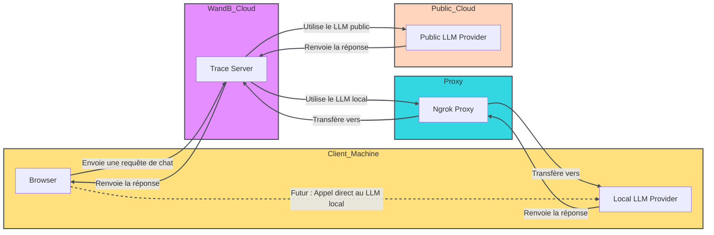

<Tip>
  Pendant une durée limitée, W&amp;B Inference est inclus dans votre offre gratuite. W&amp;B Inference vous donne accès à des modèles de fondation open source de premier plan via l’API et le Playground de Weave.

  * [Documentation développeur](../integrations/inference)
  * [Page produit](https://wandb.ai/site/inference)
</Tip>

Évaluer des prompts et des réponses de LLM peut s’avérer complexe. Le Playground de Weave est conçu pour simplifier le processus d’itération sur les prompts et les réponses des LLM, et ainsi faciliter l’expérimentation avec différents modèles et prompts. Grâce à des fonctionnalités telles que l’édition des prompts, la relance des messages et la comparaison de modèles, Playground vous aide à tester et à améliorer rapidement vos applications LLM. Playground prend actuellement en charge des modèles proposés par des fournisseurs comme OpenAI, Anthropic et Google, ainsi que des [fournisseurs personnalisés](#add-a-custom-provider).

* **Accès rapide :** Ouvrez le « Playground » depuis le menu latéral de Weave pour démarrer une nouvelle session, ou depuis la page Appel pour tester un projet existant.
* **Contrôle des messages :** Modifiez, relancez ou supprimez des messages directement dans le chat.
* **Messagerie flexible :** Ajoutez de nouveaux messages en tant qu’entrées utilisateur ou système, puis envoyez-les au LLM.
* **Paramètres personnalisables :** Configurez votre fournisseur LLM préféré et ajustez les paramètres du modèle.
* **Prise en charge de plusieurs LLM :** Basculez entre les modèles, avec une gestion des clés API au niveau de l’équipe.
* **Comparer les modèles :** Comparez la façon dont différents modèles répondent aux prompts.
* **Fournisseurs personnalisés :** Testez des points de terminaison API compatibles OpenAI pour des modèles personnalisés.
* **Modèles enregistrés :** Créez et configurez un préréglage de modèle réutilisable pour votre flux de travail

Commencez à utiliser le Playground pour optimiser vos interactions avec les LLM et rationaliser votre processus de prompt engineering ainsi que le développement d’applications LLM.

* [Ajouter les identifiants et informations du fournisseur](#add-provider-credentials-and-information)
* [Accéder au Playground](#access-the-playground)
* [Sélectionner un LLM](#select-an-llm)
* [Personnaliser les paramètres du Playground](#customize-playground-settings)
* [Contrôle des messages](#message-controls)
* [Comparer les LLM](#compare-llms)
* [Fournisseurs personnalisés](#custom-providers)
* [Modèles enregistrés](#saved-models) 

<div id="add-provider-credentials-and-information">
  ## Ajouter les identifiants et les informations du fournisseur
</div>

Avant d’utiliser Playground, vous devez ajouter les identifiants du fournisseur. Playground prend actuellement en charge les modèles de nombreux fournisseurs. Pour utiliser l’un des modèles disponibles, ajoutez les informations appropriées aux secrets de votre équipe dans les paramètres de W&amp;B.

* Amazon Bedrock :
  * `AWS_ACCESS_KEY_ID`
  * `AWS_SECRET_ACCESS_KEY`
  * `AWS_REGION_NAME`
* Anthropic : `ANTHROPIC_API_KEY`
* Azure :
  * `AZURE_API_KEY`
  * `AZURE_API_BASE`
  * `AZURE_API_VERSION`
* Deepseek : `DEEPSEEK_API_KEY`
* Google : `GEMINI_API_KEY`
* Groq : `GROQ_API_KEY`
* Mistral : `MISTRAL_API_KEY`
* OpenAI : `OPENAI_API_KEY`
* X.AI : `XAI_API_KEY`

<div id="access-the-playground">
  ## Accéder au Playground
</div>

Il existe deux façons d&#39;accéder au Playground :

1. *Ouvrir une nouvelle page Playground avec un prompt système simple* : dans la barre latérale d&#39;un projet Weave, sélectionnez **Playground**. Playground s&#39;ouvre dans le même onglet.
2. *Ouvrir Playground pour un appel spécifique* :
   1. Dans la barre latérale, sélectionnez l&#39;onglet **Traces**. Une liste de traces s&#39;affiche.
   2. Dans la liste des traces, cliquez sur le nom de l&#39;appel que vous souhaitez consulter. La page de détails de l&#39;appel s&#39;ouvre.
   3. Cliquez sur **Open chat in Playground**. Playground s&#39;ouvre dans un nouvel onglet.

<Frame>
  
</Frame>

<div id="select-an-llm">
  ## Sélectionnez un LLM
</div>

Vous pouvez changer de LLM à l'aide du menu déroulant **Sélectionner un modèle** dans l'en-tête du prompt (en haut du panneau principal du playground). Les modèles disponibles proposés par différents fournisseurs sont listés ci-dessous :

* Amazon Bedrock
* Anthropic
* Azure
* Deepseek
* Google
* Groq
* Mistral
* OpenAI
* X.AI

Les modèles disponibles dépendent des fournisseurs configurés pour votre équipe.

<div id="customize-playground-settings">
  ## Personnaliser les paramètres du Playground
</div>

<div id="adjust-llm-parameters">
  ### Ajuster les paramètres du LLM
</div>

Vous pouvez expérimenter avec différentes valeurs de paramètres pour le modèle sélectionné. Pour ajuster les paramètres dans le Playground, procédez comme suit :

1. Dans l’en-tête du prompt (en haut du panneau principal), cliquez sur le bouton **Paramètres du chat (<Icon icon="sliders" iconType="regular" />)** pour ouvrir le panneau **Paramètres du chat**.
2. Dans le panneau **Paramètres du chat**, ajustez les paramètres selon vos besoins. Vous pouvez également activer ou désactiver le suivi des appels Weave, et [ajouter une fonction](#add-a-function).
3. Les modifications sont appliquées automatiquement. Cliquez de nouveau sur **Paramètres du chat**, ou sur le **x** dans l’angle supérieur droit, pour fermer le panneau. Le texte d’infobulle du bouton **Paramètres du chat** se met à jour pour afficher les paramètres que vous avez modifiés.

Si vous quittez la page, vos paramètres seront perdus. Pour enregistrer vos paramètres, [enregistrez votre modèle](#save-a-model).
Si vous souhaitez ignorer vos modifications et recommencer, actualisez la page.

<Frame>
  
</Frame>

Le Playground vous permet de générer plusieurs sorties pour une même entrée en définissant le nombre d’essais. Le paramètre par défaut est `1`. Pour ajuster le nombre d’essais, ouvrez le panneau **Paramètres du chat** et modifiez le paramètre **Number of trials**.

<div id="add-a-function">
  ### Ajouter une fonction
</div>

Vous pouvez tester la manière dont différents modèles utilisent des fonctions selon les entrées fournies par l’utilisateur. Pour ajouter une fonction à tester dans Playground, dans le panneau **Paramètres du chat**, cliquez sur **+ Ajouter une fonction**. Suivez les instructions à l’écran pour définir la fonction et enregistrer vos modifications.

<div id="message-controls">
  ## Contrôle des messages
</div>

<div id="prompt-definition-area">
  ### Zone de définition du prompt
</div>

La **zone de définition du prompt** vous permet de définir les instructions qui déterminent le comportement du modèle tout au long d&#39;une interaction.

Utilisez cette zone pour fournir un contexte qui s&#39;applique de manière cohérente avant tout échange de messages. Cela inclut la définition du rôle, les consignes de ton et de style, les contraintes de comportement et les exigences de sortie. Les modifications apportées ici affectent toutes les interactions suivantes jusqu&#39;à ce qu&#39;elles soient modifiées.

Elle comprend :

* **Sélecteur de prompt** : sélectionnez un prompt enregistré existant ou créez-en un nouveau.
* **Sélecteur de rôle du message** : spécifiez le rôle du message en cours de définition (rôle **System**, **Assistant** ou **User**).
* **Texte du prompt** : saisissez le texte d&#39;instruction qui définit la façon dont le modèle doit répondre.
* Bouton **Add message** : vous permet d&#39;inclure des messages supplémentaires dans le contexte du prompt avant l&#39;exécution.

Ces messages sont envoyés ensemble au modèle et peuvent servir à :

* Ajouter des instructions supplémentaires au niveau système.
* Fournir des exemples de messages d&#39;assistant pour guider les réponses (par exemple avec du few-shot prompting).
* Prédéfinir des messages utilisateur pour tester des scénarios spécifiques.

<div id="messages-panel">
  ### Panneau des messages
</div>

Le **panneau des messages** affiche la conversation générée pendant l&#39;exécution.

Il comprend :

* Tous les messages prédéfinis inclus dans la configuration du prompt.
* Les messages envoyés depuis le composeur de messages.
* Les réponses renvoyées par le modèle.

Vous pouvez également **Copier**, **Supprimer**, **Modifier** et **Réessayer** des messages dans ce panneau.

<div id="message-composer-input-field">
  ### Zone de rédaction des messages (champ de saisie)
</div>

Utilisez la **zone de rédaction des messages** pour envoyer de nouveaux messages au modèle.

Elle prend en charge la sélection du rôle du message et la soumission de messages à l&#39;exécution. La plupart des interactions sont rédigées sous forme de messages **Utilisateur**. Vous pouvez ajouter des messages **Système** ou **Assistant** lorsque vous testez des modifications d&#39;instructions.

<Frame>
  
</Frame>

<div id="view-message-history">
  ## Afficher l’historique des messages
</div>

Pour afficher l’historique des messages, cliquez sur le bouton **Historique (<Icon icon="clock-rotate-left" iconType="light" />)** dans la barre d’outils du playground, à droite.  Cela ouvre un panneau Historique affichant tous les messages envoyés pour le projet actuel.

La sélection d’un élément de l’historique le charge automatiquement dans un panneau de chat supplémentaire pour faciliter la comparaison. 

<div id="compare-llms">
  ## Comparer des LLM
</div>

Playground vous permet de comparer des LLM. Pour effectuer une comparaison, cliquez sur le bouton **Add Chat (<Icon icon="plus" iconType="solid" />)** dans la barre d’outils de droite du Playground. Une deuxième conversation s’ouvre à côté de la conversation originale.
Dans cette deuxième conversation, vous disposez des mêmes fonctionnalités que dans la conversation originale, comme le choix du modèle, le réglage des paramètres et l’ajout de fonctions.

<div id="custom-providers">
  ## Fournisseurs personnalisés
</div>

<div id="add-a-custom-provider">
  ### Ajouter un fournisseur personnalisé
</div>

En plus des fournisseurs intégrés, vous pouvez utiliser le Playground pour tester des points de terminaison API compatibles avec OpenAI pour des modèles personnalisés. Par exemple :

* D’anciennes versions de fournisseurs de modèles pris en charge
* Des modèles locaux

Pour ajouter un fournisseur personnalisé au Playground, procédez comme suit :

1. Dans l’en-tête du prompt (en haut du panneau principal), cliquez sur le menu déroulant **Sélectionner un modèle**.
2. Sélectionnez **+ Add AI provider**.
3. Sélectionnez **Custom Provider**.
4. Dans la fenêtre modale, saisissez les informations du fournisseur :

* **Provider name** : nom du fournisseur, par exemple `openai` ou `ollama`.
* **API key** : la clé API du fournisseur, par exemple une clé API OpenAI.
* **Base URL** : le point de terminaison de base du fournisseur, par exemple `https://api.openai.com/v1/` ou une URL ngrok comme `https://e452-2600-1700-45f0-3e10-2d3f-796b-d6f2-8ba7.ngrok-free.app`.
* **Headers** : (Facultatif) une ou plusieurs paires clé-valeur d’en-têtes HTTP personnalisés.
* **Models** : un ou plusieurs modèles pour le fournisseur, par exemple `deepseek-r1` ou `qwq`.
* **Max tokens** : (Facultatif) pour chaque modèle, le nombre maximal de jetons que le modèle peut générer dans une réponse.

5. Une fois les informations du fournisseur saisies, cliquez sur **Add provider**.
6. Sélectionnez votre nouveau fournisseur et le ou les modèles disponibles dans le menu déroulant **Sélectionner un modèle**.

<Warning>
  En raison des restrictions CORS, vous ne pouvez pas appeler directement des URL localhost ou 127.0.0.1 depuis le Playground. Si vous exécutez un serveur de modèles local (comme Ollama), utilisez un service de tunneling comme ngrok pour l’exposer de manière sécurisée. Pour en savoir plus, voir [Use ngrok with Ollama](#use-a-local-model-as-a-custom-provider).
</Warning>

Vous pouvez maintenant tester le ou les modèles du fournisseur personnalisé à l’aide des fonctionnalités standard du Playground. Vous pouvez également [modifier](#edit-a-custom-provider) ou [supprimer](#remove-a-custom-provider) le fournisseur personnalisé.

<div id="edit-a-custom-provider">
  ### Modifier un fournisseur personnalisé
</div>

Pour modifier les informations d'un [fournisseur personnalisé créé précédemment](#add-a-custom-provider), procédez comme suit :

1. Dans l'en-tête du prompt, cliquez sur la liste déroulante **Sélectionner un modèle**. Sélectionnez ensuite **+Configure providers**.

* Vous pouvez aussi sélectionner **projet** dans le menu latéral, puis l'onglet **fournisseur d'IA**.

2. Dans le tableau **fournisseurs personnalisés**, trouvez le fournisseur personnalisé que vous souhaitez modifier.
3. Dans la colonne **Last Updated** de l'entrée correspondant à votre fournisseur personnalisé, cliquez sur le bouton de modification (l'icône en forme de crayon).
4. Dans la fenêtre modale, modifiez les informations du fournisseur.
5. Cliquez sur **Save**.

<div id="remove-a-custom-provider">
  ### Supprimer un fournisseur personnalisé
</div>

Pour supprimer un [fournisseur personnalisé créé précédemment](#add-a-custom-provider), procédez comme suit :

1. Dans l'en-tête du prompt, cliquez sur la liste déroulante **Sélectionner un modèle**. Sélectionnez ensuite **+Configurer les fournisseurs**.

* Vous pouvez aussi, dans le menu latéral, sélectionner **Projet**, puis l'onglet **fournisseur d'IA**.

2. Dans le tableau **Fournisseurs personnalisés**, trouvez le fournisseur personnalisé que vous souhaitez supprimer.
3. Dans la colonne **Dernière mise à jour** de l'entrée correspondant à votre fournisseur personnalisé, cliquez sur le bouton de suppression (l'icône de corbeille).
4. Dans la fenêtre modale, confirmez que vous souhaitez supprimer le fournisseur. Cette action est irréversible.
5. Cliquez sur **Supprimer**.

<div id="use-a-local-model-as-a-custom-provider">
  ### Utiliser un modèle local comme fournisseur personnalisé
</div>

Pour tester dans le Playground un modèle exécuté localement, utilisez ngrok et Ollama pour créer une URL publique temporaire qui contourne les restrictions CORS.

Pour le configurer, procédez comme suit :

1. [Installez ngrok](https://ngrok.com/docs/getting-started/#step-1-install) pour votre système d’exploitation.

2. Démarrez votre modèle Ollama :

   ```bash
   ollama run <model>
   ```

3. Dans un terminal séparé, créez un tunnel ngrok avec les en-têtes CORS requis :

   ```bash
   ngrok http 11434 --response-header-add "Access-Control-Allow-Origin: *" --host-header rewrite
   ```

4. Une fois ngrok démarré, une URL publique s’affiche, par exemple `https://xxxx-xxxx.ngrok-free.app`. Utilisez cette URL comme **Base URL** lorsque vous [ajoutez un fournisseur personnalisé](#add-a-custom-provider) dans le Playground.

Le schéma suivant illustre le flux de données entre votre environnement local, le proxy ngrok et les services cloud W&amp;B :




<div id="saved-models">
  ## Modèles enregistrés
</div>

<div id="save-a-model">
  ### Enregistrer un modèle
</div>

Vous pouvez créer et configurer un préréglage de modèle réutilisable pour votre flux de travail. Enregistrer un modèle vous permet de le charger rapidement avec vos réglages, paramètres et hooks de fonction préférés.

1. Dans l’en-tête du prompt (en haut du panneau principal), dans la liste déroulante **Sélectionner un modèle**, sélectionnez un fournisseur et un modèle.
2. Dans l’en-tête du prompt, cliquez sur le bouton **Paramètres du chat (<Icon icon="sliders" iconType="regular" />)** pour ouvrir le panneau **Paramètres du chat**.
3. Dans le panneau **Paramètres du chat** :
   * **Nom du modèle** (requis) : saisissez un nom pour votre modèle enregistré.
   * Ajustez les paramètres selon vos besoins. Vous pouvez aussi activer ou désactiver le suivi des appels Weave et [ajouter une fonction](#add-a-function).
4. Cliquez sur **Publier le modèle**. Le modèle est enregistré et accessible depuis **Modèles enregistrés** dans la liste déroulante **Sélectionner un modèle**. Vous pouvez maintenant [utiliser](#use-a-saved-model) et [mettre à jour](#update-a-saved-model) le modèle enregistré.

<div id="use-a-saved-model">
  ### Utiliser un modèle enregistré
</div>

Basculez rapidement vers un [modèle enregistré](#save-a-model) pour maintenir la cohérence entre les expériences ou les sessions. Vous pouvez ainsi reprendre exactement là où vous en étiez.

1. Dans l’en-tête du prompt, dans le menu déroulant **Sélectionner un modèle**, sélectionnez **Modèles enregistrés**.
2. Dans la liste des modèles enregistrés, sélectionnez le modèle enregistré que vous souhaitez charger. Le modèle se charge et est prêt à être utilisé dans le playground.

<div id="update-a-saved-model">
  ### Mettre à jour un modèle enregistré
</div>

Modifiez un [modèle enregistré](#save-a-model) existant pour affiner ses paramètres ou actualiser sa configuration. Cela garantit que vos modèles enregistrés évoluent avec vos cas d’usage.

1. Dans l’en-tête du prompt, ouvrez le menu déroulant **Sélectionner un modèle**, puis sélectionnez **Modèles enregistrés**.
2. Dans la liste des modèles enregistrés, sélectionnez le modèle enregistré que vous souhaitez mettre à jour.
3. Dans l’en-tête du prompt, cliquez sur le bouton **Paramètres du chat (<Icon icon="sliders" iconType="regular" />)** pour ouvrir le panneau **Paramètres du chat**.
4. Dans le panneau **Paramètres du chat**, ajustez les paramètres selon vos besoins. Vous pouvez également activer ou désactiver le suivi des appels Weave et [ajouter une fonction](#add-a-function).
5. Cliquez sur **Mettre à jour le modèle**. Le modèle est alors mis à jour et devient accessible depuis **Modèles enregistrés** dans le menu déroulant **Sélectionner un modèle**. La version de votre modèle enregistré est automatiquement incrémentée.