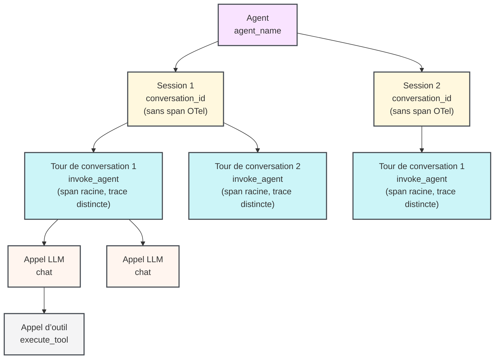

import AgentsPreview from '/snippets/fr/_includes/agents-public-preview.mdx';

<AgentsPreview />

Découvrez comment instrumenter une application agentique à plusieurs tours à l’aide du SDK W&amp;B Weave afin de pouvoir visualiser, déboguer et évaluer le comportement de votre agent. Ce contenu s’adresse aux développeurs qui créent ou intègrent des agents et souhaitent disposer d’une visibilité structurée sur les sessions, les tours de conversation, les appels LLM et les exécutions d’outils.

Le SDK Weave pour Agents modélise le cycle de vie complet d’une conversation agentique à plusieurs tours : l’agent qui gère plusieurs sessions, la session qui regroupe les tours de conversation, chaque échange utilisateur-agent (tour de conversation), les appels LLM au sein d’un tour de conversation et les exécutions d’outils déclenchées par un LLM. Les traces apparaissent dans l’onglet **Agents** de votre projet Weave. Chaque session affiche une chronologie à plusieurs tours de conversation avec des appels d’outil imbriqués, l’utilisation des jetons et le feedback.

Si vous tracez des fonctions individuelles en tant qu’opérations avec le décorateur `@weave.op`, consultez plutôt [Tracer des applications LLM](/fr/weave/guides/tracking/tracing).

<div id="before-you-begin">
  ## Avant de commencer
</div>

Pour commencer, installez le package `weave` et initialisez votre projet. Cela permet à Weave d’identifier votre équipe et votre projet afin que les spans soient acheminés vers le bon emplacement dans l’interface utilisateur.

Installez Weave et initialisez votre projet :

<Tabs>
  <TabItem value="python" label="Python">
    ```bash lines
    pip install weave
    ```

    Remplacez `[YOUR-TEAM]` par le nom de votre équipe W&amp;B et `[YOUR-PROJECT]` par le nom de votre projet W&amp;B.

    ```python lines
    import weave

    weave.init("[YOUR-TEAM]/[YOUR-PROJECT]")
    ```

    Appelez `weave.init()` avant tout appel à `start_session()`, `start_turn()`, `start_llm()` ou `start_tool()`. Toutes les fonctions de traçage d’agent ne font silencieusement rien lorsque le traçage est désactivé ou que l’appel à init est absent. Vous pouvez donc laisser l’instrumentation dans le code de production et la contrôler via la configuration.
  </TabItem>

  <TabItem value="typescript" label="TypeScript">
    ```bash lines
    npm install weave
    ```

    Remplacez `[YOUR-TEAM]` par le nom de votre équipe W&amp;B et `[YOUR-PROJECT]` par le nom de votre projet W&amp;B.

    ```typescript lines
    import * as weave from 'weave';

    await weave.init('[YOUR-TEAM]/[YOUR-PROJECT]');
    ```

    Appelez `weave.init()` avant tout appel à `startSession()`, `startTurn()`, `startLLM()` ou `startTool()`. Toutes les fonctions de traçage d’agent ne font silencieusement rien lorsque le traçage est désactivé ou que l’appel à init est absent. Vous pouvez donc laisser l’instrumentation dans le code de production et la contrôler via la configuration.
  </TabItem>
</Tabs>

<div id="the-agent-data-model">
  ## Le modèle de données des agents
</div>

Weave modélise le comportement des agents sous forme d’une hiérarchie de relations de type un-à-plusieurs. Chaque agent peut avoir plusieurs sessions, chaque session peut avoir plusieurs tours de conversation, chaque tour de conversation peut avoir plusieurs appels LLM, et chaque appel LLM peut déclencher plusieurs appels d’outil.

| Concept              | classe du SDK Weave | type de span OTel                                                               | Description                                                                         |
| -------------------- | ------------------- | ------------------------------------------------------------------------------- | ----------------------------------------------------------------------------------- |
| Agent                | *(aucune classe)*   | *(aucun span ; regroupé par `agent_name`)*                                      | Une application agentique dans l’onglet Agents ; contient une ou plusieurs sessions |
| Session              | `Session`           | *(aucun span ; les tours de conversation sont regroupés par `conversation_id`)* | Une conversation ou une exécution contenant un ou plusieurs tours de conversation   |
| Tour de conversation | `Turn`              | `invoke_agent`                                                                  | Un message utilisateur et la réponse complète de l’agent                            |
| appel LLM            | `LLM`               | `chat`                                                                          | Un appel à une API de modèle de langage                                             |
| appel d’outil        | `Tool`              | `execute_tool`                                                                  | Un appel d’outil déclenché par une réponse LLM                                      |

Le diagramme suivant montre comment un agent englobe plusieurs sessions, une session englobe plusieurs tours de conversation, et ainsi de suite.



Une session regroupe les tours de conversation à l’aide d’un attribut `conversation_id` partagé plutôt que d’un span parent. Ainsi, chaque tour de conversation démarre sa propre trace OTel. Cette conception prend en charge le traçage distribué et l’exécution en parallèle. Le client envoie les spans directement au collecteur OTel, sans agrégation côté serveur.

<Tip>
  **Vous utilisez un SDK d’agent tiers ou un harness ?** Commencez par la page des [intégrations Weave](/fr/weave/guides/integrations) plutôt que par une instrumentation manuelle du SDK. Weave applique automatiquement des patchs aux SDK d’agents pris en charge (comme OpenAI Agents SDK) et aux harnesses d’agents (comme Claude Code) pour fournir une observabilité intégrée des agents.
</Tip>

<div id="agent-tracing-apis">
  ## API de traçage des agents
</div>

Weave expose les fonctions de premier niveau suivantes. Chaque fonction renvoie un objet qui sert de gestionnaire de contexte (avec `with` en Python, ou `try/finally` en TypeScript), ou que vous pouvez fermer manuellement en appelant `.end()`.

<div id="start-a-session">
  ### Démarrer une session
</div>

`start_session()` / `startSession()` définit un attribut `conversation_id` sur tous les spans enfants afin de regrouper les tours de conversation dans l’onglet Agents. Si vous fournissez un `session_id`, il doit rester stable tout au long de la conversation. Réutilisez le même ID pour ajouter de nouveaux tours de conversation à une session existante. Si vous n’indiquez pas de `session_id`, le SDK génère automatiquement un UUID.

La session active est stockée dans le contexte (un `ContextVar` en Python ou `AsyncLocalStorage` en Node.js). Ainsi, tout code exécuté dans le même contexte asynchrone peut la récupérer avec `weave.get_current_session()` / `weave.getCurrentSession()` sans avoir à passer explicitement l’objet session.

<Tabs>
  <TabItem value="python" label="Python">
    ```python lines
    session = weave.start_session(
        agent_name="my-agent",    # Requis : identifie l’agent dans l’interface utilisateur.
        session_id="",            # Facultatif : ID stable pour regrouper les tours de conversation ; généré automatiquement s’il est vide.
        model="",                 # Facultatif : modèle par défaut pour les tours de conversation de cette session.
        session_name="",          # Facultatif : libellé lisible affiché dans l’interface utilisateur.
        include_content=True,     # Facultatif : définissez False pour omettre le contenu des messages des spans.
        continue_parent_trace=False,  # Facultatif : rattache à une trace OTel existante au lieu d’en démarrer une nouvelle.
    )
    ```
  </TabItem>

  <TabItem value="typescript" label="TypeScript">
    ```typescript lines
    const session = weave.startSession({
      agentName: 'my-agent',  // Facultatif : identifie l’agent dans l’interface utilisateur.
      sessionId: '',          // Facultatif : ID stable pour regrouper les tours de conversation, généré automatiquement s’il est vide.
      model: '',              // Facultatif : modèle par défaut pour les tours de conversation de cette session.
    });
    ```
  </TabItem>
</Tabs>

<div id="start-a-turn">
  ### Démarrer un tour de conversation
</div>

`start_turn()` / `startTurn()` crée un nouveau span `invoke_agent` qui devient la racine d&#39;une nouvelle trace OTel. Weave utilise ce span pour représenter un échange complet entre l’utilisateur et l’agent dans la vue chronologique.

Lorsqu’elle est appelée comme fonction autonome, elle détermine la session active à partir du contexte et hérite de son ID de conversation. Si aucune session n’est active, le tour de conversation est créé sans `conversation_id` et ne sera pas regroupé avec d’autres tours de conversation.

<Tabs>
  <TabItem value="python" label="Python">
    ```python lines
    turn = weave.start_turn(
        user_message="What is the weather in Tokyo?",  # Texte saisi par l’utilisateur.
        agent_name="my-agent",   # Facultatif : redéfinit le nom de l’agent défini au niveau de la session.
        model="gpt-4o",          # Facultatif : modèle utilisé pour ce tour de conversation.
    )
    ```
  </TabItem>

  <TabItem value="typescript" label="TypeScript">
    ```typescript lines
    const turn = weave.startTurn({
      agentName: 'my-agent',  // Facultatif : redéfinit le nom de l’agent défini au niveau de la session.
      model: 'gpt-4o',        // Facultatif : modèle utilisé pour ce tour de conversation.
    });
    ```
  </TabItem>
</Tabs>

<div id="start-an-llm-call">
  ### Démarrer un appel LLM
</div>

`start_llm()` / `startLLM()` crée un span `chat` imbriqué sous le tour de conversation en cours. Weave utilise ce span pour afficher l’utilisation des jetons, le nom du modèle, les messages d’entrée et de sortie, ainsi que le raisonnement dans la vue Agents.

<Tabs>
  <TabItem value="python" label="Python">
    ```python lines
    llm = weave.start_llm(
        model="gpt-4o",             # L'ID du modèle.
        provider_name="openai",     # Requis : nom du fournisseur, par exemple "openai", "anthropic".
        system_instructions=["Be concise."],  # Facultatif : chaînes de caractères du prompt système.
    )
    ```
  </TabItem>

  <TabItem value="typescript" label="TypeScript">
    ```typescript lines
    const llm = weave.startLLM({
      model: 'gpt-4o',          // L'ID du modèle.
      providerName: 'openai',   // Facultatif : nom du fournisseur, par exemple "openai", "anthropic".
    });
    ```
  </TabItem>
</Tabs>

Une fois l’appel LLM terminé, attribuez les données de réponse à l’objet `llm` avant qu’il ne se ferme :

<Tabs>
  <TabItem value="python" label="Python">
    ```python lines
    with weave.start_llm(model="gpt-4o", provider_name="openai") as llm:
        response = openai_client.chat.completions.create(...)
        llm.input_messages = [Message(role="user", content="...")]
        llm.output_messages = [Message(role="assistant", content=response.choices[0].message.content)]
        llm.usage = Usage(
            input_tokens=response.usage.prompt_tokens,
            output_tokens=response.usage.completion_tokens,
        )
    ```
  </TabItem>

  <TabItem value="typescript" label="TypeScript">
    ```typescript lines
    const llm = weave.startLLM({ model: 'gpt-4o', providerName: 'openai' });
    try {
      const response = await openaiClient.chat.completions.create({ ... });
      llm.inputMessages = [{ role: 'user', content: '...' }];
      llm.outputMessages = [{ role: 'assistant', content: response.choices[0].message.content ?? '' }];
      llm.usage = {
        inputTokens: response.usage?.prompt_tokens,
        outputTokens: response.usage?.completion_tokens,
      };
    } finally {
      llm.end();
    }
    ```
  </TabItem>
</Tabs>

Passez `provider_name` / `providerName` explicitement. Weave ne le déduit pas de la chaîne du modèle.

<div id="start-a-tool-call">
  ### Démarrer un appel d’outil
</div>

`start_tool()` / `startTool()` crée un span `execute_tool`. Le span devient l’enfant du span OTel actif dans le contexte (généralement le span `chat` de l’appel LLM qui a généré l’appel d’outil).

<Tabs>
  <TabItem value="python" label="Python">
    ```python lines
    tool = weave.start_tool(
        name="get_weather",                  # Nom de l’outil tel que déclaré au LLM.
        arguments='{"city": "Tokyo"}',       # Chaîne JSON des arguments de l’outil.
        tool_call_id="call_abc123",          # Facultatif : identifiant de l’appel d’outil provenant de la réponse du LLM.
    )
    ```
  </TabItem>

  <TabItem value="typescript" label="TypeScript">
    ```typescript lines
    const tool = weave.startTool({
      name: 'get_weather',            // Nom de l’outil tel que déclaré au LLM.
      args: '{"city": "Tokyo"}',      // Facultatif : chaîne JSON des arguments de l’outil.
      toolCallId: 'call_abc123',      // Facultatif : identifiant de l’appel d’outil provenant de la réponse du LLM.
    });
    ```
  </TabItem>
</Tabs>

Attribuez le résultat de l’outil avant de le fermer :

<Tabs>
  <TabItem value="python" label="Python">
    ```python lines
    with weave.start_tool(name="get_weather", arguments='{"city": "Tokyo"}') as tool:
        result = get_weather_api("Tokyo")
        tool.result = result  # Accepte un dictionnaire, une liste ou une chaîne. Encodé automatiquement en JSON.
    ```
  </TabItem>

  <TabItem value="typescript" label="TypeScript">
    ```typescript lines
    const tool = weave.startTool({ name: 'get_weather', args: '{"city": "Tokyo"}' });
    try {
      tool.result = await getWeatherApi('Tokyo');
    } finally {
      tool.end();
    }
    ```
  </TabItem>
</Tabs>

<div id="usage-patterns-for-agent-tracing">
  ## Schémas d’utilisation pour le traçage des agents
</div>

Les sections suivantes décrivent comment combiner ces fonctions en fonction de la structure du code de votre agent.

Les exemples ci-dessous utilisent deux types du SDK Weave :

* `Message` représente une seule entrée dans une conversation : une entrée de l’utilisateur, une réponse de l’assistant, un prompt système ou le résultat d’un outil. Affectez cette valeur à `llm.input_messages` / `llm.inputMessages` pour enregistrer ce que le modèle a reçu et produit.
* `Usage` capture le nombre de jetons dans la réponse du LLM et doit être affecté à `llm.usage`.

Weave utilise les deux pour alimenter la vue Agents avec les entrées, les sorties et l’utilisation des jetons de chaque appel au LLM. Pour connaître tous les types de données pris en charge, voir la référence de l’API.

<div id="context-manager-try-finally-pattern">
  ### Gestionnaire de contexte / schéma try-finally
</div>

L’approche recommandée pour la plupart des agents consiste à utiliser un gestionnaire de contexte en Python ou un schéma try-finally en TypeScript. Le span se ferme et est envoyé à la fin du bloc, même si une exception se produit.

Weave stocke la session active, le tour de conversation et l’appel LLM dans le contexte. Ainsi, toute fonction appelée dans un bloc peut appeler `start_llm()` / `startLLM()` ou `start_tool()` / `startTool()` sans avoir à conserver de référence explicite au parent. Cela fonctionne d’un module à l’autre tant que le code s’exécute dans le même contexte asynchrone. Pour récupérer les objets actifs depuis n’importe quel point de la pile d’appels, utilisez `weave.get_current_session()` / `weave.getCurrentSession()`, `weave.get_current_turn()` / `weave.getCurrentTurn()`, et `weave.get_current_llm()` / `weave.getCurrentLLM()`.

<Tabs>
  <TabItem value="python" label="Python">
    ```python lines highlight="13,14,17,25,29"
    import weave
    from weave.session.session import Message, Usage

    # Fonctions fictives : remplacez-les par vos propres implémentations.
    def call_openai(*args, **kwargs):
        pass  # Remplacez par votre appel au client LLM.

    def get_weather_api(city: str) -> str:
        return "24°C, sunny"  # Remplacez par votre appel à l’API météo.

    weave.init("[YOUR-TEAM]/[YOUR-PROJECT]")

    with weave.start_session(agent_name="weather-bot") as session:
        with session.start_turn(user_message="What is the weather in Tokyo?") as turn:

            # Premier appel LLM : renvoie un appel d’outil.
            with weave.start_llm(model="gpt-4o", provider_name="openai") as llm:
                response = call_openai(...)
                llm.input_messages = [Message(role="user", content="What is the weather?")]
                llm.think("User wants weather data, I should call get_weather.")
                llm.output("Let me check the weather for you.")
                llm.usage = Usage(input_tokens=100, output_tokens=20)

                # Appel d’outil : enfant de l’appel LLM qui l’a demandé.
                with weave.start_tool(name="get_weather", arguments='{"city":"Tokyo"}') as tool:
                    tool.result = get_weather_api("Tokyo")  # Renvoie "24°C, sunny".

            # Deuxième appel LLM : synthétise la réponse finale.
            with weave.start_llm(model="gpt-4o", provider_name="openai") as llm:
                llm.input_messages = [Message(role="user", content="What is the weather?")]
                llm.output("It is 24°C and sunny in Tokyo today.")
                llm.usage = Usage(input_tokens=150, output_tokens=30)
    ```
  </TabItem>

  <TabItem value="typescript" label="TypeScript">
    ```typescript lines highlight="11,13,16,24,35"
    import * as weave from 'weave';
    import type { Message, Usage } from 'weave';

    // Fonction fictive : remplacez-la par votre propre implémentation.
    async function getWeatherApi(city: string): Promise<string> {
      return '24°C, sunny';  // Remplacez par votre appel à l’API météo.
    }

    await weave.init('[YOUR-TEAM]/[YOUR-PROJECT]');

    const session = weave.startSession({ agentName: 'weather-bot' });
    try {
      const turn = session.startTurn({ agentName: 'weather-bot' });
      try {
        // Premier appel LLM : renvoie un appel d’outil.
        const llm = weave.startLLM({ model: 'gpt-4o', providerName: 'openai' });
        try {
          llm.inputMessages = [{ role: 'user', content: 'What is the weather?' }];
          llm.think('User wants weather data, I should call get_weather.');
          llm.output('Let me check the weather for you.');
          llm.usage = { inputTokens: 100, outputTokens: 20 };

          // Appel d’outil : enfant de l’appel LLM qui l’a demandé.
          const tool = weave.startTool({ name: 'get_weather', args: '{"city":"Tokyo"}' });
          try {
            tool.result = await getWeatherApi('Tokyo');  // Renvoie "24°C, sunny".
          } finally {
            tool.end();
          }
        } finally {
          llm.end();
        }

        // Deuxième appel LLM : synthétise la réponse finale.
        const llm2 = weave.startLLM({ model: 'gpt-4o', providerName: 'openai' });
        try {
          llm2.inputMessages = [{ role: 'user', content: 'What is the weather?' }];
          llm2.output('It is 24°C and sunny in Tokyo today.');
          llm2.usage = { inputTokens: 150, outputTokens: 30 };
        } finally {
          llm2.end();
        }
      } finally {
        turn.end();
      }
    } finally {
      session.end();
    }
    ```
  </TabItem>
</Tabs>

<div id="manual-start-and-end-pattern">
  ### Démarrage et arrêt manuels
</div>

Utilisez `.end()` explicitement lorsque vous ne pouvez pas recourir à des blocs `with` ou à `try/finally`. Par exemple, lorsque des spans sont ouverts et fermés dans des appels de fonction distincts, ou lorsque vous gérez le cycle de vie asynchrone en dehors d&#39;une coroutine.

<Tabs>
  <TabItem value="python" label="Python">
    ```python lines highlight="1,2,4,9,15"
    session = weave.start_session(agent_name="weather-bot")
    turn = session.start_turn(user_message="What is the weather?")

    llm = weave.start_llm(model="gpt-4o", provider_name="openai")
    llm.input_messages = [Message(role="user", content="What is the weather?")]
    llm.output("Let me check.")
    llm.usage = Usage(input_tokens=100, output_tokens=20)

    tool = weave.start_tool(name="get_weather", arguments='{"city": "Tokyo"}')
    tool.result = "24°C, sunny"
    tool.end()   # end() est idempotent — vous pouvez l'appeler plusieurs fois sans risque.

    llm.end()

    llm2 = weave.start_llm(model="gpt-4o", provider_name="openai")
    llm2.output("It is 24°C and sunny in Tokyo.")
    llm2.usage = Usage(input_tokens=150, output_tokens=30)
    llm2.end()

    turn.end()
    session.end()
    ```
  </TabItem>

  <TabItem value="typescript" label="TypeScript">
    ```typescript lines highlight="1,2,4,9,15"
    const session = weave.startSession({ agentName: 'weather-bot' });
    const turn = session.startTurn({ agentName: 'weather-bot' });

    const llm = weave.startLLM({ model: 'gpt-4o', providerName: 'openai' });
    llm.inputMessages = [{ role: 'user', content: 'What is the weather?' }];
    llm.output('Let me check.');
    llm.usage = { inputTokens: 100, outputTokens: 20 };

    const tool = weave.startTool({ name: 'get_weather', args: '{"city": "Tokyo"}' });
    tool.result = '24°C, sunny';
    tool.end();  // end() est idempotent : vous pouvez l'appeler plusieurs fois sans risque.

    llm.end();

    const llm2 = weave.startLLM({ model: 'gpt-4o', providerName: 'openai' });
    llm2.output('It is 24°C and sunny in Tokyo.');
    llm2.usage = { inputTokens: 150, outputTokens: 30 };
    llm2.end();

    turn.end();
    session.end();
    ```
  </TabItem>
</Tabs>

<div id="semantic-conventions">
  ## Conventions sémantiques
</div>

Le SDK Weave émet des spans OTel conformes aux [conventions sémantiques GenAI](https://opentelemetry.io/docs/specs/semconv/gen-ai/gen-ai-spans/) et aux [conventions de span d&#39;agent GenAI](https://opentelemetry.io/docs/specs/semconv/gen-ai/gen-ai-agent-spans/). Tout span OTel est pris en charge. Weave stocke tous les attributs et permet de les interroger. Vous pouvez ajouter des attributs arbitraires aux spans à l&#39;aide de l&#39;API standard des spans OTel, en plus des objets de traçage de Weave.

<div id="how-spans-appear-in-the-weave-ui">
  ## Comment les spans s’affichent dans l’interface Weave
</div>

Une fois que vous exécutez du code instrumenté, vos traces apparaissent dans l’onglet **Agents** de votre projet Weave à l’adresse `https://wandb.ai/[YOUR-TEAM]/[YOUR-PROJECT]/weave/agents`.

* La **Sessions list** affiche toutes les sessions avec une mini-carte de l’activité des tours de conversation.
* Un clic sur une session ouvre la **multi-turn session view**, qui affiche chaque tour de conversation, ses appels LLM, ses exécutions d’outils, le nombre de jetons et le feedback associé.
* Chaque span `chat` affiche les messages d’entrée, les messages de sortie, le nom du modèle et l’utilisation.
* Chaque span `execute_tool` affiche le nom de l’outil, les arguments et le résultat.

Pour en savoir plus sur l’affichage des données Agents dans Weave, voir [Voir l’activité des agents](/fr/weave/guides/tracking/view-agent-activity).