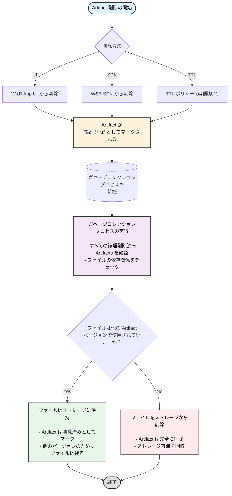

Artifacts の削除は、App UI を使ってインタラクティブに行うことも、W&B SDK を使ってプログラムで行うこともできます。Artifacts を削除すると、W&B はその Artifacts を *soft-delete*（論理削除）としてマークします。言い換えれば、Artifacts は削除対象としてマークされますが、ストレージからファイルがすぐに削除されるわけではありません。

Artifacts の内容は、定期的に実行されるガベージコレクションプロセスが削除対象としてマークされたすべての Artifacts を確認するまで、論理削除（削除保留）状態として残ります。ガベージコレクションプロセスは、その Artifacts とそれに関連するファイルが、以前または以降の Artifacts バージョンで使用されていない場合に、関連するファイルをストレージから削除します。

## Artifact ガベージコレクションのワークフロー

以下の図は、Artifact ガベージコレクションの全プロセスを示しています。



このページの各セクションでは、特定の Artifact バージョンの削除方法、Artifact コレクションの削除方法、エイリアスの有無に応じた Artifacts の削除方法などを説明します。TTL ポリシーを使用すると、W&B から Artifacts が削除されるタイミングをスケジュールできます。詳細については、[Artifact TTL ポリシーによるデータ保持の管理](./ttl) を参照してください。

<Note>
TTL ポリシーによって削除がスケジュールされた、W&B SDK で削除された、または W&B App UI で削除された Artifacts は、まず論理削除（soft-delete）されます。論理削除された Artifacts は、物理削除（hard-delete）される前にガベージコレクションが行われます。
</Note>

<Note>
Entity、Project、または Artifact コレクションを削除すると、このページで説明されている Artifact 削除プロセスもトリガーされます。Run を削除する際に、関連する Artifacts を削除することを選択した場合、それらの Artifacts も同じ論理削除とガベージコレクションのワークフローに従います。
</Note>

### Artifact バージョンの削除

Artifact バージョンを削除するには：

1. Artifact の名前を選択します。これにより Artifact ビューが展開され、その Artifact に関連付けられたすべての Artifact バージョンが表示されます。
2. Artifact のリストから、削除したい Artifact バージョンを選択します。
3. ワークスペースの右側にあるケバブメニュー（三点リーダー）を選択します。
4. **Delete** を選択します。

Artifact バージョンは、[delete()](/models/ref/python/experiments/artifact#delete) メソッドを使用してプログラムで削除することもできます。以下の例を参照してください。

### エイリアスを持つ複数の Artifact バージョンの削除

以下のコード例は、エイリアスが関連付けられている Artifacts を削除する方法を示しています。Artifacts を作成した Entity、Project 名、Run ID を指定してください。

```python
import wandb

run = api.run("entity/project/run_id")

for artifact in run.logged_artifacts():
    artifact.delete()
```

Artifact が 1 つ以上のエイリアスを持っている場合にそれらを削除するには、`delete_aliases` パラメータを boolean 値の `True` に設定します。

```python
import wandb

run = api.run("entity/project/run_id")

for artifact in run.logged_artifacts():
    # 1つ以上のエイリアスを持つArtifactを削除するために、
    # delete_aliases=True を設定します。
    artifact.delete(delete_aliases=True)
```

### 特定のエイリアスを持つ複数の Artifact バージョンの削除

以下のコードは、特定のエイリアスを持つ複数の Artifact バージョンを削除する方法を示しています。Artifacts を作成した Entity、Project 名、Run ID を指定してください。削除ロジックは必要に応じて書き換えてください。

```python
import wandb

runs = api.run("entity/project_name/run_id")

# エイリアス 'v3' と 'v4' を持つ artifact を削除します
for artifact_version in runs.logged_artifacts():
    # 独自の削除ロジックに置き換えてください。
    if artifact_version.name[-2:] == "v3" or artifact_version.name[-2:] == "v4":
        artifact.delete(delete_aliases=True)
```

### 保護されたエイリアスと削除権限

保護されたエイリアス（protected aliases）を持つ Artifacts には、特別な削除制限があります。[保護されたエイリアス](/models/registry/aliases#protected-aliases) は、無許可の削除を防ぐために Registry 管理者が設定できる W&B Registry 内のエイリアスです。

<Note>
**保護されたエイリアスに関する重要な考慮事項：**
- 保護されたエイリアスを持つ Artifacts は、Registry 管理者以外は削除できません。
- Registry 内では、Registry 管理者は保護された Artifact バージョンのリンク解除や、保護されたエイリアスを含むコレクション/Registry の削除を行うことができます。
- ソース Artifact について：ソース Artifact が保護されたエイリアスを持つ Registry にリンクされている場合、いかなるユーザーも削除することはできません。
- Registry 管理者は、ソース Artifact から保護されたエイリアスを削除してから、Artifact 自体を削除することができます。
</Note>

### エイリアスのないすべての Artifact バージョンの削除

以下のコードスニペットは、エイリアスを持たない Artifact のすべてのバージョンを削除する方法を示しています。`wandb.Api` の `project` キーと `entity` キーに、それぞれ Project 名と Entity 名を指定してください。`<>` は対象の Artifact の名前に置き換えてください。

```python
import wandb

# wandb.Api メソッドを使用する際は、
# entity と project 名を指定します。
api = wandb.Api(overrides={"project": "project", "entity": "entity"})

artifact_type, artifact_name = "<>"  # type と name を指定
for v in api.artifact_versions(artifact_type, artifact_name):
    # 'latest' などのエイリアスを持たないバージョンをクリーンアップします。
    # 注意: ここには任意の削除ロジックを記述できます。
    if len(v.aliases) == 0:
        v.delete()
```

### Artifact コレクションの削除

Artifact コレクションを削除するには：

1. 削除したい Artifact コレクションに移動し、その上にホバーします。
2. Artifact コレクション名の横にあるケバブメニューを選択します。
3. **Delete** を選択します。

[delete()](/models/ref/python/experiments/artifact#delete) メソッドを使用して、プログラムで Artifact コレクションを削除することもできます。`wandb.Api` の `project` キーと `entity` キーに、それぞれ Project 名と Entity 名を指定してください。

```python
import wandb

# wandb.Api メソッドを使用する際は、
# entity と project 名を指定します。
api = wandb.Api(overrides={"project": "project", "entity": "entity"})
collection = api.artifact_collection(
    "<artifact_type>", "entity/project/artifact_collection_name"
)
collection.delete()
```

## W&B のホスト方法に基づいたガベージコレクションの有効化

W&B の共有クラウド（Shared cloud）を使用している場合、ガベージコレクションはデフォルトで有効になっています。W&B のホスト方法によっては、ガベージコレクションを有効にするために追加の手順が必要になる場合があります。これには以下が含まれます。

* 環境変数 `GORILLA_ARTIFACT_GC_ENABLED` を true に設定する：`GORILLA_ARTIFACT_GC_ENABLED=true`
* [AWS](https://docs.aws.amazon.com/AmazonS3/latest/userguide/manage-versioning-examples.html)、[Google Cloud](https://cloud.google.com/storage/docs/object-versioning)、または [Minio](https://min.io/docs/minio/linux/administration/object-management/object-versioning.html#enable-bucket-versioning) などのストレージプロバイダーを使用している場合は、バケットのバージョニングを有効にする。Azure を使用している場合は、[論理削除（soft delete）を有効にする](https://learn.microsoft.com/azure/storage/blobs/soft-delete-blob-overview)。
    <Note>
    Azure の論理削除は、他のストレージプロバイダーにおけるバケットのバージョニングに相当します。
    </Note>

以下の表は、デプロイメントタイプに基づいてガベージコレクションを有効にするための要件を示しています。

`X` は、その要件を満たす必要があることを示します。

|                                                | 環境変数    | バージョニングの有効化 | 
| -----------------------------------------------| ------------------------| ----------------- | 
| 共有クラウド (Shared cloud)                     |                         |                   | 
| [Secure Storage Connector](/platform/hosting/data-security/secure-storage-connector) を利用した共有クラウド |                         | X                 | 
| 専用クラウド (Dedicated Cloud)                  |                         |                   | 
| [Secure Storage Connector](/platform/hosting/data-security/secure-storage-connector) を利用した専用クラウド |                         | X                 | 
| セルフマネージド・クラウド (Self-Managed cloud)  | X                       | X                 | 
| セルフマネージド・オンプレミス (Self-Managed on-prem) | X                       | X                 |

<Note>
Secure Storage Connector は現在、Google Cloud Platform と Amazon Web Services でのみ利用可能です。
</Note>