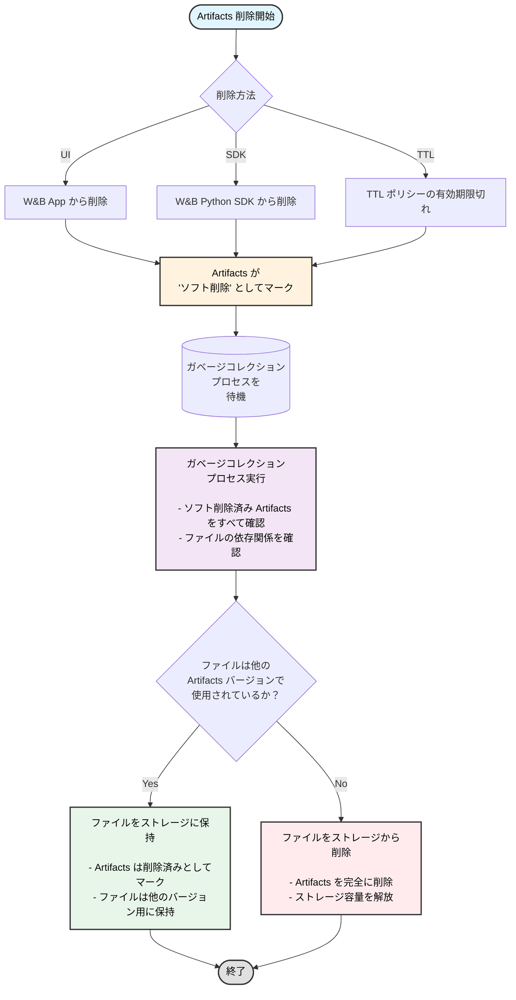

W&amp;B App を使って対話的に、または W&amp;B Python SDK を使ってプログラム的に Artifacts を削除できます。 Artifacts を削除すると、W&amp;B はその Artifacts を *ソフト削除* としてマークします。つまり、 Artifacts は削除対象としてマークされますが、ファイルはすぐにはストレージから削除されません。

Artifacts は、定期的に実行されるガベージコレクション プロセスが削除対象としてマークされたすべての Artifacts を確認するまで、ソフト削除、つまり削除保留状態のままです。ガベージコレクション プロセスは、その Artifacts および関連ファイルが前後の Artifacts のバージョンで使用されていない場合、関連ファイルをストレージから削除します。

<div id="artifact-garbage-collection-workflow">
  ## Artifacts ガベージコレクションのワークフロー
</div>

次の図は、 Artifacts ガベージコレクションの全体的な処理フローを示しています。


```mermaid
graph TB
    Start([Artifacts 削除開始]) --> DeleteMethod{削除方法}
    
    DeleteMethod -->|UI| UIDelete[W&B App から削除]
    DeleteMethod -->|SDK| SDKDelete[W&B Python SDK から削除]
    DeleteMethod -->|TTL| TTLDelete[TTL ポリシーの有効期限切れ]
    
    UIDelete --> SoftDelete[Artifacts が<br/>'ソフト削除' としてマーク]
    SDKDelete --> SoftDelete
    TTLDelete --> SoftDelete
    
    SoftDelete --> GCWait[(ガベージコレクション<br/>プロセスを<br/>待機)]
    
    GCWait --> GCRun[ガベージコレクション<br/>プロセス実行<br/><br/>- ソフト削除済み Artifacts をすべて確認<br/>- ファイルの依存関係を確認]
    
    GCRun --> CheckUsage{ファイルは他の<br/>Artifacts バージョンで<br/>使用されているか？}
    
    CheckUsage -->|Yes| KeepFiles[ファイルをストレージに保持<br/><br/>- Artifacts は削除済みとしてマーク<br/>- ファイルは他のバージョン用に保持]
    CheckUsage -->|No| DeleteFiles[ファイルをストレージから削除<br/><br/>- Artifacts を完全に削除<br/>- ストレージ容量を解放]
    
    KeepFiles --> End([終了])
    DeleteFiles --> End
    
    style Start fill:#e1f5fe,stroke:#333,stroke-width:2px,color:#000
    style SoftDelete fill:#fff3e0,stroke:#333,stroke-width:2px,color:#000
    style GCRun fill:#f3e5f5,stroke:#333,stroke-width:2px,color:#000
    style KeepFiles fill:#e8f5e9,stroke:#333,stroke-width:2px,color:#000
    style DeleteFiles fill:#ffebee,stroke:#333,stroke-width:2px,color:#000
    style End fill:#e0e0e0,stroke:#333,stroke-width:2px,color:#000
```

W&amp;B の Artifacts を削除するタイミングは、TTL ポリシーでスケジュールできます。詳細については、[Artifact TTL ポリシーによるデータ保持の管理](./ttl) を参照してください。

<Note>
  TTL ポリシー、W&amp;B Python SDK、または W&amp;B App によって削除された Artifacts は、最初にソフトデリートされます。ソフトデリートされた Artifacts は、その後ガーベジコレクションの対象となり、最終的に完全に削除されます。
</Note>

<Note>
  Entity、プロジェクト、または Artifacts コレクションを削除すると、このページで説明している Artifacts 削除プロセスが開始されます。run を削除するときに関連付けられた Artifacts も削除することを選択した場合、それらの Artifacts も同じソフトデリートとガーベジコレクションのワークフローに従います。
</Note>

<div id="delete-an-artifact-version">
  ## Artifacts のバージョンを削除する
</div>

Artifacts のバージョンは、W&amp;B App を使って対話的に、または W&amp;B Python SDK を使ってプログラムで削除できます。

<Tabs>
  <Tab title="W&B App" value="ui">
    Artifacts のバージョンを削除するには、次の手順を実行します。

    1. 削除したい Artifacts のバージョンを含むプロジェクトに移動します。
    2. **Artifacts** タブを選択します。
    3. Artifacts の種類一覧から、削除したいバージョンを含む Artifacts の種類を選択します。
    4. 削除したい Artifacts のバージョンの横にある三点リーダー アイコン（`...`）をクリックします。
    5. ドロップダウン メニューから **Delete Version** を選択します。
  </Tab>

  <Tab title="W&B Python SDK" value="sdk">
    [wandb.Artifact.delete()](/ja/models/ref/python/experiments/artifact#delete) メソッドを使って、 Artifacts のバージョンをプログラムで削除できます。 Artifacts のフルネームを指定します。フルネームは `<entity>/<project>/<artifact_name>:<version>` という形式です。`delete_aliases` パラメーターを `True` に設定すると、1 つ以上のエイリアスが関連付けられている Artifacts でも削除できます。

    ```python
    import wandb

    api = wandb.Api()

    # パスから Artifacts を取得
    artifact = api.artifact("<entity>/<project>/<artifact_name>:<version>")

    # エイリアスも含めて Artifacts のバージョンを削除
    artifact.delete(delete_aliases=True)
    ```
  </Tab>
</Tabs>

<div id="delete-multiple-artifact-versions">
  ## 複数の Artifacts バージョンを削除する
</div>

次のコード例は、複数の Artifacts バージョンを削除する方法を示します。`wandb.Api.run()` に、 Artifacts を作成した entity、プロジェクト名、run ID を引数として指定します。これにより、その run が作成したすべての Artifacts バージョンにアクセスできる run オブジェクトが返されます。次に、 Artifacts バージョンを順に処理し、条件に一致するものを削除します。

<Tip>
  `delete_aliases` パラメーターを `True`（`wandb.Artifact.delete(delete_aliases=True)`）に設定すると、 Artifacts バージョンと、それに関連付けられたすべてのエイリアスを削除できます。
</Tip>

`<entity>`、`<project>`、`<run_id>`、`<artifact_name>` のプレースホルダーを、ご自身の値に置き換えてください：

```python
import wandb

# W&B API を初期化する
api = wandb.Api()

# パスで run を取得する。<entity>/<project>/<run_id> で構成される
run = api.run("<entity>/<project>/<run_id>")

# バージョンを削除する Artifacts 名を指定する
artifact_name = "<artifact_name>"

# 指定した名前の Artifacts バージョンを検索して削除する
for artifact in run.logged_artifacts():
    print(f"Found artifact: {artifact.name}") # 例: run_4dfbufgq_model:v0
    # split() を使ってバージョンを除いた Artifacts 名のみを取得する
    if artifact.name.split(":")[0] == artifact_name:
        print(f"Artifacts バージョンを削除中: {artifact.name}")
        artifact.delete(delete_aliases=True)
```

<div id="delete-multiple-artifact-versions-with-a-specific-alias">
  ## 特定のエイリアスを持つ複数の Artifacts バージョンを削除する
</div>

次のコードは、特定のエイリアスを持つ複数の Artifacts バージョンを削除する方法を示します。

`<entity>`、`<project>`、`<run_id>`、`<artifact_name>`、`<alias>` のプレースホルダーをそれぞれ適切な値に置き換えてください：

```python
import wandb

# W&B API を初期化する
api = wandb.Api()

# パスで run を取得する。<entity>/<project>/<run_id> で構成される
run = api.run("<entity>/<project>/<run_id>")

# バージョンを削除する Artifacts 名を指定する
artifact_name = "<artifact_name>"

# 削除する Artifacts バージョンをフィルタリングするエイリアスを指定する
desired_alias = "<alias>"

# エイリアス 'v3' および 'v4' を持つ run に記録された Artifacts を削除する
for artifact in run.logged_artifacts():
    print(f"Found artifact: {artifact.name}")
    if (artifact.name.split(":")[0] == artifact_name) and (desired_alias in artifact.aliases):
            artifact.delete(delete_aliases=True)
```

<div id="delete-an-artifact-collection">
  ## Artifacts コレクションを削除する
</div>

<Tabs>
  <Tab title="W&B App" value="ui">
    Artifacts コレクションを削除するには、次の手順を実行します。

    1. 削除する Artifacts コレクションに移動します。
    2. Artifacts コレクション名の横にある三点アイコン (`...`) を選択します。
    3. ドロップダウン メニューから **Delete** を選択します。
  </Tab>

  <Tab title="W&B Python SDK" value="sdk">
    [wandb.Artifact.delete()](/ja/models/ref/python/experiments/artifact#delete) メソッドを使って、 Artifacts コレクションをプログラムから削除します。

    `wandb.Api.artifact_collection(name="")` に、 Artifacts コレクションのフルパスを指定します。フルパスは `<entity>/<project>/<artifact_collection_name>` という形式です。

    ```python
    import wandb

    # W&B API を初期化
    api = wandb.Api()

    # パスで Artifacts コレクションを取得する。
    # 形式は <entity>/<project>/<artifact_collection_name>
    collection = api.artifact_collection(
        type_name = "<artifact_type>",
        name = "<entity>/<project>/<artifact_collection_name>"
    )
    collection.delete()
    ```
  </Tab>
</Tabs>

<div id="protected-aliases-and-deletion-permissions">
  ## 保護されたエイリアスと削除権限
</div>

保護されたエイリアスを持つ Artifacts には、特別な削除制限が適用されます。[Protected aliases](/ja/models/registry/aliases#protected-aliases) とは、W&amp;B Registry 内でレジストリ管理者が、不正な削除を防ぐために設定できるエイリアスのことです。

<Note>
  **保護されたエイリアスに関する重要な注意事項:**

  * 保護されたエイリアスを持つ Artifacts は、レジストリ管理者以外のユーザーは削除できません。
  * レジストリ内では、レジストリ管理者は保護された Artifacts バージョンのリンクを解除し、保護されたエイリアスを含むコレクションやレジストリを削除できます。
  * ソース Artifacts について: ソース Artifacts が保護されたエイリアスを持つレジストリにリンクされている場合、どのユーザーも削除できません。
  * レジストリ管理者はソース Artifacts から保護されたエイリアスを削除したうえで、ソース Artifacts 自体を削除できます。
</Note>

<div id="enable-garbage-collection-based-on-how-wb-is-hosted">
  ## W&amp;B のホスティング形態に基づいてガベージコレクションを有効にする
</div>

W&amp;B の共有クラウドを使用している場合、ガベージコレクションはデフォルトで有効になっています。W&amp;B のホスティング形態によっては、ガベージコレクションを有効にするために追加の手順が必要になる場合があります。これには次の手順が含まれます:

* `GORILLA_ARTIFACT_GC_ENABLED` 環境変数を true に設定する: `GORILLA_ARTIFACT_GC_ENABLED=true`
* [AWS](https://docs.aws.amazon.com/AmazonS3/latest/userguide/manage-versioning-examples.html)、[Google Cloud](https://cloud.google.com/storage/docs/object-versioning)、その他 [Minio](https://min.io/docs/minio/linux/administration/object-management/object-versioning.html#enable-bucket-versioning) などのストレージプロバイダを使用している場合は、バケットのバージョニングを有効にします。Azure を使用している場合は、[ソフト削除を有効にします](https://learn.microsoft.com/azure/storage/blobs/soft-delete-blob-overview)。
  <Note>
    Azure のソフト削除は、他のストレージプロバイダにおけるバケットのバージョニングと同等です。
  </Note>

次の表は、デプロイメントタイプに応じてガベージコレクションを有効にするための要件をどのように満たすかを示します。

`X` はその要件を満たす必要があることを示します:

|                                                | Environment variable（環境変数） | Enable versioning（バージョニングを有効化） |
| -----------------------------------------------| ------------------------------- | ------------------------------------------- |
| Shared cloud                                   |                                 |                                             |
| Shared cloud with [secure storage connector](/ja/platform/hosting/data-security/secure-storage-connector)|                                 | X                                           |
| Dedicated Cloud                                |                                 |                                             |
| Dedicated Cloud with [secure storage connector](/ja/platform/hosting/data-security/secure-storage-connector)|                                 | X                                           |
| Self-Managed cloud                             | X                               | X                                           |
| Self-Managed on-prem                           | X                               | X                                           |

<Note>
  注意
  Secure storage connector は現在、Google Cloud Platform と Amazon Web Services でのみ利用可能です。
</Note>