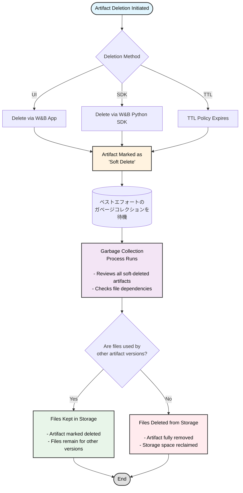

W&amp;B App を使ってインタラクティブに、または W&amp;B Python SDK を使ってプログラムから アーティファクト を削除できます。アーティファクト を削除すると、W&amp;B はその アーティファクト を *ソフト削除* としてマークします。つまり、アーティファクト は削除対象としてマークされますが、ファイルが storage からすぐに削除されるわけではありません。

アーティファクト の内容は、定期的に実行されるガベージコレクションプロセスが、削除対象としてマークされたすべての アーティファクト を確認するまで、ソフト削除、つまり削除保留の状態で保持されます。ガベージコレクションプロセスは、その アーティファクト と関連ファイルが以前または後続の アーティファクトバージョン で使用されていない場合、関連ファイルを storage から削除します.

<Note>
  ガベージコレクションは **ベストエフォート** です。アーティファクト を削除したあと、解放された容量がオブジェクトストレージにどのくらい早く反映されるかについて、W&amp;B は保証しません。大規模な deployment やバックログがある場合は、想定より時間がかかることがあります。これが run データ、保持設定、およびオペレーターによる任意の操作とどのように関係するかについては、[バケット storage とコストを管理する](/ja/platform/hosting/managing-bucket-storage) を参照してください。
</Note>

<div id="artifact-garbage-collection-workflow">
  ## アーティファクトのガベージコレクションのワークフロー
</div>

次の図は、アーティファクトのガベージコレクションのプロセス全体を示しています。


```mermaid
graph TB
    Start([Artifact Deletion Initiated]) --> DeleteMethod{Deletion Method}
    
    DeleteMethod -->|UI| UIDelete[Delete via W&B App]
    DeleteMethod -->|SDK| SDKDelete[Delete via W&B Python SDK]
    DeleteMethod -->|TTL| TTLDelete[TTL Policy Expires]
    
    UIDelete --> SoftDelete[Artifact Marked as<br/>'Soft Delete']
    SDKDelete --> SoftDelete
    TTLDelete --> SoftDelete
    
    SoftDelete --> GCWait[(ベストエフォートの<br/>ガベージコレクションを<br/>待機)]
    
    GCWait --> GCRun[Garbage Collection<br/>Process Runs<br/><br/>- Reviews all soft-deleted artifacts<br/>- Checks file dependencies]
    
    GCRun --> CheckUsage{Are files used by<br/>other artifact versions?}
    
    CheckUsage -->|Yes| KeepFiles[Files Kept in Storage<br/><br/>- Artifact marked deleted<br/>- Files remain for other versions]
    CheckUsage -->|No| DeleteFiles[Files Deleted from Storage<br/><br/>- Artifact fully removed<br/>- Storage space reclaimed]
    
    KeepFiles --> End([End])
    DeleteFiles --> End
    
    style Start fill:#e1f5fe,stroke:#333,stroke-width:2px,color:#000
    style SoftDelete fill:#fff3e0,stroke:#333,stroke-width:2px,color:#000
    style GCRun fill:#f3e5f5,stroke:#333,stroke-width:2px,color:#000
    style KeepFiles fill:#e8f5e9,stroke:#333,stroke-width:2px,color:#000
    style DeleteFiles fill:#ffebee,stroke:#333,stroke-width:2px,color:#000
    style End fill:#e0e0e0,stroke:#333,stroke-width:2px,color:#000
```

TTL ポリシーを使用すると、W&amp;B でアーティファクトが削除されるタイミングを設定できます。詳細は、[Artifact TTL ポリシーでデータ保持を管理する](./ttl)を参照してください。

<Note>
  TTL ポリシー、W&amp;B Python SDK、または W&amp;B App によって削除されたアーティファクトは、まずソフト削除されます。その後、ソフト削除されたアーティファクトは、完全に削除される前にガベージコレクションされます。
</Note>

<Note>
  entity、プロジェクト、またはアーティファクトコレクションを削除すると、このページで説明しているアーティファクト削除プロセスが開始されます。run を削除する際に関連するアーティファクトも削除するよう選択した場合、それらのアーティファクトも同じソフト削除とガベージコレクションのワークフローに従います。
</Note>

<div id="delete-an-artifact-version">
  ## アーティファクト のバージョンを削除する
</div>

W&amp;B App を使用してインタラクティブに アーティファクト のバージョンを削除することも、W&amp;B Python SDK を使用してプログラムで削除することもできます。

<Tabs>
  <Tab title="W&B App" value="ui">
    アーティファクト のバージョンを削除するには、次の手順に従います。

    1. 削除する アーティファクト のバージョンが含まれているプロジェクトにアクセスします。
    2. **Artifacts** タブを選択します。
    3. アーティファクト タイプの一覧から、削除するバージョンが含まれている アーティファクト のタイプを選択します。
    4. 削除する アーティファクト のバージョンの横にある三つの点 (`...`) をクリックします。
    5. ドロップダウンから **Delete Version** を選択します。
  </Tab>

  <Tab title="W&B Python SDK" value="sdk">
    [wandb.Artifact.delete()](/ja/models/ref/python/experiments/artifact#delete) method を使用して、アーティファクト のバージョンをプログラムで削除します。アーティファクト の完全名を指定してください。完全名は `<entity>/<project>/<artifact_name>:<version>` で構成されます。アーティファクト に関連付けられたエイリアスが 1 つ以上ある場合でも削除するには、`delete_aliases` パラメーターを `True` に設定します。

    ```python
    import wandb

    api = wandb.Api()

    # パスで artifact を取得する
    artifact = api.artifact("<entity>/<project>/<artifact_name>:<version>")

    # エイリアスも含めて artifact のバージョンを削除する
    artifact.delete(delete_aliases=True)
    ```
  </Tab>
</Tabs>

<div id="delete-multiple-artifact-versions">
  ## 複数のアーティファクトバージョンを削除する
</div>

次のコード例は、複数のアーティファクトバージョンを削除する方法を示しています。アーティファクトを作成した entity、プロジェクト名、run ID を `wandb.Api.run()` の引数として指定します。これにより run オブジェクトが返され、その run で作成されたすべてのアーティファクトバージョンにアクセスできます。次に、アーティファクトバージョンを順に処理し、条件に一致するものを削除します。

<Tip>
  アーティファクトバージョンと、それに関連付けられた エイリアス を削除するには、`delete_aliases` パラメーターを `True` (`wandb.Artifact.delete(delete_aliases=True)`) に設定します。
</Tip>

`<entity>`、`<project>`、`<run_id>`、`<artifact_name>` のプレースホルダーを実際の値に置き換えてください。

```python
import wandb

# W&B APIを初期化する
api = wandb.Api()

# パスでrunを取得する。<entity>/<project>/<run_id>で構成される
run = api.run("<entity>/<project>/<run_id>")

# 削除するバージョンのartifact名を指定する
artifact_name = "<artifact_name>"

# 指定した名前のartifactバージョンを検索して削除する
for artifact in run.logged_artifacts():
    print(f"Found artifact: {artifact.name}") # 名前の例: run_4dfbufgq_model:v0
    # split()でバージョンを除いたartifact名のみを取得する
    if artifact.name.split(":")[0] == artifact_name:
        print(f"artifactバージョンを削除中: {artifact.name}")
        artifact.delete(delete_aliases=True)
```

<div id="delete-multiple-artifact-versions-with-a-specific-alias">
  ## 特定の エイリアス を持つ複数の アーティファクトバージョン を削除する
</div>

次のコードは、特定の エイリアス を持つ複数の アーティファクトバージョン を削除する方法を示しています。

`<entity>`、`<project>`、`<run_id>`、`<artifact_name>`、`<alias>` のプレースホルダーを実際の値に置き換えてください。

```python
import wandb

# W&B APIを初期化する
api = wandb.Api()

# パスでrunを取得する。<entity>/<project>/<run_id>で構成される
run = api.run("<entity>/<project>/<run_id>")

# バージョンを削除するartifactの名前を指定する
artifact_name = "<artifact_name>"

# 削除するartifactバージョンをフィルタリングするaliasを指定する
desired_alias = "<alias>"

# alias 'v3' および 'v4' でrunにログされたartifactを削除する
for artifact in run.logged_artifacts():
    print(f"Found artifact: {artifact.name}")
    if (artifact.name.split(":")[0] == artifact_name) and (desired_alias in artifact.aliases):
            artifact.delete(delete_aliases=True)
```

<div id="delete-an-artifact-collection">
  ## アーティファクトコレクション を削除する
</div>

<Tabs>
  <Tab title="W&B App" value="ui">
    アーティファクトコレクション を削除するには、次の手順に従います。

    1. 削除する アーティファクトコレクション にアクセスします。
    2. アーティファクトコレクション 名の横にある三つの点 (`...`) を選択します。
    3. ドロップダウンメニューから **Delete** を選択します。
  </Tab>

  <Tab title="W&B Python SDK" value="sdk">
    [wandb.Artifact.delete()](/ja/models/ref/python/experiments/artifact#delete) method を使用して、アーティファクトコレクション をプログラムから削除します。

    アーティファクトコレクション の完全なパスを `wandb.Api.artifact_collection(name="")` に指定します。完全パスは `<entity>/<project>/<artifact_collection_name>` で構成されます。

    ```python
    import wandb

    # W&B API を初期化します
    api = wandb.Api()

    # パスで artifact collection を取得します。形式は
    # <entity>/<project>/<artifact_collection_name>
    collection = api.artifact_collection(
        type_name = "<artifact_type>",
        name = "<entity>/<project>/<artifact_collection_name>"
    )
    collection.delete()
    ```
  </Tab>
</Tabs>

<div id="protected-aliases-and-deletion-permissions">
  ## 保護されたエイリアスと削除権限
</div>

保護されたエイリアスを持つArtifactsには、特別な削除制限があります。[保護されたエイリアス](/ja/models/registry/aliases#protected-aliases)は、W&amp;B Registry で Registry 管理者が設定できるエイリアスで、許可されていない削除を防ぐために使用されます。

<Note>
  **保護されたエイリアスに関する重要な注意事項:**

  * 保護されたエイリアスを持つArtifactsは、Registry 管理者以外は削除できません。
  * レジストリ内では、Registry 管理者は保護されたアーティファクトバージョンのリンクを解除したり、保護されたエイリアスを含むcollectionやregistryを削除したりできます。
  * ソース アーティファクト について: ソース アーティファクト が保護されたエイリアスを持つレジストリにリンクされている場合、どのユーザーも削除できません。
  * Registry 管理者は、ソース アーティファクト から保護されたエイリアスを削除してから、その アーティファクト を削除できます。
</Note>

<div id="enable-garbage-collection-based-on-how-wb-is-hosted">
  ## W&amp;B のホスティング形態に応じてガベージコレクションを有効にする
</div>

<Note>ガベージコレクションの実行タイミングは保証されません。詳細については、[バケットストレージとコストを管理する](/ja/platform/hosting/managing-bucket-storage) を参照してください。</Note>

W&amp;B Multi-tenant Cloud を使用している場合、ガベージコレクションはデフォルトで有効です。W&amp;B Dedicated および Self-Managed では、ガベージコレクションを有効にするために、次の追加手順が必要になる場合があります。

1. **W&amp;B Self-Managed**: `GORILLA_ARTIFACT_GC_ENABLED=true` を設定します。
2. **Dedicated Cloud**: ガベージコレクションが有効になっていることを確認するため、サポートにお問い合わせください。
3. [AWS](https://docs.aws.amazon.com/AmazonS3/latest/userguide/manage-versioning-examples.html)、[Google Cloud](https://cloud.google.com/storage/docs/object-versioning)、または [Minio](https://min.io/docs/minio/linux/administration/object-management/object-versioning.html#enable-bucket-versioning) などのその他のストレージプロバイダを使用している場合は、バケットのバージョン管理を有効にします。Azure を使用している場合は、バケットのバージョン管理に相当する [ソフト削除を有効にします](https://learn.microsoft.com/azure/storage/blobs/soft-delete-blob-overview)。

次の表は、デプロイタイプごとにガベージコレクションを有効にするための要件を示しています。

`X` は、その要件を満たす必要があることを示します。

|                                                                                                  | 環境変数 | バージョン管理を有効にする |
| ------------------------------------------------------------------------------------------------ | ---- | ------------- |
| Multi-tenant Cloud                                                                               |      |               |
| Multi-tenant Cloud with [BYOB storage](/ja/platform/hosting/data-security/secure-storage-connector) |      | X             |
| Dedicated Cloud                                                                                  |      |               |
| Dedicated Cloud with [BYOB storage](/ja/platform/hosting/data-security/secure-storage-connector)    |      | X             |
| セルフマネージド                                                                                         | X    | X             |

<Note>
  note
  セキュアストレージコネクタは現在、Google Cloud Platform と Amazon Web Services でのみ使用できます。
</Note>