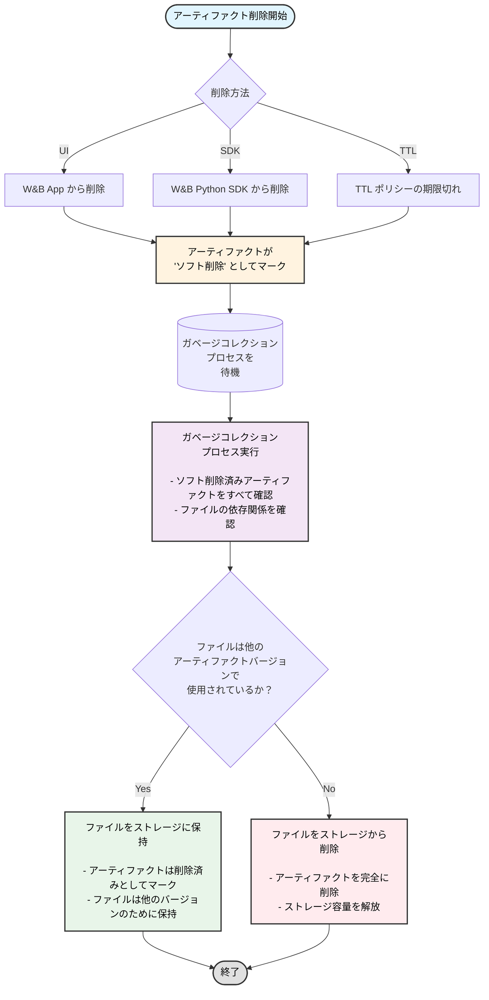

W&amp;B App を使って対話的に、または W&amp;B Python SDK を使ってプログラム的にアーティファクトを削除できます。アーティファクトを削除すると、W&amp;B はそのアーティファクトを *ソフトデリート* としてマークします。つまり、アーティファクトは削除対象としてマークされますが、ファイルはストレージから即座には削除されません。

アーティファクトの内容は、ソフトデリート、つまり削除保留状態のまま、定期的に実行されるガーベジコレクションプロセスが削除対象としてマークされたすべてのアーティファクトを確認するまで保持されます。ガーベジコレクションプロセスは、そのアーティファクトと関連ファイルが、それ以前または以後のいずれのアーティファクトバージョンでも使用されていない場合に、関連ファイルをストレージから削除します。

<div id="artifact-garbage-collection-workflow">
  ## アーティファクトのガーベジコレクションワークフロー
</div>

次の図は、アーティファクトのガーベジコレクションの全体的な流れを示しています。


```mermaid
graph TB
    Start([アーティファクト削除開始]) --> DeleteMethod{削除方法}
    
    DeleteMethod -->|UI| UIDelete[W&B App から削除]
    DeleteMethod -->|SDK| SDKDelete[W&B Python SDK から削除]
    DeleteMethod -->|TTL| TTLDelete[TTL ポリシーの期限切れ]
    
    UIDelete --> SoftDelete[アーティファクトが<br/>'ソフト削除' としてマーク]
    SDKDelete --> SoftDelete
    TTLDelete --> SoftDelete
    
    SoftDelete --> GCWait[(ガベージコレクション<br/>プロセスを<br/>待機)]
    
    GCWait --> GCRun[ガベージコレクション<br/>プロセス実行<br/><br/>- ソフト削除済みアーティファクトをすべて確認<br/>- ファイルの依存関係を確認]
    
    GCRun --> CheckUsage{ファイルは他の<br/>アーティファクトバージョンで<br/>使用されているか？}
    
    CheckUsage -->|Yes| KeepFiles[ファイルをストレージに保持<br/><br/>- アーティファクトは削除済みとしてマーク<br/>- ファイルは他のバージョンのために保持]
    CheckUsage -->|No| DeleteFiles[ファイルをストレージから削除<br/><br/>- アーティファクトを完全に削除<br/>- ストレージ容量を解放]
    
    KeepFiles --> End([終了])
    DeleteFiles --> End
    
    style Start fill:#e1f5fe,stroke:#333,stroke-width:2px,color:#000
    style SoftDelete fill:#fff3e0,stroke:#333,stroke-width:2px,color:#000
    style GCRun fill:#f3e5f5,stroke:#333,stroke-width:2px,color:#000
    style KeepFiles fill:#e8f5e9,stroke:#333,stroke-width:2px,color:#000
    style DeleteFiles fill:#ffebee,stroke:#333,stroke-width:2px,color:#000
    style End fill:#e0e0e0,stroke:#333,stroke-width:2px,color:#000
```

W&amp;B からアーティファクトをいつ削除するかは、TTL ポリシーでスケジュールできます。詳しくは、[Artifact TTL policy を使用したデータ保持の管理](./ttl) を参照してください。

<Note>
  TTL ポリシー、W&amp;B Python SDK、または W&amp;B App によって削除された Artifacts は、まずソフトデリートされます。ソフトデリートされたアーティファクトは、その後ガベージコレクションされ、最終的に完全に削除されます。
</Note>

<Note>
  entity、プロジェクト、またはアーティファクトコレクションを削除すると、このページで説明しているアーティファクト削除プロセスがトリガーされます。run を削除する際に、その run に関連付けられたアーティファクトも削除することを選択した場合、それらのアーティファクトも同じソフトデリートとガベージコレクションのワークフローに従います。
</Note>

<div id="delete-an-artifact-version">
  ## アーティファクトバージョンを削除する
</div>

W&amp;B App を使って対話的に、または W&amp;B Python SDK を使ってプログラムで、アーティファクトバージョンを削除できます。

<Tabs>
  <Tab title="W&B App" value="ui">
    アーティファクトバージョンを削除するには：

    1. 削除したいアーティファクトバージョンを含むプロジェクトに移動します。
    2. **Artifacts** タブを選択します。
    3. アーティファクトタイプの一覧から、削除したいバージョンを含むアーティファクトのタイプを選択します。
    4. 削除したいアーティファクトバージョンの横にある三点リーダー（`...`）アイコンをクリックします。
    5. ドロップダウンから **Delete Version** を選択します。
  </Tab>

  <Tab title="W&B Python SDK" value="sdk">
    [wandb.Artifact.delete()](/ja/models/ref/python/experiments/artifact#delete) メソッドを使って、アーティファクトバージョンをプログラムで削除します。アーティファクトのフルネームを指定します。フルネームは `<entity>/<project>/<artifact_name>:<version>` で構成されます。`delete_aliases` パラメータを `True` に設定すると、1 つ以上のエイリアスが関連付けられている場合でもアーティファクトを削除できます。

    ```python
    import wandb

    api = wandb.Api()

    # パスからアーティファクトを取得
    artifact = api.artifact("<entity>/<project>/<artifact_name>:<version>")

    # エイリアスも含めてアーティファクトバージョンを削除
    artifact.delete(delete_aliases=True)
    ```
  </Tab>
</Tabs>

<div id="delete-multiple-artifact-versions">
  ## 複数のアーティファクトバージョンを削除する
</div>

次のコード例は、複数のアーティファクトバージョンを削除する方法を示しています。`wandb.Api.run()` に、アーティファクトを作成した entity、プロジェクト名、run ID を引数として指定します。これにより、その run で作成されたすべてのアーティファクトバージョンにアクセスできる run オブジェクトが返されます。次に、アーティファクトバージョンを順に処理し、条件に一致するものを削除します。

<Tip>
  アーティファクトバージョンと、それに関連付けられているすべてのエイリアスを削除するには、`delete_aliases` パラメータを `True`（`wandb.Artifact.delete(delete_aliases=True)`）に設定します。
</Tip>

`<entity>`、`<project>`、`<run_id>`、`<artifact_name>` の各プレースホルダーを、ご自身の値に置き換えてください。

```python
import wandb

# W&B APIを初期化する
api = wandb.Api()

# パスでrunを取得する。<entity>/<project>/<run_id>で構成される
run = api.run("<entity>/<project>/<run_id>")

# バージョンを削除するアーティファクト名を指定する
artifact_name = "<artifact_name>"

# 指定した名前のアーティファクトバージョンを検索して削除する
for artifact in run.logged_artifacts():
    print(f"Found artifact: {artifact.name}") # 例: run_4dfbufgq_model:v0
    # split()でバージョンを除いたアーティファクト名のみを取得する
    if artifact.name.split(":")[0] == artifact_name:
        print(f"アーティファクトバージョンを削除中: {artifact.name}")
        artifact.delete(delete_aliases=True)
```

<div id="delete-multiple-artifact-versions-with-a-specific-alias">
  ## 特定のエイリアスが付与された複数のアーティファクトバージョンを削除する
</div>

次のコードは、特定のエイリアスが付与された複数のアーティファクトバージョンを削除する方法を示します。

`<entity>`、`<project>`、`<run_id>`、`<artifact_name>`、`<alias>` の各プレースホルダーをご自身の値に置き換えてください：

```python
import wandb

# W&B APIを初期化する
api = wandb.Api()

# パスでrunを取得する。<entity>/<project>/<run_id>で構成される
run = api.run("<entity>/<project>/<run_id>")

# バージョンを削除するアーティファクト名を指定する
artifact_name = "<artifact_name>"

# 削除するアーティファクトバージョンをフィルタリングするエイリアスを指定する
desired_alias = "<alias>"

# エイリアス 'v3' および 'v4' を持つrunに記録されたアーティファクトを削除する
for artifact in run.logged_artifacts():
    print(f"Found artifact: {artifact.name}")
    if (artifact.name.split(":")[0] == artifact_name) and (desired_alias in artifact.aliases):
            artifact.delete(delete_aliases=True)
```

<div id="delete-an-artifact-collection">
  ## アーティファクトコレクションを削除する
</div>

<Tabs>
  <Tab title="W&B App" value="ui">
    アーティファクトコレクションを削除するには、次の手順を実行します。

    1. 削除したいアーティファクトコレクションに移動します。
    2. アーティファクトコレクション名の横にある三点リーダーアイコン（`...`）を選択します。
    3. ドロップダウンメニューから **Delete** を選択します。
  </Tab>

  <Tab title="W&B Python SDK" value="sdk">
    [wandb.Artifact.delete()](/ja/models/ref/python/experiments/artifact#delete) メソッドを使用して、アーティファクトコレクションをプログラムで削除します。

    `wandb.Api.artifact_collection(name="")` には、アーティファクトコレクションのフルパスを指定します。フルパスは `<entity>/<project>/<artifact_collection_name>` で構成されます。

    ```python
    import wandb

    # W&B API を初期化します
    api = wandb.Api()

    # パスでアーティファクトコレクションを取得します。
    # <entity>/<project>/<artifact_collection_name> で構成されます
    collection = api.artifact_collection(
        type_name = "<artifact_type>",
        name = "<entity>/<project>/<artifact_collection_name>"
    )
    collection.delete()
    ```
  </Tab>
</Tabs>

<div id="protected-aliases-and-deletion-permissions">
  ## 保護されたエイリアスと削除権限
</div>

保護されたエイリアスを持つアーティファクトには、特別な削除制限が適用されます。[Protected aliases](/ja/models/registry/aliases#protected-aliases) は、W&amp;B Registry 内でレジストリ管理者が設定し、許可されていない削除を防ぐためのエイリアスです。

<Note>
  **保護されたエイリアスに関する重要な注意事項:**

  * 保護されたエイリアスを持つアーティファクトは、レジストリ管理者以外は削除できません。
  * レジストリ内では、レジストリ管理者は保護されたアーティファクトバージョンのリンクを解除し、保護されたエイリアスを含むコレクションやレジストリを削除できます。
  * ソースアーティファクトについて: ソースアーティファクトが保護されたエイリアスを持つレジストリにリンクされている場合、どのユーザーも削除できません。
  * レジストリ管理者はソースアーティファクトから保護されたエイリアスを削除したうえで、そのソースアーティファクト自体を削除できます。
</Note>

<div id="enable-garbage-collection-based-on-how-wb-is-hosted">
  ## W&amp;B のホスティング形態に応じてガベージコレクションを有効化する
</div>

W&amp;B の共有クラウドを使用している場合、ガベージコレクションはデフォルトで有効になっています。W&amp;B のホスティング形態によっては、ガベージコレクションを有効にするために追加の手順が必要になる場合があります。これには次のものが含まれます。

* `GORILLA_ARTIFACT_GC_ENABLED` 環境変数を true に設定する: `GORILLA_ARTIFACT_GC_ENABLED=true`
* [AWS](https://docs.aws.amazon.com/AmazonS3/latest/userguide/manage-versioning-examples.html)、[Google Cloud](https://cloud.google.com/storage/docs/object-versioning)、または [Minio](https://min.io/docs/minio/linux/administration/object-management/object-versioning.html#enable-bucket-versioning) などのストレージプロバイダを使用している場合は、バケットのバージョニングを有効にする。Azure を使用している場合は、[ソフト削除を有効化](https://learn.microsoft.com/azure/storage/blobs/soft-delete-blob-overview)する。
  <Note>
    Azure のソフト削除は、他のストレージプロバイダにおけるバケットのバージョニングと同等です。
  </Note>

次の表は、デプロイタイプに応じてガベージコレクションを有効にするための要件をどのように満たせばよいかを示します。

`X` は、その要件を満たす必要があることを示します。

|                                                | 環境変数                | バージョニングを有効化 |
| -----------------------------------------------| ------------------------| ---------------------- |
| 共有クラウド                                   |                         |                        |
| [Secure storage connector](/ja/platform/hosting/data-security/secure-storage-connector) を使った共有クラウド|                         | X                      |
| Dedicated Cloud                                |                         |                        |
| [Secure storage connector](/ja/platform/hosting/data-security/secure-storage-connector) を使った Dedicated Cloud|                         | X                      |
| Self-Managed クラウド                          | X                       | X                      |
| Self-Managed オンプレミス                      | X                       | X                      |

<Note>
  注意
  Secure storage connector は現在、Google Cloud Platform と Amazon Web Services でのみ利用可能です。
</Note>