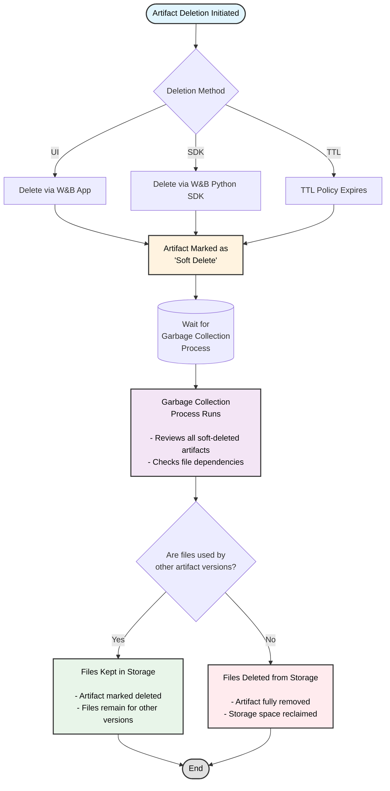

W&amp;B App を使用してインタラクティブに、または W&amp;B Python SDK を使用してプログラムからアーティファクトを削除できます。アーティファクトを削除すると、W&amp;B はそのアーティファクトを *ソフト削除* としてマークします。つまり、アーティファクトは削除対象としてマークされますが、ファイルはすぐにはストレージから削除されません。

アーティファクトの内容は、定期的に実行されるガベージコレクション プロセスが削除対象としてマークされたすべてのアーティファクトを確認するまで、ソフト削除、つまり削除保留状態のまま保持されます。ガベージコレクション プロセスは、そのアーティファクトおよび関連ファイルが前後のアーティファクト バージョンで使用されていない場合、関連ファイルをストレージから削除します。

<div id="artifact-garbage-collection-workflow">
  ## アーティファクト ガベージコレクションのワークフロー
</div>

次の図は、アーティファクトのガベージコレクションの完全なプロセスを示しています。


```mermaid
graph TB
    Start([Artifact Deletion Initiated]) --> DeleteMethod{Deletion Method}
    
    DeleteMethod -->|UI| UIDelete[Delete via W&B App]
    DeleteMethod -->|SDK| SDKDelete[Delete via W&B Python SDK]
    DeleteMethod -->|TTL| TTLDelete[TTL Policy Expires]
    
    UIDelete --> SoftDelete[Artifact Marked as<br/>'Soft Delete']
    SDKDelete --> SoftDelete
    TTLDelete --> SoftDelete
    
    SoftDelete --> GCWait[(Wait for<br/>Garbage Collection<br/>Process)]
    
    GCWait --> GCRun[Garbage Collection<br/>Process Runs<br/><br/>- Reviews all soft-deleted artifacts<br/>- Checks file dependencies]
    
    GCRun --> CheckUsage{Are files used by<br/>other artifact versions?}
    
    CheckUsage -->|Yes| KeepFiles[Files Kept in Storage<br/><br/>- Artifact marked deleted<br/>- Files remain for other versions]
    CheckUsage -->|No| DeleteFiles[Files Deleted from Storage<br/><br/>- Artifact fully removed<br/>- Storage space reclaimed]
    
    KeepFiles --> End([End])
    DeleteFiles --> End
    
    style Start fill:#e1f5fe,stroke:#333,stroke-width:2px,color:#000
    style SoftDelete fill:#fff3e0,stroke:#333,stroke-width:2px,color:#000
    style GCRun fill:#f3e5f5,stroke:#333,stroke-width:2px,color:#000
    style KeepFiles fill:#e8f5e9,stroke:#333,stroke-width:2px,color:#000
    style DeleteFiles fill:#ffebee,stroke:#333,stroke-width:2px,color:#000
    style End fill:#e0e0e0,stroke:#333,stroke-width:2px,color:#000
```

TTL ポリシーを使用すると、W&amp;B でアーティファクトが削除されるタイミングをスケジュールできます。詳細は[Artifact TTL ポリシーでデータ保持を管理する](./ttl)を参照してください。

<Note>
  TTL ポリシー、W&amp;B Python SDK、または W&amp;B App によって削除されたアーティファクトは、まずソフト削除されます。ソフト削除されたアーティファクトは、その後ガベージ コレクションの対象となり、完全に削除されます。
</Note>

<Note>
  entity、プロジェクト、またはアーティファクト コレクションを削除すると、このページで説明しているアーティファクト削除プロセスが開始されます。run を削除する際に関連付けられたアーティファクトも削除することを選択した場合、それらのアーティファクトも同じソフト削除およびガベージ コレクションのワークフローに従います。
</Note>

<div id="delete-an-artifact-version">
  ## アーティファクト バージョンを削除する
</div>

W&amp;B App を使用してインタラクティブに、または W&amp;B Python SDK を使用してプログラムからアーティファクト バージョンを削除できます。

<Tabs>
  <Tab title="W&B App" value="ui">
    アーティファクト バージョンを削除するには:

    1. 削除するアーティファクト バージョンを含むプロジェクトにアクセスします。
    2. **Artifacts** タブを選択します。
    3. アーティファクト タイプの一覧から、削除するバージョンを含むアーティファクト タイプを選択します。
    4. 削除するアーティファクト バージョンの横にある三つの点 (`...`) をクリックします。
    5. ドロップダウンから **Delete Version** を選択します。
  </Tab>

  <Tab title="W&B Python SDK" value="sdk">
    [wandb.Artifact.delete()](/ja/models/ref/python/experiments/artifact#delete) method を使用して、アーティファクト バージョンをプログラムから削除します。アーティファクトの完全名を指定します。完全名は `<entity>/<project>/<artifact_name>:<version>` で構成されます。`delete_aliases` パラメーターを `True` に設定すると、1 つ以上の별칭が関連付けられている場合でもアーティファクトを削除できます。

    ```python
    import wandb

    api = wandb.Api()

    # パスでアーティファクトを取得
    artifact = api.artifact("<entity>/<project>/<artifact_name>:<version>")

    # 별칭も含めてアーティファクト バージョンを削除
    artifact.delete(delete_aliases=True)
    ```
  </Tab>
</Tabs>

<div id="delete-multiple-artifact-versions">
  ## 複数のアーティファクト バージョンを削除する
</div>

次のコード例は、複数のアーティファクト バージョンを削除する方法を示しています。`wandb.Api.run()` に、アーティファクトを作成した entity、プロジェクト名、run ID を引数として指定します。これにより、その run が作成したすべてのアーティファクト バージョンにアクセスできる run オブジェクトが返されます。次に、アーティファクト バージョンを順に処理し、条件に一致するものを削除します。

<Tip>
  `delete_aliases` パラメーターを `True` (`wandb.Artifact.delete(delete_aliases=True)`) に設定すると、アーティファクト バージョンと、それに関連付けられたすべての별칭を削除できます。
</Tip>

`<entity>`、`<project>`、`<run_id>`、`<artifact_name>` のプレースホルダーを、ご自身の値に置き換えてください。

```python
import wandb

# W&B API を初期化する
api = wandb.Api()

# パスで run を取得する。<entity>/<project>/<run_id> で構成される
run = api.run("<entity>/<project>/<run_id>")

# バージョンを削除するアーティファクト名を指定する
artifact_name = "<artifact_name>"

# 指定した名前のアーティファクト バージョンを検索して削除する
for artifact in run.logged_artifacts():
    print(f"Found artifact: {artifact.name}") # 例: run_4dfbufgq_model:v0
    # split() を使ってバージョンを除いたアーティファクト名のみを取得する
    if artifact.name.split(":")[0] == artifact_name:
        print(f"アーティファクト バージョンを削除中: {artifact.name}")
        artifact.delete(delete_aliases=True)
```

<div id="delete-multiple-artifact-versions-with-a-specific-alias">
  ## 特定の별칭を持つ複数の アーティファクト バージョンを削除する
</div>

次のコードは、特定の별칭を持つ複数の アーティファクト バージョンを削除する方法を示します。

`<entity>`、`<project>`、`<run_id>`、`<artifact_name>`、`<alias>` のプレースホルダーをそれぞれ適切な値に置き換えてください：

```python
import wandb

# W&B API を初期化する
api = wandb.Api()

# パスで run を取得する。<entity>/<project>/<run_id> で構成される
run = api.run("<entity>/<project>/<run_id>")

# バージョンを削除するアーティファクト名を指定する
artifact_name = "<artifact_name>"

# 削除するアーティファクト バージョンをフィルタリングする별칭を指定する
desired_alias = "<alias>"

# 별칭 'v3' および 'v4' を持つ run に記録されたアーティファクトを削除する
for artifact in run.logged_artifacts():
    print(f"Found artifact: {artifact.name}")
    if (artifact.name.split(":")[0] == artifact_name) and (desired_alias in artifact.aliases):
            artifact.delete(delete_aliases=True)
```

<div id="delete-an-artifact-collection">
  ## アーティファクト コレクションを削除する
</div>

<Tabs>
  <Tab title="W&B App" value="ui">
    アーティファクト コレクションを削除するには：

    1. 削除するアーティファクト コレクションにアクセスします。
    2. アーティファクト コレクション名の横にある三つの点 (`...`) を選択します。
    3. ドロップダウン メニューから **Delete** を選択します。
  </Tab>

  <Tab title="W&B Python SDK" value="sdk">
    [wandb.Artifact.delete()](/ja/models/ref/python/experiments/artifact#delete) method を使って、プログラムからアーティファクト コレクションを削除します。

    アーティファクト コレクションのフルパスを `wandb.Api.artifact_collection(name="")` に指定します。フルパスは `<entity>/<project>/<artifact_collection_name>` という形式です。

    ```python
    import wandb

    # W&B API を初期化
    api = wandb.Api()

    # パスでアーティファクト コレクションを取得します。形式は <entity>/<project>/<artifact_collection_name>
    collection = api.artifact_collection(
        type_name = "<artifact_type>",
        name = "<entity>/<project>/<artifact_collection_name>"
    )
    collection.delete()
    ```
  </Tab>
</Tabs>

<div id="protected-aliases-and-deletion-permissions">
  ## 保護された별칭と削除権限
</div>

保護された별칭を持つArtifactsには、特別な削除制限があります。[保護された별칭](/ja/models/registry/aliases#protected-aliases)は、W&amp;B Registry 内でRegistry 管理者が設定できる별칭であり、許可されていない削除を防ぐために使用されます。

<Note>
  **保護された별칭に関する重要な考慮事項:**

  * 保護された별칭を持つArtifactsは、Registry 管理者以外は削除できません。
  * Registry 内では、Registry 管理者は保護されたアーティファクト バージョンのリンクを解除し、保護された별칭を含むコレクションやRegistryを削除できます。
  * ソース アーティファクトについて: ソース アーティファクトが保護された별칭を持つRegistryにリンクされている場合、どのユーザーも削除できません
  * Registry 管理者は、ソース アーティファクトから保護された별칭を削除してから、それらを削除できます。
</Note>

<div id="enable-garbage-collection-based-on-how-wb-is-hosted">
  ## W&amp;B のホスティング形態に基づいてガベージコレクションを有効にする
</div>

W&amp;B の共有クラウドを使用している場合、ガベージコレクションはデフォルトで有効になっています。W&amp;B のホスティング形態によっては、ガベージコレクションを有効にするために追加の手順が必要になる場合があります。これには次の手順が含まれます:

* `GORILLA_ARTIFACT_GC_ENABLED` 環境変数を true に設定する: `GORILLA_ARTIFACT_GC_ENABLED=true`
* [AWS](https://docs.aws.amazon.com/AmazonS3/latest/userguide/manage-versioning-examples.html)、[Google Cloud](https://cloud.google.com/storage/docs/object-versioning)、その他 [Minio](https://min.io/docs/minio/linux/administration/object-management/object-versioning.html#enable-bucket-versioning) などのストレージプロバイダを使用している場合は、バケットのバージョン管理を有効にします。Azure を使用している場合は、[ソフト削除を有効にします](https://learn.microsoft.com/azure/storage/blobs/soft-delete-blob-overview)。
  <Note>
    Azure のソフト削除は、他のストレージプロバイダにおけるバケットのバージョン管理と同等です。
  </Note>

次の表は、デプロイのタイプに応じてガベージコレクションを有効にするための要件をどのように満たすかを示します。

`X` はその要件を満たす必要があることを示します:

|                                                                                             | Environment variable (環境変数) | Enable versioning (バージョン管理を有効化) |
| ------------------------------------------------------------------------------------------- | --------------------------- | ------------------------------- |
| Shared cloud                                                                                |                             |                                 |
| Shared cloud with [セキュアストレージコネクタ](/ja/platform/hosting/data-security/secure-storage-connector) |                             | X                               |
| 専用クラウド                                                                                      |                             |                                 |
| 専用クラウド with [セキュアストレージコネクタ](/ja/platform/hosting/data-security/secure-storage-connector)       |                             | X                               |
| セルフマネージド cloud                                                                              | X                           | X                               |
| セルフマネージド on-prem                                                                            | X                           | X                               |

<Note>
  注意
  セキュアストレージコネクタ は現在、Google Cloud Platform と Amazon Web Services でのみ利用可能です。
</Note>