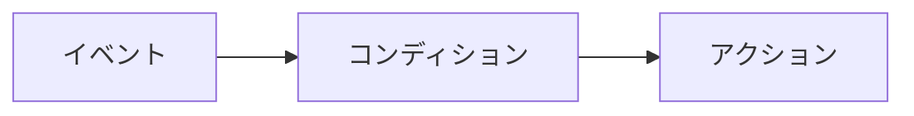

import AutomationsMentalModel from "/snippets/ja/_includes/automations/mental-model.mdx";
import AutomationsActionsList from "/snippets/ja/_includes/automations/actions-list.mdx";
import AutomationsBestPractices from "/snippets/ja/_includes/automations/best-practices.mdx";
import AutomationsWhereToFind from "/snippets/ja/_includes/automations/where-to-find-automations.mdx";

*オートメーション*は、W&amp;B で発生する特定のイベントに応じて Slack 通知を送信したり、webhook を実行したり、ARIA にプロンプトを送信したりします。オートメーションのスコープは、組織、チーム、project、Registry、またはコレクションに設定できます。オートメーションは、後から作成される project、Registry、コレクションを含め、スコープ内のすべてで発生するイベントを監視します。オートメーションを作成する手順と利用可能なイベントは、スコープによって異なります。スコープごとのイベントタイプについては、[Automation events and scopes](/ja/models/automations/automation-events) を参照してください。

<Note>
  チームスコープおよび組織スコープのオートメーションと [Automations ハブ](#automations-hub) は、W&amp;B Multi-tenant Cloud および W&amp;B 専用クラウド (Server v0.83.0 以降) で利用できます。
</Note>

<AutomationsMentalModel />

```mermaid
flowchart LR
  Event[イベント] --> Condition[コンディション]
  Condition --> Action[アクション]
```

**例:** run が失敗した (イベント) 場合に、必要に応じて run 名フィルター (条件) を指定し、Slack 通知 (アクション) を送信します。別の例: alias `production` が追加された (イベント) 場合に、webhook (アクション) を実行します。

  ## オートメーションを作成できる場所

<AutomationsWhereToFind />

  ## Automations ハブ

**Automations** ハブは、左側のナビゲーションにあるグローバルな画面で、アクセス可能なすべてのスコープと project にまたがるすべてのオートメーションを1つのリストに集約します。各 project や Registry に移動しなくても、オートメーションを見つけて確認し、管理できます。

**Automations** ハブでは、次の操作を実行できます。

* スコープのエントリポイントを事前に把握していなくても、オートメーションを作成し、そのスコープを選択できます。
* アクセス可能なすべてのオートメーションを1つのリストで表示し、フィルターや並べ替えを行えます (例: スコープ、トリガー、アクション別) 。
* オートメーションの名をクリックして、設定の詳細をすべて表示できます。
* オートメーションの[実行履歴](/ja/models/automations/view-automation-history)を表示し、成功したか失敗したかを確認できます。
* クイックフィルターを使用して、自分が作成したオートメーションと組織内のすべてのオートメーションを切り替えられます。
* 複数のオートメーションを選択し、一度に削除できます。

**Automations** ハブは、各 project と Registry の **Automations** タブを補完する機能です。これらのスコープ別タブも、対象を絞ってすばやくアクセスするために引き続き利用できます。

  ## 使用例

* **run の監視とアラート**: run が失敗したときや、メトリクスがしきい値を超えたとき (たとえば、損失が NaN になる、または精度が低下する場合) にチームに通知します。
* **Registry CI/CD**: 新しいモデル バージョンがリンクされたとき、または alias (`staging` や `production` など) が追加されたときに、webhook をトリガーしてテストを実行したり、デプロイしたりします。
* **project の artifact ワークフロー**: 新しい artifact バージョンが作成されたとき、または project に alias が追加されたときに、後続のジョブを実行したり、Slack に投稿したりします。
* **自動分析**: run が失敗したときや、新しいモデル バージョンがリンクされたときに、[ARIA](/ja/aria/overview) にプロンプトを送信して、失敗の原因を診断したり、新しいバージョンを本番環境のものと比較したりします。

イベントとスコープの詳細については、[Automation events and scopes](/ja/models/automations/automation-events) を参照してください。

  ## オートメーションアクション

イベントによってオートメーションがトリガーされると、次のいずれかのアクションを実行できます。

<AutomationsActionsList />

実装の詳細については、[Slack オートメーションの作成](/ja/models/automations/create-automations/slack)、[webhook オートメーションの作成](/ja/models/automations/create-automations/webhook)、または [ARIA オートメーションの作成](/ja/models/automations/create-automations/aria) を参照してください。

  ## オートメーションの動作

[オートメーションを作成](/ja/models/automations/create-automations)するには、次の手順を行います。

1. 必要に応じて、アクセストークン、パスワード、機密性の高い設定の詳細など、オートメーションで必要になる機密文字列のために[シークレット](/ja/platform/secrets)を設定します。シークレットは **Team Settings** で定義します。シークレットは、主に webhook オートメーションで、認証情報やトークンを平文で公開したり webhook のペイロードにハードコードしたりすることなく、webhook の外部サービスに安全に渡すために使用されます。
2. チームレベルの webhook または Slack インテグレーションを設定して、W&amp;B が Slack に投稿したり、ユーザーに代わって webhook を実行したりできるようにします。1 つのオートメーションアクション (webhook または Slack 通知) を複数のオートメーションで使用できます。これらのアクションは **Team Settings** で定義します。ARIA アクションにはインテグレーションは不要です。
3. project または Registry で、オートメーションを作成します。
   1. 監視する[イベント](/ja/models/automations/automation-events)を定義します。たとえば、新しい artifact バージョンが追加されたときです。
   2. イベント発生時に実行するアクション (Slack チャンネルへの投稿、webhook の実行、ARIA へのプロンプトの送信など) を定義します。webhook の場合は、必要に応じて、アクセストークンに使用するシークレットや、ペイロードとともに送信するシークレットを指定します。

  ## 推奨事項

<AutomationsBestPractices />

  ## 制限事項

* [run メトリクスのオートメーション](/ja/models/automations/automation-events/#run-metrics-change)および[run メトリクスの z スコア変化オートメーション](/ja/models/automations/automation-events/#run-metrics-z-score-change)は、[W&amp;B Multi-tenant Cloud](/ja/platform/hosting/#wb-multi-tenant-cloud)と[専用クラウド](/ja/platform/hosting/hosting-options/dedicated-cloud)でのみサポートされています。
* **チーム**および**組織**スコープでは、W&amp;B App でサポートされるのは artifact とコレクションのイベントのみです。これらのスコープでは、run ベースのイベントは W&amp;B App で利用できません。詳細は、[Automation events and scopes](/ja/models/automations/automation-events)を参照してください。

  ## 次のステップ

* [オートメーションのチュートリアル](/ja/models/automations/tutorial): run の失敗を通知する project オートメーションと、alias が追加されたときに webhook を実行する Registry オートメーションの作成方法を案内します。このチュートリアルでは W&amp;B App を使用します。
* [オートメーションを作成](/ja/models/automations/create-automations)。
* [Automation events and scopes](/ja/models/automations/automation-events)。
* [シークレットを作成](/ja/platform/secrets)。

{/* Python SDK の `create_automation` のリグレッションが修正されたら、上の Create の箇条書きの後に戻します（内部 WB-34263）:
  - [API でオートメーションを管理](/models/automations/api)。
  */}

<Info>
  オートメーションに関する関連チュートリアルをお探しですか？

  * [モデルの評価とデプロイのために GitHub Action を自動でトリガーする方法を学ぶ](https://wandb.ai/wandb/wandb-model-cicd/reports/Model-CI-CD-with-W-B--Vmlldzo0OTcwNDQw).
  * [モデルを SageMaker エンドポイントに自動デプロイするデモ動画を見る](https://www.youtube.com/watch?v=s5CMj_w3DaQ).
  * [オートメーションを紹介する動画シリーズを見る](https://youtube.com/playlist?list=PLD80i8An1OEGECFPgY-HPCNjXgGu-qGO6\&feature=shared).
</Info>