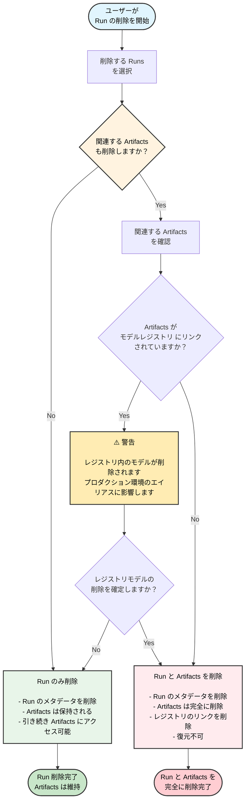

W&B App を使用して、 Projects から 1 つ以上の Runs を削除します。

1. 削除したい Runs が含まれる Project に移動します。
2. **Runs** タブを選択します。
3. 削除したい Runs の隣にあるチェックボックスを選択します。
4. テーブルの上にある **Delete** ボタン（ゴミ箱アイコン）を選択します。
5. 表示されるドロワーから **Delete** を選択します。

<Note>
Run ID は、 Run を削除した後でも再利用することはできません。再利用しようとすると、その Run はエラーで失敗します。
</Note>

<Note>
大量の Runs を含む Projects の場合、検索バーを使用して Regex（正規表現）で削除対象の Runs を絞り込むか、フィルターボタンを使用してステータス、タグ、その他のプロパティに基づいて Runs をフィルタリングできます。
</Note>

### Run 削除のフローチャート

以下の図は、関連する Artifacts や モデルレジストリ のリンクの処理を含む、 Run 削除の完全な プロセス を示しています。

<Warning>
Run を削除し、同時に関連する Artifacts の削除を選択した場合、それらの Artifacts は完全に削除され、後で Run を復元したとしても元に戻すことはできません。これには、 モデルレジストリ にリンクされている Artifacts も含まれます。
</Warning>