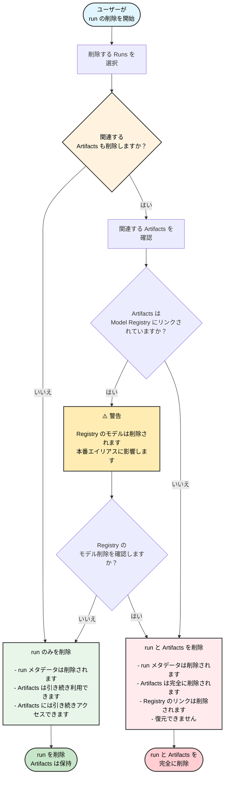

<div id="delete-runs">
  ## run を削除する
</div>

W&amp;B App または Python API を使用して、project から run を削除します。

<Tabs>
  <Tab title="W&B App" value="ui">
    1. 削除する run が含まれている project にアクセスします。
    2. **Runs** タブを選択します。
    3. 削除する run の横にあるチェックボックスを選択します。
    4. 表の上にある **Delete** ボタン (ごみ箱アイコン) を選択します。
    5. 表示されたドロワーで **Delete** を選択します。

    多数の run を含む project では、検索バーを使用して正規表現で削除対象の run を絞り込むか、フィルター ボタンを使用してステータス、タグ、その他のプロパティに基づいて run を絞り込めます。
  </Tab>

  <Tab title="Python" value="python">
    [`Run.delete()`](/ja/models/ref/python/public-api/run#method-run-delete) を使用すると、プログラムから run を削除できます。run に関連付けられている artifact も削除する場合は、`delete_artifacts=True` を設定します。

    ```python
    import wandb

    api = wandb.Api()
    runs = api.runs("<entity>/<project>")
    for run in runs:
        if run.state == "finished":  # 独自の条件に置き換えてください
            run.delete(delete_artifacts=False)
    ```

    完全なメソッドシグネチャと動作については、[`Run.delete` リファレンス](/ja/models/ref/python/public-api/run#method-run-delete) を参照してください。

    ログしたメディアなど、run に添付された個別のファイルを削除するには、次の手順を実行します。

    1. [`Run.files()`](/ja/models/ref/python/public-api/run#method-run-files) で対象のファイルハンドルを取得します。
    2. [`File.delete()`](/ja/models/ref/python/public-api/file#method-file-delete) を使用して個別のファイルを削除します。
  </Tab>
</Tabs>

run ID は、run を削除した後でも再利用できません。代わりに、その ID を使用した run はエラーで失敗します。

<Warning>
  run を削除するときに関連付けられている artifact も削除するよう選択した場合、それらの artifact は完全に削除され、後で run を復元しても復旧できません。これには Registry にリンクされている artifact も含まれます。
</Warning>

<div id="run-deletion-flowchart">
  ## Run 削除フローチャート
</div>

次の図は、関連する artifact と Registry リンクの処理を含む、Run の削除プロセス全体を示しています。


```mermaid
graph TB
    Start([ユーザーが<br/>run の削除を開始]) --> RunSelect[削除する Runs を<br/>選択]
    RunSelect --> DeletePrompt{関連する<br/>Artifacts も削除しますか？}
    DeletePrompt -->|いいえ| DeleteRunOnly[run のみを削除<br/><br/>- run メタデータは削除されます<br/>- Artifacts は引き続き利用できます<br/>- Artifacts には引き続きアクセスできます]
    DeletePrompt -->|はい| CheckArtifacts[関連する Artifacts を<br/>確認]
    CheckArtifacts --> HasRegistry{Artifacts は<br/>Model Registry にリンクされていますか？}
    HasRegistry -->|はい| RegistryWarning[⚠️ 警告<br/><br/>Registry のモデルは削除されます<br/>本番エイリアスに影響します]
    HasRegistry -->|いいえ| DirectDelete
    RegistryWarning --> ConfirmRegistry{Registry の<br/>モデル削除を確認しますか？}
    ConfirmRegistry -->|いいえ| DeleteRunOnly
    ConfirmRegistry -->|はい| DirectDelete[run と Artifacts を削除<br/><br/>- run メタデータは削除されます<br/>- Artifacts は完全に削除されます<br/>- Registry のリンクは削除されます<br/>- 復元できません]
    DeleteRunOnly --> PartialEnd([run を削除<br/>Artifacts は保持])
    DirectDelete --> FullEnd([run と Artifacts を<br/>完全に削除])
    style Start fill:#e1f5fe,stroke:#333,stroke-width:2px,color:#000
    style DeletePrompt fill:#fff3e0,stroke:#333,stroke-width:2px,color:#000
    style RegistryWarning fill:#ffecb3,stroke:#333,stroke-width:2px,color:#000
    style DirectDelete fill:#ffebee,stroke:#333,stroke-width:2px,color:#000
    style DeleteRunOnly fill:#e8f5e9,stroke:#333,stroke-width:2px,color:#000
    style PartialEnd fill:#c8e6c9,stroke:#333,stroke-width:2px,color:#000
    style FullEnd fill:#ffcdd2,stroke:#333,stroke-width:2px,color:#000
```

<div id="when-deleted-run-data-is-removed-from-storage">
  ## 削除された run データがストレージから削除されるタイミング
</div>

[W&amp;B 専用クラウド](/ja/platform/hosting/hosting-options/dedicated-cloud) と [W&amp;B セルフマネージド](/ja/platform/hosting/hosting-options/self-managed) では、`GORILLA_DATA_RETENTION_PERIOD` 環境変数によって、**削除された run データ**がオブジェクトストレージから完全に削除可能になるまで保持される期間を制御します。**Artifacts はこの設定では削除されません**。Artifacts には、[Delete an artifact](/ja/models/artifacts/delete-artifacts) で説明されている artifact の削除およびガベージコレクションのフローが適用されます。

`GORILLA_DATA_RETENTION_PERIOD` の設定または変更は、保持期間を過ぎたデータに対しては元に戻せません。保持期間を有効にする前、または保持期間を短くする前に、データベースとバケットをバックアップしてください。参照用の表と警告については、[Configure environment variables](/ja/platform/hosting/env-vars) を参照してください。

run またはファイルの削除と保持期間の処理が完了した後でも、バックグラウンド ジョブの処理が追いつくまで、**バケット使用量の反映が遅れることがあります**。W&amp;B は、オブジェクトストレージ容量が即座に解放されることを保証しません。Artifacts と run データの違い、想定されるタイミング、必要に応じた operator の対応についての全体像は、[Manage bucket storage and costs](/ja/platform/hosting/managing-bucket-storage) を参照してください。

<Note>
  Public API の使用時に、削除が W&amp;B App に想定どおり反映されない場合は、W&amp;B Python SDK を最新リリースにアップグレードしてから再試行してください。
</Note>