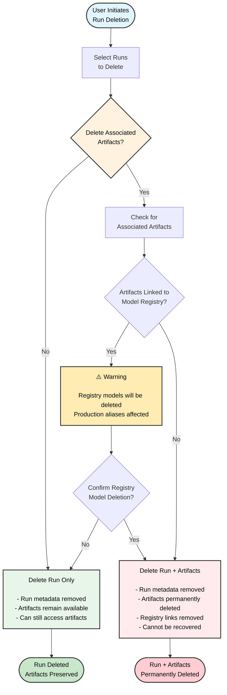

W&B App を使用して、プロジェクトから 1 つ以上の run を削除します。

1. 削除したい run を含むプロジェクトにアクセスします。
2. **Runs** タブを選択します。
3. 削除したい run の横にあるチェックボックスを選択します。
4. テーブル上部の **Delete** ボタン（ゴミ箱アイコン）を選択します。
5. 表示されるドロワーから **Delete** を選択します。

<Note>
run ID は、run を削除した後でも再利用できません。再利用しようとすると、その run はエラーで失敗します。
</Note>

<Note>
多数の run を含むプロジェクトでは、検索バーで正規表現（Regex）を利用して削除したい run を絞り込むか、フィルターボタンでステータス、タグ、その他のプロパティに基づいて run をフィルタリングできます。
</Note>

  ### Run 削除フローチャート

次の図は、関連するアーティファクトや Registry へのリンクの扱いも含めた、Run 削除プロセス全体を示しています。

```mermaid
graph TB
    Start([User Initiates<br/>Run Deletion]) --> RunSelect[Select Runs<br/>to Delete]
    
    RunSelect --> DeletePrompt{Delete Associated<br/>Artifacts?}
    
    DeletePrompt -->|No| DeleteRunOnly[Delete Run Only<br/><br/>- Run metadata removed<br/>- Artifacts remain available<br/>- Can still access artifacts]
    
    DeletePrompt -->|Yes| CheckArtifacts[Check for<br/>Associated Artifacts]
    
    CheckArtifacts --> HasRegistry{Artifacts Linked to<br/>Model Registry?}
    
    HasRegistry -->|Yes| RegistryWarning[⚠️ Warning<br/><br/>Registry models will be deleted<br/>Production aliases affected]
    HasRegistry -->|No| DirectDelete
    
    RegistryWarning --> ConfirmRegistry{Confirm Registry<br/>Model Deletion?}
    
    ConfirmRegistry -->|No| DeleteRunOnly
    ConfirmRegistry -->|Yes| DirectDelete[Delete Run + Artifacts<br/><br/>- Run metadata removed<br/>- Artifacts permanently deleted<br/>- Registry links removed<br/>- Cannot be recovered]
    
    DeleteRunOnly --> PartialEnd([Run Deleted<br/>Artifacts Preserved])
    DirectDelete --> FullEnd([Run + Artifacts<br/>Permanently Deleted])
    
    style Start fill:#e1f5fe,stroke:#333,stroke-width:2px,color:#000
    style DeletePrompt fill:#fff3e0,stroke:#333,stroke-width:2px,color:#000
    style RegistryWarning fill:#ffecb3,stroke:#333,stroke-width:2px,color:#000
    style DirectDelete fill:#ffebee,stroke:#333,stroke-width:2px,color:#000
    style DeleteRunOnly fill:#e8f5e9,stroke:#333,stroke-width:2px,color:#000
    style PartialEnd fill:#c8e6c9,stroke:#333,stroke-width:2px,color:#000
    style FullEnd fill:#ffcdd2,stroke:#333,stroke-width:2px,color:#000
```

<Warning>
  run を削除する際に、関連するアーティファクトも削除することを選択すると、それらのアーティファクトは完全に削除され、後から run を復元しても復元できません。これには、Registry にリンクされているアーティファクトも含まれます。
</Warning>
