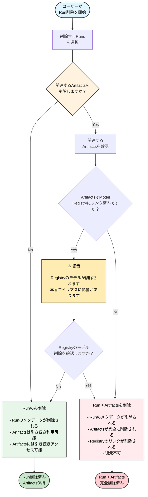

<div id="delete-runs">
  ## Run を削除する
</div>

W&amp;B App または Python API を使用して、プロジェクトから run を削除できます。

<Tabs>
  <Tab title="W&B App" value="ui">
    1. 削除する run を含むプロジェクトにアクセスします。
    2. **Runs** タブを選択します。
    3. 削除する run の横にあるチェックボックスを選択します。
    4. 表の上部にある **Delete** ボタン (ごみ箱アイコン) を選択します。
    5. 表示されたドロワーで **Delete** を選択します。

    多数の run を含むプロジェクトでは、検索バーを使用して正規表現で削除したい run を絞り込むか、フィルターボタンを使用してステータス、tags、そのほかのプロパティに基づいて run を絞り込めます。
  </Tab>

  <Tab title="Python" value="python">
    [`Run.delete()`](/ja/models/ref/python/public-api/run#method-run-delete) を使用すると、プログラムから run を削除できます。run に関連付けられた artifact も削除する場合は、`delete_artifacts=True` を設定します。

    ```python
    import wandb

    api = wandb.Api()
    runs = api.runs("<entity>/<project>")
    for run in runs:
        if run.state == "finished":  # 独自の条件に置き換えてください
            run.delete(delete_artifacts=False)
    ```

    メソッドの完全なシグネチャと動作については、[`Run.delete` reference](/ja/models/ref/python/public-api/run#method-run-delete) を参照してください。

    ログされたメディアなど、run に添付された個々のファイルを削除するには:

    1. [`Run.files()`](/ja/models/ref/python/public-api/run#method-run-files) を使用して、該当するファイルハンドルを取得します。
    2. [`File.delete()`](/ja/models/ref/python/public-api/file#method-file-delete) を使用して、個々のファイルを削除します。
  </Tab>
</Tabs>

run ID は、run を削除した後でも再利用できません。代わりに、その run はエラーで失敗します。

<Warning>
  run を削除する際に、関連付けられた artifact も削除することを選択すると、その artifact は完全に削除され、後から run を復元しても復旧できません。これには、Registry にリンクされた artifact も含まれます。
</Warning>

<div id="run-deletion-flowchart">
  ## run の削除フローチャート
</div>

次の図は、関連するArtifacts と Registry リンクの処理を含む、run の削除プロセス全体を示しています。


```mermaid
graph TB
    Start([ユーザーが<br/>Run削除を開始]) --> RunSelect[削除するRuns<br/>を選択]
    
    RunSelect --> DeletePrompt{関連するArtifactsを<br/>削除しますか？}
    
    DeletePrompt -->|No| DeleteRunOnly[Runのみ削除<br/><br/>- Runのメタデータが削除される<br/>- Artifactsは引き続き利用可能<br/>- Artifactsには引き続きアクセス可能]
    
    DeletePrompt -->|Yes| CheckArtifacts[関連する<br/>Artifactsを確認]
    
    CheckArtifacts --> HasRegistry{ArtifactsはModel<br/>Registryにリンク済みですか？}
    
    HasRegistry -->|Yes| RegistryWarning[⚠️ 警告<br/><br/>Registryのモデルが削除されます<br/>本番エイリアスに影響があります]
    HasRegistry -->|No| DirectDelete
    
    RegistryWarning --> ConfirmRegistry{Registryのモデル<br/>削除を確認しますか？}
    
    ConfirmRegistry -->|No| DeleteRunOnly
    ConfirmRegistry -->|Yes| DirectDelete[Run + Artifactsを削除<br/><br/>- Runのメタデータが削除される<br/>- Artifactsが完全に削除される<br/>- Registryのリンクが削除される<br/>- 復元不可]
    
    DeleteRunOnly --> PartialEnd([Run削除済み<br/>Artifacts保持])
    DirectDelete --> FullEnd([Run + Artifacts<br/>完全削除済み])
    
    style Start fill:#e1f5fe,stroke:#333,stroke-width:2px,color:#000
    style DeletePrompt fill:#fff3e0,stroke:#333,stroke-width:2px,color:#000
    style RegistryWarning fill:#ffecb3,stroke:#333,stroke-width:2px,color:#000
    style DirectDelete fill:#ffebee,stroke:#333,stroke-width:2px,color:#000
    style DeleteRunOnly fill:#e8f5e9,stroke:#333,stroke-width:2px,color:#000
    style PartialEnd fill:#c8e6c9,stroke:#333,stroke-width:2px,color:#000
    style FullEnd fill:#ffcdd2,stroke:#333,stroke-width:2px,color:#000
```

<div id="when-deleted-run-data-is-removed-from-storage">
  ## 削除されたrunデータがストレージから削除されるタイミング
</div>

[W&amp;B 専用クラウド](/ja/platform/hosting/hosting-options/dedicated-cloud) および [W&amp;B セルフマネージド](/ja/platform/hosting/hosting-options/self-managed) では、`GORILLA_DATA_RETENTION_PERIOD` 環境変数によって、**削除されたrunデータ**をオブジェクトストレージから完全に削除できるようになるまで保持する期間を制御します。**Artifacts はこの設定では削除されません**。Artifacts には、[Delete an artifact](/ja/models/artifacts/delete-artifacts) で説明されている artifact の削除およびガベージコレクションのフローが適用されます。

`GORILLA_DATA_RETENTION_PERIOD` の設定または変更は、保持期間を過ぎたデータに対しては元に戻せません。保持期間を有効にする前、または保持期間を短くする前に、データベースとバケットをバックアップしてください。参照用の表と警告については、[Configure environment variables](/ja/platform/hosting/env-vars) を参照してください。

run またはファイルの削除と保持期間の処理が完了した後でも、バックグラウンド ジョブの処理が追いつくまで、**バケット使用量の反映が遅れることがあります**。W&amp;B は、オブジェクトストレージ領域が即座に回収されることを保証しません。Artifacts とrunデータの違い、想定されるタイミング、および必要に応じた運用担当者の対応についての全体像は、[Manage bucket storage and costs](/ja/platform/hosting/managing-bucket-storage) を参照してください。

<Note>
  Public API の使用時に削除結果が W&amp;B App に想定どおり表示されない場合は、W&amp;B Python SDK を最新リリースにアップグレードしてから再試行してください。
</Note>