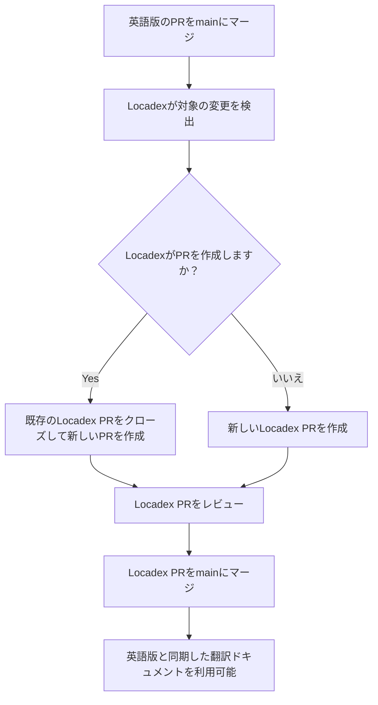

  # 技術ライター向け Locadex 自動翻訳

このランブックは、`wandb/docs` リポジトリで作業する W&amp;B の英語版技術ライターを対象としています。`main` で Locadex インテグレーションが有効になっており、本番環境での翻訳に使用されていることを前提としています。

これを読むことで、エンドツーエンドのフロー、Locadex がリポジトリ内で変更する内容、Locadex コンソールと GitHub のどちらで作業すべきか、またローカライズ済みコンテンツを修正または改善する方法を把握できます。

  ## 概要と対象範囲

  ### Locadex がローカライズする対象

General Translation [Locadex for Mintlify](https://generaltranslation.com/en-US/docs/locadex/mintlify) は、リポジトリのルートにある `gt.config.json` に基づいて、ソースコンテンツのローカライズ版を生成・更新します。現在の設定では、対象は次のとおりです。

* **MDX と Markdown のページ**: リポジトリ配下の英語ファイルは、`gt.config.json` のパス変換に従って、ロケールディレクトリ (例: `ko/`、`ja/`、`fr/`) にミラーされます。Locadex はすでに翻訳したファイルを把握しており、新たにマージされた英語の変更だけを翻訳します。
* **スニペット**: 共有スニペットのパスも同じ方法でローカライズされます (たとえば、設定に従って `snippets/foo.mdx` から `snippets/ko/foo.mdx`) 。
* **目次とナビゲーション**: `docs.json` も対象に含まれるため、ローカライズされたナビゲーションとページパスを Mintlify と整合した状態に保てます。
* **OpenAPI 仕様**: 設定済みの OpenAPI JSON ファイル (たとえば `training/api-reference/` や `weave/reference/service-api/` 配下) も、`gt.config.json` に従ってローカライズされます。

Locadex は、Mintlify の動作に影響するオプション (たとえば、静的 import と相対アセットの処理、リダイレクト、ヘッダーアンカーの動作) も適用します。どの JSON と MDX のパスが対象になるかを判断する際は、`gt.config.json` を信頼できる唯一の基準として扱ってください。

  ### Locadexがローカライズしないもの

* **ラスター画像とベクター画像**: 画像ファイルはロケール別のアートワークに差し替えられません。図やスクリーンショットは、ローカライズ済みのアセットを追加して自分でパスを更新しない限り、参照先のまま使用されます。
* **除外された本文ファイル**: `gt.config.json` の `files.mdx.exclude` に記載されたパスは自動翻訳されません。これには、`README.md`、`CONTRIBUTING.md`、`AGENTS.md` などの標準的なリポジトリファイルに加え、チームがそこに追加した任意のパターンも含まれます。
* **英語がソースオブトゥルース**: ライターは引き続き英語で執筆し、変更をマージします。ローカライズ済みファイルは、オートメーションの出力に、必要に応じて手動編集を加えたものです。

  ## main での翻訳ワークフロー

Locadex がリポジトリに接続されると ([Locadex for Mintlify](https://generaltranslation.com/docs/locadex/mintlify) に記載されている GitHub app、project、ブランチ設定に従って設定) :

1. **英語のみ**のドキュメントのプルリクエストを `main` にマージします。
2. Locadex が対象となる変更を検出し (インテグレーション ルールに従って) 、**翻訳ラウンド**を開始または更新します。
3. `main` に対する Locadex のプルリクエストがすでに開いている場合、Locadex は**その PR をクローズ**し、クローズした PR のすべての変更に、新たにマージされた英語の変更を加えた新しい PR を作成します。Locadex PR が開いていない場合、Locadex はローカライズ済みの更新を含む**新しい PR を作成**します。Locadex PR の例については、[#2430](https://github.com/wandb/docs/pull/2430) を参照してください。
4. docs チームが Locadex PR を**レビュー**します (状況に応じて、スポットチェック、LLM 支援レビュー、またはネイティブスピーカーによるレビューを行います) 。

   Locadex PR に誤りを見つけた場合は、PR ブランチに修正をコミットしてください。これにより、今後の翻訳ラウンドでの Locadex の翻訳品質向上につながります。
5. Locadex PR が `main` に**マージ**されると、Mintlify は更新されたローカライズ版サイトを英語版とあわせて配信します。その PR をマージすると、更新された翻訳ドキュメントが公開されます。

  ### 英語の PR がマージされた後のライター向けチェックリスト

* [ ] オープンな PR の一覧で Locadex の PR を検索します。これは、英語の PR がマージされる前から存在している場合もあれば、マージによって作成される場合もあります。`locadex` で検索してください。
* [ ] 変更をローカライズ済みサイトに緊急で反映する必要がある場合は、Locadex の PR のレビューを受けてマージし、更新をすぐに公開します。そうでない場合、翻訳は Locadex の PR がマージされると利用可能になります。
* [ ] **今後**の Runs で用語を変更する必要がある場合は、Locadex コンソールで **AI Context** を更新し (以下を参照) 、既存のページを再生成する必要がある場合は **Retranslate** を計画してください。

  ## Locadex コンソール と wandb/docs リポジトリ

変更の種類ごとに、適切な場所で作業してください。

| Task                                                               | Where to do it                                 | Notes                                                                                                                                                                   |
| ------------------------------------------------------------------ | ---------------------------------------------- | ----------------------------------------------------------------------------------------------------------------------------------------------------------------------- |
| **対象ロケール** や **翻訳対象のファイル** を追加または変更する                              | GitHub の `gt.config.json`                      | `main` への通常の PR が必要です。include または exclude パターンを変更する前に、engineering または docs platform の担当者と調整してください。                                                                      |
| **Glossary** (用語、定義、ロケールごとの翻訳、翻訳しない語句)                             | Locadex コンソール、**Context**、**Glossary**       | CSV で一括 **import** / **export** できます。[GT Glossary](https://generaltranslation.com/docs/platform/ai-context/glossary) を参照してください。                                         |
| **Locale Context** (空白の扱いに関するヒント、ロケールごとのトーン、書式ルールなど、ロケール固有のプロンプト)  | Locadex コンソール、**Context**、**Locale Context** | [Locale Context](https://generaltranslation.com/docs/platform/ai-context/locale-context) を参照してください。                                                                     |
| **Style Controls** (対象読者、project の説明、全体のトーンに関する project 全体のプロンプト)  | Locadex コンソール、**Context**、**Style Controls** | [Style Controls](https://generaltranslation.com/docs/platform/ai-context/style-controls) を参照してください。                                                                     |
| コンテキスト変更後に個別ファイルを手動で再翻訳する **Retranslate**                          | Locadex コンソール                                | [Retranslate](https://generaltranslation.com/docs/platform/translations/retranslate) を参照してください。AI Context を変更しても、retranslate を実行するまでは、既存のローカライズ済みファイルは自動的にすべて書き換えられません。 |
| 機械翻訳の出力を **Review** する                                             | GitHub 上の Locadex PR                           | コメント、変更リクエスト、修正の push、または権限があれば PR をマージせずに閉じて翻訳ラウンドを破棄できます。                                                                                                             |
| ローカライズ済みページ内の **単発のテキスト修正**                                        | GitHub で直接編集                                   | ロケールディレクトリ配下のファイル (例: `ko/...`) を編集します。`main` への通常の PR を作成してください。必要に応じて、今後手動修正が発生しないよう Locadex Dashboard 側でも調整してください。                                                   |

**重要:** docs 用の Glossary とプロンプトは `gt.config.json` ではなく、**Locadex コンソール** にあります。

  ### 用語集と AI コンテキストのインポートとエクスポート

1. [General Translation Dashboard](https://dash.generaltranslation.com/) (Locadex コンソール) にサインインします。
2. `wandb/docs` に関連付けられている project を開きます。
3. **Context** に移動し、必要に応じて **Glossary**、**Locale Context**、または **Style Controls** を選択します。

**Glossary CSV**

* 多数の用語を一括でインポートするには、**Upload Context CSV** を使用します。列名は、コンソールで想定されている名前 (たとえば **Term**、**Definition**、および **ko** などのロケール列) と一致している必要があります。アップロードに失敗した場合は、ヘッダーをプロダクト内のヘルプまたは [GT Glossary](https://generaltranslation.com/docs/platform/ai-context/glossary) と照らし合わせてください。
* バックアップ、レビュー、またはベンダーや LLM と共有して評価する必要がある場合は、用語をエクスポートまたはコピーします。

**Locale Context and Style Controls**

* コンソールで編集して保存します。次の翻訳ラウンドでレビュー担当者が想定しやすいように、重要なルール変更はチームのチャンネルや社内メモに記録してください。

**After changing AI Context**

* 既存のローカライズ済みページに新しいルールを反映させる必要がある場合は、影響を受けるファイルまたはロケールに対して **Retranslate** を実行します。その後、新規または更新された Locadex PR が作成されることがあります。

  ## 翻訳ラウンドの評価にLLMを使用する

LLMは、大規模なLocadex PRのトリアージに役立ちます。ただし、精度、プロダクト用語、ニュアンスについては、人間の判断の代わりにはなりません。以下のセクションでは、考えられるアプローチの1つを説明します。

  ### 1. 入力を集める

* **Diff**: GitHub 上の Locadex の PR diff をエージェントに指定します。
* **Rules**: 次を貼り付けるか、要約します。
  * Locadex コンソールの **Glossary** エントリと **Locale Context** エントリ。すべての言語で、これらは 1 つにまとめられた CSV エクスポートに含まれます (対象ロケールに関連する用語をエクスポートまたはコピーします) 。
  * 任意: チームで評価ルーブリックをそこに保管している場合は、リポジトリのルートにある `locadex_prompts.md` ファイルの内部プロンプト用メモ (文頭のみ大文字、W&amp;B プロダクトの命名など) 。
* **English baseline**: サンプル対象のファイルでは、モデルが構造 (見出し、リスト、コードブロック、リンク) を比較できるように、英語のソースパスとローカライズ済みのパスを含めます。

  ### 2. プロンプトの形 (例)

モデルに次のことを依頼します。

* **翻訳してはいけないもの**の違反 (プロダクト名、UI ラベル、`wandb`、コード識別子) を指摘する。
* 貼り付けた一覧に照らして、**用語集との整合性**を確認する。
* **Markdown または MDX の不備** (壊れたリンク、不正な表、コードフェンスの言語タグの誤り) を指摘する。
* **過剰翻訳** (URL、コード、または英語のままにすべき固有名詞が誤って翻訳されているもの) を指摘する。
* ファイルパスと修正案を添えて、**短く実用的な指摘**を優先する。

  ### 3. 出力の使い方

* 指摘事項は、Locadex PR の GitHub レビューコメントにするか、マージ後の追加修正として反映します。
* 同じエラーが多くのファイルに見られる場合は、何十ものファイルを手作業で編集するのではなく、**AI Context** (Glossary または Locale Context) を修正し、**Retranslate** を使用します。

  ## 自動ローカライズ済みコンテンツの手動修正と更新

  ### マージ後の単発修正

単一のページまたはスニペットに誤りがあり、用語集とロケールルールには問題がない場合:

1. `main` からブランチをチェックアウトします。
2. ローカライズ済みのファイル (例: `ja/models/foo.mdx` または `snippets/ko/bar.mdx`) を編集します。
3. 明確な要約 (何が誤っていたか、なぜ手動修正が安全か) を添えて、`main` 向けの PR を作成します。
4. 次回の Locadex 実行で同じファイルが更新されるのは、英語のソースが変更された場合だけです。Locadex が手動修正を上書きした場合は、プラットフォーム担当者にエスカレーションし、project 用に文書化されているロックまたは除外パターンの利用を検討してください。

  ### 用語やスタイルに関する全体的な修正

同じ誤りが複数のファイルで繰り返し発生する場合:

1. Locadex コンソールで **Glossary**、**Locale Context**、または **Style Controls** を更新します。
2. **Retranslate** を使用して、Locadex で影響を受けるローカライズ済みコンテンツを再生成します。生成された Locadex PR は注意深く確認してください。

  ### 英語が再び変更された場合

英語のマージが次回の Locadex 更新を引き起こします。手動で加えたローカライズの修正は、新しい機械翻訳の出力に合わせて調整が必要になる場合があります。オートメーションを安定して維持するため、英語のソースやコンソールのコンテキストを修正することを優先してください。

  ## 検証とテスト

* Locadex の PR がマージされたら、Mintlify preview または本番環境で、ロケールごとにトラフィックの多いページを抜き取りで確認します。
* ワークフロー上必要な場合は、ローカルで `mint dev`、`mint validate`、`mint broken-links` を実行してください (リポジトリの `AGENTS.md` を参照) 。
* 重要な API について、ロケールパス配下の OpenAPI とナビゲーション JSON が引き続きプロダクトの動作と一致していることを確認します。

  ## 関連リンク

* [Mintlify向け Locadex](https://generaltranslation.com/docs/locadex/mintlify)
* [GT Glossary](https://generaltranslation.com/docs/platform/ai-context/glossary)
* [Locale Context](https://generaltranslation.com/docs/platform/ai-context/locale-context)
* [Style Controls](https://generaltranslation.com/docs/platform/ai-context/style-controls)
* [Retranslate](https://generaltranslation.com/docs/platform/translations/retranslate)

  ## チェックリスト (クイックリファレンス)

* [ ] 英語版の PR を `main` にマージします。
* [ ] Locadex の PR を作成または更新し、差分を確認します。
* [ ] 任意: 用語集とロケールルールを使用して、LLM 支援による確認を行います。
* [ ] Locadex の PR をマージして、ローカライズ版の更新を公開します。
* [ ] 同じエラーが繰り返し発生する場合は、console の AI Context を更新して Retranslate を実行します。
* [ ] 単一ファイルのエラーの場合は、GitHub でロケールパスを編集し、`main` 向けの PR を作成します。