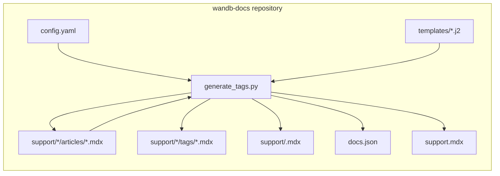
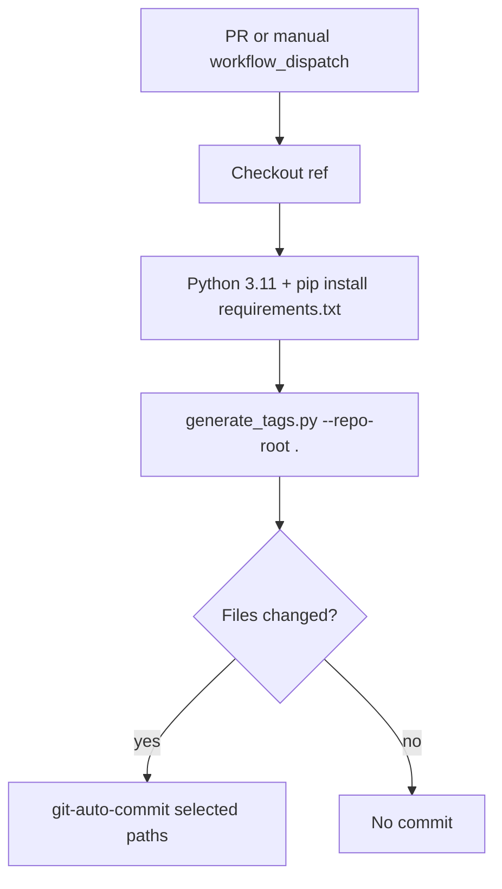
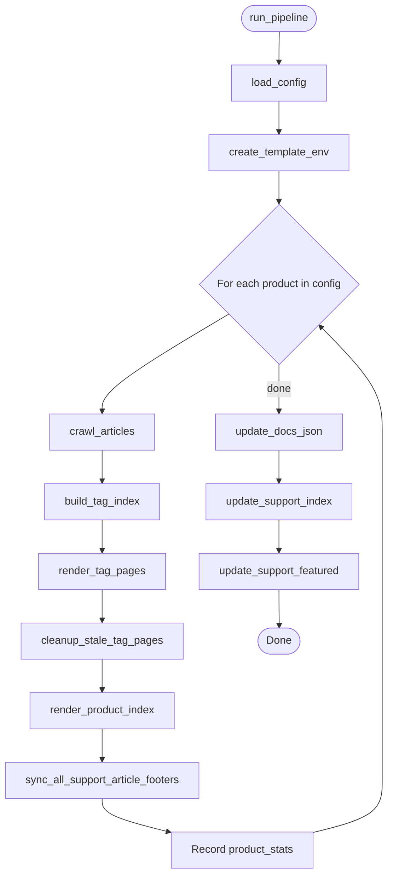
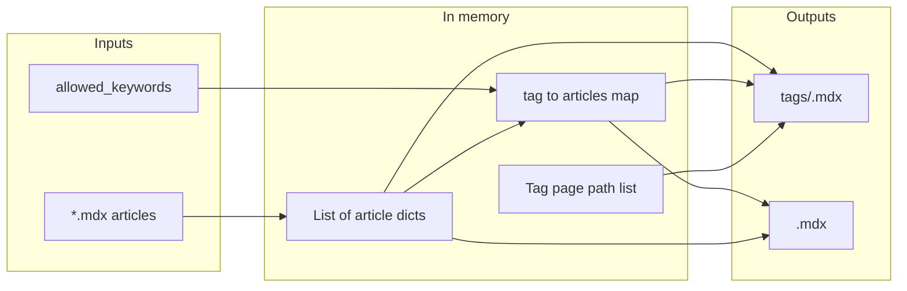

  # Knowledgebase Nav ジェネレーターのアーキテクチャ

このドキュメントでは、`wandb-docs`リポジトリ内の**Knowledgebase Nav**システムについて説明します。具体的には、このシステムが何を生成するのか、どのファイルと関数によって動作しているのか、そして自動化によってそれらがどのように連携しているのかを扱います。作成者向けの手順やローカルでのセットアップについては、[README.md](./README.md)を参照してください。

  ## 目的

このジェネレーターは、サポート (ナレッジベース) のナビゲーションと記事コンテンツの整合性を保ちます。設定されたプロダクト (たとえば models、weave、inference) を対象に実行され、`support/<product>/articles/` 配下の MDX 記事を読み取り、生成済みの MDX ページ、ルートの `support.mdx` の件数、および `docs.json` 内の英語のサポートタブを更新します。

  ## 概要

このシステムは完全に `wandb-docs` 内で動作します。外部 API は呼び出しません。リポジトリのワーキングツリー内のファイルを読み書きします。

**articles** に戻る矢印は、フェーズ 4 で、MDX コメントマーカーで囲まれた `/support/<product>/tags/` 配下のタグページを指す `<Badge>` リンクだけが更新対象であることを意味します。その他のコンテンツ (`---`、他の `<Badge>`、マーカー外のテキストを含む) は書き換えられません。

  ## 自動化ワークフロー

プルリクエストでは、`support/**` または `scripts/knowledgebase-nav/**` 配下のファイルが変更されると (オープン中の PR への新しい push を含む) 、**Knowledgebase Nav** ワークフローがトリガーされます。このワークフローでは、Python の依存関係をインストールし、ジェネレーターを実行して、差分がある場合は該当するパスをコミットします。**fork** からのプルリクエストでは、fork の HEAD コミットをチェックアウトし、ジェネレーターも実行されますが、デフォルトのトークンでは fork に push できないため、自動コミットの step はスキップされます。

コミットされるパスパターンには、`support.mdx`、`support/*/articles/*.mdx`、`support/*/tags/*.mdx`、`support/*.mdx` (プロダクトのインデックス) 、および `docs.json` が含まれます。

  ## パイプラインのオーケストレーション

`run_pipeline(repo_root, config_path)` は、CLI とテストで使用する唯一のエントリポイントです。`config.yaml` を読み込み、すべてのプロダクトで共通の Jinja2 環境を 1 つ構築してから、各プロダクトを順に処理します。ループの完了後、`docs.json` を 1 回、`support.mdx` を 1 回だけ更新します。

  ## プロダクトごとのデータフロー

1 つのプロダクト内では、データは生ファイルからインメモリ構造へ移り、その後 MDX と集約構造に戻されて、後続の step で使用されます。

`render_tag_pages` は、`update_docs_json` がそのプロダクトの英語版ナビゲーションタブに取り込む、ソート済みのページ ID 文字列 (たとえば `support/models/tags/security`) を返します。

  ## コンポーネントとファイル

| コンポーネント        | パス                                        | 役割                                                |
| -------------- | ----------------------------------------- | ------------------------------------------------- |
| CLI とロジック      | `generate_tags.py`                        | すべてのフェーズ、パース、slug ルール、プレビュー、JSON と MDX の書き換え      |
| プロダクトとタグのレジストリ | `config.yaml`                             | プロダクトごとの `slug`、`display_name`、`allowed_keywords` |
| タグ一覧テンプレート     | `templates/support_tag.mdx.j2`            | タグページで、記事ごとに 1 つの Card を表示                        |
| プロダクトハブテンプレート  | `templates/support_product_index.mdx.j2`  | 注目セクションと、カテゴリ別に閲覧するための Card                       |
| 依存関係           | `requirements.txt`                        | PyYAML、Jinja2                                     |
| 単体テスト          | `tests/test_generate_tags.py`             | モック化したファイルシステムと `docs.json`                       |
| インテグレーションテスト   | `tests/test_golden_output.py`             | 実際のリポジトリの一時コピー上で完全なパイプラインを実行                      |
| Pytest マーカー    | `tests/conftest.py`                       | ゴールデンスイート用の `integration` マーカーを登録                 |
| CI             | `.github/workflows/knowledgebase-nav.yml` | トリガー、run スクリプト、自動コミット                             |
| 作成者向けドキュメント    | `README.md`                               | ライターと開発者向けのワークフロー                                 |
| アーキテクチャメモ      | `Architecture.md`                         | 開発者向けの図とモジュールマップ                                  |

  ## `generate_tags.py` 内の機能領域

以下では、関数をソースファイルに登場する順にまとめています。関数名は Python API での表記です。

  ### 設定

* **`load_config`** は `config.yaml` を読み込み、検証します (各プロダクトで必須のキーを確認します) 。

  ### 記事の構造とフッター

* **`parse_frontmatter`**、**`_extract_body`** は、YAML フロントマターと本文を分割します。`_extract_body` は `_BADGE_START_RE` を使用して境界を特定し、見た目を整えるために末尾の `---` 行を削除します。
* **`_split_frontmatter_raw`** は、生の MDX をフロントマターブロックと残りの部分に分割し、フッターの書き換えに使用します。
* **`_normalize_keywords`** は、フロントマターの `keywords` を文字列のリストに正規化します (YAML リスト。単一の文字列は警告付きで 1 つのタグになり、それ以外のタイプは警告を出したうえで空のリストになります) 。
* **`_keywords_list_for_footer`** は、フッター生成用に正規化された `keywords` を返します (**`_normalize_keywords`** に委譲) 。
* **`_tab_badge_pattern`**、**`build_tab_badges_mdx`**、**`build_keyword_footer_mdx`**、**`_replace_tab_badges_in_body`** は、tab Badge のピンポイントな Sync を実装します。管理対象の Badges は `_BADGE_START_RE` / `_BADGE_END_RE` を介して特定されます。この関数は、マーカー導入前の記事では正規表現にフォールバックします。新しいフッターには、空行、正規のマーカー、Badges が追加されます。
* **`sync_support_article_footer`**、**`sync_all_support_article_footers`** は、tab Badges が `keywords` とずれている場合にサポート記事ファイルを書き込みます。

  ### 本文プレビュー (Cardスニペット)

* **`plain_text`** は、Markdown (水平線を含む) 、リンク、URL、HTML / MDX タグなどを除去し、プレビューをプレーンテキストのまま保ちます (entity デコード後に U+00A0 をスペースへ変換し、スマートクォートを ASCII に正規化し、許可リストでは識別子用に `_` と `=` を保持します) 。
* **`extract_body_preview`** は `plain_text` を適用し、`BODY_PREVIEW_MAX_LENGTH` まで切り詰め、必要に応じて `BODY_PREVIEW_SUFFIX` を追加します。

- **`_card_text_from_frontmatter_field`** は、単一のフロントマター キー (`docengineDescription` または `description`) から使用可能な文字列を抽出します。フィールドが存在しない場合、文字列ではない場合、または処理後に空になる場合は `None` を返します。処理では、外側の引用符 1 組を取り除き、内部の改行を 1 つのスペースにまとめます。
- **`resolve_body_preview`** は、3 段階の優先順位に従って Card のプレビュー テキストを決定します。まず `docengineDescription`、次に `description`、最後に `extract_body_preview(body)` を使用します。フロントマター のオーバーライドには、`plain_text` も切り詰めも適用されません。

  ### スラッグとクロール

* **`tag_slug`** は、表示用キーワードをファイル名または URL セグメント (小文字・ハイフン区切り) にマッピングします。
* **`crawl_articles`** は `support/<slug>/articles/*.mdx` をたどって、記事の dict (`title`、`keywords`、`featured`、`body_preview`、`page_path`、`tag_links` など) を生成します。`body_preview` フィールドは、`docengineDescription`、`description`、または記事本文から `resolve_body_preview` によって決定されます。

  ### タグ集約と注目コンテンツ

* **`get_featured_articles`** は、プロダクトのインデックス用に注目の記事をフィルターし、並べ替えます。
* **`build_tag_index`** は、記事をキーワードごとにグループ化し、各タグ内でタイトル順に並べ替え、`allowed_keywords` にない不明なキーワードがあれば警告します。

  ### レンダリング

* **`tojson_unicode`**、**`create_template_env`** は、MDX 用に Jinja2 を設定します (テンプレートでは、YAML フロントマターの値に `tojson_unicode` フィルターを使用します) 。
* **`render_tag_pages`** は `support/<product>/tags/<tag-slug>.mdx` に書き込みます。
* **`cleanup_stale_tag_pages`** は、`tags` ディレクトリ内の、今回生成されなかった `.mdx` ファイルを削除し、ディレクトリと `docs.json` に古いエントリが残らないようにします。
* **`render_product_index`** は `support/<product>.mdx` に書き込みます。

  ### サイト全体の更新

* **`update_docs_json`** は、`language` が `en` の `navigation.languages` 配下で、非表示の `Support: <display_name>` タブを更新または作成し、`pages` をプロダクトのインデックスとソート済みのタグパスに設定します。
* **`update_support_index`** は、ルートの `support.mdx` にあるプロダクトCardの件数行を更新します。`_COUNTS_START_RE` / `_COUNTS_END_RE` を使用してマーカーを特定し、移行時は単純な件数行パターンにフォールバックします。
* **`update_support_featured`** は、ルートの `support.mdx` にある注目記事セクションを再生成し、`_FEATURED_START_RE` / `_FEATURED_END_RE` を使用してブロックを特定します。

  ### CLI

* **`main`** は `--repo-root` とオプションの `--config` を解析し、その後 **`run_pipeline`** を呼び出します。

  ## 定数

* **`BODY_PREVIEW_MAX_LENGTH`** と **`BODY_PREVIEW_SUFFIX`** は、Card プレビューの長さと省略記号を制御します。
* **`DOCS_JSON_NAV_LANGUAGE`** は `"en"` で、ナビゲーションの編集対象を英語ツリーのみに限定します。
* **`_make_markers(keyword)`** は、管理対象の各セクションについて、以下の 4 つの定数を生成します。書き込み用の正規の開始/終了文字列と、読み取り用にコンパイルされた `re.Pattern` オブジェクトです。
* **`_BADGE_START`** / **`_BADGE_END`** — article ファイルに書き込まれる正規の `{/* AUTO-GENERATED: tab badges */}` 文字列です。**`_BADGE_START_RE`** / **`_BADGE_END_RE`** — ブロックの位置特定に使用するパターンです (大文字と小文字を区別せず、コロンは省略可能で、キーワードはコメント内の任意の位置にあっても可) 。
* **`_COUNTS_START`** / **`_COUNTS_END`** — `support.mdx` に書き込まれる正規の `{/* AUTO-GENERATED: counts */}` 文字列です。**`_COUNTS_START_RE`** / **`_COUNTS_END_RE`** — カウント行を特定して置換する、Card をアンカーにした構造パターン内で使用するパターンです。
* **`_FEATURED_START`** / **`_FEATURED_END`** — `support.mdx` に書き込まれる正規の `{/* AUTO-GENERATED: featured articles */}` 文字列です。**`_FEATURED_START_RE`** / **`_FEATURED_END_RE`** — 注目の記事ブロックの位置特定に使用するパターンです。

  ## 設計上の判断

* **モノリシックなスクリプト**: 1 つのファイルにすべてのロジックをまとめることで、ワークフローやコントリビューターが動作を確認・変更する場所を 1 か所に集約しています。
* **許可されたキーワード**: `config.yaml` には、プロダクトごとの有効なタグが定義されています。未知のタグでもページは生成されますが、警告が出力されるため、コンテンツが気づかれないまま失われることはありません。
* **Tab Badge の管理範囲**: `/support/<product>/tags/...` にリンクする `<Badge>` 要素だけが `keywords` から導出されます。これらは `_BADGE_START_RE` / `_BADGE_END_RE` で特定されるマーカーコメントで囲まれています。本文と Badge の間にある `---` 行は見た目のためのもので、`_extract_body` は境界として `_BADGE_START_RE` を使用し、末尾の `---` はクリーンアップとしてのみ削除します。
* **古いタグのクリーンアップ**: どの記事キーワードにも対応しなくなったタグページは、`docs.json` の更新前に、生成後の処理として削除されます。これにより、tags ディレクトリとナビゲーションに孤立したエントリが残りません。
* **マーカーベースの編集**: 自動生成されるすべてのセクション (記事タブの Badges、`support.mdx` の件数行、注目の記事) では、`_make_markers` によって生成される MDX コメントマーカーを使用します。マッチングでは大文字と小文字が区別されず、コロンは省略可能で、キーワードはコメント内のどこにあってもよいため、執筆者はジェネレーターを壊すことなく自由にマーカーへ注釈を追加できます。各マーカーペアには、初回実行時に素のコンテンツを囲む移行パスがあります。
* **ゴールデンテスト**: 生成されたタグページ、プロダクトのインデックスページ、記事ファイル (フッターマーカーを含む) 、`docs.json` 内の support タブ、およびルートの `support.mdx` をコミット済みツリーと比較し、出力のずれが unified diff として見えるようにします。

  ## 関連資料

* 使用方法、ローカル venv のセットアップ、トラブルシューティングについては [README.md](./README.md) を参照してください。
* Mintlify コンテンツを編集する際のドキュメントのスタイルについては、リポジトリのルートにある [AGENTS.md](../../AGENTS.md) を参照してください。