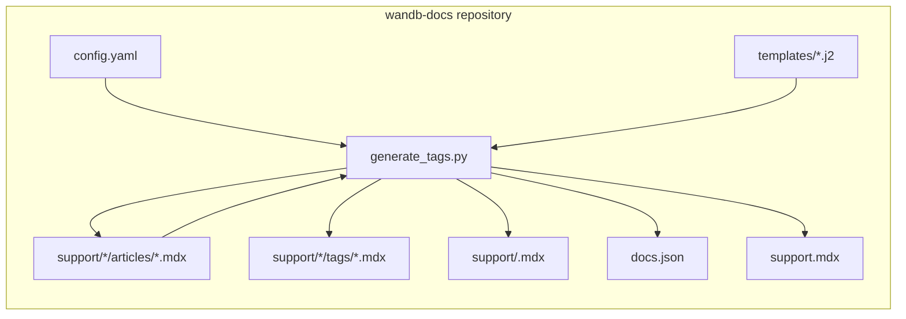
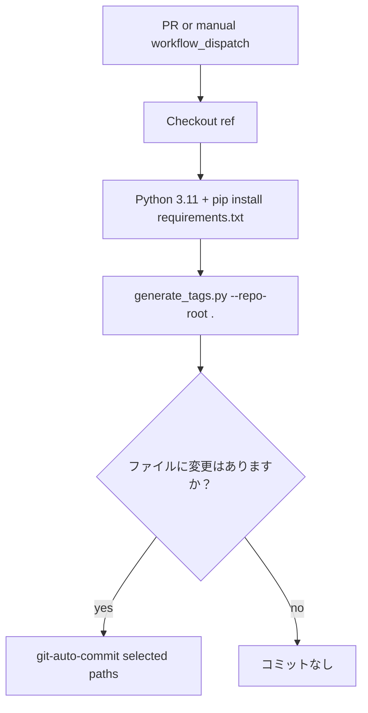
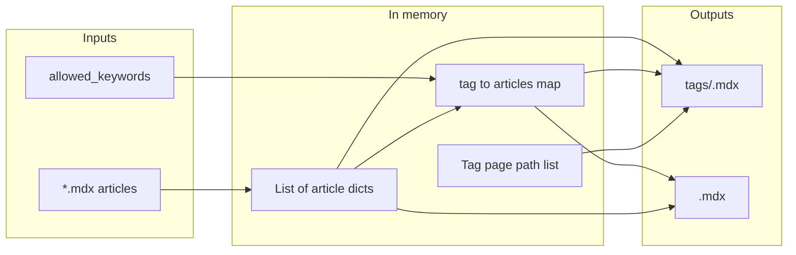

  # Knowledgebase Nav ジェネレーターのアーキテクチャ

このドキュメントでは、`wandb-docs` リポジトリ内の **Knowledgebase Nav** システムについて説明します。何を生成するのか、どのファイルと関数によって動作しているのか、そしてオートメーションによってそれらがどのように連携しているのかを扱います。作成者向けのstepとローカルでの設定については、[README.md](./README.md) を参照してください。

  ## 目的

このジェネレーターは、サポート (ナレッジベース) のナビゲーションをアティクルの内容と一貫した状態に保ちます。これは、設定されたプロダクト (たとえば Models、Weave、Inference) を対象に実行され、`support/<product>/articles/` 配下のMDXアティクルを読み取り、生成されたMDXページ、ルートの `support.mdx` の件数、および `docs.json` 内の英語のサポートタブを更新します。

  ## 全体像

このシステムは完全に `wandb-docs` 内で動作します。外部 API は呼び出しません。リポジトリのワーキングツリーにあるファイルを読み書きします。

**アティクル** に戻る矢印は、フェーズ 4 では MDX コメントマーカーに囲まれた `/support/<product>/tags/` 配下のタグページを指す `<Badge>` リンクのみが更新されることを示します。その他のコンテンツ (`---`、他の Badge、マーカー外のテキストを含む) は書き換えられません。

  ## オートメーション ワークフロー

`support/**` または `scripts/knowledgebase-nav/**` 配下のファイルが変更されると (オープン中の PR への新しい push を含みます) 、プルリクエストによって **Knowledgebase Nav** workflow がトリガーされます。これは Python の dependencies をインストールし、ジェネレーターを実行し、差分がある場合は一致するパスをコミットします。**フォーク** からのプルリクエストでは、フォーク先の先頭コミットをチェックアウトしてジェネレーターは引き続き実行されますが、デフォルトの token ではフォークへ push できないため、自動コミットの step はスキップされます。

コミット対象のパス パターンには、`support.mdx`、`support/*/articles/*.mdx`、`support/*/tags/*.mdx`、`support/*.mdx` (プロダクトのインデックス) 、および `docs.json` が含まれます。

  ## パイプライン オーケストレーション

`run_pipeline(repo_root, config_path)` は、CLI と tests で使用される唯一のエントリポイントです。`config.yaml` を読み込み、すべてのプロダクトに共通の 1 つの Jinja2 環境を構築してから、各プロダクトを順に処理します。ループの完了後に、`docs.json` を 1 回だけ更新し、`support.mdx` も 1 回だけ更新します。

  ## プロダクトごとのデータフロー

1 つのプロダクト内では、データは生のファイルからインメモリの構造へ移動し、その後、後続の step で使用するために MDX と集約された構造へ戻されます。

`render_tag_pages` は、ソート済みのページ ID 文字列 (例: `support/models/tags/security`) を返します。`update_docs_json` は、これをそのプロダクトの英語版ナビゲーションタブにマージします。

  ## 컴포넌트とファイル

| 컴포넌트               | パス                                        | 役割                                                |
| ------------------ | ----------------------------------------- | ------------------------------------------------- |
| CLI とロジック          | `generate_tags.py`                        | すべてのフェーズ、パース、slug ルール、プレビュー、JSON と MDX の書き換え      |
| プロダクトとタグの Registry | `config.yaml`                             | プロダクトごとの `slug`、`display_name`、`allowed_keywords` |
| タグ一覧テンプレート         | `templates/support_tag.mdx.j2`            | タグページでアティクルごとに 1 つの Card                             |
| プロダクトハブテンプレート      | `templates/support_product_index.mdx.j2`  | 注目のセクションとカテゴリ別に閲覧するための Card                       |
| 依存関係               | `requirements.txt`                        | PyYAML、Jinja2                                     |
| 単体テスト              | `tests/test_generate_tags.py`             | モック化されたファイルシステムと `docs.json`                      |
| インテグレーションテスト       | `tests/test_golden_output.py`             | 実際のリポジトリの一時コピーに対する完全なパイプライン                       |
| Pytest マーカー        | `tests/conftest.py`                       | golden スイート用の `integration` マーカーを登録               |
| CI                 | `.github/workflows/knowledgebase-nav.yml` | トリガー、run スクリプト、自動コミット                             |
| 作成者向けドキュメント        | `README.md`                               | ライターと開発者向けの workflow                              |
| アーキテクチャメモ          | `Architecture.md`                         | 開発者向けの図とモジュールマップ                                  |

  ## `generate_tags.py` 内の機能領域

以下では、関数をソースファイル内での出現順にグループ化しています。各名は Python API でのものです。

  ### 設定

* **`load_config`** は `config.yaml` を読み込み、各プロダクトで必須のキーが含まれているかを検証します。

  ### アティクルの構造とフッター

* **`parse_frontmatter`**、**`_extract_body`** は YAML フロントマター と本文を分割します。`_extract_body` は境界として `_BADGE_START` を使用し、末尾の `---` 行を体裁を整えるために削除します。
* **`_split_frontmatter_raw`** は、フッターの書き換えのために、生の MDX を フロントマター ブロックと残りの部分に分割します。
* **`_normalize_keywords`** は、フロントマター の `keywords` を文字列の list に正規化します (YAML の list。単一の文字列は警告付きで 1 つのタグになり、それ以外のタイプは警告を出したうえで空の list になります) 。
* **`_keywords_list_for_footer`** は、フッター生成用の正規化済み `keywords` を返します (**`_normalize_keywords`** に委譲します) 。
* **`_tab_badge_pattern`**、**`build_tab_badges_mdx`**、**`build_keyword_footer_mdx`**、**`_replace_tab_badges_in_body`** は、tab Badge のピンポイントな Sync を実装します。管理対象の Badge は `_BADGE_START` / `_BADGE_END` のマーカーコメントで囲まれます。マーカーがある場合、関数はそれを基準にマッチし、マーカー導入前のアティクルでは regex にフォールバックします。新しいフッターには、空行、マーカー、Badge が追加されます。
* **`sync_support_article_footer`**、**`sync_all_support_article_footers`** は、tab Badge が `keywords` とずれて古くなっている場合にアティクルファイルを書き込みます。

  ### 本文プレビュー (Card スニペット)

* **`plain_text`** は、Markdown (水平線を含む) 、リンク、URL、HTML または MDX タグなどを削除して、プレビューがプレーンテキストのままになるようにします (HTML エンティティをデコードした後、U+00A0 はスペースに変換され、約物の引用符は ASCII にマップされ、許可リストでは識別子用に `_` と `=` を保持します) 。
* **`extract_body_preview`** は `plain_text` を適用し、`BODY_PREVIEW_MAX_LENGTH` で切り詰め、必要に応じて `BODY_PREVIEW_SUFFIX` を追加します。

  ### スラッグとクローリング

* **`tag_slug`** は表示キーワードをファイル名または URL セグメント (小文字、ハイフン区切り) にマッピングします。
* **`crawl_articles`** は `support/<slug>/articles/*.mdx` をクロールして、アティクルの dict (`title`、`keywords`、`featured`、`body_preview`、`page_path`、`tag_links` など) を構築します。

  ### タグの集約と注目コンテンツ

* **`get_featured_articles`** は、プロダクトインデックス用の注目のアティクルをフィルターして並べ替えます。
* **`build_tag_index`** は、アティクルをキーワードごとにグループ化し、各タグ内でタイトル順に並べ替え、`allowed_keywords` に含まれない未知のキーワードがあれば警告します。

  ### レンダリング

* **`tojson_unicode`**、**`create_template_env`** は、MDX 用に Jinja2 を設定します (テンプレートでは、YAML フロントマターの値に `tojson_unicode` フィルターを使用します) 。
* **`render_tag_pages`** は `support/<product>/tags/<tag-slug>.mdx` に書き出します。
* **`cleanup_stale_tag_pages`** は、`tags` ディレクトリ内で今回生成されなかった `.mdx` ファイルを削除し、ディレクトリと `docs.json` に古いエントリーが残らないようにします。
* **`render_product_index`** は `support/<product>.mdx` に書き出します。

  ### サイト全体の更新

* **`update_docs_json`** は、`language` が `en` の `navigation.languages` 配下で、非表示の `Support: <display_name>` タブを更新または作成し、`pages` をプロダクトのインデックスとソート済みのタグパスに設定します。
* **`update_support_index`** は、ルートの `support.mdx` にあるプロダクトのCard上の件数行を更新します。`{/* auto-generated counts */}` マーカーを優先し、移行時には `regex` にフォールバックします。
* **`update_support_featured`** は、ルートの `support.mdx` で `_FEATURED_START` / `_FEATURED_END` マーカー間の注目アティクルセクションを再生成します。

  ### CLI

* **`main`** は `--repo-root` と省略可能な `--config` を解析し、続いて **`run_pipeline`** を呼び出します。

  ## 定数

* **`BODY_PREVIEW_MAX_LENGTH`** と **`BODY_PREVIEW_SUFFIX`** は、Card プレビューの長さと省略記号を制御します。
* **`DOCS_JSON_NAV_LANGUAGE`** は `"en"` で、ナビゲーションの編集対象を英語のツリーのみに限定します。
* **`_BADGE_START`** / **`_BADGE_END`** は、各アティクルページで管理対象のタブの Badge を囲む MDX コメントマーカーです。
* **`_FEATURED_START`** / **`_FEATURED_END`** は、ルートの `support.mdx` 内にある注目記事セクションを囲む MDX コメントマーカーです。

  ## 設計上の選択

* **モノリシックスクリプト**: 1 つのファイルにすべてのロジックを集約することで、ワークフローとコントリビューターが動作を確認・変更する場所を 1 か所にまとめています。
* **許可されたキーワード**: `config.yaml` には、プロダクトごとの有効なタグを列挙します。不明なタグでもページは生成されますが、警告が出力されるため、コンテンツが気付かないうちに失われることはありません。
* **Tab Badge の管理範囲**: `/support/<product>/tags/...` にリンクする `<Badge>` 要素のみが `keywords` から生成されます。これらはマーカーコメントで囲まれているため、移行後はジェネレーターで regex マッチングを行う必要がありません。本文と Badge の間にある `---` 行は見た目のためだけのものです。`_extract_body` は `_BADGE_START` を境界として使用し、末尾の `---` はクリーンアップとしてのみ削除します。
* **古いタグのクリーンアップ**: どのアティクルキーワードにも対応しなくなったタグページは、生成後、`docs.json` を更新する前に削除されます。これにより、tags ディレクトリやナビゲーションに孤立したエントリが残りません。
* **マーカーベースの編集**: 自動生成されるすべてのセクション (アティクルタブの Badge、`support.mdx` の件数行、注目の記事) では、MDX コメントマーカーを使用します。これにより、管理対象の領域がライターにも明確になり、壊れやすい regex アンカーに頼らずにジェネレーターが内容を正確に置き換えられます。各マーカーペアには、初回実行時にプレーンなコンテンツを囲む移行パスがあります。
* **Golden tests**: 生成されたタグページ、プロダクトインデックスページ、アティクルファイル (フッターマーカーを含む) 、`docs.json` 内のサポートタブ、およびルートの `support.mdx` をコミット済みのツリーと比較し、出力のずれが unified diff として見えるようにします。

  ## 関連資料

* 使用方法、ローカル venv の設定、トラブルシューティングについては [README.md](./README.md) を参照してください。
* Mintlify コンテンツを編集する際のドキュメントスタイルについては、リポジトリルートにある [AGENTS.md](../../AGENTS.md) を参照してください。