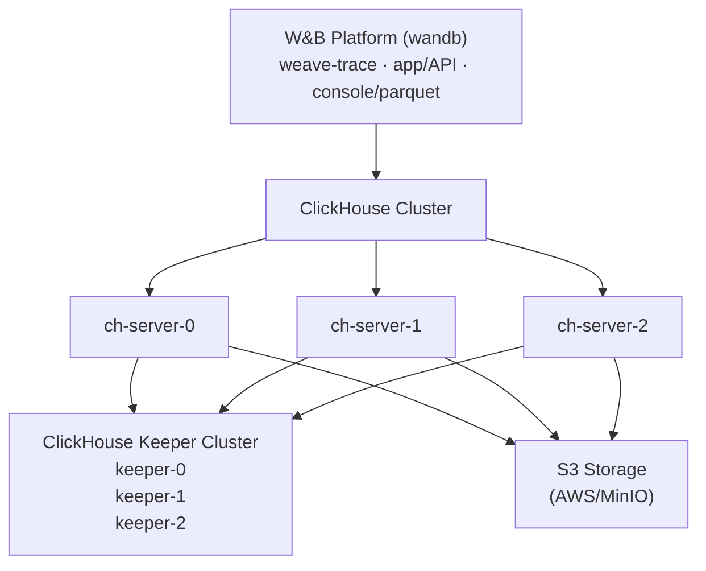

W&B Weave をセルフホスティングすることで、環境と設定をより細かく制御できるようになります。これにより、より分離された環境を構築し、追加のセキュリティコンプライアンス要件を満たすことが可能になります。このドキュメントでは、Altinity ClickHouse Operator を使用して、自己管理型（セルフマネージド）環境で W&B Weave を実行するために必要なすべてのコンポーネントをデプロイする方法をガイドします。

自己管理型の Weave デプロイメントは、バックエンドの管理に [ClickHouseDB](https://clickhouse.com/) を利用します。このデプロイメントでは以下を使用します：

- **Altinity ClickHouse Operator**: Kubernetes 向けのエンタープライズグレードの ClickHouse 管理ツール
- **ClickHouse Keeper**: 分散コーディネーションサービス (ZooKeeper の代替)
- **ClickHouse Cluster**: トレースストレージ用の高可用性データベースクラスター
- **S3 互換ストレージ**: ClickHouse データの永続化用オブジェクトストレージ

<Tip>
詳細なリファレンスアーキテクチャーについては、 [W&B Self-Managed Reference Architecture](https://docs.wandb.ai/guides/hosting/self-managed/ref-arch/#models-and-weave) を参照してください。
</Tip>

## セットアップに関する重要な注意点

このガイドの設定例は参照用です。組織の Kubernetes 環境はそれぞれ異なるため、セルフホストインスタンスでは以下の調整が必要になる可能性が高いです：

- **セキュリティとコンプライアンス**: 組織のセキュリティポリシーや Kubernetes/OpenShift の要件に従って、セキュリティコンテキスト、 `runAsUser`/`fsGroup` の値、その他のセキュリティ設定を調整してください。
- **リソースのサイジング**: 記載されているリソース割り当ては開始点です。予想されるトレース量とパフォーマンス要件に基づく適切なサイジングについては、 **W&B のソリューションアーキテクトチームにご相談ください** 。
- **インフラストラクチャーの詳細**: 環境に合わせて、ストレージクラス、ノードセレクター、その他のインフラ固有の設定を更新してください。

このガイドの設定は、規定の解決策ではなく、テンプレートとして扱う必要があります。

## アーキテクチャー



## 前提条件

自己管理型 Weave インスタンスには、以下のリソースが必要です：

- **Kubernetes クラスター**: バージョン 1.29 以上
- **Kubernetes ノード**: マルチノードクラスター（高可用性のために最低 3 ノードを推奨）
- **ストレージクラス**: 永続ボリューム用の動作可能な StorageClass（例： `gp3`, `standard`, `nfs-csi`）
- **S3 バケット**: 適切なアクセス権限が設定された、構成済みの S3 または S3 互換バケット
- **W&B プラットフォーム**: すでにインストールされ実行されていること（ [W&B Self-Managed Deployment Guide](https://docs.wandb.ai/guides/hosting/hosting-options/self-managed/) を参照）
- **W&B ライセンス**: W&B サポートから提供された Weave 有効化済みのライセンス

<Warning>
この前提条件リストだけでサイジングを決定しないでください。リソースの必要量は、トレース量や使用パターンによって大きく異なります。具体的なクラスターサイジングのガイダンスについては、詳細な [リソース要件](#resource-requirements) セクションを参照してください。
</Warning>

### 必要なツール

インスタンスをセットアップするには、以下のツールが必要です：

- クラスターへのアクセス権が設定された `kubectl`
- `helm` v3.0 以上
- AWS クレデンシャル（S3 を使用する場合）または S3 互換ストレージへのアクセス権

### ネットワーク要件

Kubernetes クラスターには以下のネットワーク設定が必要です：

- `clickhouse` ネームスペース内の Pod が `wandb` ネームスペース内の Pod と通信できること
- ClickHouse ノードがポート 8123, 9000, 9009, 2181 で相互に通信できること

## 自己管理型 Weave インスタンスのデプロイ

### ステップ 1: Altinity ClickHouse Operator のデプロイ

Altinity ClickHouse Operator は、Kubernetes での ClickHouse のインストールを管理します。

#### 1.1 Altinity Helm リポジトリの追加

```bash
helm repo add altinity https://helm.altinity.com
helm repo update
```

#### 1.2 オペレーター設定の作成

`ch-operator.yaml` という名前のファイルを作成します：

```yaml
operator:
  image:
    repository: altinity/clickhouse-operator
    tag: "0.25.4"

  # セキュリティコンテキスト - クラスターの要件に合わせて調整してください
  containerSecurityContext:
    runAsGroup: 0
    runAsNonRoot: true
    runAsUser: 10001 # OpenShift/Kubernetes のセキュリティポリシーに基づいて更新してください
    allowPrivilegeEscalation: false
    capabilities:
      drop:
        - ALL
    privileged: false
    readOnlyRootFilesystem: false

metrics:
  enabled: false

# 名前のオーバーライド - 必要に応じてカスタマイズ
nameOverride: "wandb"
```

ここに示されている `containerSecurityContext` の値は、ほとんどの Kubernetes ディストリビューションで動作します。 **OpenShift** の場合は、プロジェクトに割り当てられた UID 範囲に合わせて `runAsUser` と `fsGroup` を調整する必要がある場合があります。

#### 1.3 オペレーターのインストール

```bash
helm upgrade --install ch-operator altinity/altinity-clickhouse-operator \
  --version 0.25.4 \
  --namespace clickhouse \
  --create-namespace \
  -f ch-operator.yaml
```

#### 1.4 オペレーターインストールの確認

```bash
# オペレーター Pod が実行中であることを確認
kubectl get pods -n clickhouse

# 期待される出力:
# NAME                                 READY   STATUS    RESTARTS   AGE
# ch-operator-wandb-xxxxx              1/1     Running   0          30s

# オペレーターのイメージバージョンを確認
kubectl get pods -n clickhouse -o jsonpath="{.items[*].spec.containers[*].image}" | \
  tr ' ' '\n' | grep -v 'metrics-exporter' | sort -u

# 期待される出力:
# altinity/clickhouse-operator:0.25.4
```

### ステップ 2: S3 ストレージの準備

ClickHouse はデータの永続化のために S3 または S3 互換ストレージを必要とします。

#### 2.1 S3 バケットの作成

AWS アカウントまたは S3 互換ストレージプロバイダーで S3 バケットを作成します：

```bash
# AWS の例
aws s3 mb s3://my-wandb-clickhouse-bucket --region eu-central-1
```

#### 2.2 S3 クレデンシャルの設定

S3 アクセス用のクレデンシャルを提供するには、2 つのオプションがあります：

##### オプション A: AWS IAM ロールの使用 (IRSA - AWS 推奨)

Kubernetes ノードに S3 アクセス権を持つ IAM ロールが付与されている場合、ClickHouse は EC2 インスタンスのメタデータを使用できます：

```yaml
# ch-server.yaml で以下を設定:
<use_environment_credentials>true</use_environment_credentials>
```

**必要な IAM ポリシー** (ノードの IAM ロールにアタッチ):

```json
{
  "Version": "2012-10-17",
  "Statement": [
    {
      "Effect": "Allow",
      "Action": [
        "s3:GetObject",
        "s3:PutObject",
        "s3:DeleteObject",
        "s3:ListBucket"
      ],
      "Resource": [
        "arn:aws:s3:::my-wandb-clickhouse-bucket",
        "arn:aws:s3:::my-wandb-clickhouse-bucket/*"
      ]
    }
  ]
}
```

##### オプション B: アクセスキーの使用

静的なクレデンシャルを使用する場合は、Kubernetes secret を作成します：

```bash
kubectl create secret generic aws-creds \
  --namespace clickhouse \
  --from-literal aws_access_key=YOUR_ACCESS_KEY \
  --from-literal aws_secret_key=YOUR_SECRET_KEY
```

その後、この secret を使用するように ClickHouse を設定します（後述の ch-server.yaml 設定を参照）。

### ステップ 3: ClickHouse Keeper のデプロイ

[ClickHouse Keeper](https://clickhouse.com/docs/guides/sre/keeper/clickhouse-keeper) は、データレプリケーションと分散 DDL クエリ実行のためのコーディネーションシステムを提供します。

#### 3.1 Keeper 設定の作成

`ch-keeper.yaml` という名前のファイルを作成します：

```yaml
apiVersion: "clickhouse-keeper.altinity.com/v1"
kind: "ClickHouseKeeperInstallation"
metadata:
  name: wandb
  namespace: clickhouse
  annotations: {}
spec:
  defaults:
    templates:
      podTemplate: default
      dataVolumeClaimTemplate: default

  templates:
    podTemplates:
      - name: keeper
        metadata:
          labels:
            app: clickhouse-keeper
        spec:
          # Pod セキュリティコンテキスト - 環境に合わせて調整してください
          securityContext:
            fsGroup: 10001 # クラスターのセキュリティ要件に基づいて更新してください
            fsGroupChangePolicy: Always
            runAsGroup: 0
            runAsNonRoot: true
            runAsUser: 10001 # OpenShift の場合は、プロジェクトに割り当てられた UID 範囲を使用してください
            seccompProfile:
              type: RuntimeDefault

          # Keeper をノード間に分散させるためのアンチアフィニティ（高可用性のために推奨）
          # クラスターのサイズと可用性要件に基づいてカスタマイズまたは削除してください
          affinity:
            podAntiAffinity:
              requiredDuringSchedulingIgnoredDuringExecution:
                - labelSelector:
                    matchExpressions:
                      - key: "app"
                        operator: In
                        values:
                          - clickhouse-keeper
                  topologyKey: "kubernetes.io/hostname"

          containers:
            - name: clickhouse-keeper
              imagePullPolicy: IfNotPresent
              image: "clickhouse/clickhouse-keeper:25.3.5.42"
              # リソースリクエスト - 例示的な値。ワークロードに基づいて調整してください
              resources:
                requests:
                  memory: "256Mi"
                  cpu: "0.5"
                limits:
                  memory: "2Gi"
                  cpu: "1"

              securityContext:
                allowPrivilegeEscalation: false
                capabilities:
                  drop:
                    - ALL
                privileged: false
                readOnlyRootFilesystem: false

    volumeClaimTemplates:
      - name: data
        metadata:
          labels:
            app: clickhouse-keeper
        spec:
          storageClassName: gp3 # 使用する StorageClass に変更してください
          accessModes:
            - ReadWriteOnce
          resources:
            requests:
              storage: 10Gi

  configuration:
    clusters:
      - name: keeper # Keeper クラスター名 - サービス DNS 名に使用されます
        layout:
          replicasCount: 3
        templates:
          podTemplate: keeper
          dataVolumeClaimTemplate: data

    settings:
      logger/level: "information"
      logger/console: "true"
      listen_host: "0.0.0.0"
      keeper_server/four_letter_word_white_list: "*"
      keeper_server/coordination_settings/raft_logs_level: "information"
      keeper_server/enable_ipv6: "false"
      keeper_server/coordination_settings/async_replication: "true"
```

**重要な設定の更新**:

- **StorageClass**: クラスターで使用可能な StorageClass に合わせて `storageClassName: gp3` を更新してください。
- **セキュリティコンテキスト**: 組織のセキュリティポリシーに準拠するように `runAsUser`, `fsGroup` の値を調整してください。
- **アンチアフィニティ**: クラスターのトポロジーと高可用性要件に基づいて `affinity` セクションをカスタマイズまたは削除してください。
- **リソース**: CPU/メモリの値は例です。適切なサイジングについては W&B ソリューションアーキテクトにご相談ください。
- **ネーミング**: `metadata.name` または `configuration.clusters[0].name` を変更した場合は、ch-server.yaml (ステップ 4) の Keeper ホスト名を一致するように **必ず更新** する必要があります。

#### 3.2 ClickHouse Keeper のデプロイ

```bash
kubectl apply -f ch-keeper.yaml
```

#### 3.3 Keeper デプロイの確認

```bash
# Keeper Pod の確認
kubectl get pods -n clickhouse -l app=clickhouse-keeper

# 期待される出力:
# NAME                     READY   STATUS    RESTARTS   AGE
# chk-wandb-keeper-0-0-0   1/1     Running   0          2m
# chk-wandb-keeper-0-1-0   1/1     Running   0          2m
# chk-wandb-keeper-0-2-0   1/1     Running   0          2m

# Keeper サービスの確認
kubectl get svc -n clickhouse | grep keeper

# ポート 2181 で keeper サービスが表示されることを確認
```

### ステップ 4: ClickHouse クラスターのデプロイ

Weave のトレースデータを保存する ClickHouse サーバークラスターをデプロイします。

#### 4.1 ClickHouse サーバー設定の作成

`ch-server.yaml` という名前のファイルを作成します：

```yaml
apiVersion: "clickhouse.altinity.com/v1"
kind: "ClickHouseInstallation"
metadata:
  name: wandb
  namespace: clickhouse
  annotations: {}
spec:
  defaults:
    templates:
      podTemplate: default
      dataVolumeClaimTemplate: default

  templates:
    podTemplates:
      - name: clickhouse
        metadata:
          labels:
            app: clickhouse-server
        spec:
          # Pod セキュリティコンテキスト - 環境に合わせてカスタマイズしてください
          securityContext:
            fsGroup: 10001 # セキュリティポリシーに基づいて調整してください
            fsGroupChangePolicy: Always
            runAsGroup: 0
            runAsNonRoot: true
            runAsUser: 10001 # OpenShift の場合は割り当てられた UID 範囲を使用
            seccompProfile:
              type: RuntimeDefault

          # アンチアフィニティルール - サーバーが異なるノードで実行されるようにします（オプションですが推奨）
          # クラスターのサイズと要件に基づいて調整または削除してください
          affinity:
            podAntiAffinity:
              requiredDuringSchedulingIgnoredDuringExecution:
                - labelSelector:
                    matchExpressions:
                      - key: "app"
                        operator: In
                        values:
                          - clickhouse-server
                  topologyKey: "kubernetes.io/hostname"

          containers:
            - name: clickhouse
              image: clickhouse/clickhouse-server:25.3.5.42
              # 例示的なリソース割り当て - ワークロードに基づいて調整してください
              resources:
                requests:
                  memory: 1Gi
                  cpu: 1
                limits:
                  memory: 16Gi
                  cpu: 4

              # AWS クレデンシャル（IRSA を使用する場合はこのセクションを削除してください）
              env:
                - name: AWS_ACCESS_KEY_ID
                  valueFrom:
                    secretKeyRef:
                      name: aws-creds
                      key: aws_access_key
                - name: AWS_SECRET_ACCESS_KEY
                  valueFrom:
                    secretKeyRef:
                      name: aws-creds
                      key: aws_secret_key

              securityContext:
                allowPrivilegeEscalation: false
                capabilities:
                  drop:
                    - ALL
                privileged: false
                readOnlyRootFilesystem: false

    volumeClaimTemplates:
      - name: data
        metadata:
          labels:
            app: clickhouse-server
        spec:
          accessModes:
            - ReadWriteOnce
          resources:
            requests:
              storage: 50Gi
          storageClassName: gp3 # 使用する StorageClass に変更

  configuration:
    # Keeper (ZooKeeper) 設定
    # 重要: これらのホスト名はステップ 3 の Keeper デプロイと一致している必要があります
    zookeeper:
      nodes:
        - host: chk-wandb-keeper-0-0.clickhouse.svc.cluster.local
          port: 2181
        - host: chk-wandb-keeper-0-1.clickhouse.svc.cluster.local
          port: 2181
        - host: chk-wandb-keeper-0-2.clickhouse.svc.cluster.local
          port: 2181
      # オプション: 必要に応じてタイムアウトを調整するためにコメント解除
      # session_timeout_ms: 30000
      # operation_timeout_ms: 10000

    # ユーザー設定: https://clickhouse.com/docs/operations/configuration-files#user-settings
    # パスワード作成のヒント:
    # sha256sum <<< weave123 または echo -n weave123 | sha256sum または printf "weave123" | sha256sum
    # ユーザー設定で <password_sha256_hex>...</password_sha256_hex> として返されます
    users:
      weave/password: weave123
      weave/access_management: 1
      weave/profile: default
      weave/networks/ip:
        - "0.0.0.0/0"
        - "::"

    # サーバー設定
    settings:
      disable_internal_dns_cache: 1

    # クラスター設定
    clusters:
      - name: weavecluster # クラスター名 - カスタマイズ可能ですが wandb-cr.yaml と一致させる必要があります
        layout:
          shardsCount: 1
          replicasCount: 3 # レプリカ数 - 高可用性要件に基づいて調整
        templates:
          podTemplate: clickhouse
          dataVolumeClaimTemplate: data

    # 設定ファイル
    files:
      config.d/network_configuration.xml: |
        <clickhouse>
            <listen_host>0.0.0.0</listen_host>
            <listen_host>::</listen_host>
        </clickhouse>

      config.d/logger.xml: |
        <clickhouse>
            <logger>
                <level>information</level>
            </logger>
        </clickhouse>

      config.d/storage_configuration.xml: |
        <clickhouse>
            <storage_configuration>
                <disks>
                    <s3_disk>
                        <type>s3</type>
                        
                        <endpoint>https://YOUR-BUCKET-NAME.s3.YOUR-REGION.amazonaws.com/s3_disk/{replica}</endpoint>
                        <metadata_path>/var/lib/clickhouse/disks/s3_disk/</metadata_path>
                        <use_environment_credentials>true</use_environment_credentials>
                        <region>YOUR-REGION</region>
                    </s3_disk>
                    <s3_disk_cache>
                        <type>cache</type>
                        <disk>s3_disk</disk>
                        <path>/var/lib/clickhouse/s3_disk_cache/cache/</path>
                        
                        <max_size>40Gi</max_size>
                        <cache_on_write_operations>true</cache_on_write_operations>
                    </s3_disk_cache>
                </disks>
                <policies>
                    <s3_main>
                        <volumes>
                            <main>
                                <disk>s3_disk_cache</disk>
                            </main>
                        </volumes>
                    </s3_main>
                </policies>
            </storage_configuration>
            <merge_tree>
                <storage_policy>s3_main</storage_policy>
            </merge_tree>
        </clickhouse>
```

**必要な重要な設定更新**:

1. **StorageClass**: クラスターの StorageClass に合わせて `storageClassName: gp3` を更新してください。
2. **S3 Endpoint**: `YOUR-BUCKET-NAME` と `YOUR-REGION` を実際の値に置き換えてください。
3. **Cache Size**: `<max_size>40Gi</max_size>` は、永続ボリュームのサイズ (50Gi) よりも **小さく** なければなりません。
4. **セキュリティコンテキスト**: 組織のポリシーに合わせて `runAsUser`, `fsGroup` およびその他のセキュリティ設定を調整してください。
5. **リソース割り当て**: CPU/メモリの値はあくまで例です。予想されるトレース量に基づく適切なサイジングについては、 **W&B ソリューションアーキテクトにご相談ください** 。
6. **アンチアフィニティルール**: クラスターのトポロジーと高可用性のニーズに基づいてカスタマイズまたは削除してください。
7. **Keeper Hostnames**: Keeper ノードのホスト名は、ステップ 3 の Keeper デプロイ時の名前に **必ず一致** させる必要があります（下記の「Keeper の命名規則について」を参照）。
8. **Cluster Naming**: クラスター名 `weavecluster` は変更可能ですが、ステップ 5 の `WF_CLICKHOUSE_REPLICATED_CLUSTER` の値と一致させる必要があります。
9. **Credentials**:
   - IRSA の場合: `<use_environment_credentials>true</use_environment_credentials>` を保持するか、環境変数にマップされた secret キーにアクセスしてください。

#### 4.2 S3 設定の更新

`ch-server.yaml` の `storage_configuration.xml` セクションを編集します：

**AWS S3 の例**:

```xml
<endpoint>https://my-wandb-clickhouse.s3.eu-central-1.amazonaws.com/s3_disk/{replica}</endpoint>
<region>eu-central-1</region>
```

**MinIO の例**:

```xml
<endpoint>https://minio.example.com:9000/my-bucket/s3_disk/{replica}</endpoint>
<region>us-east-1</region>
```

<Warning>
**`{replica}` を削除しないでください。** これにより、各 ClickHouse レプリカがバケット内の独自のフォルダに書き込むようになります。
</Warning>

#### 4.3 クレデンシャルの設定 (オプション B のみ)

ステップ 2 の **オプション B (アクセスキー)** を使用する場合は、`ch-server.yaml` の `env` セクションが secret を参照していることを確認してください：

```yaml
env:
  - name: AWS_ACCESS_KEY_ID
    valueFrom:
      secretKeyRef:
        name: aws-creds
        key: aws_access_key
  - name: AWS_SECRET_ACCESS_KEY
    valueFrom:
      secretKeyRef:
        name: aws-creds
        key: aws_secret_key
```

**オプション A (IRSA)** を使用する場合は、 `env` セクション全体を削除してください。

#### 4.4 Keeper の命名規則について

`zookeeper.nodes` セクションの Keeper ノードホスト名は、ステップ 3 の Keeper デプロイに基づく特定のパターンに従います：

**ホスト名パターン**: `chk-{インストール名}-{クラスター名}-{クラスターインデックス}-{レプリカインデックス}.{ネームスペース}.svc.cluster.local`

各要素の説明：

- `chk` = ClickHouseKeeperInstallation プレフィックス (固定)
- `{インストール名}` = ch-keeper.yaml の `metadata.name` (例: `wandb`)
- `{クラスター名}` = ch-keeper.yaml の `configuration.clusters[0].name` (例: `keeper`)
- `{クラスターインデックス}` = クラスターインデックス。単一クラスターの場合は通常 `0`
- `{レプリカインデックス}` = レプリカ番号。3 レプリカの場合は `0`, `1`, `2`
- `{ネームスペース}` = Kubernetes ネームスペース (例: `clickhouse`)

**デフォルト名の例**:

```
chk-wandb-keeper-0-0.clickhouse.svc.cluster.local
chk-wandb-keeper-0-1.clickhouse.svc.cluster.local
chk-wandb-keeper-0-2.clickhouse.svc.cluster.local
```

**Keeper のインストール名をカスタマイズした場合** (例: `metadata.name: myweave`):

```
chk-myweave-keeper-0-0.clickhouse.svc.cluster.local
chk-myweave-keeper-0-1.clickhouse.svc.cluster.local
chk-myweave-keeper-0-2.clickhouse.svc.cluster.local
```

**Keeper のクラスター名をカスタマイズした場合** (例: `clusters[0].name: coordination`):

```
chk-wandb-coordination-0-0.clickhouse.svc.cluster.local
chk-wandb-coordination-0-1.clickhouse.svc.cluster.local
chk-wandb-coordination-0-2.clickhouse.svc.cluster.local
```

**実際の Keeper ホスト名を確認するには**:

```bash
# 実際の名前を確認するために Keeper サービスをリスト
kubectl get svc -n clickhouse | grep keeper

# 命名パターンを確認するために Keeper Pod をリスト
kubectl get pods -n clickhouse -l app=clickhouse-keeper
```

<Note>
`ch-server.yaml` 内の Keeper ホスト名は、Keeper デプロイによって作成された実際のサービス名と **完全に一致** している必要があります。一致しない場合、ClickHouse サーバーはコーディネーションサービスに接続できません。
</Note>

#### 4.5 ClickHouse クラスターのデプロイ

```bash
kubectl apply -f ch-server.yaml
```

#### 4.6 ClickHouse デプロイの確認

```bash
# ClickHouse Pod の確認
kubectl get pods -n clickhouse -l app=clickhouse-server

# 期待される出力:
# NAME                           READY   STATUS    RESTARTS   AGE
# chi-wandb-weavecluster-0-0-0   1/1     Running   0          3m
# chi-wandb-weavecluster-0-1-0   1/1     Running   0          3m
# chi-wandb-weavecluster-0-2-0   1/1     Running   0          3m

# ClickHouse 接続テスト
kubectl exec -n clickhouse chi-wandb-weavecluster-0-0-0 -- \
  clickhouse-client --user weave --password weave123 --query "SELECT version()"

# クラスターステータスの確認
kubectl exec -n clickhouse chi-wandb-weavecluster-0-0-0 -- \
  clickhouse-client --user weave --password weave123 --query \
  "SELECT cluster, host_name, port FROM system.clusters WHERE cluster='weavecluster'"
```

### ステップ 5: W&B プラットフォームで Weave を有効化

次に、Weave トレースに ClickHouse クラスターを使用するように W&B プラットフォームを設定します。

#### 5.1 ClickHouse 接続情報の収集

以下の情報が必要です：

- **Host**: `clickhouse-wandb.clickhouse.svc.cluster.local`
- **Port**: `8123`
- **User**: `weave` (ch-server.yaml で設定したもの)
- **Password**: `weave123` (ch-server.yaml で設定したもの)
- **Database**: `weave` (自動的に作成されます)
- **Cluster Name**: `weavecluster` (ch-server.yaml で設定したもの)

ホスト名は次のパターンに従います： `clickhouse-{インストール名}.{ネームスペース}.svc.cluster.local`

#### 5.2 W&B カスタムリソースの更新

W&B プラットフォームのカスタムリソース (CR) を編集して Weave の設定を追加します：

```yaml
apiVersion: apps.wandb.com/v1
kind: WeightsAndBiases
metadata:
  name: wandb
  namespace: wandb
spec:
  values:
    global:
      # ... 既存の設定 ...

      # ClickHouse 設定の追加
      clickhouse:
        install: false # 別途デプロイしたため
        host: clickhouse-wandb.clickhouse.svc.cluster.local
        port: 8123
        user: weave
        password: weave123
        database: weave
        replicated: true # マルチレプリカ構成の場合は必須

      # Weave トレースを有効化
      weave-trace:
        enabled: true

    # Weave トレースの設定
    weave-trace:
      install: true
      extraEnv:
        WF_CLICKHOUSE_REPLICATED: "true"
        WF_CLICKHOUSE_REPLICATED_CLUSTER: "weavecluster"
      image:
        repository: wandb/weave-trace
        tag: 0.74.1
      replicaCount: 1
      size: "default"
      sizing:
        default:
          autoscaling:
            horizontal:
              enabled: false
          # 例示的なリソース割り当て - ワークロードに基づいて調整してください
          resources:
            limits:
              cpu: 4
              memory: "8Gi"
            requests:
              cpu: 1
              memory: "4Gi"
      # Pod セキュリティコンテキスト - 環境に合わせてカスタマイズしてください
      podSecurityContext:
        fsGroup: 10001 # セキュリティ要件に基づいて調整してください
        fsGroupChangePolicy: Always
        runAsGroup: 0
        runAsNonRoot: true
        runAsUser: 10001 # OpenShift の場合は割り当てられた UID 範囲を使用
        seccompProfile:
          type: RuntimeDefault
      # コンテナセキュリティコンテキスト
      securityContext:
        allowPrivilegeEscalation: false
        capabilities:
          drop:
            - ALL
        privileged: false
        readOnlyRootFilesystem: false
```

**重要な設定**:

- `clickhouse.replicated: true` - 3 レプリカを使用する場合は **必須**
- `WF_CLICKHOUSE_REPLICATED: "true"` - レプリケートされたセットアップでは **必須**
- `WF_CLICKHOUSE_REPLICATED_CLUSTER: "weavecluster"` - ch-server.yaml のクラスター名と **一致させる必要** があります

<Note>
上記のセキュリティコンテキスト、リソース割り当て、およびその他の Kubernetes 固有の設定は参照例です。組織の要件に合わせてカスタマイズし、適切なリソースサイジングについては W&B のソリューションアーキテクトチームにご相談ください。
</Note>

#### 5.3 更新した設定の適用

```bash
kubectl apply -f wandb-cr.yaml
```

#### 5.4 Weave トレースデプロイの確認

```bash
# weave-trace Pod のステータス確認
kubectl get pods -n wandb | grep weave-trace

# 期待される出力:
# wandb-weave-trace-bc-xxxxx   1/1     Running   0          2m

# ClickHouse 接続に関する weave-trace のログを確認
kubectl logs -n wandb <weave-trace-pod-name> --tail=50

# ClickHouse への接続成功メッセージを探してください
```

### ステップ 6: Weave データベースの初期化

weave-trace サービスは、最初の起動時に必要なデータベーススキーマを自動的に作成します。

#### 6.1 データベースマイグレーションの監視

```bash
# 起動中の weave-trace ログを監視
kubectl logs -n wandb <weave-trace-pod-name> -f

# データベースの初期化が成功したことを示すマイグレーションメッセージを探してください
```

#### 6.2 データベース作成の確認

```bash
# ClickHouse に接続してデータベースを確認
kubectl exec -n clickhouse chi-wandb-weavecluster-0-0-0 -- \
  clickhouse-client --user weave --password weave123 --query \
  "SHOW DATABASES"

# 'weave' データベースがリストされていることを確認

# weave データベース内のテーブルを確認
kubectl exec -n clickhouse chi-wandb-weavecluster-0-0-0 -- \
  clickhouse-client --user weave --password weave123 --query \
  "SHOW TABLES FROM weave"
```

### ステップ 7: Weave が有効であることを確認

#### 7.1 W&B コンソールへのアクセス

ウェブブラウザで W&B インスタンスの URL にアクセスします。

#### 7.2 Weave ライセンスステータスの確認

W&B コンソールにて：

1. **右上のメニュー** → **Organization Dashboard** へ移動します。
2. **Weave access** が有効になっていることを確認します。

#### 7.3 Weave 機能のテスト

Weave が動作しているか確認するために、簡単な Python テストを作成します：

```python
import weave

# Weave を初期化（実際の W&B ホストに置き換えてください）
weave.init('test-project')

# シンプルなトレース対象関数を作成
@weave.op()
def hello_weave(name: str) -> str:
    return f"Hello, {name}!"

# 関数を呼び出し
result = hello_weave("World")
print(result)
```

これを実行した後、W&B UI の組織のトレースページでトレースを確認してください。

## トラブルシューティング

### ClickHouse Keeper の問題

**問題**: Keeper Pod が `Pending` 状態のままになる

**解決策**: 以下の複数の原因を確認してください：

1. **PVC と StorageClass の問題**:

```bash
kubectl get pvc -n clickhouse
kubectl describe pvc -n clickhouse
```

StorageClass が正しく設定され、利用可能な容量があることを確認してください。

2. **アンチアフィニティとノードの可用性**:

```bash
# アンチアフィニティルールがスケジューリングを妨げていないか確認
kubectl describe pod -n clickhouse <pod-name> | grep -A 10 "Events:"

# 利用可能なノードとそのリソースを確認
kubectl get nodes
kubectl describe nodes | grep -A 5 "Allocated resources"
```

よくある問題：
- アンチアフィニティに 3 つの個別のノードが必要だが、クラスターのノード数がそれ以下である
- ノードに Pod のリクエストを満たす十分な CPU/メモリがない
- ノードの Taint（汚れ）が Pod のスケジューリングを妨げている

**対策**:
- ノードが 3 つ未満の場合は、アンチアフィニティルールを削除または調整する
- より柔軟なアンチアフィニティのために、 `requiredDuringSchedulingIgnoredDuringExecution` の代わりに `preferredDuringSchedulingIgnoredDuringExecution` を使用する
- ノードのリソースが不足している場合は、リソースリクエストを減らす
- クラスターにノードを追加する

---

**問題**: Keeper Pod が `CrashLoopBackOff` になる

**解決策**: ログを確認し、設定を検証してください：

```bash
kubectl logs -n clickhouse <keeper-pod-name>
```

よくある問題：
- セキュリティコンテキストが正しくない（runAsUser, fsGroup を確認）
- ボリュームの権限の問題
- ポートの競合
- ch-keeper.yaml の設定エラー

### ClickHouse サーバーの問題

**問題**: ClickHouse が S3 に接続できない

**解決策**: S3 のクレデンシャルと権限を確認してください：

```bash
# secret が存在するか確認（アクセスキーを使用している場合）
kubectl get secret aws-creds -n clickhouse

# S3 エラーについて ClickHouse のログを確認
kubectl logs -n clickhouse <clickhouse-pod-name> | grep -i s3

# ストレージ設定の S3 エンドポイントを確認
kubectl get chi wandb -n clickhouse -o yaml | grep -A 10 storage_configuration
```

---

**問題**: ClickHouse が Keeper に接続できない

**解決策**: Keeper のエンドポイントと名前を確認してください：

```bash
# Keeper サービスとその実際の名前を確認
kubectl get svc -n clickhouse | grep keeper

# 命名パターンを確認するために Keeper Pod をリスト
kubectl get pods -n clickhouse -l app=clickhouse-keeper

# ch-server.yaml の zookeeper.nodes 設定と比較
# ホスト名は実際のサービス名と一致している必要があります

# 接続エラーについて ClickHouse のログを確認
kubectl logs -n clickhouse chi-wandb-weavecluster-0-0-0 | grep -i keeper
```

接続に失敗する場合、 `ch-server.yaml` の Keeper ホスト名が実際の Keeper デプロイと一致していない可能性があります。命名パターンについては、ステップ 4 の「Keeper の命名規則について」を参照してください。

### Weave トレースの問題

**問題**: `weave-trace` Pod の起動に失敗する

**解決策**: ClickHouse への接続性を確認してください：

```bash
# weave-trace Pod 名を取得
kubectl get pods -n wandb | grep weave-trace

# weave-trace のログを確認
kubectl logs -n wandb <weave-trace-pod-name>

# よくあるエラー: "connection refused" または "authentication failed"
# wandb-cr.yaml の ClickHouse クレデンシャルが ch-server.yaml と一致しているか確認
```

---

**問題**: コンソールで Weave が有効として表示されない

**解決策**: 設定を検証してください：

1. ライセンスに Weave が含まれているか確認します：
   ```bash
   kubectl get secret license-key -n wandb -o jsonpath='{.data.value}' | base64 -d | jq
   ```
2. `wandb-cr.yaml` で `weave-trace.enabled: true` および `clickhouse.replicated: true` が設定されていることを確認します。
3. W&B オペレーターのログを確認します：
   ```bash
   kubectl logs -n wandb deployment/wandb-controller-manager
   ```

---

**問題**: データベースマイグレーションに失敗する

**解決策**: クラスター名が一致しているか確認してください：

`WF_CLICKHOUSE_REPLICATED_CLUSTER` 環境変数は、 `ch-server.yaml` のクラスター名と **一致させる必要** があります：

```yaml
# ch-server.yaml 内:
clusters:
  - name: weavecluster # <-- この名前

# wandb-cr.yaml 内で一致させる必要があるもの:
weave-trace:
  extraEnv:
    WF_CLICKHOUSE_REPLICATED_CLUSTER: "weavecluster" # <-- この値
```

## リソース要件

<Warning>
以下のリソース割り当ては、 **あくまで開始時の目安例** です。実際の要件は、以下によって大きく異なります：

- トレースの取り込み量 (秒あたりのトレース数)
- クエリのパターンと同時実行数
- データ保持期間
- 同時実行ユーザー数

お客様の具体的なユースケースに適したサイジングを決定するために、 **必ず W&B のソリューションアーキテクトチームにご相談ください** 。リソース不足はパフォーマンスの問題につながり、過剰なプロビジョニングはインフラコストの無駄になります。
</Warning>

### 最小構成 (プロダクション向け)

| コンポーネント | レプリカ数 | CPU リクエスト / リミット | メモリ リクエスト / リミット | ストレージ |
| :--- | :--- | :--- | :--- | :--- |
| ClickHouse Keeper | 3 | 0.5 / 1 | 256Mi / 2Gi | 各 10Gi |
| ClickHouse Server | 3 | 1 / 4 | 1Gi / 16Gi | 各 50Gi |
| Weave Trace | 1 | 1 / 4 | 4Gi / 8Gi | - |
| **合計** | **7 pods** | **約 4.5 / 15 CPU** | **約 7.8Gi / 58Gi** | **180Gi** |

_用途: 開発、テスト、または低負荷のプロダクション環境_

### 推奨構成 (プロダクション向け)

トレース量が多いプロダクションワークロード向け：

| コンポーネント | レプリカ数 | CPU リクエスト / リミット | メモリ リクエスト / リミット | ストレージ |
| :--- | :--- | :--- | :--- | :--- |
| ClickHouse Keeper | 3 | 1 / 2 | 1Gi / 4Gi | 各 20Gi |
| ClickHouse Server | 3 | 1 / 16 | 8Gi / 64Gi | 各 200Gi |
| Weave Trace | 2-3 | 1 / 4 | 4Gi / 8Gi | - |
| **合計** | **8-9 pods** | **約 6-9 / 52-64 CPU** | **約 27-33Gi / 204-216Gi** | **660Gi** |

_用途: 高負荷のプロダクション環境_

超大規模なデプロイメントについては、具体的なトレース量とパフォーマンス要件に基づいたカスタムサイジングの推奨事項について、W&B のソリューションアーキテクトチームにお問い合わせください。

## 高度な設定

このセクションでは、垂直スケーリングや水平スケーリングによる ClickHouse キャパシティの拡張、Keeper とサーバー両方の設定でのイメージタグ変更による ClickHouse バージョンの更新、および ClickHouse のヘルス監視を含む、自己管理型 Weave デプロイメントのカスタマイズオプションについて説明します。

パフォーマンスと信頼性の要件に確実に対応するために、インスタンスに高度な変更を加える場合は、W&B のソリューションアーキテクトチームに相談することをお勧めします。

### ClickHouse のスケーリング

ClickHouse のキャパシティを増やすには、以下の方法があります：

1. **垂直スケーリング**: Pod あたりのリソースを増やします（よりシンプルなアプローチ）。

   ```yaml
   resources:
     requests:
       memory: 8Gi
       cpu: 1
     limits:
       memory: 64Gi
       cpu: 16
   ```

   **推奨事項**: 実際のリソース使用状況を監視し、それに応じてスケールしてください。超大規模なデプロイメントについては、W&B のソリューションアーキテクトチームにご相談ください。

2. **水平スケーリング**: レプリカを追加します（慎重な計画が必要です）。
   - レプリカを増やすにはデータの再配置（リバランシング）が必要です。
   - シャード管理については ClickHouse のドキュメントを参照してください。
   - プロダクション環境で水平スケーリングを実施する前に、 **W&B ソリューションアーキテクトにご相談ください** 。

### 異なる ClickHouse バージョンの使用

異なる ClickHouse バージョンを使用するには、 `ch-keeper.yaml` と `ch-server.yaml` 両方のイメージタグを更新します：

```yaml
image: clickhouse/clickhouse-keeper:25.3.5.42   # Keeper バージョン
image: clickhouse/clickhouse-server:25.3.5.42   # サーバー バージョン
```

互換性のために、Keeper とサーバーのバージョンは一致させるか、Keeper バージョンをサーバーバージョン以上に（Keeper >= Server）する必要があります。

### ClickHouse の監視

監視のために ClickHouse のシステムテーブルにアクセスします：

```bash
# ディスク使用量の確認
kubectl exec -n clickhouse chi-wandb-weavecluster-0-0-0 -- \
  clickhouse-client --user weave --password weave123 --query \
  "SELECT name, path, formatReadableSize(free_space) as free, formatReadableSize(total_space) as total FROM system.disks"

# レプリケーションステータスの確認
kubectl exec -n clickhouse chi-wandb-weavecluster-0-0-0 -- \
  clickhouse-client --user weave --password weave123 --query \
  "SELECT database, table, is_leader, total_replicas, active_replicas FROM system.replicas WHERE database='weave'"

# ClickHouse サーバー Pod のステータス確認
kubectl get pods -n clickhouse -l app=clickhouse-server
```

### バックアップとリカバリ

ClickHouse のデータは S3 に保存されるため、S3 のバージョニングやバケットレプリケーション機能を通じて本来的なバックアップ機能が提供されます。デプロイメント固有のバックアップ戦略については、W&B ソリューションアーキテクトチームに相談し、 [ClickHouse バックアップドキュメント](https://clickhouse.com/docs/en/operations/backup) を参照してください。

## セキュリティに関する考慮事項

1. **クレデンシャル**: ClickHouse のパスワードはプレーンテキストではなく、Kubernetes secret に保存してください。
2. **ネットワークポリシー**: ClickHouse へのアクセスを制限するために、NetworkPolicies の実装を検討してください。
3. **RBAC**: サービスアカウントに必要最小限の権限のみが付与されていることを確認してください。
4. **S3 バケット**: 保存時の暗号化を有効にし、バケットへのアクセスを必要な IAM ロールのみに制限してください。
5. **TLS** (オプション): プロダクション環境では、ClickHouse クライアント接続に対して TLS を有効にしてください。

## アップグレード

### ClickHouse Operator のアップグレード

```bash
helm upgrade ch-operator altinity/altinity-clickhouse-operator \
  --version 0.25.4 \
  --namespace clickhouse \
  -f ch-operator.yaml
```

### ClickHouse Server のアップグレード

`ch-server.yaml` のイメージバージョンを更新して適用します：

```bash
# ch-server.yaml を編集し、イメージタグを変更
kubectl apply -f ch-server.yaml

# Pod を監視
kubectl get pods -n clickhouse
```

### Weave Trace のアップグレード

`wandb-cr.yaml` のイメージタグを更新して適用します：

```bash
kubectl apply -f wandb-cr.yaml

# weave-trace Pod の再起動を監視
kubectl get pods -n wandb | grep weave-trace
```

## 追加リソース

- [Altinity ClickHouse Operator ドキュメント](https://docs.altinity.com/altinitykubernetesoperator/)
- [ClickHouse ドキュメント](https://clickhouse.com/docs)
- [W&B Weave ドキュメント](https://docs.wandb.ai/weave)
- [ClickHouse S3 ストレージ設定](https://clickhouse.com/docs/en/engines/table-engines/mergetree-family/mergetree#s3-virtual-hosted-style)

## サポート

プロダクション環境でのデプロイや問題については：

- **W&B サポート**: `support@wandb.com`
- **ソリューションアーキテクト**: 超大規模デプロイメント、カスタムサイジング、およびデプロイ計画について。
- **サポートリクエストに含める内容**:
  - weave-trace、ClickHouse Pod、およびオペレーターのログ
  - W&B バージョン、ClickHouse バージョン、Kubernetes バージョン
  - クラスター情報とトレース量

## よくある質問 (FAQ)

**Q: 3 つではなく、単一の ClickHouse レプリカを使用できますか？**

A: 可能ですが、プロダクション環境では推奨されません。 `ch-server.yaml` で `replicasCount: 1` に更新し、 `wandb-cr.yaml` で `clickhouse.replicated: false` を設定してください。

**Q: ClickHouse の代わりに別のデータベースを使用できますか？**

A: いいえ、Weave Trace はその高性能な列指向ストレージ機能のために ClickHouse を必要とします。

**Q: どの程度の S3 ストレージが必要ですか？**

A: S3 ストレージの要件は、トレース量、保持期間、およびデータの圧縮率に依存します。デプロイ後に実際の使用量を監視し、それに応じて調整してください。ClickHouse の列指向フォーマットは、トレースデータに対して優れた圧縮を提供します。

**Q: ClickHouse で `database` 名を設定する必要がありますか？**

A: いいえ、 `weave` データベースは最初の起動時に weave-trace サービスによって自動的に作成されます。

**Q: クラスター名が `weavecluster` ではない場合はどうなりますか？**

A: `WF_CLICKHOUSE_REPLICATED_CLUSTER` 環境変数をクラスター名と一致するように設定する必要があります。そうしないと、データベースのマイグレーションに失敗します。

**Q: 例に示されているセキュリティコンテキストをそのまま使用すべきですか？**

A: いいえ。このガイドで提供されているセキュリティコンテキスト (runAsUser, fsGroup など) は参照例です。組織のセキュリティポリシー、特に特定の UID/GID 範囲の要件がある OpenShift クラスターなどに合わせて調整する必要があります。

**Q: ClickHouse クラスターのサイジングが正しいかどうか、どうすればわかりますか？**

A: 予想されるトレース量と使用パターンを添えて、W&B のソリューションアーキテクトチームにお問い合わせください。具体的なサイジングの推奨事項を提供します。デプロイメントのリソース使用状況を監視し、必要に応じて調整してください。

**Q: 例で使用されている命名規則をカスタマイズできますか？**

A: はい、ただしすべてのコンポーネント間で一貫性を保つ必要があります：

1. **ClickHouse Keeper 名** → `ch-server.yaml` の `zookeeper.nodes` セクションにある Keeper ノードホスト名と一致させる必要があります。
2. **ClickHouse クラスター名** (`weavecluster`) → `wandb-cr.yaml` の `WF_CLICKHOUSE_REPLICATED_CLUSTER` と一致させる必要があります。
3. **ClickHouse インストール名** → weave-trace が使用するサービスのホスト名に影響します。

命名パターンと実際の名前を確認する方法については、ステップ 4 の「Keeper の命名規則について」セクションを参照してください。

**Q: クラスターで異なるアンチアフィニティ要件がある場合はどうなりますか？**

A: 示されているアンチアフィニティルールは、高可用性のための推奨事項です。クラスターのサイズ、トポロジー、および可用性要件に基づいて調整または削除してください。小規模なクラスターや開発環境では、アンチアフィニティルールは必要ない場合があります。