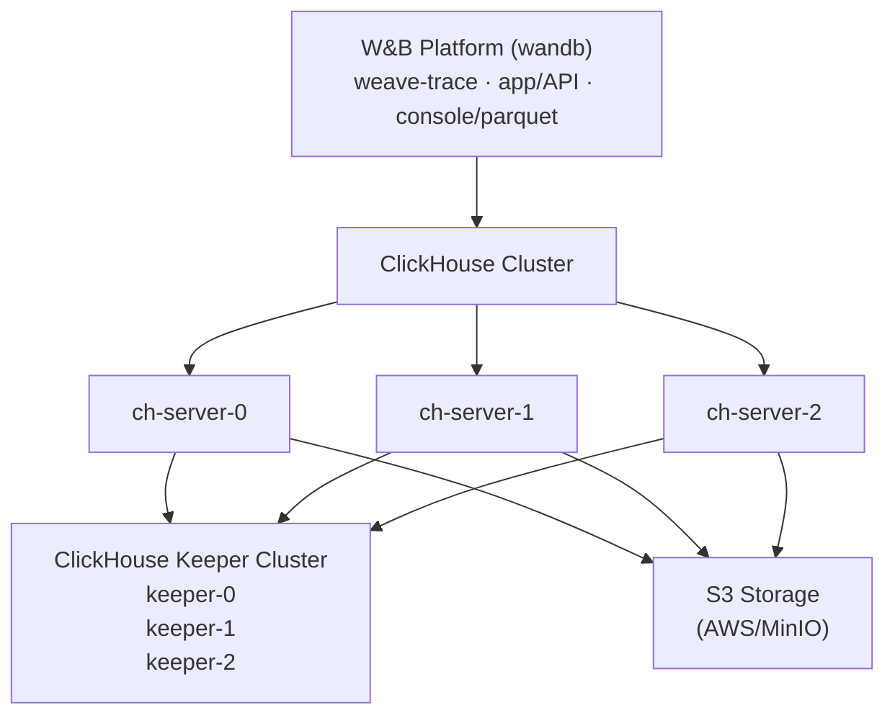

W&B Weave を自己ホスティングすると、その環境と設定をより細かく制御できます。これにより、より分離された環境を構築し、追加のセキュリティコンプライアンス要件を満たすことができます。本ドキュメントでは、Altinity ClickHouse Operator を使用して、自己管理型環境で W&B Weave を実行するために必要なすべてのコンポーネントをデプロイする方法を説明します。

自己管理型の Weave デプロイは、バックエンドの管理に [ClickHouseDB](https://clickhouse.com/) を利用します。このデプロイでは、次のコンポーネントを使用します。

- **Altinity ClickHouse Operator**: Kubernetes 向けのエンタープライズグレードの ClickHouse 管理ツール
- **ClickHouse Keeper**: 分散コーディネーションサービス（ZooKeeper の代替）
- **ClickHouse Cluster**: トレースストレージ向けの高可用性データベースクラスター
- **S3-Compatible Storage**: ClickHouse データ永続化のためのオブジェクトストレージ

<Tip>
詳細なリファレンスアーキテクチャについては、[W&B Self-Managed Reference Architecture](https://docs.wandb.ai/guides/hosting/self-managed/ref-arch/#models-and-weave) を参照してください。
</Tip>

<div id="important-setup-notes">
  ## 重要なセットアップに関する注意事項
</div>

本ガイド内の設定例は、あくまで参考用です。各組織の Kubernetes 環境はそれぞれ異なるため、セルフホスト環境では次の点を調整する必要が生じる可能性があります。

- **セキュリティとコンプライアンス**: 組織のセキュリティポリシーおよび Kubernetes / OpenShift の要件に従って、security context、`runAsUser` / `fsGroup` の値、その他のセキュリティ設定を調整してください。
- **リソース規模**: 記載されているリソース割り当ては出発点に過ぎません。想定されるトレース量およびパフォーマンス要件に基づいた適切なサイズ決定については、**W&amp;B Solutions Architect チームに相談してください**。
- **インフラ固有の事項**: ストレージクラス、node selector、その他インフラ固有の設定を、環境に合わせて更新してください。

本ガイドのこれらの設定は、厳密な手順や唯一の解決策としてではなく、テンプレートとして扱ってください。

<div id="architecture">
  ## アーキテクチャ
</div>


```mermaid
graph TD
    A["W&B Platform (wandb)<br/>weave-trace · app/API · console/parquet"] --> B["ClickHouse Cluster"]
    B --> C["ch-server-0"]
    B --> D["ch-server-1"]
    B --> E["ch-server-2"]
    C --> F["ClickHouse Keeper Cluster<br/>keeper-0 <br/>keeper-1 <br/>keeper-2"]
    D --> F
    E --> F
    C --> G["S3 Storage<br/>(AWS/MinIO)"]
    D --> G
    E --> G
```


<div id="prerequisites">
  ## 前提条件
</div>

セルフマネージドの Weave インスタンスには、以下のリソースが必要です。

- **Kubernetes クラスター**: バージョン 1.29 以上
- **Kubernetes ノード**: 複数ノードのクラスター（高可用性のため、最低 3 ノードを推奨）
- **Storage Class**: 永続ボリューム用に動作する StorageClass（例: `gp3`, `standard`, `nfs-csi`）
- **S3 バケット**: 適切なアクセス権限を持つ、事前に設定済みの S3 または S3 互換バケット
- **W&B Platform**: すでにインストール済みで稼働していること（[W&B Self-Managed Deployment Guide](https://docs.wandb.ai/guides/hosting/hosting-options/self-managed/) を参照）
- **W&B License**: W&B Support から提供される Weave 対応ライセンス

<Warning>
これらの前提条件リストだけを基準に、リソースのサイジングを決定しないでください。必要なリソースは、トレース量や利用パターンによって大きく異なります。明示的なクラスターサイジングのガイダンスについては、詳細な [Resource Requirements](#resource-requirements) セクションを参照してください。
</Warning>

<div id="required-tools">
  ### 必要なツール
</div>

インスタンスをセットアップするために、次のツールが必要です。

- クラスターへアクセスできるように設定された `kubectl`
- `helm` v3.0 以降
- AWS 認証情報（S3 を使用する場合）、または S3 互換ストレージへのアクセス

<div id="network-requirements">
  ### ネットワーク要件
</div>

Kubernetes クラスターでは、次のネットワーク設定が必要です。

- `clickhouse` ネームスペース内の Pod は、`wandb` ネームスペース内の Pod と通信できる必要があります
- ClickHouse ノード同士が、ポート 8123、9000、9009、2181 で相互に通信できる必要があります

<div id="deploy-your-self-managed-weave-instance">
  ## セルフマネージドの Weave インスタンスをデプロイする
</div>

<div id="step-1-deploy-altinity-clickhouse-operator">
  ### ステップ 1: Altinity ClickHouse Operator をデプロイする
</div>

Altinity ClickHouse Operator は、Kubernetes 上の ClickHouse デプロイメントを管理します。

<div id="11-add-the-altinity-helm-repository">
  #### 1.1 Altinity Helm リポジトリを追加する
</div>

```bash
helm repo add altinity https://helm.altinity.com
helm repo update
```


<div id="12-create-the-operator-configuration">
  #### 1.2 オペレーターの設定を作成する
</div>

`ch-operator.yaml` という名前のファイルを作成します。

```yaml
operator:
  image:
    repository: altinity/clickhouse-operator

  # セキュリティコンテキスト - クラスターの要件に応じて調整してください
  containerSecurityContext:
    runAsGroup: 0
    runAsNonRoot: true
    runAsUser: 10001 # OpenShift/Kubernetes のセキュリティポリシーに合わせて更新してください
    allowPrivilegeEscalation: false
    capabilities:
      drop:
        - ALL
    privileged: false
    readOnlyRootFilesystem: false

metrics:
  enabled: false

# 名前のオーバーライド - 必要に応じてカスタマイズしてください
nameOverride: "wandb"
```

ここで示す `containerSecurityContext` の値は、ほとんどの Kubernetes ディストリビューションで動作します。**OpenShift** を使用している場合は、`runAsUser` と `fsGroup` を、プロジェクトに割り当てられている UID 範囲に合わせて調整する必要がある場合があります。


<div id="13-install-the-operator">
  #### 1.3 オペレーターをインストールする
</div>

```bash
helm upgrade --install ch-operator altinity/altinity-clickhouse-operator \
  --namespace clickhouse \
  --create-namespace \
  -f ch-operator.yaml
```


<div id="14-verify-the-operator-installation">
  #### 1.4 オペレーターのインストールを確認する
</div>

```bash
# operator pod が実行中であることを確認する
kubectl get pods -n clickhouse

# 期待される出力:
# NAME                                 READY   STATUS    RESTARTS   AGE
# ch-operator-wandb-xxxxx              1/1     Running   0          30s

# operator イメージのバージョンを確認する
kubectl get pods -n clickhouse -o jsonpath="{.items[*].spec.containers[*].image}" | \
  tr ' ' '\n' | grep -v 'metrics-exporter' | sort -u

# 期待される出力:
# altinity/clickhouse-operator:0.25.4
```


<div id="step-2-prepare-s3-storage">
  ### ステップ 2: S3 ストレージの準備
</div>

ClickHouse は、データの永続化に S3 または S3 互換ストレージが必要です。

<div id="21-create-an-s3-bucket">
  #### 2.1 S3 バケットを作成する
</div>

ご自身の AWS アカウントまたは S3 互換ストレージプロバイダーで S3 バケットを作成します。

```bash
# AWS の例
aws s3 mb s3://my-wandb-clickhouse-bucket --region eu-central-1
```


<div id="22-configure-s3-credentials">
  #### 2.2 S3 認証情報を設定する
</div>

S3 へのアクセス認証情報を設定する方法は 2 つあります。

<div id="option-a-using-aws-iam-roles-irsa-recommended-for-aws">
  ##### オプション A: AWS IAM ロールを使用する場合 (IRSA - AWS 向け推奨)
</div>

Kubernetes ノードに S3 へのアクセス権を持つ IAM ロールが付与されている場合、ClickHouse は EC2 インスタンスメタデータを使用できます：

```yaml
# ch-server.yaml で以下を設定します:
<use_environment_credentials>true</use_environment_credentials>
```

**必須の IAM ポリシー**（ノード IAM ロールにアタッチ）:

```json
{
  "Version": "2012-10-17",
  "Statement": [
    {
      "Effect": "Allow",
      "Action": [
        "s3:GetObject",
        "s3:PutObject",
        "s3:DeleteObject",
        "s3:ListBucket"
      ],
      "Resource": [
        "arn:aws:s3:::my-wandb-clickhouse-bucket",
        "arn:aws:s3:::my-wandb-clickhouse-bucket/*"
      ]
    }
  ]
}
```


<div id="option-b-using-access-keys">
  ##### オプション B: アクセスキーを使用する
</div>

静的な認証情報を使用する場合は、Kubernetes Secret を作成します。

```bash
kubectl create secret generic aws-creds \
  --namespace clickhouse \
  --from-literal aws_access_key=YOUR_ACCESS_KEY \
  --from-literal aws_secret_key=YOUR_SECRET_KEY
```

次に、ClickHouse がシークレットを使用するように設定します（下記の ch-server.yaml の設定を参照してください）。


<div id="step-3-deploy-clickhouse-keeper">
  ### ステップ 3: ClickHouse Keeper をデプロイする
</div>

[ClickHouse Keeper](https://clickhouse.com/docs/guides/sre/keeper/clickhouse-keeper) は、データ レプリケーションと分散 DDL クエリの実行を行うためのコーディネーションシステムを提供します。

<div id="31-create-the-keeper-configuration">
  #### 3.1 Keeper の設定を作成する
</div>

`ch-keeper.yaml` という名前のファイルを作成します。

```yaml
apiVersion: "clickhouse-keeper.altinity.com/v1"
kind: "ClickHouseKeeperInstallation"
metadata:
  name: wandb
  namespace: clickhouse
  annotations: {}
spec:
  defaults:
    templates:
      podTemplate: default
      dataVolumeClaimTemplate: default

  templates:
    podTemplates:
      - name: keeper
        metadata:
          labels:
            app: clickhouse-keeper
        spec:
          # Pod security context - adjust according to your environment
          securityContext:
            fsGroup: 10001 # Update based on your cluster's security requirements
            fsGroupChangePolicy: Always
            runAsGroup: 0
            runAsNonRoot: true
            runAsUser: 10001 # For OpenShift, use your project's assigned UID range
            seccompProfile:
              type: RuntimeDefault

          # Anti-affinity to spread keepers across nodes (recommended for HA)
          # Customize or remove based on your cluster size and availability requirements
          affinity:
            podAntiAffinity:
              requiredDuringSchedulingIgnoredDuringExecution:
                - labelSelector:
                    matchExpressions:
                      - key: "app"
                        operator: In
                        values:
                          - clickhouse-keeper
                  topologyKey: "kubernetes.io/hostname"

          containers:
            - name: clickhouse-keeper
              imagePullPolicy: IfNotPresent
              image: "clickhouse/clickhouse-keeper:25.10"
              # Resource requests - example values, adjust based on workload
              resources:
                requests:
                  memory: "256Mi"
                  cpu: "0.5"
                limits:
                  memory: "2Gi"
                  cpu: "1"

              securityContext:
                allowPrivilegeEscalation: false
                capabilities:
                  drop:
                    - ALL
                privileged: false
                readOnlyRootFilesystem: false

    volumeClaimTemplates:
      - name: data
        metadata:
          labels:
            app: clickhouse-keeper
        spec:
          storageClassName: gp3 # Change to your StorageClass
          accessModes:
            - ReadWriteOnce
          resources:
            requests:
              storage: 10Gi

  configuration:
    clusters:
      - name: keeper # Keeper cluster name - used in service DNS naming
        layout:
          replicasCount: 3
        templates:
          podTemplate: keeper
          dataVolumeClaimTemplate: data

    settings:
      logger/level: "information"
      logger/console: "true"
      listen_host: "0.0.0.0"
      keeper_server/four_letter_word_white_list: "*"
      keeper_server/coordination_settings/raft_logs_level: "information"
      keeper_server/enable_ipv6: "false"
      keeper_server/coordination_settings/async_replication: "true"
```

**重要な設定の更新**:

- **StorageClass**: `storageClassName: gp3` を、使用中のクラスターで利用可能な StorageClass に合わせて更新します
- **Security Context**: 組織のセキュリティポリシーに準拠するように、`runAsUser`、`fsGroup` の値を調整します
- **Anti-Affinity**: クラスターのトポロジーと HA 要件に基づいて、`affinity` セクションをカスタマイズまたは削除します
- **Resources**: CPU/メモリの値はサンプルです。適切なサイズについては W&B Solutions Architects に相談してください
- **Naming**: `metadata.name` または `configuration.clusters[0].name` を変更する場合は、必ず ch-server.yaml (ステップ 4) 内の Keeper のホスト名もそれに合わせて更新してください

<div id="32-deploy-clickhouse-keeper">
  #### 3.2 ClickHouse Keeper をデプロイする
</div>

```bash
kubectl apply -f ch-keeper.yaml
```


<div id="33-verify-keeper-deployment">
  #### 3.3 Keeper デプロイメントを確認する
</div>

```bash
# Keeper のポッドを確認する
kubectl get pods -n clickhouse -l app=clickhouse-keeper

# 期待される出力:
# NAME                     READY   STATUS    RESTARTS   AGE
# chk-wandb-keeper-0-0-0   1/1     Running   0          2m
# chk-wandb-keeper-0-1-0   1/1     Running   0          2m
# chk-wandb-keeper-0-2-0   1/1     Running   0          2m

# Keeper のサービスを確認する
kubectl get svc -n clickhouse | grep keeper

# ポート 2181 で keeper サービスが表示されることを確認する
```

<div id="step-4-deploy-clickhouse-cluster">
  ### ステップ 4: ClickHouse クラスターをデプロイする
</div>

Weave のトレース データを格納する ClickHouse サーバー クラスターをデプロイします。

<div id="41-create-the-clickhouse-server-configuration">
  #### 4.1 ClickHouse サーバーの設定を作成する
</div>

`ch-server.yaml` という名前のファイルを作成します。

```yaml
apiVersion: "clickhouse.altinity.com/v1"
kind: "ClickHouseInstallation"
metadata:
  name: wandb
  namespace: clickhouse
  annotations: {}
spec:
  defaults:
    templates:
      podTemplate: default
      dataVolumeClaimTemplate: default

  templates:
    podTemplates:
      - name: clickhouse
        metadata:
          labels:
            app: clickhouse-server
        spec:
          # Pod security context - customize for your environment
          securityContext:
            fsGroup: 10001 # Adjust based on your security policies
            fsGroupChangePolicy: Always
            runAsGroup: 0
            runAsNonRoot: true
            runAsUser: 10001 # For OpenShift, use assigned UID range
            seccompProfile:
              type: RuntimeDefault

          # Anti-affinity rule - ensures servers run on different nodes (optional but recommended)
          # Adjust or remove based on your cluster size and requirements
          affinity:
            podAntiAffinity:
              requiredDuringSchedulingIgnoredDuringExecution:
                - labelSelector:
                    matchExpressions:
                      - key: "app"
                        operator: In
                        values:
                          - clickhouse-server
                  topologyKey: "kubernetes.io/hostname"

          containers:
            - name: clickhouse
              image: clickhouse/clickhouse-server:25.10
              # Example resource allocation - adjust based on workload
              resources:
                requests:
                  memory: 1Gi
                  cpu: 1
                limits:
                  memory: 16Gi
                  cpu: 4

              # AWS credentials (remove this section if using IRSA)
              env:
                - name: AWS_ACCESS_KEY_ID
                  valueFrom:
                    secretKeyRef:
                      name: aws-creds
                      key: aws_access_key
                - name: AWS_SECRET_ACCESS_KEY
                  valueFrom:
                    secretKeyRef:
                      name: aws-creds
                      key: aws_secret_key

              securityContext:
                allowPrivilegeEscalation: false
                capabilities:
                  drop:
                    - ALL
                privileged: false
                readOnlyRootFilesystem: false

    volumeClaimTemplates:
      - name: data
        metadata:
          labels:
            app: clickhouse-server
        spec:
          accessModes:
            - ReadWriteOnce
          resources:
            requests:
              storage: 50Gi
          storageClassName: gp3 # Change to your StorageClass

  configuration:
    # Keeper (ZooKeeper) configuration
    # IMPORTANT: These hostnames MUST match your Keeper deployment from Step 3
    zookeeper:
      nodes:
        - host: chk-wandb-keeper-0-0.clickhouse.svc.cluster.local
          port: 2181
        - host: chk-wandb-keeper-0-1.clickhouse.svc.cluster.local
          port: 2181
        - host: chk-wandb-keeper-0-2.clickhouse.svc.cluster.local
          port: 2181
      # Optional: Uncomment to adjust timeouts if needed
      # session_timeout_ms: 30000
      # operation_timeout_ms: 10000

    # Users 設定: https://clickhouse.com/docs/operations/configuration-files#user-settings
    # 本番環境では、平文の代わりに SHA-256 ハッシュ化されたパスワードを使用してください:
    # printf "your-password" | sha256sum
    # その後、weave/password の代わりに weave/password_sha256_hex: <hash> を使用してください
    users:
      weave/password: weave123  # デプロイ前に強力なパスワードに置き換えてください
      weave/access_management: 1
      weave/profile: default
      weave/networks/ip:
        - "0.0.0.0/0"
        - "::"

    # Server settings
    settings:
      disable_internal_dns_cache: 1

    # Cluster configuration
    clusters:
      - name: weavecluster # Cluster name - can be customized but must match wandb-cr.yaml
        layout:
          shardsCount: 1
          replicasCount: 3 # Number of replicas - adjust based on HA requirements
        templates:
          podTemplate: clickhouse
          dataVolumeClaimTemplate: data

    # Configuration files
    files:
      config.d/network_configuration.xml: |
        <clickhouse>
            <listen_host>0.0.0.0</listen_host>
            <listen_host>::</listen_host>
        </clickhouse>

      config.d/logger.xml: |
        <clickhouse>
            <logger>
                <level>information</level>
            </logger>
        </clickhouse>

      config.d/storage_configuration.xml: |
        <clickhouse>
            <storage_configuration>
                <disks>
                    <s3_disk>
                        <type>s3</type>
                        <!-- Update with your S3 bucket endpoint and region -->
                        <endpoint>https://YOUR-BUCKET-NAME.s3.YOUR-REGION.amazonaws.com/s3_disk/{replica}</endpoint>
                        <metadata_path>/var/lib/clickhouse/disks/s3_disk/</metadata_path>
                        <use_environment_credentials>true</use_environment_credentials>
                        <region>YOUR-REGION</region>
                    </s3_disk>
                    <s3_disk_cache>
                        <type>cache</type>
                        <disk>s3_disk</disk>
                        <path>/var/lib/clickhouse/s3_disk_cache/cache/</path>
                        <!-- Cache size MUST be smaller than persistent volume -->
                        <max_size>40Gi</max_size>
                        <cache_on_write_operations>true</cache_on_write_operations>
                    </s3_disk_cache>
                </disks>
                <policies>
                    <s3_main>
                        <volumes>
                            <main>
                                <disk>s3_disk_cache</disk>
                            </main>
                        </volumes>
                    </s3_main>
                </policies>
            </storage_configuration>
            <merge_tree>
                <storage_policy>s3_main</storage_policy>
            </merge_tree>
        </clickhouse>
```

**重要な設定の更新が必要です**:

1. **StorageClass**: `storageClassName: gp3` をクラスターの StorageClass に合わせて更新してください
2. **S3 Endpoint**: `YOUR-BUCKET-NAME` と `YOUR-REGION` を実際の値に置き換えてください
3. **Cache Size**: `<max_size>40Gi</max_size>` は永続ボリュームのサイズ (50Gi) よりも **小さく** する必要があります
4. **Security Context**: `runAsUser`、`fsGroup`、その他のセキュリティ設定を、組織のポリシーに合わせて調整してください
5. **Resource Allocation**: CPU/メモリの値はあくまで例です — 予想されるトレース量に基づいた適切なサイズ決定については、**必ず W&B Solutions Architect に相談してください**
6. **Anti-Affinity Rules**: クラスターのトポロジーや高可用性要件に応じてカスタマイズするか削除してください
7. **Keeper Hostnames**: Keeper ノードのホスト名は、ステップ 3 の Keeper デプロイメントの命名と **一致している必要があります** (下記の「Keeper Naming の理解」を参照)
8. **Cluster Naming**: クラスター名 `weavecluster` は変更可能ですが、ステップ 5 の `WF_CLICKHOUSE_REPLICATED_CLUSTER` の値と一致させる必要があります
9. **Credentials**:
   - IRSA を使用する場合: `<use_environment_credentials>true</use_environment_credentials>` を維持するか、環境変数にマッピングされたシークレットキーにアクセスしてください。

<div id="42-update-s3-configuration">
  #### 4.2 S3 設定を更新する
</div>

`ch-server.yaml` の `storage_configuration.xml` セクションを編集します：

**AWS S3 の例：**

```xml
<endpoint>https://my-wandb-clickhouse.s3.eu-central-1.amazonaws.com/s3_disk/{replica}</endpoint>
<region>eu-central-1</region>
```

**MinIO の例**:

```xml
<endpoint>https://minio.example.com:9000/my-bucket/s3_disk/{replica}</endpoint>
<region>us-east-1</region>
```

<Warning>
  **`{replica}` を削除しないでください。** これにより、各 ClickHouse レプリカがバケット内の専用フォルダーに書き込むようになります。
</Warning>


<div id="43-configure-credentials-option-b-only">
  #### 4.3 認証情報を設定する（オプション B のみ）
</div>

手順 2 で **Option B (Access Keys)** を使用している場合、`ch-server.yaml` の `env` セクションがそのシークレットを参照するように設定されていることを確認します。

```yaml
env:
  - name: AWS_ACCESS_KEY_ID
    valueFrom:
      secretKeyRef:
        name: aws-creds
        key: aws_access_key
  - name: AWS_SECRET_ACCESS_KEY
    valueFrom:
      secretKeyRef:
        name: aws-creds
        key: aws_secret_key
```

**Option A (IRSA)** を使用する場合は、`env` セクション全体を削除してください。


<div id="44-understanding-keeper-naming">
  #### 4.4 Keeper の名前付けの仕組み
</div>

`zookeeper.nodes` セクション内の Keeper ノードのホスト名は、手順 3 で行った Keeper デプロイに基づいて、特定のパターンに従います：

**ホスト名パターン**: `chk-{installation-name}-{cluster-name}-{cluster-index}-{replica-index}.{namespace}.svc.cluster.local`

各要素の意味は次のとおりです：

* `chk` = ClickHouseKeeperInstallation のプレフィックス（固定）
* `{installation-name}` = ch-keeper.yaml の `metadata.name`（例: `wandb`）
* `{cluster-name}` = ch-keeper.yaml の `configuration.clusters[0].name`（例: `keeper`）
* `{cluster-index}` = クラスターインデックス。単一クラスターの場合は通常 `0`
* `{replica-index}` = レプリカ番号。3 レプリカの場合は `0`, `1`, `2`
* `{namespace}` = Kubernetes namespace（例: `clickhouse`）

**デフォルト名を使用した例**:

```
chk-wandb-keeper-0-0.clickhouse.svc.cluster.local
chk-wandb-keeper-0-1.clickhouse.svc.cluster.local
chk-wandb-keeper-0-2.clickhouse.svc.cluster.local
```

**Keeper のインストール名をカスタマイズする場合は**（例: `metadata.name: myweave`）:

```
chk-myweave-keeper-0-0.clickhouse.svc.cluster.local
chk-myweave-keeper-0-1.clickhouse.svc.cluster.local
chk-myweave-keeper-0-2.clickhouse.svc.cluster.local
```

**Keeper クラスター名をカスタマイズしている場合**（例: `clusters[0].name: coordination`）:

```
chk-wandb-coordination-0-0.clickhouse.svc.cluster.local
chk-wandb-coordination-0-1.clickhouse.svc.cluster.local
chk-wandb-coordination-0-2.clickhouse.svc.cluster.local
```

**実際の Keeper のホスト名を確認するには**：

```bash
# 実際の名前を確認するために Keeper サービスを一覧表示する
kubectl get svc -n clickhouse | grep keeper

# 命名パターンを確認するために Keeper Pod を一覧表示する
kubectl get pods -n clickhouse -l app=clickhouse-keeper
```

<Note>
  `ch-server.yaml` 内の Keeper ホスト名は、Keeper デプロイメントによって作成される実際のサービス名と**完全に一致している必要があります**。一致していない場合、ClickHouse サーバーはコーディネーションサービスに接続できません。
</Note>


<div id="45-deploy-clickhouse-cluster">
  #### 4.5 ClickHouse クラスターをデプロイする
</div>

```bash
kubectl apply -f ch-server.yaml
```


<div id="46-verify-clickhouse-deployment">
  #### 4.6 ClickHouse デプロイを検証する
</div>

```bash
# ClickHouse pods を確認する
kubectl get pods -n clickhouse -l app=clickhouse-server

# 期待される出力:
# NAME                           READY   STATUS    RESTARTS   AGE
# chi-wandb-weavecluster-0-0-0   1/1     Running   0          3m
# chi-wandb-weavecluster-0-1-0   1/1     Running   0          3m
# chi-wandb-weavecluster-0-2-0   1/1     Running   0          3m

# ClickHouse の接続性をテストする
kubectl exec -n clickhouse chi-wandb-weavecluster-0-0-0 -- \
  clickhouse-client --user weave --password weave123 --query "SELECT version()"

# クラスターのステータスを確認する
kubectl exec -n clickhouse chi-wandb-weavecluster-0-0-0 -- \
  clickhouse-client --user weave --password weave123 --query \
  "SELECT cluster, host_name, port FROM system.clusters WHERE cluster='weavecluster'"
```


<div id="step-5-enable-weave-in-wb-platform">
  ### ステップ 5: W&B Platform で Weave を有効にする
</div>

次に、Weave のトレースに ClickHouse クラスターを使用するように W&B Platform を設定します。

<div id="51-gather-clickhouse-connection-information">
  #### 5.1 ClickHouse 接続情報を収集する
</div>

次の情報が必要です。

- **ホスト**: `clickhouse-wandb.clickhouse.svc.cluster.local`
- **ポート**: `8123`
- **ユーザー**: `weave` (ch-server.yaml で設定)
- **パスワード**: `weave123` (ch-server.yaml で設定)
- **データベース**: `weave` (自動的に作成されます)
- **クラスター名**: `weavecluster` (ch-server.yaml で設定)

ホスト名は次のパターンに従います: `clickhouse-{installation-name}.{namespace}.svc.cluster.local`

<div id="52-update-wb-custom-resource">
  #### 5.2 W&amp;B カスタムリソースを更新する
</div>

Weave の設定を追加するために、W&amp;B Platform の Custom Resource (CR) を編集します。

```yaml
apiVersion: apps.wandb.com/v1
kind: WeightsAndBiases
metadata:
  name: wandb
  namespace: wandb
spec:
  values:
    global:
      # ... 既存の設定 ...

      # ClickHouse の設定を追加
      clickhouse:
        install: false # 別途デプロイ済み
        host: clickhouse-wandb.clickhouse.svc.cluster.local
        port: 8123
        user: weave
        password: weave123
        database: weave
        replicated: true # マルチレプリカ構成では必須

      # Weave Trace を有効化
      weave-trace:
        enabled: true

    # Weave Trace の設定
    weave-trace:
      install: true
      extraEnv:
        WF_CLICKHOUSE_REPLICATED: "true"
        WF_CLICKHOUSE_REPLICATED_CLUSTER: "weavecluster"
      image:
        repository: wandb/weave-trace
        tag: 0.74.1
      replicaCount: 1
      size: "default"
      sizing:
        default:
          autoscaling:
            horizontal:
              enabled: false
          # リソース割り当ての例 - ワークロードに応じて調整してください
          resources:
            limits:
              cpu: 4
              memory: "8Gi"
            requests:
              cpu: 1
              memory: "4Gi"
      # Pod セキュリティコンテキスト - 環境に合わせてカスタマイズしてください
      podSecurityContext:
        fsGroup: 10001 # セキュリティ要件に応じて調整してください
        fsGroupChangePolicy: Always
        runAsGroup: 0
        runAsNonRoot: true
        runAsUser: 10001 # OpenShift の場合は割り当てられた UID 範囲を使用してください
        seccompProfile:
          type: RuntimeDefault
      # コンテナセキュリティコンテキスト
      securityContext:
        allowPrivilegeEscalation: false
        capabilities:
          drop:
            - ALL
        privileged: false
        readOnlyRootFilesystem: false
```

**重要な設定**:

* `clickhouse.replicated: true` - 3 つのレプリカ構成で **必須**
* `WF_CLICKHOUSE_REPLICATED: "true"` - レプリケーション構成では **必須**
* `WF_CLICKHOUSE_REPLICATED_CLUSTER: "weavecluster"` - ch-server.yaml 内のクラスター名と **一致している必要があります**

<Note>
  上記に示した SecurityContext、リソース割り当て、その他 Kubernetes 固有の設定は、参照用のサンプルです。ご自身の組織の要件に合わせてカスタマイズし、適切なリソースサイジングについては W&amp;B Solutions Architect チームに相談してください。
</Note>


<div id="53-apply-the-updated-configuration">
  #### 5.3 更新済みの設定を適用する
</div>

```bash
kubectl apply -f wandb-cr.yaml
```


<div id="54-verify-weave-trace-deployment">
  #### 5.4 Weave Trace のデプロイを検証する
</div>

```bash
# weave-trace pod のステータスを確認する
kubectl get pods -n wandb | grep weave-trace

# 期待される出力:
# wandb-weave-trace-bc-xxxxx   1/1     Running   0          2m

# ClickHouse 接続に関する weave-trace のログを確認する
kubectl logs -n wandb <weave-trace-pod-name> --tail=50

# ClickHouse 接続成功のメッセージを確認する
```


<div id="step-6-initialize-weave-database">
  ### ステップ 6: Weave データベースの初期化
</div>

weave-trace サービスは、初回起動時に必要なデータベーススキーマを自動的に作成します。

<div id="61-monitor-database-migration">
  #### 6.1 データベース移行を監視する
</div>

```bash
# 起動中に weave-trace のログを監視する
kubectl logs -n wandb <weave-trace-pod-name> -f

# データベースの初期化が成功したことを示すマイグレーションメッセージを確認する
```


<div id="62-verify-database-creation">
  #### 6.2 データベース作成の確認
</div>

```bash
# ClickHouse に接続してデータベースを確認する
kubectl exec -n clickhouse chi-wandb-weavecluster-0-0-0 -- \
  clickhouse-client --user weave --password weave123 --query \
  "SHOW DATABASES"

# 'weave' データベースが一覧に表示されることを確認する

# weave データベースのテーブルを確認する
kubectl exec -n clickhouse chi-wandb-weavecluster-0-0-0 -- \
  clickhouse-client --user weave --password weave123 --query \
  "SHOW TABLES FROM weave"
```


<div id="step-7-verify-weave-is-enabled">
  ### ステップ 7: Weave が有効になっていることを確認する
</div>

<div id="71-access-wb-console">
  #### 7.1 W&B Console にアクセスする
</div>

Web ブラウザで W&B インスタンスの URL を開きます。

<div id="72-check-weave-license-status">
  #### 7.2 Weave ライセンスの状態を確認する
</div>

W&B Console で次の操作を行います。

1. 画面右上のメニュー → **Organization ダッシュボード** に移動します
2. **Weave access** が有効になっていることを確認します

<div id="73-test-weave-functionality">
  #### 7.3 Weave の機能をテストする
</div>

Weave が動作していることを確認するために、簡単な Python テストを作成します。

```python
import os
import weave

# Weave をセルフマネージドの W&B インスタンスに向ける
os.environ["WANDB_BASE_URL"] = "https://your-wandb-host"  # Replace with your W&B URL

weave.init('test-project')

# シンプルなトレース関数を作成する
@weave.op()
def hello_weave(name: str) -> str:
    return f"Hello, {name}!"

# 関数を呼び出す
result = hello_weave("World")
print(result)
```

これを実行した後、組織内の W&B UI の traces ページでトレースを確認してください。

<div id="troubleshooting">
  ## トラブルシューティング
</div>

<div id="clickhouse-keeper-issues">
  ### ClickHouse Keeper の問題
</div>

**問題**: Keeper Pod が `Pending` 状態のままになっている

**解決策**: 考えられる原因を確認してください:

1. **PVC と StorageClass に関する問題**:

```bash
kubectl get pvc -n clickhouse
kubectl describe pvc -n clickhouse
```

`StorageClass` が正しく構成されており、十分な空き容量があることを確認してください。

2. **アンチアフィニティとノードの可用性**：

```bash
# アンチアフィニティルールがスケジューリングを妨げていないか確認する
kubectl describe pod -n clickhouse <pod-name> | grep -A 10 "Events:"

# 利用可能なノードとそのリソースを確認する
kubectl get nodes
kubectl describe nodes | grep -A 5 "Allocated resources"
```

よくある問題:

* アンチアフィニティには 3 つの個別ノードが必要だが、クラスター内のノード数がそれより少ない
* ノードに、Pod のリクエストを満たすのに十分な CPU とメモリがない
* ノードのテイントによって Pod のスケジューリングが妨げられている

**解決策**:

* ノードが 3 未満の場合は、アンチアフィニティルールを削除するか調整する
* より緩やかなアンチアフィニティにするために、`requiredDuringSchedulingIgnoredDuringExecution` の代わりに `preferredDuringSchedulingIgnoredDuringExecution` を使用する
* ノードに制約がある場合は、リソースリクエストを減らす
* クラスターにノードを追加する

***

**問題**: Keeper Pod が `CrashLoopBackOff` 状態になる

**解決策**: ログを確認し、設定を検証する:

```bash
kubectl logs -n clickhouse <keeper-pod-name>
```

よくある問題:

* セキュリティコンテキストの誤り（runAsUser、fsGroup を確認）
* ボリューム権限の問題
* ポートの競合
* ch-keeper.yaml の設定エラー


<div id="clickhouse-server-issues">
  ### ClickHouse サーバーの問題
</div>

**問題**: ClickHouse が S3 に接続できない

**解決策**: S3 の認証情報とアクセス権限を確認する:

```bash
# シークレットが存在するか確認する（アクセスキーを使用している場合）
kubectl get secret aws-creds -n clickhouse

# S3 エラーの ClickHouse ログを確認する
kubectl logs -n clickhouse <clickhouse-pod-name> | grep -i s3

# ストレージ設定の S3 エンドポイントを確認する
kubectl get chi wandb -n clickhouse -o yaml | grep -A 10 storage_configuration
```

***

**問題**: ClickHouse が Keeper に接続できない

**解決策**: Keeper のエンドポイントと名前設定を確認する:

```bash
# Keeper サービスと実際の名前を確認する
kubectl get svc -n clickhouse | grep keeper

# Keeper Pod を確認して命名パターンを確認する
kubectl get pods -n clickhouse -l app=clickhouse-keeper

# ch-server.yaml の zookeeper.nodes 設定と比較する
# ホスト名は実際のサービス名と一致している必要がある

# ClickHouse ログで接続エラーを確認する
kubectl logs -n clickhouse chi-wandb-weavecluster-0-0-0 | grep -i keeper
```

接続に失敗する場合、ch-server.yaml 内の Keeper のホスト名が、実際の Keeper デプロイメントと一致していない可能性があります。命名パターンについては、手順 4 の「Keeper の命名規則について」を参照してください。


<div id="weave-trace-issues">
  ### Weave Trace の問題
</div>

**問題**: `weave-trace` pod が起動に失敗する

**解決策**: ClickHouse への接続を確認する：

```bash
# weave-trace の Pod 名を取得する
kubectl get pods -n wandb | grep weave-trace

# weave-trace のログを確認する
kubectl logs -n wandb <weave-trace-pod-name>

# よくあるエラー: "connection refused" または "authentication failed"
# wandb-cr.yaml の ClickHouse 認証情報が ch-server.yaml と一致しているか確認する
```

***

**問題**: Console で Weave が有効として表示されない

**解決方法**: 設定を確認してください：

1. ライセンスに Weave が含まれていることを確認してください：

   ```bash
   kubectl get secret license-key -n wandb -o jsonpath='{.data.value}' | base64 -d | jq
   ```

2. wandb-cr.yaml で `weave-trace.enabled: true` と `clickhouse.replicated: true` が設定されていることを確認してください

3. W&amp;B operator のログを確認してください：
   ```bash
   kubectl logs -n wandb deployment/wandb-controller-manager
   ```

***

**問題**: データベース マイグレーションが失敗する

**解決方法**: クラスター名が一致しているか確認してください：

`WF_CLICKHOUSE_REPLICATED_CLUSTER` 環境変数は、ch-server.yaml のクラスター名と **一致している必要があります**。

```yaml
# ch-server.yaml 内:
clusters:
  - name: weavecluster # <-- この名前

# wandb-cr.yaml 内の値と一致させること:
weave-trace:
  extraEnv:
    WF_CLICKHOUSE_REPLICATED_CLUSTER: "weavecluster" # <-- この値
```


<div id="resource-requirements">
  ## リソース要件
</div>

<Warning>
以下のリソース割り当ては、あくまで**参考となる初期値の一例**です。実際の要件は、次のような要因によって大きく変動します:

- トレース取り込み量（1 秒あたりのトレース数）
- クエリパターンおよび同時実行数
- データ保持期間
- 同時接続しているユーザー数

**必ず W&B Solutions Architect チームに相談し**、お客様固有のユースケースに対して適切なサイズを決定してください。リソースが不足しているとパフォーマンス問題の原因となり、過剰にプロビジョニングするとインフラコストの無駄につながります。
</Warning>

<div id="minimum-production-setup">
  ### 本番環境の最小構成
</div>

| コンポーネント    | レプリカ数 | CPU リクエスト / 制限 | メモリ リクエスト / 制限 | ストレージ |
| ----------------- | ---------- | ---------------------- | ------------------------ | ---------- |
| ClickHouse Keeper | 3          | 0.5 / 1                | 256Mi / 2Gi              | 各 10Gi    |
| ClickHouse Server | 3          | 1 / 4                  | 1Gi / 16Gi               | 各 50Gi    |
| Weave Trace       | 1          | 1 / 4                  | 4Gi / 8Gi                | -          |
| **合計**          | **7 個の pod** | **約 4.5 / 15 CPU** | **約 7.8Gi / 58Gi**      | **180Gi**  |

_対象: 開発、テスト、または小規模な本番環境_

<div id="recommended-production-setup">
  ### 本番環境向け推奨セットアップ
</div>

トレース量の多い本番ワークロード向け:

| Component         | Replicas     | CPU Request / Limit  | Memory Request / Limit   | Storage    |
| ----------------- | ------------ | -------------------- | ------------------------ | ---------- |
| ClickHouse Keeper | 3            | 1 / 2                | 1Gi / 4Gi                | 20Gi each  |
| ClickHouse Server | 3            | 1 / 16               | 8Gi / 64Gi               | 200Gi each |
| Weave Trace       | 2-3          | 1 / 4                | 4Gi / 8Gi                | -          |
| **Total**         | **8-9 pods** | **~6-9 / 52-64 CPU** | **~27-33Gi / 204-216Gi** | **660Gi**  |

_適用対象: トレース量の多い本番環境_

超大規模なデプロイの場合は、特定のトレース量およびパフォーマンス要件に基づくカスタムのサイジング推奨について、W&B Solutions Architect チームまでお問い合わせください。

<div id="advanced-configuration">
  ## 高度な設定
</div>

このセクションでは、セルフマネージドの Weave デプロイメント向けのカスタマイズ オプションとして、垂直スケーリングまたは水平スケーリングによる ClickHouse 容量の拡張、keeper と server の両方の設定でイメージタグを変更して ClickHouse バージョンを更新する方法、および ClickHouse の健全性の監視について説明します。

インスタンスに対して高度な変更を行う際には、パフォーマンスおよび信頼性の要件を満たしていることを確認するため、W&B Solutions Architect チームに相談することをお勧めします。

<div id="scaling-clickhouse">
  ### ClickHouse のスケーリング
</div>

ClickHouse のキャパシティを増やすには、次の方法があります。

1. **垂直スケーリング**: Pod ごとのリソースを増やす（より単純な方法）

   ```yaml
   resources:
     requests:
       memory: 8Gi
       cpu: 1
     limits:
       memory: 64Gi
       cpu: 16
   ```

   **推奨**: 実際のリソース使用状況を監視し、それに応じてスケールしてください。超大規模なデプロイの場合は、W&B Solutions Architect チームに連絡してください。

2. **水平スケーリング**: レプリカを追加する（慎重な計画が必要）
   - レプリカを増やすと、データのリバランスが必要になります
   - シャード管理については ClickHouse のドキュメントを参照してください
   - 本番環境で水平スケーリングを実装する前に、**W&B Solutions Architect に連絡**してください

<div id="using-different-clickhouse-versions">
  ### 異なる ClickHouse バージョンの使用
</div>

異なる ClickHouse バージョンを使用するには、`ch-keeper.yaml` と `ch-server.yaml` の両方のイメージタグを更新してください。

```yaml
image: clickhouse/clickhouse-keeper:25.10   # Keeper version
image: clickhouse/clickhouse-server:25.10   # Server version
```

互換性を確保するには、keeper のバージョンは server のバージョンと同じか、それ以上でなければなりません。

<div id="monitoring-clickhouse">
  ### ClickHouse の監視
</div>

監視には ClickHouse のシステムテーブルにアクセスします。

```bash
# ディスク使用量を確認する
kubectl exec -n clickhouse chi-wandb-weavecluster-0-0-0 -- \
  clickhouse-client --user weave --password weave123 --query \
  "SELECT name, path, formatReadableSize(free_space) as free, formatReadableSize(total_space) as total FROM system.disks"

# レプリケーションのステータスを確認する
kubectl exec -n clickhouse chi-wandb-weavecluster-0-0-0 -- \
  clickhouse-client --user weave --password weave123 --query \
  "SELECT database, table, is_leader, total_replicas, active_replicas FROM system.replicas WHERE database='weave'"

# ClickHouse サーバーのステータスを確認する
kubectl get pods -n clickhouse -l app=clickhouse-server
```


<div id="backup-and-recovery">
  ### バックアップと復旧
</div>

ClickHouse のデータは S3 に保存されており、S3 のバージョニング機能とバケットレプリケーション機能によって、標準でバックアップ機能が備わっています。特定のデプロイメントに合わせたバックアップ戦略については、W&B Solutions Architect チームに相談し、[ClickHouse のバックアップに関するドキュメント](https://clickhouse.com/docs/en/operations/backup) を参照してください。

<div id="security-considerations">
  ## セキュリティ上の考慮事項
</div>

1. **認証情報**: ClickHouse のパスワードはプレーンテキストではなく Kubernetes Secret に保存する
2. **ネットワークポリシー**: ClickHouse へのアクセスを制限するために NetworkPolicy の実装を検討する
3. **RBAC**: ServiceAccount には必要最小限の権限のみを付与する
4. **S3 バケット**: 保存データの暗号化 (暗号化 at rest) を有効にし、必要な IAM ロールにのみバケットへのアクセスを制限する
5. **TLS** (オプション): 本番環境では ClickHouse クライアント接続に TLS を有効化する

<div id="upgrading">
  ## アップグレード
</div>

<div id="upgrading-clickhouse-operator">
  ### ClickHouse Operator のアップグレード
</div>

```bash
helm upgrade ch-operator altinity/altinity-clickhouse-operator \
  --namespace clickhouse \
  -f ch-operator.yaml
```


<div id="upgrading-clickhouse-server">
  ### ClickHouse Server のアップグレード
</div>

`ch-server.yaml` のイメージのバージョンを更新して適用します:

```bash
# ch-server.yaml を編集し、イメージタグを変更する
kubectl apply -f ch-server.yaml

# Pod を監視する
kubectl get pods -n clickhouse
```


<div id="upgrading-weave-trace">
  ### Weave Trace のアップグレード
</div>

`wandb-cr.yaml` のイメージタグを更新して、適用します:

```bash
kubectl apply -f wandb-cr.yaml

# weave-trace pod の再起動を監視する
kubectl get pods -n wandb | grep weave-trace
```


<div id="additional-resources">
  ## 参考資料
</div>

- [Altinity ClickHouse Operator ドキュメント](https://docs.altinity.com/altinitykubernetesoperator/)
- [ClickHouse ドキュメント](https://clickhouse.com/docs)
- [W&B Weave ドキュメント](https://docs.wandb.ai/weave)
- [ClickHouse S3 ストレージの設定](https://clickhouse.com/docs/en/engines/table-engines/mergetree-family/mergetree#s3-virtual-hosted-style)

<div id="support">
  ## サポート
</div>

本番環境へのデプロイや問題が発生した場合:

- **W&B Support**: `support@wandb.com`
- **Solutions Architects**: 超大規模デプロイ、カスタム規模設計、デプロイ計画に関する相談
- **サポート依頼時に含める情報**:
  - weave-trace、ClickHouse Pod、operator のログ
  - W&B バージョン、ClickHouse バージョン、Kubernetes バージョン
  - クラスター情報とトレース量

<div id="faq">
  ## よくある質問
</div>

**Q: ClickHouse のレプリカを 3 つではなく 1 つだけにできますか？**

A: 可能ですが、本番環境では推奨されません。`ch-server.yaml` の `replicasCount: 1` を更新し、`wandb-cr.yaml` で `clickhouse.replicated: false` を設定してください。

**Q: ClickHouse の代わりに別のデータベースを使えますか？**

A: いいえ、Weave Trace は高性能なカラム型ストレージ機能のために ClickHouse を必要とします。

**Q: 必要な S3 ストレージ容量はどれくらいですか？**

A: 必要な S3 ストレージ容量は、トレースの量、保持期間、データ圧縮率に依存します。デプロイ後に実際の使用量を監視し、それに応じて調整してください。ClickHouse のカラム型フォーマットは、トレースデータに対して優れた圧縮を提供します。

**Q: ClickHouse で `database` 名を設定する必要はありますか？**

A: いいえ、`weave` データベースは初回起動時に weave-trace サービスによって自動的に作成されます。

**Q: クラスター名が `weavecluster` ではない場合はどうなりますか？**

A: クラスター名と一致するように `WF_CLICKHOUSE_REPLICATED_CLUSTER` 環境変数を設定する必要があります。そうしないと、データベースのマイグレーションが失敗します。

**Q: サンプルに示されている security context をそのまま使うべきですか？**

A: いいえ。このガイドで示している security context（runAsUser、fsGroup など）は参考例です。特に UID/GID の範囲に関する固有の要件がある OpenShift クラスターでは、自組織のセキュリティポリシーに準拠するように調整する必要があります。

**Q: 自分の ClickHouse クラスターのサイズが適切かどうかは、どうすればわかりますか？**

A: 想定しているトレース量と利用パターンを添えて、W&B Solutions Architect チームにお問い合わせください。具体的なサイジングの推奨を受けられます。デプロイメントのリソース使用状況を監視し、必要に応じて調整してください。

**Q: サンプルで使われている命名規則をカスタマイズできますか？**

A: はい。ただし、すべてのコンポーネント間で一貫性を維持する必要があります。

1. **ClickHouse Keeper 名** → `ch-server.yaml` の `zookeeper.nodes` セクションにある Keeper ノードのホスト名と一致している必要があります
2. **ClickHouse クラスター名**（`weavecluster`） → `wandb-cr.yaml` の `WF_CLICKHOUSE_REPLICATED_CLUSTER` と一致している必要があります
3. **ClickHouse インストール名** → weave-trace が使用するサービスのホスト名に影響します

命名パターンと実際の名前の確認方法については、ステップ 4 の「Keeper の命名について」セクションを参照してください。

**Q: クラスターで異なる anti-affinity 要件を使用している場合はどうなりますか？**

A: ここで示している anti-affinity ルールは、高可用性のための推奨設定です。クラスターのサイズ、トポロジー、可用性要件に応じて調整または削除してください。小規模なクラスターや開発環境では、anti-affinity ルールが不要な場合もあります。