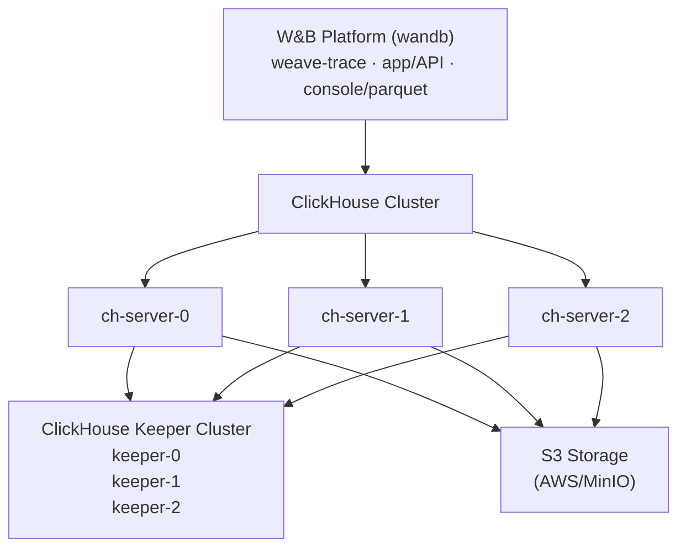

W&amp;B Weave をセルフホストすると、環境や設定をより細かく制御できます。これにより、より分離された環境を構築し、追加のセキュリティ要件やコンプライアンス要件に対応しやすくなります。このドキュメントでは、Altinity ClickHouse Operator を使用して、セルフマネージド環境で W&amp;B Weave を実行するために必要なすべてのコンポーネントをデプロイする方法を説明します。

セルフマネージドの Weave デプロイでは、バックエンドの管理に [ClickHouseDB](https://clickhouse.com/) を使用します。このデプロイでは、次を使用します。

* **Altinity ClickHouse Operator**: Kubernetes 向けのエンタープライズグレードの ClickHouse 管理
* **ClickHouse Keeper**: 分散コーディネーションサービス (ZooKeeper の代替) 
* **ClickHouse Cluster**: トレース保存用の高可用性データベースクラスター
* **S3-Compatible Storage**: ClickHouse データを永続化するためのオブジェクトストレージ

<Tip>
  詳細なリファレンスアーキテクチャについては、[W&amp;B Self-Managed Reference Architecture](https://docs.wandb.ai/guides/hosting/self-managed/ref-arch/#models-and-weave)を参照してください。
</Tip>

<div id="important-setup-notes">
  ## 重要なセットアップ上の注意
</div>

このガイドの設定例は、あくまで参考用です。各組織の Kubernetes 環境はそれぞれ異なるため、セルフホスト環境では以下の点を調整する必要がある可能性が高くなります。

* **Security &amp; Compliance**: 組織のセキュリティポリシーおよび Kubernetes/OpenShift の要件に合わせて、セキュリティコンテキスト、`runAsUser`/`fsGroup` の値、その他のセキュリティ設定を調整してください。
* **Resource Sizing**: ここに示すリソース割り当ては出発点にすぎません。想定されるトレース量とパフォーマンス要件に基づく適切なサイジングについては、**W&amp;B Solutions Architect チームに相談してください**。
* **Infrastructure Specifics**: ストレージクラス、ノードセレクター、その他のインフラストラクチャー固有の設定を、使用する環境に合わせて更新してください。

このガイドの設定は、規定のソリューションではなく、テンプレートとして扱ってください。

<div id="architecture">
  ## アーキテクチャ
</div>


```mermaid
graph TD
    A["W&B Platform (wandb)<br/>weave-trace · app/API · console/parquet"] --> B["ClickHouse Cluster"]
    B --> C["ch-server-0"]
    B --> D["ch-server-1"]
    B --> E["ch-server-2"]
    C --> F["ClickHouse Keeper Cluster<br/>keeper-0 <br/>keeper-1 <br/>keeper-2"]
    D --> F
    E --> F
    C --> G["S3 Storage<br/>(AWS/MinIO)"]
    D --> G
    E --> G
```


<div id="prerequisites">
  ## 前提条件
</div>

セルフマネージドのWeaveインスタンスには、以下のリソースが必要です。

* **Kubernetes クラスター**: バージョン 1.29 以上
* **Kubernetes ノード**: マルチノードクラスター (高可用性のため、少なくとも 3 ノードを推奨) 
* **ストレージクラス**: 永続ボリューム用の有効な StorageClass (例: `gp3`, `standard`, `nfs-csi`) 
* **S3 バケット**: 適切なアクセス権限が設定された、事前構成済みの S3 または S3 互換バケット
* **W&amp;B Platform**: すでにインストールおよび稼働していること ([W&amp;B Self-Managed デプロイガイド](https://docs.wandb.ai/guides/hosting/hosting-options/self-managed/)を参照) 
* **W&amp;B ライセンス**: W&amp;B サポートが提供する Weave 対応ライセンス

<Warning>
  この前提条件の一覧だけを基にサイジングを判断しないでください。必要なリソースは、トレース量や使用パターンによって大きく異なります。クラスターのサイジングに関する具体的なガイダンスについては、詳細な[リソース要件](#resource-requirements)セクションを参照してください。
</Warning>

<div id="required-tools">
  ### 必須ツール
</div>

インスタンスを設定するには、次のツールが必要です。

* クラスターにアクセスできるよう設定された`kubectl`
* `helm` v3.0+
* AWS認証情報 (S3を使用する場合) 、またはS3互換ストレージへのアクセス

<div id="network-requirements">
  ### ネットワーク要件
</div>

Kubernetes クラスターでは、以下のネットワーク設定が必要です。

* `clickhouse` namespace 内の Pod は、`wandb` namespace 内の Pod と通信できる必要があります
* ClickHouse ノード同士は、ポート 8123、9000、9009、2181 を介して通信できる必要があります

<div id="deploy-your-self-managed-weave-instance">
  ## セルフマネージドWeaveインスタンスをデプロイする
</div>

<div id="step-1-deploy-altinity-clickhouse-operator">
  ### Step 1: Altinity ClickHouse Operator をデプロイする
</div>

Altinity ClickHouse Operator は、Kubernetes 上の ClickHouse インストールを管理します。

<div id="11-add-the-altinity-helm-repository">
  #### 1.1 Altinity Helmリポジトリを追加する
</div>

```bash
helm repo add altinity https://helm.altinity.com
helm repo update
```


<div id="12-create-the-operator-configuration">
  #### 1.2 Operator の設定を作成
</div>

`ch-operator.yaml` という名前のファイルを作成します。

ここで示している `containerSecurityContext` の値は、ほとんどの Kubernetes ディストリビューションで使用できます。**OpenShift** では、プロジェクトに割り当てられている UID 範囲に合わせて `runAsUser` と `fsGroup` を調整する必要がある場合があります。

<div id="13-install-the-operator">
  #### 1.3 operatorをインストールする
</div>

```bash
helm upgrade --install ch-operator altinity/altinity-clickhouse-operator \
  --namespace clickhouse \
  --create-namespace \
  -f ch-operator.yaml
```


<div id="14-verify-the-operator-installation">
  #### 1.4 operator がインストールされていることを確認する
</div>

<div id="step-2-prepare-s3-storage">
  ### Step 2: S3ストレージを準備する
</div>

ClickHouse では、データの永続化に S3 または S3 互換ストレージが必要です。

<div id="21-create-an-s3-bucket">
  #### 2.1 S3バケットを作成する
</div>

AWS アカウントまたは S3 互換のストレージプロバイダーで S3バケットを作成します。

<div id="22-configure-s3-credentials">
  #### 2.2 S3認証情報を設定する
</div>

S3へのアクセス認証情報を指定する方法は2つあります。

<div id="option-a-using-aws-iam-roles-irsa-recommended-for-aws">
  ##### オプション A: AWS IAM ロールを使用する (IRSA - AWS では推奨)
</div>

Kubernetes ノードに S3 へのアクセス権を持つ IAM ロールがある場合、ClickHouse は EC2 インスタンスメタデータを使用できます。

**必須の IAM ポリシー** (ノードの IAM ロールにアタッチ) :

```json
{
  "Version": "2012-10-17",
  "Statement": [
    {
      "Effect": "Allow",
      "Action": ["s3:GetObject", "s3:PutObject", "s3:DeleteObject", "s3:ListBucket"],
      "Resource": ["arn:aws:s3:::my-wandb-clickhouse-bucket", "arn:aws:s3:::my-wandb-clickhouse-bucket/*"]
    }
  ]
}
```

<div id="option-b-using-access-keys">
  ##### オプション B: アクセスキーを使用する
</div>

静的な認証情報を使用する場合は、Kubernetes シークレットを作成します。

```bash
kubectl create secret generic aws-creds \
  --namespace clickhouse \
  --from-literal aws_access_key=YOUR_ACCESS_KEY \
  --from-literal aws_secret_key=YOUR_SECRET_KEY
```

次に、ClickHouse がそのシークレットを使用するように設定します (以下の ch-server.yaml の設定を参照) 。


<div id="step-3-deploy-clickhouse-keeper">
  ### Step 3: ClickHouse Keeper をデプロイする
</div>

[ClickHouse Keeper](https://clickhouse.com/docs/guides/sre/keeper/clickhouse-keeper) は、データレプリケーションと分散 DDL クエリの実行を調整するためのシステムです。

<div id="31-create-the-keeper-configuration">
  #### 3.1 Keeper の設定を作成する
</div>

`ch-keeper.yaml` という名前のファイルを作成します。

**重要な設定の更新事項**:

* **StorageClass**: クラスターで使用可能な StorageClass に合わせて、`storageClassName: gp3` を更新します
* **セキュリティコンテキスト**: 組織のセキュリティポリシーに準拠するよう、`runAsUser` と `fsGroup` の値を調整します
* **Anti-Affinity**: クラスターのトポロジーと HA 要件に応じて、`affinity` セクションをカスタマイズするか削除します
* **リソース**: CPU/メモリの値はあくまで例です。適切なサイジングについては、W&amp;B Solutions Architects に相談してください
* **命名**: `metadata.name` または `configuration.clusters[0].name` を変更する場合は、それに合わせて ch-server.yaml (Step 4) 内の Keeper ホスト名を**必ず更新**してください

<div id="32-deploy-clickhouse-keeper">
  #### 3.2 ClickHouse Keeperをデプロイする
</div>

```bash
kubectl apply -f ch-keeper.yaml
```


<div id="33-verify-keeper-deployment">
  #### 3.3 Keeper のデプロイを確認する
</div>

<div id="step-4-deploy-clickhouse-cluster">
  ### Step 4: ClickHouse Cluster をデプロイする
</div>

次に、Weave Trace Data を保存する ClickHouse サーバークラスタをデプロイします。

<div id="41-create-the-clickhouse-server-configuration">
  #### 4.1 ClickHouse サーバー設定を作成する
</div>

`ch-server.yaml` という名前のファイルを作成します:

**重要な設定更新が必要です**:

1. **StorageClass**: `storageClassName: gp3` を、クラスターの StorageClass に合うよう更新します
2. **S3 Endpoint**: `YOUR-BUCKET-NAME` と `YOUR-REGION` を実際の値に置き換えます
3. **Cache Size**: `<max_size>40Gi</max_size>` は永続ボリュームのサイズ (50Gi) より **小さく** する必要があります
4. **セキュリティコンテキスト**: `runAsUser`、`fsGroup`、およびその他のセキュリティ設定を、組織のポリシーに合わせて調整します
5. **Resource Allocation**: CPU/メモリの値はあくまで例です。想定されるトレース量に基づく適切なサイジングについては、**W&amp;B Solutions Architect に相談してください**
6. **Anti-Affinity Rules**: クラスターのトポロジーと高可用性の要件に応じて、カスタマイズするか削除します
7. **Keeper Hostnames**: Keeper ノードのホスト名は、Step 3 の Keeper デプロイの命名と**一致している必要があります** (以下の「Understanding Keeper Naming」を参照)
8. **Cluster Naming**: クラスター名 `weavecluster` は変更できますが、Step 5 の `WF_CLICKHOUSE_REPLICATED_CLUSTER` の値と一致している必要があります
9. **Credentials**:
   * IRSA の場合: `<use_environment_credentials>true</use_environment_credentials>` をそのまま使用するか、環境変数にマッピングしたシークレットキーを使用してください。

<div id="42-update-s3-configuration">
  #### 4.2 S3 の設定を更新する
</div>

`ch-server.yaml` の `storage_configuration.xml` セクションを編集します。

**AWS S3 の設定例**:

```xml
<endpoint>https://my-wandb-clickhouse.s3.eu-central-1.amazonaws.com/s3_disk/{replica}</endpoint>
<region>eu-central-1</region>
```

**MinIOの例**:

```xml
<endpoint>https://minio.example.com:9000/my-bucket/s3_disk/{replica}</endpoint>
<region>us-east-1</region>
```

<Warning>
  **`{replica}` は削除しないでください。** これにより、各 ClickHouse レプリカが bucket 内のそれぞれ専用のフォルダに書き込むようになります。
</Warning>


<div id="43-configure-credentials-option-b-only">
  #### 4.3 認証情報を設定する (Option B のみ)
</div>

Step 2 の **Option B (アクセスキー)&#x20;**&#x20;を使用する場合は、`ch-server.yaml` の `env` セクションでそのシークレットを参照していることを確認してください。

```yaml
env:
  - name: AWS_ACCESS_KEY_ID
    valueFrom:
      secretKeyRef:
        name: aws-creds
        key: aws_access_key
  - name: AWS_SECRET_ACCESS_KEY
    valueFrom:
      secretKeyRef:
        name: aws-creds
        key: aws_secret_key
```

**オプション A (IRSA) **を使用する場合は、`env`セクション全体を削除してください。


<div id="44-understanding-keeper-naming">
  #### 4.4 Keeper の命名規則を理解する
</div>

`zookeeper.nodes` セクションの Keeper ノードのホスト名は、Step 3 で行った Keeper のデプロイに応じて、特定のパターンに従います。

**ホスト名パターン**: `chk-{installation-name}-{cluster-name}-{cluster-index}-{replica-index}.{namespace}.svc.cluster.local`

各要素:

* `chk` = ClickHouseKeeperInstallation のプレフィックス (固定)
* `{installation-name}` = ch-keeper.yaml の `metadata.name` (例: `wandb`)
* `{cluster-name}` = ch-keeper.yaml の `configuration.clusters[0].name` (例: `keeper`)
* `{cluster-index}` = クラスターのインデックス。単一クラスターでは通常 `0`
* `{replica-index}` = レプリカ番号。3 レプリカの場合は `0`、`1`、`2`
* `{namespace}` = Kubernetes の名前空間 (例: `clickhouse`)

**デフォルト名を使用した例**:

```
chk-wandb-keeper-0-0.clickhouse.svc.cluster.local
chk-wandb-keeper-0-1.clickhouse.svc.cluster.local
chk-wandb-keeper-0-2.clickhouse.svc.cluster.local
```

**Keeper のインストール名を独自に設定している場合** (例: `metadata.name: myweave`) :

```
chk-myweave-keeper-0-0.clickhouse.svc.cluster.local
chk-myweave-keeper-0-1.clickhouse.svc.cluster.local
chk-myweave-keeper-0-2.clickhouse.svc.cluster.local
```

**Keeper クラスター名を変更する場合** (例: `clusters[0].name: coordination`) :

```
chk-wandb-coordination-0-0.clickhouse.svc.cluster.local
chk-wandb-coordination-0-1.clickhouse.svc.cluster.local
chk-wandb-coordination-0-2.clickhouse.svc.cluster.local
```

**実際のKeeperホスト名を確認するには**:

<Note>
  `ch-server.yaml` 内の Keeper ホスト名は、Keeper のデプロイで実際に作成されるサービス名と**完全に一致している必要があります**。一致していないと、ClickHouse サーバーはコーディネーションサービスに接続できません。
</Note>

<div id="45-deploy-clickhouse-cluster">
  #### 4.5 ClickHouse クラスターをデプロイする
</div>

```bash
kubectl apply -f ch-server.yaml
```


<div id="46-verify-clickhouse-deployment">
  #### 4.6 ClickHouse のデプロイを確認する
</div>

<div id="step-5-enable-weave-in-wb-platform">
  ### Step 5: W&amp;B Platform で Weave を有効にする
</div>

次に、Weave のトレースで ClickHouse クラスターを使用するように、W&amp;B Platform を設定します。

<div id="51-gather-clickhouse-connection-information">
  #### 5.1 ClickHouse の接続情報を確認する
</div>

必要な情報は次のとおりです。

* **ホスト**: `clickhouse-wandb.clickhouse.svc.cluster.local`
* **ポート**: `8123`
* **ユーザー**: `weave` (`ch-server.yaml` で設定)
* **パスワード**: `weave123` (`ch-server.yaml` で設定)
* **データベース**: `weave` (自動的に作成されます)
* **クラスタ名**: `weavecluster` (`ch-server.yaml` で設定)

ホスト名は次のパターンに従います: `clickhouse-{installation-name}.{namespace}.svc.cluster.local`

<div id="52-update-wb-custom-resource">
  #### 5.2 W&amp;B Custom Resource を更新する
</div>

Weave の設定を追加するには、W&amp;B Platform の Custom Resource (CR) を編集します。

**重要な設定**:

* `clickhouse.replicated: true` - 3 レプリカを使用する場合は **必須**
* `WF_CLICKHOUSE_REPLICATED: "true"` - レプリケーション構成では **必須**
* `WF_CLICKHOUSE_REPLICATED_CLUSTER: "weavecluster"` - `ch-server.yaml` のクラスター名と **一致する必要があります**

<Note>
  上記のセキュリティコンテキスト、リソース割り当て、およびその他の Kubernetes 固有の設定は参考例です。組織の要件に合わせて適宜カスタマイズし、適切なリソースサイジングについては W&amp;B Solutions Architect チームに相談してください。
</Note>

<div id="53-apply-the-updated-configuration">
  #### 5.3 更新した設定を適用する
</div>

```bash
kubectl apply -f wandb-cr.yaml
```


<div id="54-verify-weave-trace-deployment">
  #### 5.4 Weave Trace のデプロイを確認する
</div>

<div id="step-6-initialize-weave-database">
  ### Step 6: Weave データベースを初期化する
</div>

weave-trace サービスは、初回起動時に必要なデータベーススキーマを自動的に作成します。

<div id="61-monitor-database-migration">
  #### 6.1 データベースの移行を監視する
</div>

<div id="62-verify-database-creation">
  #### 6.2 データベースが作成されたことを確認する
</div>

<div id="step-7-verify-weave-is-enabled">
  ### Step 7: Weave が有効であることを確認する
</div>

<div id="71-access-wb-console">
  #### 7.1 W&amp;B Console にアクセスする
</div>

Webブラウザで W&amp;B インスタンスの URL にアクセスします。

<div id="72-check-weave-license-status">
  #### 7.2 Weave ライセンスの状態を確認する
</div>

W&amp;B Console で:

1. **Top Right Menu** → **Organization Dashboard** に移動します
2. **Weave access** が有効になっていることを確認します

<div id="73-test-weave-functionality">
  #### 7.3 Weave の機能をテストする
</div>

Weave が正常に動作していることを確認するため、簡単な Python テストを作成します。

これを実行した後、組織のトレースページで W&amp;B UI のトレースを確認してください。

<div id="troubleshooting">
  ## トラブルシューティング
</div>

<div id="clickhouse-keeper-issues">
  ### ClickHouse Keeper の問題
</div>

**問題**: Keeper pod が `Pending` 状態のままになっている

**解決策**: 考えられる複数の原因を確認します。

1. **PVC と StorageClass の問題**:

```bash
kubectl get pvc -n clickhouse
kubectl describe pvc -n clickhouse
```

StorageClass が正しく設定され、十分な空き容量があることを確認してください。

2. **アンチアフィニティとノードの可用性**:

よくある問題:

* アンチアフィニティでは 3 つの別々のノードが必要ですが、クラスター内のノード数が不足している
* ノードに、pod の要求を満たすのに十分な CPU / メモリがない
* ノードの taint によって pod をスケジュールできない

**解決策**:

* ノード数が 3 未満の場合は、アンチアフィニティルールを削除または調整する
* より緩やかなアンチアフィニティにするには、`requiredDuringSchedulingIgnoredDuringExecution` ではなく `preferredDuringSchedulingIgnoredDuringExecution` を使用する
* ノードのリソースが不足している場合は、リソース要求を減らす
* クラスターにノードを追加する

***

**問題**: Keeper pod が `CrashLoopBackOff` になる

**解決策**: ログを確認し、設定を検証する:

```bash
kubectl logs -n clickhouse <keeper-pod-name>
```

よくある問題:

* セキュリティコンテキストの誤り (runAsUser、fsGroup を確認)
* ボリュームの権限に関する問題
* ポートの競合
* ch-keeper.yaml の設定エラー

<div id="clickhouse-server-issues">
  ### ClickHouse Server の問題
</div>

**問題**: ClickHouse が S3 に接続できない

**解決策**: S3 の認証情報と権限を確認してください。

***

**問題**: ClickHouse が Keeper に接続できない

**解決策**: Keeper のエンドポイントと命名設定を確認してください。

接続に失敗する場合は、ch-server.yaml 内の Keeper ホスト名が実際の Keeper デプロイと一致していない可能性があります。命名規則については、Step 4 の「Keeper の命名規則について」を参照してください。

<div id="weave-trace-issues">
  ### Weave Trace の問題
</div>

**問題**: `weave-trace` pod が起動しない

**解決策**: ClickHouse への接続を確認してください:

***

**問題**: Console で Weave が有効と表示されない

**解決策**: 設定を確認します。

1. ライセンスに Weave が含まれていることを確認します。

   ```bash
   kubectl get secret license-key -n wandb -o jsonpath='{.data.value}' | base64 -d | jq
   ```

2. wandb-cr.yaml で `weave-trace.enabled: true` と `clickhouse.replicated: true` が設定されていることを確認します

3. W&amp;B operator のログを確認します。
   ```bash
   kubectl logs -n wandb deployment/wandb-controller-manager
   ```

***

**問題**: データベースの移行に失敗する

**解決策**: クラスター名が一致していることを確認します。

`WF_CLICKHOUSE_REPLICATED_CLUSTER` 環境変数は、ch-server.yaml 内のクラスター名と**必ず一致している必要があります**:

<div id="resource-requirements">
  ## リソース要件
</div>

<Warning>
  以下のリソース割り当ては、**あくまで開始時の目安の一例**です。実際に必要となる要件は、以下の要因によって大きく異なります。

  * トレース取り込み量 (1 秒あたりのトレース数) 
  * クエリパターンと同時実行数
  * データ保持期間
  * 同時接続ユーザー数

  ご利用のユースケースに適したサイジングを判断するため、**必ず W&amp;B の Solutions Architect チームに相談してください**。リソースが不足するとパフォーマンス上の問題につながる可能性があり、逆に過剰に割り当てるとインフラストラクチャーコストの無駄になります。
</Warning>

<div id="minimum-production-setup">
  ### 最小本番構成
</div>

| コンポーネント           | レプリカ数     | CPU リクエスト / 上限     | メモリ リクエスト / 上限     | ストレージ     |
| ----------------- | --------- | ------------------ | ------------------ | --------- |
| ClickHouse Keeper | 3         | 0.5 / 1            | 256Mi / 2Gi        | 各 10Gi    |
| ClickHouse Server | 3         | 1 / 4              | 1Gi / 16Gi         | 各 50Gi    |
| Weave Trace       | 1         | 1 / 4              | 4Gi / 8Gi          | -         |
| **合計**            | **7 pod** | **約 4.5 / 15 CPU** | **約 7.8Gi / 58Gi** | **180Gi** |

*適した用途: 開発、テスト、または低負荷の本番環境*

<div id="recommended-production-setup">
  ### 推奨される本番構成
</div>

トレース量が多い本番ワークロード向け:

| コンポーネント           | レプリカ数       | CPU リクエスト / 上限       | メモリ リクエスト / 上限           | ストレージ     |
| ----------------- | ----------- | -------------------- | ------------------------ | --------- |
| ClickHouse Keeper | 3           | 1 / 2                | 1Gi / 4Gi                | 各20Gi     |
| ClickHouse Server | 3           | 1 / 16               | 8Gi / 64Gi               | 各200Gi    |
| Weave Trace       | 2-3         | 1 / 4                | 4Gi / 8Gi                | -         |
| **合計**            | **8-9 pod** | **~6-9 / 52-64 CPU** | **~27-33Gi / 204-216Gi** | **660Gi** |

*適した環境: 高トレース量の本番環境*

超高ボリュームのデプロイについては、トレース量やパフォーマンス要件に応じたカスタムのサイジング推奨事項について、W&amp;B Solutions Architect チームにお問い合わせください。

<div id="advanced-configuration">
  ## 高度な設定
</div>

このセクションでは、セルフマネージドの Weave デプロイ向けのカスタマイズ オプションについて説明します。これには、垂直スケーリングまたは水平スケーリングによる ClickHouse 容量の拡張、keeper と server の両方の設定でイメージタグを変更して ClickHouse のバージョンを更新すること、さらに ClickHouse の健全性を監視することが含まれます。

インスタンスに高度な変更を加える際は、それらの変更がパフォーマンス要件と信頼性要件に適合していることを確認するため、W&amp;B Solutions Architect チームに相談することをお勧めします。

<div id="scaling-clickhouse">
  ### ClickHouse のスケーリング
</div>

ClickHouse の容量を増やすには、次の方法があります。

1. **垂直スケーリング**: pod ごとのリソースを増やします (より簡単な方法) 

   ```yaml
   resources:
     requests:
       memory: 8Gi
       cpu: 1
     limits:
       memory: 64Gi
       cpu: 16
   ```

   **推奨事項**: 実際のリソース使用量を監視し、それに応じてスケールしてください。非常に大規模なデプロイを行う場合は、W&amp;B Solutions Architect チームにお問い合わせください。

2. **水平スケーリング**: レプリカを追加します (慎重な計画が必要です) 
   * レプリカを増やすには、データの再分散が必要です
   * シャード管理については ClickHouse のドキュメントを参照してください
   * 本番環境で水平スケーリングを実施する前に、**W&amp;B Solutions Architect にお問い合わせください**

<div id="using-different-clickhouse-versions">
  ### 異なるバージョンの ClickHouse を使用する
</div>

別のバージョンの ClickHouse を使用するには、ch-keeper.yaml と ch-server.yaml の両方でイメージタグを更新します。

互換性を確保するには、Keeper とサーバーのバージョンを一致させるか、Keeper のバージョンをサーバーのバージョン以上にする必要があります。

<div id="monitoring-clickhouse">
  ### ClickHouse の監視
</div>

監視のために、ClickHouse のシステムテーブルにアクセスします。

<div id="backup-and-recovery">
  ### バックアップとリカバリ
</div>

ClickHouse のデータは S3 に保存されており、S3 のバージョン管理とバケットレプリケーション機能により、標準でバックアップ機能を利用できます。ご利用のデプロイに応じたバックアップ戦略については、W&amp;B Solutions Architect チームに相談し、[ClickHouse のバックアップドキュメント](https://clickhouse.com/docs/en/operations/backup)を参照してください。

<div id="security-considerations">
  ## セキュリティに関する考慮事項
</div>

1. **認証情報**: ClickHouse のパスワードはプレーンテキストではなく、Kubernetes シークレットに保存します
2. **ネットワークポリシー**: ClickHouse へのアクセスを制限するため、NetworkPolicies の実装を検討してください
3. **RBAC**: サービスアカウントには、必要最小限の権限のみを付与してください
4. **S3 Bucket**: 保存時の暗号化を有効にし、S3 バケットへのアクセスを必要な IAM ロールのみに制限してください
5. **TLS** (オプション): 本番環境では、ClickHouse クライアント接続で TLS を有効にしてください

<div id="upgrading">
  ## アップグレード
</div>

<div id="upgrading-clickhouse-operator">
  ### ClickHouse Operator のアップグレード
</div>

```bash
helm upgrade ch-operator altinity/altinity-clickhouse-operator \
  --namespace clickhouse \
  -f ch-operator.yaml
```


<div id="upgrading-clickhouse-server">
  ### ClickHouse Server のアップグレード
</div>

`ch-server.yaml` のイメージのバージョンを更新して、適用します:

<div id="upgrading-weave-trace">
  ### Weave Trace のアップグレード
</div>

`wandb-cr.yaml` のイメージタグを更新して、適用します。

<div id="additional-resources">
  ## 参考資料
</div>

* [Altinity ClickHouse Operator ドキュメント](https://docs.altinity.com/altinitykubernetesoperator/)
* [ClickHouse ドキュメント](https://clickhouse.com/docs)
* [W&amp;B Weave ドキュメント](https://docs.wandb.ai/weave)
* [ClickHouse S3 ストレージ設定](https://clickhouse.com/docs/en/engines/table-engines/mergetree-family/mergetree#s3-virtual-hosted-style)

<div id="support">
  ## サポート
</div>

本番デプロイや問題がある場合:

* **W&amp;B サポート**: `support@wandb.com`
* **ソリューションアーキテクト**: 超大規模デプロイ、カスタムサイジング、デプロイ計画について
* **サポートへの問い合わせに含める内容**:
  * weave-trace、ClickHouse pod、operator のログ
  * W&amp;B バージョン、ClickHouse バージョン、Kubernetes バージョン
  * クラスター情報とトレースのボリューム

<div id="faq">
  ## よくある質問
</div>

**Q: 3つではなく、ClickHouse レプリカを1つだけ使用できますか？**

A: はい。ただし、本番環境では推奨されません。ch-server.yaml の `replicasCount: 1` に更新し、wandb-cr.yaml で `clickhouse.replicated: false` を設定してください。

**Q: ClickHouse の代わりに別のデータベースを使用できますか？**

A: いいえ。Weave Trace では、高パフォーマンスなカラム指向ストレージを実現するために ClickHouse が必要です。

**Q: S3 ストレージはどのくらい必要ですか？**

A: S3 ストレージの必要量は、トレース量、保持期間、データ圧縮によって異なります。デプロイ後に実際の使用量を監視し、それに応じて調整してください。ClickHouse のカラム指向フォーマットは、Trace Data を高い圧縮率で保存できます。

**Q: ClickHouse で `database` 名を設定する必要がありますか？**

A: いいえ。`weave` データベースは、初回起動時に weave-trace サービスによって自動的に作成されます。

**Q: クラスター名が `weavecluster` ではない場合はどうなりますか？**

A: `WF_CLICKHOUSE_REPLICATED_CLUSTER` 環境変数を、実際のクラスター名に合わせて設定する必要があります。そうしないと、データベース移行が失敗します。

**Q: 例に示されているセキュリティコンテキストをそのまま使うべきですか？**

A: いいえ。このガイドに記載しているセキュリティコンテキスト (runAsUser、fsGroup など) は参考例です。特に OpenShift クラスターでは UID/GID の範囲に関する固有の要件があるため、組織のセキュリティポリシーに準拠するよう調整する必要があります。

**Q: ClickHouse クラスターのサイジングが適切かどうかは、どうすれば判断できますか？**

A: 想定しているトレース量と使用パターンを W&amp;B Solutions Architect チームに共有してください。具体的なサイジング推奨を受けられます。デプロイのリソース使用量を監視し、必要に応じて調整してください。

**Q: 例で使用されている命名規則はカスタマイズできますか？**

A: はい。ただし、すべてのコンポーネントで一貫性を保つ必要があります。

1. **ClickHouse Keeper 名** → ch-server.yaml の `zookeeper.nodes` セクションにある Keeper ノードのホスト名と一致している必要があります
2. **ClickHouse クラスター名** (`weavecluster`) → wandb-cr.yaml の `WF_CLICKHOUSE_REPLICATED_CLUSTER` と一致している必要があります
3. **ClickHouse インストール名** → weave-trace が使用するサービスのホスト名に影響します

命名パターンの詳細と実際の名前を確認する方法については、step 4 の「Keeper Naming を理解する」セクションを参照してください。

**Q: クラスターで異なる アンチアフィニティ 要件が必要な場合はどうなりますか？**

A: ここで示している アンチアフィニティ ルールは、高可用性のための推奨事項です。クラスターのサイズ、トポロジー、可用性要件に応じて調整または削除してください。小規模なクラスターや開発環境では、アンチアフィニティ ルールが不要な場合もあります。