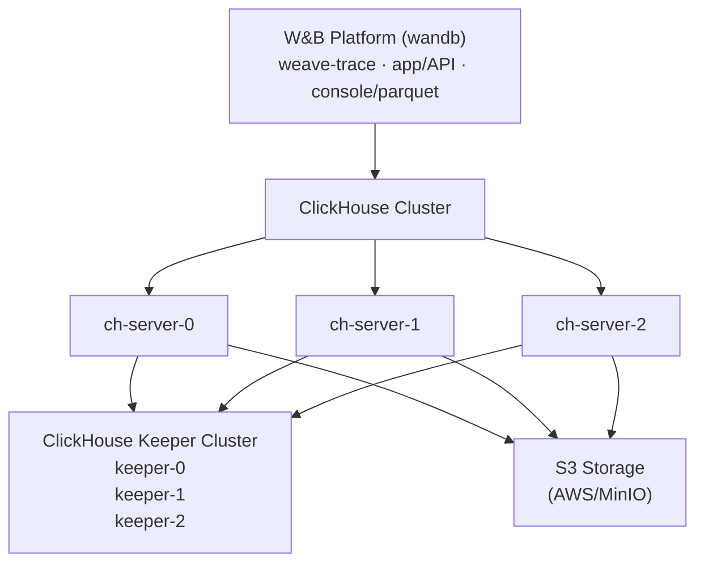

W&amp;B Weave をセルフホストすると、その環境や設定をより細かく制御できます。これにより、より分離された環境を構築し、追加のセキュリティ要件やコンプライアンス要件に対応しやすくなります。このドキュメントでは、Altinity ClickHouse Operator を使用して、セルフマネージド環境で W&amp;B Weave を実行するために必要なコンポーネントをデプロイする方法を説明します。最終的には、レプリケーションされた ClickHouse データベースと S3互換オブジェクトストレージを基盤とする、本番環境対応の Weave インスタンスを独自の Kubernetes クラスター上で稼働させられるようになります。このガイドは、組織内で W&amp;B のデプロイと運用を担当する Kubernetes 管理者およびプラットフォームエンジニアを対象としています。

セルフマネージド Weave のデプロイでは、バックエンドの管理に [ClickHouseDB](https://clickhouse.com/) を使用します。このデプロイでは、次を使用します。

* **Altinity ClickHouse Operator**: Kubernetes 向けのエンタープライズグレードの ClickHouse 管理。
* **ClickHouse Keeper**: 分散コーディネーションサービス (ZooKeeper の代替) 。
* **ClickHouse Cluster**: トレースストレージ向けの高可用性データベースクラスター。
* **S3互換 storage**: ClickHouse データを永続化するためのオブジェクトストレージ。

<Tip>
  詳細なリファレンスアーキテクチャについては、[W&amp;B Self-Managed Reference Architecture](https://docs.wandb.ai/guides/hosting/self-managed/ref-arch/#models-and-weave) を参照してください。
</Tip>

<div id="important-setup-notes">
  ## 重要なセットアップ上の注意
</div>

このガイドの設定例は、あくまで参考用です。各組織の Kubernetes 環境はそれぞれ異なるため、セルフホスト環境では以下の点を調整する必要がある可能性が高くなります。

* **セキュリティとコンプライアンス**: 組織のセキュリティポリシーおよび Kubernetes または OpenShift の要件に合わせて、セキュリティコンテキスト、`runAsUser` または `fsGroup` の値、その他のセキュリティ設定を調整してください。
* **リソースのサイジング**: ここに示すリソース割り当ては出発点にすぎません。想定されるトレース量とパフォーマンス要件に基づく適切なサイジングについては、W&amp;B Solutions Architect チームに相談してください。
* **インフラストラクチャー固有の事項**: ストレージクラス、ノードセレクター、その他のインフラストラクチャー固有の設定を、使用する環境に合わせて更新してください。

これらの設定は、規定のソリューションではなく、テンプレートとして扱ってください。

<div id="architecture">
  ## アーキテクチャ
</div>

次の図は、セルフマネージド Weave デプロイにおいて、W&amp;B Platform、ClickHouse クラスター、ClickHouse Keeper コーディネーションサービス、S3 ストレージがどのように連携するかを示しています。


```mermaid
graph TD
    A["W&B Platform (wandb)<br/>weave-trace · app/API · console/parquet"] --> B["ClickHouse Cluster"]
    B --> C["ch-server-0"]
    B --> D["ch-server-1"]
    B --> E["ch-server-2"]
    C --> F["ClickHouse Keeper Cluster<br/>keeper-0 <br/>keeper-1 <br/>keeper-2"]
    D --> F
    E --> F
    C --> G["S3 Storage<br/>(AWS/MinIO)"]
    D --> G
    E --> G
```

<div id="prerequisites">
  ## 前提条件
</div>

始める前に、お使いの環境が次の要件を満たしていることを確認してください。セルフマネージド Weave インスタンスには、次のリソースが必要です。

* **Kubernetes クラスター**: バージョン 1.29 以降。
* **Kubernetes ノード**: マルチノード クラスター (高可用性のため、少なくとも 3 ノードを推奨) 。
* **Storage class**: 永続ボリューム用の有効な StorageClass (例: `gp3`、`standard`、`nfs-csi`) 。
* **S3 bucket**: 適切なアクセス権限が設定された、事前構成済みの S3 または S3互換バケット。
* **W&amp;B Platform**: すでにインストールされ、稼働していること。[W&amp;B Self-Managed Deployment Guide](https://docs.wandb.ai/guides/hosting/hosting-options/self-managed/)を参照してください。
* **W&amp;B license**: W&amp;B Support が提供する Weave 対応ライセンス。

<Warning>
  この前提条件の一覧だけを基にサイジングを判断しないでください。必要なリソースは、トレース量や使用パターンによって異なります。詳細は、[Resource requirements](#resource-requirements)を参照してください。
</Warning>

<div id="required-tools">
  ### 必須ツール
</div>

インスタンスを設定するには、次のツールが必要です。

* クラスターにアクセスできるよう設定された`kubectl`。
* バージョン3.0以降の`helm`。
* AWS認証情報 (S3を使用する場合) 、またはS3互換ストレージへのアクセス。

<div id="network-requirements">
  ### ネットワーク要件
</div>

Kubernetes クラスターでは、以下のネットワーク設定が必要です。

* `clickhouse` namespace 内の Pod は、`wandb` namespace 内の Pod と通信できる必要があります。
* ClickHouse ノード同士は、ポート `8123`、`9000`、`9009`、`2181` を介して通信できる必要があります。

<div id="deploy-your-self-managed-weave-instance">
  ## セルフマネージド Weave インスタンスをデプロイする
</div>

以下の手順では、operator のデプロイ、ストレージの準備、ClickHouse Keeper と ClickHouse クラスターのデプロイ、さらに W&amp;B Platform で Weave を有効にする方法を順に説明します。各手順は前の手順で作成したリソースを前提としているため、記載された順序どおりに完了してください。

<div id="deploy-the-altinity-clickhouse-operator">
  ### Altinity ClickHouse Operator をデプロイする
</div>

Altinity ClickHouse Operator は、Kubernetes 上の ClickHouse インストールを管理します。先に operator をインストールしておくと、後続のステップで、operator によって調整される ClickHouse Keeper と ClickHouse クラスターのリソースを宣言できるようになります。

<div id="add-the-altinity-helm-repository">
  #### Altinity Helmリポジトリを追加する
</div>

```bash
helm repo add altinity https://helm.altinity.com
helm repo update
```

<div id="create-the-operator-configuration">
  #### Operator の設定を作成
</div>

`ch-operator.yaml` という名前のファイルを作成します。このファイルでは、operator デプロイメントのセキュリティコンテキストとメタデータを定義します。

```yaml
operator:
  image:
    repository: altinity/clickhouse-operator

  # Security context - クラスターの要件に合わせて調整してください
  containerSecurityContext:
    runAsGroup: 0
    runAsNonRoot: true
    runAsUser: 10001 # OpenShift/Kubernetes のセキュリティポリシーに合わせて更新してください
    allowPrivilegeEscalation: false
    capabilities:
      drop:
        - ALL
    privileged: false
    readOnlyRootFilesystem: false

metrics:
  enabled: false

# Name override - 必要に応じてカスタマイズしてください
nameOverride: "wandb"
```

ここで示している `containerSecurityContext` の値は、ほとんどの Kubernetes ディストリビューションで使用できます。OpenShift では、プロジェクトに割り当てられている UID 範囲に合わせて `runAsUser` と `fsGroup` を調整する必要がある場合があります。

<div id="install-the-operator">
  #### operatorをインストールする
</div>

```bash
helm upgrade --install ch-operator altinity/altinity-clickhouse-operator \
  --namespace clickhouse \
  --create-namespace \
  -f ch-operator.yaml
```

<div id="verify-the-operator-installation">
  #### operator がインストールされていることを確認する
</div>

```bash
# operator pod が実行中であることを確認する
kubectl get pods -n clickhouse

# 期待される出力:
# NAME                                 READY   STATUS    RESTARTS   AGE
# ch-operator-wandb-xxxxx              1/1     Running   0          30s

# operator イメージのバージョンを確認する
kubectl get pods -n clickhouse -o jsonpath="{.items[*].spec.containers[*].image}" | \
  tr ' ' '\n' | grep -v 'metrics-exporter' | sort -u

# 期待される出力:
# altinity/clickhouse-operator:0.25.4
```

operator が実行中になったので、ClickHouse クラスターが依存する永続ストレージと調整サービスをプロビジョニングできるようになりました。

<div id="prepare-s3-storage">
  ### S3ストレージを準備する
</div>

ClickHouse では、データの永続化に S3 または S3 互換ストレージが必要です。このステップでは、バケットを作成し、ClickHouse がそのバケットに対してどのように認証するかを設定します。

<div id="create-an-s3-bucket">
  #### S3バケットを作成する
</div>

AWS アカウントまたは S3 互換のストレージプロバイダーで S3バケットを作成します。`[BUCKET-NAME]` をバケット名に、`[REGION]` を AWS リージョンに置き換えてください。

```bash
# AWS の例
aws s3 mb s3://[BUCKET-NAME] --region [REGION]
```

<div id="configure-s3-credentials">
  #### S3認証情報を設定する
</div>

ClickHouse がバケットの読み取りと書き込みを行うには、認証情報が必要です。S3へのアクセス認証情報を指定する方法は2つあります。AWS では、長期間有効なシークレットをクラスターに保存せずに済むため、W&amp;B はオプション A (IRSA) を推奨します。

<div id="option-a-use-aws-iam-roles-irsa-recommended-for-aws">
  ##### オプション A: AWS IAM ロールを使用する (IRSA、AWS では推奨)
</div>

Kubernetes ノードに S3 へのアクセス権を持つ IAM ロールがある場合、ClickHouse は EC2 インスタンスメタデータを使用できます。

```yaml
# ch-server.yaml で以下を設定します:
<use_environment_credentials>true</use_environment_credentials>
```

必須の IAM ポリシー (ノードの IAM ロールにアタッチ) :

```json
{
  "Version": "2012-10-17",
  "Statement": [
    {
      "Effect": "Allow",
      "Action": [
        "s3:GetObject",
        "s3:PutObject",
        "s3:DeleteObject",
        "s3:ListBucket"
      ],
      "Resource": [
        "arn:aws:s3:::[BUCKET-NAME]",
        "arn:aws:s3:::[BUCKET-NAME]/*"
      ]
    }
  ]
}
```

<div id="option-b-use-access-keys">
  ##### オプション B: アクセスキーを使用する
</div>

静的な認証情報を使用する場合は、Kubernetes シークレットを作成します。

`[ACCESS-KEY]` は AWS アクセスキーに、`[SECRET-KEY]` は AWS シークレットキーに置き換えてください。

```bash
kubectl create secret generic aws-creds \
  --namespace clickhouse \
  --from-literal aws_access_key=[ACCESS-KEY] \
  --from-literal aws_secret_key=[SECRET-KEY]
```

次に、ClickHouse がそのシークレットを使用するように設定します (手順 4 の ch-server.yaml の設定を参照) 。

<div id="deploy-clickhouse-keeper">
  ### ClickHouse Keeper をデプロイする
</div>

[ClickHouse Keeper](https://clickhouse.com/docs/guides/sre/keeper/clickhouse-keeper) は、データレプリケーションと分散 DDL クエリの実行を調整するためのシステムです。Step 4 の ClickHouse サーバーは起動時に Keeper に接続するため、ClickHouse クラスターをデプロイする前に Keeper をデプロイする必要があります。

<div id="create-the-keeper-configuration">
  #### Keeper の設定を作成する
</div>

`ch-keeper.yaml` という名前のファイルを作成します。このマニフェストは、anti-affinity、永続ストレージ、および Altinity Operator が Keeper Pod をプロビジョニングする際に使用する設定を含む、3 レプリカの Keeper クラスターを定義します。

```yaml
apiVersion: "clickhouse-keeper.altinity.com/v1"
kind: "ClickHouseKeeperInstallation"
metadata:
  name: wandb
  namespace: clickhouse
  annotations: {}
spec:
  defaults:
    templates:
      podTemplate: default
      dataVolumeClaimTemplate: default

  templates:
    podTemplates:
      - name: keeper
        metadata:
          labels:
            app: clickhouse-keeper
        spec:
          # Pod security context - adjust according to your environment
          securityContext:
            fsGroup: 10001 # Update based on your cluster's security requirements
            fsGroupChangePolicy: Always
            runAsGroup: 0
            runAsNonRoot: true
            runAsUser: 10001 # For OpenShift, use your project's assigned UID range
            seccompProfile:
              type: RuntimeDefault

          # ノード間に Keeper を分散させるための Anti-affinity（HA に推奨）
          # クラスターのサイズと可用性要件に応じてカスタマイズまたは削除してください
          affinity:
            podAntiAffinity:
              requiredDuringSchedulingIgnoredDuringExecution:
                - labelSelector:
                    matchExpressions:
                      - key: "app"
                        operator: In
                        values:
                          - clickhouse-keeper
                  topologyKey: "kubernetes.io/hostname"

          containers:
            - name: clickhouse-keeper
              imagePullPolicy: IfNotPresent
              image: "clickhouse/clickhouse-keeper:25.10"
              # Resource requests - example values, adjust based on workload
              resources:
                requests:
                  memory: "256Mi"
                  cpu: "0.5"
                limits:
                  memory: "2Gi"
                  cpu: "1"

              securityContext:
                allowPrivilegeEscalation: false
                capabilities:
                  drop:
                    - ALL
                privileged: false
                readOnlyRootFilesystem: false

    volumeClaimTemplates:
      - name: data
        metadata:
          labels:
            app: clickhouse-keeper
        spec:
          storageClassName: gp3 # Change to your StorageClass
          accessModes:
            - ReadWriteOnce
          resources:
            requests:
              storage: 10Gi

  configuration:
    clusters:
      - name: keeper # Keeper cluster name - used in service DNS naming
        layout:
          replicasCount: 3
        templates:
          podTemplate: keeper
          dataVolumeClaimTemplate: data

    settings:
      logger/level: "information"
      logger/console: "true"
      listen_host: "0.0.0.0"
      keeper_server/four_letter_word_white_list: "*"
      keeper_server/coordination_settings/raft_logs_level: "information"
      keeper_server/enable_ipv6: "false"
      keeper_server/coordination_settings/async_replication: "true"
```

重要な設定の更新事項:

* **StorageClass**: クラスターで使用可能な StorageClass に合わせて、`storageClassName: gp3` を更新します。
* **セキュリティコンテキスト**: 組織のセキュリティポリシーに準拠するよう、`runAsUser` と `fsGroup` の値を調整します。
* **Anti-Affinity**: クラスターのトポロジと HA 要件に応じて、`affinity` セクションをカスタマイズするか削除します。
* **リソース**: CPU とメモリの値はあくまで例です。適切なサイジングについては、W&amp;B Solutions Architects に相談してください。
* **命名**: `metadata.name` または `configuration.clusters[0].name` を変更する場合は、それに合わせて `ch-server.yaml` (Step 4) 内の Keeper ホスト名を必ず更新してください。

<div id="deploy-clickhouse-keeper-resources">
  #### ClickHouse Keeperをデプロイする
</div>

```bash
kubectl apply -f ch-keeper.yaml
```

<div id="verify-the-keeper-deployment">
  #### Keeper のデプロイを確認する
</div>

```bash
# Keeper podを確認する
kubectl get pods -n clickhouse -l app=clickhouse-keeper

# 期待される出力:
# NAME                     READY   STATUS    RESTARTS   AGE
# chk-wandb-keeper-0-0-0   1/1     Running   0          2m
# chk-wandb-keeper-0-1-0   1/1     Running   0          2m
# chk-wandb-keeper-0-2-0   1/1     Running   0          2m

# Keeperサービスを確認する
kubectl get svc -n clickhouse | grep keeper

# ポート2181でKeeperサービスが表示されることを確認する
```

Keeper が稼働しているので、これを協調サービスとして使用する ClickHouse クラスターをデプロイできるようになりました。

<div id="deploy-the-clickhouse-cluster">
  ### ClickHouse クラスターをデプロイする
</div>

次に、Weave Trace Data を保存する ClickHouse サーバークラスタをデプロイします。このステップは、クラスターがステップ 3 の Keeper サービスとステップ 2 の S3 バケットの両方に接続するため、このガイドの中で最も大がかりなステップです。

<div id="create-the-clickhouse-server-configuration">
  #### ClickHouse サーバー設定を作成する
</div>

`ch-server.yaml` という名前のファイルを作成します。このマニフェストでは、ClickHouse クラスター、Keeper への接続、Weave ユーザーアカウント、そしてトレースデータに使用する S3 ストレージポリシーを定義します:

```yaml
apiVersion: "clickhouse.altinity.com/v1"
kind: "ClickHouseInstallation"
metadata:
  name: wandb
  namespace: clickhouse
  annotations: {}
spec:
  defaults:
    templates:
      podTemplate: default
      dataVolumeClaimTemplate: default

  templates:
    podTemplates:
      - name: clickhouse
        metadata:
          labels:
            app: clickhouse-server
        spec:
          # Pod security context - customize for your environment
          securityContext:
            fsGroup: 10001 # Adjust based on your security policies
            fsGroupChangePolicy: Always
            runAsGroup: 0
            runAsNonRoot: true
            runAsUser: 10001 # For OpenShift, use assigned UID range
            seccompProfile:
              type: RuntimeDefault

          # Anti-affinity rule - ensures servers run on different nodes (optional but recommended)
          # Adjust or remove based on your cluster size and requirements
          affinity:
            podAntiAffinity:
              requiredDuringSchedulingIgnoredDuringExecution:
                - labelSelector:
                    matchExpressions:
                      - key: "app"
                        operator: In
                        values:
                          - clickhouse-server
                  topologyKey: "kubernetes.io/hostname"

          containers:
            - name: clickhouse
              image: clickhouse/clickhouse-server:25.10
              # Example resource allocation - adjust based on workload
              resources:
                requests:
                  memory: 1Gi
                  cpu: 1
                limits:
                  memory: 16Gi
                  cpu: 4

              # AWS credentials (remove this section if using IRSA)
              env:
                - name: AWS_ACCESS_KEY_ID
                  valueFrom:
                    secretKeyRef:
                      name: aws-creds
                      key: aws_access_key
                - name: AWS_SECRET_ACCESS_KEY
                  valueFrom:
                    secretKeyRef:
                      name: aws-creds
                      key: aws_secret_key

              securityContext:
                allowPrivilegeEscalation: false
                capabilities:
                  drop:
                    - ALL
                privileged: false
                readOnlyRootFilesystem: false

    volumeClaimTemplates:
      - name: data
        metadata:
          labels:
            app: clickhouse-server
        spec:
          accessModes:
            - ReadWriteOnce
          resources:
            requests:
              storage: 50Gi
          storageClassName: gp3 # Change to your StorageClass

  configuration:
    # Keeper (ZooKeeper) configuration
    # IMPORTANT: These hostnames MUST match your Keeper deployment from Step 3
    zookeeper:
      nodes:
        - host: chk-wandb-keeper-0-0.clickhouse.svc.cluster.local
          port: 2181
        - host: chk-wandb-keeper-0-1.clickhouse.svc.cluster.local
          port: 2181
        - host: chk-wandb-keeper-0-2.clickhouse.svc.cluster.local
          port: 2181
      # Optional: Uncomment to adjust timeouts if needed
      # session_timeout_ms: 30000
      # operation_timeout_ms: 10000

    # Users configuration: https://clickhouse.com/docs/operations/configuration-files#user-settings
    # For production, use a SHA-256 hashed password instead of plain text:
    # printf "your-password" | sha256sum
    # Then use: weave/password_sha256_hex: <hash> instead of weave/password
    users:
      weave/password: [WEAVE-PASSWORD]  # デプロイ前に強力なパスワードに置き換えてください
      weave/access_management: 1
      weave/profile: default
      weave/networks/ip:
        - "0.0.0.0/0"
        - "::"

    # Server settings
    settings:
      disable_internal_dns_cache: 1

    # Cluster configuration
    clusters:
      - name: weavecluster # Cluster name - can be customized but must match wandb-cr.yaml
        layout:
          shardsCount: 1
          replicasCount: 3 # Number of replicas - adjust based on HA requirements
        templates:
          podTemplate: clickhouse
          dataVolumeClaimTemplate: data

    # Configuration files
    files:
      config.d/network_configuration.xml: |
        <clickhouse>
            <listen_host>0.0.0.0</listen_host>
            <listen_host>::</listen_host>
        </clickhouse>

      config.d/logger.xml: |
        <clickhouse>
            <logger>
                <level>information</level>
            </logger>
        </clickhouse>

      config.d/storage_configuration.xml: |
        <clickhouse>
            <storage_configuration>
                <disks>
                    <s3_disk>
                        <type>s3</type>
                        <!-- S3バケットのエンドポイントとリージョンを更新してください -->
                        <endpoint>https://[BUCKET-NAME].s3.[REGION].amazonaws.com/s3_disk/{replica}</endpoint>
                        <metadata_path>/var/lib/clickhouse/disks/s3_disk/</metadata_path>
                        <use_environment_credentials>true</use_environment_credentials>
                        <region>[REGION]</region>
                    </s3_disk>
                    <s3_disk_cache>
                        <type>cache</type>
                        <disk>s3_disk</disk>
                        <path>/var/lib/clickhouse/s3_disk_cache/cache/</path>
                        <!-- Cache size MUST be smaller than persistent volume -->
                        <max_size>40Gi</max_size>
                        <cache_on_write_operations>true</cache_on_write_operations>
                    </s3_disk_cache>
                </disks>
                <policies>
                    <s3_main>
                        <volumes>
                            <main>
                                <disk>s3_disk_cache</disk>
                            </main>
                        </volumes>
                    </s3_main>
                </policies>
            </storage_configuration>
            <merge_tree>
                <storage_policy>s3_main</storage_policy>
            </merge_tree>
        </clickhouse>
```

重要な設定更新が必要です。

1. **StorageClass**: `storageClassName: gp3` を、お使いのクラスターの StorageClass に合わせて更新します。
2. **S3 endpoint**: `[BUCKET-NAME]` と `[REGION]` を実際の値に置き換えます。
3. **Cache size**: `<max_size>40Gi</max_size>` は、永続ボリュームのサイズ (50Gi) より小さくする必要があります。
4. **セキュリティコンテキスト**: `runAsUser`、`fsGroup`、およびその他のセキュリティ設定を、組織のポリシーに合わせて調整します。
5. **Resource allocation**: CPU とメモリの値はあくまで例です。想定されるトレース量に基づく適切なサイジングについては、W&amp;B Solutions Architect に相談してください。
6. **Anti-affinity rules**: クラスターのトポロジと高可用性の要件に応じて、カスタマイズするか削除します。
7. **Keeper hostnames**: Keeper ノードのホスト名は、ステップ 3 の Keeper デプロイメントの命名 (「Keeper naming」) と一致している必要があります。
8. **Cluster naming**: クラスター名 `weavecluster` は変更できますが、ステップ 5 の `WF_CLICKHOUSE_REPLICATED_CLUSTER` の値と一致している必要があります。
9. **Credentials**:
   * IRSA の場合: `<use_environment_credentials>true</use_environment_credentials>` をそのまま使用するか、環境変数にマッピングされたシークレットキーを使用します。

<div id="update-the-s3-configuration">
  #### S3 の設定を更新する
</div>

`ch-server.yaml` の `storage_configuration.xml` セクションを編集します。

AWS S3 の設定例:

```xml
<endpoint>https://my-wandb-clickhouse.s3.eu-central-1.amazonaws.com/s3_disk/{replica}</endpoint>
<region>eu-central-1</region>
```

MinIOの例:

```xml
<endpoint>https://minio.example.com:9000/my-bucket/s3_disk/{replica}</endpoint>
<region>us-east-1</region>
```

<Warning>
  `{replica}` は削除しないでください。これにより、各 ClickHouse レプリカが bucket 内のそれぞれ専用のフォルダに書き込むようになります。
</Warning>

<div id="configure-credentials-option-b-only">
  #### 認証情報を設定する (Option B のみ)
</div>

Step 2 の **Option B (アクセスキー)&#x20;**&#x20;を使用する場合は、`ch-server.yaml` の `env` セクションでそのシークレットを参照していることを確認してください。

```yaml
env:
  - name: AWS_ACCESS_KEY_ID
    valueFrom:
      secretKeyRef:
        name: aws-creds
        key: aws_access_key
  - name: AWS_SECRET_ACCESS_KEY
    valueFrom:
      secretKeyRef:
        name: aws-creds
        key: aws_secret_key
```

Option A (IRSA) を使用する場合は、`env` セクション全体を削除してください。

<div id="keeper-naming">
  #### Keeper の命名
</div>

Keeper のホスト名を正しく設定することは非常に重要です。ステップ 3 で作成したサービスと一致しない場合、ClickHouse は起動しません。`zookeeper.nodes` セクション内の Keeper ノードのホスト名は、ステップ 3 でデプロイした Keeper に基づく所定のパターンに従います。

ホスト名のパターン: `chk-[INSTALLATION-NAME]-[CLUSTER-NAME]-[CLUSTER-INDEX]-[REPLICA-INDEX].[NAMESPACE].svc.cluster.local`

各項目の意味:

* `chk` は ClickHouseKeeperInstallation の接頭辞です (固定) 。
* `[INSTALLATION-NAME]` は `ch-keeper.yaml` の `metadata.name` です (例: `wandb`) 。
* `[CLUSTER-NAME]` は `ch-keeper.yaml` の `configuration.clusters[0].name` です (例: `keeper`) 。
* `[CLUSTER-INDEX]` はクラスターのインデックスで、単一クラスターの場合は通常 `0` です。
* `[REPLICA-INDEX]` はレプリカ番号です。3 レプリカの場合は `0`、`1`、`2` になります。
* `[NAMESPACE]` は Kubernetes の名前空間です (例: `clickhouse`) 。

デフォルト名を使用した例:

```text
chk-wandb-keeper-0-0.clickhouse.svc.cluster.local
chk-wandb-keeper-0-1.clickhouse.svc.cluster.local
chk-wandb-keeper-0-2.clickhouse.svc.cluster.local
```

Keeper のインストール名をカスタマイズした場合 (例: `metadata.name: myweave`) :

```text
chk-myweave-keeper-0-0.clickhouse.svc.cluster.local
chk-myweave-keeper-0-1.clickhouse.svc.cluster.local
chk-myweave-keeper-0-2.clickhouse.svc.cluster.local
```

Keeper のクラスター名 (たとえば `clusters[0].name: coordination`) をカスタマイズする場合:

```text
chk-wandb-coordination-0-0.clickhouse.svc.cluster.local
chk-wandb-coordination-0-1.clickhouse.svc.cluster.local
chk-wandb-coordination-0-2.clickhouse.svc.cluster.local
```

実際に使用している Keeper ホスト名を確認するには:

```bash
# Keeper サービスを一覧表示して実際の名前を確認する
kubectl get svc -n clickhouse | grep keeper

# Keeper Pod を一覧表示して命名パターンを確認する
kubectl get pods -n clickhouse -l app=clickhouse-keeper
```

<Note>
  `ch-server.yaml` 内の Keeper ホスト名は、Keeper のデプロイによって作成された実際のサービス名と完全に一致している必要があります。一致していない場合、ClickHouse サーバーはコーディネーションサービスへの接続に失敗します。
</Note>

<div id="deploy-the-clickhouse-cluster-resources">
  #### ClickHouse クラスターのリソースをデプロイする
</div>

```bash
kubectl apply -f ch-server.yaml
```

<div id="verify-the-clickhouse-deployment">
  #### ClickHouse デプロイを確認する
</div>

```bash
# ClickHouse podを確認する
kubectl get pods -n clickhouse -l app=clickhouse-server

# 期待される出力:
# NAME                           READY   STATUS    RESTARTS   AGE
# chi-wandb-weavecluster-0-0-0   1/1     Running   0          3m
# chi-wandb-weavecluster-0-1-0   1/1     Running   0          3m
# chi-wandb-weavecluster-0-2-0   1/1     Running   0          3m

# ClickHouseの接続性をテストする
kubectl exec -n clickhouse chi-wandb-weavecluster-0-0-0 -- \
  clickhouse-client --user weave --password [WEAVE-PASSWORD] --query "SELECT version()"

# クラスターのステータスを確認する
kubectl exec -n clickhouse chi-wandb-weavecluster-0-0-0 -- \
  clickhouse-client --user weave --password [WEAVE-PASSWORD] --query \
  "SELECT cluster, host_name, port FROM system.clusters WHERE cluster='weavecluster'"
```

この時点で、Keeper と S3 をバックエンドとする ClickHouse クラスターが稼働しています。残りの手順では、W&amp;B Platform をそのクラスターに接続し、Weave のトレースがエンドツーエンドで流れることを確認します。

<div id="enable-weave-in-the-wb-platform">
  ### W&amp;B Platform で Weave を有効にする
</div>

次に、Weave のトレースで ClickHouse クラスターを使用するように、W&amp;B Platform を設定します。このステップでは、外部で管理されている ClickHouse の場所を W&amp;B operator に指定し、`weave-trace` サービスを有効にします。

<div id="gather-clickhouse-connection-information">
  #### ClickHouse の接続情報を確認する
</div>

必要な情報は次のとおりです。

* **ホスト**: `clickhouse-wandb.clickhouse.svc.cluster.local`
* **ポート**: `8123`
* **ユーザー**: `weave` (`ch-server.yaml` で設定)
* **パスワード**: `ch-server.yaml` で設定したパスワード
* **データベース**: `weave` (自動的に作成されます)
* **クラスター名**: `weavecluster` (`ch-server.yaml` で設定)

ホスト名は次のパターンに従います: `clickhouse-[INSTALLATION-NAME].[NAMESPACE].svc.cluster.local`

<div id="update-the-wb-custom-resource">
  #### W&amp;B Custom Resource を更新する
</div>

Weave の設定を追加するには、W&amp;B Platform の Custom Resource (CR) を編集します。

```yaml
apiVersion: apps.wandb.com/v1
kind: WeightsAndBiases
metadata:
  name: wandb
  namespace: wandb
spec:
  values:
    global:
      # ... 既存の設定 ...

      # ClickHouse の設定を追加する
      clickhouse:
        install: false # 別途デプロイ済み
        host: clickhouse-wandb.clickhouse.svc.cluster.local
        port: 8123
        user: weave
        password: [WEAVE-PASSWORD]
        database: weave
        replicated: true # マルチレプリカ構成では必須

      # Weave Trace を有効にする
      weave-trace:
        enabled: true

    # Weave Trace の設定
    weave-trace:
      install: true
      extraEnv:
        WF_CLICKHOUSE_REPLICATED: "true"
        WF_CLICKHOUSE_REPLICATED_CLUSTER: "weavecluster"
      image:
        repository: wandb/weave-trace
        tag: 0.74.1
      replicaCount: 1
      size: "default"
      sizing:
        default:
          autoscaling:
            horizontal:
              enabled: false
          # リソース割り当ての例 - ワークロードに応じて調整してください
          resources:
            limits:
              cpu: 4
              memory: "8Gi"
            requests:
              cpu: 1
              memory: "4Gi"
      # Pod セキュリティコンテキスト - 環境に合わせてカスタマイズしてください
      podSecurityContext:
        fsGroup: 10001 # セキュリティ要件に応じて調整してください
        fsGroupChangePolicy: Always
        runAsGroup: 0
        runAsNonRoot: true
        runAsUser: 10001 # OpenShift の場合は割り当てられた UID 範囲を使用してください
        seccompProfile:
          type: RuntimeDefault
      # コンテナーセキュリティコンテキスト
      securityContext:
        allowPrivilegeEscalation: false
        capabilities:
          drop:
            - ALL
        privileged: false
        readOnlyRootFilesystem: false
```

重要な設定:

* `clickhouse.replicated: true`: 3 レプリカを使用する場合は必須です。
* `WF_CLICKHOUSE_REPLICATED: "true"`: レプリケーション構成では必須です。
* `WF_CLICKHOUSE_REPLICATED_CLUSTER: "weavecluster"`: `ch-server.yaml` のクラスター名と一致する必要があります。

<Note>
  ここに示したセキュリティコンテキスト、リソース割り当て、およびその他の Kubernetes 固有の設定は参考例です。組織の要件に合わせて適宜カスタマイズし、適切なリソースサイジングについては W&amp;B Solutions Architect チームに相談してください。
</Note>

<div id="apply-the-updated-configuration">
  #### 更新した設定を適用する
</div>

```bash
kubectl apply -f wandb-cr.yaml
```

<div id="verify-the-weave-trace-deployment">
  #### Weave Trace のデプロイを確認する
</div>

```bash
# Check weave-trace pod status
kubectl get pods -n wandb | grep weave-trace

# Expected output:
# wandb-weave-trace-bc-xxxxx   1/1     Running   0          2m

# Check weave-trace logs for ClickHouse connection
kubectl logs -n wandb [WEAVE-TRACE-POD-NAME] --tail=50

# Look for successful ClickHouse connection messages
```

<div id="initialize-the-weave-database">
  ### Weave データベースを初期化する
</div>

weave-trace サービスは、初回起動時に必要なデータベーススキーマを自動的に作成します。このステップでは、Weave をエンドユーザーに公開する前に、移行が正常に完了していることを確認します。

<div id="monitor-the-database-migration">
  #### データベースの移行を監視する
</div>

```bash
# 起動中に weave-trace のログを監視する
kubectl logs -n wandb [WEAVE-TRACE-POD-NAME] -f

# データベースの初期化が成功したことを示す移行メッセージを確認する
```

<div id="verify-database-creation">
  #### データベースが作成されていることを確認します
</div>

```bash
# ClickHouseに接続してデータベースを確認する
kubectl exec -n clickhouse chi-wandb-weavecluster-0-0-0 -- \
  clickhouse-client --user weave --password [WEAVE-PASSWORD] --query \
  "SHOW DATABASES"

# 'weave' データベースが一覧に表示されることを確認する

# weave データベースのテーブルを確認する
kubectl exec -n clickhouse chi-wandb-weavecluster-0-0-0 -- \
  clickhouse-client --user weave --password [WEAVE-PASSWORD] --query \
  "SHOW TABLES FROM weave"
```

<div id="verify-that-weave-is-enabled">
  ### Weave が有効になっていることを確認する
</div>

この最後の手順では、Weave にライセンスが付与されており、W&amp;B Console からアクセスでき、クライアント SDK からのトレースを記録できることを確認します。

<div id="access-the-wb-console">
  #### W&amp;B Console にアクセスする
</div>

Webブラウザで W&amp;B インスタンスの URL にアクセスします。

<div id="check-the-weave-license-status">
  #### Weave ライセンスの状態を確認する
</div>

W&amp;B Console で:

1. **Top Right Menu** &gt; **Organization Dashboard** に移動します。
2. **Weave access** が有効になっていることを確認します。

<div id="test-weave-functionality">
  #### Weave の機能をテストする
</div>

Weave が正しく動作していることを確認するために、Python テストを作成します。

```python
import os
import weave

# セルフマネージドのW&BインスタンスにWeaveを接続する
os.environ["WANDB_BASE_URL"] = "https://[WANDB-HOST]"  # W&BのURLに置き換えてください

weave.init('test-project')

# シンプルなトレース対象の関数を作成する
@weave.op()
def hello_weave(name: str) -> str:
    return f"Hello, {name}!"

# 関数を呼び出す
result = hello_weave("World")
print(result)
```

これを実行したら、組織内の W&amp;B UI の traces ページでトレースを確認してください。トレースが表示されたら、セルフマネージドの Weave デプロイは正常に稼働しています。

<div id="troubleshooting">
  ## トラブルシューティング
</div>

以下のセクションでは、症状が最初に現れたコンポーネントごとに、よくあるデプロイの問題とその解決方法を説明します。

<div id="clickhouse-keeper-issues">
  ### ClickHouse Keeper の問題
</div>

**問題**: Keeper pod が `Pending` 状態のままになっている

**解決策**: 考えられる複数の原因を確認します。

1. **PVC と StorageClass の問題**:

```bash
kubectl get pvc -n clickhouse
kubectl describe pvc -n clickhouse
```

StorageClass が正しく設定され、十分な空き容量があることを確認してください。

2. **アンチアフィニティとノードの可用性**:

```bash
# アンチアフィニティルールによってスケジューリングが妨げられていないか確認する
kubectl describe pod -n clickhouse [POD-NAME] | grep -A 10 "Events:"

# 利用可能なノードとそのリソースを確認する
kubectl get nodes
kubectl describe nodes | grep -A 5 "Allocated resources"
```

よくある問題:

* アンチアフィニティでは 3 つの別々のノードが必要ですが、クラスター内のノード数が不足している
* ノードに、pod の要求を満たすのに十分な CPU / メモリがない
* ノードの taint によって pod をスケジュールできない

**解決策**:

* ノード数が 3 未満の場合は、アンチアフィニティルールを削除または調整する
* より緩やかなアンチアフィニティにするには、`requiredDuringSchedulingIgnoredDuringExecution` ではなく `preferredDuringSchedulingIgnoredDuringExecution` を使用する
* ノードのリソースが不足している場合は、リソース要求を減らす
* クラスターにノードを追加する

***

**問題**: Keeper pod が `CrashLoopBackOff` になる

**解決策**: ログを確認し、設定を検証する:

```bash
kubectl logs -n clickhouse [KEEPER-POD-NAME]
```

よくある問題:

* セキュリティコンテキストの誤り (`runAsUser` と `fsGroup` を確認)。
* ボリュームの権限に関する問題。
* ポートの競合。
* `ch-keeper.yaml` の設定エラー。

<div id="clickhouse-server-issues">
  ### ClickHouse サーバーの問題
</div>

**問題**: ClickHouse が S3 に接続できません

**解決策**: S3 の認証情報と権限を確認してください。

```bash
# シークレットが存在するか確認する（アクセスキーを使用している場合）
kubectl get secret aws-creds -n clickhouse

# S3エラーのClickHouseログを確認する
kubectl logs -n clickhouse [CLICKHOUSE-POD-NAME] | grep -i s3

# ストレージ設定のS3エンドポイントを確認する
kubectl get chi wandb -n clickhouse -o yaml | grep -A 10 storage_configuration
```

***

**問題**: ClickHouse が Keeper に接続できません

**解決策**: Keeper の endpoints と Naming を確認してください:

```bash
# Keeperサービスと実際のサービス名を確認する
kubectl get svc -n clickhouse | grep keeper

# Keeper podを確認して命名パターンを検証する
kubectl get pods -n clickhouse -l app=clickhouse-keeper

# ch-server.yamlのzookeeper.nodes設定と比較する
# ホスト名は実際のサービス名と完全に一致している必要がある

# ClickHouseのログで接続エラーを確認する
kubectl logs -n clickhouse chi-wandb-weavecluster-0-0-0 | grep -i keeper
```

接続に失敗する場合は、`ch-server.yaml` 内の Keeper ホスト名が実際の Keeper デプロイと一致していない可能性があります。命名規則については、ステップ 4 の &quot;Keeper の命名規則&quot; を参照してください。

<div id="weave-trace-issues">
  ### Weave Trace の問題
</div>

**問題**: `weave-trace` pod が起動しない

**解決策**: ClickHouse への接続を確認してください:

```bash
# weave-trace pod 名を取得する
kubectl get pods -n wandb | grep weave-trace

# weave-trace のログを確認する
kubectl logs -n wandb [WEAVE-TRACE-POD-NAME]

# よくあるエラー: "connection refused" または "authentication failed"
# wandb-cr.yaml の ClickHouse 認証情報が ch-server.yaml と一致していることを確認する
```

***

**問題**: Console で Weave が有効と表示されない

**解決策**: 設定を確認します。

1. ライセンスに Weave が含まれていることを確認します。

   ```bash
   kubectl get secret license-key -n wandb -o jsonpath='{.data.value}' | base64 -d | jq
   ```

2. `wandb-cr.yaml` で `weave-trace.enabled: true` と `clickhouse.replicated: true` が設定されていることを確認します。

3. W&amp;B operator のログを確認します。
   ```bash
   kubectl logs -n wandb deployment/wandb-controller-manager
   ```

***

**問題**: データベースの移行に失敗する

**解決策**: クラスター名が一致していることを確認します。

`WF_CLICKHOUSE_REPLICATED_CLUSTER` 環境変数は、`ch-server.yaml` 内のクラスター名と一致している必要があります:

```yaml
# ch-server.yaml 内:
clusters:
  - name: weavecluster # <-- このクラスター名

# wandb-cr.yaml 内で一致している必要があります:
weave-trace:
  extraEnv:
    WF_CLICKHOUSE_REPLICATED_CLUSTER: "weavecluster" # <-- この値
```

<div id="resource-requirements">
  ## リソース要件
</div>

このセクションでは、一般的な 2 つのデプロイメントプロファイルに対するリソース割り当ての例を示します。クラスターを計画する際の開始点として使用し、観測されたワークロードに基づいて数値を調整してください。

<Warning>
  このセクションのリソース割り当ては、あくまで開始時の目安の一例です。実際に必要となる要件は、以下の要因によって異なります。

  * トレース取り込み量 (1 秒あたりのトレース数)
  * クエリパターンと同時実行数
  * データ保持期間
  * 同時接続ユーザー数

  ご利用のユースケースに適したサイジングを判断するため、**必ず W&amp;B の Solutions Architect チームに相談してください**。リソースが不足するとパフォーマンス上の問題につながる可能性があり、逆に過剰に割り当てるとインフラストラクチャーコストの無駄になります。
</Warning>

<div id="minimum-production-setup">
  ### 本番環境の最小構成
</div>

| コンポーネント           | レプリカ数      | CPU (request、limit)  | メモリ (request、limit)  | ストレージ     |
| ----------------- | ---------- | -------------------- | -------------------- | --------- |
| ClickHouse Keeper | 3          | 0.5, 1               | 256Mi, 2Gi           | 各 10Gi    |
| ClickHouse Server | 3          | 1, 4                 | 1Gi, 16Gi            | 各 50Gi    |
| Weave Trace       | 1          | 1, 4                 | 4Gi, 8Gi             | -         |
| **合計**            | **7 pods** | **約 4.5, 15 CPU**    | **約 7.8Gi, 58Gi**    | **180Gi** |

開発、テスト、またはトラフィック量が少ない本番環境に適しています。

<div id="recommended-production-setup">
  ### 推奨される本番構成
</div>

トレース量が多い本番ワークロード向け:

| コンポーネント           | レプリカ数         | CPU (リクエスト、上限)          | メモリ (リクエスト、上限)              | ストレージ     |
| ----------------- | ------------- | ----------------------- | --------------------------- | --------- |
| ClickHouse Keeper | 3             | 1, 2                    | 1Gi, 4Gi                    | 各20Gi     |
| ClickHouse Server | 3             | 1, 16                   | 8Gi, 64Gi                   | 各200Gi    |
| Weave Trace       | 2 ～ 3         | 1, 4                    | 4Gi, 8Gi                    | -         |
| **合計**            | **8 ～ 9 pod** | **~6 ～ 9, 52 ～ 64 CPU** | **~27 ～ 33Gi, 204 ～ 216Gi** | **660Gi** |

高トレース量の本番環境に適しています。

超高ボリュームのデプロイについては、トレース量やパフォーマンス要件に応じたカスタムのサイジング推奨事項について、W&amp;B Solutions Architect チームにお問い合わせください。

<div id="advanced-configuration">
  ## 高度な設定
</div>

このセクションでは、セルフマネージドの Weave デプロイ向けのカスタマイズ オプションについて説明します。これには、垂直スケーリングまたは水平スケーリングによる ClickHouse 容量の拡張、keeper と server の両方の設定でイメージタグを変更して ClickHouse のバージョンを更新すること、さらに ClickHouse の健全性を監視することが含まれます。

インスタンスに高度な変更を加える際は、それらの変更がパフォーマンス要件と信頼性要件に適合していることを確認するため、W&amp;B は W&amp;B Solutions Architect チームに相談することをお勧めします。

<div id="scale-clickhouse">
  ### ClickHouse をスケールする
</div>

ClickHouse の容量を増やすには、次の方法があります。

1. **垂直スケーリング**: pod ごとのリソースを増やします (より簡単な方法)。

   ```yaml
   resources:
     requests:
       memory: 8Gi
       cpu: 1
     limits:
       memory: 64Gi
       cpu: 16
   ```

   推奨事項: 実際のリソース使用量を監視し、それに応じてスケールしてください。非常に大規模なデプロイを行う場合は、W&amp;B Solutions Architect チームにお問い合わせください。

2. **水平スケーリング**: レプリカを追加します (慎重な計画が必要です)。
   * レプリカを増やすには、データの再分散が必要です。
   * シャード管理については ClickHouse のドキュメントを参照してください。
   * 本番環境で水平スケーリングを実施する前に、W&amp;B Solutions Architect にお問い合わせください。

<div id="use-a-different-clickhouse-version">
  ### 異なるバージョンの ClickHouse を使用する
</div>

別のバージョンの ClickHouse を使用するには、`ch-keeper.yaml` と `ch-server.yaml` の両方でイメージタグを更新します。

```yaml
image: clickhouse/clickhouse-keeper:25.10   # Keeper のバージョン
image: clickhouse/clickhouse-server:25.10   # Server のバージョン
```

互換性を確保するには、Keeper とサーバーのバージョンを一致させるか、Keeper のバージョンをサーバーのバージョン以上にする必要があります。

<div id="monitor-clickhouse">
  ### ClickHouse を監視する
</div>

監視には、ClickHouse のシステムテーブルにアクセスします。

```bash
# ディスク使用量を確認する
kubectl exec -n clickhouse chi-wandb-weavecluster-0-0-0 -- \
  clickhouse-client --user weave --password [WEAVE-PASSWORD] --query \
  "SELECT name, path, formatReadableSize(free_space) as free, formatReadableSize(total_space) as total FROM system.disks"

# レプリケーションのステータスを確認する
kubectl exec -n clickhouse chi-wandb-weavecluster-0-0-0 -- \
  clickhouse-client --user weave --password [WEAVE-PASSWORD] --query \
  "SELECT database, table, is_leader, total_replicas, active_replicas FROM system.replicas WHERE database='weave'"

# ClickHouse サーバーのステータスを確認する
kubectl get pods -n clickhouse -l app=clickhouse-server
```

<div id="backup-and-recovery">
  ### バックアップとリカバリ
</div>

ClickHouse のデータは S3 に保存されており、S3 のバージョン管理とバケットレプリケーション機能により、標準でバックアップ機能を利用できます。ご利用のデプロイに応じたバックアップ戦略については、W&amp;B Solutions Architect チームに相談し、[ClickHouse のバックアップドキュメント](https://clickhouse.com/docs/en/operations/backup)を参照してください。

<div id="security-considerations">
  ## セキュリティに関する考慮事項
</div>

本番デプロイでは、このガイドで示しているデフォルト設定を強化する必要があります。以下に、セキュリティチームと確認すべき重要な項目を示します。

1. **Credentials**: ClickHouse のパスワードは、プレーンテキストではなく Kubernetes シークレットに保存してください。
2. **Network policies**: ClickHouse へのアクセスを制限するため、NetworkPolicies の実装を検討してください。
3. **RBAC**: サービスアカウントには、必要最小限の権限のみを付与してください。
4. **S3 bucket**: 保存時の暗号化を有効にし、bucket へのアクセスは必要な IAM ロールのみに制限してください。
5. **TLS**: 任意です。本番環境では、ClickHouse クライアント接続で TLS を有効にしてください。

<div id="upgrade">
  ## アップグレード
</div>

以下の手順では、operator、ClickHouse サーバー、Weave Trace コンポーネントの日常的なアップグレードについて説明します。コンポーネントは一度に 1 つずつアップグレードし、次に進む前に deployment が正常な状態であることを確認してください。

<div id="upgrade-the-clickhouse-operator">
  ### ClickHouse Operator のアップグレード
</div>

```bash
helm upgrade ch-operator altinity/altinity-clickhouse-operator \
  --namespace clickhouse \
  -f ch-operator.yaml
```

<div id="upgrade-clickhouse-server">
  ### ClickHouse Server のアップグレード
</div>

`ch-server.yaml` のイメージのバージョンを更新して、適用します:

```bash
# ch-server.yaml を編集してイメージタグを変更する
kubectl apply -f ch-server.yaml

# pod を監視する
kubectl get pods -n clickhouse
```

<div id="upgrade-weave-trace">
  ### Weave Trace のアップグレード
</div>

`wandb-cr.yaml` のイメージタグを更新して、適用します。

```bash
kubectl apply -f wandb-cr.yaml

# weave-trace pod の再起動を監視する
kubectl get pods -n wandb | grep weave-trace
```

<div id="additional-resources">
  ## 参考資料
</div>

* [Altinity ClickHouse Operator ドキュメント](https://docs.altinity.com/altinitykubernetesoperator/)
* [ClickHouse ドキュメント](https://clickhouse.com/docs)
* [W&amp;B Weave ドキュメント](https://docs.wandb.ai/weave)
* [ClickHouse S3 ストレージ設定](https://clickhouse.com/docs/en/engines/table-engines/mergetree-family/mergetree#s3-virtual-hosted-style)

<div id="support">
  ## サポート
</div>

本番デプロイや問題がある場合:

* **W&amp;B サポート**: `support@wandb.com`
* **ソリューションアーキテクト**: 超大規模デプロイ、カスタムサイジング、デプロイ計画について。
* **サポートへの問い合わせに含める内容**:
  * `weave-trace`、ClickHouse pod、operator のログ。
  * W&amp;B バージョン、ClickHouse バージョン、Kubernetes バージョン。
  * クラスター情報とトレース量。

<div id="faq">
  ## FAQ
</div>

**Q: 3 つではなく 1 つの ClickHouse レプリカを使用できますか？**

A: はい。ただし、本番環境では推奨されません。`ch-server.yaml` で `replicasCount: 1` に更新し、`wandb-cr.yaml` で `clickhouse.replicated: false` を設定してください。

**Q: ClickHouse の代わりに別のデータベースを使用できますか？**

A: いいえ。Weave Trace では、高パフォーマンスな列指向ストレージを実現するために ClickHouse が必要です。

**Q: S3 ストレージはどのくらい必要ですか？**

A: S3 ストレージの要件は、トレース量、保持期間、データ圧縮によって異なります。デプロイ後に実際の使用量をモニターし、それに応じて調整してください。ClickHouse の列指向フォーマットは、トレースデータを効率的に圧縮します。

**Q: ClickHouse で `database` 名を設定する必要がありますか？**

A: いいえ。weave-trace サービスは、初回起動時に `weave` データベースを自動的に作成します。

**Q: クラスター名が `weavecluster` でない場合はどうなりますか？**

A: クラスター名に一致するように `WF_CLICKHOUSE_REPLICATED_CLUSTER` 環境変数を設定する必要があります。そうしないと、データベース移行が失敗します。

**Q: 例に示されているセキュリティコンテキストをそのまま使用する必要がありますか？**

A: いいえ。このガイドで示している `runAsUser` や `fsGroup` などのセキュリティコンテキストは参考例です。特に OpenShift クラスターでは UID と GID の範囲に固有の要件があるため、組織のセキュリティポリシーに準拠するよう調整する必要があります。

**Q: ClickHouse クラスターを適切にサイジングできているかは、どうすれば確認できますか？**

A: 想定されるトレース量と使用パターンを添えて、W&amp;B Solutions Architect チームにお問い合わせください。サイジングの推奨事項を提供します。デプロイのリソース使用量をモニターし、必要に応じて調整してください。

**Q: 例で使用されている命名規則をカスタマイズできますか？**

A: はい。ただし、すべてのコンポーネント間で一貫性を維持する必要があります。

1. **ClickHouse Keeper 名**: `ch-server.yaml` の `zookeeper.nodes` セクションにある Keeper ノードのホスト名と一致している必要があります。
2. **ClickHouse クラスター名** (`weavecluster`): `wandb-cr.yaml` の `WF_CLICKHOUSE_REPLICATED_CLUSTER` と一致している必要があります。
3. **ClickHouse インストール名**: `weave-trace` が使用するサービスのホスト名に影響します。

命名パターンの詳細と実際の名前を確認する方法については、ステップ 4 の「Keeper の命名規則」セクションを参照してください。

**Q: クラスターで異なるアンチアフィニティ要件がある場合はどうなりますか？**

A: 示されているアンチアフィニティ ルールは、高可用性のための推奨事項です。クラスターのサイズ、トポロジ、可用性要件に基づいて調整または削除してください。小規模なクラスターや Dev 環境では、アンチアフィニティ ルールが不要な場合があります。