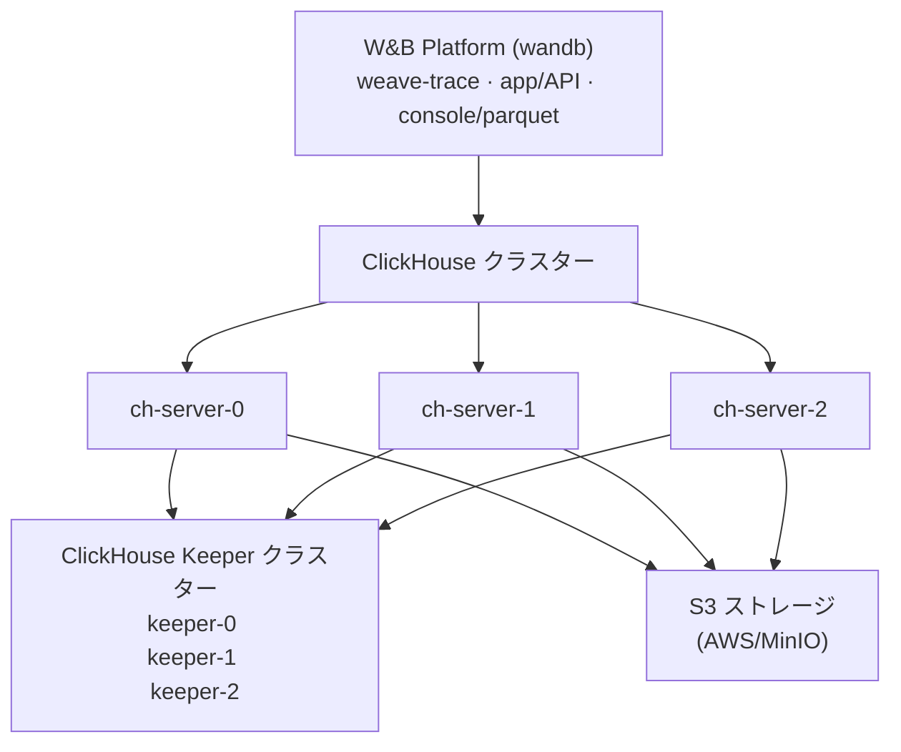

W&amp;B Weave をセルフホストすると、環境と設定をより細かく制御できます。これにより、より分離された環境を構築し、追加のセキュリティコンプライアンス要件を満たしやすくなります。本ドキュメントでは、Altinity ClickHouse Operator を使用して、セルフマネージド環境で W&amp;B Weave を実行するために必要なすべてのコンポーネントをデプロイする方法を説明します。

セルフマネージドの Weave デプロイでは、バックエンドの管理に [ClickHouseDB](https://clickhouse.com/) を使用します。このデプロイでは、次のコンポーネントを使用します。

* **Altinity ClickHouse Operator**: Kubernetes 向けのエンタープライズグレードの ClickHouse 管理ツール
* **ClickHouse Keeper**: 分散コーディネーションサービス (ZooKeeper の代替) 
* **ClickHouse クラスター**: トレースストレージ向けの高可用性データベースクラスター
* **S3-Compatible Storage**: ClickHouse データを永続化するためのオブジェクトストレージ

<Tip>
  詳細なリファレンスアーキテクチャについては、[W&amp;B Self-Managed Reference Architecture](https://docs.wandb.ai/guides/hosting/self-managed/ref-arch/#models-and-weave) を参照してください。
</Tip>

<div id="important-setup-notes">
  ## 重要なセットアップに関する注意事項
</div>

本ガイドの設定例は、あくまで参考情報です。各組織の Kubernetes 環境はそれぞれ異なるため、セルフホスト環境では次の点を調整する必要がある可能性があります。

* **セキュリティとコンプライアンス**: 組織のセキュリティポリシーおよび Kubernetes/OpenShift の要件に合わせて、セキュリティコンテキスト、`runAsUser`/`fsGroup` の値、その他のセキュリティ設定を調整してください。
* **リソースサイジング**: ここに示すリソース割り当ては出発点にすぎません。想定されるトレース量やパフォーマンス要件に基づく適切なサイジングについては、**W&amp;B Solutions Architect team に相談してください**。
* **インフラストラクチャー固有の設定**: ストレージクラス、ノードセレクター、その他のインフラストラクチャー固有の設定を、環境に合わせて更新してください。

本ガイドの設定は、そのまま適用すべきものではなく、テンプレートとして扱ってください。

<div id="architecture">
  ## アーキテクチャ
</div>


```mermaid
graph TD
    A["W&B Platform (wandb)<br/>weave-trace · app/API · console/parquet"] --> B["ClickHouse クラスター"]
    B --> C["ch-server-0"]
    B --> D["ch-server-1"]
    B --> E["ch-server-2"]
    C --> F["ClickHouse Keeper クラスター<br/>keeper-0 <br/>keeper-1 <br/>keeper-2"]
    D --> F
    E --> F
    C --> G["S3 ストレージ<br/>(AWS/MinIO)"]
    D --> G
    E --> G
```


<div id="prerequisites">
  ## 前提条件
</div>

セルフマネージドの Weave インスタンスでは、以下のリソースが必要です。

* **Kubernetes クラスター**: バージョン 1.29 以上
* **Kubernetes ノード**: 複数ノードのクラスター (高可用性のため、最低 3 ノードを推奨)
* **Storage Class**: 永続ボリューム用の有効な StorageClass (例: `gp3`, `standard`, `nfs-csi`)
* **S3 버킷**: 適切なアクセス権限が設定された、事前設定済みの S3 または S3 互換버킷
* **W&amp;B Platform**: すでにインストールされ、稼働していること ([W&amp;B Self-Managed Deployment Guide](https://docs.wandb.ai/guides/hosting/hosting-options/self-managed/) を参照)
* **W&amp;B License**: W&amp;B Support が提供する Weave 対応ライセンス

<Warning>
  この前提条件リストだけを基にリソースのサイジングを決定しないでください。必要なリソースは、トレース量や使用パターンによって大きく異なります。明確なクラスターサイジングのガイダンスについては、詳細な [Resource Requirements](#resource-requirements) セクションを参照してください。
</Warning>

<div id="required-tools">
  ### 必須ツール
</div>

インスタンスを設定するには、次のツールが必要です。

* クラスターにアクセスできるよう設定された `kubectl`
* `helm` v3.0+
* AWS 認証情報 (S3 を使用する場合) または S3 互換ストレージへのアクセス

<div id="network-requirements">
  ### ネットワーク要件
</div>

Kubernetes クラスターでは、次のネットワーク設定が必要です。

* `clickhouse` ネームスペース内のポッド は、`wandb` ネームスペース内のポッド と通信できる必要があります
* ClickHouse ノード同士が、ポート 8123、9000、9009、2181 で相互に通信できる必要があります

<div id="deploy-your-self-managed-weave-instance">
  ## セルフマネージド Weave インスタンスをデプロイする
</div>

<div id="step-1-deploy-altinity-clickhouse-operator">
  ### Step 1: Altinity ClickHouse Operator をデプロイする
</div>

Altinity ClickHouse Operator は、Kubernetes 上の ClickHouse デプロイメントを管理します。

<div id="11-add-the-altinity-helm-repository">
  #### 1.1 Altinity Helm リポジトリを追加する
</div>

```bash
helm repo add altinity https://helm.altinity.com
helm repo update
```


<div id="12-create-the-operator-configuration">
  #### 1.2 オペレーター設定を作成する
</div>

`ch-operator.yaml` という名前のファイルを作成します。

```yaml
operator:
  image:
    repository: altinity/clickhouse-operator

  # セキュリティコンテキスト - クラスターの要件に応じて調整してください
  containerSecurityContext:
    runAsGroup: 0
    runAsNonRoot: true
    runAsUser: 10001 # OpenShift/Kubernetes のセキュリティポリシーに合わせて更新してください
    allowPrivilegeEscalation: false
    capabilities:
      drop:
        - ALL
    privileged: false
    readOnlyRootFilesystem: false

metrics:
  enabled: false

# 名前のオーバーライド - 必要に応じてカスタマイズしてください
nameOverride: "wandb"
```

ここで示す `containerSecurityContext` の値は、ほとんどの Kubernetes ディストリビューションで機能します。**OpenShift** を使用している場合は、`runAsUser` と `fsGroup` をプロジェクトに割り当てられた UID の範囲に合わせて調整する必要がある場合があります。


<div id="13-install-the-operator">
  #### 1.3 operator をインストールする
</div>

```bash
helm upgrade --install ch-operator altinity/altinity-clickhouse-operator \
  --namespace clickhouse \
  --create-namespace \
  -f ch-operator.yaml
```


<div id="14-verify-the-operator-installation">
  #### 1.4 operator のインストールを確認する
</div>

```bash
# operator pod が実行中であることを確認する
kubectl get pods -n clickhouse

# 期待される出力:
# NAME                                 READY   STATUS    RESTARTS   AGE
# ch-operator-wandb-xxxxx              1/1     Running   0          30s

# operator イメージのバージョンを確認する
kubectl get pods -n clickhouse -o jsonpath="{.items[*].spec.containers[*].image}" | \
  tr ' ' '\n' | grep -v 'metrics-exporter' | sort -u

# 期待される出力:
# altinity/clickhouse-operator:0.25.4
```


<div id="step-2-prepare-s3-storage">
  ### Step 2: S3 ストレージの準備
</div>

ClickHouse は、データの永続化に S3 または S3 互換ストレージが必要です。

<div id="21-create-an-s3-bucket">
  #### 2.1 S3 버킷を作成する
</div>

ご自身の AWS アカウントまたは S3 互換のストレージプロバイダーで S3 버킷を作成してください：

```bash
# AWS の例
aws s3 mb s3://my-wandb-clickhouse-bucket --region eu-central-1
```


<div id="22-configure-s3-credentials">
  #### 2.2 S3 認証情報を設定する
</div>

S3 アクセス用の認証情報を指定する方法は 2 つあります。

<div id="option-a-using-aws-iam-roles-irsa-recommended-for-aws">
  ##### オプション A: AWS IAM Roles を使用する (IRSA - AWS で推奨)
</div>

Kubernetes ノードに S3 への 액세ス権を持つ IAM ロールがある場合、ClickHouse は EC2 インスタンスメタデータを使用できます。

```yaml
# ch-server.yaml で設定します:
<use_environment_credentials>true</use_environment_credentials>
```

**必須の IAM ポリシー** (ノードの IAM ロールにアタッチされたもの) :

```json
{
  "Version": "2012-10-17",
  "Statement": [
    {
      "Effect": "Allow",
      "Action": [
        "s3:GetObject",
        "s3:PutObject",
        "s3:DeleteObject",
        "s3:ListBucket"
      ],
      "Resource": [
        "arn:aws:s3:::my-wandb-clickhouse-bucket",
        "arn:aws:s3:::my-wandb-clickhouse-bucket/*"
      ]
    }
  ]
}
```


<div id="option-b-using-access-keys">
  ##### オプション B: アクセスキーを使用する
</div>

静的な認証情報を使用する場合は、Kubernetes secret を作成します。

```bash
kubectl create secret generic aws-creds \
  --namespace clickhouse \
  --from-literal aws_access_key=YOUR_ACCESS_KEY \
  --from-literal aws_secret_key=YOUR_SECRET_KEY
```

次に、ClickHouse が secret を使用するように設定します (下記の ch-server.yaml の設定を参照してください) 。


<div id="step-3-deploy-clickhouse-keeper">
  ### Step 3: ClickHouse Keeper をデプロイする
</div>

[ClickHouse Keeper](https://clickhouse.com/docs/guides/sre/keeper/clickhouse-keeper) は、データ レプリケーションと分散 DDL クエリの実行を行うためのコーディネーションシステムを提供します。

<div id="31-create-the-keeper-configuration">
  #### 3.1 Keeper の設定を作成
</div>

`ch-keeper.yaml` という名前のファイルを作成します。

```yaml
apiVersion: "clickhouse-keeper.altinity.com/v1"
kind: "ClickHouseKeeperInstallation"
metadata:
  name: wandb
  namespace: clickhouse
  annotations: {}
spec:
  defaults:
    templates:
      podTemplate: default
      dataVolumeClaimTemplate: default

  templates:
    podTemplates:
      - name: keeper
        metadata:
          labels:
            app: clickhouse-keeper
        spec:
          # Podのセキュリティコンテキスト - 環境に合わせて調整してください
          securityContext:
            fsGroup: 10001 # クラスターのセキュリティ要件に基づいて更新してください
            fsGroupChangePolicy: Always
            runAsGroup: 0
            runAsNonRoot: true
            runAsUser: 10001 # OpenShiftの場合は、プロジェクトに割り当てられたUID範囲を使用してください
            seccompProfile:
              type: RuntimeDefault

          # ノード間にKeeperを分散させるためのアンチアフィニティ（HAに推奨）
          # クラスターのサイズと可用性要件に応じてカスタマイズまたは削除してください
          affinity:
            podAntiAffinity:
              requiredDuringSchedulingIgnoredDuringExecution:
                - labelSelector:
                    matchExpressions:
                      - key: "app"
                        operator: In
                        values:
                          - clickhouse-keeper
                  topologyKey: "kubernetes.io/hostname"

          containers:
            - name: clickhouse-keeper
              imagePullPolicy: IfNotPresent
              image: "clickhouse/clickhouse-keeper:25.10"
              # リソースリクエスト - サンプル値です。ワークロードに合わせて調整してください
              resources:
                requests:
                  memory: "256Mi"
                  cpu: "0.5"
                limits:
                  memory: "2Gi"
                  cpu: "1"

              securityContext:
                allowPrivilegeEscalation: false
                capabilities:
                  drop:
                    - ALL
                privileged: false
                readOnlyRootFilesystem: false

    volumeClaimTemplates:
      - name: data
        metadata:
          labels:
            app: clickhouse-keeper
        spec:
          storageClassName: gp3 # ご使用のStorageClassに変更してください
          accessModes:
            - ReadWriteOnce
          resources:
            requests:
              storage: 10Gi

  configuration:
    clusters:
      - name: keeper # Keeperクラスター名 - サービスDNS命名に使用されます
        layout:
          replicasCount: 3
        templates:
          podTemplate: keeper
          dataVolumeClaimTemplate: data

    settings:
      logger/level: "information"
      logger/console: "true"
      listen_host: "0.0.0.0"
      keeper_server/four_letter_word_white_list: "*"
      keeper_server/coordination_settings/raft_logs_level: "information"
      keeper_server/enable_ipv6: "false"
      keeper_server/coordination_settings/async_replication: "true"
```

**重要な設定の更新**:

* **StorageClass**: クラスターで使用可能な StorageClass に合わせて `storageClassName: gp3` を更新してください
* **セキュリティコンテキスト**: 組織のセキュリティポリシーに準拠するように、`runAsUser`、`fsGroup` の値を調整してください
* **Anti-Affinity**: クラスターのトポロジと HA 要件に基づいて、`affinity` セクションをカスタマイズまたは削除してください
* **Resources**: CPU/メモリ の値は例です。適切なサイジングについては W&amp;B Solutions Architects に相談してください
* **Naming**: `metadata.name` または `configuration.clusters[0].name` を変更する場合は、一致するように ch-server.yaml (ステップ 4) の Keeper ホスト名を**必ず更新**してください


<div id="32-deploy-clickhouse-keeper">
  #### 3.2 ClickHouse Keeper をデプロイする
</div>

```bash
kubectl apply -f ch-keeper.yaml
```


<div id="33-verify-keeper-deployment">
  #### 3.3 Keeper のデプロイを確認する
</div>

```bash
# Keeper のポッドを確認する
kubectl get pods -n clickhouse -l app=clickhouse-keeper

# 期待される出力:
# NAME                     READY   STATUS    RESTARTS   AGE
# chk-wandb-keeper-0-0-0   1/1     Running   0          2m
# chk-wandb-keeper-0-1-0   1/1     Running   0          2m
# chk-wandb-keeper-0-2-0   1/1     Running   0          2m

# Keeper のサービスを確認する
kubectl get svc -n clickhouse | grep keeper

# ポート 2181 で keeper サービスが表示されることを確認する
```


<div id="step-4-deploy-clickhouse-cluster">
  ### Step 4: ClickHouse クラスターをデプロイする
</div>

Weave の Trace Data を格納する ClickHouse サーバー クラスターをデプロイします。

<div id="41-create-the-clickhouse-server-configuration">
  #### 4.1 ClickHouse サーバーの設定を作成する
</div>

`ch-server.yaml` という名前のファイルを作成します。

```yaml
apiVersion: "clickhouse.altinity.com/v1"
kind: "ClickHouseInstallation"
metadata:
  name: wandb
  namespace: clickhouse
  annotations: {}
spec:
  defaults:
    templates:
      podTemplate: default
      dataVolumeClaimTemplate: default

  templates:
    podTemplates:
      - name: clickhouse
        metadata:
          labels:
            app: clickhouse-server
        spec:
          # ポッドのセキュリティコンテキスト - 環境に応じてカスタマイズしてください
          securityContext:
            fsGroup: 10001 # セキュリティポリシーに応じて調整してください
            fsGroupChangePolicy: Always
            runAsGroup: 0
            runAsNonRoot: true
            runAsUser: 10001 # OpenShift の場合、割り当てられた UID 範囲を使用してください
            seccompProfile:
              type: RuntimeDefault

          # アンチアフィニティルール - サーバーが異なるノードで実行されるようにします（オプションですが推奨）
          # クラスターのサイズと要件に基づいて調整または削除してください
          affinity:
            podAntiAffinity:
              requiredDuringSchedulingIgnoredDuringExecution:
                - labelSelector:
                    matchExpressions:
                      - key: "app"
                        operator: In
                        values:
                          - clickhouse-server
                  topologyKey: "kubernetes.io/hostname"

          containers:
            - name: clickhouse
              image: clickhouse/clickhouse-server:25.10
              # リソース割り当ての例 - ワークロードに基づいて調整してください
              resources:
                requests:
                  memory: 1Gi
                  cpu: 1
                limits:
                  memory: 16Gi
                  cpu: 4

              # AWS 認証情報（IRSA を使用する場合はこのセクションを削除）
              env:
                - name: AWS_ACCESS_KEY_ID
                  valueFrom:
                    secretKeyRef:
                      name: aws-creds
                      key: aws_access_key
                - name: AWS_SECRET_ACCESS_KEY
                  valueFrom:
                    secretKeyRef:
                      name: aws-creds
                      key: aws_secret_key

              securityContext:
                allowPrivilegeEscalation: false
                capabilities:
                  drop:
                    - ALL
                privileged: false
                readOnlyRootFilesystem: false

    volumeClaimTemplates:
      - name: data
        metadata:
          labels:
            app: clickhouse-server
        spec:
          accessModes:
            - ReadWriteOnce
          resources:
            requests:
              storage: 50Gi
          storageClassName: gp3 # StorageClass をお使いのものに変更してください

  configuration:
    # Keeper (ZooKeeper) の設定
    # 重要: これらのホスト名は、ステップ 3 の Keeper デプロイメントと一致させる必要があります
    zookeeper:
      nodes:
        - host: chk-wandb-keeper-0-0.clickhouse.svc.cluster.local
          port: 2181
        - host: chk-wandb-keeper-0-1.clickhouse.svc.cluster.local
          port: 2181
        - host: chk-wandb-keeper-0-2.clickhouse.svc.cluster.local
          port: 2181
      # オプション: 必要に応じてタイムアウトを調整するためにコメントを解除してください
      # session_timeout_ms: 30000
      # operation_timeout_ms: 10000

    # ユーザー設定: https://clickhouse.com/docs/operations/configuration-files#user-settings
    # 本番環境では、平文ではなく SHA-256 でハッシュ化されたパスワードを使用してください:
    # printf "your-password" | sha256sum
    # 次に、weave/password の代わりに weave/password_sha256_hex: <hash> を使用してください
    users:
      weave/password: weave123  # デプロイ前に強力なパスワードに置き換えてください
      weave/access_management: 1
      weave/profile: default
      weave/networks/ip:
        - "0.0.0.0/0"
        - "::"

    # サーバー設定
    settings:
      disable_internal_dns_cache: 1

    # クラスター設定
    clusters:
      - name: weavecluster # クラスター名 - カスタマイズ可能ですが wandb-cr.yaml と一致する必要があります
        layout:
          shardsCount: 1
          replicasCount: 3 # レプリカの数 - HA 要件に基づいて調整してください
        templates:
          podTemplate: clickhouse
          dataVolumeClaimTemplate: data

    # 設定ファイル
    files:
      config.d/network_configuration.xml: |
        <clickhouse>
            <listen_host>0.0.0.0</listen_host>
            <listen_host>::</listen_host>
        </clickhouse>

      config.d/logger.xml: |
        <clickhouse>
            <logger>
                <level>information</level>
            </logger>
        </clickhouse>

      config.d/storage_configuration.xml: |
        <clickhouse>
            <storage_configuration>
                <disks>
                    <s3_disk>
                        <type>s3</type>
                        <!-- S3 バケットのエンドポイントとリージョンを更新してください -->
                        <endpoint>https://YOUR-BUCKET-NAME.s3.YOUR-REGION.amazonaws.com/s3_disk/{replica}</endpoint>
                        <metadata_path>/var/lib/clickhouse/disks/s3_disk/</metadata_path>
                        <use_environment_credentials>true</use_environment_credentials>
                        <region>YOUR-REGION</region>
                    </s3_disk>
                    <s3_disk_cache>
                        <type>cache</type>
                        <disk>s3_disk</disk>
                        <path>/var/lib/clickhouse/s3_disk_cache/cache/</path>
                        <!-- キャッシュサイズは永続ボリュームより小さくする必要があります -->
                        <max_size>40Gi</max_size>
                        <cache_on_write_operations>true</cache_on_write_operations>
                    </s3_disk_cache>
                </disks>
                <policies>
                    <s3_main>
                        <volumes>
                            <main>
                                <disk>s3_disk_cache</disk>
                            </main>
                        </volumes>
                    </s3_main>
                </policies>
            </storage_configuration>
            <merge_tree>
                <storage_policy>s3_main</storage_policy>
            </merge_tree>
        </clickhouse>
```

**重要な設定の更新が必要です**:

1. **StorageClass**: `storageClassName: gp3` をクラスターの StorageClass に合わせて更新してください
2. **S3 Endpoint**: `YOUR-BUCKET-NAME` と `YOUR-REGION` を実際の値に置き換えてください
3. **Cache Size**: `<max_size>40Gi</max_size>` は永続ボリュームのサイズ (50Gi) よりも **小さく** する必要があります
4. **セキュリティコンテキスト**: `runAsUser`、`fsGroup`、その他のセキュリティ設定を組織のポリシーに合わせて調整してください
5. **Resource Allocation**: CPU/メモリの値はあくまで例です — 想定される trace ボリュームに基づく適切なサイジングについては、**必ず W&amp;B Solutions Architect に相談してください**
6. **Anti-Affinity Rules**: クラスターのトポロジーや高可用性要件に応じてカスタマイズするか、削除してください
7. **Keeper Hostnames**: Keeper ノードのホスト名は、ステップ 3 の Keeper デプロイメントの命名と **一致している必要があります** (下記の「Understanding Keeper Naming」を参照)
8. **Cluster Naming**: クラスター名 `weavecluster` は変更できますが、ステップ 5 の `WF_CLICKHOUSE_REPLICATED_CLUSTER` の値と一致させる必要があります
9. **認証情報**:
   * IRSA を使用する場合: `<use_environment_credentials>true</use_environment_credentials>` をそのまま使用するか、環境変数にマッピングした secret キーを使用してください。

<div id="42-update-s3-configuration">
  #### 4.2 S3 設定を更新
</div>

`ch-server.yaml` の `storage_configuration.xml` セクションを編集します:

**AWS S3 の例**:

```xml
<endpoint>https://my-wandb-clickhouse.s3.eu-central-1.amazonaws.com/s3_disk/{replica}</endpoint>
<region>eu-central-1</region>
```

**例 for MinIO**:

```xml
<endpoint>https://minio.example.com:9000/my-bucket/s3_disk/{replica}</endpoint>
<region>us-east-1</region>
```

<Warning>
  **`{replica}` を削除しないでください。** これにより、各 ClickHouse レプリカが 버킷 内の専用フォルダに書き込むようになります。
</Warning>


<div id="43-configure-credentials-option-b-only">
  #### 4.3 認証情報を設定する (オプション B のみ)
</div>

Step 2 の **オプション B (アクセスキー)&#x20;**&#x20;を使用している場合は、`ch-server.yaml` の `env` セクションで secret を参照していることを確認してください:

```yaml
env:
  - name: AWS_ACCESS_KEY_ID
    valueFrom:
      secretKeyRef:
        name: aws-creds
        key: aws_access_key
  - name: AWS_SECRET_ACCESS_KEY
    valueFrom:
      secretKeyRef:
        name: aws-creds
        key: aws_secret_key
```

**Option A (IRSA)** を使用する場合は、`env` セクション全体を削除してください。


<div id="44-understanding-keeper-naming">
  #### 4.4 Keeper の命名規則を理解する
</div>

`zookeeper.nodes` セクションの Keeper ノードのホスト名は、Step 3 の Keeper デプロイに基づく特定のパターンに従います。

**ホスト名のパターン**: `chk-{installation-name}-{cluster-name}-{cluster-index}-{replica-index}.{namespace}.svc.cluster.local`

ここで:

* `chk` = ClickHouseKeeperInstallation の接頭辞 (固定) 
* `{installation-name}` = ch-keeper.yaml の `metadata.name` (例: `wandb`) 
* `{cluster-name}` = ch-keeper.yaml の `configuration.clusters[0].name` (例: `keeper`) 
* `{cluster-index}` = クラスターの index。通常、単一クラスターでは `0`
* `{replica-index}` = レプリカ番号: レプリカが 3 つの場合は `0`、`1`、`2`
* `{namespace}` = Kubernetes ネームスペース (例: `clickhouse`) 

**デフォルト名を使用した例**:

```
chk-wandb-keeper-0-0.clickhouse.svc.cluster.local
chk-wandb-keeper-0-1.clickhouse.svc.cluster.local
chk-wandb-keeper-0-2.clickhouse.svc.cluster.local
```

**Keeper のインストール名を変更する場合** (例: `metadata.name: myweave`) :

```
chk-myweave-keeper-0-0.clickhouse.svc.cluster.local
chk-myweave-keeper-0-1.clickhouse.svc.cluster.local
chk-myweave-keeper-0-2.clickhouse.svc.cluster.local
```

**Keeper のクラスター名をカスタマイズする場合** (例: `clusters[0].name: coordination`) :

```
chk-wandb-coordination-0-0.clickhouse.svc.cluster.local
chk-wandb-coordination-0-1.clickhouse.svc.cluster.local
chk-wandb-coordination-0-2.clickhouse.svc.cluster.local
```

**実際の Keeper ホスト名を確認するには**:

```bash
# 実際の名前を確認するために Keeper サービスを一覧表示する
kubectl get svc -n clickhouse | grep keeper

# 命名パターンを確認するために Keeper ポッドを一覧表示する
kubectl get pods -n clickhouse -l app=clickhouse-keeper
```

<Note>
  `ch-server.yaml` 内の Keeper ホスト名は、Keeper のデプロイによって実際に作成されたサービス名と**完全に一致している必要があります**。一致しない場合、ClickHouse サーバーは調整サービスへの接続に失敗します。
</Note>


<div id="45-deploy-clickhouse-cluster">
  #### 4.5 ClickHouse クラスターをデプロイする
</div>

```bash
kubectl apply -f ch-server.yaml
```


<div id="46-verify-clickhouse-deployment">
  #### 4.6 ClickHouse のデプロイを確認する
</div>

```bash
# ClickHouse ポッドを確認する
kubectl get pods -n clickhouse -l app=clickhouse-server

# 期待される出力:
# NAME                           READY   STATUS    RESTARTS   AGE
# chi-wandb-weavecluster-0-0-0   1/1     Running   0          3m
# chi-wandb-weavecluster-0-1-0   1/1     Running   0          3m
# chi-wandb-weavecluster-0-2-0   1/1     Running   0          3m

# ClickHouse の接続性をテストする
kubectl exec -n clickhouse chi-wandb-weavecluster-0-0-0 -- \
  clickhouse-client --user weave --password weave123 --query "SELECT version()"

# クラスターのステータスを確認する
kubectl exec -n clickhouse chi-wandb-weavecluster-0-0-0 -- \
  clickhouse-client --user weave --password weave123 --query \
  "SELECT cluster, host_name, port FROM system.clusters WHERE cluster='weavecluster'"
```


<div id="step-5-enable-weave-in-wb-platform">
  ### Step 5: W&amp;B Platform で Weave を有効にする
</div>

次に、Weave トレースで ClickHouse クラスターを使用するよう W&amp;B Platform を設定します。

<div id="51-gather-clickhouse-connection-information">
  #### 5.1 ClickHouse 接続情報を収集する
</div>

必要なもの:

* **ホスト**: `clickhouse-wandb.clickhouse.svc.cluster.local`
* **ポート**: `8123`
* **ユーザー**: `weave` (`ch-server.yaml` で設定) 
* **パスワード**: `weave123` (`ch-server.yaml` で設定) 
* **データベース**: `weave` (自動的に作成されます) 
* **クラスター名**: `weavecluster` (`ch-server.yaml` で設定) 

ホスト名は次のパターンに従います: `clickhouse-{installation-name}.{namespace}.svc.cluster.local`

<div id="52-update-wb-custom-resource">
  #### 5.2 W&amp;B Custom Resource を更新する
</div>

Weave 設定を追加するために、W&amp;B Platform の Custom Resource (CR) を編集します：

```yaml
apiVersion: apps.wandb.com/v1
kind: WeightsAndBiases
metadata:
  name: wandb
  namespace: wandb
spec:
  values:
    global:
      # ... 既存の設定 ...

      # ClickHouse 設定を追加
      clickhouse:
        install: false # 別途デプロイ済み
        host: clickhouse-wandb.clickhouse.svc.cluster.local
        port: 8123
        user: weave
        password: weave123
        database: weave
        replicated: true # マルチレプリカ構成では必須

      # Weave Trace を有効化
      weave-trace:
        enabled: true

    # Weave Trace 設定
    weave-trace:
      install: true
      extraEnv:
        WF_CLICKHOUSE_REPLICATED: "true"
        WF_CLICKHOUSE_REPLICATED_CLUSTER: "weavecluster"
      image:
        repository: wandb/weave-trace
        tag: 0.74.1
      replicaCount: 1
      size: "default"
      sizing:
        default:
          autoscaling:
            horizontal:
              enabled: false
          # リソース割り当ての例 - ワークロードに応じて調整してください
          resources:
            limits:
              cpu: 4
              memory: "8Gi"
            requests:
              cpu: 1
              memory: "4Gi"
      # Pod セキュリティコンテキスト - 環境に合わせてカスタマイズしてください
      podSecurityContext:
        fsGroup: 10001 # セキュリティ要件に応じて調整してください
        fsGroupChangePolicy: Always
        runAsGroup: 0
        runAsNonRoot: true
        runAsUser: 10001 # OpenShift の場合は割り当てられた UID 範囲を使用してください
        seccompProfile:
          type: RuntimeDefault
      # コンテナーセキュリティコンテキスト
      securityContext:
        allowPrivilegeEscalation: false
        capabilities:
          drop:
            - ALL
        privileged: false
        readOnlyRootFilesystem: false
```

**重要な設定**:

* `clickhouse.replicated: true` - 3 レプリカを使用する場合は**必須**
* `WF_CLICKHOUSE_REPLICATED: "true"` - レプリケーション構成では**必須**
* `WF_CLICKHOUSE_REPLICATED_CLUSTER: "weavecluster"` - `ch-server.yaml` のクラスター名と**一致する必要があります**

<Note>
  上記のセキュリティコンテキスト、リソース割り当て、およびその他の Kubernetes 固有の設定は参考例です。組織の要件に応じて調整し、適切なリソースサイジングについては W&amp;B Solutions Architect チームにご相談ください。
</Note>


<div id="53-apply-the-updated-configuration">
  #### 5.3 更新した設定を適用する
</div>

```bash
kubectl apply -f wandb-cr.yaml
```


<div id="54-verify-weave-trace-deployment">
  #### 5.4 Weave Trace のデプロイを確認する
</div>

```bash
# weave-trace podのステータスを確認する
kubectl get pods -n wandb | grep weave-trace

# 期待される出力:
# wandb-weave-trace-bc-xxxxx   1/1     Running   0          2m

# ClickHouse接続のweave-traceログを確認する
kubectl logs -n wandb <weave-trace-pod-name> --tail=50

# ClickHouseへの接続成功メッセージを確認する
```


<div id="step-6-initialize-weave-database">
  ### Step 6: Weave データベースを初期化します
</div>

weave-trace サービスは、初回起動時に必須のデータベース スキーマを自動的に作成します。

<div id="61-monitor-database-migration">
  #### 6.1 データベースの移行を監視する
</div>

```bash
# 起動中に weave-trace のログを監視する
kubectl logs -n wandb <weave-trace-pod-name> -f

# データベースの初期化が成功したことを示すマイグレーションメッセージを確認する
```


<div id="62-verify-database-creation">
  #### 6.2 データベースが作成されたことを確認します
</div>

```bash
# ClickHouseに接続してデータベースを確認する
kubectl exec -n clickhouse chi-wandb-weavecluster-0-0-0 -- \
  clickhouse-client --user weave --password weave123 --query \
  "SHOW DATABASES"

# 'weave' データベースが一覧に表示されることを確認する

# weave データベースのテーブルを確認する
kubectl exec -n clickhouse chi-wandb-weavecluster-0-0-0 -- \
  clickhouse-client --user weave --password weave123 --query \
  "SHOW TABLES FROM weave"
```


<div id="step-7-verify-weave-is-enabled">
  ### Step 7: Weave が有効になっていることを確認します
</div>

<div id="71-access-wb-console">
  #### 7.1 W&amp;B Console にアクセスする
</div>

Web ブラウザでご利用の W&amp;B インスタンス URL にアクセスします。

<div id="72-check-weave-license-status">
  #### 7.2 Weave の License ステータスを確認する
</div>

W&amp;B Console で、次の手順を実行します。

1. **Top Right Menu** → **Organization Dashboard** に移動します
2. **Weave 액세ス** が有効になっていることを確認します

<div id="73-test-weave-functionality">
  #### 7.3 Weave 機能をテストする
</div>

Weave が動作していることを確認するために、簡単な Python テストを作成します。

```python
import os
import weave

# WeaveをセルフマネージドのW&Bインスタンスに向ける
os.environ["WANDB_BASE_URL"] = "https://your-wandb-host"  # W&B URLに置き換えてください

weave.init('test-project')

# シンプルなトレース対象の関数を作成する
@weave.op()
def hello_weave(name: str) -> str:
    return f"Hello, {name}!"

# 関数を呼び出す
result = hello_weave("World")
print(result)
```

これを実行したら、組織内の トレース page で W&amp;B UI のトレースを確認してください。


<div id="troubleshooting">
  ## トラブルシューティング
</div>

<div id="clickhouse-keeper-issues">
  ### ClickHouse Keeper の問題
</div>

**問題**: Keeper pods が `Pending` 状態のままになる

**解決策**: 考えられる複数の原因を確認してください。

1. **PVC と StorageClass の問題**:

```bash
kubectl get pvc -n clickhouse
kubectl describe pvc -n clickhouse
```

StorageClass が正しく設定されており、使用可能な容量があることを確認してください。

2. **アンチアフィニティとノードの可用性**:

```bash
# アンチアフィニティルールがスケジューリングを妨げているか確認する
kubectl describe pod -n clickhouse <pod-name> | grep -A 10 "Events:"

# 利用可能なノードとそのリソースを確認する
kubectl get nodes
kubectl describe nodes | grep -A 5 "Allocated resources"
```

よくある問題:

* アンチアフィニティでは 3 つの個別のノードが必要ですが、クラスター内のノード数がそれより少なくなっています
* ノードに、Pod の要求を満たすのに十分な CPU/メモリがありません
* ノード taint によって Pod のスケジューリングが妨げられています

**解決策**:

* ノードが 3 つ未満の場合は、アンチアフィニティ ルールを削除または調整します
* より緩やかなアンチアフィニティのために、`requiredDuringSchedulingIgnoredDuringExecution` の代わりに `preferredDuringSchedulingIgnoredDuringExecution` を使用します
* ノードのリソースが制約されている場合は、リソース要求を減らします
* クラスターにノードを追加します

***

**問題**: `CrashLoopBackOff` 状態の Keeper Pod

**解決策**: ログを確認し、設定を検証します:

```bash
kubectl logs -n clickhouse <keeper-pod-name>
```

よくある問題:

* 不正なセキュリティコンテキスト (runAsUser、fsGroup を確認してください) 
* ボリューム権限の問題
* ポートの競合
* ch-keeper.yaml の設定エラー


<div id="clickhouse-server-issues">
  ### ClickHouse サーバーの問題
</div>

**問題**: ClickHouse が S3 に接続できません

**解決策**: S3 の認証情報と権限を確認してください。

```bash
# secretが存在するか確認する（アクセスキーを使用している場合）
kubectl get secret aws-creds -n clickhouse

# S3エラーのClickHouseログを確認する
kubectl logs -n clickhouse <clickhouse-pod-name> | grep -i s3

# ストレージ設定のS3 Endpointを確認する
kubectl get chi wandb -n clickhouse -o yaml | grep -A 10 storage_configuration
```

***

**問題**: ClickHouse が Keeper に接続できません

**解決策**: Keeper の endpoints と Naming を確認してください:

```bash
# Keeper サービスと実際の名前を確認する
kubectl get svc -n clickhouse | grep keeper

# Keeper ポッドを確認して命名パターンを確認する
kubectl get pods -n clickhouse -l app=clickhouse-keeper

# ch-server.yaml の zookeeper.nodes 設定と比較する
# ホスト名は実際のサービス名と一致している必要がある

# ClickHouse のログで接続エラーを確認する
kubectl logs -n clickhouse chi-wandb-weavecluster-0-0-0 | grep -i keeper
```

接続に失敗する場合、ch-server.yaml 内の Keeper ホスト名が実際の Keeper デプロイと一致していない可能性があります。命名パターンについては、step 4 の「Understanding Keeper Naming」を参照してください。


<div id="weave-trace-issues">
  ### Weave Trace の問題
</div>

**問題**: `weave-trace` pod の起動に失敗します

**解決策**: ClickHouse への接続性を確認してください。

```bash
# weave-trace pod 名を取得する
kubectl get pods -n wandb | grep weave-trace

# weave-trace のログを確認する
kubectl logs -n wandb <weave-trace-pod-name>

# よくあるエラー: "connection refused" または "authentication failed"
# wandb-cr.yaml の ClickHouse 認証情報が ch-server.yaml と一致していることを確認する
```

***

**問題**: Console で Weave が有効と表示されない

**解決策**: 設定を確認します。

1. ライセンスに Weave が含まれていることを確認します。

   ```bash
   kubectl get secret license-key -n wandb -o jsonpath='{.data.value}' | base64 -d | jq
   ```

2. wandb-cr.yaml で `weave-trace.enabled: true` と `clickhouse.replicated: true` が設定されていることを確認します

3. W&amp;B operator のログを確認します。
   ```bash
   kubectl logs -n wandb deployment/wandb-controller-manager
   ```

***

**問題**: データベース移行に失敗する

**解決策**: クラスター名が一致していることを確認します。

`WF_CLICKHOUSE_REPLICATED_CLUSTER` 環境変数は、ch-server.yaml 内のクラスター名と**一致している必要があります**。

```yaml
# ch-server.yaml 内:
clusters:
  - name: weavecluster # <-- このクラスター名

# wandb-cr.yaml 内で一致させる必要があります:
weave-trace:
  extraEnv:
    WF_CLICKHOUSE_REPLICATED_CLUSTER: "weavecluster" # <-- この値
```


<div id="resource-requirements">
  ## リソース要件
</div>

<Warning>
  以下のリソース割り当ては、**あくまで開始時点の例**です。実際の要件は、以下に基づいて大きく異なります。

  * トレースの取り込み量 (1 秒あたりのトレース数) 
  * クエリパターンと同時実行数
  * データ保持期間
  * 同時ユーザー数

  **お客様の具体的なユースケースに適したサイジングを判断するため、必ず W&amp;B Solutions Architect チーム にご相談ください**。リソースが不足しているとパフォーマンスの問題につながる可能性があり、過剰に割り当てるとインフラストラクチャーのコストが無駄になります。
</Warning>

<div id="minimum-production-setup">
  ### 最小限の本番設定
</div>

| コンポーネント           | レプリカ数      | CPU Request / Limit | メモリ Request / Limit | Storage   |
| ----------------- | ---------- | ------------------- | ------------------- | --------- |
| ClickHouse Keeper | 3          | 0.5 / 1             | 256Mi / 2Gi         | 各 10Gi    |
| ClickHouse Server | 3          | 1 / 4               | 1Gi / 16Gi          | 各 50Gi    |
| Weave Trace       | 1          | 1 / 4               | 4Gi / 8Gi           | -         |
| **合計**            | **7 pods** | **~4.5 / 15 CPU**   | **~7.8Gi / 58Gi**   | **180Gi** |

*適した用途: 開発、テスト、または小規模な本番環境*

<div id="recommended-production-setup">
  ### 推奨される本番設定
</div>

トレース量が多い本番ワークロードの場合:

| Component         | Replicas   | CPU リクエスト / 上限       | メモリ リクエスト / 上限           | ストレージ     |
| ----------------- | ---------- | -------------------- | ------------------------ | --------- |
| ClickHouse Keeper | 3          | 1 / 2                | 1Gi / 4Gi                | 各20Gi     |
| ClickHouse Server | 3          | 1 / 16               | 8Gi / 64Gi               | 各200Gi    |
| Weave Trace       | 2-3        | 1 / 4                | 4Gi / 8Gi                | -         |
| **合計**            | **8-9ポッド** | **約6-9 / 52-64 CPU** | **約27-33Gi / 204-216Gi** | **660Gi** |

*対象: 大量トレースの本番環境*

超大規模なデプロイについては、具体的なトレース量とパフォーマンス要件に応じたカスタムのサイジング推奨事項について、W&amp;B Solutions Architect チームにお問い合わせください。

<div id="advanced-configuration">
  ## 高度な設定
</div>

このセクションでは、セルフマネージドの Weave デプロイにおけるカスタマイズ オプションについて説明します。これには、垂直スケーリングまたは水平スケーリングによる ClickHouse 容量のスケーリング、keeper と server の両方の設定で image タグを変更して ClickHouse のバージョンを更新すること、そして ClickHouse の健全性を監視することが含まれます。

インスタンスに高度な変更を加える際は、パフォーマンスと信頼性の要件に適合していることを確認するために、W&amp;B Solutions Architect チームに相談することをお勧めします。

<div id="scaling-clickhouse">
  ### ClickHouse のスケーリング
</div>

ClickHouse の容量を増やすには、次の方法があります。

1. **Vertical Scaling**: pod ごとのリソースを増やします (よりシンプルな方法) 

   ```yaml
   resources:
     requests:
       memory: 8Gi
       cpu: 1
     limits:
       memory: 64Gi
       cpu: 16
   ```

   **推奨事項**: 実際のリソース使用量を監視し、それに応じてスケールしてください。超大規模なデプロイの場合は、W&amp;B Solutions Architect チーム にお問い合わせください。

2. **Horizontal Scaling**: レプリカを追加します (慎重な計画が必要です) 
   * レプリカを増やすにはデータの再バランスが必要です
   * シャード管理については ClickHouse のドキュメントを参照してください
   * 本番環境で **Horizontal Scaling** を実装する前に、**W&amp;B Solutions Architect チーム にお問い合わせください**

<div id="using-different-clickhouse-versions">
  ### 異なる ClickHouse バージョンを使用する
</div>

異なる ClickHouse バージョンを使用するには、`ch-keeper.yaml` と `ch-server.yaml` の両方でイメージ タグを更新します。

```yaml
image: clickhouse/clickhouse-keeper:25.10   # Keeperのバージョン
image: clickhouse/clickhouse-server:25.10   # Serverのバージョン
```

互換性を確保するには、Keeper とサーバーのバージョンが一致しているか、keeper のバージョンがサーバーのバージョン以上である必要があります。


<div id="monitoring-clickhouse">
  ### ClickHouse の監視
</div>

監視のために ClickHouse システムテーブルに액세스します:

```bash
# ディスク使用量を確認する
kubectl exec -n clickhouse chi-wandb-weavecluster-0-0-0 -- \
  clickhouse-client --user weave --password weave123 --query \
  "SELECT name, path, formatReadableSize(free_space) as free, formatReadableSize(total_space) as total FROM system.disks"

# レプリケーションのステータスを確認する
kubectl exec -n clickhouse chi-wandb-weavecluster-0-0-0 -- \
  clickhouse-client --user weave --password weave123 --query \
  "SELECT database, table, is_leader, total_replicas, active_replicas FROM system.replicas WHERE database='weave'"

# ClickHouse サーバーのステータスを確認する
kubectl get pods -n clickhouse -l app=clickhouse-server
```


<div id="backup-and-recovery">
  ### バックアップとリカバリ
</div>

ClickHouse のデータは S3 に保存され、S3 のバージョン管理および 버킷 レプリケーション機能によって、固有のバックアップ機能が提供されます。ご利用のデプロイに固有のバックアップ戦略については、W&amp;B Solutions Architect チームにご相談のうえ、[ClickHouse のバックアップ ドキュメント](https://clickhouse.com/docs/en/operations/backup)を参照してください。

<div id="security-considerations">
  ## セキュリティに関する考慮事項
</div>

1. **認証情報**: ClickHouse のパスワードはプレーン テキストではなく Kubernetes secrets に保存します
2. **ネットワーク ポリシー**: ClickHouse へのアクセスを制限するために、NetworkPolicies の実装を検討します
3. **RBAC**: サービスアカウントには必要最小限の権限のみを付与するようにします
4. **S3 버킷**: 保存時の暗号化を有効にし、버킷 への 액세스 を必要な IAM ロールのみに制限します
5. **TLS** (Optional): 本番では、ClickHouse クライアント接続に対して TLS を有効にします

<div id="upgrading">
  ## アップグレード
</div>

<div id="upgrading-clickhouse-operator">
  ### ClickHouse Operator のアップグレード
</div>

```bash
helm upgrade ch-operator altinity/altinity-clickhouse-operator \
  --namespace clickhouse \
  -f ch-operator.yaml
```


<div id="upgrading-clickhouse-server">
  ### ClickHouse Server のアップグレード
</div>

`ch-server.yaml` のイメージ バージョンを更新して適用します:

```bash
# ch-server.yaml を編集して、image タグを変更する
kubectl apply -f ch-server.yaml

# pod を監視する
kubectl get pods -n clickhouse
```


<div id="upgrading-weave-trace">
  ### Weave Trace のアップグレード
</div>

`wandb-cr.yaml` のイメージタグを更新して、適用します:

```bash
kubectl apply -f wandb-cr.yaml

# weave-trace pod の再起動を監視する
kubectl get pods -n wandb | grep weave-trace
```


<div id="additional-resources">
  ## 追加リソース
</div>

* [Altinity ClickHouse Operator ドキュメント](https://docs.altinity.com/altinitykubernetesoperator/)
* [ClickHouse ドキュメント](https://clickhouse.com/docs)
* [W&amp;B Weave ドキュメント](https://docs.wandb.ai/weave)
* [ClickHouse S3 Storage 設定](https://clickhouse.com/docs/en/engines/table-engines/mergetree-family/mergetree#s3-virtual-hosted-style)

<div id="support">
  ## サポート
</div>

本番デプロイまたは問題については、次をご確認ください。

* **W&amp;B Support**: `support@wandb.com`
* **ソリューションアーキテクト**: 超大規模なデプロイ、カスタムサイジング、デプロイ計画について
* **サポートリクエストに含める情報**:
  * weave-trace、ClickHouse ポッド、operator のログ
  * W&amp;B バージョン、ClickHouse バージョン、Kubernetes バージョン
  * クラスター情報と trace ボリューム

<div id="faq">
  ## FAQ
</div>

**Q: 3 台ではなく 1 台の単一 ClickHouse レプリカを使用できますか？**

A: はい。ただし、本番環境では推奨されません。ch-server.yaml の `replicasCount: 1` を更新し、wandb-cr.yaml の `clickhouse.replicated: false` を設定してください。

**Q: ClickHouse の代わりに別のデータベースを使用できますか？**

A: いいえ。Weave Trace では、高パフォーマンスな列指向ストレージ機能のために ClickHouse が必要です。

**Q: 必要な S3 storage の量はどれくらいですか？**

A: 必要な S3 storage の量は、トレース量、保持期間、およびデータ圧縮によって異なります。デプロイ後に実際の使用量を監視し、それに応じて調整してください。ClickHouse の列指向形式は、Trace Data に対して優れた圧縮率を提供します。

**Q: ClickHouse で `database` 名を設定する必要がありますか？**

A: いいえ。`weave` データベースは、初回起動時に weave-trace サービスによって自動的に作成されます。

**Q: クラスター名が `weavecluster` ではない場合はどうなりますか？**

A: クラスター名に一致するように `WF_CLICKHOUSE_REPLICATED_CLUSTER` 環境変数を設定する必要があります。そうしないと、データベースの移行は失敗します。

**Q: 例に示されているものとまったく同じセキュリティコンテキストを使用する必要がありますか？**

A: いいえ。このガイドで提供しているセキュリティコンテキスト (runAsUser、fsGroup など) は reference の例です。特に OpenShift クラスターには固有の UID/GID 範囲要件があるため、組織のセキュリティポリシーに準拠するように調整する必要があります。

**Q: ClickHouse クラスターのサイズが適切かどうかは、どうすれば分かりますか？**

A: 想定されるトレース量と使用パターンを添えて、W&amp;B Solutions Architect チーム にお問い合わせください。具体的なサイジングの推奨事項が提供されます。デプロイのリソース使用量を監視し、必要に応じて調整してください。

**Q: 例で使用されている命名規則を customize できますか？**

A: はい。ただし、すべての 컴포넌트 で一貫性を維持する必要があります。

1. **ClickHouse Keeper 名** → ch-server.yaml の `zookeeper.nodes` セクション内の Keeper ノードのホスト名と一致している必要があります
2. **ClickHouse クラスター名** (`weavecluster`) → wandb-cr.yaml 内の `WF_CLICKHOUSE_REPLICATED_CLUSTER` と一致している必要があります
3. **ClickHouse インストール名** → weave-trace で使用されるサービスホスト名に影響します

命名パターンの詳細と実際の名前を Verify する方法については、step 4 の「Keeper の命名について理解する」セクションを参照してください。

**Q: クラスターで異なるアンチアフィニティ 要件を使用している場合はどうなりますか？**

A: 示されているアンチアフィニティ ルールは、高可用性のための推奨事項です。クラスターのサイズ、トポロジ、および可用性要件を 기준으로調整または削除してください。小規模なクラスターや開発環境では、アンチアフィニティ ルールが不要な場合があります。