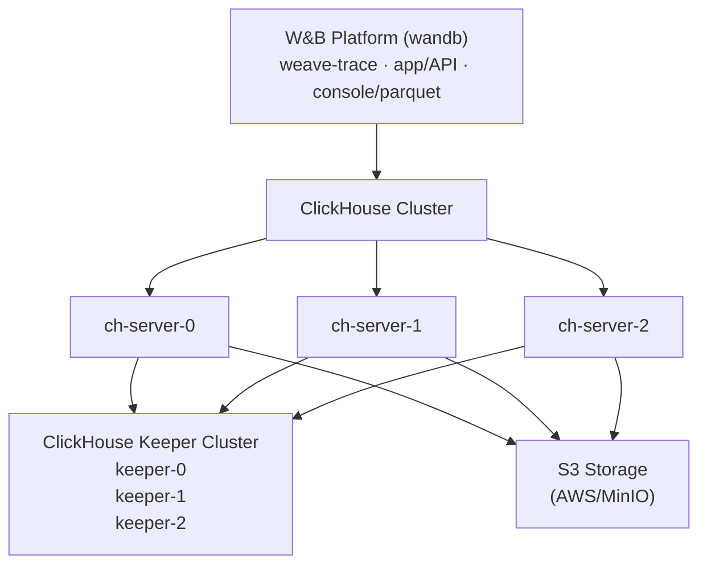

W&B Weave をセルフホストすると、その環境や設定をより細かく制御できます。これにより、より分離された環境を構築し、さらなるセキュリティおよびコンプライアンス要件を満たすのに役立ちます。本ドキュメントでは、Altinity ClickHouse Operator を使用して、自己管理型環境で W&B Weave を実行するために必要なすべてのコンポーネントをデプロイする方法を説明します。

自己管理型 Weave デプロイメントは、バックエンドの管理に [ClickHouseDB](https://clickhouse.com/) を使用します。このデプロイメントでは、次のコンポーネントを使用します。

- **Altinity ClickHouse Operator**: Kubernetes 向けのエンタープライズグレードの ClickHouse 管理
- **ClickHouse Keeper**: 分散コーディネーションサービス（ZooKeeper の代替）
- **ClickHouse Cluster**: トレースストレージ用の高可用性データベースクラスター
- **S3-Compatible Storage**: ClickHouse データの永続化用オブジェクトストレージ

<Tip>
詳細なリファレンスアーキテクチャについては、[W&B Self-Managed Reference Architecture](https://docs.wandb.ai/guides/hosting/self-managed/ref-arch/#models-and-weave) を参照してください。
</Tip>

<div id="important-setup-notes">
  ## セットアップに関する重要な注意事項
</div>

このガイド内の設定例はあくまで参考用です。各組織の Kubernetes 環境はそれぞれ異なるため、セルフホストのインスタンスでは次の点を調整する必要が生じることが多いでしょう。

- **セキュリティとコンプライアンス**: セキュリティコンテキスト、`runAsUser` / `fsGroup` の値、その他のセキュリティ設定を、組織のセキュリティポリシーおよび Kubernetes / OpenShift の要件に従って調整します。
- **リソースサイズ**: ここで示すリソース割り当てはあくまで初期値です。想定するトレース量とパフォーマンス要件に応じた適切なサイズ決定については、**W&B の Solutions Architect チームに相談してください**。
- **インフラ固有の事項**: ストレージクラス、ノードセレクタ、その他インフラ固有の設定を、実際の環境に合わせて更新します。

このガイド内のこれらの設定は、処方的な解としてではなく、テンプレートとして扱ってください。

<div id="architecture">
  ## アーキテクチャ
</div>


```mermaid
graph TD
    A["W&B Platform (wandb)<br/>weave-trace · app/API · console/parquet"] --> B["ClickHouse Cluster"]
    B --> C["ch-server-0"]
    B --> D["ch-server-1"]
    B --> E["ch-server-2"]
    C --> F["ClickHouse Keeper Cluster<br/>keeper-0 <br/>keeper-1 <br/>keeper-2"]
    D --> F
    E --> F
    C --> G["S3 Storage<br/>(AWS/MinIO)"]
    D --> G
    E --> G
```


<div id="prerequisites">
  ## 前提条件
</div>

自己管理型の Weave インスタンスには、次のリソースが必要です。

- **Kubernetes クラスター**: バージョン 1.29 以上
- **Kubernetes ノード**: マルチノードクラスター（高可用性のため最低 3 ノードを推奨）
- **Storage Class**: 永続ボリューム用に利用可能な StorageClass（例: `gp3`, `standard`, `nfs-csi`）
- **S3 バケット**: 適切なアクセス権限が設定された、事前構成済みの S3 または S3 互換バケット
- **W&B プラットフォーム**: すでにインストールされ稼働していること（[W&B Self-Managed Deployment Guide](https://docs.wandb.ai/guides/hosting/hosting-options/self-managed/) を参照）
- **W&B ライセンス**: W&B Support から提供された Weave 有効化ライセンス

<Warning>
リソースのサイジングを、この前提条件リストだけに基づいて行わないでください。必要なリソースは、トレース量や使用パターンによって大きく変動します。クラスタ規模の具体的な指針については、[Resource Requirements](#resource-requirements) セクションを参照してください。
</Warning>

<div id="required-tools">
  ### 必要なツール
</div>

インスタンスをセットアップするには、次のツールが必要です。

- クラスターへのアクセスが構成された `kubectl`
- `helm` v3.0 以上
- AWS 認証情報（S3 を使用する場合）または S3 互換ストレージへのアクセス

<div id="network-requirements">
  ### ネットワーク要件
</div>

Kubernetes クラスターでは、次のネットワーク構成が必要です。

- `clickhouse` ネームスペース内の Pod は、`wandb` ネームスペース内の Pod と通信できる必要があります。
- ClickHouse ノード同士が、ポート 8123、9000、9009、2181 で通信できる必要があります。

<div id="deploy-your-self-managed-weave-instance">
  ## セルフホスト型 Weave インスタンスをデプロイする
</div>

<div id="step-1-deploy-altinity-clickhouse-operator">
  ### ステップ 1: Altinity ClickHouse Operator をデプロイする
</div>

Altinity ClickHouse Operator は、Kubernetes クラスター上の ClickHouse のインストールを管理します。

<div id="11-add-the-altinity-helm-repository">
  #### 1.1 Altinity の Helm リポジトリを追加する
</div>

```bash
helm repo add altinity https://helm.altinity.com
helm repo update
```


<div id="12-create-the-operator-configuration">
  #### 1.2 オペレーターの設定を作成する
</div>

`ch-operator.yaml` という名前のファイルを作成します。

```yaml
operator:
  image:
    repository: altinity/clickhouse-operator
    tag: "0.25.4"

  # セキュリティコンテキスト - クラスターの要件に応じて調整してください
  containerSecurityContext:
    runAsGroup: 0
    runAsNonRoot: true
    runAsUser: 10001 # OpenShift/Kubernetesのセキュリティポリシーに合わせて更新してください
    allowPrivilegeEscalation: false
    capabilities:
      drop:
        - ALL
    privileged: false
    readOnlyRootFilesystem: false

metrics:
  enabled: false

# 名前のオーバーライド - 必要に応じてカスタマイズしてください
nameOverride: "wandb"
```

ここで示している `containerSecurityContext` の値は、ほとんどの Kubernetes ディストリビューションで問題なく動作します。**OpenShift** の場合は、`runAsUser` と `fsGroup` を、そのプロジェクトに割り当てられている UID の範囲に合わせて調整する必要が生じる場合があります。


<div id="13-install-the-operator">
  #### 1.3 オペレーターをインストールする
</div>

```bash
helm upgrade --install ch-operator altinity/altinity-clickhouse-operator \
  --version 0.25.4 \
  --namespace clickhouse \
  --create-namespace \
  -f ch-operator.yaml
```


<div id="14-verify-the-operator-installation">
  #### 1.4 Operator のインストールを確認する
</div>

```bash
# operator podが実行中であることを確認する
kubectl get pods -n clickhouse

# 期待される出力:
# NAME                                 READY   STATUS    RESTARTS   AGE
# ch-operator-wandb-xxxxx              1/1     Running   0          30s

# operatorのイメージバージョンを確認する
kubectl get pods -n clickhouse -o jsonpath="{.items[*].spec.containers[*].image}" | \
  tr ' ' '\n' | grep -v 'metrics-exporter' | sort -u

# 期待される出力:
# altinity/clickhouse-operator:0.25.4
```


<div id="step-2-prepare-s3-storage">
  ### ステップ 2: S3 ストレージを準備する
</div>

ClickHouse では、データを永続化するために S3 または S3 互換ストレージが必要です。

<div id="21-create-an-s3-bucket">
  #### 2.1 S3 バケットを作成する
</div>

AWS アカウントまたは S3 互換ストレージプロバイダー上に S3 バケットを作成します。

```bash
# AWSの例
aws s3 mb s3://my-wandb-clickhouse-bucket --region eu-central-1
```


<div id="22-configure-s3-credentials">
  #### 2.2 S3 認証情報を設定する
</div>

S3 の認証情報を設定する方法は 2 つあります。

<div id="option-a-using-aws-iam-roles-irsa-recommended-for-aws">
  ##### オプション A: AWS IAM ロール (IRSA) を使用する (AWS で推奨)
</div>

Kubernetes ノードに S3 へのアクセス権を持つ IAM ロールが設定されている場合、ClickHouse は EC2 インスタンスメタデータを利用できます。

```yaml
# ch-server.yaml に以下を設定:
<use_environment_credentials>true</use_environment_credentials>
```

**必須の IAM ポリシー**（ノードの IAM ロールに割り当て）:

```json
{
  "Version": "2012-10-17",
  "Statement": [
    {
      "Effect": "Allow",
      "Action": [
        "s3:GetObject",
        "s3:PutObject",
        "s3:DeleteObject",
        "s3:ListBucket"
      ],
      "Resource": [
        "arn:aws:s3:::my-wandb-clickhouse-bucket",
        "arn:aws:s3:::my-wandb-clickhouse-bucket/*"
      ]
    }
  ]
}
```


<div id="option-b-using-access-keys">
  ##### オプション B: アクセスキーを利用する
</div>

静的な認証情報を使用する場合は、Kubernetes の Secret を作成します。

```bash
kubectl create secret generic aws-creds \
  --namespace clickhouse \
  --from-literal aws_access_key=YOUR_ACCESS_KEY \
  --from-literal aws_secret_key=YOUR_SECRET_KEY
```

次に、ClickHouse がそのシークレットを使用するように設定します（以下の ch-server.yaml の設定を参照してください）。


<div id="step-3-deploy-clickhouse-keeper">
  ### ステップ 3: ClickHouse Keeper をデプロイする
</div>

[ClickHouse Keeper](https://clickhouse.com/docs/guides/sre/keeper/clickhouse-keeper) は、データレプリケーションと分散 DDL クエリの実行を調整するシステムを提供します。

<div id="31-create-the-keeper-configuration">
  #### 3.1 Keeper の設定を作成する
</div>

`ch-keeper.yaml` という名前のファイルを作成します。

```yaml
apiVersion: "clickhouse-keeper.altinity.com/v1"
kind: "ClickHouseKeeperInstallation"
metadata:
  name: wandb
  namespace: clickhouse
  annotations: {}
spec:
  defaults:
    templates:
      podTemplate: default
      dataVolumeClaimTemplate: default

  templates:
    podTemplates:
      - name: keeper
        metadata:
          labels:
            app: clickhouse-keeper
        spec:
          # Pod security context - adjust according to your environment
          securityContext:
            fsGroup: 10001 # Update based on your cluster's security requirements
            fsGroupChangePolicy: Always
            runAsGroup: 0
            runAsNonRoot: true
            runAsUser: 10001 # For OpenShift, use your project's assigned UID range
            seccompProfile:
              type: RuntimeDefault

          # ノード間にKeeperを分散させるためのアンチアフィニティ（HAに推奨）
          # クラスターのサイズと可用性要件に応じてカスタマイズまたは削除してください
          affinity:
            podAntiAffinity:
              requiredDuringSchedulingIgnoredDuringExecution:
                - labelSelector:
                    matchExpressions:
                      - key: "app"
                        operator: In
                        values:
                          - clickhouse-keeper
                  topologyKey: "kubernetes.io/hostname"

          containers:
            - name: clickhouse-keeper
              imagePullPolicy: IfNotPresent
              image: "clickhouse/clickhouse-keeper:25.3.5.42"
              # Resource requests - example values, adjust based on workload
              resources:
                requests:
                  memory: "256Mi"
                  cpu: "0.5"
                limits:
                  memory: "2Gi"
                  cpu: "1"

              securityContext:
                allowPrivilegeEscalation: false
                capabilities:
                  drop:
                    - ALL
                privileged: false
                readOnlyRootFilesystem: false

    volumeClaimTemplates:
      - name: data
        metadata:
          labels:
            app: clickhouse-keeper
        spec:
          storageClassName: gp3 # Change to your StorageClass
          accessModes:
            - ReadWriteOnce
          resources:
            requests:
              storage: 10Gi

  configuration:
    clusters:
      - name: keeper # Keeper cluster name - used in service DNS naming
        layout:
          replicasCount: 3
        templates:
          podTemplate: keeper
          dataVolumeClaimTemplate: data

    settings:
      logger/level: "information"
      logger/console: "true"
      listen_host: "0.0.0.0"
      keeper_server/four_letter_word_white_list: "*"
      keeper_server/coordination_settings/raft_logs_level: "information"
      keeper_server/enable_ipv6: "false"
      keeper_server/coordination_settings/async_replication: "true"
```

**重要な設定更新事項**:

* **StorageClass**: クラスターで利用可能な StorageClass に合わせて、`storageClassName: gp3` の値を更新します
* **Security Context**: 組織のセキュリティポリシーに準拠するように、`runAsUser`、`fsGroup` の値を調整します
* **Anti-Affinity**: クラスターのトポロジーと HA 要件に基づいて、`affinity` セクションをカスタマイズするか削除します
* **Resources**: CPU/メモリの値はあくまで一例です。適切なサイズについては W&amp;B Solutions Architects に相談してください
* **Naming**: `metadata.name` または `configuration.clusters[0].name` を変更する場合は、ch-server.yaml（手順 4）内の Keeper ホスト名を一致するように**必ず更新してください**


<div id="32-deploy-clickhouse-keeper">
  #### 3.2 ClickHouse Keeper をデプロイする
</div>

```bash
kubectl apply -f ch-keeper.yaml
```

NAME                                      READY   STATUS    RESTARTS   AGE
clickhouse-operator-857c69ffc6-2v4jh     2/2     Running   0          1m

````

### Step 2: Configure S3 Storage

#### 3.3 Verify Keeper deployment

```bash
# Keeper ポッドを確認する
kubectl get pods -n clickhouse -l app=clickhouse-keeper

# 期待される出力:
# NAME                     READY   STATUS    RESTARTS   AGE
# chk-wandb-keeper-0-0-0   1/1     Running   0          2m
# chk-wandb-keeper-0-1-0   1/1     Running   0          2m
# chk-wandb-keeper-0-2-0   1/1     Running   0          2m

# Keeper サービスを確認する
kubectl get svc -n clickhouse | grep keeper

# ポート 2181 で keeper サービスが表示されることを期待する
````


<div id="step-4-deploy-clickhouse-cluster">
  ### ステップ 4: ClickHouse クラスターをデプロイする
</div>

Weave のトレースデータを保存するための ClickHouse サーバークラスターをデプロイします。

<div id="41-create-the-clickhouse-server-configuration">
  #### 4.1 ClickHouse サーバーの設定を作成する
</div>

`ch-server.yaml` という名前のファイルを作成します。

```yaml
apiVersion: "clickhouse.altinity.com/v1"
kind: "ClickHouseInstallation"
metadata:
  name: wandb
  namespace: clickhouse
  annotations: {}
spec:
  defaults:
    templates:
      podTemplate: default
      dataVolumeClaimTemplate: default

  templates:
    podTemplates:
      - name: clickhouse
        metadata:
          labels:
            app: clickhouse-server
        spec:
          # Podセキュリティコンテキスト - 環境に合わせてカスタマイズしてください
          securityContext:
            fsGroup: 10001 # セキュリティポリシーに合わせて調整してください
            fsGroupChangePolicy: Always
            runAsGroup: 0
            runAsNonRoot: true
            runAsUser: 10001 # OpenShiftの場合は、割り当てられたUID範囲を使用してください
            seccompProfile:
              type: RuntimeDefault

          # アンチアフィニティルール - サーバーを異なるノードで実行することを保証します（任意ですが推奨）
          # クラスターのサイズと要件に応じて調整または削除してください
          affinity:
            podAntiAffinity:
              requiredDuringSchedulingIgnoredDuringExecution:
                - labelSelector:
                    matchExpressions:
                      - key: "app"
                        operator: In
                        values:
                          - clickhouse-server
                  topologyKey: "kubernetes.io/hostname"

          containers:
            - name: clickhouse
              image: clickhouse/clickhouse-server:25.3.5.42
              # リソース割り当ての例 - ワークロードに応じて調整してください
              resources:
                requests:
                  memory: 1Gi
                  cpu: 1
                limits:
                  memory: 16Gi
                  cpu: 4

              # AWSクレデンシャル（IRSAを使用する場合はこのセクションを削除してください）
              env:
                - name: AWS_ACCESS_KEY_ID
                  valueFrom:
                    secretKeyRef:
                      name: aws-creds
                      key: aws_access_key
                - name: AWS_SECRET_ACCESS_KEY
                  valueFrom:
                    secretKeyRef:
                      name: aws-creds
                      key: aws_secret_key

              securityContext:
                allowPrivilegeEscalation: false
                capabilities:
                  drop:
                    - ALL
                privileged: false
                readOnlyRootFilesystem: false

    volumeClaimTemplates:
      - name: data
        metadata:
          labels:
            app: clickhouse-server
        spec:
          accessModes:
            - ReadWriteOnce
          resources:
            requests:
              storage: 50Gi
          storageClassName: gp3 # 使用するStorageClassに変更してください

  configuration:
    # Keeper（ZooKeeper）の設定
    # 重要: これらのホスト名はステップ3のKeeperデプロイメントのホスト名と一致している必要があります
    zookeeper:
      nodes:
        - host: chk-wandb-keeper-0-0.clickhouse.svc.cluster.local
          port: 2181
        - host: chk-wandb-keeper-0-1.clickhouse.svc.cluster.local
          port: 2181
        - host: chk-wandb-keeper-0-2.clickhouse.svc.cluster.local
          port: 2181
      # 任意: タイムアウトを調整する場合はコメントを解除してください
      # session_timeout_ms: 30000
      # operation_timeout_ms: 10000

    # ユーザー設定: https://clickhouse.com/docs/operations/configuration-files#user-settings
    # パスワードのヒント:
    # sha256sum <<< weave123 OR echo -n weave123 | sha256sum OR printf "weave123" | sha256sum
    # ユーザー設定では <password_sha256_hex>...</password_sha256_hex> として返されます
    users:
      weave/password: weave123
      weave/access_management: 1
      weave/profile: default
      weave/networks/ip:
        - "0.0.0.0/0"
        - "::"

    # サーバー設定
    settings:
      disable_internal_dns_cache: 1

    # クラスター設定
    clusters:
      - name: weavecluster # クラスター名 - カスタマイズ可能ですが、wandb-cr.yamlと一致している必要があります
        layout:
          shardsCount: 1
          replicasCount: 3 # レプリカ数 - HA要件に応じて調整してください
        templates:
          podTemplate: clickhouse
          dataVolumeClaimTemplate: data

    # 設定ファイル
    files:
      config.d/network_configuration.xml: |
        <clickhouse>
            <listen_host>0.0.0.0</listen_host>
            <listen_host>::</listen_host>
        </clickhouse>

      config.d/logger.xml: |
        <clickhouse>
            <logger>
                <level>information</level>
            </logger>
        </clickhouse>

      config.d/storage_configuration.xml: |
        <clickhouse>
            <storage_configuration>
                <disks>
                    <s3_disk>
                        <type>s3</type>
                        <!-- S3バケットのエンドポイントとリージョンを更新してください -->
                        <endpoint>https://YOUR-BUCKET-NAME.s3.YOUR-REGION.amazonaws.com/s3_disk/{replica}</endpoint>
                        <metadata_path>/var/lib/clickhouse/disks/s3_disk/</metadata_path>
                        <use_environment_credentials>true</use_environment_credentials>
                        <region>YOUR-REGION</region>
                    </s3_disk>
                    <s3_disk_cache>
                        <type>cache</type>
                        <disk>s3_disk</disk>
                        <path>/var/lib/clickhouse/s3_disk_cache/cache/</path>
                        <!-- キャッシュサイズは永続ボリュームより小さくする必要があります -->
                        <max_size>40Gi</max_size>
                        <cache_on_write_operations>true</cache_on_write_operations>
                    </s3_disk_cache>
                </disks>
                <policies>
                    <s3_main>
                        <volumes>
                            <main>
                                <disk>s3_disk_cache</disk>
                            </main>
                        </volumes>
                    </s3_main>
                </policies>
            </storage_configuration>
            <merge_tree>
                <storage_policy>s3_main</storage_policy>
            </merge_tree>
        </clickhouse>
```

**重要な設定の更新が必要です**:

1. **StorageClass**: `storageClassName: gp3` をクラスターの StorageClass に合わせて更新します
2. **S3 Endpoint**: `YOUR-BUCKET-NAME` と `YOUR-REGION` を実際の値に置き換えます
3. **Cache Size**: `<max_size>40Gi</max_size>` は永続ボリュームのサイズ (50Gi) よりも **小さく** する必要があります
4. **Security Context**: `runAsUser`、`fsGroup`、およびその他のセキュリティ設定を組織のポリシーに合わせて調整します
5. **Resource Allocation**: CPU/メモリ値はあくまで例です — 予想されるトレース量に基づく適切なリソースサイズの決定については、**W&B Solutions Architect に相談してください**
6. **Anti-Affinity Rules**: クラスターのトポロジーと高可用性要件に応じてカスタマイズするか削除します
7. **Keeper Hostnames**: Keeper ノードのホスト名は、必ずステップ 3 の Keeper デプロイメントの命名と **一致させる必要があります**（下記の「Keeper 命名の理解」を参照）
8. **Cluster Naming**: クラスター名 `weavecluster` は変更可能ですが、ステップ 5 の `WF_CLICKHOUSE_REPLICATED_CLUSTER` の値と一致している必要があります
9. **Credentials**:
   - IRSA の場合: `<use_environment_credentials>true</use_environment_credentials>` を維持するか、環境変数にマッピングされたシークレットキーを利用します。

<div id="42-update-s3-configuration">
  #### 4.2 S3 設定を更新する
</div>

`ch-server.yaml` 内の `storage_configuration.xml` セクションを編集します:

**AWS S3 の例**:

```xml
<endpoint>https://my-wandb-clickhouse.s3.eu-central-1.amazonaws.com/s3_disk/{replica}</endpoint>
<region>eu-central-1</region>
```

**MinIO 用の例**:

```xml
<endpoint>https://minio.example.com:9000/my-bucket/s3_disk/{replica}</endpoint>
<region>us-east-1</region>
```

<Warning>
  **`{replica}` を削除しないでください。** これにより、各 ClickHouse レプリカがバケット内の専用フォルダに書き込むようになります。
</Warning>


<div id="43-configure-credentials-option-b-only">
  #### 4.3 認証情報を設定する（オプション B のみ）
</div>

Step 2 で **オプション B（アクセスキー）** を使用している場合は、`ch-server.yaml` の `env` セクションが `Secret` を参照していることを確認してください。

```yaml
env:
  - name: AWS_ACCESS_KEY_ID
    valueFrom:
      secretKeyRef:
        name: aws-creds
        key: aws_access_key
  - name: AWS_SECRET_ACCESS_KEY
    valueFrom:
      secretKeyRef:
        name: aws-creds
        key: aws_secret_key
```

**Option A (IRSA)** を使用する場合は、`env` セクション全体を削除してください。


<div id="44-understanding-keeper-naming">
  #### 4.4 Keeper の名前付け規則について
</div>

`zookeeper.nodes` セクション内の Keeper ノードのホスト名は、ステップ 3 で行った Keeper のデプロイに基づいた特定のパターンに従います。

**ホスト名パターン**: `chk-{installation-name}-{cluster-name}-{cluster-index}-{replica-index}.{namespace}.svc.cluster.local`

それぞれの意味は次のとおりです:

* `chk` = ClickHouseKeeperInstallation の接頭辞（固定）
* `{installation-name}` = ch-keeper.yaml の `metadata.name`（例: `wandb`）
* `{cluster-name}` = ch-keeper.yaml の `configuration.clusters[0].name`（例: `keeper`）
* `{cluster-index}` = クラスターのインデックス。単一クラスターの場合は通常 `0`
* `{replica-index}` = レプリカ番号。3 レプリカの場合は `0`, `1`, `2`
* `{namespace}` = Kubernetes の Namespace（例: `clickhouse`）

**デフォルト名を使った例**:

```
chk-wandb-keeper-0-0.clickhouse.svc.cluster.local
chk-wandb-keeper-0-1.clickhouse.svc.cluster.local
chk-wandb-keeper-0-2.clickhouse.svc.cluster.local
```

**Keeper のインストール名をカスタマイズしている場合**（例: `metadata.name: myweave`）:

```
chk-myweave-keeper-0-0.clickhouse.svc.cluster.local
chk-myweave-keeper-0-1.clickhouse.svc.cluster.local
chk-myweave-keeper-0-2.clickhouse.svc.cluster.local
```

**Keeper クラスター名をカスタマイズしている場合**（例: `clusters[0].name: coordination`）:

```
chk-wandb-coordination-0-0.clickhouse.svc.cluster.local
chk-wandb-coordination-0-1.clickhouse.svc.cluster.local
chk-wandb-coordination-0-2.clickhouse.svc.cluster.local
```

**実際の Keeper ホスト名を確認するには**:

```bash
# 実際の名前を確認するためにKeeperサービスを一覧表示する
kubectl get svc -n clickhouse | grep keeper

# 命名パターンを確認するためにKeeperポッドを一覧表示する
kubectl get pods -n clickhouse -l app=clickhouse-keeper
```

<Note>
  `ch-server.yaml` 内の Keeper のホスト名は、Keeper デプロイによって作成される実際のサービス名と**完全に一致していなければなりません**。一致していない場合、ClickHouse サーバーはコーディネーションサービスに接続できません。
</Note>


<div id="45-deploy-clickhouse-cluster">
  #### 4.5 ClickHouse クラスターをデプロイする
</div>

```bash
kubectl apply -f ch-server.yaml
```


<div id="46-verify-clickhouse-deployment">
  #### 4.6 ClickHouse デプロイを検証する
</div>

```bash
# ClickHouse ポッドを確認する
kubectl get pods -n clickhouse -l app=clickhouse-server

# 期待される出力:
# NAME                           READY   STATUS    RESTARTS   AGE
# chi-wandb-weavecluster-0-0-0   1/1     Running   0          3m
# chi-wandb-weavecluster-0-1-0   1/1     Running   0          3m
# chi-wandb-weavecluster-0-2-0   1/1     Running   0          3m

# ClickHouse の接続性をテストする
kubectl exec -n clickhouse chi-wandb-weavecluster-0-0-0 -- \
  clickhouse-client --user weave --password weave123 --query "SELECT version()"

# クラスターのステータスを確認する
kubectl exec -n clickhouse chi-wandb-weavecluster-0-0-0 -- \
  clickhouse-client --user weave --password weave123 --query \
  "SELECT cluster, host_name, port FROM system.clusters WHERE cluster='weavecluster'"
```


<div id="step-5-enable-weave-in-wb-platform">
  ### ステップ5: W&B プラットフォームで Weave を有効にする
</div>

W&B プラットフォームで Weave のトレースに ClickHouse クラスターを使用するように設定します。

<div id="51-gather-clickhouse-connection-information">
  #### 5.1 ClickHouse 接続情報を収集する
</div>

次の情報が必要です。

- **Host**: `clickhouse-wandb.clickhouse.svc.cluster.local`
- **Port**: `8123`
- **User**: `weave`（ch-server.yaml で設定）
- **Password**: `weave123`（ch-server.yaml で設定）
- **Database**: `weave`（自動的に作成されます）
- **Cluster Name**: `weavecluster`（ch-server.yaml で設定）

ホスト名は次のパターンに従います: `clickhouse-{installation-name}.{namespace}.svc.cluster.local`

<div id="52-update-wb-custom-resource">
  #### 5.2 W&amp;B カスタムリソースを更新する
</div>

Weave 設定を追加するために、W&amp;B Platform カスタムリソース (CR) を編集します。

```yaml
apiVersion: apps.wandb.com/v1
kind: WeightsAndBiases
metadata:
  name: wandb
  namespace: wandb
spec:
  values:
    global:
      # ... 既存の設定 ...

      # ClickHouse 設定を追加
      clickhouse:
        install: false # 別途デプロイ済み
        host: clickhouse-wandb.clickhouse.svc.cluster.local
        port: 8123
        user: weave
        password: weave123
        database: weave
        replicated: true # マルチレプリカ構成では必須

      # Weave Trace を有効化
      weave-trace:
        enabled: true

    # Weave Trace 設定
    weave-trace:
      install: true
      extraEnv:
        WF_CLICKHOUSE_REPLICATED: "true"
        WF_CLICKHOUSE_REPLICATED_CLUSTER: "weavecluster"
      image:
        repository: wandb/weave-trace
        tag: 0.74.1
      replicaCount: 1
      size: "default"
      sizing:
        default:
          autoscaling:
            horizontal:
              enabled: false
          # リソース割り当ての例 - ワークロードに応じて調整してください
          resources:
            limits:
              cpu: 4
              memory: "8Gi"
            requests:
              cpu: 1
              memory: "4Gi"
      # Pod セキュリティコンテキスト - 環境に合わせてカスタマイズしてください
      podSecurityContext:
        fsGroup: 10001 # セキュリティ要件に応じて調整してください
        fsGroupChangePolicy: Always
        runAsGroup: 0
        runAsNonRoot: true
        runAsUser: 10001 # OpenShift の場合は割り当てられた UID 範囲を使用してください
        seccompProfile:
          type: RuntimeDefault
      # コンテナセキュリティコンテキスト
      securityContext:
        allowPrivilegeEscalation: false
        capabilities:
          drop:
            - ALL
        privileged: false
        readOnlyRootFilesystem: false
```

**重要な設定**:

* `clickhouse.replicated: true` - 3 レプリカを使用する場合に**必須**
* `WF_CLICKHOUSE_REPLICATED: "true"` - レプリケーション構成では**必須**
* `WF_CLICKHOUSE_REPLICATED_CLUSTER: "weavecluster"` - ch-server.yaml 内のクラスタ名と**一致させる必要があります**

<Note>
  上記のセキュリティコンテキスト、リソース割り当て、その他の Kubernetes 固有の設定は参考例です。組織の要件に応じてカスタマイズし、適切なリソースサイズを検討するために W&amp;B Solutions Architect チームに相談してください。
</Note>


<div id="53-apply-the-updated-configuration">
  #### 5.3 更新した設定を適用する
</div>

```bash
kubectl apply -f wandb-cr.yaml
```


<div id="54-verify-weave-trace-deployment">
  #### 5.4 Weave Trace のデプロイを検証する
</div>

```bash
# weave-trace podのステータスを確認する
kubectl get pods -n wandb | grep weave-trace

# 期待される出力:
# wandb-weave-trace-bc-xxxxx   1/1     Running   0          2m

# ClickHouse接続に関するweave-traceのログを確認する
kubectl logs -n wandb <weave-trace-pod-name> --tail=50

# ClickHouse接続成功のメッセージを確認する
```


<div id="step-6-initialize-weave-database">
  ### ステップ 6: Weave データベースの初期化
</div>

`weave-trace` サービスは、初回起動時に必要なデータベーススキーマを自動的に作成します。

<div id="61-monitor-database-migration">
  #### 6.1 データベース移行を監視する
</div>

```bash
# 起動中にweave-traceのログを監視する
kubectl logs -n wandb <weave-trace-pod-name> -f

# データベースの初期化が成功したことを示すマイグレーションメッセージを確認する
```


<div id="62-verify-database-creation">
  #### 6.2 データベース作成を確認する
</div>

```bash
# ClickHouseに接続してデータベースを確認する
kubectl exec -n clickhouse chi-wandb-weavecluster-0-0-0 -- \
  clickhouse-client --user weave --password weave123 --query \
  "SHOW DATABASES"

# 'weave' データベースが一覧に表示されることを期待する

# weave データベースのテーブルを確認する
kubectl exec -n clickhouse chi-wandb-weavecluster-0-0-0 -- \
  clickhouse-client --user weave --password weave123 --query \
  "SHOW TABLES FROM weave"
```


<div id="step-7-verify-weave-is-enabled">
  ### 手順 7: Weave が有効になっていることを確認する
</div>

<div id="71-access-wb-console">
  #### 7.1 W&B Console にアクセスする
</div>

Web ブラウザで W&B インスタンスの URL を開きます。

<div id="72-check-weave-license-status">
  #### 7.2 Weave ライセンスステータスを確認する
</div>

W&B コンソールで次の操作を行います:

1. **右上メニュー** → **Organization ダッシュボード** に移動します
2. **Weave access** が有効化されていることを確認します

<div id="73-test-weave-functionality">
  #### 7.3 Weave 機能のテスト
</div>

Weave が正しく動作していることを確認するために、簡単な Python のテストを作成します。

```python
import weave

# Weave を初期化する（実際の W&B ホストに置き換えてください）
weave.init('test-project')

# シンプルなトレース関数を作成する
@weave.op()
def hello_weave(name: str) -> str:
    return f"Hello, {name}!"

# 関数を呼び出す
result = hello_weave("World")
print(result)
```

これを実行したら、所属する組織の W&amp;B UI の traces ページで traces を確認してください。


<div id="troubleshooting">
  ## トラブルシューティング
</div>

<div id="clickhouse-keeper-issues">
  ### ClickHouse Keeper の問題
</div>

**問題**: Keeper の Pod が `Pending` 状態のままになる

**解決方法**: 考えられる複数の原因を確認する:

1. **PVC および StorageClass の問題**:

```bash
kubectl get pvc -n clickhouse
kubectl describe pvc -n clickhouse
```

`StorageClass` が正しく構成されており、十分な空き容量が確保されていることを確認してください。

2. **アンチアフィニティとノードの可用性**:

```bash
# アンチアフィニティルールがスケジューリングを妨げていないか確認する
kubectl describe pod -n clickhouse <pod-name> | grep -A 10 "Events:"

# 利用可能なノードとそのリソースを確認する
kubectl get nodes
kubectl describe nodes | grep -A 5 "Allocated resources"
```

よくある問題:

* アンチアフィニティには 3 つの別々のノードが必要だが、クラスタのノード数がそれ未満である
* ノードの CPU/メモリが不足しており、Pod のリクエストを満たせない
* ノードのテイントにより、Pod のスケジューリングが妨げられている

**解決策**:

* ノードが 3 つ未満の場合は、アンチアフィニティルールを削除するか調整する
* より緩いアンチアフィニティにするために、`requiredDuringSchedulingIgnoredDuringExecution` の代わりに `preferredDuringSchedulingIgnoredDuringExecution` を使用する
* ノードに制約がある場合は、リソースリクエストを減らす
* クラスタにノードを追加する

***

**問題**: Keeper Pod が `CrashLoopBackOff` になっている

**解決策**: ログを確認し、設定を検証する。

```bash
kubectl logs -n clickhouse <keeper-pod-name>
```

よくある問題:

* セキュリティコンテキストの誤設定（runAsUser、fsGroup を確認）
* ボリュームの権限設定の問題
* ポートの競合
* ch-keeper.yaml の設定エラー


<div id="clickhouse-server-issues">
  ### ClickHouse サーバーに関する問題
</div>

**問題**: ClickHouse が S3 に接続できません

**解決策**: S3 の認証情報と権限を確認してください:

```bash
# シークレットが存在するか確認（アクセスキーを使用している場合）
kubectl get secret aws-creds -n clickhouse

# ClickHouseログでS3エラーを確認
kubectl logs -n clickhouse <clickhouse-pod-name> | grep -i s3

# ストレージ設定内のS3エンドポイントを確認
kubectl get chi wandb -n clickhouse -o yaml | grep -A 10 storage_configuration
```

***

**問題**: ClickHouse が Keeper に接続できない

**解決策**: Keeper のエンドポイントとネーミング設定を確認する:

```bash
# Keeperサービスと実際の名前を確認する
kubectl get svc -n clickhouse | grep keeper

# Keeperポッドを確認して命名パターンを確認する
kubectl get pods -n clickhouse -l app=clickhouse-keeper

# ch-server.yamlのzookeeper.nodes設定と比較する
# ホスト名は実際のサービス名と一致している必要がある

# ClickHouseログで接続エラーを確認する
kubectl logs -n clickhouse chi-wandb-weavecluster-0-0-0 | grep -i keeper
```

接続に失敗する場合は、`ch-server.yaml` 内の Keeper ホスト名が実際の Keeper デプロイメントと一致していない可能性があります。命名パターンについては、手順 4 の「Keeper の命名規則について」を参照してください。


<div id="weave-trace-issues">
  ### Weave Trace の問題
</div>

**問題**: `weave-trace` Pod が起動に失敗する

**解決方法**: ClickHouse への接続を確認する：

```bash
# weave-trace のポッド名を取得する
kubectl get pods -n wandb | grep weave-trace

# weave-trace のログを確認する
kubectl logs -n wandb <weave-trace-pod-name>

# よくあるエラー: "connection refused" または "authentication failed"
# wandb-cr.yaml の ClickHouse 認証情報が ch-server.yaml と一致しているか確認する
```

***

**問題**: Console で Weave が有効として表示されない

**解決策**: 設定を確認してください:

1. ライセンスに Weave が含まれていることを確認します:

   ```bash
   kubectl get secret license-key -n wandb -o jsonpath='{.data.value}' | base64 -d | jq
   ```

2. wandb-cr.yaml で `weave-trace.enabled: true` と `clickhouse.replicated: true` が設定されていることを確認します。

3. W&amp;B オペレーターのログを確認します:
   ```bash
   kubectl logs -n wandb deployment/wandb-controller-manager
   ```

***

**問題**: データベース移行が失敗する

**解決策**: クラスター名が一致しているか確認してください:

`WF_CLICKHOUSE_REPLICATED_CLUSTER` 環境変数は、ch-server.yaml 内のクラスター名と **一致している必要があります**。

```yaml
# ch-server.yaml 内:
clusters:
  - name: weavecluster # <-- この名前

# wandb-cr.yaml 内の値と一致させること:
weave-trace:
  extraEnv:
    WF_CLICKHOUSE_REPLICATED_CLUSTER: "weavecluster" # <-- この値
```


<div id="resource-requirements">
  ## リソース要件
</div>

<Warning>
以下のリソース割り当ては、**あくまで初期の目安に過ぎません**。実際の要件は次の要因によって大きく変動します。

- トレース取り込み量（1 秒あたりのトレース数）
- クエリパターンと同時実行数
- データ保持期間
- 同時接続ユーザー数

**必ず W&B の Solutions Architect チームに相談し**、ユースケースに応じて適切なサイジングを決定してください。リソースの過少割り当てはパフォーマンス問題を引き起こし、過剰割り当てはインフラストラクチャコストの無駄につながります。
</Warning>

<div id="minimum-production-setup">
  ### 最小本番構成
</div>

| コンポーネント    | レプリカ数      | CPU リクエスト / 制限 | メモリ リクエスト / 制限 | ストレージ  |
| ----------------- | --------------- | ---------------------- | ------------------------- | ----------- |
| ClickHouse Keeper | 3               | 0.5 / 1                | 256Mi / 2Gi               | 各 10Gi     |
| ClickHouse Server | 3               | 1 / 4                  | 1Gi / 16Gi                | 各 50Gi     |
| Weave Trace       | 1               | 1 / 4                  | 4Gi / 8Gi                 | -           |
| **Total**         | **7 個の Pod**  | **~4.5 / 15 CPU**      | **~7.8Gi / 58Gi**         | **180Gi**   |

_想定用途: 開発、テスト、または低トラフィックの本番環境_

<div id="recommended-production-setup">
  ### 推奨本番構成
</div>

大量のトレースを扱う本番ワークロードの場合:

| Component         | Replicas     | CPU Request / Limit  | Memory Request / Limit   | Storage    |
| ----------------- | ------------ | -------------------- | ------------------------ | ---------- |
| ClickHouse Keeper | 3            | 1 / 2                | 1Gi / 4Gi                | 20Gi 各    |
| ClickHouse Server | 3            | 1 / 16               | 8Gi / 64Gi               | 200Gi 各   |
| Weave Trace       | 2-3          | 1 / 4                | 4Gi / 8Gi                | -          |
| **Total**         | **8-9 pods** | **~6-9 / 52-64 CPU** | **~27-33Gi / 204-216Gi** | **660Gi**  |

_適用対象: トレース量が多い本番環境_

超大規模なトレース量のデプロイメントの場合は、特定のトレース量およびパフォーマンス要件に基づいたカスタムサイジングの推奨について、W&B の Solutions Architect チームまでお問い合わせください。

<div id="advanced-configuration">
  ## 高度な設定
</div>

このセクションでは、自己管理型 Weave デプロイメント向けのカスタマイズオプションについて説明します。これには、垂直スケーリングまたは水平スケーリングによる ClickHouse の処理容量のスケーリング、keeper と server の両方の設定におけるイメージタグの変更による ClickHouse バージョンの更新、そして ClickHouse のヘルスチェックおよび状態監視が含まれます。

パフォーマンスと信頼性の要件に適合していることを確認するため、高度な変更をインスタンスに加える際には、W&amp;B のソリューションアーキテクトチームに相談することを推奨します。

<div id="scaling-clickhouse">
  ### ClickHouse のスケーリング
</div>

ClickHouse の処理能力を増やすには、次の方法があります。

1. **垂直スケーリング**: Pod ごとのリソースを増やす（よりシンプルな方法）

   ```yaml
   resources:
     requests:
       memory: 8Gi
       cpu: 1
     limits:
       memory: 64Gi
       cpu: 16
   ```

   **推奨**: 実際のリソース使用状況を監視し、それに応じてスケールしてください。超大規模デプロイの場合は、W&B の Solutions Architect チームに連絡してください。

2. **水平スケーリング**: レプリカを追加する（慎重な計画が必要）
   - レプリカの増加にはデータの再配置（リバランス）が必要
   - シャード管理については ClickHouse のドキュメントを参照
   - 本番環境で水平スケーリングを実装する前に、**W&B の Solutions Architect に連絡**してください

<div id="using-different-clickhouse-versions">
  ### 別の ClickHouse バージョンを使用する
</div>

別の ClickHouse バージョンを使用するには、ch-keeper.yaml と ch-server.yaml の両方で image タグを更新してください。

```yaml
image: clickhouse/clickhouse-keeper:25.3.5.42   # Keeperバージョン
image: clickhouse/clickhouse-server:25.3.5.42   # Serverバージョン
```

互換性を確保するには、Keeper とサーバーのバージョンを一致させるか、Keeper のバージョンをサーバーのバージョン以上にする必要があります。


<div id="monitoring-clickhouse">
  ### ClickHouse の監視
</div>

監視には ClickHouse のシステムテーブルを利用します。

```bash
# ディスク使用量を確認する
kubectl exec -n clickhouse chi-wandb-weavecluster-0-0-0 -- \
  clickhouse-client --user weave --password weave123 --query \
  "SELECT name, path, formatReadableSize(free_space) as free, formatReadableSize(total_space) as total FROM system.disks"

# レプリケーションステータスを確認する
kubectl exec -n clickhouse chi-wandb-weavecluster-0-0-0 -- \
  clickhouse-client --user weave --password weave123 --query \
  "SELECT database, table, is_leader, total_replicas, active_replicas FROM system.replicas WHERE database='weave'"

# ClickHouseサーバーのステータスを確認する
kubectl get pods -n clickhouse -l app=clickhouse-server
```


<div id="backup-and-recovery">
  ### バックアップとリカバリ
</div>

ClickHouse のデータは S3 に保存されており、S3 のバージョニング機能とバケットレプリケーション機能によって、バックアップ機能が本来的に備わっています。お使いのデプロイ環境に固有のバックアップ戦略については、W&B の Solutions Architect チームに相談し、[ClickHouse のバックアップに関するドキュメント](https://clickhouse.com/docs/en/operations/backup)を参照してください。

<div id="security-considerations">
  ## セキュリティ上の考慮事項
</div>

1. **認証情報**: ClickHouse のパスワードは平文ではなく、Kubernetes Secret に保存する
2. **ネットワークポリシー**: ClickHouse へのアクセスを制限するために NetworkPolicy の導入を検討する
3. **RBAC**: ServiceAccount には必要最小限の権限のみを付与する
4. **S3 バケット**: 保存データの暗号化を有効にし、必要な IAM ロールにのみバケットへのアクセスを制限する
5. **TLS**（任意）: 本番環境では、ClickHouse クライアント接続に TLS を有効にする

<div id="upgrading">
  ## アップグレード
</div>

<div id="upgrading-clickhouse-operator">
  ### ClickHouse Operator のアップグレード
</div>

```bash
helm upgrade ch-operator altinity/altinity-clickhouse-operator \
  --version 0.25.4 \
  --namespace clickhouse \
  -f ch-operator.yaml
```


<div id="upgrading-clickhouse-server">
  ### ClickHouse サーバーのアップグレード
</div>

`ch-server.yaml` 内のイメージのバージョンを更新して、適用します。

```bash
# ch-server.yaml を編集し、イメージタグを変更する
kubectl apply -f ch-server.yaml

# Pod を監視する
kubectl get pods -n clickhouse
```


<div id="upgrading-weave-trace">
  ### Weave Trace のアップグレード
</div>

`wandb-cr.yaml` 内のイメージタグを更新し、適用します:

```bash
kubectl apply -f wandb-cr.yaml

# weave-trace podの再起動を監視する
kubectl get pods -n wandb | grep weave-trace
```


<div id="additional-resources">
  ## 参考資料
</div>

- [Altinity ClickHouse Operator ドキュメント](https://docs.altinity.com/altinitykubernetesoperator/)
- [ClickHouse ドキュメント](https://clickhouse.com/docs)
- [W&B Weave ドキュメント](https://docs.wandb.ai/weave)
- [ClickHouse S3 ストレージの設定](https://clickhouse.com/docs/en/engines/table-engines/mergetree-family/mergetree#s3-virtual-hosted-style)

<div id="support">
  ## サポート
</div>

本番環境へのデプロイや問題が発生した場合：

- **W&B サポート**: `support@wandb.com`
- **Solutions Architects**: 超大規模デプロイ、リソース規模のカスタマイズ、デプロイ計画に関するサポート
- **サポート依頼時に含める情報**:
  - weave-trace、ClickHouse ポッド、operator のログ
  - W&B バージョン、ClickHouse バージョン、Kubernetes バージョン
  - クラスター情報とトレースボリューム

<div id="faq">
  ## FAQ
</div>

**Q: ClickHouse のレプリカを 3 ではなく 1 つだけ使うことはできますか？**

A: はい、可能ですが、本番環境では推奨されません。ch-server.yaml の `replicasCount: 1` に変更し、wandb-cr.yaml で `clickhouse.replicated: false` を設定してください。

**Q: ClickHouse の代わりに別のデータベースを使うことはできますか？**

A: いいえ。Weave Trace は、高性能なカラム型ストレージ機能を利用するために ClickHouse を必要とします。

**Q: どれくらいの S3 ストレージが必要になりますか？**

A: 必要な S3 ストレージ容量は、トレースのボリューム、保持期間、データ圧縮率によって異なります。デプロイ後に実際の使用量を監視し、それに応じて調整してください。ClickHouse のカラム型フォーマットは、トレースデータを非常に高い圧縮率で保存できます。

**Q: ClickHouse で `database` 名を設定する必要はありますか？**

A: いいえ。`weave` データベースは、初回起動時に weave-trace サービスによって自動的に作成されます。

**Q: クラスター名が `weavecluster` ではない場合はどうなりますか？**

A: クラスター名と一致するように `WF_CLICKHOUSE_REPLICATED_CLUSTER` 環境変数を設定する必要があります。そうしないと、データベースマイグレーションが失敗します。

**Q: 例に示されているセキュリティコンテキストをそのまま使うべきですか？**

A: いいえ。このガイドで示しているセキュリティコンテキスト（runAsUser、fsGroup など）は参考例です。組織のセキュリティポリシーに準拠するように必ず調整してください。特に OpenShift クラスターでは、特定の UID/GID レンジ要件があります。

**Q: ClickHouse クラスターのサイズが適切かどうかは、どのように判断できますか？**

A: 想定しているトレースボリュームと利用パターンを添えて、W&B の Solutions Architect チームにお問い合わせください。具体的なサイジングに関する推奨を受けられます。また、デプロイメントのリソース使用状況を監視し、必要に応じて調整してください。

**Q: 例で使われている命名規則をカスタマイズできますか？**

A: はい。ただし、すべてのコンポーネント間で一貫性を保つ必要があります。

1. **ClickHouse Keeper 名** → ch-server.yaml の `zookeeper.nodes` セクション内の Keeper ノードのホスト名と一致している必要があります
2. **ClickHouse クラスター名** (`weavecluster`) → wandb-cr.yaml の `WF_CLICKHOUSE_REPLICATED_CLUSTER` と一致している必要があります
3. **ClickHouse インストール名** → weave-trace が使用するサービスホスト名に影響します

命名パターンおよび実際の名前の確認方法については、ステップ 4 の「Understanding Keeper Naming」セクションを参照してください。

**Q: クラスターが異なる anti-affinity 要件を使用している場合はどうなりますか？**

A: 記載されている anti-affinity ルールは、高可用性のための推奨設定です。クラスターのサイズ、トポロジー、および可用性要件に応じて、調整または削除してください。小規模なクラスターや開発環境では、anti-affinity ルールは必須ではない場合があります。