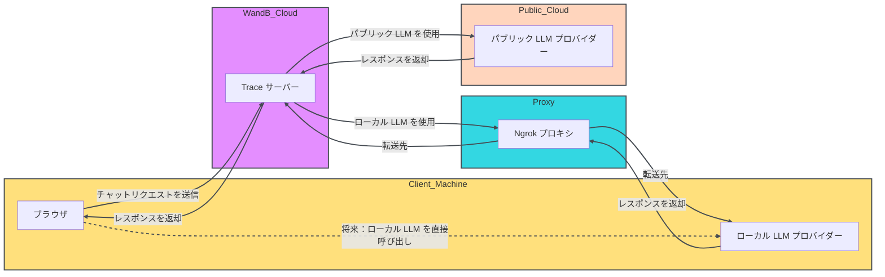

<Tip>
期間限定で、新しい W&B Inference サービスが無料枠に含まれています。W&B Inference を使用すると、API および Weave Playground を介して主要なオープンソースの基盤モデルにアクセスできます。
- [開発者ドキュメント](../integrations/inference)
- [製品ページ](https://wandb.ai/site/inference) 
</Tip>

LLM のプロンプトと応答を評価することは困難です。Weave Playground は、LLM のプロンプトと応答の反復プロセスを簡素化するように設計されており、さまざまなモデルやプロンプトでの実験を容易にします。プロンプトの編集、メッセージの再試行、モデル比較などの機能により、Playground は LLM アプリケーションの迅速なテストと改善を支援します。Playground は現在、OpenAI、Anthropic、Google、Groq、Amazon Bedrock、Microsoft Azure のモデル、および [カスタムプロバイダー](#add-a-custom-provider) をサポートしています。

- **クイックアクセス:** W&B サイドバーから新しいセッションとして、または Call ページから既存のプロジェクトをテストするために Playground を開くことができます。
- **メッセージコントロール:** チャット内で直接メッセージの編集、再試行、削除が可能です。
- **柔軟なメッセージング:** ユーザー入力またはシステム入力として新しいメッセージを追加し、LLM に送信できます。
- **カスタマイズ可能な設定:** お好みの LLM プロバイダーを選択し、モデル設定を調整できます。
- **マルチ LLM サポート:** チームレベルの API キー管理により、モデルを簡単に切り替えられます。
- **モデル比較:** プロンプトに対して異なるモデルがどのように応答するかを比較できます。
- **カスタムプロバイダー:** カスタムモデル用の OpenAI 互換 API エンドポイントをテストできます。
- **保存済みモデル:** ワークフローに合わせて再利用可能なモデルプリセットを作成および設定できます。

Playground を使い始めて、LLM とのやり取りを最適化し、プロンプトエンジニアリングのプロセスと LLM アプリケーション開発を効率化しましょう。

- [事前準備](#prerequisites)
  - [プロバイダーの認証情報と情報の追加](#add-provider-credentials-and-information)
  - [Playground へのアクセス](#access-the-playground)
- [LLM の選択](#select-an-llm)
- [設定のカスタマイズ](#customize-settings)
- [メッセージコントロール](#add-retry-edit-and-delete-messages)
- [LLM の比較](#compare-llms)
- [カスタムプロバイダー](#custom-providers)
- [保存済みモデル](#saved-models) 

## 事前準備

Playground を使用する前に、[プロバイダーの認証情報の追加](#add-provider-credentials-and-information) と [Playground UI の表示](#access-the-playground) を行う必要があります。

### プロバイダーの認証情報と情報の追加

Playground は現在、OpenAI、Anthropic、Google、Groq、Amazon Bedrock、Microsoft Azure のモデルをサポートしています。利用可能なモデルを使用するには、W&B 設定のチームシークレットに適切な情報を追加してください。

- OpenAI: `OPENAI_API_KEY`
- Anthropic: `ANTHROPIC_API_KEY`
- Google: `GEMINI_API_KEY`
- Groq: `GROQ_API_KEY`
- Amazon Bedrock:
  - `AWS_ACCESS_KEY_ID`
  - `AWS_SECRET_ACCESS_KEY`
  - `AWS_REGION_NAME`
- Azure:
  - `AZURE_API_KEY`
  - `AZURE_API_BASE`
  - `AZURE_API_VERSION`
- X.AI:
  - `XAI_API_KEY`
- Deepseek
  - `DEEPSEEK_API_KEY`

### Playground へのアクセス

Playground にアクセスするには 2 つの方法があります。

1. _シンプルなシステムプロンプトで新しい Playground ページを開く_: サイドバーで **Playground** を選択します。Playground が同じタブで開きます。
2. _特定の Call に対して Playground を開く_:
   1. サイドバーで **Traces** タブを選択します。トレースのリストが表示されます。
   2. トレースリストで、表示したい Call の名前をクリックします。Call の詳細ページが開きます。
   3. **Open chat in playground** をクリックします。Playground が新しいタブで開きます。

<Frame>

</Frame>

## LLM の選択

左上のドロップダウンメニューを使用して LLM を切り替えることができます。各プロバイダーから利用可能なモデルは以下の通りです。

- [Amazon Bedrock](#amazon-bedrock)
- [Anthropic](#anthropic)
- [Azure](#azure)
- [Google](#google)
- [Groq](#groq)
- [OpenAI](#openai)
- [X.AI](#xai)
- [Deepseek](#deepseek)

{/* USE make update_playground_models */}
{/* LLM_LIST_START, DON'T EDIT THIS SECTION */}

### [Amazon Bedrock](../integrations/bedrock)

- ai21.j2-mid-v1
- ai21.j2-ultra-v1
- amazon.nova-micro-v1:0
- amazon.nova-lite-v1:0
- amazon.nova-pro-v1:0
- amazon.titan-text-lite-v1
- amazon.titan-text-express-v1
- mistral.mistral-7b-instruct-v0:2
- mistral.mixtral-8x7b-instruct-v0:1
- mistral.mistral-large-2402-v1:0
- mistral.mistral-large-2407-v1:0
- anthropic.claude-3-sonnet-20240229-v1:0
- anthropic.claude-3-5-sonnet-20240620-v1:0
- anthropic.claude-3-haiku-20240307-v1:0
- anthropic.claude-3-opus-20240229-v1:0
- anthropic.claude-v2
- anthropic.claude-v2:1
- anthropic.claude-instant-v1
- cohere.command-text-v14
- cohere.command-light-text-v14
- cohere.command-r-plus-v1:0
- cohere.command-r-v1:0
- meta.llama2-13b-chat-v1
- meta.llama2-70b-chat-v1
- meta.llama3-8b-instruct-v1:0
- meta.llama3-70b-instruct-v1:0
- meta.llama3-1-8b-instruct-v1:0
- meta.llama3-1-70b-instruct-v1:0
- meta.llama3-1-405b-instruct-v1:0

### [Anthropic](../integrations/anthropic)

- claude-3-7-sonnet-20250219
- claude-3-5-sonnet-20240620
- claude-3-5-sonnet-20241022
- claude-3-haiku-20240307
- claude-3-opus-20240229
- claude-3-sonnet-20240229

### [Azure](../integrations/azure)

- azure/o1-mini
- azure/o1-mini-2024-09-12
- azure/o1
- azure/o1-preview
- azure/o1-preview-2024-09-12
- azure/gpt-4o
- azure/gpt-4o-2024-08-06
- azure/gpt-4o-2024-11-20
- azure/gpt-4o-2024-05-13
- azure/gpt-4o-mini
- azure/gpt-4o-mini-2024-07-18

### [Google](../integrations/google)

- gemini/gemini-2.5-pro-preview-03-25
- gemini/gemini-2.0-pro-exp-02-05
- gemini/gemini-2.0-flash-exp
- gemini/gemini-2.0-flash-001
- gemini/gemini-2.0-flash-thinking-exp
- gemini/gemini-2.0-flash-thinking-exp-01-21
- gemini/gemini-2.0-flash
- gemini/gemini-2.0-flash-lite
- gemini/gemini-2.0-flash-lite-preview-02-05
- gemini/gemini-1.5-flash-001
- gemini/gemini-1.5-flash-002
- gemini/gemini-1.5-flash-8b-exp-0827
- gemini/gemini-1.5-flash-8b-exp-0924
- gemini/gemini-1.5-flash-latest
- gemini/gemini-1.5-flash
- gemini/gemini-1.5-pro-001
- gemini/gemini-1.5-pro-002
- gemini/gemini-1.5-pro-latest
- gemini/gemini-1.5-pro

### [Groq](../integrations/groq.mdx)

- groq/deepseek-r1-distill-llama-70b
- groq/llama-3.3-70b-versatile
- groq/llama-3.3-70b-specdec
- groq/llama-3.2-1b-preview
- groq/llama-3.2-3b-preview
- groq/llama-3.2-11b-vision-preview
- groq/llama-3.2-90b-vision-preview
- groq/llama-3.1-8b-instant
- groq/llama3-70b-8192
- groq/llama3-8b-8192
- groq/gemma2-9b-it

### [OpenAI](../integrations/openai.mdx)

- gpt-4.1-mini-2025-04-14
- gpt-4.1-mini
- gpt-4.1-2025-04-14
- gpt-4.1
- gpt-4.1-nano-2025-04-14
- gpt-4.1-nano
- o4-mini-2025-04-16
- o4-mini
- gpt-4.5-preview-2025-02-27
- gpt-4.5-preview
- o3-2025-04-16
- o3
- o3-mini-2025-01-31
- o3-mini
- gpt-4o-mini
- gpt-4o-2024-05-13
- gpt-4o-2024-08-06
- gpt-4o-mini-2024-07-18
- gpt-4o
- gpt-4o-2024-11-20
- o1-mini-2024-09-12
- o1-mini
- o1-preview-2024-09-12
- o1-preview
- o1-2024-12-17
- gpt-4-1106-preview
- gpt-4-32k-0314
- gpt-4-turbo-2024-04-09
- gpt-4-turbo-preview
- gpt-4-turbo
- gpt-4
- gpt-3.5-turbo-0125
- gpt-3.5-turbo-1106

### X.AI

- xai/grok-3-beta
- xai/grok-3-fast-beta
- xai/grok-3-fast-latest
- xai/grok-3-mini-beta
- xai/grok-3-mini-fast-beta
- xai/grok-3-mini-fast-latest
- xai/grok-beta
- xai/grok-2-1212
- xai/grok-2
- xai/grok-2-latest

### Deepseek

- deepseek/deepseek-reasoner
- deepseek/deepseek-chat

{/* LLM_LIST_END, DON'T EDIT THIS SECTION */}

## 設定のカスタマイズ

### LLM パラメータの調整

選択したモデルに対して、異なるパラメータ値で実験することができます。パラメータを調整するには、以下の手順に従ってください。

1. Playground UI の右上にある **Chat settings** をクリックして、パラメータ設定ドロップダウンを開きます。
2. ドロップダウンで、必要に応じてパラメータを調整します。Weave の Call 追跡のオン/オフを切り替えたり、[関数の追加](#add-a-function) を行うこともできます。
3. **Chat settings** を再度クリックしてドロップダウンを閉じ、変更を保存します。

<Frame>

</Frame>

### 関数の追加

ユーザーからの入力に基づいて、異なるモデルがどのように関数を使用するかをテストできます。Playground でテスト用に関数を追加するには、以下の手順に従ってください。

1. Playground UI の右上にある **Chat settings** をクリックして、パラメータ設定ドロップダウンを開きます。
2. ドロップダウン内の **+ Add function** をクリックします。
3. ポップアップで、関数の情報を追加します。
4. 変更を保存して関数のポップアップを閉じるには、右上の **x** をクリックします。
5. **Chat settings** をクリックして設定ドロップダウンを閉じ、変更を保存します。

### 試行回数の調整

Playground では、試行回数（Number of trials）を設定することで、同じ入力に対して複数の出力を生成できます。デフォルト設定は `1` です。試行回数を調整するには、以下の手順に従ってください。

1. Playground UI で、設定サイドバーが開いていない場合は開きます。
2. **Number of trials** を調整します。

## メッセージコントロール

### メッセージの再試行、編集、削除

Playground では、メッセージの再試行、編集、削除が可能です。この機能を使用するには、編集、再試行、または削除したいメッセージの上にカーソルを置きます。**Delete**、**Edit**、**Retry** の 3 つのボタンが表示されます。

- **Delete**: チャットからメッセージを削除します。
- **Edit**: メッセージの内容を修正します。
- **Retry**: それ以降のすべてのメッセージを削除し、選択したメッセージからチャットを再試行します。

### 新しいメッセージの追加

チャットに新しいメッセージを追加するには、以下の手順に従ってください。

1. チャットボックスで、利用可能なロール（**Assistant** または **User**）のいずれかを選択します。
2. **+ Add** をクリックします。
3. LLM に新しいメッセージを送信するには、**Send** ボタンをクリックします。または、**Command** と **Enter** キーを同時に押します。

<Frame>

</Frame>

## LLM の比較

Playground では LLM を比較できます。比較を行うには、以下の手順に従ってください。

1. Playground UI で **Compare** をクリックします。元のチャットの隣に 2 つ目のチャットが開きます。
2. 2 つ目のチャットでは、以下が可能です。
   - [比較する LLM の選択](#select-an-llm)
   - [パラメータの調整](#adjust-llm-parameters)
   - [関数の追加](#add-a-function)
3. メッセージボックスに、両方のモデルでテストしたいメッセージを入力し、**Send** を押します。

## カスタムプロバイダー

### カスタムプロバイダーの追加

[サポートされているプロバイダー](#select-an-llm) に加えて、Playground を使用してカスタムモデル用の OpenAI 互換 API エンドポイントをテストできます。例としては以下があります。

- サポートされているモデルプロバイダーの旧バージョン
- ローカルモデル

Playground にカスタムプロバイダーを追加するには、以下の手順に従ってください。

1. Playground UI の左上にある **Select a model** ドロップダウンをクリックします。
2. **+ Add AI provider** を選択します。
3. ポップアップモーダルで、プロバイダー情報を入力します。

   - _Provider name_: 例: `openai` や `ollama`。
   - _API key_: 例: OpenAI の APIキー。
   - _Base URL_: 例: `https://api.openai.com/v1/` や ngrok の URL `https://e452-2600-1700-45f0-3e10-2d3f-796b-d6f2-8ba7.ngrok-free.app`。
   - _Headers_ (任意): 複数のヘッダーのキーと値を追加できます。
   - _Models_: 1 つのプロバイダーに対して複数のモデルを追加できます。例: `deepseek-r1` や `qwq`。
   - _Max tokens_ (任意): 各モデルについて、応答で生成できる最大トークン数を指定できます。

4. プロバイダー情報を入力したら、**Add provider** をクリックします。
5. Playground UI の左上にある **Select a model** ドロップダウンから、新しいプロバイダーと利用可能なモデルを選択します。

<Warning>
CORS の制限により、Playground から localhost や 127.0.0.1 の URL を直接呼び出すことはできません。Ollama などのローカルモデルサーバーを実行している場合は、ngrok のようなトンネリングサービスを使用して安全に公開してください。詳細は、[Ollama で ngrok を使用する](#use-ngrok-with-ollama) を参照してください。
</Warning>

これで、標準の Playground 機能を使用してカスタムプロバイダーモデルをテストできます。また、カスタムプロバイダーの [編集](#edit-a-custom-provider) や [削除](#remove-a-custom-provider) も可能です。

### カスタムプロバイダーの編集

[以前に作成したカスタムプロバイダー](#add-a-custom-provider) の情報を編集するには、以下の手順に従ってください。

1. Weave サイドバーで **Overview** に移動します。
2. 上部ナビゲーションメニューから **AI Providers** を選択します。
3. **Custom providers** テーブルで、更新したいカスタムプロバイダーを見つけます。
4. そのエントリの **Last Updated** 列にある編集ボタン（鉛筆アイコン）をクリックします。
5. ポップアップモーダルで、プロバイダー情報を編集します。
6. **Save** をクリックします。

### カスタムプロバイダーの削除

[以前に作成したカスタムプロバイダー](#add-a-custom-provider) を削除するには、以下の手順に従ってください。

1. Weave サイドバーで **Overview** に移動します。
2. 上部ナビゲーションメニューから **AI Providers** を選択します。
3. **Custom providers** テーブルで、削除したいカスタムプロバイダーを見つけます。
4. そのエントリの **Last Updated** 列にある削除ボタン（ゴミ箱アイコン）をクリックします。
5. ポップアップモーダルで、プロバイダーを削除することを確認します。この操作は取り消せません。
6. **Delete** をクリックします。

### Ollama で ngrok を使用する

Playground でローカルに実行されている Ollama モデルをテストするには、ngrok を使用して CORS 制限を回避する一時的な公開 URL を作成します。

設定するには、以下の手順に従ってください。

1. お使いの OS に合わせて [ngrok をインストール](https://ngrok.com/docs/getting-started/#step-1-install) します。
2. Ollama モデルを起動します。

   ```bash
   ollama run <model>
   ```

3. 別のターミナルで、必要な CORS ヘッダーを指定して ngrok トンネルを作成します。

   ```bash
   ngrok http 11434 --response-header-add "Access-Control-Allow-Origin: *" --host-header rewrite
   ```

ngrok が起動すると、`https://xxxx-xxxx.ngrok-free.app` のような公開 URL が表示されます。Playground で Ollama をカスタムプロバイダーとして追加する際に、この URL を Base URL として使用してください。

次の図は、ローカル環境、ngrok プロキシ、および W&B クラウドサービス間のデータフローを示しています。



## 保存済みモデル

### モデルの保存

ワークフローに合わせて再利用可能なモデルプリセットを作成および設定できます。モデルを保存すると、好みの設定、パラメータ、および関数フックを適用した状態で素早くロードできます。

1. LLM ドロップダウンから、プロバイダーを選択します。
2. プロバイダーリストから、モデルを選択します。
3. Playground UI の右上にある **Chat settings** をクリックして、チャット設定ウィンドウを開きます。
4. チャット設定ウィンドウで以下を行います。
   - **Model Name** フィールドに、保存するモデルの名前を入力します。 
   - 必要に応じてパラメータを調整します。Weave の Call 追跡のオン/オフを切り替えたり、[関数の追加](#add-a-function) を行うこともできます。
5. **Publish Model** をクリックします。モデルが保存され、LLM ドロップダウンの **Saved Models** からアクセスできるようになります。これで保存済みモデルを [使用](#use-a-saved-model) および [更新](#update-a-saved-model) できるようになります。

### 保存済みモデルの使用 

以前に [保存したモデル](#save-a-model) に素早く切り替えて、実験やセッション間の一貫性を維持します。これにより、中断したところからすぐに再開できます。

1. LLM ドロップダウンから **Saved Models** を選択します。
2. 保存済みモデルのリストから、ロードしたいモデルをクリックします。モデルがロードされ、Playground で使用できる状態になります。

### 保存済みモデルの更新

既存の [保存済みモデル](#save-a-model) を編集して、パラメータを微調整したり設定を更新したりします。これにより、ユースケースの進化に合わせて保存済みモデルを対応させることができます。

1. LLM ドロップダウンから **Saved Models** を選択します。
2. 保存済みモデルのリストから、更新したいモデルをクリックします。 
3. Playground UI の右上にある **Chat settings** をクリックして、チャット設定ウィンドウを開きます。
4. チャット設定ウィンドウで、必要に応じてパラメータを調整します。Weave の Call 追跡のオン/オフを切り替えたり、[関数の追加](#add-a-function) を行うこともできます。
5. **Update model** をクリックします。モデルが更新され、LLM ドロップダウンの **Saved Models** からアクセスできるようになります。
