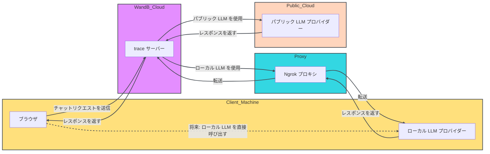

<Tip>
  期間限定で、W&amp;B Inference が無料枠に含まれています。W&amp;B Inference では、API と Weave Playground を通じて主要なオープンソースの基盤モデルにアクセスできます。

  * [開発者向けドキュメント](../integrations/inference)
  * [プロダクトページ](https://wandb.ai/site/inference)
</Tip>

LLM のプロンプトと応答を評価するのは簡単ではありません。Weave Playground は、LLM のプロンプトと応答を反復的に改善するプロセスをシンプルにし、さまざまなモデルやプロンプトをより手軽に試せるように設計されています。プロンプトの編集、メッセージの再試行、モデル比較などの機能により、Playground を使って LLM アプリケーションをすばやくテストし、改善できます。現在、Playground は OpenAI、Anthropic、Google などのプロバイダーのモデルに加え、[カスタムプロバイダー](#add-a-custom-provider) もサポートしています。

* **クイックアクセス:** 新しいセッションを開始するには Weave のサイドバーメニューから「Playground」を開き、既存のプロジェクトをテストするには Call ページから開きます。
* **メッセージコントロール:** チャット内でメッセージを直接編集、再試行、削除できます。
* **柔軟なメッセージング:** 新しいメッセージをユーザー入力またはシステム入力として追加し、LLM に送信できます。
* **カスタマイズ可能な設定:** 使用する LLM プロバイダーを設定し、モデル設定を調整できます。
* **複数 LLM のサポート:** チーム単位で APIキー を管理しながら、モデルを切り替えられます。
* **モデルの比較:** 同じプロンプトに対する異なるモデルの応答を比較できます。
* **カスタムプロバイダー:** カスタムモデル用の OpenAI 互換 API endpoint をテストできます。
* **保存済みモデル:** ワークフローで再利用できるモデルプリセットを作成して設定できます

Playground を使い始めて LLM とのやり取りを最適化し、プロンプトエンジニアリングと LLM アプリケーション開発を効率化しましょう。

* [プロバイダーの認証情報と情報を追加する](#add-provider-credentials-and-information)
* [Playground にアクセスする](#access-the-playground)
* [LLM を選択する](#select-an-llm)
* [Playground の設定をカスタマイズする](#customize-playground-settings)
* [メッセージコントロール](#message-controls)
* [LLM を比較する](#compare-llms)
* [カスタムプロバイダー](#custom-providers)
* [保存済みモデル](#saved-models) 

<div id="add-provider-credentials-and-information">
  ## プロバイダの認証情報と情報を追加する
</div>

Playgroundを使用するには、まずプロバイダの認証情報を追加する必要があります。Playgroundは現在、多くのプロバイダのモデルに対応しています。利用可能なモデルのいずれかを使用するには、適切な情報をW&amp;BのSettingsにあるチームシークレットに追加してください。

* Amazon Bedrock:
  * `AWS_ACCESS_KEY_ID`
  * `AWS_SECRET_ACCESS_KEY`
  * `AWS_REGION_NAME`
* Anthropic: `ANTHROPIC_API_KEY`
* Azure:
  * `AZURE_API_KEY`
  * `AZURE_API_BASE`
  * `AZURE_API_VERSION`
* Deepseek: `DEEPSEEK_API_KEY`
* Google: `GEMINI_API_KEY`
* Groq: `GROQ_API_KEY`
* Mistral: `MISTRAL_API_KEY`
* OpenAI: `OPENAI_API_KEY`
* X.AI: `XAI_API_KEY`

<div id="access-the-playground">
  ## Playground にアクセスする
</div>

Playground にアクセスする方法は 2 つあります。

1. *シンプルな system prompt で新しい Playground ページを開く*: Weave プロジェクトのサイドバーで **Playground** を選択します。Playground は同じタブで開きます。
2. *特定の call の Playground を開く*:
   1. サイドバーで **Traces** タブを選択します。トレースの一覧が表示されます。
   2. トレースの一覧で、表示したい call の名前をクリックします。その call の詳細ページが開きます。
   3. **Open chat in Playground** をクリックします。Playground は新しいタブで開きます。

<Frame>
  
</Frame>

<div id="select-an-llm">
  ## LLMを選択する
</div>

プロンプトヘッダー (Playground のメインパネル上部) にある **Select a model** ドロップダウンを使って、LLM を切り替えられます。各種プロバイダで利用可能なモデルを以下に示します。

* Amazon Bedrock
* Anthropic
* Azure
* Deepseek
* Google
* Groq
* Mistral
* OpenAI
* X.AI

利用可能なモデルは、チームに設定されているプロバイダによって異なります。

<div id="customize-playground-settings">
  ## Playground の設定をカスタマイズする
</div>

<div id="adjust-llm-parameters">
  ### LLMパラメーターを調整する
</div>

選択したモデルで、さまざまなパラメーター値を試すことができます。Playground でパラメーターを調整するには、次の手順に従ってください。

1. プロンプトヘッダー (メインパネル上部) で、**Chat settings (<Icon icon="sliders" iconType="regular" />)** ボタンをクリックして、**Chat settings** パネルを開きます。
2. **Chat settings** パネルで、必要に応じてパラメーターを調整します。また、Weave call tracking のオン/オフを切り替えたり、[関数 を追加](#add-a-function)したりすることもできます。
3. 変更は自動的に適用されます。パネルを閉じるには、**Chat settings** をもう一度クリックするか、右上の **x** をクリックします。**Chat settings** ボタンのホバーテキストは、変更した設定を表示するよう更新されます。

ページを離れると、設定は失われます。設定を保存するには、[モデルを保存](#save-a-model)してください。
変更した設定を破棄してやり直すには、ページを更新してください。

<Frame>
  
</Frame>

Playground では、試行回数を設定することで、同じ入力に対して複数の出力を生成できます。デフォルト値は `1` です。試行回数を調整するには、**Chat settings** パネルを開き、**Number of trials** を調整します。

<div id="add-a-function">
  ### 関数を追加する
</div>

ユーザーから受け取った入力に基づいて、異なるモデルが関数をどのように使用するかをテストできます。Playground でテスト用の関数を追加するには、**Chat settings** パネルで **+ Add function** をクリックします。画面の案内に従って関数を定義し、変更を保存します。

<div id="message-controls">
  ## メッセージ操作
</div>

<div id="prompt-definition-area">
  ### プロンプト定義エリア
</div>

**プロンプト定義エリア**では、やり取り全体を通してモデルの挙動を決める指示を定義できます。

このエリアは、メッセージのやり取りが始まる前に一貫して適用されるコンテキストを指定するために使用します。これには、役割の定義、トーンやスタイルのガイダンス、挙動上の制約、出力要件が含まれます。ここで加えた変更は、再度変更しない限り、その後のすべてのやり取りに影響します。

含まれる項目は次のとおりです。

* **プロンプトセレクター**: 保存済みの既存のプロンプトを選択するか、新しいプロンプトを作成します。
* **メッセージロールセレクター**: 定義するメッセージの役割 (**System**、**Assistant**、または **User** ロール) を指定します。
* **プロンプトテキスト**: モデルの応答方法を定める指示テキストを入力します。
* **Add message** ボタン: 実行前に、プロンプトコンテキストに追加のメッセージを含められます。

これらのメッセージはまとめてモデルに送信され、次の目的に使用できます。

* システムレベルの補足指示を追加する。
* 応答を導くための **Assistant** メッセージの例を提供する (few-shot prompting など) 。
* 特定のシナリオをテストするために **User** メッセージを事前定義する。

<div id="messages-panel">
  ### メッセージパネル
</div>

**メッセージパネル**には、実行中に生成された会話が表示されます。

次の内容が含まれます。

* プロンプトのセットアップに含まれる、あらかじめ定義されたメッセージ
* メッセージコンポーザーから送信されたメッセージ
* モデルから返されたレスポンス

また、パネル内のメッセージを**Copy**、**Delete**、**Edit**、**Retry**することもできます。

<div id="message-composer-input-field">
  ### Message composer (入力フィールド)
</div>

**Message composer** を使用して、モデルに新しいメッセージを送信します。

メッセージのロールを選択し、実行するメッセージを送信できます。ほとんどのやり取りは **User** メッセージとして作成します。指示の変更をテストする場合は、**System** または **Assistant** メッセージを追加できます。

<Frame>
  
</Frame>

<div id="view-message-history">
  ## メッセージ履歴を表示する
</div>

メッセージ履歴を表示するには、右側のPlaygroundツールバーにある **History (<Icon icon="clock-rotate-left" iconType="light" />)** ボタンをクリックします。現在のプロジェクトで送信されたすべてのメッセージを表示する History パネルが開きます。

履歴内の項目を選択すると、比較用の追加のチャットパネルに自動的に読み込まれます。 

<div id="compare-llms">
  ## LLM を比較する
</div>

Playground では LLM を比較できます。比較するには、Playground の右側のツールバーにある **チャットを追加 (<Icon icon="plus" iconType="solid" />)** ボタンをクリックします。元のチャットの横に 2 つ目のチャットが開きます。
2 つ目のチャットでは、モデルの選択、Settings の調整、関数の追加など、元のチャットと同じ機能を利用できます。

<div id="custom-providers">
  ## カスタムプロバイダー
</div>

<div id="add-a-custom-provider">
  ### カスタムプロバイダー を追加する
</div>

組み込みのプロバイダーに加えて、Playground を使用して、カスタムモデル用の OpenAI 互換 API endpoint をテストできます。たとえば、次のようなものがあります。

* サポートされているモデルプロバイダーの旧バージョン
* ローカルモデル

Playground に カスタムプロバイダー を追加するには、次の手順に従います。

1. プロンプトヘッダー (メインパネル上部) で、**Select a model** ドロップダウンをクリックします。
2. **+ Add AI provider** を選択します。
3. **Custom Provider** を選択します。
4. ポップアップモーダルで、プロバイダー情報を入力します。

* **Provider name**: `openai` や `ollama` などのプロバイダー名。
* **API key**: OpenAI の APIキー など、プロバイダーの APIキー。
* **Base URL**: `https://api.openai.com/v1/` や `https://e452-2600-1700-45f0-3e10-2d3f-796b-d6f2-8ba7.ngrok-free.app` のような ngrok URL など、プロバイダーのベース API endpoint。
* **Headers**:  (オプション) 1 つ以上のカスタム HTTP ヘッダーのキーと値のペア。
* **Models**: `deepseek-r1` や `qwq` など、プロバイダーで使用する 1 つ以上のモデル。
* **Max tokens**:  (オプション) 各モデルについて、レスポンスでモデルが生成できる token の最大数。

5. プロバイダー情報を入力したら、**Add provider** をクリックします。
6. **Select a model** ドロップダウンから、新しいプロバイダーと利用可能なモデルを選択します。

<Warning>
  CORS の制限により、Playground から localhost または 127.0.0.1 の URL を直接呼び出すことはできません。ローカルのモデルサーバー (Ollama など) を実行している場合は、ngrok のようなトンネリングサービスを使用して安全に公開してください。詳細については、[Use ngrok with Ollama](#use-a-local-model-as-a-custom-provider) を参照してください。
</Warning>

これで、標準の Playground 機能を使用して カスタムプロバイダー のモデルをテストできます。また、カスタムプロバイダー を[編集](#edit-a-custom-provider)または[削除](#remove-a-custom-provider)することもできます。

<div id="edit-a-custom-provider">
  ### カスタムプロバイダーを編集する
</div>

[以前に作成したカスタムプロバイダー](#add-a-custom-provider)の情報を編集するには、次の手順を実行します。

1. プロンプトヘッダー で **Select a model** ドロップダウンをクリックし、**+Configure providers** を選択します。

* または、サイドバーメニューで **プロジェクト** を選択し、**AI Providers** タブを選択することもできます。

2. **Custom providers** 表で、更新するカスタムプロバイダーを検索します。
3. カスタムプロバイダーのエントリの **Last Updated** 列で、編集ボタン (鉛筆アイコン) をクリックします。
4. ポップアップモーダルで、プロバイダー情報を編集します。
5. **Save** をクリックします。

<div id="remove-a-custom-provider">
  ### カスタムプロバイダーを削除する
</div>

[以前に作成したカスタムプロバイダー](#add-a-custom-provider)を削除するには、次の手順に従います。

1. プロンプトヘッダーで **Select a model** ドロップダウンをクリックします。次に、**+Configure providers** を選択します。

* または、サイドバーメニューで **Project** を選択し、**AI Providers** タブを選択することもできます。

2. **Custom providers** 表で、削除したいカスタムプロバイダーを見つけます。
3. カスタムプロバイダーのエントリの **Last Updated** 列で、削除ボタン (ゴミ箱アイコン) をクリックします。
4. ポップアップモーダルで、そのプロバイダーを削除することを確認します。この操作は元に戻せません。
5. **Delete** をクリックします。

<div id="use-a-local-model-as-a-custom-provider">
  ### ローカルモデルをカスタムプロバイダーとして使用する
</div>

Playground でローカルで実行中のモデルをテストするには、ngrok と Ollama を使って、CORS の制限を回避する一時的な公開 URL を作成します。

設定するには、次の手順に従います。

1. ご利用のオペレーティングシステム向けの [ngrok をインストール](https://ngrok.com/docs/getting-started/#step-1-install) します。

2. Ollama モデルを起動します。

   ```bash
   ollama run <model>
   ```

3. 別のターミナルで、必要な CORS ヘッダーを付けて ngrok トンネルを作成します。

   ```bash
   ngrok http 11434 --response-header-add "Access-Control-Allow-Origin: *" --host-header rewrite
   ```

4. ngrok を起動すると、`https://xxxx-xxxx.ngrok-free.app` のような公開 URL が表示されます。Playground で [カスタムプロバイダーを追加](#add-a-custom-provider) する際は、この URL を **Base URL** として使用します。

次の図は、ローカル環境、ngrok プロキシ、W&amp;B クラウドサービス間のデータフローを示しています。


```mermaid
flowchart LR
    %% スタイル定義
    classDef clientMachine fill:#FFD95CCC,stroke:#454B52,stroke-width:2px
    classDef proxy fill:#00CDDBCC,stroke:#454B52,stroke-width:2px
    classDef wandbCloud fill:#DE72FFCC,stroke:#454B52,stroke-width:2px
    classDef publicCloud fill:#FFCBADCC,stroke:#454B52,stroke-width:2px

    %% サブグラフ
    subgraph Client_Machine
        browser[ブラウザ]
        llm_local[ローカル LLM プロバイダー]
    end

    subgraph Proxy
        ngrok[Ngrok プロキシ]
    end

    subgraph WandB_Cloud
        trace_server[trace サーバー]
    end

    subgraph Public_Cloud
        llm_cloud[パブリック LLM プロバイダー]
    end

    %% サブグラフにスタイルを適用
    class Client_Machine clientMachine
    class Proxy proxy
    class WandB_Cloud wandbCloud
    class Public_Cloud publicCloud

    %% 現在のデータフロー
    browser -->|チャットリクエストを送信| trace_server
    trace_server -->|パブリック LLM を使用| llm_cloud
    trace_server -->|ローカル LLM を使用| ngrok
    ngrok -->|転送| llm_local
    llm_cloud -->|レスポンスを返す| trace_server
    llm_local -->|レスポンスを返す| ngrok
    ngrok -->|転送| trace_server
    trace_server -->|レスポンスを返す| browser

    %% 将来的に可能な接続
    browser -.->|将来: ローカル LLM を直接呼び出す| llm_local

    %% リンクスタイル
    linkStyle default stroke:#454B52,stroke-width:2px
    linkStyle 8 stroke:#454B52,stroke-width:2px,stroke-dasharray:5
```


<div id="saved-models">
  ## 保存したモデル
</div>

<div id="save-a-model">
  ### モデルを保存する
</div>

ワークフローで再利用できるモデルプリセットを作成し、設定できます。モデルを保存すると、好みの設定、パラメーター、関数フックを適用した状態ですばやく読み込めます。

1. プロンプトヘッダー (メインパネル上部) の **Select a model** ドロップダウンで、プロバイダーとモデルを選択します。
2. プロンプトヘッダーで、**Chat settings (<Icon icon="sliders" iconType="regular" />)** ボタンをクリックして **Chat settings** パネルを開きます。
3. **チャット設定** パネルで、以下を設定します。
   * **モデル名** (必須) : 保存するモデルの名前を入力します。
   * 必要に応じてパラメーターを調整します。また、Weave call トラッキングのオン/オフを切り替えたり、[関数を追加](#add-a-function)したりすることもできます。
4. **モデルを公開** をクリックします。モデルが保存され、**Select a model** ドロップダウンの **保存済みモデル** から利用できるようになります。これで、保存したモデルを[使用](#use-a-saved-model)したり、[更新](#update-a-saved-model)したりできます.

<div id="use-a-saved-model">
  ### 保存済みモデルを使用する
</div>

以前に[保存したモデル](#save-a-model)にすばやく切り替えると、実験やセッションをまたいで一貫性を保てます。これにより、中断したところからすぐに再開できます。

1. プロンプトヘッダー の **Select a model** ドロップダウンで、**保存済みモデル** を選択します。
2. 保存済みモデルの一覧から、読み込みたい保存済みモデルを選択します。モデルが読み込まれ、Playground ですぐに使用できる状態になります。

<div id="update-a-saved-model">
  ### 保存済みモデルを更新する
</div>

既存の[保存済みモデル](#save-a-model)を編集して、パラメーターを微調整したり、設定を更新したりできます。これにより、保存済みモデルをユースケースの変化に合わせて進化させることができます。

1. プロンプトヘッダーの **Select a model** ドロップダウンで、**保存済みモデル** を選択します。
2. 保存済みモデルの一覧から、更新する保存済みモデルを選択します。
3. プロンプトヘッダーで、**Chat settings (<Icon icon="sliders" iconType="regular" />)** ボタンをクリックして **Chat settings** パネルを開きます。
4. **Chat settings** パネルで、必要に応じてパラメーターを調整します。また、Weave call トラッキングのオン/オフを切り替えたり、[関数 を追加](#add-a-function)したりすることもできます。
5. **Update model** をクリックします。これによりモデルが更新され、**Select a model** ドロップダウンの **保存済みモデル** から選択できるようになります。保存済みモデルのバージョンは自動的に増分されます。