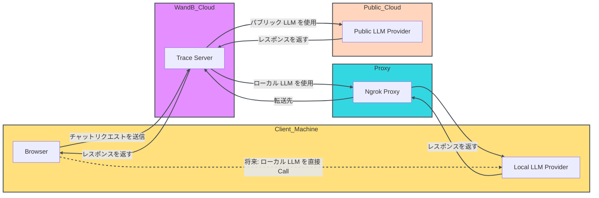

<Tip>
  期間限定で、W&amp;B Inference は無料利用枠に含まれています。W&amp;B Inference は、主要なオープンソース基盤モデルへのアクセスを API と Weave Playground 経由で提供します。

  * [開発者向けドキュメント](../integrations/inference)
  * [製品ページ](https://wandb.ai/site/inference)
</Tip>

LLM のプロンプトと応答を評価することは簡単ではありません。Weave Playground は、LLM のプロンプトと応答を反復しながら改善するプロセスを簡素化できるよう設計されており、さまざまなモデルやプロンプトをより簡単に試せます。プロンプトの編集、メッセージの再試行、モデル比較などの機能により、Playground を使うと LLM アプリケーションをすばやくテストして改善できます。現在、Playground は OpenAI、Anthropic、Google などの提供元のモデルに加え、[カスタムプロバイダー](#add-a-custom-provider) もサポートしています。

* **迅速なアクセス:** 新しいセッションを開始するには Weave のサイドバーメニューから「Playground」を開き、既存のプロジェクトをテストするには Call ページから開きます。
* **メッセージ コントロール:** チャット内でメッセージを直接編集、再試行、または削除できます。
* **柔軟なメッセージング:** 新しいメッセージを user または system の入力として追加し、LLM に送信できます。
* **カスタマイズ可能な設定:** 使用する LLM プロバイダーを設定し、モデル設定を調整できます。
* **複数 LLM のサポート:** チーム レベルの APIキー 管理により、モデルを切り替えられます。
* **モデル比較:** 異なるモデルがプロンプトにどう応答するかを比較できます。
* **カスタムプロバイダー:** カスタムモデル向けに OpenAI 互換の API endpoint をテストできます。
* **保存済みモデル:** ワークフローで再利用できるモデル プリセットを作成して設定できます

Playground を使い始めて、LLM とのやり取りを最適化し、プロンプト エンジニアリングのプロセスと LLM アプリケーション開発を効率化しましょう。

* [プロバイダーの認証情報と情報を追加する](#add-provider-credentials-and-information)
* [Playground にアクセスする](#access-the-playground)
* [LLM を選択する](#select-an-llm)
* [Playground の設定をカスタマイズする](#customize-playground-settings)
* [メッセージ コントロール](#message-controls)
* [LLM を比較する](#compare-llms)
* [カスタムプロバイダー](#custom-providers)
* [保存済みモデル](#saved-models) 

<div id="add-provider-credentials-and-information">
  ## プロバイダーの認証情報と必要な情報を追加する
</div>

Playground を使用する前に、プロバイダーの認証情報を追加する必要があります。Playground は現在、多くのプロバイダーのモデルをサポートしています。利用可能なモデルのいずれかを使用するには、適切な情報を W&amp;B settings のチーム secret に追加してください。

* Amazon Bedrock:
  * `AWS_ACCESS_KEY_ID`
  * `AWS_SECRET_ACCESS_KEY`
  * `AWS_REGION_NAME`
* Anthropic: `ANTHROPIC_API_KEY`
* Azure:
  * `AZURE_API_KEY`
  * `AZURE_API_BASE`
  * `AZURE_API_VERSION`
* Deepseek: `DEEPSEEK_API_KEY`
* Google: `GEMINI_API_KEY`
* Groq: `GROQ_API_KEY`
* Mistral: `MISTRAL_API_KEY`
* OpenAI: `OPENAI_API_KEY`
* X.AI: `XAI_API_KEY`

<div id="access-the-playground">
  ## Playground にアクセスする
</div>

Playground にアクセスする方法は 2 つあります。

1. *シンプルな system prompt で新規の Playground ページを開く*: Weave プロジェクトのサイドバーで **Playground** を選択します。Playground が同じタブで開きます。
2. *特定の Call の Playground を開く*:
   1. サイドバーで **Traces** タブを選択します。トレースの一覧が表示されます。
   2. トレースの一覧で、表示したい Call の名前をクリックします。Call の詳細ページが開きます。
   3. **Open chat in Playground** をクリックします。Playground が新しいタブで開きます。

<Frame>
  
</Frame>

<div id="select-an-llm">
  ## LLMを選択する
</div>

プロンプトヘッダー (メインの Playground パネル上部) にある **Select a model** ドロップダウンを使用して、LLM を切り替えられます。各種プロバイダの利用可能なモデルを以下に示します。

* Amazon Bedrock
* Anthropic
* Azure
* Deepseek
* Google
* Groq
* Mistral
* OpenAI
* X.AI

利用可能なモデルは、チームに対して設定されているプロバイダによって異なります。

<div id="customize-playground-settings">
  ## Playground の設定をカスタマイズする
</div>

<div id="adjust-llm-parameters">
  ### LLM パラメーターを調整する
</div>

選択したモデルに対して、さまざまなパラメーター値を試すことができます。Playground でパラメーターを調整するには、次の手順を実行します。

1. プロンプトヘッダー (メインパネル上部) で **Chat settings (<Icon icon="sliders" iconType="regular" />)** ボタンをクリックして、**Chat settings** パネルを開きます。
2. **Chat settings** パネルで、必要に応じてパラメーターを調整します。Weave Call トラッキングをオンまたはオフに切り替えたり、[関数を追加](#add-a-function)したりできます。
3. 変更内容は自動的に適用されます。パネルを閉じるには、もう一度 **Chat settings** をクリックするか、右上隅の **x** をクリックします。**Chat settings** ボタンのホバーテキストは、変更した設定がわかるように更新されます。

ページを離れると、設定は失われます。設定を保存するには、[モデルを保存](#save-a-model)してください。
変更した設定を破棄してやり直したい場合は、ページを再読み込みしてください。

<Frame>
  
</Frame>

Playground では、試行回数を設定することで、同じ入力に対して複数の出力を生成できます。デフォルトの設定は `1` です。試行回数を調整するには、**Chat settings** パネルを開き、**Number of trials** 設定を調整します。

<div id="add-a-function">
  ### 関数を追加する
</div>

ユーザーから受け取る入力に基づいて、異なるモデルが関数をどのように使用するかをテストできます。Playground でテスト用の関数を追加するには、**Chat settings** パネルで **+ Add function** をクリックします。画面の指示に従って関数を定義し、変更を保存します。

<div id="message-controls">
  ## Message controls
</div>

<div id="prompt-definition-area">
  ### プロンプト定義エリア
</div>

**プロンプト定義エリア**では、対話全体を通じてモデルの動作を形成する指示を定義できます。

このエリアを使って、メッセージのやり取り前に一貫して適用されるコンテキストを提供します。これには、ロールの定義、トーンやスタイルのガイドライン、動作上の制約、出力要件などが含まれます。ここで行った変更は、修正されない限り、以降のすべての対話に影響します。

これには次の要素が含まれます。

* **Prompt selector**: 既存の保存済みプロンプトを選択するか、新しいプロンプトを作成します。
* **Message role selector**: 定義中のメッセージのロール (**System**、**Assistant**、または **User** ロール) を指定します。
* **Prompt text**: モデルがどのように応答すべきかを定める指示テキストを入力します。
* **Add message** ボタン: 実行前のプロンプトコンテキストに追加のメッセージを含められます。

これらのメッセージはモデルにまとめて送信され、次のように使用できます。

* 補足的なシステムレベルの指示を追加する。
* 応答を導くためのアシスタントメッセージの例を提供する (few-shot プロンプトなど) 。
* 特定のシナリオをテストするためのユーザーメッセージを事前に定義する。

<div id="messages-panel">
  ### Messages パネル
</div>

**Messages パネル**には、実行中に生成された会話が表示されます。

含まれるもの:

* プロンプトの設定に含まれる事前定義済みメッセージ。
* メッセージ コンポーザーから送信されたメッセージ。
* モデルから返された応答。

また、パネル内のメッセージを **Copy**、**Delete**、**Edit**、**Retry** することもできます。

<div id="message-composer-input-field">
  ### メッセージコンポーザー (入力フィールド)
</div>

**Message composer** を使用して、モデルに新しいメッセージを送信します。

メッセージのロールを選択し、実行用のメッセージを送信することをサポートしています。ほとんどのやり取りは **User** メッセージとして作成されます。テストする指示を変更する際に、**System** または **Assistant** メッセージを追加できます。

<Frame>
  
</Frame>

<div id="view-message-history">
  ## メッセージ履歴を表示する
</div>

メッセージ履歴を表示するには、右側のPlaygroundツールバーにある**History (<Icon icon="clock-rotate-left" iconType="light" />)** ボタンをクリックします。現在のプロジェクトで送信されたすべてのメッセージが表示されるHistoryパネルが開きます。

履歴から項目を選択すると、自動的に別のチャットパネルに読み込まれ、比較できます。 

<div id="compare-llms">
  ## LLM を比較する
</div>

Playground では LLM を比較できます。比較を行うには、右側の Playground のツールバーで **Add Chat (<Icon icon="plus" iconType="solid" />)** ボタンをクリックします。元のチャットの横に 2 つ目のチャットが開きます。

2 つ目のチャットでは、元のチャットと同様に、モデルの選択、設定の調整、関数の追加など、同じ機能を利用できます。

<div id="custom-providers">
  ## カスタムプロバイダー
</div>

<div id="add-a-custom-provider">
  ### カスタムプロバイダーを追加する
</div>

組み込みの プロバイダー に加えて、Playground を使用して、カスタムモデル用の OpenAI 互換 API endpoint をテストできます。例としては、次のようなものがあります。

* サポートされるモデル プロバイダー の旧バージョン
* ローカルモデル

Playground にカスタムプロバイダーを追加するには、次の手順を実行します。

1. プロンプトヘッダー (メインパネル上部) で、**Select a model** ドロップダウンをクリックします。
2. **+ Add AI provider** を選択します。
3. **Custom Provider** を選択します。
4. ポップアップモーダルで、プロバイダー 情報を入力します。

* **Provider name**: `openai` や `ollama` などの、プロバイダー の名前。
* **API key**: OpenAI APIキー などの、プロバイダー の APIキー。
* **Base URL**: `https://api.openai.com/v1/` や、`https://e452-2600-1700-45f0-3e10-2d3f-796b-d6f2-8ba7.ngrok-free.app` のような ngrok URL など、プロバイダー のベース endpoint。
* **Headers**:  (任意) 1 つ以上のカスタム HTTP ヘッダーのキーと値のペア。
* **Models**: `deepseek-r1` や `qwq` など、プロバイダー の 1 つ以上の モデル。
* **Max tokens**:  (任意) 各 モデルについて、レスポンスでその モデル が生成できる token の最大数。

5. プロバイダー 情報を入力したら、**Add provider** をクリックします。
6. **Select a model** ドロップダウンから、新しい プロバイダー と使用可能な モデル を選択します。

<Warning>
  CORS の制限により、Playground から localhost または 127.0.0.1 の URL を直接 Call することはできません。ローカルの モデル サーバー (Ollama など) を実行している場合は、ngrok のようなトンネリングサービスを使用して安全に公開してください。詳しくは、[Use ngrok with Ollama](#use-a-local-model-as-a-custom-provider) を参照してください。
</Warning>

これで、標準の Playground 機能を使用してカスタム プロバイダー の モデル をテストできます。カスタム プロバイダー を[編集](#edit-a-custom-provider)または[削除](#remove-a-custom-provider)することもできます。

<div id="edit-a-custom-provider">
  ### カスタムプロバイダーを編集する
</div>

[以前に作成したカスタムプロバイダー](#add-a-custom-provider)の情報を編集するには、次の手順を実行します。

1. プロンプトヘッダー で、**Select a model** ドロップダウンをクリックします。次に、**+Configure providers** を選択します。

* または、サイドバーメニューで **プロジェクト** を選択し、**AI Providers** タブを選択することもできます。

2. **Custom providers** 表で、更新するカスタムプロバイダーを検索します。
3. カスタムプロバイダーのエントリの **Last Updated** 列で、編集ボタン (鉛筆アイコン) をクリックします。
4. ポップアップモーダルで、プロバイダー情報を編集します。
5. **Save** をクリックします。

<div id="remove-a-custom-provider">
  ### カスタムプロバイダーを削除する
</div>

[以前に作成したカスタムプロバイダー](#add-a-custom-provider) を削除するには、次の手順を実行します：

1. プロンプトヘッダーで **Select a model** ドロップダウンをクリックし、**+Configure providers** を選択します。

* または、サイドバーのメニューで **プロジェクト** を選択し、**AI Providers** タブを選択することもできます。

2. **Custom providers** 表で、削除したいカスタムプロバイダーを検索します。
3. カスタムプロバイダーのエントリの **Last Updated** 列で、削除ボタン (ごみ箱アイコン) をクリックします。
4. ポップアップモーダルで、そのプロバイダーを削除することを確認します。この操作は元に戻せません。
5. **Delete** をクリックします。

<div id="use-a-local-model-as-a-custom-provider">
  ### ローカル モデルをカスタムプロバイダーとして使用する
</div>

Playground でローカルで実行中のモデルをテストするには、ngrok と Ollama を使用して、CORS 制限を回避する一時的な公開 URL を作成します。

設定するには、次の手順を実行します。

1. ご利用のオペレーティング システム向けの [ngrok をインストール](https://ngrok.com/docs/getting-started/#step-1-install)します。

2. Ollama モデルを起動します。

   ```bash
   ollama run <model>
   ```

3. 別のターミナルで、必要な CORS ヘッダーを指定して ngrok トンネルを作成します。

   ```bash
   ngrok http 11434 --response-header-add "Access-Control-Allow-Origin: *" --host-header rewrite
   ```

4. ngrok が起動すると、`https://xxxx-xxxx.ngrok-free.app` のような公開 URL が表示されます。Playground で [カスタムプロバイダーを追加](#add-a-custom-provider)する際に、この URL を **Base URL** として使用します。

次の図は、ローカル環境、ngrok プロキシ、W&amp;B クラウド サービス間のデータフローを示しています。


```mermaid
flowchart LR
    %% スタイル定義
    classDef clientMachine fill:#FFD95CCC,stroke:#454B52,stroke-width:2px
    classDef proxy fill:#00CDDBCC,stroke:#454B52,stroke-width:2px
    classDef wandbCloud fill:#DE72FFCC,stroke:#454B52,stroke-width:2px
    classDef publicCloud fill:#FFCBADCC,stroke:#454B52,stroke-width:2px

    %% サブグラフ
    subgraph Client_Machine
        browser[Browser]
        llm_local[Local LLM Provider]
    end

    subgraph Proxy
        ngrok[Ngrok Proxy]
    end

    subgraph WandB_Cloud
        trace_server[Trace Server]
    end

    subgraph Public_Cloud
        llm_cloud[Public LLM Provider]
    end

    %% サブグラフにスタイルを適用
    class Client_Machine clientMachine
    class Proxy proxy
    class WandB_Cloud wandbCloud
    class Public_Cloud publicCloud

    %% 現在のデータフロー
    browser -->|チャットリクエストを送信| trace_server
    trace_server -->|パブリック LLM を使用| llm_cloud
    trace_server -->|ローカル LLM を使用| ngrok
    ngrok -->|転送先| llm_local
    llm_cloud -->|レスポンスを返す| trace_server
    llm_local -->|レスポンスを返す| ngrok
    ngrok -->|転送先| trace_server
    trace_server -->|レスポンスを返す| browser

    %% 将来的に可能な接続
    browser -.->|将来: ローカル LLM を直接 Call| llm_local

    %% リンクスタイル
    linkStyle default stroke:#454B52,stroke-width:2px
    linkStyle 8 stroke:#454B52,stroke-width:2px,stroke-dasharray:5
```


<div id="saved-models">
  ## 保存済みモデル
</div>

<div id="save-a-model">
  ### モデルを保存する
</div>

ワークフロー用に、再利用可能なモデルのプリセットを作成して設定できます。モデルを保存すると、好みの設定、パラメーター、関数フックを指定した状態ですばやく読み込めます。

1. プロンプトヘッダー (メインパネル上部) の **Select a model** ドロップダウンで、プロバイダー とモデルを選択します。
2. プロンプトヘッダー で、**Chat settings (<Icon icon="sliders" iconType="regular" />)** ボタンをクリックして **Chat settings** パネルを開きます。
3. **Chat settings** パネルで、以下を行います。
   * **Model Name** (必須) : 保存するモデルの名前を入力します。
   * 必要に応じてパラメーターを調整します。また、Weave Call トラッキング のオン/オフを切り替えたり、[関数を追加](#add-a-function)したりすることもできます。
4. **Publish model** をクリックします。モデルが保存され、**Select a model** ドロップダウンの **Saved Models** からアクセスできるようになります。これで、保存したモデルを[使用](#use-a-saved-model)したり、[更新](#update-a-saved-model)したりできます。

<div id="use-a-saved-model">
  ### 保存済みモデルを使用する
</div>

以前に[保存したモデル](#save-a-model)にすばやく切り替えることで、Experiments やセッション間の一貫性を維持できます。これにより、中断したところからすぐに再開できます。

1. プロンプトヘッダー の **Select a model** ドロップダウンで、**Saved Models** を選択します。
2. 保存済みモデルのリストから、読み込む保存済みモデルを選択します。モデルが読み込まれ、Playground ですぐに使用できます。

<div id="update-a-saved-model">
  ### 保存済みモデルを更新する
</div>

既存の [保存済みモデル](#save-a-model) を編集して、パラメーターを微調整したり、設定を更新したりできます。これにより、保存済みモデルをユースケースの変化に合わせて進化させることができます。

1. プロンプトヘッダーの **Select a model** ドロップダウンで **Saved Models** を選択します。
2. 保存済みモデルの一覧から、更新したい保存済みモデルを選択します。
3. プロンプトヘッダーの **Chat settings (<Icon icon="sliders" iconType="regular" />)** ボタンをクリックして、**Chat settings** パネルを開きます。
4. **Chat settings** パネルで、必要に応じてパラメーターを調整します。また、Weave Call トラッキングのオン/オフを切り替えたり、[関数を追加](#add-a-function)したりできます。
5. **Update model** をクリックします。これによりモデルが更新され、**Select a model** ドロップダウンの **Saved Models** からアクセスできるようになります。保存済みモデルのバージョンは自動的に増加します。