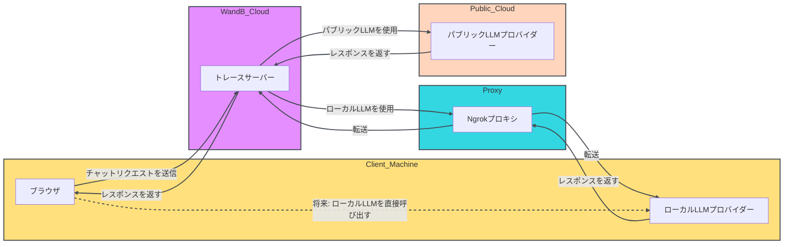

<Tip>
期間限定で、W&B Inference が無料枠に含まれます。W&B Inference は、API と Weave Playground を通じて主要なオープンソースの基盤モデルへアクセスできます。 
- [Developer documentation](../integrations/inference)
- [Product page](https://wandb.ai/site/inference) 
</Tip>

LLM のプロンプトとレスポンスを評価するのは難しい作業です。Weave Playground は、LLM プロンプトとレスポンスの試行錯誤のプロセスを簡素化し、さまざまなモデルやプロンプトを試しやすくするよう設計されています。プロンプトの編集、メッセージの再試行、モデル比較といった機能により、Playground を使って LLM アプリケーションをすばやくテストし、改善できます。現在 Playground は、OpenAI、Anthropic、Google などのプロバイダーのモデルに加えて、[カスタムプロバイダー](#add-a-custom-provider) にも対応しています。

- **Quick access:** Weave のサイドバー メニューから「Playground」を開いて新しいセッションを開始するか、Call ページから既存のプロジェクトをテストします。
- **Message controls:** チャット内でメッセージを直接編集、再試行、削除できます。
- **Flexible messaging:** 新しいメッセージをユーザー入力またはシステム入力として追加し、LLM に送信できます。
- **Customizable settings:** 好みの LLM プロバイダーを設定し、モデル設定を調整します。
- **Multi-LLM support:** チームレベルの APIキー の管理のもと、モデルを切り替えることができます。
- **Compare models:** 異なるモデルがプロンプトにどのように応答するかを比較できます。
- **Custom providers:** カスタムモデル向けに、OpenAI 互換の API エンドポイントをテストします。
- **Saved models:** ワークフローで再利用できるモデルプリセットを作成・設定します。

Playground を使い始めて、LLM との対話を最適化し、プロンプトエンジニアリングおよび LLM アプリケーション開発のプロセスを効率化しましょう。

- [プロバイダーの認証情報と詳細を追加する](#add-provider-credentials-and-information)
- [Playground にアクセスする](#access-the-playground)
- [LLM を選択する](#select-an-llm)
- [Playground の設定をカスタマイズする](#customize-playground-settings)
- [メッセージコントロール](#message-controls)
- [LLM を比較する](#compare-llms)
- [カスタムプロバイダー](#custom-providers)
- [保存済みモデル](#saved-models) 

<div id="add-provider-credentials-and-information">
  ## プロバイダの認証情報および各種情報を追加する
</div>

Playground を使用する前に、プロバイダの認証情報を追加する必要があります。Playground は現在、多くのプロバイダのモデルをサポートしています。利用可能なモデルのいずれかを使用するには、W&B の設定のチームシークレットに適切な情報を追加してください。

- Amazon Bedrock:
  - `AWS_ACCESS_KEY_ID`
  - `AWS_SECRET_ACCESS_KEY`
  - `AWS_REGION_NAME`
- Anthropic: `ANTHROPIC_API_KEY`
- Azure:
  - `AZURE_API_KEY`
  - `AZURE_API_BASE`
  - `AZURE_API_VERSION`
- Deepseek: `DEEPSEEK_API_KEY`
- Google: `GEMINI_API_KEY`
- Groq: `GROQ_API_KEY`
- Mistral: `MISTRAL_API_KEY`
- OpenAI: `OPENAI_API_KEY`
- X.AI: `XAI_API_KEY`

<div id="access-the-playground">
  ## Playground にアクセスする
</div>

Playground にアクセスする方法は 2 つあります。

1. _シンプルなシステムプロンプト付きで新しい Playground ページを開く_: Weave プロジェクトのサイドバーで **Playground** を選択します。Playground が同じタブで開きます。
2. _特定の呼び出し用の Playground を開く_:
   1. サイドバーで **Traces** タブを選択します。トレースの一覧が表示されます。
   2. トレースの一覧で、表示したい呼び出しの名前をクリックします。呼び出しの詳細ページが開きます。
   3. **Open chat in Playground** をクリックします。Playground が新しいタブで開きます。

<Frame>

</Frame>

<div id="select-an-llm">
  ## LLM を選択する
</div>

プロンプトヘッダー（Playground メインパネル上部）の **Select a model** ドロップダウンを使って、LLM を切り替えることができます。各プロバイダーごとに利用可能なモデルは次のとおりです。

- Amazon Bedrock
- Anthropic
- Azure
- Deepseek
- Google
- Groq
- Mistral
- OpenAI
- X.AI

利用可能なモデルは、チームに対して設定されているプロバイダーによって異なります。

<div id="customize-playground-settings">
  ## Playground の設定をカスタマイズする
</div>

<div id="adjust-llm-parameters">
  ### LLM パラメータを調整する
</div>

選択したモデルに対して、さまざまなパラメータ値を試すことができます。Playground でパラメータを調整するには、次の手順を実行します。

1. プロンプトヘッダー（メインパネル上部）で、**チャット設定 (<Icon icon="sliders" iconType="regular" />)** ボタンをクリックして、**チャット設定** パネルを開きます。
2. **チャット設定** パネルで、必要に応じてパラメータを調整します。Weave の呼び出しトラッキングをオンまたはオフに切り替えたり、[関数を追加](#add-a-function)したりできます。
3. 変更は自動的に適用されます。パネルを閉じるには、もう一度 **チャット設定** をクリックするか、右上隅の **x** をクリックします。**チャット設定** ボタンのホバーテキストは、変更した設定の内容を表示するように更新されます。

ページを離れると、設定は失われます。設定を保存するには、[モデルを保存](#save-a-model)してください。
変更した設定を破棄してやり直したい場合は、ページを再読み込みしてください。

<Frame>

</Frame>

Playground では、試行回数を設定することで、同じ入力に対して複数の出力を生成できます。デフォルト設定は `1` です。試行回数を調整するには、**チャット設定** パネルを開き、**試行回数** の設定を調整します。

<div id="add-a-function">
  ### 関数を追加する
</div>

異なるモデルが、ユーザーからの入力に応じて関数をどのように利用するかをテストできます。Playground でテストする関数を追加するには、**Chat settings** パネルで **+ Add function** をクリックします。画面の指示に従って関数を定義し、変更内容を保存します。

<div id="message-controls">
  ## メッセージの制御
</div>

<div id="prompt-definition-area">
  ### プロンプト定義エリア
</div>

**プロンプト定義エリア**では、インタラクション全体を通してモデルの挙動を形作る指示を定義できます。

このエリアでは、メッセージの送受信が始まる前に一貫して適用されるコンテキストを指定します。これには、ロール定義、トーンやスタイルに関する指針、挙動上の制約、出力要件などが含まれます。ここで行った変更は、再度変更しない限り、その後のすべてのインタラクションに影響します。

このエリアには、次の要素が含まれます:

- **プロンプトセレクタ**: 既存の保存済みプロンプトを選択するか、新規に作成します。
- **メッセージロールセレクタ**: 定義中のメッセージのロール (**System**、**Assistant**、または **User** ロール) を指定します。
- **プロンプトテキスト**: モデルがどのように応答すべきかを定義する指示テキストを入力します。
- **Add message** ボタン: 実行前にプロンプトコンテキストに追加のメッセージを含められます。

これらのメッセージはまとめてモデルに送信され、次の用途に利用できます:

- 補足的なシステムレベルの指示を追加する。
- 応答をガイドするための Assistant ロールのサンプルメッセージを提供する (few-shot プロンプティングなど)。
- 特定のシナリオをテストするためのユーザーメッセージをあらかじめ定義する。

<div id="messages-panel">
  ### Messages パネル
</div>

**Messages パネル**には、実行中に生成された会話が表示されます。

このパネルには次の内容が含まれます:

- プロンプト設定に含まれる、あらかじめ定義されたメッセージ
- メッセージコンポーザーから送信されたメッセージ
- モデルから返された応答

パネル内のメッセージに対しては、**Copy**、**Delete**、**Edit**、**Retry** を行うこともできます。

<div id="message-composer-input-field">
  ### メッセージコンポーザー（入力フィールド）
</div>

**メッセージコンポーザー**は、新しいメッセージをモデルに送信するための入力フィールドです。

メッセージの役割を選択し、メッセージを実行用に送信できます。ほとんどのやり取りは **User** メッセージとして作成されます。テストしたい指示が変わった場合には、**System** や **Assistant** メッセージを追加できます。

<Frame>

</Frame>

<div id="view-message-history">
  ## メッセージ履歴を表示する
</div>

メッセージ履歴を表示するには、右側の Playground のツールバーにある **History (<Icon icon="clock-rotate-left" iconType="light" />)** ボタンをクリックします。これにより、現在のプロジェクトで送信されたすべてのメッセージを表示する「History」パネルが開きます。  

履歴から項目を選択すると、自動的に別のチャットパネルに読み込まれ、比較できます。 

<div id="compare-llms">
  ## LLM を比較する
</div>

Playground では LLM を比較できます。比較を行うには、右側にある Playground のツールバーで **Add Chat (<Icon icon="plus" iconType="solid" />)** ボタンをクリックします。元のチャットの横に 2 つ目のチャットが開きます。
2 つ目のチャットでは、モデルの選択、設定の調整、関数の追加など、元のチャットと同じ機能を使用できます。

<div id="custom-providers">
  ## カスタムプロバイダー
</div>

<div id="add-a-custom-provider">
  ### カスタムプロバイダーを追加する
</div>

組み込みプロバイダーに加えて、Playground を使用してカスタムモデル向けの OpenAI 互換 API エンドポイントをテストできます。例としては次のようなものがあります。

- サポートされているモデルプロバイダーの古いバージョン
- ローカルモデル

Playground にカスタムプロバイダーを追加するには、次の手順を実行します。

1. プロンプトヘッダー（メインパネル上部）で **Select a model** ドロップダウンをクリックします。
2. **+ Add AI provider** を選択します。
3. **Custom Provider** を選択します。
4. ポップアップモーダルで、プロバイダー情報を入力します。

- **Provider name**: `openai` や `ollama` など、プロバイダーの名前。
- **API key**: OpenAI APIキーなど、プロバイダーの APIキー。
- **Base URL**: `https://api.openai.com/v1/` や、`https://e452-2600-1700-45f0-3e10-2d3f-796b-d6f2-8ba7.ngrok-free.app` のような ngrok の URL など、プロバイダーのベースとなるエンドポイント。
- **Headers**: （オプション）1 つ以上のカスタム HTTP ヘッダーのキーと値のペア。
- **Models**: `deepseek-r1` や `qwq` など、プロバイダーの 1 つ以上のモデル。
- **Max tokens**: （オプション）各モデルについて、そのモデルがレスポンスで生成できるトークン数の最大値。

5. プロバイダー情報を入力したら、**Add provider** をクリックします。
6. **Select a model** ドロップダウンから、新しいプロバイダーと利用可能なモデルを選択します。

<Warning>
CORS の制限により、Playground から localhost や 127.0.0.1 の URL を直接呼び出すことはできません。ローカルモデルサーバー（Ollama など）を実行している場合は、ngrok のようなトンネリングサービスを使用して安全に公開してください。詳細は、[Use ngrok with Ollama](#use-a-local-model-as-a-custom-provider) を参照してください。
</Warning>

これで、標準の Playground 機能を使用してカスタムプロバイダーのモデルをテストできます。カスタムプロバイダーを[編集](#edit-a-custom-provider)または[削除](#remove-a-custom-provider)することもできます。

<div id="edit-a-custom-provider">
  ### カスタムプロバイダーを編集する
</div>

[すでに作成したカスタムプロバイダー](#add-a-custom-provider)の情報を編集するには、次の手順を実行します。

1. プロンプトヘッダーの **Select a model** ドロップダウンをクリックし、**+Configure providers** を選択します。

* または、サイドバーメニューで **Project** を選択し、**AI Providers** タブを選択します。

2. **Custom providers** テーブルで、更新したいカスタムプロバイダーを探します。
3. 対象のカスタムプロバイダーの行の **Last Updated** 列で、編集ボタン（鉛筆アイコン）をクリックします。
4. 表示されるモーダルウィンドウで、プロバイダー情報を編集します。
5. **Save** をクリックします。

<div id="remove-a-custom-provider">
  ### カスタムプロバイダを削除する
</div>

[以前に作成したカスタムプロバイダ](#add-a-custom-provider)を削除するには、次の操作を行います。

1. プロンプトヘッダーで **Select a model** ドロップダウンをクリックし、**+Configure providers** を選択します。

* または、サイドバーのメニューで **Project** を選択し、**AI Providers** タブを開きます。

2. **Custom providers** テーブルで、削除するカスタムプロバイダを探します。
3. 対象のカスタムプロバイダのエントリの **Last Updated** 列で、削除ボタン（ゴミ箱アイコン）をクリックします。
4. 表示されるモーダルで、プロバイダを削除することを確認します。この操作は元に戻せません。
5. **Delete** をクリックします。

<div id="use-a-local-model-as-a-custom-provider">
  ### ローカルモデルをカスタムプロバイダとして使用する
</div>

Playground でローカルで稼働しているモデルをテストするには、ngrok と Ollama を使って、一時的に CORS 制限を回避する公開 URL を作成します。

設定するには、次の手順を実行します。

1. 使用しているオペレーティングシステム向けに [ngrok をインストール](https://ngrok.com/docs/getting-started/#step-1-install) します。

2. Ollama モデルを起動します:

   ```bash
   ollama run <model>
   ```

3. 別のターミナルで、必要な CORS ヘッダーを含む ngrok トンネルを作成します:

   ```bash
   ngrok http 11434 --response-header-add "Access-Control-Allow-Origin: *" --host-header rewrite
   ```

4. ngrok が起動すると、`https://xxxx-xxxx.ngrok-free.app` のような公開 URL が表示されます。Playground で [カスタムプロバイダを追加](#add-a-custom-provider) する際、この URL を **Base URL** として使用します。

次の図は、ローカル環境、ngrok プロキシ、および W&amp;B のクラウドサービス間のデータフローを示しています。


```mermaid
flowchart LR
    %% スタイル定義
    classDef clientMachine fill:#FFD95CCC,stroke:#454B52,stroke-width:2px
    classDef proxy fill:#00CDDBCC,stroke:#454B52,stroke-width:2px
    classDef wandbCloud fill:#DE72FFCC,stroke:#454B52,stroke-width:2px
    classDef publicCloud fill:#FFCBADCC,stroke:#454B52,stroke-width:2px

    %% サブグラフ
    subgraph Client_Machine
        browser[ブラウザ]
        llm_local[ローカルLLMプロバイダー]
    end

    subgraph Proxy
        ngrok[Ngrokプロキシ]
    end

    subgraph WandB_Cloud
        trace_server[トレースサーバー]
    end

    subgraph Public_Cloud
        llm_cloud[パブリックLLMプロバイダー]
    end

    %% サブグラフにスタイルを適用
    class Client_Machine clientMachine
    class Proxy proxy
    class WandB_Cloud wandbCloud
    class Public_Cloud publicCloud

    %% 現在のデータフロー
    browser -->|チャットリクエストを送信| trace_server
    trace_server -->|パブリックLLMを使用| llm_cloud
    trace_server -->|ローカルLLMを使用| ngrok
    ngrok -->|転送| llm_local
    llm_cloud -->|レスポンスを返す| trace_server
    llm_local -->|レスポンスを返す| ngrok
    ngrok -->|転送| trace_server
    trace_server -->|レスポンスを返す| browser

    %% 将来的に可能な接続
    browser -.->|将来: ローカルLLMを直接呼び出す| llm_local

    %% リンクスタイル
    linkStyle default stroke:#454B52,stroke-width:2px
    linkStyle 8 stroke:#454B52,stroke-width:2px,stroke-dasharray:5
```


<div id="saved-models">
  ## 保存済みモデル
</div>

<div id="save-a-model">
  ### モデルを保存する
</div>

ワークフローで再利用できるモデルプリセットを作成して設定できます。モデルを保存すると、好みの設定、パラメータ、関数フック込みで素早く読み込めます。

1. プロンプトヘッダー（メインパネル上部）の **Select a model** ドロップダウンで、プロバイダーとモデルを選択します。
2. プロンプトヘッダーで **Chat settings (<Icon icon="sliders" iconType="regular" />)** ボタンをクリックして、**Chat settings** パネルを開きます。
3. **Chat settings** パネルで:
   - **Model Name**（必須）：保存するモデルの名前を入力します。
   - 必要に応じてパラメータを調整します。Weave のコールトラッキングをオンまたはオフに切り替えたり、[関数を追加](#add-a-function)することもできます。
4. **Publish model** をクリックします。モデルは保存され、**Select a model** ドロップダウン内の **Saved Models** からアクセスできます。これで、保存したモデルを[使用](#use-a-saved-model)したり[更新](#update-a-saved-model)したりできます。

<div id="use-a-saved-model">
  ### 保存済みモデルを使用する
</div>

以前に[保存したモデル](#save-a-model)にすばやく切り替えて、実験やセッション間の一貫性を保ちます。これにより、中断したところからすぐに再開できます。

1. プロンプトヘッダーの **Select a model** ドロップダウンで **Saved Models** を選択します。
2. 保存済みモデルの一覧から、読み込みたいモデルを選択します。モデルが読み込まれ、Playground ですぐに使用できる状態になります。

<div id="update-a-saved-model">
  ### 保存済みモデルを更新する
</div>

既存の[保存済みモデル](#save-a-model)を編集して、パラメータを微調整したり、その設定を更新したりできます。これにより、保存済みモデルをユースケースに合わせて進化させることができます。

1. プロンプトヘッダーの **Select a model** ドロップダウンで、**Saved Models** を選択します。
2. 保存済みモデルの一覧から、更新したい保存済みモデルを選択します。 
3. プロンプトヘッダーで、**Chat settings (<Icon icon="sliders" iconType="regular" />)** ボタンをクリックして **Chat settings** パネルを開きます。
4. **Chat settings** パネルで、必要に応じてパラメータを調整します。Weave コールトラッキングのオン/オフを切り替えたり、[関数を追加](#add-a-function)したりできます。
5. **Update model** をクリックします。モデルが更新され、**Select a model** ドロップダウン内の **Saved Models** からアクセスできるようになります。保存済みモデルのバージョンは自動的にインクリメントされます。