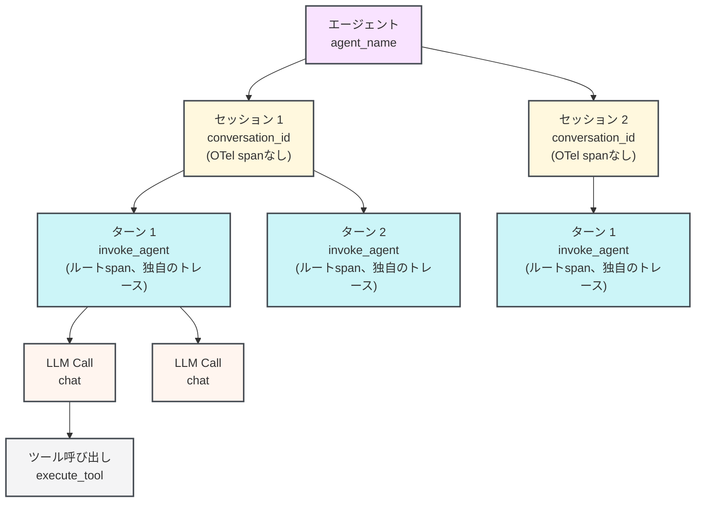

import AgentsPreview from '/snippets/ja/_includes/agents-public-preview.mdx';

<AgentsPreview />

W&amp;B Weave SDK を使用してマルチターンのエージェント型アプリケーションを計装し、エージェントの動作を確認、デバッグ、評価する方法を学びます。このガイドは、エージェントを構築または統合し、セッション、ターン、LLM calls、ツール実行を構造化された形で可視化したい開発者を対象としています。

Agents 向けの Weave SDK は、マルチターンのエージェント会話のライフサイクル全体をモデル化します。これには、多数のセッションを持つエージェント、ターンをグループ化するセッション、ユーザーとエージェントの各やり取り (ターン) 、ターン内の LLM calls、そして LLM によってトリガーされるツール実行が含まれます。トレースは Weave プロジェクトの **Agents** タブに表示されます。各セッションには、ネストされたツール呼び出し、トークン使用量、feedback を含むマルチターンのタイムラインが表示されます。

Weave は、分散トレースのオープン標準である [OpenTelemetry (OTel)](https://opentelemetry.io/docs/concepts/) を基盤としています。各ターン、LLM Call、ツール呼び出し はそれぞれ OTel の *span* (1 つの操作を表す構造化レコード) を生成します。各 span には、`gen_ai.agent.name` や `gen_ai.conversation.id` などの [GenAI semantic-convention](https://opentelemetry.io/docs/specs/semconv/gen-ai/) attribute がタグ付けされます。

個々の関数を `@weave.op` デコレーターで Ops としてトレースしている場合は、代わりに [LLM アプリケーションをトレースする](/ja/weave/guides/tracking/tracing) を参照してください。

<div id="before-you-begin">
  ## 始める前に
</div>

使い始めるには、`weave` パッケージをインストールして project を初期化します。この手順により、チームと project が Weave に登録され、SDK がspanを UI の正しい場所にルーティングできるようになります。

<Tabs>
  <Tab title="Python">
    ```bash lines
    pip install weave
    ```

    `[YOUR-TEAM]` は W&amp;B チーム名に、`[YOUR-PROJECT]` は W&amp;B のプロジェクト名に置き換えてください。

    ```python lines
    import weave

    weave.init("[YOUR-TEAM]/[YOUR-PROJECT]")
    ```

    `start_session()`、`start_turn()`、`start_llm()`、`start_tool()`、`start_subagent()` を呼び出す前に、`weave.init()` を呼び出してください。トレースが無効になっている場合、または init 呼び出しがない場合、すべてのエージェント トレース関数は何もせずに終了します。そのため、インストルメンテーションは本番コードに残したまま、設定で制御できます。
  </Tab>

  <Tab title="TypeScript">
    ```bash lines
    npm install weave
    ```

    `[YOUR-TEAM]` は W&amp;B チーム名に、`[YOUR-PROJECT]` は W&amp;B のプロジェクト名に置き換えてください。

    ```typescript lines twoslash
    // @noErrors
    import * as weave from 'weave';

    await weave.init('[YOUR-TEAM]/[YOUR-PROJECT]');
    ```

    `startSession()`、`startTurn()`、`startLLM()`、`startTool()`、`startSubagent()` を呼び出す前に、`weave.init()` を呼び出してください。トレースが無効になっている場合、または init 呼び出しがない場合、すべてのエージェント トレース関数は何もせずに終了します。そのため、インストルメンテーションは本番コードに残したまま、設定で制御できます。
  </Tab>
</Tabs>

<div id="the-agent-data-model">
  ## エージェントのデータモデル
</div>

Weave では、エージェントの動作を 1 対多の関係からなる階層としてモデル化します。各エージェントは複数のセッションを持つことができ、各セッションは複数のターンを持つことができ、各ターンは複数の LLM Call を持つことができ、各 LLM Call は複数のツール呼び出しをトリガーできます。

| 概念           | Weave SDK クラス  | OTel span タイプ                                                     | 説明                                                  | 参照ページ                                                                                                                              |
| ------------ | -------------- | ----------------------------------------------------------------- | --------------------------------------------------- | ---------------------------------------------------------------------------------------------------------------------------------- |
| エージェント       | *(no class)*   | *(no span, grouped by the `agent_name` attribute)*                | Agents タブ内のエージェント型アプリケーション。1 つ以上のセッションを含みます         |                                                                                                                                    |
| セッション        | `Conversation` | *(no span, turns are grouped by the `conversation_id` attribute)* | 1 つ以上のターンを含む会話または run                               | [Python](/ja/weave/reference/python-sdk#class-conversation) <br /> [TypeScript](/ja/weave/reference/typescript-sdk/classes/conversation) |
| ターン          | `Turn`         | `invoke_agent`                                                    | 1 つのユーザーメッセージと、それに対するエージェントの完全な応答                   | [Python](/ja/weave/reference/python-sdk#class-turn) <br /> [TypeScript](/ja/weave/reference/typescript-sdk/classes/turn)                 |
| LLM Call     | `LLM`          | `chat`                                                            | 言語モデル API への 1 回の Call                              | [Python](/ja/weave/reference/python-sdk#class-llm) <br /> [TypeScript](/ja/weave/reference/typescript-sdk/classes/llm)                   |
| ツール呼び出し      | `Tool`         | `execute_tool`                                                    | LLM の応答によってトリガーされる 1 回のツール呼び出し                      | [Python](/ja/weave/reference/python-sdk#class-tool) <br /> [TypeScript](/ja/weave/reference/typescript-sdk/classes/tool)                 |
| サブエージェント呼び出し | `SubAgent`     | `invoke_agent`                                                    | ネストされたエージェント呼び出し。通常は、あるエージェントが別のエージェントに委譲する場合に発生します | [Python](/ja/weave/reference/python-sdk#class-subagent) <br /> [TypeScript](/ja/weave/reference/typescript-sdk/classes/subagent)         |

次の図は、1 つのエージェントに複数のセッションが含まれ、1 つのセッションに複数のターンが含まれ、その後も同様に続くことを示しています。



セッションは、親 span ではなく、共有された `conversation_id` 属性によって ターン をグループ化します。そのため、各 ターン はそれぞれ独立した OTel トレースを開始します。この設計は、分散トレースと並列実行をサポートします。クライアントは、サーバー側での集約を行わずに、span を OTel collector に直接送信します。

<Tip>
  Claude Agent SDK や Codex などの SDK やハーネスに Weave を統合するには、[Trace agent integrations](/ja/weave/guides/tracking/trace-agent-integrations) を参照してください。Weave は、エージェント構築 SDK やエージェントハーネスのいくつかに自動でパッチを適用するため、すばやく統合できます。
</Tip>

<div id="agent-tracing-apis">
  ## エージェントのトレース API
</div>

以下のセクションでは、各トップレベルのトレース関数と、その関数が受け入れる引数について説明します。これらを使用して、前のセクションで説明したデータモデルの セッション、turn、LLM Call、および ツール呼び出し の各レイヤーを計測します。

Weave では、次のトップレベル関数を提供しています。各関数は、コンテキストマネージャーとして動作するオブジェクト (Python では `with`、TypeScript では `try/finally` を使用) を返すか、`.end()` を呼び出して手動で終了できます。

<div id="start-a-session">
  ### セッションを開始する
</div>

`start_session()` (Python) または `startSession()` (TypeScript) は、すべての子 span に `conversation_id` 属性を設定し、Agents タブでターンがグループ化されるようにします。`session_id` / `sessionId` を渡す場合は、会話全体を通じて変わらない安定した値である必要があります。同じ ID を再利用すると、既存のセッションに新しいターンを追加できます。これを省略すると、SDK が自動的に UUID を生成します。

アクティブなセッションはコンテキスト (Python の `ContextVar` または Node.js の `AsyncLocalStorage`) に保存されるため、同じ非同期コンテキスト内で実行されるコードであれば、セッションオブジェクトを明示的に渡さなくても `weave.get_current_session()` / `weave.getCurrentSession()` で取得できます。

<Tabs>
  <Tab title="Python">
    ```python lines
    session = weave.start_session(
        agent_name="my-agent",    # 任意: UI でエージェントを識別します。省略すると、セッションは名前付きエージェントの下にグループ化されません。
        session_id="",            # 任意: ターンをグループ化するための安定した ID。空の場合は自動生成されます。
        model="",                 # 任意: このセッション内のターンに使用するデフォルトのモデル。
        session_name="",          # 任意: UI に表示される、わかりやすいラベル。
        include_content=True,     # 任意: span からメッセージ本文を除外するには False に設定します。
        continue_parent_trace=False,  # 任意: 新しい OTel trace を開始せず、既存の trace に関連付けます。
    )
    ```
  </Tab>

  <Tab title="TypeScript">
    ```typescript lines twoslash
    // @noErrors
    const session = weave.startSession({
      agentName: 'my-agent',  // 任意: UI でエージェントを識別します。省略すると、セッションは名前付きエージェントの下にグループ化されません。
      sessionId: '',          // 任意: ターンをグループ化するための安定した ID。空の場合は自動生成されます。
      model: '',              // 任意: このセッション内のターンに使用するデフォルトのモデル。
    });
    ```
  </Tab>
</Tabs>

<div id="start-a-turn">
  ### ターンを開始する
</div>

`start_turn()` (Python) と `startTurn()` (TypeScript) は、新しい OTel トレースのルートとなる `invoke_agent` span を新しく作成します。Weave は、この span を使用して、タイムラインビュー内で 1 回の完全なユーザーとエージェントのやり取りを表現します。

呼び出し方法は 2 とおりあります。

* **トップレベル関数として** (`weave.start_turn(...)` / `weave.startTurn(...)`)。以下の例で示す形式です。コンテキストからアクティブなセッションを取得し、その会話 ID を継承します。アクティブなセッションがない場合、ターンは `conversation_id` なしで作成され、ほかのターンとグループ化されません。
* **参照を保持しているセッションのインスタンスメソッドとして** (`session.start_turn(...)` / `session.startTurn(...)`)。コンテキストマネージャーブロック内など、スコープ内に明示的なセッションオブジェクトがある場合に便利です。以下の「コンテキストマネージャーまたは try-finally パターン」の例では、この形式を使用しています。両方の SDK の `Session`、`Turn`、`LLM`、`Tool`、`SubAgent` のリファレンスページへの直接リンクについては、上記のデータモデル表を参照してください。

<Tabs>
  <Tab title="Python">
    ```python lines
    turn = weave.start_turn(
        user_message="What is the weather in Tokyo?",  # ユーザーの入力テキスト。
        agent_name="my-agent",   # 省略可能: セッション レベルのエージェント名を上書きします。
        model="gpt-4o",          # 省略可能: このターンで使用されるモデル。
    )
    ```
  </Tab>

  <Tab title="TypeScript">
    ```typescript lines twoslash
    // @noErrors
    const turn = weave.startTurn({
      agentName: 'my-agent',  // 省略可能: セッション レベルのエージェント名を上書きします。
      model: 'gpt-4o',        // 省略可能: このターンで使用されるモデル。
    });
    ```
  </Tab>
</Tabs>

<div id="start-an-llm-call">
  ### LLM Call を開始する
</div>

`start_llm()` / `startLLM()` は、現在のターンの下にネストされた `chat` span を作成します。Weave はこの span を使用して、Agents ビューに token 使用量、モデル名、入力メッセージと出力メッセージ、および推論を表示します。

<Tabs>
  <Tab title="Python">
    ```python lines
    llm = weave.start_llm(
        model="gpt-4o",             # モデル識別子。
        provider_name="openai",     # 任意: provider 名。例: "openai"、"anthropic"。下記のメモを参照してください。
        system_instructions=["Be concise."],  # 任意: system prompt の文字列。
    )
    ```
  </Tab>

  <Tab title="TypeScript">
    ```typescript lines twoslash
    // @noErrors
    const llm = weave.startLLM({
      model: 'gpt-4o',          // モデル識別子。
      providerName: 'openai',   // 任意: provider 名。例: "openai"、"anthropic"。下記のメモを参照してください。
    });
    ```
  </Tab>
</Tabs>

LLM Call が完了したら、閉じる前にレスポンスデータを `llm` オブジェクトに割り当ててください。

<Tabs>
  <Tab title="Python">
    ```python lines
    with weave.start_llm(model="gpt-4o", provider_name="openai") as llm:
        response = openai_client.chat.completions.create(...)
        llm.input_messages = [Message(role="user", content="...")]
        llm.output_messages = [Message(role="assistant", content=response.choices[0].message.content)]
        llm.usage = Usage(
            input_tokens=response.usage.prompt_tokens,
            output_tokens=response.usage.completion_tokens,
        )
    ```
  </Tab>

  <Tab title="TypeScript">
    ```typescript lines twoslash
    // @noErrors
    const llm = weave.startLLM({ model: 'gpt-4o', providerName: 'openai' });
    try {
      const response = await openaiClient.chat.completions.create({ ... });
      llm.record({
        inputMessages: [{ role: 'user', content: '...' }],
        outputMessages: [{ role: 'assistant', content: response.choices[0].message.content ?? '' }],
        usage: {
          inputTokens: response.usage?.prompt_tokens,
          outputTokens: response.usage?.completion_tokens,
        },
      });
    } finally {
      llm.end();
    }
    ```

    `llm.record()` は、`inputMessages`、`outputMessages`、`usage`、`reasoning` を 1 回の呼び出しで割り当てるためのショートカットです。必要に応じて、各プロパティを個別に設定することもできます。Python SDK では、同じメソッドが `llm.record(...)` として snake&#95;case のキーワード引数付きで提供されています。
  </Tab>
</Tabs>

`provider_name` / `providerName` は明示的に渡してください。Weave はモデル文字列からこれを推測しません。

<div id="start-a-tool-call">
  ### ツール呼び出しを開始する
</div>

`start_tool()` / `startTool()` は `execute_tool` span を作成します。この span は、コンテキスト内でアクティブな OTel span の子になります (通常は、ツール呼び出しを生成した LLM Call の `chat` span です) 。

<Tabs>
  <Tab title="Python">
    ```python lines
    tool = weave.start_tool(
        name="get_weather",                  # LLM に宣言したツール名。
        arguments='{"city": "Tokyo"}',       # ツール引数の JSON 文字列。
        tool_call_id="call_abc123",          # 省略可能: LLM レスポンスのツール呼び出し ID。
    )
    ```
  </Tab>

  <Tab title="TypeScript">
    ```typescript lines twoslash
    // @noErrors
    const tool = weave.startTool({
      name: 'get_weather',            // LLM に宣言したツール名。
      args: '{"city": "Tokyo"}',      // 省略可能: ツール引数の JSON 文字列。
      toolCallId: 'call_abc123',      // 省略可能: LLM レスポンスのツール呼び出し ID。
    });
    ```
  </Tab>
</Tabs>

閉じる前にツールの結果を設定します。

<Tabs>
  <Tab title="Python">
    ```python lines
    with weave.start_tool(name="get_weather", arguments='{"city": "Tokyo"}') as tool:
        result = get_weather_api("Tokyo")
        tool.result = result  # dict、list、または string を受け入れます。自動的に JSON エンコードされます。
    ```
  </Tab>

  <Tab title="TypeScript">
    ```typescript lines twoslash
    // @noErrors
    const tool = weave.startTool({ name: 'get_weather', args: '{"city": "Tokyo"}' });
    try {
      tool.result = await getWeatherApi('Tokyo');
    } finally {
      tool.end();
    }
    ```
  </Tab>
</Tabs>

<div id="usage-patterns-for-agent-tracing">
  ## エージェント トレースの使用パターン
</div>

以下のセクションでは、エージェント コードの構造に応じて、これらの関数をどのように組み合わせるかを説明します。

以下の例では、Weave SDK の 2 つのタイプを使用します。

* `Message` ([Python](/ja/weave/reference/python-sdk#class-message) · [TypeScript](/ja/weave/reference/typescript-sdk/interfaces/message)) は、会話内の 1 つのエントリ (ユーザー入力、アシスタントの応答、system prompt、または tool の結果) を表します。モデルが受け取った内容を記録するには、メッセージのリストを `llm.input_messages` / `llm.inputMessages` に割り当て、生成した内容を記録するには `llm.output_messages` / `llm.outputMessages` に割り当てます。
* `Usage` ([Python](/ja/weave/reference/python-sdk#class-usage) · [TypeScript](/ja/weave/reference/typescript-sdk/interfaces/usage)) は、LLM の応答から token 数を取得し、`llm.usage` に割り当てられます。

Weave はこの両方を使用して、各 LLM Call の入力、出力、token 使用量を Agents ビュー に表示します。

<div id="context-manager-or-try-finally-pattern">
  ### コンテキストマネージャーまたは try-finally パターン
</div>

ほとんどのエージェントでは、Python ではコンテキストマネージャーパターン、TypeScript では try-finally パターンを使用します。span は、例外が発生した場合でも、ブロックの最後でクローズされて送信されます。

Weave はアクティブな セッション、ターン、LLM Call をコンテキストに保持するため、ブロック内で呼び出される任意の関数は、親への明示的な参照を持たなくても `start_llm()` / `startLLM()` または `start_tool()` / `startTool()` を呼び出せます。これは、コードが同じ async コンテキスト内で実行されている限り、モジュール境界をまたいでも機能します。コールスタック内のどこからでも現在アクティブなオブジェクトを取得するには、`weave.get_current_session()` / `weave.getCurrentSession()`、`weave.get_current_turn()` / `weave.getCurrentTurn()`、および `weave.get_current_llm()` / `weave.getCurrentLLM()` を使用します。

<Tabs>
  <Tab title="Python">
    ```python lines highlight="13,14,17,25,29"
    import weave
    from weave.session.session import Message, Usage

    # プレースホルダー関数: 実際の実装に置き換えてください。
    def call_openai(*args, **kwargs):
        pass  # 実際の LLM クライアント呼び出しに置き換えてください。

    def get_weather_api(city: str) -> str:
        return "24°C, sunny"  # 実際の天気 API 呼び出しに置き換えてください。

    weave.init("[YOUR-TEAM]/[YOUR-PROJECT]")

    with weave.start_session(agent_name="weather-bot") as session:
        with session.start_turn(user_message="What is the weather in Tokyo?") as turn:

            # 1 回目の LLM Call: ツール呼び出しを返します。
            with weave.start_llm(model="gpt-4o", provider_name="openai") as llm:
                response = call_openai(...)
                llm.input_messages = [Message(role="user", content="What is the weather?")]
                llm.think("User wants weather data, I should call get_weather.")
                llm.output("Let me check the weather for you.")
                llm.usage = Usage(input_tokens=100, output_tokens=20)

                # ツール呼び出し: これをリクエストした LLM Call の子です。
                with weave.start_tool(name="get_weather", arguments='{"city":"Tokyo"}') as tool:
                    tool.result = get_weather_api("Tokyo")  # "24°C, sunny" を返します。

            # 2 回目の LLM Call: 最終的な回答を生成します。
            with weave.start_llm(model="gpt-4o", provider_name="openai") as llm:
                llm.input_messages = [Message(role="user", content="What is the weather?")]
                llm.output("It is 24°C and sunny in Tokyo today.")
                llm.usage = Usage(input_tokens=150, output_tokens=30)
    ```
  </Tab>

  <Tab title="TypeScript">
    ```typescript lines highlight="11,13,16,24,35" twoslash
    // @noErrors
    import * as weave from 'weave';
    import type { Message, Usage } from 'weave';

    // プレースホルダー関数: 実際の実装に置き換えてください。
    async function getWeatherApi(city: string): Promise<string> {
      return '24°C, sunny';  // 実際の天気 API 呼び出しに置き換えてください。
    }

    await weave.init('[YOUR-TEAM]/[YOUR-PROJECT]');

    const session = weave.startSession({ agentName: 'weather-bot' });
    try {
      const turn = session.startTurn({ agentName: 'weather-bot' });
      try {
        // 1 回目の LLM Call: ツール呼び出しを返します。
        const llm = weave.startLLM({ model: 'gpt-4o', providerName: 'openai' });
        try {
          llm.inputMessages = [{ role: 'user', content: 'What is the weather?' }];
          llm.think('User wants weather data, I should call get_weather.');
          llm.output('Let me check the weather for you.');
          llm.usage = { inputTokens: 100, outputTokens: 20 };

          // ツール呼び出し: これをリクエストした LLM Call の子です。
          const tool = weave.startTool({ name: 'get_weather', args: '{"city":"Tokyo"}' });
          try {
            tool.result = await getWeatherApi('Tokyo');  // "24°C, sunny" を返します。
          } finally {
            tool.end();
          }
        } finally {
          llm.end();
        }

        // 2 回目の LLM Call: 最終的な回答を生成します。
        const llm2 = weave.startLLM({ model: 'gpt-4o', providerName: 'openai' });
        try {
          llm2.inputMessages = [{ role: 'user', content: 'What is the weather?' }];
          llm2.output('It is 24°C and sunny in Tokyo today.');
          llm2.usage = { inputTokens: 150, outputTokens: 30 };
        } finally {
          llm2.end();
        }
      } finally {
        turn.end();
      }
    } finally {
      session.end();
    }
    ```
  </Tab>
</Tabs>

<div id="manual-start-and-end-pattern">
  ### 手動で開始・終了するパターン
</div>

`with` ブロックや `try/finally` を使用できない場合は、`.end()` を明示的に使用します。たとえば、span の開始と終了が別々の関数呼び出しにまたがる場合や、コルーチンの外で非同期ライフサイクルを管理する場合です。作成したすべてのオブジェクトに対して `.end()` を呼び出し、span が終了して collector に flush されるようにする責任はユーザーにあります。

<Tabs>
  <Tab title="Python">
    ```python lines highlight="1,2,4,9,15"
    session = weave.start_session(agent_name="weather-bot")
    turn = session.start_turn(user_message="What is the weather?")

    llm = weave.start_llm(model="gpt-4o", provider_name="openai")
    llm.input_messages = [Message(role="user", content="What is the weather?")]
    llm.output("Let me check.")
    llm.usage = Usage(input_tokens=100, output_tokens=20)

    tool = weave.start_tool(name="get_weather", arguments='{"city": "Tokyo"}')
    tool.result = "24°C, sunny"
    tool.end()   # end() は冪等です。複数回呼び出しても安全です。

    llm.end()

    llm2 = weave.start_llm(model="gpt-4o", provider_name="openai")
    llm2.output("It is 24°C and sunny in Tokyo.")
    llm2.usage = Usage(input_tokens=150, output_tokens=30)
    llm2.end()

    turn.end()
    session.end()
    ```
  </Tab>

  <Tab title="TypeScript">
    ```typescript lines highlight="1,2,4,9,15" twoslash
    // @noErrors
    const session = weave.startSession({ agentName: 'weather-bot' });
    const turn = session.startTurn({ agentName: 'weather-bot' });

    const llm = weave.startLLM({ model: 'gpt-4o', providerName: 'openai' });
    llm.inputMessages = [{ role: 'user', content: 'What is the weather?' }];
    llm.output('Let me check.');
    llm.usage = { inputTokens: 100, outputTokens: 20 };

    const tool = weave.startTool({ name: 'get_weather', args: '{"city": "Tokyo"}' });
    tool.result = '24°C, sunny';
    tool.end();  // end() は冪等です。複数回呼び出しても安全です。

    llm.end();

    const llm2 = weave.startLLM({ model: 'gpt-4o', providerName: 'openai' });
    llm2.output('It is 24°C and sunny in Tokyo.');
    llm2.usage = { inputTokens: 150, outputTokens: 30 };
    llm2.end();

    turn.end();
    session.end();
    ```
  </Tab>
</Tabs>

<div id="semantic-conventions">
  ## セマンティック規約
</div>

Weave SDK は、[GenAI semantic conventions](https://opentelemetry.io/docs/specs/semconv/gen-ai/gen-ai-spans/) および [GenAI agent span conventions](https://opentelemetry.io/docs/specs/semconv/gen-ai/gen-ai-agent-spans/) に準拠する OTel span を出力します。Weave はあらゆる OTel span を受け付け、すべての属性を保存し、クエリできるようにします。標準の OTel span API を Weave のトレース オブジェクトと併用して、span に任意の属性を追加できます。

<div id="how-spans-appear-in-the-weave-ui">
  ## Weave UI で span がどのように表示されるか
</div>

先述のパターンでエージェントをインストルメントして実行すると、トレースは Weave プロジェクトの **Agents** タブ (`https://wandb.ai/[YOUR-TEAM]/[YOUR-PROJECT]/weave/agents`) に表示されます。

* **Sessions list** には、ターンのアクティビティを示すミニマップとともに、すべてのセッションが表示されます。
* **multi-turn session view** は、セッションをクリックすると開き、各ターン、LLM calls、ツール実行、token 数、関連付けられたフィードバックを表示します。
* 各 `chat` span には、入力メッセージ、出力メッセージ、モデル名、使用量が表示されます。
* 各 `execute_tool` span には、tool 名、引数、結果が表示されます。

Weave で Agents データを表示する方法の詳細については、[エージェントのアクティビティを表示する](/ja/weave/guides/tracking/view-agent-activity)をご覧ください。