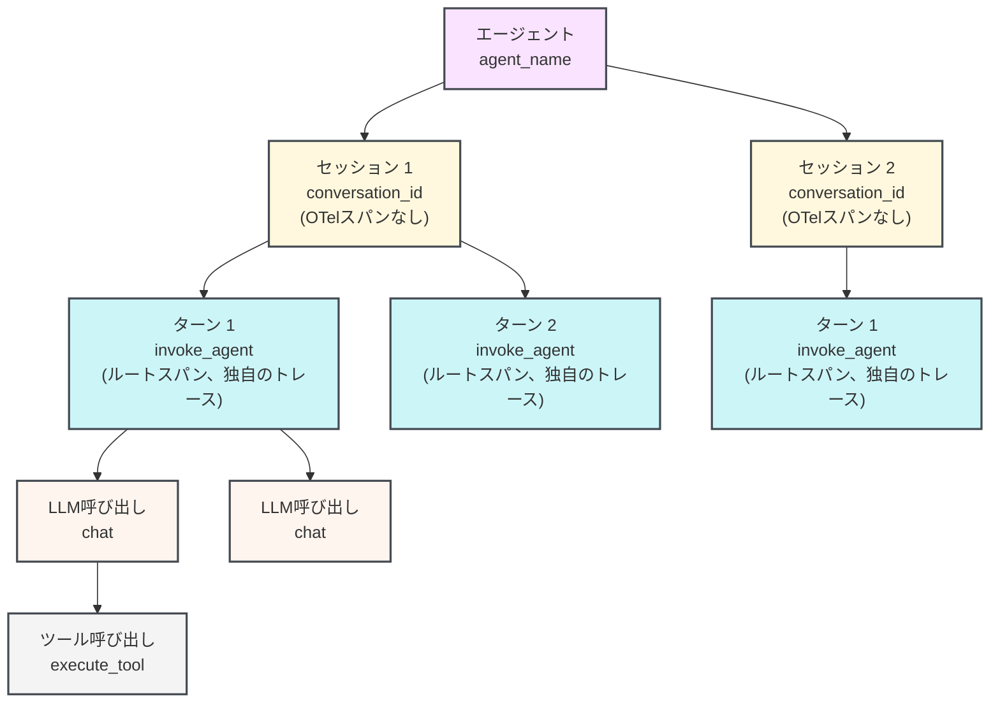

import AgentsPreview from '/snippets/ja/_includes/agents-public-preview.mdx';

<AgentsPreview />

W&amp;B Weave SDK を使用してマルチターンのエージェント型アプリケーションを計装し、エージェントの動作を確認、デバッグ、評価する方法を学びます。これは、エージェントを構築または統合しており、セッション、ターン、LLM calls、ツール実行を構造化された形で可視化したい開発者を対象としています。

Agents 向けの Weave SDK は、マルチターンのエージェント会話のライフサイクル全体をモデル化します。これには、多数のセッションを持つエージェント、ターンをグループ化するセッション、ユーザーとエージェントの各やり取り (ターン) 、ターン内の LLM calls、そして LLM によってトリガーされるツール実行が含まれます。トレースは Weave プロジェクトの **Agents** タブに表示されます。各セッションには、ネストされた tool calls、トークン使用量、feedback を含むマルチターンのタイムラインが表示されます。

個々の関数を `@weave.op` デコレーターで Ops としてトレースしている場合は、代わりに [LLM アプリケーションをトレースする](/ja/weave/guides/tracking/tracing) を参照してください。

<div id="before-you-begin">
  ## 始める前に
</div>

使い始めるには、`weave` パッケージをインストールして project を初期化します。これにより、Weave がチームと project を認識し、span が UI の正しい場所にルーティングされるようになります。

Weave をインストールして、project を初期化します。

<Tabs>
  <TabItem value="python" label="Python">
    ```bash lines
    pip install weave
    ```

    `[YOUR-TEAM]` は W&amp;B チーム名に、`[YOUR-PROJECT]` は W&amp;B のプロジェクト名に置き換えてください。

    ```python lines
    import weave

    weave.init("[YOUR-TEAM]/[YOUR-PROJECT]")
    ```

    `start_session()`、`start_turn()`、`start_llm()`、`start_tool()` を呼び出す前に、`weave.init()` を呼び出してください。トレースが無効になっている場合、または init 呼び出しがない場合、すべてのエージェント トレース関数は何もせずに終了します。そのため、インストルメンテーションは本番コードに残したまま、設定で制御できます。
  </TabItem>

  <TabItem value="typescript" label="TypeScript">
    ```bash lines
    npm install weave
    ```

    `[YOUR-TEAM]` は W&amp;B チーム名に、`[YOUR-PROJECT]` は W&amp;B のプロジェクト名に置き換えてください。

    ```typescript lines
    import * as weave from 'weave';

    await weave.init('[YOUR-TEAM]/[YOUR-PROJECT]');
    ```

    `startSession()`、`startTurn()`、`startLLM()`、`startTool()` を呼び出す前に、`weave.init()` を呼び出してください。トレースが無効になっている場合、または init 呼び出しがない場合、すべてのエージェント トレース関数は何もせずに終了します。そのため、インストルメンテーションは本番コードに残したまま、設定で制御できます。
  </TabItem>
</Tabs>

<div id="the-agent-data-model">
  ## エージェントのデータモデル
</div>

Weave では、エージェントの動作を 1 対多の関係からなる階層としてモデル化します。各エージェントは複数のセッションを持つことができ、各セッションは複数のターンを持つことができ、各ターンは複数の LLM Call を持つことができ、各 LLM Call は複数の tool call をトリガーできます。

| 概念        | Weave SDK クラス | OTel span タイプ                                       | 説明                                          |
| --------- | ------------- | --------------------------------------------------- | ------------------------------------------- |
| エージェント    | *(no class)*  | *(no span; grouped by `agent_name`)*                | Agents タブ内のエージェント型アプリケーション。1 つ以上のセッションを含みます |
| セッション     | `Session`     | *(no span; turns are grouped by `conversation_id`)* | 1 つ以上のターンを含む会話または run                       |
| ターン       | `Turn`        | `invoke_agent`                                      | 1 つのユーザーメッセージと、それに対するエージェントの完全な応答           |
| LLM Call  | `LLM`         | `chat`                                              | 言語モデル API への 1 回の Call                      |
| tool call | `Tool`        | `execute_tool`                                      | LLM の応答によってトリガーされる 1 回の tool call           |

次の図は、1 つのエージェントに複数のセッションが含まれ、1 つのセッションに複数のターンが含まれ、その後も同様に続くことを示しています。



セッションは、親 span ではなく、共有された `conversation_id` 属性によって turn をグループ化します。そのため、各 turn はそれぞれ独立した OTel トレースを開始します。この設計は、分散トレースと並列実行をサポートします。クライアントは、サーバー側での集約を行わずに、span を OTel collector に直接送信します。

<Tip>
  **サードパーティ製のエージェント SDK やハーネスを使用していますか？** SDK に手動でインストルメンテーションを追加する前に、まずは [Weave integrations](/ja/weave/guides/integrations) ページを参照してください。Weave は、サポートされるエージェント SDK (OpenAI Agents SDK など) やエージェントハーネス (Claude Code など) に自動でパッチを適用し、エージェント向けの組み込みオブザーバビリティを提供します。
</Tip>

<div id="agent-tracing-apis">
  ## エージェントのトレース API
</div>

Weave では、次のトップレベル関数を提供しています。各関数は、コンテキストマネージャーとして動作するオブジェクト (Python では `with`、TypeScript では `try/finally` を使用) を返すか、`.end()` を呼び出して手動で終了できます。

<div id="start-a-session">
  ### セッションを開始する
</div>

`start_session()` / `startSession()` は、すべての子 span に `conversation_id` 属性を設定し、Agents タブで turn がグループ化されるようにします。`session_id` を渡す場合は、会話全体を通じて変わらない安定した値である必要があります。同じ ID を再利用すると、既存のセッションに新しい turn を追加できます。`session_id` を省略すると、SDK が自動的に UUID を生成します。

アクティブなセッションはコンテキスト (Python の `ContextVar` または Node.js の `AsyncLocalStorage`) に保存されるため、同じ非同期コンテキスト内で実行されるコードであれば、セッションオブジェクトを明示的に渡さなくても `weave.get_current_session()` / `weave.getCurrentSession()` で取得できます。

<Tabs>
  <TabItem value="python" label="Python">
    ```python lines
    session = weave.start_session(
        agent_name="my-agent",    # 必須: UI でエージェントを識別します。
        session_id="",            # 任意: turn をグループ化するための安定した ID。空の場合は自動生成されます。
        model="",                 # 任意: このセッション内の turn に使用するデフォルトのモデル。
        session_name="",          # 任意: UI に表示される、わかりやすいラベル。
        include_content=True,     # 任意: span からメッセージ本文を除外するには False に設定します。
        continue_parent_trace=False,  # 任意: 新しい OTel trace を開始せず、既存の trace に関連付けます。
    )
    ```
  </TabItem>

  <TabItem value="typescript" label="TypeScript">
    ```typescript lines
    const session = weave.startSession({
      agentName: 'my-agent',  // 任意: UI でエージェントを識別します。
      sessionId: '',          // 任意: turn をグループ化するための安定した ID。空の場合は自動生成されます。
      model: '',              // 任意: このセッション内の turn に使用するデフォルトのモデル。
    });
    ```
  </TabItem>
</Tabs>

<div id="start-a-turn">
  ### ターンを開始する
</div>

`start_turn()` / `startTurn()` は、新しい OTel トレースのルートとなる `invoke_agent` span を新しく作成します。Weave は、この span を使用して、タイムラインビュー内で 1 回の完全なユーザーとエージェントのやり取りを表現します。

トップレベル関数として呼び出すと、コンテキストからアクティブなセッションを取得し、その会話 ID を継承します。アクティブなセッションがない場合、ターンは `conversation_id` なしで作成され、ほかのターンとグループ化されません。

<Tabs>
  <TabItem value="python" label="Python">
    ```python lines
    turn = weave.start_turn(
        user_message="What is the weather in Tokyo?",  # ユーザーの入力テキスト。
        agent_name="my-agent",   # 省略可能: セッション レベルのエージェント名を上書きします。
        model="gpt-4o",          # 省略可能: このターンで使用されるモデル。
    )
    ```
  </TabItem>

  <TabItem value="typescript" label="TypeScript">
    ```typescript lines
    const turn = weave.startTurn({
      agentName: 'my-agent',  // 省略可能: セッション レベルのエージェント名を上書きします。
      model: 'gpt-4o',        // 省略可能: このターンで使用されるモデル。
    });
    ```
  </TabItem>
</Tabs>

<div id="start-an-llm-call">
  ### LLM コールを開始する
</div>

`start_llm()` / `startLLM()` は、現在のターンの下にネストされた `chat` span を作成します。Weave はこの span を使用して、Agents ビューに token 使用量、モデル名、入力メッセージと出力メッセージ、および推論を表示します。

<Tabs>
  <TabItem value="python" label="Python">
    ```python lines
    llm = weave.start_llm(
        model="gpt-4o",             # モデル識別子。
        provider_name="openai",     # 必須: provider 名。例: "openai"、"anthropic"。
        system_instructions=["Be concise."],  # 任意: system prompt の文字列。
    )
    ```
  </TabItem>

  <TabItem value="typescript" label="TypeScript">
    ```typescript lines
    const llm = weave.startLLM({
      model: 'gpt-4o',          // モデル識別子。
      providerName: 'openai',   // 任意: provider 名。例: "openai"、"anthropic"。
    });
    ```
  </TabItem>
</Tabs>

LLM コールが完了したら、閉じる前にレスポンスデータを `llm` オブジェクトに割り当ててください。

<Tabs>
  <TabItem value="python" label="Python">
    ```python lines
    with weave.start_llm(model="gpt-4o", provider_name="openai") as llm:
        response = openai_client.chat.completions.create(...)
        llm.input_messages = [Message(role="user", content="...")]
        llm.output_messages = [Message(role="assistant", content=response.choices[0].message.content)]
        llm.usage = Usage(
            input_tokens=response.usage.prompt_tokens,
            output_tokens=response.usage.completion_tokens,
        )
    ```
  </TabItem>

  <TabItem value="typescript" label="TypeScript">
    ```typescript lines
    const llm = weave.startLLM({ model: 'gpt-4o', providerName: 'openai' });
    try {
      const response = await openaiClient.chat.completions.create({ ... });
      llm.inputMessages = [{ role: 'user', content: '...' }];
      llm.outputMessages = [{ role: 'assistant', content: response.choices[0].message.content ?? '' }];
      llm.usage = {
        inputTokens: response.usage?.prompt_tokens,
        outputTokens: response.usage?.completion_tokens,
      };
    } finally {
      llm.end();
    }
    ```
  </TabItem>
</Tabs>

`provider_name` / `providerName` は明示的に渡してください。Weave はモデル文字列からこれを推測しません。

<div id="start-a-tool-call">
  ### ツール呼び出しを開始する
</div>

`start_tool()` / `startTool()` は `execute_tool` span を作成します。この span は、コンテキスト内でアクティブな OTel span の子になります (通常は、ツール呼び出しを生成した LLM 呼び出しの `chat` span です) 。

<Tabs>
  <TabItem value="python" label="Python">
    ```python lines
    tool = weave.start_tool(
        name="get_weather",                  # LLM に宣言したツール名。
        arguments='{"city": "Tokyo"}',       # ツール引数の JSON 文字列。
        tool_call_id="call_abc123",          # 省略可能: LLM レスポンスのツール呼び出し ID。
    )
    ```
  </TabItem>

  <TabItem value="typescript" label="TypeScript">
    ```typescript lines
    const tool = weave.startTool({
      name: 'get_weather',            // LLM に宣言したツール名。
      args: '{"city": "Tokyo"}',      // 省略可能: ツール引数の JSON 文字列。
      toolCallId: 'call_abc123',      // 省略可能: LLM レスポンスのツール呼び出し ID。
    });
    ```
  </TabItem>
</Tabs>

閉じる前にツールの結果を設定します。

<Tabs>
  <TabItem value="python" label="Python">
    ```python lines
    with weave.start_tool(name="get_weather", arguments='{"city": "Tokyo"}') as tool:
        result = get_weather_api("Tokyo")
        tool.result = result  # dict、list、または string を受け入れます。自動的に JSON エンコードされます。
    ```
  </TabItem>

  <TabItem value="typescript" label="TypeScript">
    ```typescript lines
    const tool = weave.startTool({ name: 'get_weather', args: '{"city": "Tokyo"}' });
    try {
      tool.result = await getWeatherApi('Tokyo');
    } finally {
      tool.end();
    }
    ```
  </TabItem>
</Tabs>

<div id="usage-patterns-for-agent-tracing">
  ## エージェント トレースの使用パターン
</div>

以下のセクションでは、エージェント コードの構造に応じて、これらの関数をどのように組み合わせるかを説明します。

以下の例では、Weave SDK の 2 つのタイプを使用します。

* `Message` は、会話内の 1 つのエントリ (ユーザー入力、アシスタントの応答、system prompt、または tool の結果) を表します。モデルが受け取った内容と生成した内容を記録するには、`llm.input_messages` / `llm.inputMessages` に割り当てます。
* `Usage` は、LLM の応答から token 数を取得し、`llm.usage` に割り当てられます。

Weave はこの両方を使用して、各 LLM call の入力、出力、token 使用量を Agents view に表示します。サポートされるすべてのデータ タイプについては、API リファレンスを参照してください。

<div id="context-manager-try-finally-pattern">
  ### コンテキストマネージャー / try-finally パターン
</div>

ほとんどのエージェントで推奨されるのは、Python ではコンテキストマネージャーパターン、TypeScript では try-finally パターンを使用する方法です。span は、例外が発生した場合でも、ブロックの最後でクローズされて送信されます。

Weave はアクティブな session、turn、LLM call をコンテキストに保持するため、ブロック内で呼び出される任意の関数は、親への明示的な参照を持たなくても `start_llm()` / `startLLM()` または `start_tool()` / `startTool()` を呼び出せます。これは、コードが同じ async コンテキスト内で実行されている限り、モジュール境界をまたいでも機能します。コールスタック内のどこからでも現在アクティブなオブジェクトを取得するには、`weave.get_current_session()` / `weave.getCurrentSession()`、`weave.get_current_turn()` / `weave.getCurrentTurn()`、および `weave.get_current_llm()` / `weave.getCurrentLLM()` を使用します。

<Tabs>
  <TabItem value="python" label="Python">
    ```python lines highlight="13,14,17,25,29"
    import weave
    from weave.session.session import Message, Usage

    # プレースホルダー関数: 実際の実装に置き換えてください。
    def call_openai(*args, **kwargs):
        pass  # 実際の LLM クライアント呼び出しに置き換えてください。

    def get_weather_api(city: str) -> str:
        return "24°C, sunny"  # 実際の天気 API 呼び出しに置き換えてください。

    weave.init("[YOUR-TEAM]/[YOUR-PROJECT]")

    with weave.start_session(agent_name="weather-bot") as session:
        with session.start_turn(user_message="What is the weather in Tokyo?") as turn:

            # 1 回目の LLM 呼び出し: ツール呼び出しを返します。
            with weave.start_llm(model="gpt-4o", provider_name="openai") as llm:
                response = call_openai(...)
                llm.input_messages = [Message(role="user", content="What is the weather?")]
                llm.think("User wants weather data, I should call get_weather.")
                llm.output("Let me check the weather for you.")
                llm.usage = Usage(input_tokens=100, output_tokens=20)

                # ツール呼び出し: これをリクエストした LLM 呼び出しの子です。
                with weave.start_tool(name="get_weather", arguments='{"city":"Tokyo"}') as tool:
                    tool.result = get_weather_api("Tokyo")  # "24°C, sunny" を返します。

            # 2 回目の LLM 呼び出し: 最終的な回答を生成します。
            with weave.start_llm(model="gpt-4o", provider_name="openai") as llm:
                llm.input_messages = [Message(role="user", content="What is the weather?")]
                llm.output("It is 24°C and sunny in Tokyo today.")
                llm.usage = Usage(input_tokens=150, output_tokens=30)
    ```
  </TabItem>

  <TabItem value="typescript" label="TypeScript">
    ```typescript lines highlight="11,13,16,24,35"
    import * as weave from 'weave';
    import type { Message, Usage } from 'weave';

    // プレースホルダー関数: 実際の実装に置き換えてください。
    async function getWeatherApi(city: string): Promise<string> {
      return '24°C, sunny';  // 実際の天気 API 呼び出しに置き換えてください。
    }

    await weave.init('[YOUR-TEAM]/[YOUR-PROJECT]');

    const session = weave.startSession({ agentName: 'weather-bot' });
    try {
      const turn = session.startTurn({ agentName: 'weather-bot' });
      try {
        // 1 回目の LLM 呼び出し: ツール呼び出しを返します。
        const llm = weave.startLLM({ model: 'gpt-4o', providerName: 'openai' });
        try {
          llm.inputMessages = [{ role: 'user', content: 'What is the weather?' }];
          llm.think('User wants weather data, I should call get_weather.');
          llm.output('Let me check the weather for you.');
          llm.usage = { inputTokens: 100, outputTokens: 20 };

          // ツール呼び出し: これをリクエストした LLM 呼び出しの子です。
          const tool = weave.startTool({ name: 'get_weather', args: '{"city":"Tokyo"}' });
          try {
            tool.result = await getWeatherApi('Tokyo');  // "24°C, sunny" を返します。
          } finally {
            tool.end();
          }
        } finally {
          llm.end();
        }

        // 2 回目の LLM 呼び出し: 最終的な回答を生成します。
        const llm2 = weave.startLLM({ model: 'gpt-4o', providerName: 'openai' });
        try {
          llm2.inputMessages = [{ role: 'user', content: 'What is the weather?' }];
          llm2.output('It is 24°C and sunny in Tokyo today.');
          llm2.usage = { inputTokens: 150, outputTokens: 30 };
        } finally {
          llm2.end();
        }
      } finally {
        turn.end();
      }
    } finally {
      session.end();
    }
    ```
  </TabItem>
</Tabs>

<div id="manual-start-and-end-pattern">
  ### 手動で開始・終了するパターン
</div>

`with` ブロックや `try/finally` を使用できない場合は、`.end()` を明示的に使用します。たとえば、span の開始と終了が別々の関数呼び出しにまたがる場合や、コルーチンの外で非同期ライフサイクルを管理する場合です。

<Tabs>
  <TabItem value="python" label="Python">
    ```python lines highlight="1,2,4,9,15"
    session = weave.start_session(agent_name="weather-bot")
    turn = session.start_turn(user_message="What is the weather?")

    llm = weave.start_llm(model="gpt-4o", provider_name="openai")
    llm.input_messages = [Message(role="user", content="What is the weather?")]
    llm.output("Let me check.")
    llm.usage = Usage(input_tokens=100, output_tokens=20)

    tool = weave.start_tool(name="get_weather", arguments='{"city": "Tokyo"}')
    tool.result = "24°C, sunny"
    tool.end()   # end() は冪等です。複数回呼び出しても安全です。

    llm.end()

    llm2 = weave.start_llm(model="gpt-4o", provider_name="openai")
    llm2.output("It is 24°C and sunny in Tokyo.")
    llm2.usage = Usage(input_tokens=150, output_tokens=30)
    llm2.end()

    turn.end()
    session.end()
    ```
  </TabItem>

  <TabItem value="typescript" label="TypeScript">
    ```typescript lines highlight="1,2,4,9,15"
    const session = weave.startSession({ agentName: 'weather-bot' });
    const turn = session.startTurn({ agentName: 'weather-bot' });

    const llm = weave.startLLM({ model: 'gpt-4o', providerName: 'openai' });
    llm.inputMessages = [{ role: 'user', content: 'What is the weather?' }];
    llm.output('Let me check.');
    llm.usage = { inputTokens: 100, outputTokens: 20 };

    const tool = weave.startTool({ name: 'get_weather', args: '{"city": "Tokyo"}' });
    tool.result = '24°C, sunny';
    tool.end();  // end() は冪等です。複数回呼び出しても安全です。

    llm.end();

    const llm2 = weave.startLLM({ model: 'gpt-4o', providerName: 'openai' });
    llm2.output('It is 24°C and sunny in Tokyo.');
    llm2.usage = { inputTokens: 150, outputTokens: 30 };
    llm2.end();

    turn.end();
    session.end();
    ```
  </TabItem>
</Tabs>

<div id="semantic-conventions">
  ## セマンティック規約
</div>

Weave SDK は、[GenAI semantic conventions](https://opentelemetry.io/docs/specs/semconv/gen-ai/gen-ai-spans/) および [GenAI agent span conventions](https://opentelemetry.io/docs/specs/semconv/gen-ai/gen-ai-agent-spans/) に準拠する OTel span を出力します。あらゆる OTel span を受け付けます。Weave はすべての属性を保存し、クエリできるようにします。標準の OTel span API を Weave のトレース オブジェクトと併用して、span に任意の属性を追加できます。

<div id="how-spans-appear-in-the-weave-ui">
  ## Weave UI で span がどのように表示されるか
</div>

インストルメントされたコードを実行すると、トレースは Weave プロジェクトの **Agents** タブ (`https://wandb.ai/[YOUR-TEAM]/[YOUR-PROJECT]/weave/agents`) に表示されます。

* **Sessions list** には、ターンのアクティビティを示すミニマップとともに、すべてのセッションが表示されます。
* セッションをクリックすると、各ターン、LLM calls、tool の実行、token 数、関連付けられたフィードバックを表示する **multi-turn session view** が開きます。
* 各 `chat` span には、入力メッセージ、出力メッセージ、モデル名、使用量が表示されます。
* 各 `execute_tool` span には、tool 名、引数、結果が表示されます。

Weave で Agents データを表示する方法の詳細については、[エージェントのアクティビティを表示する](/ja/weave/guides/tracking/view-agent-activity)をご覧ください。