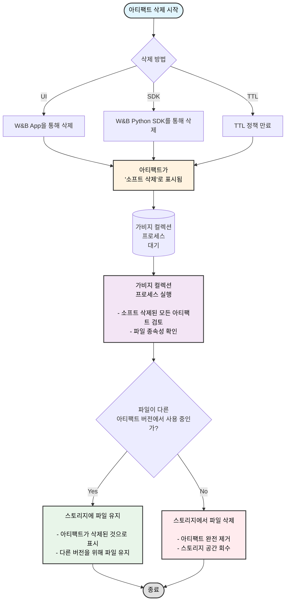

W&amp;B App에서 대화형으로 아티팩트를 삭제하거나 W&amp;B Python SDK를 사용해 프로그래밍 방식으로 아티팩트를 삭제할 수 있습니다. 아티팩트를 삭제하면, W&amp;B는 해당 아티팩트를 *소프트 삭제* 상태로 표시합니다. 즉, 아티팩트가 삭제 대상으로 표시되지만 파일은 스토리지에서 즉시 삭제되지 않습니다.

정기적으로 실행되는 가비지 컬렉션 프로세스가 삭제 대상으로 표시된 모든 아티팩트를 검사할 때까지, 아티팩트의 내용은 소프트 삭제, 즉 삭제 대기 상태로 유지됩니다. 가비지 컬렉션 프로세스는 해당 아티팩트와 연결된 파일이 이전 또는 이후 아티팩트 버전에서 사용되지 않는 경우, 스토리지에서 관련 파일을 삭제합니다.

<div id="artifact-garbage-collection-workflow">
  ## 아티팩트 가비지 컬렉션 워크플로우
</div>

다음 다이어그램은 아티팩트 가비지 컬렉션 전체 프로세스를 보여줍니다:



TTL 정책을 사용하여 W&amp;B에서 아티팩트의 삭제 시점을 스케줄링할 수 있습니다. 자세한 내용은 [Artifact TTL 정책으로 데이터 보존 관리](./ttl)를 참고하세요.

<Note>
  TTL 정책, W&amp;B Python SDK, 또는 W&amp;B App에 의해 삭제된 Artifacts는 먼저 소프트 삭제됩니다. 소프트 삭제된 아티팩트는 영구적으로 삭제되기 전에 가비지 컬렉션을 거칩니다.
</Note>

<Note>
  엔티티, 프로젝트, 또는 아티팩트 컬렉션을 삭제하면 이 페이지에 설명된 아티팩트 삭제 프로세스가 시작됩니다. run을 삭제할 때 연관된 아티팩트를 함께 삭제하도록 선택하면, 해당 아티팩트는 동일한 소프트 삭제와 가비지 컬렉션 워크플로를 따릅니다.
</Note>

<div id="delete-an-artifact-version">
  ## 아티팩트 버전 삭제
</div>

W&amp;B App에서 인터랙티브하게 아티팩트 버전을 삭제하거나, W&amp;B Python SDK를 사용해 프로그래밍 방식으로 삭제할 수 있습니다.

<Tabs>
  <Tab title="W&B App" value="ui">
    아티팩트 버전을 삭제하려면:

    1. 삭제하려는 아티팩트 버전이 포함된 프로젝트로 이동합니다.
    2. **Artifacts** 탭을 선택합니다.
    3. 아티팩트 유형 목록에서, 삭제하려는 버전이 포함된 아티팩트 유형을 선택합니다.
    4. 삭제하려는 아티팩트 버전 옆의 가로 점 세 개 아이콘(`...`)을 클릭합니다.
    5. 드롭다운 메뉴에서 **Delete Version**을 선택합니다.
  </Tab>

  <Tab title="W&B Python SDK" value="sdk">
    [wandb.Artifact.delete()](/ko/models/ref/python/experiments/artifact#delete) 메서드를 사용해 프로그래밍 방식으로 아티팩트 버전을 삭제할 수 있습니다. 아티팩트의 전체 이름을 지정해야 합니다. 전체 이름은 `<entity>/<project>/<artifact_name>:<version>` 형식입니다. 하나 이상의 별칭이 연결된 아티팩트라도 삭제하려면 `delete_aliases` 파라미터를 `True`로 설정합니다.

    ```python
    import wandb

    api = wandb.Api()

    # 경로를 사용해 아티팩트를 가져옵니다.
    artifact = api.artifact("<entity>/<project>/<artifact_name>:<version>")

    # 연결된 모든 별칭과 함께 아티팩트 버전을 삭제합니다.
    artifact.delete(delete_aliases=True)
    ```
  </Tab>
</Tabs>

<div id="delete-multiple-artifact-versions">
  ## 여러 아티팩트 버전 삭제
</div>

다음 코드 예시는 여러 아티팩트 버전을 삭제하는 방법을 보여줍니다. `wandb.Api.run()`에 아티팩트를 생성한 entity, 프로젝트 이름, run ID를 인수로 전달합니다. 그러면 해당 run에서 생성된 모든 아티팩트 버전에 접근할 수 있는 run 객체가 반환됩니다. 그런 다음 아티팩트 버전들을 순회하면서 기준에 맞는 것들을 삭제합니다.

<Tip>
  하나의 아티팩트 버전과 그에 연결된 모든 별칭(alias)을 함께 삭제하려면 `delete_aliases` 파라미터를 `True`로 설정하십시오 (`wandb.Artifact.delete(delete_aliases=True)`).
</Tip>

`<entity>`, `<project>`, `<run_id>`, 그리고 `<artifact_name>` 플레이스홀더를 자신의 값으로 교체하십시오:

```python
import wandb

# W&B API 초기화
api = wandb.Api()

# 경로로 run을 가져옵니다. <entity>/<project>/<run_id>로 구성됩니다
run = api.run("<entity>/<project>/<run_id>")

# 버전을 삭제할 아티팩트 이름 지정
artifact_name = "<artifact_name>"

# 지정된 이름의 아티팩트 버전을 검색하고 삭제
for artifact in run.logged_artifacts():
    print(f"Found artifact: {artifact.name}") # 예시 이름: run_4dfbufgq_model:v0
    # split()을 사용하여 버전을 제외한 아티팩트 이름만 추출
    if artifact.name.split(":")[0] == artifact_name:
        print(f"Deleting artifact version: {artifact.name}")
        artifact.delete(delete_aliases=True)
```

<div id="delete-multiple-artifact-versions-with-a-specific-alias">
  ## 특정 별칭이 지정된 여러 아티팩트 버전 삭제
</div>

다음 코드는 특정 별칭이 지정된 여러 아티팩트 버전을 삭제하는 방법을 보여줍니다.

`<entity>`, `<project>`, `<run_id>`, `<artifact_name>`, `<alias>` 플레이스홀더를 자신의 값으로 바꾸세요:

```python
import wandb

# W&B API 초기화
api = wandb.Api()

# 경로로 run을 가져옵니다. <entity>/<project>/<run_id>로 구성됩니다
run = api.run("<entity>/<project>/<run_id>")

# 버전을 삭제할 아티팩트 이름 지정
artifact_name = "<artifact_name>"

# 삭제할 아티팩트 버전을 필터링할 alias 지정
desired_alias = "<alias>"

# alias가 'v3' 및 'v4'인 run에 기록된 아티팩트 삭제
for artifact in run.logged_artifacts():
    print(f"Found artifact: {artifact.name}")
    if (artifact.name.split(":")[0] == artifact_name) and (desired_alias in artifact.aliases):
            artifact.delete(delete_aliases=True)
```

<div id="delete-an-artifact-collection">
  ## 아티팩트 컬렉션 삭제
</div>

<Tabs>
  <Tab title="W&B 앱" value="ui">
    아티팩트 컬렉션을 삭제하려면:

    1. 삭제하려는 아티팩트 컬렉션으로 이동합니다.
    2. 아티팩트 컬렉션 이름 옆의 가로 점 세 개(`...`)를 선택합니다.
    3. 드롭다운 메뉴에서 **Delete**를 선택합니다.
  </Tab>

  <Tab title="W&B Python SDK" value="sdk">
    [wandb.Artifact.delete()](/ko/models/ref/python/experiments/artifact#delete) 메서드를 사용하여 프로그래밍 방식으로 아티팩트 컬렉션을 삭제합니다.

    `wandb.Api.artifact_collection(name="")`에 아티팩트 컬렉션의 전체 경로를 제공합니다. 전체 경로는 `<entity>/<project>/<artifact_collection_name>`으로 구성됩니다.

    ```python
    import wandb

    # W&B API 초기화
    api = wandb.Api()

    # 경로로 아티팩트 컬렉션을 가져옵니다.
    # <entity>/<project>/<artifact_collection_name>
    collection = api.artifact_collection(
        type_name = "<artifact_type>",
        name = "<entity>/<project>/<artifact_collection_name>"
    )
    collection.delete()
    ```
  </Tab>
</Tabs>

<div id="protected-aliases-and-deletion-permissions">
  ## 보호된 별칭과 삭제 권한
</div>

보호된 별칭이 있는 Artifacts에는 특별한 삭제 제한이 적용됩니다. [보호된 별칭](/ko/models/registry/aliases#protected-aliases)은 W&amp;B Registry에서 레지스트리 관리자가 무단 삭제를 방지하기 위해 설정할 수 있는 별칭입니다.

<Note>
  **보호된 별칭에 대한 중요한 고려 사항:**

  * 보호된 별칭이 있는 Artifacts는 레지스트리 관리자가 아닌 사람은 삭제할 수 없습니다.
  * 레지스트리 내에서 레지스트리 관리자는 보호된 아티팩트 버전의 링크를 해제하고, 보호된 별칭을 포함하는 컬렉션/레지스트리를 삭제할 수 있습니다.
  * 소스 아티팩트의 경우: 소스 아티팩트가 보호된 별칭이 있는 레지스트리에 연결되어 있으면 어느 사용자도 이를 삭제할 수 없습니다.
  * 레지스트리 관리자는 소스 아티팩트에서 보호된 별칭을 제거한 후 해당 아티팩트를 삭제할 수 있습니다.
</Note>

<div id="enable-garbage-collection-based-on-how-wb-is-hosted">
  ## W&amp;B 호스팅 방식에 따라 가비지 컬렉션 활성화
</div>

W&amp;B의 공유 클라우드를 사용하는 경우 가비지 컬렉션은 기본적으로 활성화되어 있습니다. W&amp;B를 호스팅하는 방식에 따라 가비지 컬렉션을 활성화하려면 추가 단계가 필요할 수 있으며, 여기에는 다음이 포함됩니다:

* `GORILLA_ARTIFACT_GC_ENABLED` 환경 변수를 true로 설정합니다: `GORILLA_ARTIFACT_GC_ENABLED=true`
* [AWS](https://docs.aws.amazon.com/AmazonS3/latest/userguide/manage-versioning-examples.html), [Google Cloud](https://cloud.google.com/storage/docs/object-versioning) 또는 [Minio](https://min.io/docs/minio/linux/administration/object-management/object-versioning.html#enable-bucket-versioning)와 같은 기타 스토리지 제공자를 사용하는 경우 버킷 버전 관리를 활성화합니다. Azure를 사용하는 경우 [소프트 삭제를 활성화](https://learn.microsoft.com/azure/storage/blobs/soft-delete-blob-overview)합니다.
  <Note>
    Azure의 소프트 삭제는 다른 스토리지 제공자의 버킷 버전 관리와 동일합니다.
  </Note>

다음 표는 배포 유형별로 가비지 컬렉션을 활성화하기 위해 충족해야 하는 요구 사항을 보여줍니다.

`X`는 해당 요구 사항을 반드시 충족해야 함을 나타냅니다:

|                                                | Environment variable    | Enable versioning |
| -----------------------------------------------| ------------------------| ----------------- |
| Shared cloud                                   |                         |                   |
| Shared cloud with [secure storage connector](/ko/platform/hosting/data-security/secure-storage-connector)|                         | X                 |
| Dedicated Cloud                                |                         |                   |
| Dedicated Cloud with [secure storage connector](/ko/platform/hosting/data-security/secure-storage-connector)|                         | X                 |
| Self-Managed cloud                             | X                       | X                 |
| Self-Managed on-prem                           | X                       | X                 |

<Note>
  참고
  Secure storage connector는 현재 Google Cloud Platform 및 Amazon Web Services에서만 사용할 수 있습니다.
</Note>