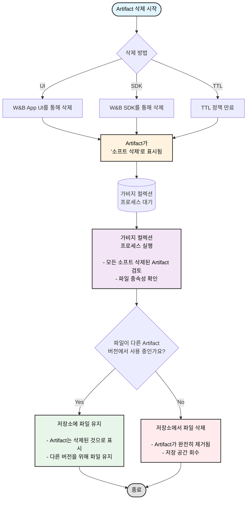

App UI를 사용하여 대화식으로 Artifacts를 삭제하거나 W&B SDK를 사용하여 프로그래밍 방식으로 삭제할 수 있습니다. Artifact를 삭제하면 W&B는 해당 Artifact를 *soft-delete* (소프트 삭제)로 표시합니다. 즉, Artifact가 삭제 대상으로 표시되지만 저장소에서 파일이 즉시 삭제되지는 않습니다.

정기적으로 실행되는 가비지 컬렉션 (garbage collection) 프로세스가 삭제 대상으로 표시된 모든 Artifacts를 검토할 때까지 Artifact의 내용은 소프트 삭제 또는 삭제 대기 상태로 유지됩니다. 가비지 컬렉션 프로세스는 해당 Artifact 및 관련 파일이 이전 또는 이후의 Artifact 버전에서 사용되지 않는 경우에만 저장소에서 관련 파일을 삭제합니다.

## Artifact 가비지 컬렉션 워크플로우

다음 다이어그램은 전체 Artifact 가비지 컬렉션 프로세스를 보여줍니다:



이 페이지의 섹션에서는 특정 Artifact 버전을 삭제하는 방법, Artifact 컬렉션을 삭제하는 방법, 에일리어스가 있거나 없는 Artifacts를 삭제하는 방법 등을 설명합니다. TTL 정책을 사용하여 W&B에서 Artifacts가 삭제되는 시점을 예약할 수 있습니다. 자세한 내용은 [Artifact TTL 정책으로 데이터 보존 관리](./ttl)를 참조하세요.

<Note>
TTL 정책으로 삭제 예약된 Artifacts, W&B SDK로 삭제된 Artifacts, 또는 W&B App UI로 삭제된 Artifacts는 먼저 소프트 삭제됩니다. 소프트 삭제된 Artifacts는 하드 삭제되기 전에 가비지 컬렉션을 거칩니다.
</Note>

<Note>
Entity, Project 또는 Artifact 컬렉션을 삭제하면 이 페이지에 설명된 Artifact 삭제 프로세스도 트리거됩니다. Run을 삭제할 때 관련 Artifacts를 삭제하도록 선택하면, 해당 Artifacts도 동일한 소프트 삭제 및 가비지 컬렉션 워크플로우를 따릅니다.
</Note>

### Artifact 버전 삭제하기

Artifact 버전을 삭제하려면 다음 단계를 따르세요:

1. Artifact의 이름을 선택합니다. 그러면 Artifact 뷰가 확장되고 해당 Artifact와 관련된 모든 Artifact 버전이 나열됩니다.
2. Artifact 목록에서 삭제하려는 Artifact 버전을 선택합니다.
3. Workspace 우측 상단에 있는 케밥 메뉴(점 세 개) 드롭다운을 선택합니다.
4. Delete를 선택합니다.

Artifact 버전은 [delete()](/models/ref/python/experiments/artifact#delete) 메소드를 통해 프로그래밍 방식으로 삭제할 수도 있습니다. 아래 예시를 참조하세요. 

### 에일리어스가 있는 여러 Artifact 버전 삭제하기

다음 코드 예시는 에일리어스가 연결된 Artifacts를 삭제하는 방법을 보여줍니다. Artifacts를 생성한 Entity, Project 이름 및 run ID를 입력합니다.

```python
import wandb

run = api.run("entity/project/run_id")

for artifact in run.logged_artifacts():
    artifact.delete()
```

Artifact에 하나 이상의 에일리어스가 있는 경우, 에일리어스도 함께 삭제하려면 `delete_aliases` 파라미터를 불리언 값인 `True`로 설정하세요.

```python
import wandb

run = api.run("entity/project/run_id")

for artifact in run.logged_artifacts():
    # 하나 이상의 에일리어스가 있는 artifact를 삭제하려면
    # delete_aliases=True로 설정합니다.
    artifact.delete(delete_aliases=True)
```

### 특정 에일리어스를 가진 여러 Artifact 버전 삭제하기

다음 코드는 특정 에일리어스를 가진 여러 Artifact 버전을 삭제하는 방법을 보여줍니다. Artifacts를 생성한 Entity, Project 이름 및 run ID를 입력합니다. 삭제 로직을 상황에 맞게 수정하여 사용하세요:

```python
import wandb

runs = api.run("entity/project_name/run_id")

# 에일리어스가 'v3' 및 'v4'인 artifact 삭제
for artifact_version in runs.logged_artifacts():
    # 원하는 삭제 로직으로 교체하세요.
    if artifact_version.name[-2:] == "v3" or artifact_version.name[-2:] == "v4":
        artifact.delete(delete_aliases=True)
```

### 보호된 에일리어스 및 삭제 권한

보호된 에일리어스(protected aliases)가 있는 Artifacts에는 특별한 삭제 제한이 적용됩니다. [보호된 에일리어스](/models/registry/aliases#protected-aliases)는 Registry 관리자가 무단 삭제를 방지하기 위해 설정할 수 있는 W&B Registry의 에일리어스입니다.

<Note>
**보호된 에일리어스에 대한 중요 고려 사항:**
- 보호된 에일리어스가 있는 Artifacts는 Registry 관리자가 아닌 사용자는 삭제할 수 없습니다.
- Registry 내에서 Registry 관리자는 보호된 Artifact 버전의 링크를 해제하거나 보호된 에일리어스를 포함하는 컬렉션/Registry를 삭제할 수 있습니다.
- 소스 Artifact의 경우: 소스 Artifact가 보호된 에일리어스로 Registry에 연결되어 있으면 어떤 사용자도 삭제할 수 없습니다.
- Registry 관리자는 소스 Artifact에서 보호된 에일리어스를 제거한 후 삭제할 수 있습니다.
</Note>

### 에일리어스가 없는 Artifact의 모든 버전 삭제하기

다음 코드 조각은 에일리어스가 없는 Artifact의 모든 버전을 삭제하는 방법을 보여줍니다. `wandb.Api`의 `project` 및 `entity` 키에 각각 프로젝트 이름과 엔티티 이름을 입력하세요. `<>` 부분을 Artifact 이름으로 바꾸세요:

```python
import wandb

# wandb.Api 메소드를 사용할 때
# 사용자의 entity와 프로젝트 이름을 제공하세요.
api = wandb.Api(overrides={"project": "project", "entity": "entity"})

artifact_type, artifact_name = "<>"  # 유형(type)과 이름(name) 입력
for v in api.artifact_versions(artifact_type, artifact_name):
    # 'latest'와 같은 에일리어스가 없는 버전들을 정리합니다.
    # 참고: 여기에 원하는 삭제 로직을 넣을 수 있습니다.
    if len(v.aliases) == 0:
        v.delete()
```

### Artifact 컬렉션 삭제하기

Artifact 컬렉션을 삭제하려면 다음 단계를 따르세요:

1. 삭제하려는 Artifact 컬렉션으로 이동하여 마우스를 올립니다.
2. Artifact 컬렉션 이름 옆의 케밥 메뉴 드롭다운을 선택합니다.
3. Delete를 선택합니다.

[delete()](/models/ref/python/experiments/artifact#delete) 메소드를 사용하여 프로그래밍 방식으로 Artifact 컬렉션을 삭제할 수도 있습니다. `wandb.Api`의 `project` 및 `entity` 키에 각각 프로젝트 이름과 엔티티 이름을 입력하세요:

```python
import wandb

# wandb.Api 메소드를 사용할 때
# 사용자의 entity와 프로젝트 이름을 제공하세요.
api = wandb.Api(overrides={"project": "project", "entity": "entity"})
collection = api.artifact_collection(
    "<artifact_type>", "entity/project/artifact_collection_name"
)
collection.delete()
```

## W&B 호스팅 방식에 따른 가비지 컬렉션 활성화 방법
W&B의 공유 클라우드를 사용하는 경우 가비지 컬렉션은 기본적으로 활성화되어 있습니다. W&B를 호스팅하는 방식에 따라 가비지 컬렉션을 활성화하기 위해 추가 단계가 필요할 수 있으며, 여기에는 다음이 포함됩니다:


* `GORILLA_ARTIFACT_GC_ENABLED` 환경 변수를 true로 설정: `GORILLA_ARTIFACT_GC_ENABLED=true`
* [AWS](https://docs.aws.amazon.com/AmazonS3/latest/userguide/manage-versioning-examples.html), [Google Cloud](https://cloud.google.com/storage/docs/object-versioning) 또는 [Minio](https://min.io/docs/minio/linux/administration/object-management/object-versioning.html#enable-bucket-versioning)와 같은 기타 저장소 제공업체를 사용하는 경우 버킷 버전 관리를 활성화합니다. Azure를 사용하는 경우 [소프트 삭제를 활성화](https://learn.microsoft.com/azure/storage/blobs/soft-delete-blob-overview)합니다.
    <Note>
    Azure의 소프트 삭제는 다른 저장소 제공업체의 버킷 버전 관리와 동일한 역할을 합니다.
    </Note>

다음 표는 배포 유형에 따라 가비지 컬렉션을 활성화하기 위한 요구 사항을 설명합니다.

`X` 표시가 된 항목은 반드시 충족해야 하는 요구 사항입니다:

|                                                | 환경 변수 설정    | 버전 관리 활성화 | 
| -----------------------------------------------| ------------------------| ----------------- | 
| 공유 클라우드 (Shared cloud)                                   |                         |                   | 
| [보안 저장소 커넥터](/platform/hosting/data-security/secure-storage-connector)를 사용하는 공유 클라우드|                         | X                 | 
| 전용 클라우드 (Dedicated Cloud)                                |                         |                   | 
| [보안 저장소 커넥터](/platform/hosting/data-security/secure-storage-connector)를 사용하는 전용 클라우드|                         | X                 | 
| 셀프 매니지드 클라우드 (Self-Managed cloud)                             | X                       | X                 | 
| 셀프 매니지드 온프레미스 (Self-Managed on-prem)                           | X                       | X                 |
 


<Note>
안내
보안 저장소 커넥터는 현재 Google Cloud Platform 및 Amazon Web Services에서만 사용할 수 있습니다.
</Note>