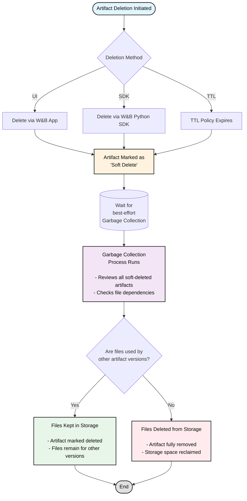

W&amp;B App에서 대화형으로 또는 W&amp;B Python SDK를 사용해 프로그래밍 방식으로 artifact를 삭제할 수 있습니다. artifact를 삭제하면 W&amp;B는 해당 artifact를 *soft-delete* 상태로 표시합니다. 즉, artifact는 삭제 대상으로 표시되지만 파일은 저장소에서 즉시 삭제되지 않습니다.

정기적으로 실행되는 가비지 컬렉션 프로세스가 삭제 대상으로 표시된 모든 artifact를 검토할 때까지, artifact의 내용은 soft-delete 상태, 즉 삭제 대기 상태로 유지됩니다. 가비지 컬렉션 프로세스는 해당 artifact 및 관련 파일이 이전 또는 이후 artifact 버전에서 사용되지 않는 경우, 관련 파일을 저장소에서 삭제합니다.

<Note>
  가비지 컬렉션은 **best-effort** 방식으로 수행됩니다. artifact를 삭제한 후 확보된 공간이 객체 저장소에 얼마나 빨리 반영되는지는 W&amp;B에서 보장하지 않습니다. 대규모 deployment 또는 적체가 있는 경우 예상보다 더 오래 걸릴 수 있습니다. 이 내용이 run 데이터, 보존 설정, 선택적 운영자 액션과 어떻게 연관되는지 알아보려면 [버킷 저장소 및 비용 관리](/ko/platform/hosting/managing-bucket-storage)를 참조하세요.
</Note>

<div id="artifact-garbage-collection-workflow">
  ## Artifact 가비지 컬렉션 워크플로
</div>

다음 다이어그램은 artifact 가비지 컬렉션의 전체 과정을 보여줍니다:


```mermaid
graph TB
    Start([Artifact Deletion Initiated]) --> DeleteMethod{Deletion Method}
    
    DeleteMethod -->|UI| UIDelete[Delete via W&B App]
    DeleteMethod -->|SDK| SDKDelete[Delete via W&B Python SDK]
    DeleteMethod -->|TTL| TTLDelete[TTL Policy Expires]
    
    UIDelete --> SoftDelete[Artifact Marked as<br/>'Soft Delete']
    SDKDelete --> SoftDelete
    TTLDelete --> SoftDelete
    
    SoftDelete --> GCWait[(Wait for<br/>best-effort<br/>Garbage Collection)]
    
    GCWait --> GCRun[Garbage Collection<br/>Process Runs<br/><br/>- Reviews all soft-deleted artifacts<br/>- Checks file dependencies]
    
    GCRun --> CheckUsage{Are files used by<br/>other artifact versions?}
    
    CheckUsage -->|Yes| KeepFiles[Files Kept in Storage<br/><br/>- Artifact marked deleted<br/>- Files remain for other versions]
    CheckUsage -->|No| DeleteFiles[Files Deleted from Storage<br/><br/>- Artifact fully removed<br/>- Storage space reclaimed]
    
    KeepFiles --> End([End])
    DeleteFiles --> End
    
    style Start fill:#e1f5fe,stroke:#333,stroke-width:2px,color:#000
    style SoftDelete fill:#fff3e0,stroke:#333,stroke-width:2px,color:#000
    style GCRun fill:#f3e5f5,stroke:#333,stroke-width:2px,color:#000
    style KeepFiles fill:#e8f5e9,stroke:#333,stroke-width:2px,color:#000
    style DeleteFiles fill:#ffebee,stroke:#333,stroke-width:2px,color:#000
    style End fill:#e0e0e0,stroke:#333,stroke-width:2px,color:#000
```

TTL 정책을 사용해 W&amp;B에서 artifact가 삭제되는 시점을 예약할 수 있습니다. 자세한 내용은 [Artifact TTL policy로 데이터 보존 관리](./ttl)을 참조하세요.

<Note>
  TTL 정책, W&amp;B Python SDK 또는 W&amp;B App으로 삭제된 artifact는 먼저 소프트 삭제됩니다. 소프트 삭제된 artifact는 영구적으로 삭제되기 전에 가비지 컬렉션됩니다.
</Note>

<Note>
  entity, 프로젝트 또는 artifact 컬렉션을 삭제하면 이 페이지에 설명된 artifact 삭제 프로세스가 트리거됩니다. run을 삭제하면서 연결된 artifact도 삭제하도록 선택하면, 해당 artifact는 동일한 소프트 삭제 및 가비지 컬렉션 워크플로를 따릅니다.
</Note>

<div id="delete-an-artifact-version">
  ## artifact 버전 삭제
</div>

W&amp;B App에서 대화형으로 또는 W&amp;B Python SDK를 사용해 프로그래밍 방식으로 artifact 버전을 삭제할 수 있습니다.

<Tabs>
  <Tab title="W&B App" value="ui">
    artifact 버전을 삭제하려면 다음과 같이 하세요.

    1. 삭제하려는 artifact 버전이 포함된 프로젝트로 이동합니다.
    2. **Artifacts** 탭을 선택합니다.
    3. artifact 유형 목록에서 삭제하려는 버전이 포함된 artifact 유형을 선택합니다.
    4. 삭제하려는 artifact 버전 옆의 **액션 (<Icon icon="ellipsis" iconType="solid" />)** 메뉴를 클릭합니다.
    5. 드롭다운에서 **버전 삭제**를 선택합니다.
  </Tab>

  <Tab title="W&B Python SDK" value="sdk">
    [wandb.Artifact.delete()](/ko/models/ref/python/experiments/artifact#delete)를 사용해 프로그래밍 방식으로 artifact 버전을 삭제합니다. artifact의 전체 이름을 지정합니다. 전체 이름은 `<entity>/<project>/<artifact_name>:<version>` 형식입니다. 하나 이상의 별칭이 연결되어 있어도 artifact를 삭제하려면 `delete_aliases` 매개변수를 `True`로 설정합니다.

    ```python
    import wandb

    api = wandb.Api()

    # 경로로 artifact 조회
    artifact = api.artifact("<entity>/<project>/<artifact_name>:<version>")

    # 모든 별칭과 함께 artifact 버전 삭제
    artifact.delete(delete_aliases=True)
    ```
  </Tab>
</Tabs>

<div id="delete-multiple-artifact-versions">
  ## 여러 artifact 버전 삭제
</div>

다음 코드 예제는 여러 artifact 버전을 삭제하는 방법을 보여줍니다. artifact를 생성한 entity, 프로젝트 이름, run ID를 `wandb.Api.run()`의 인수로 전달하세요. 그러면 해당 run이 생성한 모든 artifact 버전에 접근하는 데 사용할 수 있는 run 객체가 반환됩니다. 다음으로, artifact 버전을 순회하며 조건에 맞는 버전을 삭제합니다.

<Tip>
  artifact 버전과 여기에 연결된 모든 alias를 삭제하려면 `delete_aliases` 파라미터를 `True`로 설정하세요(`wandb.Artifact.delete(delete_aliases=True)`).
</Tip>

`<entity>`, `<project>`, `<run_id>`, `<artifact_name>` 플레이스홀더를 실제 값으로 바꾸세요:

```python
import wandb

# W&B API 초기화
api = wandb.Api()

# 경로로 run을 조회합니다. <entity>/<project>/<run_id>로 구성됩니다.
run = api.run("<entity>/<project>/<run_id>")

# 버전을 삭제할 artifact 이름을 지정합니다.
artifact_name = "<artifact_name>"

# 지정된 이름의 artifact 버전을 검색하고 삭제합니다.
for artifact in run.logged_artifacts():
    print(f"Found artifact: {artifact.name}") # 이름 예시: run_4dfbufgq_model:v0
    # split()을 사용하여 버전을 제외한 artifact 이름만 추출합니다.
    if artifact.name.split(":")[0] == artifact_name:
        print(f"artifact 버전 삭제 중: {artifact.name}")
        artifact.delete(delete_aliases=True)
```

<div id="delete-multiple-artifact-versions-with-a-specific-alias">
  ## 특정 alias가 있는 여러 artifact 버전 삭제
</div>

다음 코드는 특정 alias가 지정된 여러 artifact 버전을 삭제하는 방법을 보여줍니다.

`<entity>`, `<project>`, `<run_id>`, `<artifact_name>`, `<alias>` 자리표시자를 실제 값으로 바꾸세요:

```python
import wandb

# W&B API 초기화
api = wandb.Api()

# 경로로 run을 조회합니다. <entity>/<project>/<run_id>로 구성됩니다.
run = api.run("<entity>/<project>/<run_id>")

# 버전을 삭제할 artifact 이름을 지정합니다.
artifact_name = "<artifact_name>"

# 삭제할 artifact 버전을 필터링할 alias를 지정합니다.
desired_alias = "<alias>"

# alias가 'v3' 및 'v4'인 run에 로깅된 artifact를 삭제합니다.
for artifact in run.logged_artifacts():
    print(f"Found artifact: {artifact.name}")
    if (artifact.name.split(":")[0] == artifact_name) and (desired_alias in artifact.aliases):
            artifact.delete(delete_aliases=True)
```

<div id="delete-an-artifact-collection">
  ## artifact 컬렉션 삭제
</div>

<Tabs>
  <Tab title="W&B App" value="ui">
    artifact 컬렉션을 삭제하려면 다음 단계를 따르세요.

    1. 삭제하려는 artifact 컬렉션으로 이동합니다.
    2. artifact 컬렉션 이름 옆의 **액션 (<Icon icon="ellipsis" iconType="solid" />)** 메뉴를 선택합니다.
    3. 드롭다운 메뉴에서 **Delete**를 선택합니다.
  </Tab>

  <Tab title="W&B Python SDK" value="sdk">
    [wandb.Artifact.delete()](/ko/models/ref/python/experiments/artifact#delete) 방법을 사용해 프로그래밍 방식으로 artifact 컬렉션을 삭제합니다.

    `wandb.Api.artifact_collection(name="")`에 artifact 컬렉션의 전체 경로를 지정합니다. 전체 경로는 `<entity>/<project>/<artifact_collection_name>`로 구성됩니다.

    ```python
    import wandb

    # W&B API를 초기화합니다
    api = wandb.Api()

    # 경로를 사용해 artifact 컬렉션을 조회합니다. 경로는
    # <entity>/<project>/<artifact_collection_name> 형식입니다
    collection = api.artifact_collection(
        type_name = "<artifact_type>",
        name = "<entity>/<project>/<artifact_collection_name>"
    )
    collection.delete()
    ```
  </Tab>
</Tabs>

<div id="protected-aliases-and-deletion-permissions">
  ## 보호된 별칭 및 삭제 권한
</div>

보호된 별칭이 있는 artifact에는 특별한 삭제 제한이 적용됩니다. [보호된 별칭](/ko/models/registry/aliases#protected-aliases)은 W&amp;B 레지스트리에서 레지스트리 관리자가 무단 삭제를 방지하기 위해 설정할 수 있는 별칭입니다.

<Note>
  **보호된 별칭 관련 중요 사항:**

  * 보호된 별칭이 있는 artifact는 레지스트리 관리자가 아닌 사용자는 삭제할 수 없습니다.
  * 레지스트리 내에서 레지스트리 관리자는 보호된 artifact 버전의 연결을 해제하고, 보호된 별칭이 포함된 컬렉션/레지스트리를 삭제할 수 있습니다.
  * 소스 artifact의 경우: 소스 artifact가 보호된 별칭이 있는 레지스트리에 연결되어 있으면 어떤 사용자도 삭제할 수 없습니다.
  * 레지스트리 관리자는 소스 artifact에서 보호된 별칭을 제거한 후 삭제할 수 있습니다.
</Note>

<div id="enable-garbage-collection-based-on-how-wb-is-hosted">
  ## W&amp;B 호스팅 방식에 따라 가비지 컬렉션 활성화
</div>

<Note>가비지 컬렉션 시점은 보장되지 않습니다. 자세한 내용은 [버킷 저장소 및 비용 관리](/ko/platform/hosting/managing-bucket-storage)를 참조하세요.</Note>

W&amp;B Multi-tenant Cloud를 사용하는 경우 가비지 컬렉션은 기본적으로 활성화됩니다. W&amp;B Dedicated 및 Self-Managed에서는 가비지 컬렉션을 활성화하기 위해 이러한 추가 단계가 필요할 수 있습니다.

1. **W&amp;B Self-Managed**: `GORILLA_ARTIFACT_GC_ENABLED=true`를 설정합니다.
2. **Dedicated Cloud**: 가비지 컬렉션이 활성화되어 있는지 확인하려면 지원팀에 문의하세요.
3. [AWS](https://docs.aws.amazon.com/AmazonS3/latest/userguide/manage-versioning-examples.html), [Google Cloud](https://cloud.google.com/storage/docs/object-versioning), 또는 [Minio](https://min.io/docs/minio/linux/administration/object-management/object-versioning.html#enable-bucket-versioning)와 같은 기타 저장소 제공자를 사용하는 경우 버킷 버전 관리를 활성화합니다. Azure를 사용하는 경우 버킷 버전 관리와 동일한 [소프트 삭제를 활성화](https://learn.microsoft.com/azure/storage/blobs/soft-delete-blob-overview)합니다.

다음 표는 배포 유형에 따라 가비지 컬렉션을 활성화하기 위해 충족해야 하는 requirements를 설명합니다.

`X`는 해당 requirements를 충족해야 함을 나타냅니다:

|                                                                                                  | 환경 변수 | 버전 관리 활성화 |
| ------------------------------------------------------------------------------------------------ | ----- | --------- |
| Multi-tenant Cloud                                                                               |       |           |
| Multi-tenant Cloud with [BYOB storage](/ko/platform/hosting/data-security/secure-storage-connector) |       | X         |
| Dedicated Cloud                                                                                  |       |           |
| Dedicated Cloud with [BYOB storage](/ko/platform/hosting/data-security/secure-storage-connector)    |       | X         |
| Self-Managed                                                                                     | X     | X         |

<Note>
  참고
  Secure storage connector는 현재 Google Cloud Platform과 Amazon Web Services에서만 사용할 수 있습니다.
</Note>