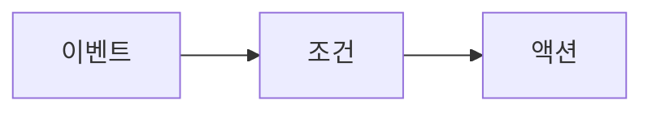

import AutomationsMentalModel from "/snippets/en/_includes/automations/mental-model.mdx";
import AutomationsActionsList from "/snippets/en/_includes/automations/actions-list.mdx";
import AutomationsBestPractices from "/snippets/en/_includes/automations/best-practices.mdx";
import AutomationsWhereToFind from "/snippets/en/_includes/automations/where-to-find-automations.mdx";

자동화는 **projects**와 **registries** 둘 다에서 지원됩니다. 자동화를 생성하는 위치, 사용할 수 있는 이벤트, 그리고 범위가 작동하는 방식은 각각 다릅니다. 범위별 이벤트 유형은 [자동화 이벤트 및 범위](/ko/models/automations/automation-events)를 참조하세요.

<AutomationsMentalModel />

**예시:** run 실패(이벤트) 및 선택 사항인 run 이름 필터(조건) 후 Slack 알림(액션). 또는: 별칭 `production` 추가(이벤트) 후 웹훅(액션).

  ## Automations를 생성할 수 있는 위치

<AutomationsWhereToFind />

  ## 사용 사례

* **run 모니터링 및 알림**: run이 실패하거나 메트릭이 임곗값을 넘을 때(예: loss가 NaN이 되거나 정확도가 떨어질 때) 팀에 알림을 보냅니다.
* **레지스트리 CI/CD**: 새 모델 버전이 연결되거나 별칭(예: `staging` 또는 `production`)이 추가되면, 테스트를 실행하거나 배포하도록 웹훅을 트리거합니다.
* **프로젝트 아티팩트 워크플로**: 새 아티팩트 버전이 생성되거나 프로젝트에 별칭이 추가되면, 후속 작업을 실행하거나 Slack에 게시합니다.

전체 이벤트 및 범위에 대한 자세한 내용은 [자동화 이벤트 및 범위](/ko/models/automations/automation-events)를 참조하세요.

  ## 자동화 작업

이벤트로 자동화가 트리거되면 다음 작업 중 하나를 수행할 수 있습니다:

<AutomationsActionsList />

구현 세부 정보는 [Slack 자동화 만들기](/ko/models/automations/create-automations/slack) 및 [웹훅 자동화 만들기](/ko/models/automations/create-automations/webhook)를 참조하세요.

  ## Automations의 작동 방식

[자동화를 생성](/ko/models/automations/create-automations)하려면 다음을 수행합니다.

1. 필요한 경우 액세스 토큰, 비밀번호, 민감한 설정 세부 정보 등 자동화에 필요한 민감한 문자열에 대해 [시크릿](/ko/platform/secrets)를 설정합니다. 시크릿은 **Team Settings**에 정의되어 있습니다. 시크릿은 웹훅 Automations에서 자격 증명이나 토큰을 평문으로 노출하거나 웹훅 페이로드에 하드코딩하지 않고 웹훅의 외부 서비스로 안전하게 전달하는 데 가장 자주 사용됩니다.
2. 팀 수준의 웹훅 또는 Slack 인테그레이션을 설정하여 W&amp;B가 사용자를 대신해 Slack에 게시하거나 웹훅을 실행할 수 있도록 승인합니다. 단일 자동화 작업(웹훅 또는 Slack 알림)은 여러 Automations에서 사용할 수 있습니다. 이러한 작업은 **Team Settings**에 정의되어 있습니다.
3. 프로젝트 또는 레지스트리에서 자동화를 생성합니다.
   1. 새 아티팩트 버전이 추가될 때와 같이 모니터링할 [이벤트](/ko/models/automations/automation-events)를 정의합니다.
   2. 이벤트가 발생할 때 수행할 작업(Slack 채널에 게시하거나 웹훅 실행)을 정의합니다. 웹훅의 경우 필요하다면 액세스 토큰에 사용할 시크릿 및/또는 페이로드와 함께 전송할 시크릿을 지정합니다.

  ## 권장 사항

<AutomationsBestPractices />

  ## 제한 사항

[run 메트릭 자동화](/ko/models/automations/automation-events/#run-metrics-events) 및 [run 메트릭 z-score 변화 자동화](/ko/models/automations/automation-events/#run-metrics-z-score-change-automations)는 현재 [W&amp;B Multi-tenant Cloud](/ko/platform/hosting/#wb-multi-tenant-cloud)에서만 지원됩니다.

  ## 다음 단계

* [Automations 튜토리얼](/ko/models/automations/tutorial): run 실패 시 알림을 보내는 프로젝트 자동화와 별칭이 추가될 때 웹훅을 실행하는 레지스트리 자동화를 만드는 방법을 안내합니다. 이 튜토리얼에서는 W&amp;B App을 사용합니다.
* [자동화를 생성](/ko/models/automations/create-automations).
* [자동화 이벤트 및 범위](/ko/models/automations/automation-events).
* [시크릿 생성](/ko/platform/secrets).

{/* Python SDK `create_automation` 회귀 문제가 수정되면 위의 Create bullet 다음에 복원하세요(내부 WB-34263):
  - [API로 Automations 관리](/models/automations/api).
  */}

<Info>
  Automations와 함께 볼 수 있는 튜토리얼을 찾고 계신가요?

  * [모델 평가 및 배포를 위해 GitHub Action을 자동으로 트리거하는 방법 알아보기](https://wandb.ai/wandb/wandb-model-cicd/reports/Model-CI-CD-with-W-B--Vmlldzo0OTcwNDQw).
  * [모델을 SageMaker 엔드포인트에 자동으로 배포하는 방법을 보여주는 비디오 보기](https://www.youtube.com/watch?v=s5CMj_w3DaQ).
  * [Automations를 소개하는 비디오 시리즈 보기](https://youtube.com/playlist?list=PLD80i8An1OEGECFPgY-HPCNjXgGu-qGO6\&feature=shared).
</Info>