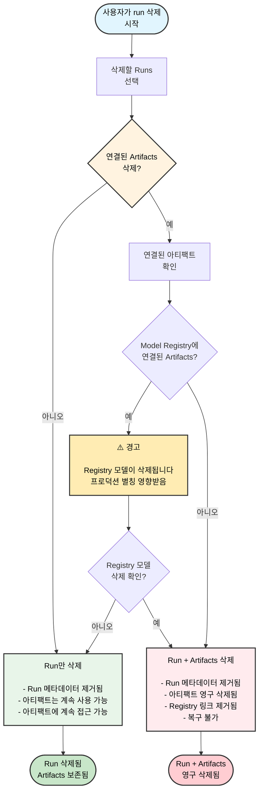

W&B App을 사용하여 프로젝트에서 하나 이상의 run을 삭제할 수 있습니다.

1. 삭제하려는 run이 포함된 프로젝트로 이동합니다.
2. **Runs** 탭을 선택합니다.
3. 삭제하려는 run 옆의 체크박스를 선택합니다.
4. 테이블 위에 있는 **Delete** 버튼(휴지통 아이콘)을 선택합니다.
5. 표시되는 드로어에서 **Delete**를 선택합니다.

<Note>
run ID는 run이 삭제된 이후에도 다시 사용할 수 없습니다. 동일한 ID를 사용하면 해당 run은 오류와 함께 실패합니다.
</Note>

<Note>
많은 수의 run이 포함된 프로젝트의 경우, 검색 창에서 정규식(Regex)을 사용해 삭제하려는 run을 필터링하거나, 필터 버튼을 사용해 상태, 태그, 기타 속성에 따라 run을 필터링할 수 있습니다.
</Note>

  ### run 삭제 플로우차트

다음 다이어그램은 관련 아티팩트와 Registry 링크 처리까지 포함한 run 삭제 전체 프로세스를 보여 줍니다.

<Warning>
  run을 삭제할 때 연결된 아티팩트를 함께 삭제하도록 선택하면, 해당 아티팩트는 영구적으로 삭제되며 나중에 run을 복원하더라도 복구할 수 없습니다. 여기에는 Registry에 연결된 아티팩트도 포함됩니다.
</Warning>
